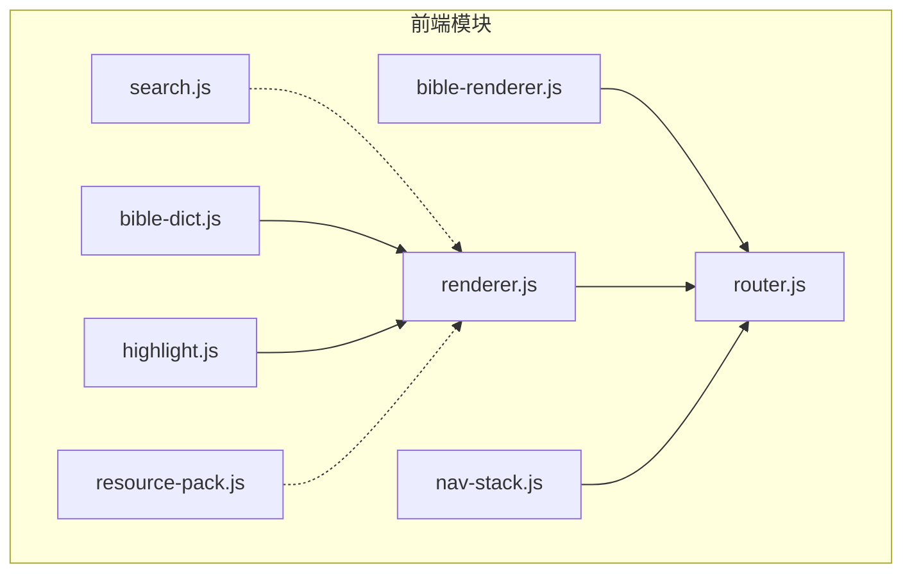
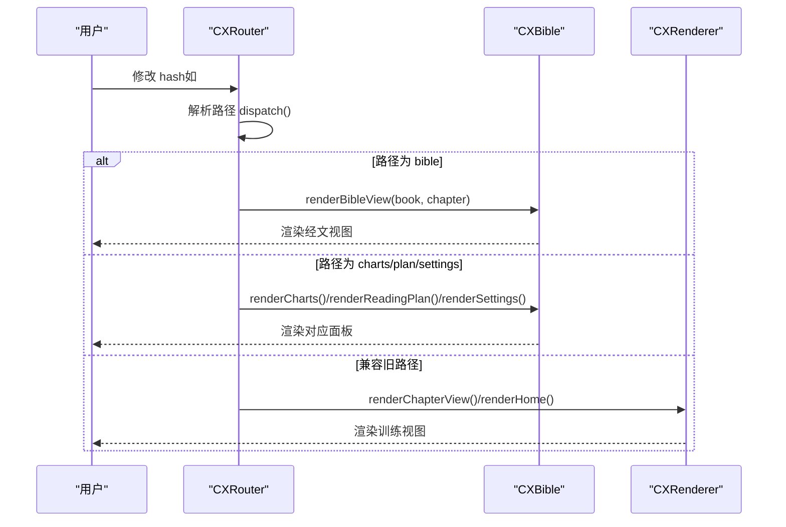
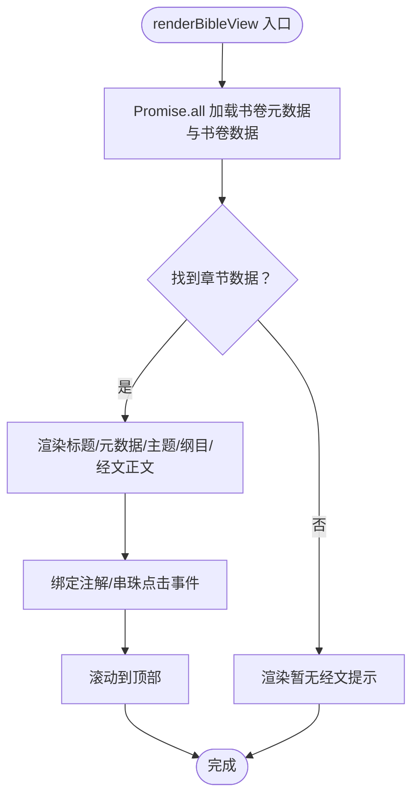
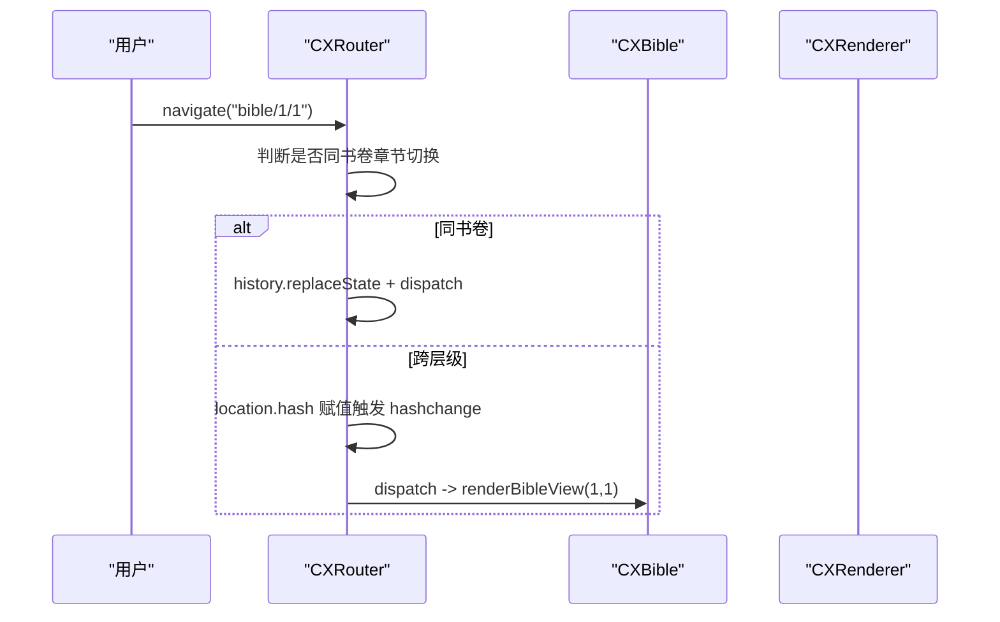
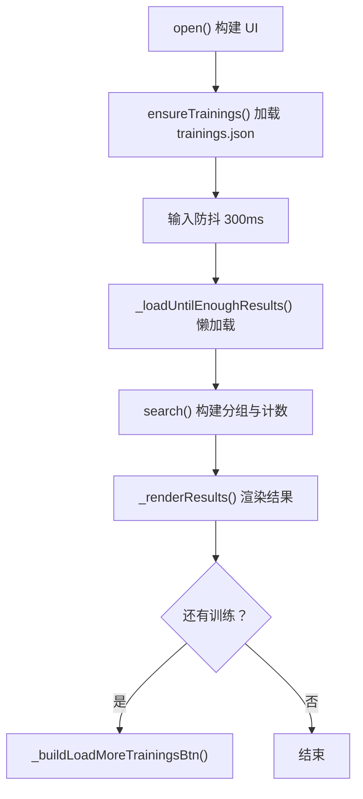
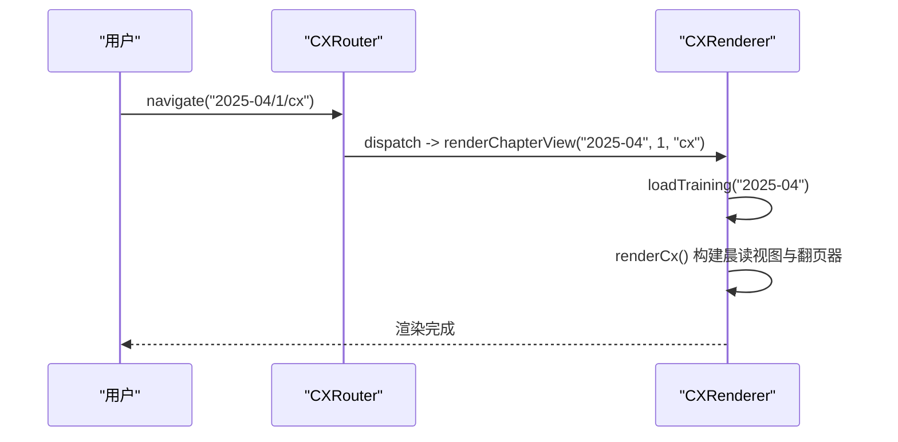
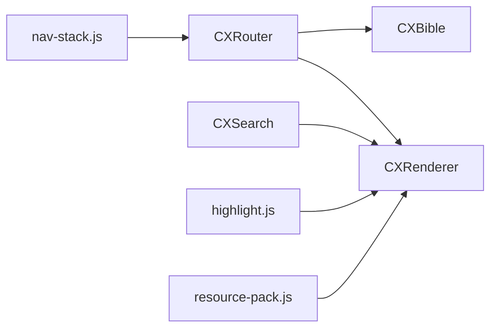

# API参考

<cite>
**本文档引用的文件**
- [bible-renderer.js](file://src/static/js/bible-renderer.js)
- [router.js](file://src/static/js/router.js)
- [search.js](file://src/static/js/search.js)
- [renderer.js](file://src/static/js/renderer.js)
- [nav-stack.js](file://src/static/js/nav-stack.js)
- [bible-dict.js](file://src/static/js/bible-dict.js)
- [highlight.js](file://src/static/js/highlight.js)
- [resource-pack.js](file://src/static/js/resource-pack.js)
</cite>

## 目录
1. [简介](#简介)
2. [项目结构](#项目结构)
3. [核心组件](#核心组件)
4. [架构总览](#架构总览)
5. [详细组件分析](#详细组件分析)
6. [依赖关系分析](#依赖关系分析)
7. [性能考虑](#性能考虑)
8. [故障排查指南](#故障排查指南)
9. [结论](#结论)
10. [附录](#附录)

## 简介
本参考文档面向“圣经阅读器”前端 JavaScript API，聚焦以下模块的公共接口与使用方式：
- 圣经阅读渲染器：bible-renderer.js
- SPA 路由：router.js
- 全文搜索：search.js
- 训练内容渲染器：renderer.js
- 导航栈与返回键处理：nav-stack.js
- 经文字典：bible-dict.js
- 划线与笔记：highlight.js
- 资源包管理：resource-pack.js

文档涵盖各模块的公开接口、参数说明、返回值类型、典型用法、事件与错误处理、以及扩展与自定义建议。

## 项目结构
- 前端入口位于 src/static/js，包含多个功能模块，分别负责渲染、路由、搜索、导航栈、资源管理等。
- 模块之间通过全局命名空间 window.CXBible、window.CXRouter、window.CXSearch、window.CXRenderer 等进行协作。
- 搜索模块与训练渲染器配合，基于训练数据生成可搜索索引并支持段落级定位与高亮。

**图表来源**
- [bible-renderer.js](file://src/static/js/bible-renderer.js)
- [router.js](file://src/static/js/router.js)
- [search.js](file://src/static/js/search.js)
- [renderer.js](file://src/static/js/renderer.js)
- [nav-stack.js](file://src/static/js/nav-stack.js)
- [bible-dict.js](file://src/static/js/bible-dict.js)
- [highlight.js](file://src/static/js/highlight.js)
- [resource-pack.js](file://src/static/js/resource-pack.js)

**章节来源**
- [bible-renderer.js](file://src/static/js/bible-renderer.js)
- [router.js](file://src/static/js/router.js)
- [search.js](file://src/static/js/search.js)
- [renderer.js](file://src/static/js/renderer.js)
- [nav-stack.js](file://src/static/js/nav-stack.js)
- [bible-dict.js](file://src/static/js/bible-dict.js)
- [highlight.js](file://src/static/js/highlight.js)
- [resource-pack.js](file://src/static/js/resource-pack.js)

## 核心组件
- 圣经阅读渲染器（CXBible）
  - 提供书卷导航、经文阅读视图、设置面板、图表与读经计划等渲染能力。
  - 关键方法：renderBookList、renderBibleView、renderSettings、renderCharts、renderReadingPlan。
  - 数据获取：loadBooksMeta、loadBookData；历史与显示开关持久化至 localStorage。
- SPA 路由（CXRouter）
  - Hash 路由，支持 navigate、navigateReplace、back、currentPath 等。
  - 路由格式：/#/、/#/bible/{book}/{chapter}、/#/charts、/#/plan/{id}、/#/settings。
- 全文搜索（CXSearch）
  - 懒加载训练索引、全屏搜索弹窗、段落级定位与高亮、结果分组与“查看更多训练”。
  - 关键方法：open、close、search、navigateTo、handleSearchTarget、handleSearchTargetSPA。
- 训练内容渲染器（CXRenderer）
  - 从 training.json 渲染各视图（纲目cv、听抄h、详情ts、诗歌sg、职事摘录zs、晨读cx）。
  - 关键方法：renderHome、renderBatchIndex、renderChapterView、renderMotto、renderMottoSong。
- 导航栈与返回键（nav-stack.js）
  - 统一处理 PWA 与 Capacitor 返回键，支持主页、目录页、内容页、标语页的差异化行为。
- 经文字典（CXBibleDict）
  - 基于经文字典数据渲染经文容器，供经文引用显示。
- 划线与笔记（highlight.js）
  - 文本选区划线、笔记、颜色与下划线样式、本地存储（IndexedDB/LocalStorage）、配对页同步。
- 资源包管理（CXResourcePack）
  - 历史训练资源包下载、缓存检查、删除与恢复、多镜像并发竞速下载。

**章节来源**
- [bible-renderer.js](file://src/static/js/bible-renderer.js)
- [router.js](file://src/static/js/router.js)
- [search.js](file://src/static/js/search.js)
- [renderer.js](file://src/static/js/renderer.js)
- [nav-stack.js](file://src/static/js/nav-stack.js)
- [bible-dict.js](file://src/static/js/bible-dict.js)
- [highlight.js](file://src/static/js/highlight.js)
- [resource-pack.js](file://src/static/js/resource-pack.js)

## 架构总览
- 路由驱动：CXRouter 解析 hash，调度 CXBible 或 CXRenderer 渲染相应视图。
- 搜索联动：CXSearch 与 CXRenderer 协作，基于训练数据构建索引，支持段落级定位与高亮。
- 数据持久化：CXBible 与 highlight.js 使用 localStorage/IndexedDB 存储用户偏好与划线数据。
- 平台适配：nav-stack.js 统一处理 PWA 与 Capacitor 返回键，避免虚假 popstate。

**图表来源**
- [router.js](file://src/static/js/router.js)
- [bible-renderer.js](file://src/static/js/bible-renderer.js)
- [renderer.js](file://src/static/js/renderer.js)

**章节来源**
- [router.js](file://src/static/js/router.js)
- [bible-renderer.js](file://src/static/js/bible-renderer.js)
- [renderer.js](file://src/static/js/renderer.js)

## 详细组件分析

### 圣经阅读渲染器（CXBible）API
- 公共方法
  - renderBookList()
    - 参数：无
    - 返回：Promise<void>（内部渲染书卷导航）
    - 说明：加载书卷元数据，渲染书卷/收藏/历史标签页、旧约/新约切换、书卷列表与章节列表。
  - renderBibleView(bookIndex, chapter)
    - 参数：bookIndex（数字，1-66）、chapter（数字）
    - 返回：Promise<void>
    - 说明：加载书卷数据，渲染经文正文、元数据、主题摘要、纲目、注解与串珠弹层。
  - renderSettings()
    - 参数：无
    - 返回：Promise<void>
    - 说明：渲染主题选择、字号滑块、显示内容开关等设置面板。
  - renderCharts()
    - 参数：无
    - 返回：Promise<void>
    - 说明：占位渲染图表页。
  - renderReadingPlan(planId)
    - 参数：planId（字符串）
    - 返回：Promise<void>
    - 说明：占位渲染读经计划页。
- 数据获取
  - loadBooksMeta()
    - 返回：Promise<数组：书卷元数据>
  - loadBookData(bookIndex)
    - 返回：Promise<对象：书卷数据或回退结构>
- 历史与开关
  - addHistory(bookIndex, chapter)
  - loadHistory()/saveHistory()
  - loadToggles()/saveToggles()

**图表来源**
- [bible-renderer.js](file://src/static/js/bible-renderer.js)

**章节来源**
- [bible-renderer.js](file://src/static/js/bible-renderer.js)

### SPA 路由（CXRouter）API
- 公共方法
  - start()
    - 参数：无
    - 返回：void
    - 说明：注册 hashchange 监听，初次派发当前路径。
  - navigate(hashPath)
    - 参数：hashPath（字符串，如 "bible/1/1"）
    - 返回：void
    - 说明：设置 hash，触发 dispatch；同书卷章节切换使用 replaceState，避免历史膨胀。
  - navigateReplace(hashPath)
    - 参数：hashPath
    - 返回：void
    - 说明：使用 history.replaceState 替换当前历史项，立即 dispatch。
  - back()
    - 参数：无
    - 返回：void
    - 说明：调用 history.back。
  - currentPath()
    - 参数：无
    - 返回：string
    - 说明：返回当前路由路径。
- 路由格式
  - "#/" 主页（书卷导航）
  - "#/bible/{book}/{chapter}" 圣经阅读
  - "#/charts" 图表页
  - "#/plan/{id}" 读经计划
  - "#/settings" 设置面板

**图表来源**
- [router.js](file://src/static/js/router.js)

**章节来源**
- [router.js](file://src/static/js/router.js)

### 全文搜索（CXSearch）API
- 公共方法
  - open()
    - 参数：无
    - 返回：void
    - 说明：构建搜索 UI，绑定输入、ESC 关闭、滚动穿透拦截等事件。
  - close()
    - 参数：无
    - 返回：void
    - 说明：关闭搜索弹窗，释放滚动锁与返回栈钩子。
  - search(query, entries)
    - 参数：query（字符串）、entries（数组：搜索条目）
    - 返回：对象 { groups[], totalVisible, totalAll }
    - 说明：多关键词 AND 子串匹配，按训练分组，当前训练优先，每组限制 MAX_PER_TRAINING。
  - navigateTo(entry, query)
    - 参数：entry（条目对象）、query（字符串）
    - 返回：void
    - 说明：通过 sessionStorage 携带目标，使用 CXRouter.navigateReplace 跳转并替换历史。
  - handleSearchTarget()/handleSearchTargetSPA()
    - 参数：无
    - 返回：void
    - 说明：目标页加载后定位并高亮匹配段落，支持传统 SPA 与 renderer 模式。
- 内部与状态
  - _searchCache：内存缓存 {path: entries[]}
  - _trainingVersions：训练版本表
  - _searchQueue：搜索队列（按已缓存路径排序）
  - _currentQuery：当前搜索词
  - _loadBatch()/_loadUntilEnoughResults()：批量懒加载训练索引
  - _ensureTrainings()：确保 trainings.json 已加载并重建队列
- 结果渲染
  - _renderResults()/_appendGroupsToEl()：渲染分组与条目
  - _buildItem()/_buildMoreBtn()：构建单项与“显示更多”
  - _buildLoadMoreTrainingsBtn()：构建“查看更多训练”

**图表来源**
- [search.js](file://src/static/js/search.js)

**章节来源**
- [search.js](file://src/static/js/search.js)

### 训练内容渲染器（CXRenderer）API
- 公共方法
  - renderHome()
    - 参数：无
    - 返回：void
    - 说明：渲染主页（训练批次列表）。
  - renderBatchIndex(batchPath)
    - 参数：batchPath（字符串）
    - 返回：void
    - 说明：渲染批次目录页。
  - renderChapterView(batchPath, chapterNum, viewType)
    - 参数：batchPath、chapterNum（数字）、viewType（'cv'|'h'|'ts'|'sg'|'zs'|'cx'）
    - 返回：void
    - 说明：渲染章节视图（纲目/听抄/详情/诗歌/职事/晨读）。
  - renderMotto(batchPath)
    - 参数：batchPath
    - 返回：void
    - 说明：渲染标语页。
  - renderMottoSong(batchPath)
    - 参数：batchPath
    - 返回：void
    - 说明：渲染标语歌曲页。
- 数据加载
  - loadTraining(batchPath)：从本地导入或缓存加载 training.json，异步缓存并触发搜索索引构建。
- 视图渲染
  - renderCv/renderH/renderTs/renderSg/renderZs/renderCx：分别渲染对应视图，构建导航与内容区域。
- 事件与交互
  - buildPageNavigation：构建章节页导航（cv/h/ts/sg/zs + 搜索按钮）。
  - buildBottomControlBar：构建底部朗读控制条（播放/暂停、循环、进度、语速）。

**图表来源**
- [router.js](file://src/static/js/router.js)
- [renderer.js](file://src/static/js/renderer.js)

**章节来源**
- [renderer.js](file://src/static/js/renderer.js)

### 导航栈与返回键（nav-stack.js）
- 功能
  - 统一处理 PWA 与 Capacitor 返回键，避免启动时的虚假 popstate。
  - 主页：根据当前路径决定“返回”行为（目录/主页/退出）。
  - 目录页/内容页/标语页：统一返回上一层或主页。
- 方法
  - initHomePage()/initDirectoryPage()/initContentPage()/initMottoPage()/initMottoSongPage()
  - setupBackHandler：注册返回键监听与兜底 fallback。

**章节来源**
- [nav-stack.js](file://src/static/js/nav-stack.js)

### 经文字典（CXBibleDict）API
- 公共方法
  - renderContainer(container)
    - 参数：HTMLElement（带有 data-refs 属性）
    - 返回：void
    - 说明：根据 data-refs 渲染经文容器，未命中时降级显示引用文本。

**章节来源**
- [bible-dict.js](file://src/static/js/bible-dict.js)

### 划线与笔记（highlight.js）API
- 公共方法
  - init()：初始化存储与事件监听，迁移旧数据。
  - redoHighlights()：异步内容渲染后重算并恢复划线。
  - getPageKey()/getPairedPageKey()：计算页面存储键与配对页键。
  - addHighlight(color?, underline?)：基于当前选区创建划线，保存并同步。
  - updateHighlight(id, changes)：更新颜色/下划线。
  - removeHighlight(id)/removeMark(id)/saveNote(id, text)/removeNote(id)
  - clearAllHighlights()/clearAllHighlightsForce()：清理当前页或全站数据。
- 存储
  - 采用 localforage（IndexedDB）为主，localStorage 为降级方案；支持跨平台路径规范化与迁移。
- 配对同步
  - cv 与 cx 视图共享纲目文本，自动同步划线与笔记。

**章节来源**
- [highlight.js](file://src/static/js/highlight.js)

### 资源包管理（CXResourcePack）API
- 公共方法
  - showPacksDialog(backFn?)
  - showCachedDialog(backFn?, initialTab?)
  - isPackCached(pack)：Promise<boolean>
- 功能
  - 下载历史训练资源包（JSZip 解压 + Cache API 写入），并发竞速镜像。
  - 删除整包/单个训练缓存，恢复已删除的初始安装训练。
  - 多 Tab 界面：默认/历史/导入，支持全选与批量删除。

**章节来源**
- [resource-pack.js](file://src/static/js/resource-pack.js)

## 依赖关系分析
- 模块耦合
  - CXRouter 依赖 CXBible 与 CXRenderer 进行视图调度。
  - CXSearch 依赖 CXRenderer 的训练数据与视图结构，通过 sessionStorage 与路由桥接定位。
  - highlight.js 与 renderer.js 协作，基于页面路径与 hash 写入/读取划线数据。
  - nav-stack.js 与 router.js 协作，统一处理返回键与历史栈。
  - resource-pack.js 与 renderer.js 协作，提供训练缓存与恢复能力。
- 外部依赖
  - localforage（IndexedDB）、JSZip（资源包解压）、Cache API（SW 缓存）。
  - Capacitor 插件（Android 返回键）。

**图表来源**
- [router.js](file://src/static/js/router.js)
- [bible-renderer.js](file://src/static/js/bible-renderer.js)
- [search.js](file://src/static/js/search.js)
- [renderer.js](file://src/static/js/renderer.js)
- [nav-stack.js](file://src/static/js/nav-stack.js)
- [highlight.js](file://src/static/js/highlight.js)
- [resource-pack.js](file://src/static/js/resource-pack.js)

**章节来源**
- [router.js](file://src/static/js/router.js)
- [bible-renderer.js](file://src/static/js/bible-renderer.js)
- [search.js](file://src/static/js/search.js)
- [renderer.js](file://src/static/js/renderer.js)
- [nav-stack.js](file://src/static/js/nav-stack.js)
- [highlight.js](file://src/static/js/highlight.js)
- [resource-pack.js](file://src/static/js/resource-pack.js)

## 性能考虑
- 懒加载与缓存
  - CXSearch 批量加载训练索引，按需追加结果，减少首屏压力。
  - CXBible 与 CXRenderer 对书卷数据与训练数据进行内存缓存，避免重复请求。
- 存储优化
  - highlight.js 使用 IndexedDB/LocalStorage，支持迁移与路径规范化，降低跨平台冲突。
- 路由与历史
  - 同书卷章节切换使用 replaceState，避免历史膨胀；navigateReplace 用于显式层级跳转。
- 资源包下载
  - JSZip 解压与 Cache API 写入，支持镜像并发竞速，提升下载稳定性与速度。

[本节为通用指导，无需特定文件引用]

## 故障排查指南
- 路由不生效
  - 确认 CXRouter.start() 已调用；检查 hashchange 事件是否被拦截或覆盖。
  - 检查 navigate/navigateReplace 的调用时机，避免与 replaceState 冲突。
- 搜索无结果
  - 确认 _ensureTrainings() 成功加载 trainings.json；检查 _searchQueue 与 _searchCache。
  - 确认输入防抖与分批加载逻辑未被中断。
- 划线丢失或错位
  - 确认 getPageKey 与 SPA 模式下的 hash 推导一致；异步内容渲染后调用 redoHighlights。
  - 检查 IndexedDB/LocalStorage 可用性与迁移状态。
- 资源包下载失败
  - 检查镜像可用性与网络权限；确认 Cache API 可用；查看并发竞速日志。
- 返回键异常
  - 检查 nav-stack.js 的 fallback 与 grace period；确认 Capacitor/PWA 环境分支逻辑。

**章节来源**
- [router.js](file://src/static/js/router.js)
- [search.js](file://src/static/js/search.js)
- [highlight.js](file://src/static/js/highlight.js)
- [resource-pack.js](file://src/static/js/resource-pack.js)
- [nav-stack.js](file://src/static/js/nav-stack.js)

## 结论
本参考文档梳理了圣经阅读器前端 JavaScript 的核心 API，涵盖渲染、路由、搜索、导航栈、资源管理、划线与经文字典等模块。通过明确的接口定义、参数与返回值说明、典型用法与故障排查建议，开发者可以高效集成与扩展功能，同时保持良好的性能与用户体验。

[本节为总结性内容，无需特定文件引用]

## 附录
- 事件系统
  - 模块间通过全局命名空间与路由事件协作，未发现集中式事件总线。
  - 建议在自定义扩展中遵循“最小耦合、明确职责”的原则，避免跨模块强依赖。
- 错误处理
  - 大多数异步操作使用 Promise.catch 输出日志；建议在业务层增加用户可见的错误提示。
- 扩展与自定义
  - 新增视图：参考 renderer.js 的视图渲染模式，确保与现有导航与存储约定一致。
  - 新增路由：在 router.js 中扩展 dispatch 分支，并在 CXBible/CXRenderer 中实现对应渲染方法。
  - 新增搜索：在 search.js 中扩展索引构建与查询逻辑，注意分组与优先级策略。

[本节为通用指导，无需特定文件引用]