# 事件系统

<cite>
**本文档引用的文件**
- [dev-console.js](file://output/js/dev-console.js)
- [router.js](file://output/js/router.js)
- [renderer.js](file://output/js/renderer.js)
- [search.js](file://output/js/search.js)
- [theme-toggle.js](file://output/js/theme-toggle.js)
- [speech.js](file://output/js/speech.js)
- [outline.js](file://output/js/outline.js)
- [highlight.js](file://output/js/highlight.js)
</cite>

## 目录
1. [简介](#简介)
2. [项目结构](#项目结构)
3. [核心组件](#核心组件)
4. [架构概览](#架构概览)
5. [详细组件分析](#详细组件分析)
6. [依赖分析](#依赖分析)
7. [性能考虑](#性能考虑)
8. [故障排查指南](#故障排查指南)
9. [结论](#结论)
10. [附录](#附录)

## 简介
本文件为该项目前端事件系统的完整API参考文档，聚焦以下主题：
- 事件监听机制：addEventListener()的使用方式、事件类型定义、回调函数注册
- 事件触发API：dispatchEvent()事件分发、自定义事件创建、事件冒泡控制
- 事件委托模式：事件代理实现、DOM事件处理、性能优化策略
- 全局事件管理：事件命名空间、事件生命周期、内存泄漏防护
- 扩展方法：自定义事件类型、事件处理器链、异步事件处理
- 事件调试工具与性能监控方法

本项目采用原生DOM事件与自定义事件相结合的方式，围绕路由、渲染、搜索、主题切换、语音朗读、划线笔记等功能模块构建事件体系。

## 项目结构
前端事件系统主要分布在以下JavaScript模块中：
- 路由与导航：router.js
- 页面渲染与交互：renderer.js
- 搜索与结果高亮：search.js
- 主题与设置面板：theme-toggle.js
- 语音朗读控制：speech.js
- 纲目展开/收起：outline.js
- 划线与笔记：highlight.js
- 开发者控制台与错误捕获：dev-console.js

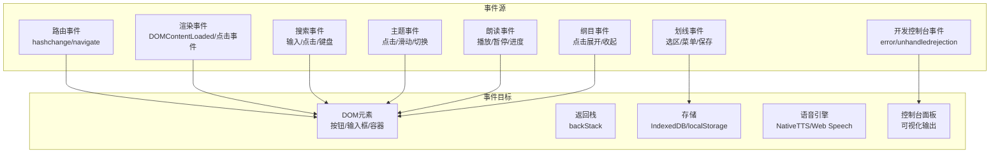

图表来源
- [router.js](file://output/js/router.js)
- [renderer.js](file://output/js/renderer.js)
- [search.js](file://output/js/search.js)
- [theme-toggle.js](file://output/js/theme-toggle.js)
- [speech.js](file://output/js/speech.js)
- [outline.js](file://output/js/outline.js)
- [highlight.js](file://output/js/highlight.js)
- [dev-console.js](file://output/js/dev-console.js)

章节来源
- [router.js](file://output/js/router.js)
- [renderer.js](file://output/js/renderer.js)
- [search.js](file://output/js/search.js)
- [theme-toggle.js](file://output/js/theme-toggle.js)
- [speech.js](file://output/js/speech.js)
- [outline.js](file://output/js/outline.js)
- [highlight.js](file://output/js/highlight.js)
- [dev-console.js](file://output/js/dev-console.js)

## 核心组件
- 路由事件系统：负责URL变更监听、导航、返回栈管理与历史记录控制
- 渲染与交互事件：负责页面内容渲染、用户交互（点击/输入/键盘）、滚动与尺寸变化
- 搜索事件：负责全文检索、结果展示、高亮定位与导航
- 主题与设置事件：负责主题切换、字体大小、偏好设置、安装提示等
- 语音朗读事件：负责文本朗读、进度更新、媒体会话控制
- 纲目与划线事件：负责大纲展开/收起、文本选区处理、笔记持久化
- 开发控制台事件：负责全局错误捕获、未处理Promise拒绝、日志缓冲与可视化

章节来源
- [router.js](file://output/js/router.js)
- [renderer.js](file://output/js/renderer.js)
- [search.js](file://output/js/search.js)
- [theme-toggle.js](file://output/js/theme-toggle.js)
- [speech.js](file://output/js/speech.js)
- [outline.js](file://output/js/outline.js)
- [highlight.js](file://output/js/highlight.js)
- [dev-console.js](file://output/js/dev-console.js)

## 架构概览
事件系统采用“事件源 → 事件监听器 → 事件处理”的分层设计：
- 事件源：浏览器原生事件（如hashchange、click、keydown、visibilitychange等）与自定义事件（如backStack、dialog等）
- 事件监听器：addEventListener()注册的回调函数，负责解析事件、更新状态、触发副作用
- 事件处理：根据事件类型执行相应业务逻辑（导航、渲染、存储、语音、高亮等）

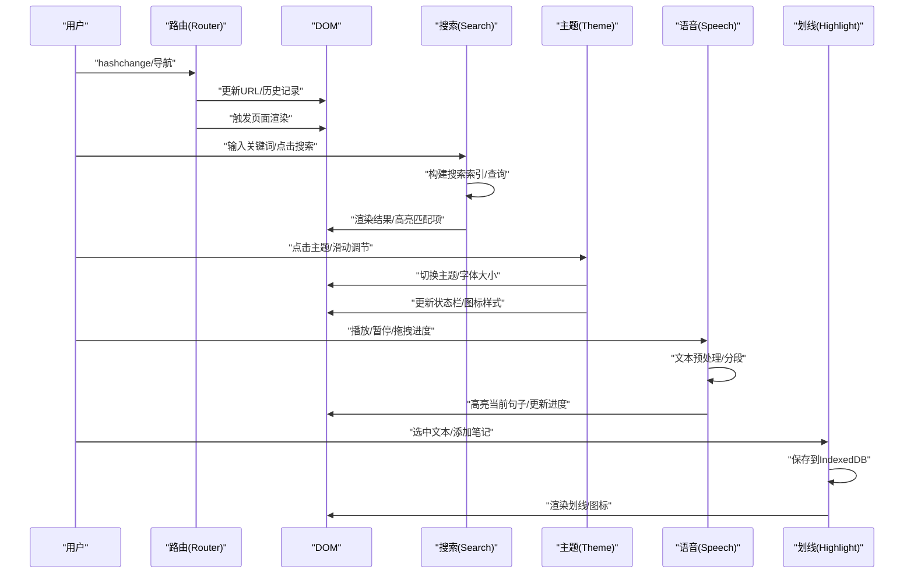

图表来源
- [router.js](file://output/js/router.js)
- [search.js](file://output/js/search.js)
- [theme-toggle.js](file://output/js/theme-toggle.js)
- [speech.js](file://output/js/speech.js)
- [highlight.js](file://output/js/highlight.js)

## 详细组件分析

### 路由事件系统（Router）
- 事件监听
  - 监听hashchange事件，解析当前路径，决定渲染目标
  - 使用addEventListener注册回调，处理路由切换
- 事件触发
  - navigate()与navigateReplace()触发URL变更，间接引发hashchange
  - navigateReplace()使用history.replaceState避免历史记录膨胀
- 事件冒泡控制
  - 通过_skipNextDispatch与_ghost entry跳过策略，避免浏览器实现差异导致的重复dispatch
- 生命周期
  - start()启动监听；back()调用history.back()；currentPath()返回当前路径
- 性能优化
  - 同书卷/同章节视图切换使用replaceState，避免历史条目堆积
  - 对同书卷章节切换进行快速路径判断，减少不必要的渲染

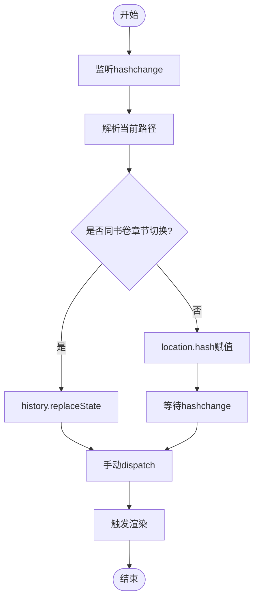

图表来源
- [router.js](file://output/js/router.js)

章节来源
- [router.js](file://output/js/router.js)

### 渲染与交互事件（Renderer）
- 事件监听
  - 监听DOMContentLoaded，确保DOM就绪后执行初始化
  - 为导航按钮、输入框、滑块等元素注册点击/输入/change事件
- 事件触发
  - 点击事件触发页面切换、视图切换、翻页等
  - 输入事件触发搜索建议、字体大小调节等
- 事件冒泡控制
  - 使用事件委托减少监听器数量，提高性能
- 生命周期
  - renderHome/renderBatchIndex/renderChapterView等渲染函数负责内容生成与挂载
- 性能优化
  - 使用requestAnimationFrame优化滚动与尺寸更新
  - 按需加载与缓存训练数据，避免重复fetch

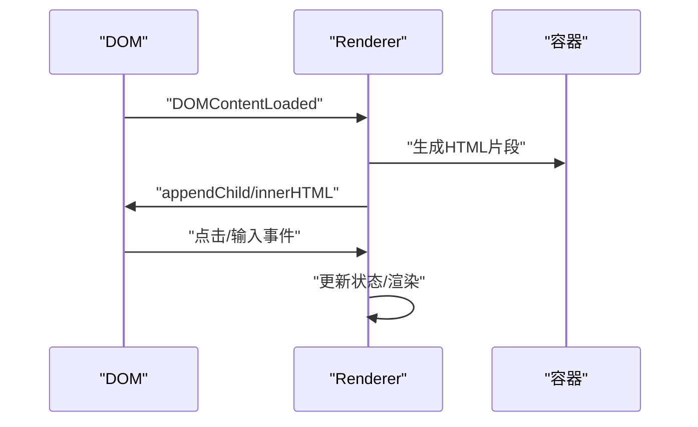

图表来源
- [renderer.js](file://output/js/renderer.js)

章节来源
- [renderer.js](file://output/js/renderer.js)

### 搜索事件系统（Search）
- 事件监听
  - 监听输入框输入，使用防抖与搜索队列机制
  - 监听点击“查看更多训练”、“跳转到结果”等交互
- 事件触发
  - 输入触发搜索队列加载与查询，结果分组展示
  - 点击结果触发导航到目标章节，并高亮匹配段落
- 事件冒泡控制
  - 使用事件委托与最小监听器数量，降低内存占用
- 生命周期
  - open()/close()控制模态框显示/隐藏
  - handleSearchTarget()/handleSearchTargetSPA()负责目标页高亮定位
- 性能优化
  - 懒加载训练索引，分批加载与缓存
  - 使用TextQuoteSelector进行文本匹配与自愈

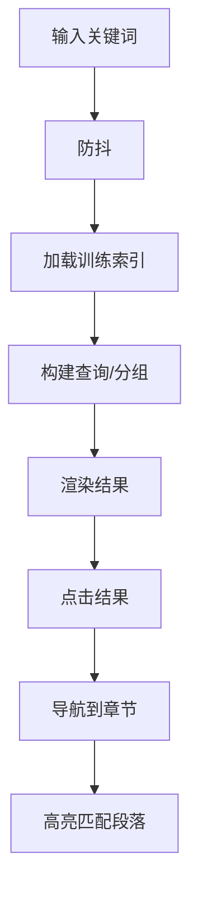

图表来源
- [search.js](file://output/js/search.js)

章节来源
- [search.js](file://output/js/search.js)

### 主题与设置事件（Theme Toggle）
- 事件监听
  - 监听点击设置按钮、主题色卡、字体滑块、滑动开关等
  - 监听ESC键关闭面板、点击外部区域关闭面板
- 事件触发
  - 点击触发主题切换、字体大小调整、偏好设置更新
  - 滑动触发朗读速度调节
- 事件冒泡控制
  - 使用事件委托与阻止冒泡，避免干扰底层交互
- 生命周期
  - initThemeToggle()初始化UI与事件；toggleThemePanel()控制面板显示
  - 支持系统深浅色跟随与状态栏样式同步
- 性能优化
  - 使用CSS变量与类名切换，避免频繁DOM操作
  - 滚动锁定与触摸穿透防护

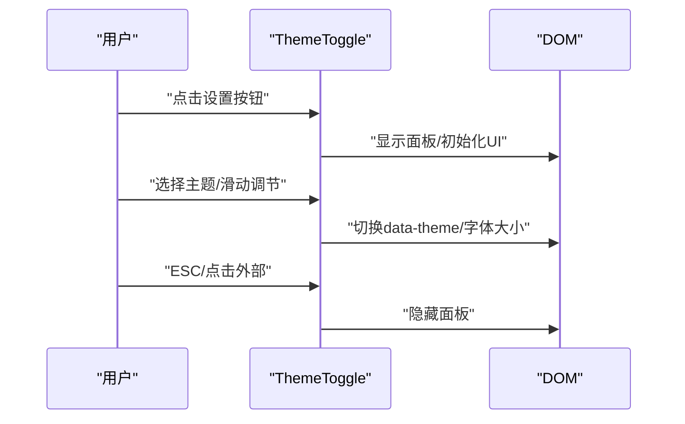

图表来源
- [theme-toggle.js](file://output/js/theme-toggle.js)

章节来源
- [theme-toggle.js](file://output/js/theme-toggle.js)

### 语音朗读事件（Speech）
- 事件监听
  - 监听播放/暂停按钮、循环按钮、速率选择、进度条拖拽
  - 监听hashchange，页面切换时停止朗读
- 事件触发
  - 播放触发文本分段与高亮，进度更新驱动UI与DOM高亮
  - 循环播放时重置状态并重新开始
- 事件冒泡控制
  - 使用状态机管理播放/暂停/空闲状态，避免竞态
- 生命周期
  - init()初始化引擎与UI；cancel()停止朗读；resetState()清理资源
- 性能优化
  - NativeTTS与Web Speech双引擎，按平台选择最优方案
  - 句子级高亮与字符级进度互补，提升体验

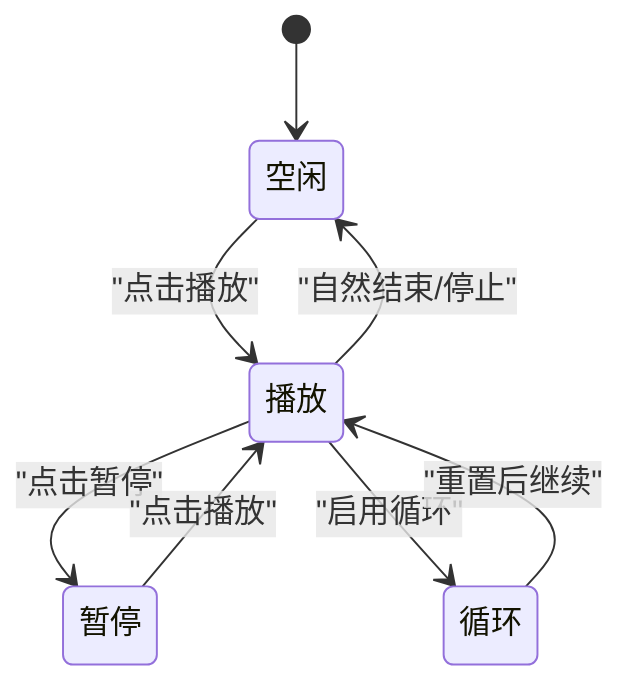

图表来源
- [speech.js](file://output/js/speech.js)

章节来源
- [speech.js](file://output/js/speech.js)

### 纲目展开/收起事件（Outline）
- 事件监听
  - 监听展开/收起按钮点击，切换子节点显示状态
- 事件触发
  - 点击切换对应子节点的display属性，并更新前缀图标状态
- 事件冒泡控制
  - 事件委托到父容器，减少监听器数量
- 生命周期
  - toggleSection()与expandToLevel()分别处理单节点与多节点展开
- 性能优化
  - 使用CSS display切换，避免复杂布局重排

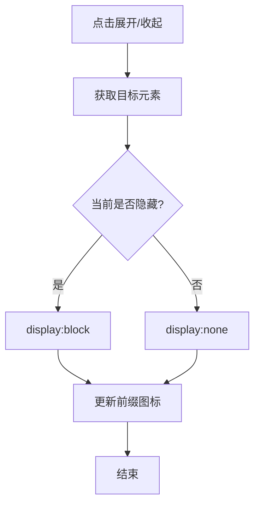

图表来源
- [outline.js](file://output/js/outline.js)

章节来源
- [outline.js](file://output/js/outline.js)

### 划线与笔记事件（Highlight）
- 事件监听
  - 监听文本选区、右键菜单、颜色/下划线/笔记操作
  - 监听页面渲染完成，恢复划线与笔记
- 事件触发
  - 选区触发划线创建，保存到IndexedDB；笔记编辑触发更新
  - 配对页同步确保cv/cx视图一致性
- 事件冒泡控制
  - 使用事件委托与最小监听器数量，避免重复绑定
- 生命周期
  - init()初始化存储与事件；restoreHighlights()恢复持久化数据
- 性能优化
  - IndexedDB存储与迁移，localStorage降级；TextQuoteSelector自愈机制

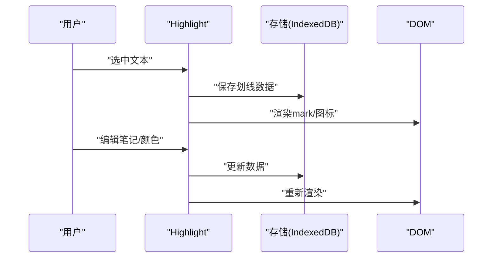

图表来源
- [highlight.js](file://output/js/highlight.js)

章节来源
- [highlight.js](file://output/js/highlight.js)

### 开发者控制台事件（Dev Console）
- 事件监听
  - 监听window.error与unhandledrejection，捕获全局异常
  - 监听DOMContentLoaded，初始化控制台面板
- 事件触发
  - 异常被捕获后写入缓冲区，支持复制、清除、展开/折叠
- 事件冒泡控制
  - 仅在必要时阻止默认行为，避免干扰浏览器调试
- 生命周期
  - init()/destroy()控制面板创建/销毁；缓冲最多500条日志
- 性能优化
  - 限制缓冲大小与DOM节点数量，避免内存泄漏

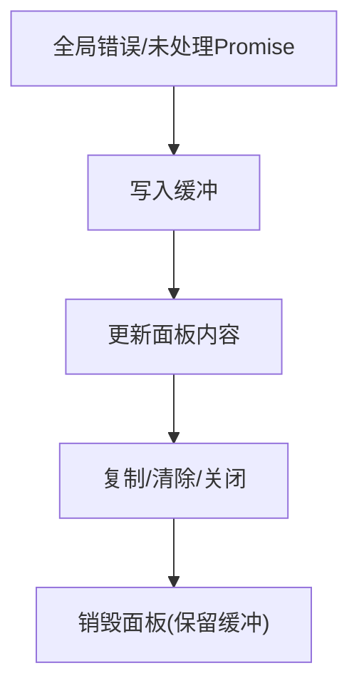

图表来源
- [dev-console.js](file://output/js/dev-console.js)

章节来源
- [dev-console.js](file://output/js/dev-console.js)

## 依赖分析
- 事件耦合
  - 路由与渲染强耦合：路由变更驱动渲染；渲染依赖DOM就绪
  - 搜索与渲染弱耦合：搜索结果通过渲染函数展示
  - 主题与渲染弱耦合：主题切换影响样式与UI，不直接影响业务逻辑
  - 语音与渲染弱耦合：朗读高亮依赖DOM结构
  - 划线与存储强耦合：持久化依赖IndexedDB/localStorage
- 外部依赖
  - 浏览器API：fetch、IndexedDB、speechSynthesis、localStorage、caches
  - 第三方库：localforage（IndexedDB封装）
- 循环依赖
  - 未发现明显循环依赖；模块间通过事件与回调解耦

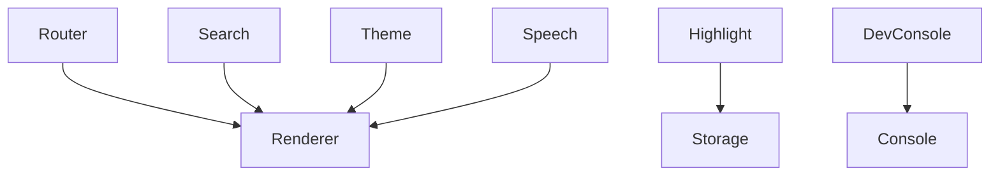

图表来源
- [router.js](file://output/js/router.js)
- [renderer.js](file://output/js/renderer.js)
- [search.js](file://output/js/search.js)
- [theme-toggle.js](file://output/js/theme-toggle.js)
- [speech.js](file://output/js/speech.js)
- [highlight.js](file://output/js/highlight.js)
- [dev-console.js](file://output/js/dev-console.js)

章节来源
- [router.js](file://output/js/router.js)
- [renderer.js](file://output/js/renderer.js)
- [search.js](file://output/js/search.js)
- [theme-toggle.js](file://output/js/theme-toggle.js)
- [speech.js](file://output/js/speech.js)
- [highlight.js](file://output/js/highlight.js)
- [dev-console.js](file://output/js/dev-console.js)

## 性能考虑
- 事件监听器数量控制
  - 使用事件委托减少监听器数量，降低内存占用
  - 避免在循环中重复绑定事件
- DOM操作优化
  - 使用DocumentFragment批量插入，减少重排
  - 使用CSS类名切换替代频繁的内联样式修改
- 异步与缓存
  - 搜索与渲染采用分批加载与缓存策略
  - IndexedDB存储与迁移，避免主线程阻塞
- 语音与高亮
  - NativeTTS与Web Speech双引擎，按平台选择最优方案
  - 句子级高亮与字符级进度互补，提升流畅度

## 故障排查指南
- 路由问题
  - 症状：返回键无效或重复渲染
  - 排查：检查_skipNextDispatch与backStack配置
  - 参考：[router.js](file://output/js/router.js)
- 搜索无结果
  - 症状：输入无响应或结果为空
  - 排查：确认训练索引是否加载、缓存是否有效
  - 参考：[search.js](file://output/js/search.js)
- 语音不工作
  - 症状：点击播放无反应
  - 排查：检查引擎检测与插件可用性
  - 参考：[speech.js](file://output/js/speech.js)
- 划线丢失
  - 症状：刷新后划线消失
  - 排查：检查IndexedDB/localStorage可用性与迁移状态
  - 参考：[highlight.js](file://output/js/highlight.js)
- 控制台不显示
  - 症状：错误未被捕获或面板不出现
  - 排查：确认初始化调用与DOM就绪
  - 参考：[dev-console.js](file://output/js/dev-console.js)

章节来源
- [router.js](file://output/js/router.js)
- [search.js](file://output/js/search.js)
- [speech.js](file://output/js/speech.js)
- [highlight.js](file://output/js/highlight.js)
- [dev-console.js](file://output/js/dev-console.js)

## 结论
本项目的事件系统以原生DOM事件为核心，结合自定义事件与模块化设计，实现了路由导航、页面渲染、全文搜索、主题切换、语音朗读、划线笔记与开发者调试等完整功能。通过事件委托、异步加载、存储抽象与引擎选择等策略，系统在易用性、性能与可维护性之间取得了良好平衡。建议在扩展新功能时遵循现有模式，保持事件监听器数量可控、状态更新明确、资源清理及时。

## 附录
- 事件API清单
  - 路由：start()/navigate()/navigateReplace()/back()/currentPath()
  - 搜索：open()/close()/search()/navigateTo()/handleSearchTarget()/handleSearchTargetSPA()
  - 主题：toggleThemePanel()/setTheme()/handleFontSliderChange()/handleSpeechRateChange()
  - 语音：init()/cancel()/resetState()
  - 划线：init()/addHighlight()/updateHighlight()/removeHighlight()/saveNote()/clearAllHighlights()
  - 开发控制台：init()/destroy()