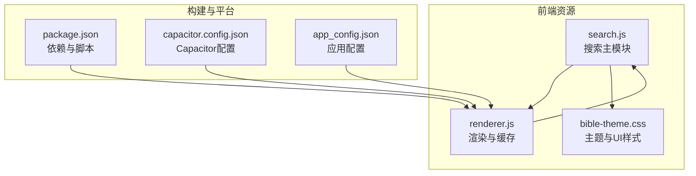
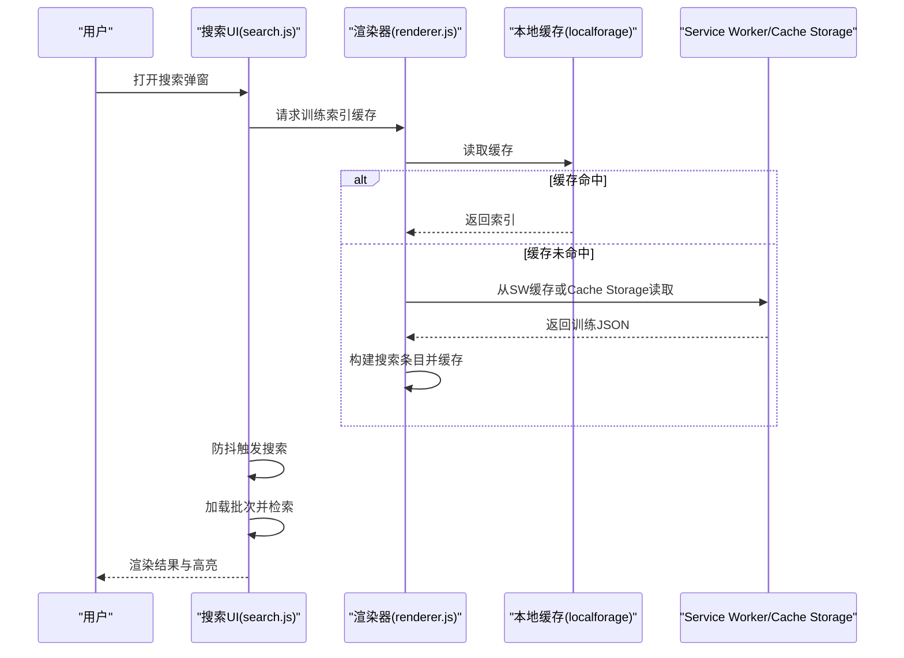
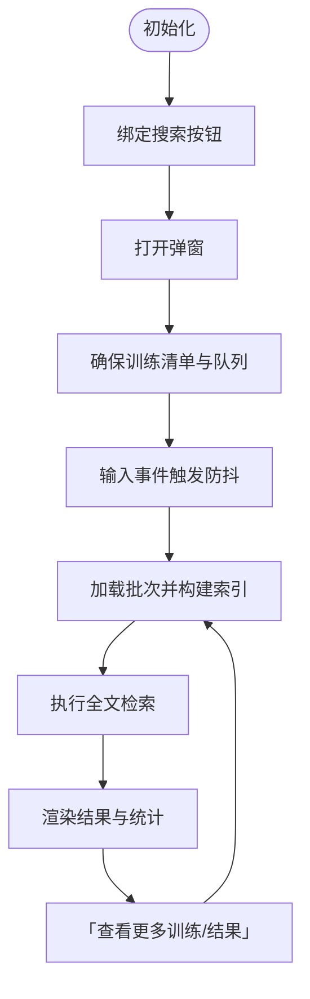
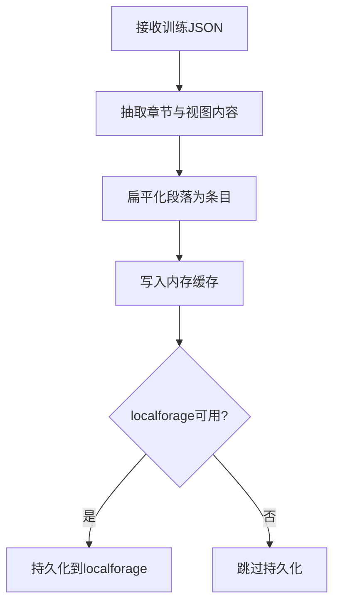
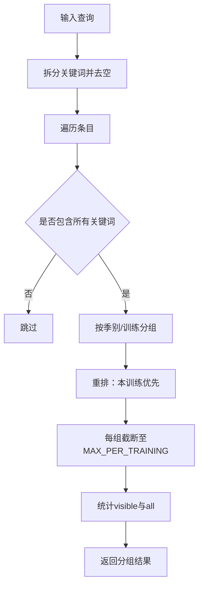
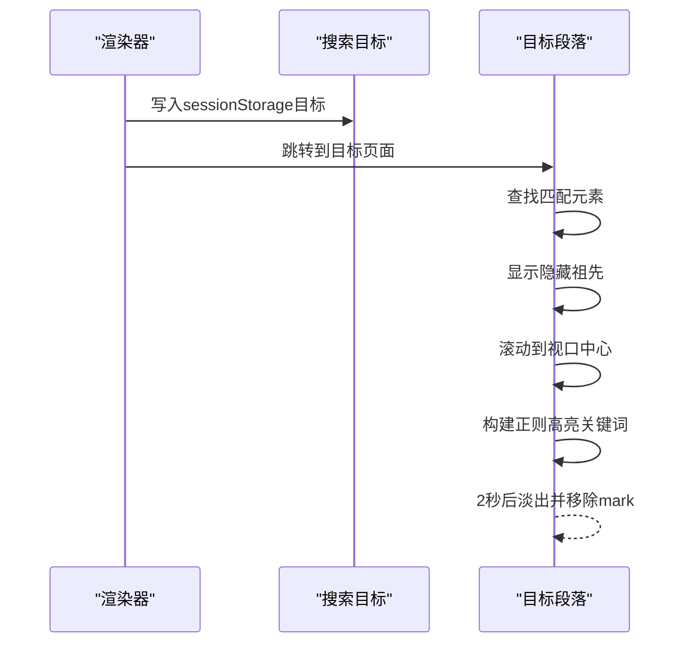
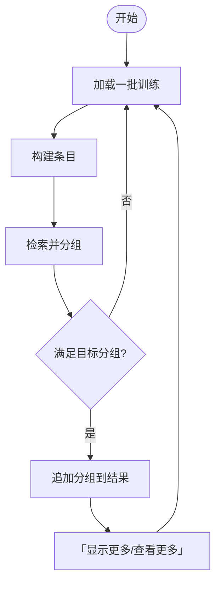
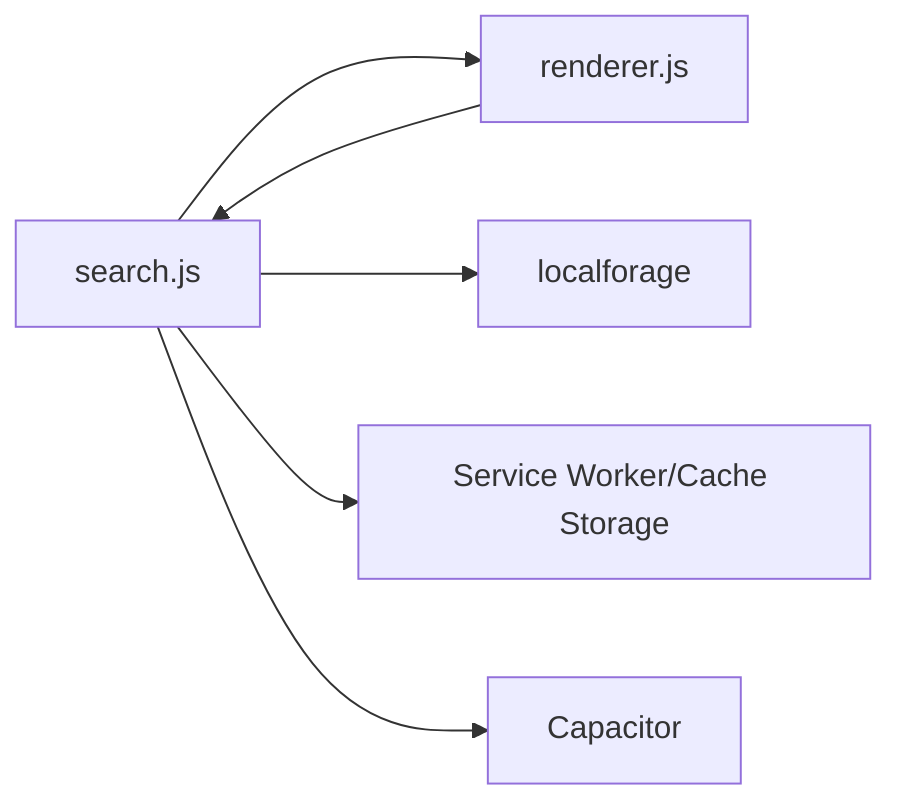

# 搜索API

<cite>
**本文档引用的文件**
- [search.js](file://src/static/js/search.js)
- [renderer.js](file://src/static/js/renderer.js)
- [bible-theme.css](file://src/static/css/bible-theme.css)
- [package.json](file://package.json)
- [capacitor.config.json](file://capacitor.config.json)
- [app_config.json](file://app_config.json)
</cite>

## 目录
1. [简介](#简介)
2. [项目结构](#项目结构)
3. [核心组件](#核心组件)
4. [架构总览](#架构总览)
5. [详细组件分析](#详细组件分析)
6. [依赖关系分析](#依赖关系分析)
7. [性能考量](#性能考量)
8. [故障排查指南](#故障排查指南)
9. [结论](#结论)
10. [附录](#附录)

## 简介
本文件为“特会信息合集”项目的搜索API参考文档，聚焦于前端搜索模块 search.js 的实现与使用。内容涵盖：
- 搜索函数实现原理：全文检索算法、索引构建方法、搜索结果排序机制
- 搜索查询构建API：关键词处理、搜索条件组合、模糊匹配策略
- 搜索结果处理函数：结果高亮显示、分页加载、结果统计
- 搜索性能优化技术：搜索缓存、防抖处理、异步加载
- 搜索扩展接口：自定义搜索范围、搜索权重调整、搜索历史管理
- 搜索功能的调试方法与常见问题解决方案

## 项目结构
搜索功能位于前端静态资源目录中，核心文件如下：
- 搜索主模块：src/static/js/search.js
- 页面渲染与索引缓存：src/static/js/renderer.js
- 主题样式与搜索UI：src/static/css/bible-theme.css
- 构建与平台配置：package.json、capacitor.config.json、app_config.json

**图表来源**
- [search.js](file://src/static/js/search.js)
- [renderer.js](file://src/static/js/renderer.js)
- [bible-theme.css](file://src/static/css/bible-theme.css)
- [package.json](file://package.json)
- [capacitor.config.json](file://capacitor.config.json)
- [app_config.json](file://app_config.json)

**章节来源**
- [search.js](file://src/static/js/search.js)
- [renderer.js](file://src/static/js/renderer.js)
- [bible-theme.css](file://src/static/css/bible-theme.css)
- [package.json](file://package.json)
- [capacitor.config.json](file://capacitor.config.json)
- [app_config.json](file://app_config.json)

## 核心组件
- 搜索对象 CXSearch：封装搜索UI、索引缓存、查询与结果渲染
- 索引构建器：从训练数据提取可搜索条目
- 搜索引擎：基于关键词AND匹配的子串检索
- 结果处理器：分组、排序、高亮与分页展示
- 缓存与加载：内存缓存、localforage持久化、SW/Cache Storage兜底

**章节来源**
- [search.js](file://src/static/js/search.js)
- [renderer.js](file://src/static/js/renderer.js)

## 架构总览
搜索流程从打开搜索弹窗开始，通过渲染器预缓存训练索引，随后按批次加载训练数据，执行全文检索并渲染结果。支持“查看更多训练”和“显示更多结果”的增量加载。

**图表来源**
- [search.js](file://src/static/js/search.js)
- [renderer.js](file://src/static/js/renderer.js)

## 详细组件分析

### 搜索对象与生命周期
- 初始化：init() 在页面加载后绑定搜索按钮，处理跳转高亮目标
- 打开/关闭：open()/close() 控制模态弹窗，锁定滚动，维护backStack
- 输入监听：input 与 compositionend 事件，配合300ms防抖
- 搜索执行：_doSearch() 负责加载训练、检索与渲染

**图表来源**
- [search.js](file://src/static/js/search.js)

**章节来源**
- [search.js](file://src/static/js/search.js)

### 索引构建与缓存
- _buildSearchEntries(path, data)：从训练JSON抽取可搜索条目，包含听抄、纲目、晨读、职事摘录等视图内容
- _cacheTraining(path, data)：构建条目并写入内存缓存，同时持久化到 localforage
- _ensureTrainings()：加载 trainings.json，建立版本表，重建搜索队列
- _filterCachedPaths(paths)：过滤已缓存的训练（SW缓存键、main缓存、本地索引）

**图表来源**
- [search.js](file://src/static/js/search.js)

**章节来源**
- [search.js](file://src/static/js/search.js)

### 全文检索与结果排序
- 关键词处理：按空白分割，转小写，多词AND匹配
- 检索范围：章节标题 + 段落文本
- 分组策略：按训练季别或训练名分组，保持出现顺序
- 排序规则：
  - 本训练优先（当前URL解析出的训练路径）
  - 当前训练内：当前章节优先，其余按原文顺序
  - 每组最多显示MAX_PER_TRAINING条
- 结果统计：totalAll(totalAll)、totalVisible(visible总数)

**图表来源**
- [search.js](file://src/static/js/search.js)

**章节来源**
- [search.js](file://src/static/js/search.js)

### 结果高亮与定位
- extractSnippet：提取关键词附近上下文，用“…”省略，对关键词进行mark高亮
- handleSearchTarget/handleSearchTargetSPA：根据sessionStorage中的目标，滚动到匹配段落，高亮关键词
- 针对晨读（cx）：根据day_index限定范围，点击对应day-link展开页面后再滚动定位

**图表来源**
- [search.js](file://src/static/js/search.js)

**章节来源**
- [search.js](file://src/static/js/search.js)

### 分页加载与增量展示
- 每批加载SEARCH_BATCH_SIZE个训练，持续加载直到满足目标分组数
- “显示更多结果”：按LOAD_MORE_BATCH追加可见条目
- “查看更多训练”：继续加载下一批训练并追加分组

**图表来源**
- [search.js](file://src/static/js/search.js)

**章节来源**
- [search.js](file://src/static/js/search.js)

### 搜索UI与交互
- _buildUI：注入CSS与DOM，绑定输入、关闭、ESC等事件
- 防穿透滚动：拦截results区域滚动，边界处阻止传播
- 按钮与快捷键：搜索按钮绑定、Esc关闭、输入防抖

**章节来源**
- [search.js](file://src/static/js/search.js)

## 依赖关系分析
- 与渲染器的耦合：渲染器负责预缓存索引，搜索模块依赖其缓存
- 与本地存储：localforage用于持久化搜索索引，提升二次打开速度
- 与Service Worker/Cache Storage：在无localforage或SW环境下，从缓存读取训练JSON
- 与Capacitor：原生App场景下，使用Cache Storage兜底读取

**图表来源**
- [search.js](file://src/static/js/search.js)
- [renderer.js](file://src/static/js/renderer.js)

**章节来源**
- [search.js](file://src/static/js/search.js)
- [renderer.js](file://src/static/js/renderer.js)

## 性能考量
- 懒加载与分批：按SEARCH_BATCH_SIZE加载训练，避免一次性加载过多
- 防抖：300ms防抖降低频繁请求与重绘
- 内存缓存：_searchCache减少重复构建索引
- 持久化缓存：localforage持久化索引，提升二次打开速度
- SW/Cache Storage兜底：在无localforage时仍可从缓存读取
- DOM最小化：仅在必要时重建片段，减少重排重绘

[本节为通用性能指导，不直接分析特定文件]

## 故障排查指南
- 无法建立索引
  - 确认渲染器已调用_cacheTraining，且训练JSON可被fetch
  - 检查trainings.json加载与版本表建立
- 搜索无结果
  - 确认输入关键词非空，且已触发防抖
  - 检查当前URL上下文是否影响“本训练优先”排序
- 高亮不生效
  - 检查sessionStorage目标是否存在
  - 确认目标文件名与当前页面匹配
  - 针对晨读，确认day_index与day-page匹配
- 性能问题
  - 检查是否启用localforage持久化
  - 确认SW缓存键是否存在（cx-main、cx-{path}）
  - 减少一次性加载的训练数量（SEARCH_BATCH_SIZE）

**章节来源**
- [search.js](file://src/static/js/search.js)
- [renderer.js](file://src/static/js/renderer.js)

## 结论
search.js提供了完整的前端搜索能力：从索引构建、全文检索、结果排序到高亮定位与分页加载，结合渲染器的预缓存与本地存储，实现了良好的用户体验与性能表现。通过合理的扩展接口与调试方法，可在不破坏现有架构的前提下进一步增强搜索能力。

[本节为总结性内容，不直接分析特定文件]

## 附录

### 搜索扩展接口建议
- 自定义搜索范围
  - 通过_currentContext解析当前训练与章节，控制“本训练优先”与“本篇优先”
- 搜索权重调整
  - 在search()中增加权重字段（如章节标题权重更高），对匹配项打分后排序
- 搜索历史管理
  - 使用localStorage维护最近搜索词，提供下拉建议与历史列表
- 模糊匹配策略
  - 在关键词预处理阶段加入通配符或正则表达式，提升召回率

[本节为概念性扩展建议，不直接分析特定文件]