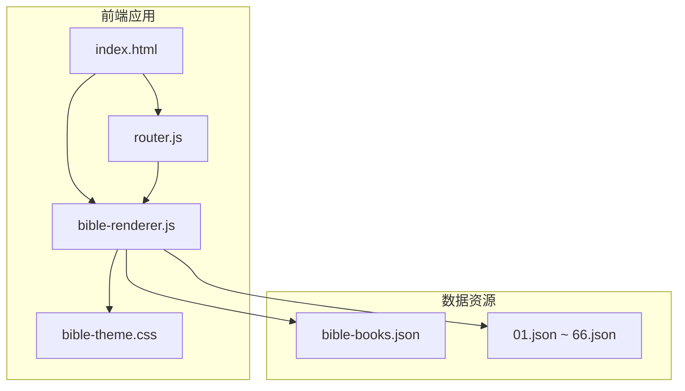
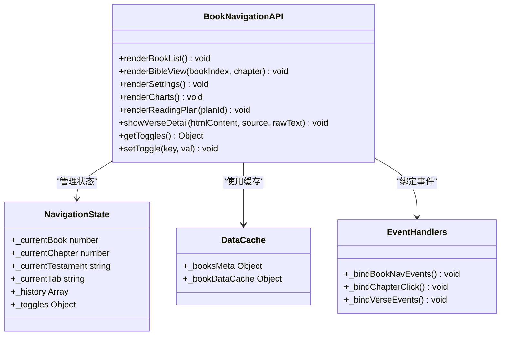
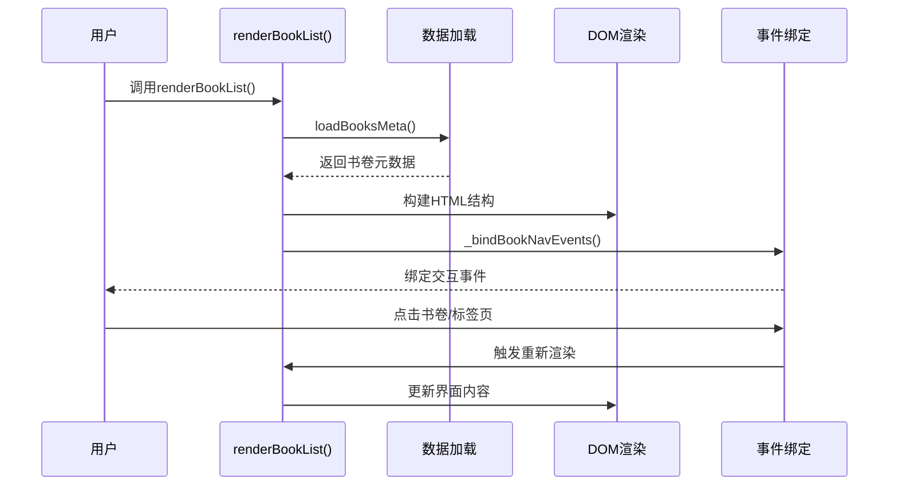
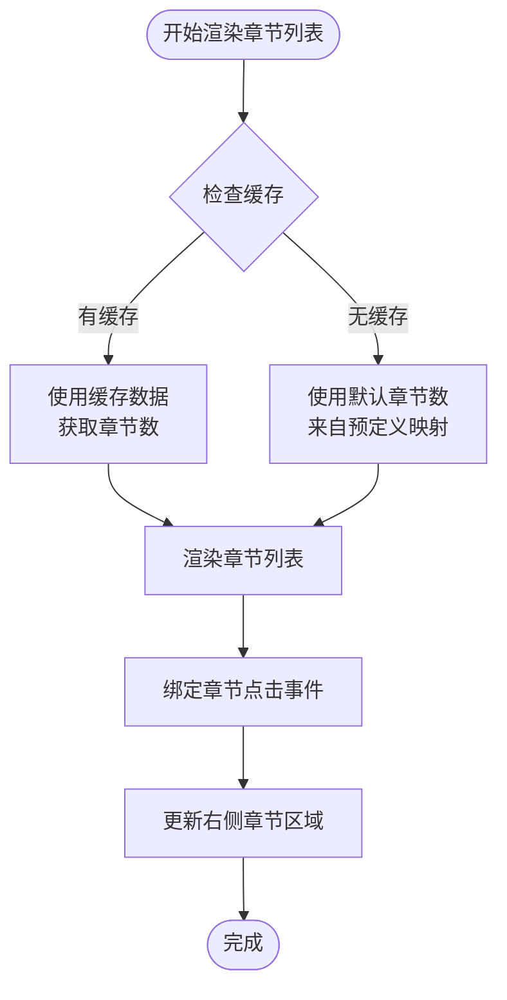
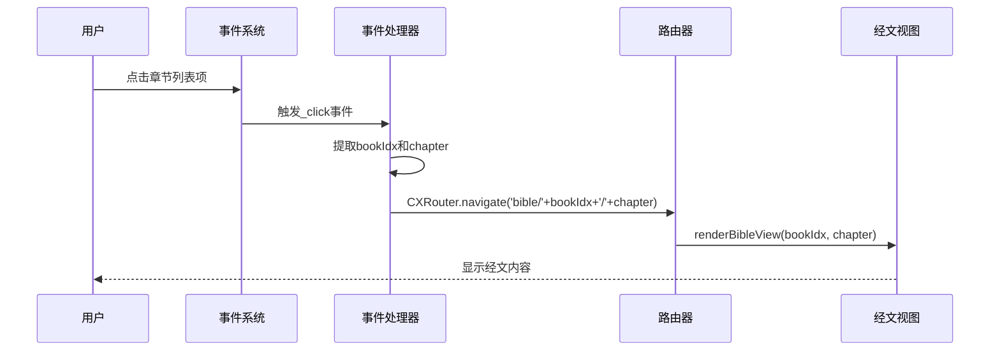
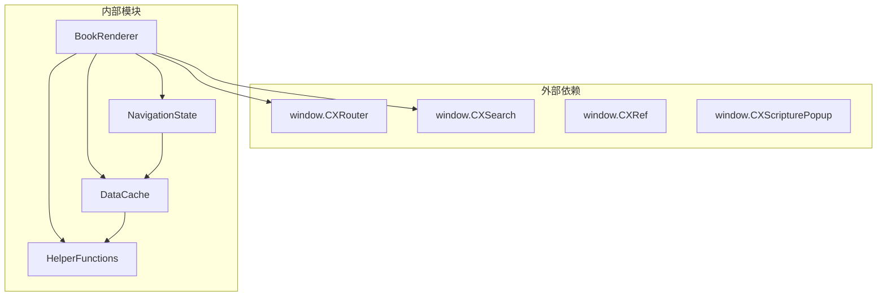

# 书卷导航API

<cite>
**本文档引用的文件**
- [bible-renderer.js](file://src/static/js/bible-renderer.js)
- [router.js](file://src/static/js/router.js)
- [index.html](file://src/static/index.html)
- [bible-books.json](file://output/data/bible-books.json)
- [01.json](file://output/data/bible/01.json)
- [bible-theme.css](file://src/static/css/bible-theme.css)
</cite>

## 目录
1. [简介](#简介)
2. [项目结构](#项目结构)
3. [核心组件](#核心组件)
4. [架构概览](#架构概览)
5. [详细组件分析](#详细组件分析)
6. [依赖关系分析](#依赖关系分析)
7. [性能考虑](#性能考虑)
8. [故障排除指南](#故障排除指南)
9. [结论](#结论)

## 简介
本文档详细说明了书卷导航API的实现，重点涵盖以下核心函数：
- renderBookList(): 书卷列表渲染、标签页切换、旧约/新约分界处理
- _renderBookNavContent(): 根据当前标签页状态渲染不同内容
- _renderChapterList(): 章节列表生成逻辑，包括默认章节数处理和动态更新机制
- _bindBookNavEvents() 和 _bindChapterClick(): 事件绑定函数的事件处理流程

同时提供每个API函数的参数类型、返回值、使用示例和错误处理方法，并给出性能优化建议和自定义导航的扩展方法。

## 项目结构
该项目采用SPA架构，核心文件组织如下：
- 渲染器：src/static/js/bible-renderer.js
- 路由器：src/static/js/router.js
- 主页面：src/static/index.html
- 样式文件：src/static/css/bible-theme.css
- 数据文件：output/data/bible-books.json 和 output/data/bible/*.json

**图表来源**
- [bible-renderer.js:1-880](file://src/static/js/bible-renderer.js#L1-L880)
- [router.js:1-287](file://src/static/js/router.js#L1-L287)
- [index.html:630-687](file://src/static/index.html#L630-L687)

**章节来源**
- [bible-renderer.js:1-880](file://src/static/js/bible-renderer.js#L1-L880)
- [router.js:1-287](file://src/static/js/router.js#L1-L287)
- [index.html:630-687](file://src/static/index.html#L630-L687)

## 核心组件
书卷导航API的核心组件包括：

### 状态管理
- 当前书卷索引：_currentBook
- 当前章节：_currentChapter  
- 当前后约状态：_currentTestament ('ot' | 'nt')
- 当前标签页：_currentTab ('books' | 'favorites' | 'history')
- 历史记录：_history

### 缓存机制
- 书卷元数据缓存：_booksMeta
- 书卷数据缓存：_bookDataCache
- 切换状态：_toggles 控制显示选项

### 数据结构
- 书卷元数据：包含 index、acronym、name 字段
- 书卷数据：包含 book_index、book_name、book_acronym、chapters 数组
- 章节数据：包含 chapter、verses 数组

**章节来源**
- [bible-renderer.js:45-68](file://src/static/js/bible-renderer.js#L45-L68)
- [bible-books.json:1-332](file://output/data/bible-books.json#L1-L332)
- [01.json:1-200](file://output/data/bible/01.json#L1-L200)

## 架构概览
书卷导航采用模块化设计，通过window.CXBible暴露API接口：

**图表来源**
- [bible-renderer.js:859-871](file://src/static/js/bible-renderer.js#L859-L871)

## 详细组件分析

### renderBookList() 函数
renderBookList() 是书卷导航的核心渲染函数，负责整个书卷列表界面的生成和更新。

#### 实现原理
1. **容器准备**：获取'app'容器元素，确保应用可见性
2. **数据加载**：异步加载书卷元数据（bible-books.json）
3. **HTML构建**：构建完整的书卷导航界面结构
4. **事件绑定**：调用事件绑定函数建立交互功能

#### 界面结构
- 顶部搜索栏：用于经文和注解搜索
- 三标签页：书卷、收藏、历史
- 双栏主体：左侧书卷列表，右侧章节列表
- 底部旧约/新约切换

#### 旧约/新约分界处理
- 旧约范围：1-39章
- 新约范围：40-66章
- 通过_currentTestament状态控制显示范围

**图表来源**
- [bible-renderer.js:142-179](file://src/static/js/bible-renderer.js#L142-L179)
- [bible-renderer.js:260-305](file://src/static/js/bible-renderer.js#L260-L305)

**章节来源**
- [bible-renderer.js:142-179](file://src/static/js/bible-renderer.js#L142-L179)

### _renderBookNavContent() 辅助函数
_renderBookNavContent() 根据当前标签页状态渲染不同的内容区域。

#### 标签页切换逻辑
- 历史标签页：显示浏览历史记录
- 收藏标签页：显示收藏功能占位符
- 书卷标签页：显示当前 Testament 的书卷列表

#### 书卷过滤机制
基于_currentTestament状态动态过滤书卷：
- 旧约：index >= 1 && index <= 39
- 新约：index >= 40 && index <= 66

#### 章节列表生成
当有选中的书卷时显示该书卷的章节列表，否则显示第一个书卷的章节列表。

**章节来源**
- [bible-renderer.js:181-213](file://src/static/js/bible-renderer.js#L181-L213)

### _renderChapterList() 函数
_renderChapterList() 负责生成指定书卷的章节列表。

#### 默认章节数处理
使用预定义的默认章节数映射表，包含所有66卷书的标准章节数：
- 创世记：50章
- 出埃及记：40章
- ...以此类推

#### 动态更新机制
1. **缓存检查**：优先使用已加载的书卷数据
2. **数据回退**：如果缓存不存在，使用默认章节数
3. **实时更新**：当书卷数据加载完成后，自动更新章节列表

**图表来源**
- [bible-renderer.js:215-239](file://src/static/js/bible-renderer.js#L215-L239)

**章节来源**
- [bible-renderer.js:215-239](file://src/static/js/bible-renderer.js#L215-L239)

### 事件绑定函数

#### _bindBookNavEvents() 事件处理流程
负责绑定书卷导航的所有交互事件：

1. **标签页切换事件**
   - 监听.book-nav-tab点击
   - 更新_currentTab状态
   - 调用renderBookList()重新渲染

2. ** Testament 切换事件**
   - 监听.testament-tab点击
   - 更新_currentTestament状态
   - 清空_currentBook并重新渲染

3. **书卷点击事件**
   - 监听.book-list-item点击
   - 更新选中状态和_currentBook
   - 动态更新右侧章节列表
   - 重新绑定章节点击事件

4. **搜索栏事件**
   - 监听搜索输入框点击
   - 调用window.CXSearch.open()打开搜索界面

#### _bindChapterClick() 事件处理流程
专门处理章节点击事件：

1. **事件捕获**：监听所有.chapter-list-item点击
2. **参数提取**：从data属性中获取书卷索引和章节号
3. **路由导航**：调用window.CXRouter.navigate()进行页面跳转
4. **导航格式**：'bible/{bookIndex}/{chapter}'

**图表来源**
- [bible-renderer.js:260-319](file://src/static/js/bible-renderer.js#L260-L319)

**章节来源**
- [bible-renderer.js:260-319](file://src/static/js/bible-renderer.js#L260-L319)

## 依赖关系分析

### 组件耦合关系

**图表来源**
- [bible-renderer.js:313-318](file://src/static/js/bible-renderer.js#L313-L318)
- [bible-renderer.js:509-524](file://src/static/js/bible-renderer.js#L509-L524)

### 数据流依赖
1. **数据加载顺序**：bible-books.json → 单个书卷数据
2. **缓存策略**：元数据缓存 + 书卷数据缓存
3. **状态同步**：UI状态与内存状态保持一致

**章节来源**
- [bible-renderer.js:75-106](file://src/static/js/bible-renderer.js#L75-L106)

## 性能考虑

### 缓存优化策略
1. **元数据缓存**：一次性加载bible-books.json，避免重复请求
2. **书卷数据缓存**：按需加载并缓存已访问的书卷数据
3. **DOM节点缓存**：复用已创建的DOM元素，减少重绘

### 渲染性能优化
1. **虚拟滚动**：对于大量书卷的场景，可考虑实现虚拟滚动
2. **懒加载**：章节列表采用懒加载策略
3. **防抖处理**：搜索输入添加防抖机制

### 内存管理
1. **缓存清理**：实现LRU缓存淘汰机制
2. **事件解绑**：组件销毁时及时解绑事件监听器
3. **图片优化**：对大图资源进行压缩和延迟加载

## 故障排除指南

### 常见问题及解决方案

#### 数据加载失败
**症状**：页面显示"加载失败，请重试"
**原因**：网络请求超时或数据格式错误
**解决**：检查bible-books.json和书卷数据文件的完整性

#### 章节列表为空
**症状**：右侧章节列表显示空白
**原因**：书卷数据加载失败，使用默认章节数
**解决**：确认书卷数据文件存在且格式正确

#### 事件绑定失效
**症状**：点击无响应
**原因**：DOM元素尚未渲染完成
**解决**：确保在DOMReady后再绑定事件

### 错误处理机制
1. **Promise链式错误处理**：在数据加载失败时显示友好提示
2. **本地存储异常处理**：使用try-catch保护localStorage操作
3. **路由导航异常处理**：验证参数有效性后才进行导航

**章节来源**
- [bible-renderer.js:392-398](file://src/static/js/bible-renderer.js#L392-L398)
- [bible-renderer.js:97-105](file://src/static/js/bible-renderer.js#L97-L105)

## 结论
书卷导航API采用模块化设计，具有良好的可维护性和扩展性。通过合理的状态管理和缓存策略，实现了高效的书卷浏览体验。建议在未来版本中：

1. **增强搜索功能**：实现全文搜索和智能补全
2. **优化移动端体验**：针对触摸设备优化交互设计
3. **扩展自定义功能**：支持用户自定义书卷分组和排序
4. **提升性能表现**：实现虚拟滚动和更精细的缓存策略

该API为圣经阅读应用提供了坚实的基础框架，能够满足大多数阅读场景的需求。