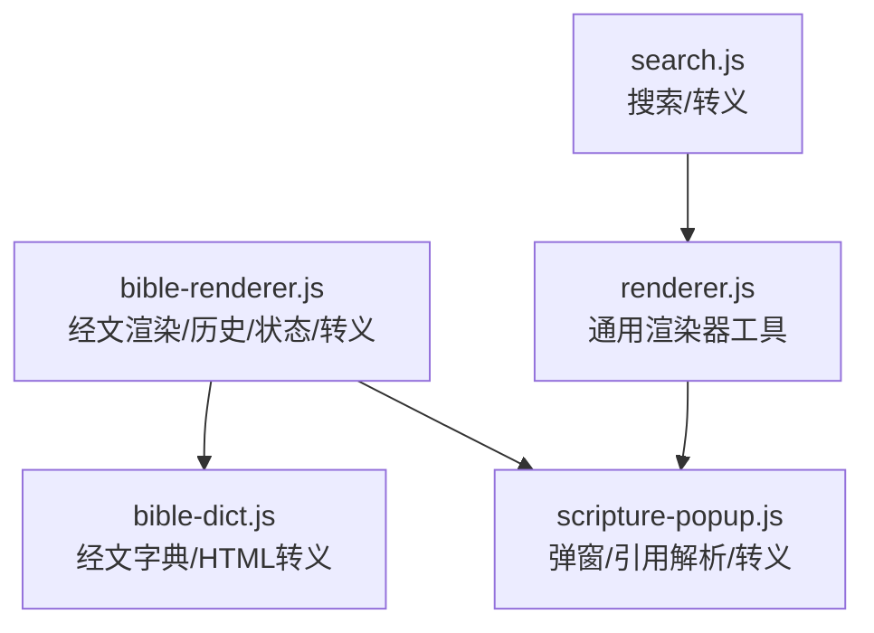
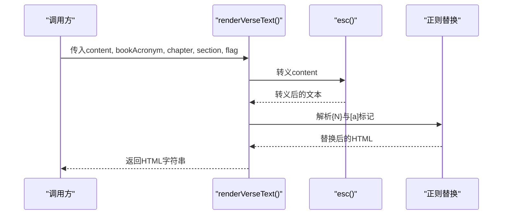
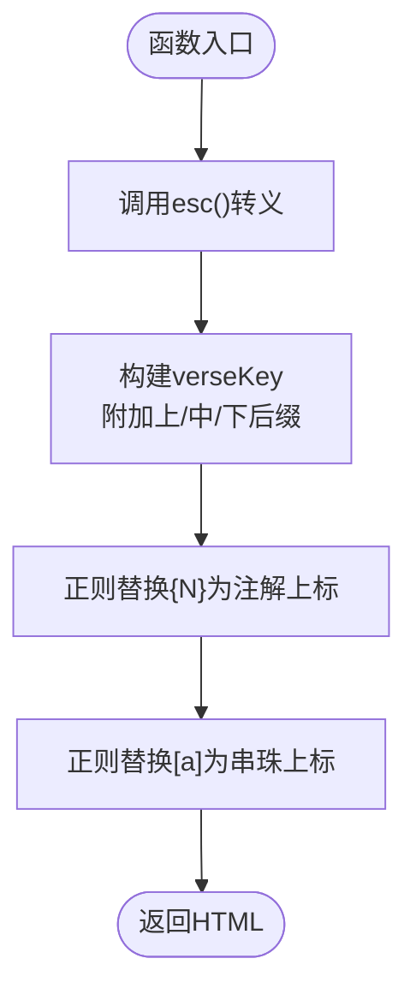
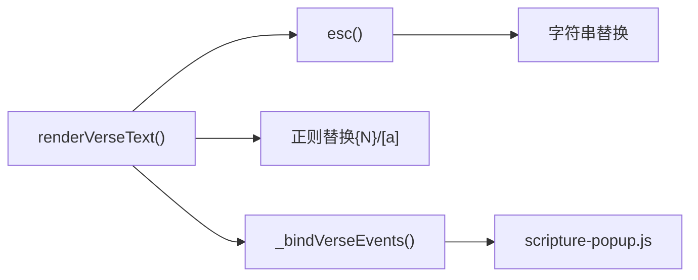

# 工具函数API

<cite>
**本文档引用的文件**
- [bible-renderer.js](file://src/static/js/bible-renderer.js)
- [renderer.js](file://src/static/js/renderer.js)
- [bible-dict.js](file://src/static/js/bible-dict.js)
- [scripture-popup.js](file://src/static/js/scripture-popup.js)
- [search.js](file://src/static/js/search.js)
</cite>

## 目录
1. [简介](#简介)
2. [项目结构](#项目结构)
3. [核心组件](#核心组件)
4. [架构概览](#架构概览)
5. [详细组件分析](#详细组件分析)
6. [依赖分析](#依赖分析)
7. [性能考虑](#性能考虑)
8. [故障排查指南](#故障排查指南)
9. [结论](#结论)

## 简介
本文件面向工具函数API的详细参考，聚焦以下能力：
- renderVerseText()：经文文本处理，解析{N}注解标记与[a]串珠标记，生成可交互的上标引用。
- esc()：HTML转义机制与安全处理。
- cnChapter()：中文数字转换逻辑。
- 历史记录管理：_addHistory()、_saveHistory()、_loadHistory()。
- 状态管理：_loadToggles()、_saveToggles()。
- 其他工具函数：cnOrdToInt()、wrapRefs()、escAttr()/escText()等。
- 参数类型、返回值、使用示例与注意事项。
- 性能与安全最佳实践。

## 项目结构
工具函数主要分布在以下文件中：
- 经文渲染与历史/状态管理：bible-renderer.js
- 通用渲染器工具：renderer.js
- 经文字典与HTML转义：bible-dict.js
- 弹窗与引用解析：scripture-popup.js
- 全文搜索与转义：search.js

**图表来源**
- [bible-renderer.js:1-880](file://src/static/js/bible-renderer.js#L1-L880)
- [renderer.js:1-800](file://src/static/js/renderer.js#L1-L800)
- [bible-dict.js:1-64](file://src/static/js/bible-dict.js#L1-L64)
- [scripture-popup.js:1-800](file://src/static/js/scripture-popup.js#L1-L800)
- [search.js:1-800](file://src/static/js/search.js#L1-L800)

**章节来源**
- [bible-renderer.js:1-880](file://src/static/js/bible-renderer.js#L1-L880)
- [renderer.js:1-800](file://src/static/js/renderer.js#L1-L800)
- [bible-dict.js:1-64](file://src/static/js/bible-dict.js#L1-L64)
- [scripture-popup.js:1-800](file://src/static/js/scripture-popup.js#L1-L800)
- [search.js:1-800](file://src/static/js/search.js#L1-L800)

## 核心组件
- renderVerseText(content, bookAcronym, chapter, section, flag)
  - 功能：对经文文本进行HTML转义，并将{N}与[a]标记解析为可交互的上标引用。
  - 输入：字符串内容、书卷简称、章、节、标记（0/1/2/3）。
  - 输出：HTML字符串。
  - 依赖：esc()、verseKey构建、正则替换。
- esc(s)
  - 功能：HTML文本转义，防止XSS注入。
  - 输入：任意字符串。
  - 输出：转义后的字符串。
- cnChapter(n)
  - 功能：将数字转换为中文“X章”形式。
  - 输入：数字n。
  - 输出：中文章节数字符串。
- 历史记录管理
  - _loadHistory()：从localStorage加载历史。
  - _saveHistory()：保存历史，限制长度。
  - _addHistory(bookIndex, chapter)：添加新历史项并去重。
- 状态管理
  - _loadToggles()：从localStorage加载显示开关。
  - _saveToggles()：保存显示开关。
- 其他工具
  - cnOrdToInt(cn)：中文序数转阿拉伯数字。
  - wrapRefs(text, ctx)：将文本中的经文引用包装为可点击元素。
  - escAttr()/escText()：属性/文本专用转义。
  - escRe(s)：正则表达式安全转义。

**章节来源**
- [bible-renderer.js:16-18](file://src/static/js/bible-renderer.js#L16-L18)
- [bible-renderer.js:108-111](file://src/static/js/bible-renderer.js#L108-L111)
- [bible-renderer.js:121-138](file://src/static/js/bible-renderer.js#L121-L138)
- [bible-renderer.js:53-59](file://src/static/js/bible-renderer.js#L53-L59)
- [bible-renderer.js:32-43](file://src/static/js/bible-renderer.js#L32-L43)
- [renderer.js:18-24](file://src/static/js/renderer.js#L18-L24)
- [renderer.js:105-116](file://src/static/js/renderer.js#L105-L116)
- [search.js:10-16](file://src/static/js/search.js#L10-L16)

## 架构概览
工具函数围绕“输入文本→转义→标记解析→输出HTML”的流水线工作，同时通过localStorage持久化历史与显示开关，确保用户体验的一致性与安全性。

**图表来源**
- [bible-renderer.js:121-138](file://src/static/js/bible-renderer.js#L121-L138)
- [bible-renderer.js:108-111](file://src/static/js/bible-renderer.js#L108-L111)

## 详细组件分析

### renderVerseText() 函数详解
- 功能概述
  - 对输入文本进行HTML转义，防止XSS。
  - 构造verseKey（含上下中后缀），用于注解/串珠定位。
  - 将{N}替换为注解上标，[a]替换为串珠上标，均可点击打开弹窗。
- 参数与返回
  - 参数：
    - content: string，经文文本（可能包含{N}与[a]标记）。
    - bookAcronym: string，书卷简称。
    - chapter: number，章。
    - section: number，节。
    - flag: number，0/1/2/3，表示上/中/下或普通节。
  - 返回：string，HTML字符串。
- 处理流程
  - 调用esc()转义。
  - 构建verseKey，根据flag附加“上/下/中”后缀。
  - 正则替换{N}为注解上标，[a]为串珠上标。
- 使用示例
  - 在渲染经文时调用，例如在渲染章节正文时对每节内容调用。
- 注意事项
  - 仅处理{N}与[a]两种标记，其他标记保持原样。
  - 依赖window.CXRef.wrapRefs()进行更复杂的引用解析（在scripture-popup.js中）。
  - 与_bindVerseEvents()配合，实现点击注解/串珠弹窗。

**图表来源**
- [bible-renderer.js:121-138](file://src/static/js/bible-renderer.js#L121-L138)

**章节来源**
- [bible-renderer.js:121-138](file://src/static/js/bible-renderer.js#L121-L138)
- [bible-renderer.js:498-526](file://src/static/js/bible-renderer.js#L498-L526)

### esc() 函数详解
- 功能概述
  - 将字符串中的特殊字符替换为HTML实体，防止XSS与注入。
- 参数与返回
  - 参数：s: string，任意字符串。
  - 返回：string，转义后的字符串。
- 使用场景
  - 渲染用户输入、标题、元数据等。
- 安全性
  - 覆盖常见危险字符：&, <, >, "。
- 性能
  - 单次字符串替换，复杂度O(n)。

**章节来源**
- [bible-renderer.js:108-111](file://src/static/js/bible-renderer.js#L108-L111)
- [bible-dict.js:25-32](file://src/static/js/bible-dict.js#L25-L32)
- [scripture-popup.js:29-32](file://src/static/js/scripture-popup.js#L29-L32)
- [search.js:10-12](file://src/static/js/search.js#L10-L12)

### cnChapter() 函数详解
- 功能概述
  - 将数字转换为中文“X章”形式，支持0-50。
- 参数与返回
  - 参数：n: number，章号。
  - 返回：string，中文章节数。
- 实现要点
  - 使用预定义中文数字数组，超出范围回退为字符串数字。
- 使用场景
  - 章节列表展示，如“第X章”。

**章节来源**
- [bible-renderer.js:16-18](file://src/static/js/bible-renderer.js#L16-L18)

### 历史记录管理函数详解
- _loadHistory()
  - 从localStorage加载历史数组，失败时初始化为空数组。
- _saveHistory()
  - 保存历史数组，限制最大长度为50。
- _addHistory(bookIndex, chapter)
  - 新增历史项，去重（相同书卷+章），并截断至50条。
- 使用场景
  - 在进入章节阅读时调用_addHistory()，并在应用初始化时调用_loadHistory()。
- 注意事项
  - localStorage异常时静默失败，不影响主流程。
  - 历史项包含时间戳，便于排序与展示。

**章节来源**
- [bible-renderer.js:53-59](file://src/static/js/bible-renderer.js#L53-L59)
- [bible-renderer.js:836-856](file://src/static/js/bible-renderer.js#L836-L856)

### 状态管理函数详解
- _loadToggles()
  - 从localStorage加载显示开关，合并到默认配置。
- _saveToggles()
  - 将当前显示开关保存到localStorage。
- 默认开关
  - showTheme, showIntro, showOutline, showFootnotes, showBeads, showVerseDivider。
- 使用场景
  - 应用初始化时调用_loadToggles()，用户切换开关时调用_saveToggles()。

**章节来源**
- [bible-renderer.js:23-43](file://src/static/js/bible-renderer.js#L23-L43)
- [bible-renderer.js:859-871](file://src/static/js/bible-renderer.js#L859-L871)

### 其他工具函数

#### cnOrdToInt(cn)
- 功能：将中文序数（如“一”、“十”、“三十七”）转换为阿拉伯数字。
- 参数：cn: string，中文序数。
- 返回：number，阿拉伯数字；无法解析时返回0。
- 实现要点：支持“十X”复合数与“X十Y”组合。

**章节来源**
- [txt-importer.js:75-92](file://src/static/js/txt-importer.js#L75-L92)

#### wrapRefs(text, ctx)
- 功能：将文本中的经文引用包装为可点击元素，优先使用window.CXRef.wrapRefs()。
- 参数：text: string，待处理文本；ctx: string，上下文。
- 返回：string，HTML字符串。

**章节来源**
- [renderer.js:22-24](file://src/static/js/renderer.js#L22-L24)

#### escAttr()/escText()
- 功能：属性与文本专用转义，escAttr覆盖引号，escText不覆盖引号。
- 参数：s: string。
- 返回：string，转义后的字符串。

**章节来源**
- [renderer.js:18-21](file://src/static/js/renderer.js#L18-L21)

#### escRe(s)
- 功能：将字符串转义为正则字面量，防止正则注入。
- 参数：s: string。
- 返回：string，转义后的字符串。

**章节来源**
- [search.js:14-16](file://src/static/js/search.js#L14-L16)

## 依赖分析
- renderVerseText() 依赖：
  - esc()：HTML转义。
  - 正则替换：{N}→注解上标，[a]→串珠上标。
  - 事件绑定：_bindVerseEvents()用于点击注解/串珠弹窗。
- esc() 依赖：
  - 字符串替换，无外部依赖。
- 历史与状态：
  - localStorage持久化，异常时静默失败。
- 引用解析：
  - scripture-popup.js提供更复杂的引用展开与弹窗逻辑，与renderVerseText()互补。

**图表来源**
- [bible-renderer.js:121-138](file://src/static/js/bible-renderer.js#L121-L138)
- [bible-renderer.js:498-526](file://src/static/js/bible-renderer.js#L498-L526)
- [scripture-popup.js:688-700](file://src/static/js/scripture-popup.js#L688-L700)

**章节来源**
- [bible-renderer.js:121-138](file://src/static/js/bible-renderer.js#L121-L138)
- [bible-renderer.js:498-526](file://src/static/js/bible-renderer.js#L498-L526)
- [scripture-popup.js:688-700](file://src/static/js/scripture-popup.js#L688-L700)

## 性能考虑
- renderVerseText()
  - 单次字符串替换，复杂度O(n)；对大量经文建议批量处理或虚拟滚动。
  - 正则替换为常量时间操作，适合高频调用。
- esc()
  - O(n)线性替换，建议避免在热路径重复调用相同字符串。
- 历史与状态
  - localStorage读写为同步操作，建议批量保存（如节流/防抖）。
- 引用解析
  - scripture-popup.js的引用展开涉及多次正则与数组过滤，建议在需要时才加载数据。

[本节为通用指导，不直接分析具体文件]

## 故障排查指南
- renderVerseText()未生效
  - 检查是否正确调用esc()与正则替换。
  - 确认事件绑定是否生效（_bindVerseEvents()）。
- 注解/串珠点击无反应
  - 检查DOM结构是否包含fn-ref/xref-ref类名与data-*属性。
  - 确认window.CXRef.wrapRefs()可用。
- 历史记录丢失
  - 检查localStorage是否可用，确认保存逻辑未抛出异常。
- 显示开关不持久化
  - 检查localStorage写入权限，确认_saveToggles()被调用。

**章节来源**
- [bible-renderer.js:498-526](file://src/static/js/bible-renderer.js#L498-L526)
- [bible-renderer.js:53-59](file://src/static/js/bible-renderer.js#L53-L59)
- [bible-renderer.js:32-43](file://src/static/js/bible-renderer.js#L32-L43)

## 结论
本文档梳理了工具函数API的关键实现与使用方法，重点覆盖了经文文本处理、HTML转义、中文数字转换、历史记录与状态管理等模块。遵循本文的参数、返回值、使用示例与注意事项，可在保证安全性的前提下高效集成这些工具函数。