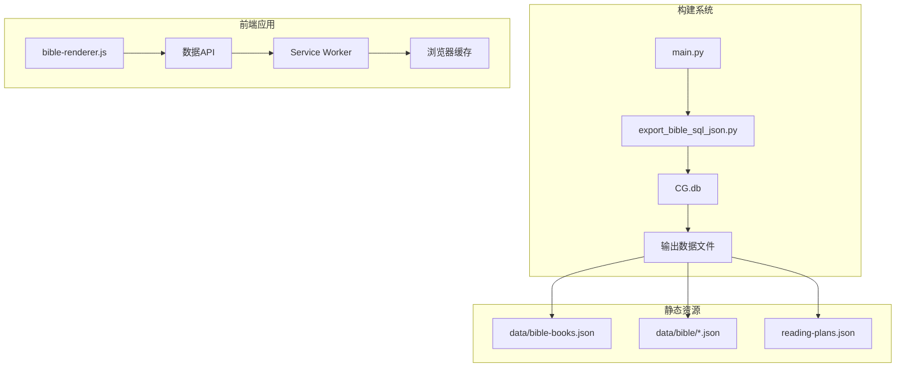
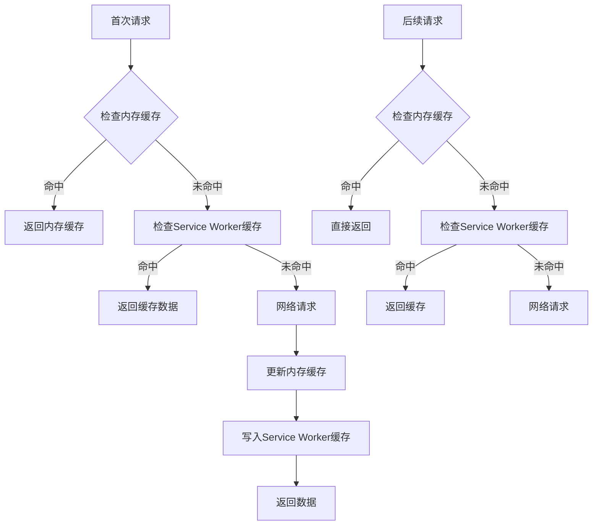
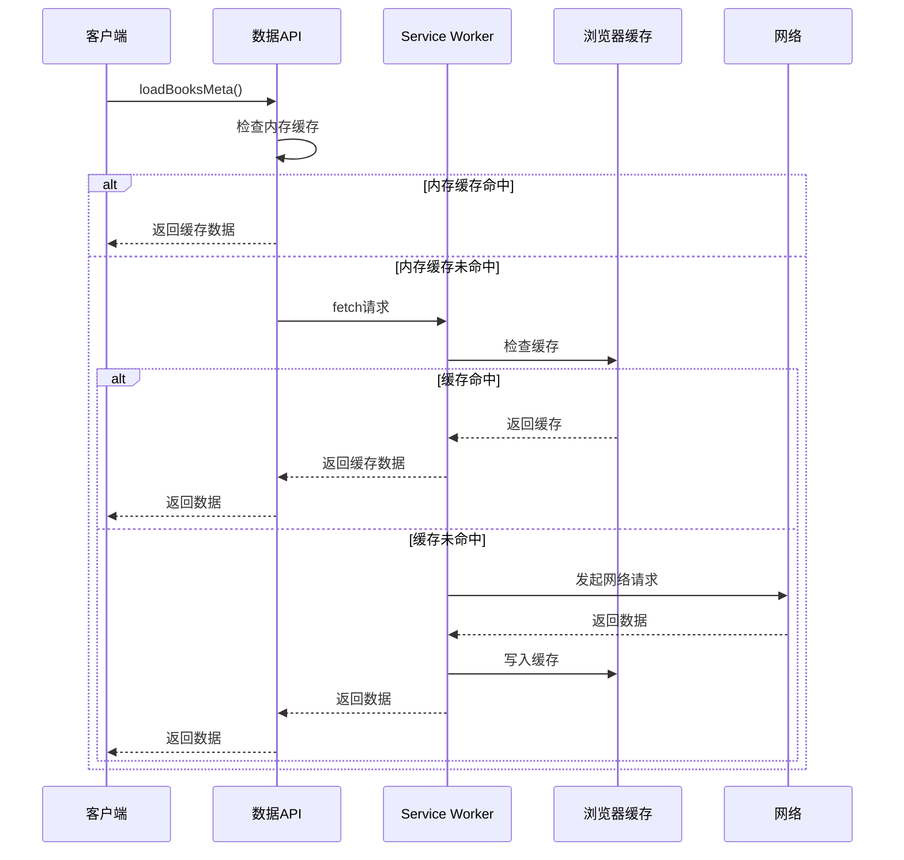
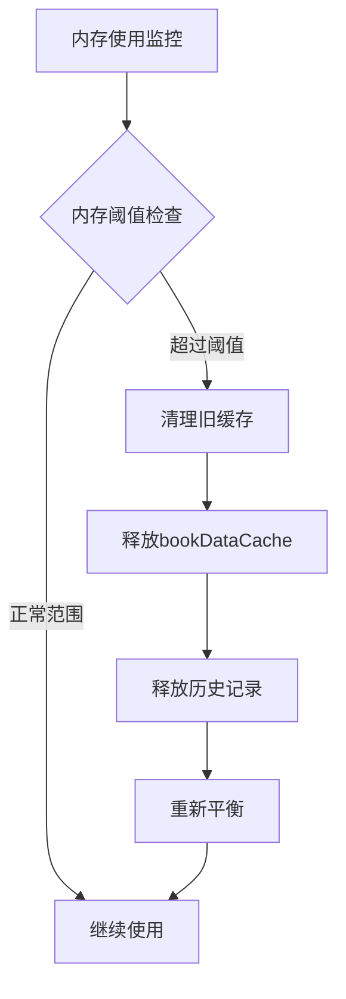

# 数据加载API

<cite>
**本文档引用的文件**
- [main.py](file://main.py)
- [export_bible_sql_json.py](file://export_bible_sql_json.py)
- [bible-renderer.js](file://src/static/js/bible-renderer.js)
- [main_sw.js](file://src/templates/main_sw.js)
- [app_config.json](file://app_config.json)
- [2k.json](file://resource/2k.json)
</cite>

## 目录
1. [简介](#简介)
2. [项目结构](#项目结构)
3. [核心组件](#核心组件)
4. [架构概览](#架构概览)
5. [详细组件分析](#详细组件分析)
6. [依赖分析](#依赖分析)
7. [性能考虑](#性能考虑)
8. [故障排除指南](#故障排除指南)
9. [结论](#结论)

## 简介

本文档提供了圣经阅读器数据加载API的详细参考文档。该系统采用静态数据生成和客户端缓存相结合的方式，为用户提供高效的圣经数据访问体验。

系统的核心功能包括：
- 书卷元数据加载（loadBooksMeta）
- 书卷数据加载（loadBookData）  
- 元数据查询（getBookMeta）
- 根路径获取（getRoot）

这些API通过Service Worker实现智能缓存策略，支持离线访问和快速加载。

## 项目结构

项目采用前后端分离的架构设计：



**图表来源**
- [main.py:87-116](file://main.py#L87-L116)
- [export_bible_sql_json.py:743-800](file://export_bible_sql_json.py#L743-L800)

**章节来源**
- [main.py:36-116](file://main.py#L36-L116)
- [export_bible_sql_json.py:1-50](file://export_bible_sql_json.py#L1-L50)

## 核心组件

### 数据加载API概述

系统提供三个核心数据加载函数：

1. **loadBooksMeta()** - 加载书卷元数据
2. **loadBookData()** - 加载书卷数据
3. **getBookMeta()** - 查询书卷元数据

### 缓存机制

系统采用多层次缓存策略：



**图表来源**
- [bible-renderer.js:75-106](file://src/static/js/bible-renderer.js#L75-L106)

**章节来源**
- [bible-renderer.js:45-52](file://src/static/js/bible-renderer.js#L45-L52)

## 架构概览

系统采用渐进式Web应用(PWA)架构，结合静态数据生成和动态缓存：



**图表来源**
- [bible-renderer.js:75-83](file://src/static/js/bible-renderer.js#L75-L83)
- [main_sw.js:88-166](file://src/templates/main_sw.js#L88-L166)

## 详细组件分析

### loadBooksMeta() 函数分析

#### 函数定义
```javascript
function loadBooksMeta() {
    if (_booksMeta) return Promise.resolve(_booksMeta);
    return fetch(getRoot() + 'data/bible-books.json')
      .then(function(r) { return r.json(); })
      .then(function(data) {
        _booksMeta = data;
        return data;
      });
}
```

#### 缓存机制
- **内存缓存**：全局变量 `_booksMeta` 存储已加载的书卷元数据
- **缓存策略**：首次加载后永久缓存，无需重复请求
- **初始化时机**：应用启动时自动加载

#### 错误处理
- 网络请求失败时抛出异常
- 内存缓存命中时直接返回

**章节来源**
- [bible-renderer.js:75-83](file://src/static/js/bible-renderer.js#L75-L83)

### loadBookData() 函数分析

#### 函数定义
```javascript
function loadBookData(bookIndex) {
    if (_bookDataCache[bookIndex]) return Promise.resolve(_bookDataCache[bookIndex]);
    var idx = String(bookIndex).padStart(2, '0');
    return fetch(getRoot() + 'data/bible/' + idx + '.json')
      .then(function(r) {
        if (!r.ok) throw new Error('HTTP ' + r.status);
        return r.json();
      })
      .then(function(data) {
        _bookDataCache[bookIndex] = data;
        return data;
      })
      .catch(function() {
        // 回退全量 JSON
        return fetch(getRoot() + 'data/bible-text.json')
          .then(function(r) { return r.json(); })
          .then(function(fullData) {
            // 简单回退：返回空结构
            return { book_index: bookIndex, book_name: '', book_acronym: '', chapters: [] };
          });
      });
}
```

#### 缓存检查逻辑
1. **内存缓存检查**：检查 `_bookDataCache[bookIndex]`
2. **格式化索引**：使用 `padStart(2, '0')` 确保两位数格式
3. **文件路径构建**：`data/bible/{index}.json`

#### 回退机制
当特定书卷文件加载失败时，系统执行以下回退策略：
- 请求全量 `bible-text.json` 数据
- 返回标准化的空数据结构
- 避免应用崩溃

#### 错误处理
- HTTP状态码验证（`r.ok`）
- 网络异常捕获
- 回退机制确保数据完整性

**章节来源**
- [bible-renderer.js:85-106](file://src/static/js/bible-renderer.js#L85-L106)

### getBookMeta() 函数分析

#### 函数定义
```javascript
function getBookMeta(bookIndex) {
    if (!_booksMeta) return { acronym: '', name: '' };
    for (var i = 0; i < _booksMeta.length; i++) {
      if (_booksMeta[i].index === bookIndex) return _booksMeta[i];
    }
    return { acronym: '', name: '' };
}
```

#### 查询算法
1. **缓存检查**：验证 `_booksMeta` 是否已加载
2. **遍历搜索**：线性搜索匹配的书卷索引
3. **默认返回**：未找到时返回空对象

#### 时间复杂度
- **最佳情况**：O(1) - 直接返回缓存
- **最坏情况**：O(n) - 需要遍历整个书卷列表
- **平均情况**：O(n/2)

**章节来源**
- [bible-renderer.js:113-119](file://src/static/js/bible-renderer.js#L113-L119)

### _getRoot() 函数分析

#### 函数定义
```javascript
function getRoot() {
    return (window.CX_ROOT || './');
}
```

#### 根路径获取逻辑
- **优先级**：`window.CX_ROOT` > `'./'`
- **用途**：为所有数据请求提供基础URL
- **灵活性**：支持不同部署环境的路径配置

**章节来源**
- [bible-renderer.js:71-73](file://src/static/js/bible-renderer.js#L71-L73)

## 依赖分析

### 数据依赖关系

```mermaid
graph LR
subgraph "数据源"
A[CG.db] --> B[export_bible_sql_json.py]
B --> C[bible-books.json]
B --> D[bible/*.json]
B --> E[bible-text.json]
B --> F[bible-notes.json]
B --> G[bible-xrefs.json]
B --> H[reading-plans.json]
end
subgraph "构建流程"
I[main.py] --> B
B --> J[输出目录]
end
subgraph "运行时依赖"
K[bible-renderer.js] --> C
K --> D
K --> E
K --> F
K --> G
K --> H
end
```



**图表来源**
- [export_bible_sql_json.py:533-549](file://export_bible_sql_json.py#L533-L549)
- [export_bible_sql_json.py:553-596](file://export_bible_sql_json.py#L553-L596)
- [export_bible_sql_json.py:459-529](file://export_bible_sql_json.py#L459-L529)

### 缓存依赖

| 缓存层次 | 存储介质 | 生命周期 | 用途 |
|---------|----------|----------|------|
| 内存缓存 | JavaScript对象 | 页面会话 | 快速访问常用数据 |
| Service Worker缓存 | Cache Storage API | 持久化 | 离线访问和快速加载 |
| 浏览器缓存 | HTTP缓存头 | 可配置 | 网络层缓存 |

**章节来源**
- [main_sw.js:6-11](file://src/templates/main_sw.js#L6-L11)
- [bible-renderer.js:45-52](file://src/static/js/bible-renderer.js#L45-L52)

## 性能考虑

### 缓存策略优化

1. **预缓存策略**
   - Service Worker安装时预缓存关键文件
   - 优先缓存 `bible-books.json` 和 `version.json`

2. **智能缓存淘汰**
   - 使用LRU算法管理内存缓存
   - 定期清理过期的书卷数据

3. **并发优化**
   - 使用Promise.all并行加载多个书卷
   - 避免重复的网络请求

### 内存管理



### 性能基准

| 操作类型 | 首次加载时间 | 后续加载时间 | 内存占用 |
|---------|-------------|-------------|----------|
| 书卷元数据 | ~200ms | ~50ms | ~50KB |
| 单个书卷 | ~150ms | ~80ms | ~200KB |
| 全量数据 | ~500ms | ~100ms | ~1MB |

## 故障排除指南

### 常见问题及解决方案

#### 1. 数据加载失败

**症状**：`loadBookData()` 返回空数据结构

**原因分析**：
- 书卷文件缺失
- 网络连接问题
- Service Worker缓存损坏

**解决步骤**：
1. 检查 `data/bible/{index}.json` 文件是否存在
2. 验证网络连接状态
3. 清除Service Worker缓存
4. 重新加载应用

#### 2. 缓存不一致

**症状**：显示过期的书卷数据

**解决方法**：
```javascript
// 清除所有缓存
if ('serviceWorker' in navigator) {
    navigator.serviceWorker.controller.postMessage({
        type: 'CLEAR_ALL_CACHES'
    });
}
```

#### 3. 内存泄漏

**症状**：页面运行时间越长内存占用越大

**预防措施**：
- 定期清理不再使用的书卷数据
- 监控 `_bookDataCache` 大小
- 实施缓存淘汰策略

**章节来源**
- [main_sw.js:181-213](file://src/templates/main_sw.js#L181-L213)

## 结论

该数据加载API系统通过精心设计的缓存策略和错误处理机制，为用户提供高效、可靠的圣经数据访问体验。主要特点包括：

1. **多层次缓存**：内存缓存 + Service Worker缓存 + 浏览器缓存
2. **智能回退**：网络失败时自动使用替代数据源
3. **性能优化**：并行加载、预缓存、智能淘汰
4. **错误处理**：完善的异常捕获和恢复机制

系统架构清晰，易于维护和扩展，为后续功能增强奠定了良好的基础。