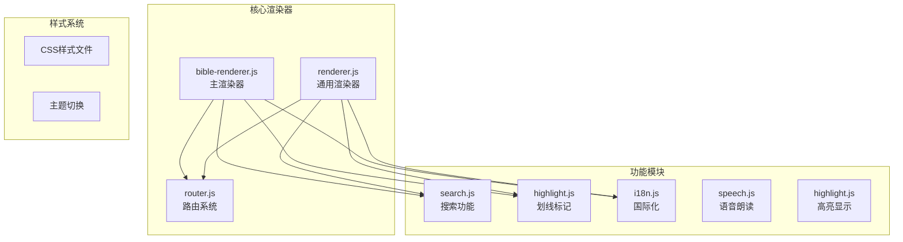
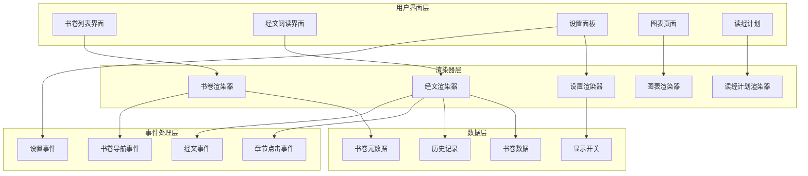
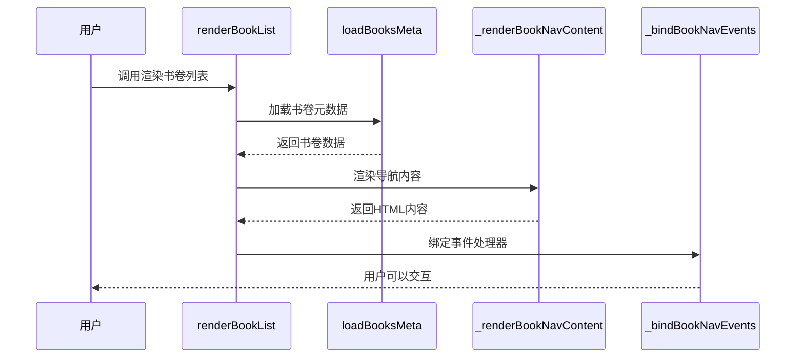
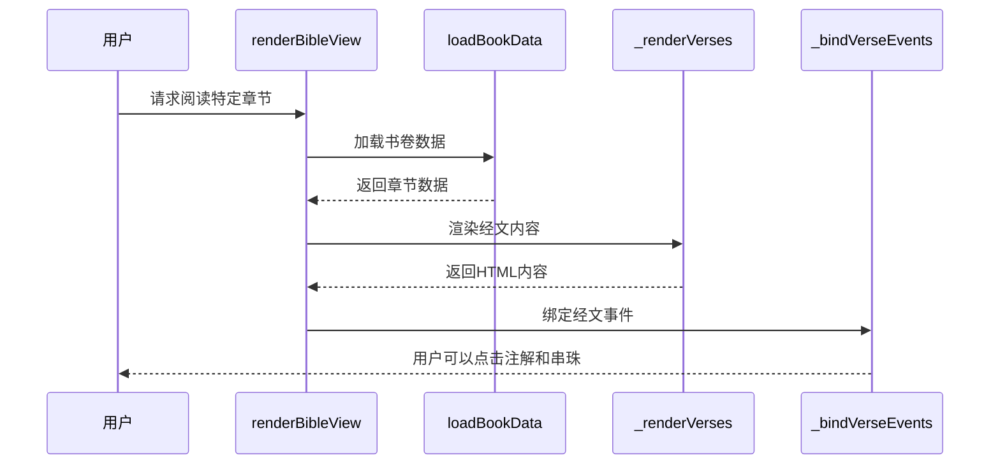
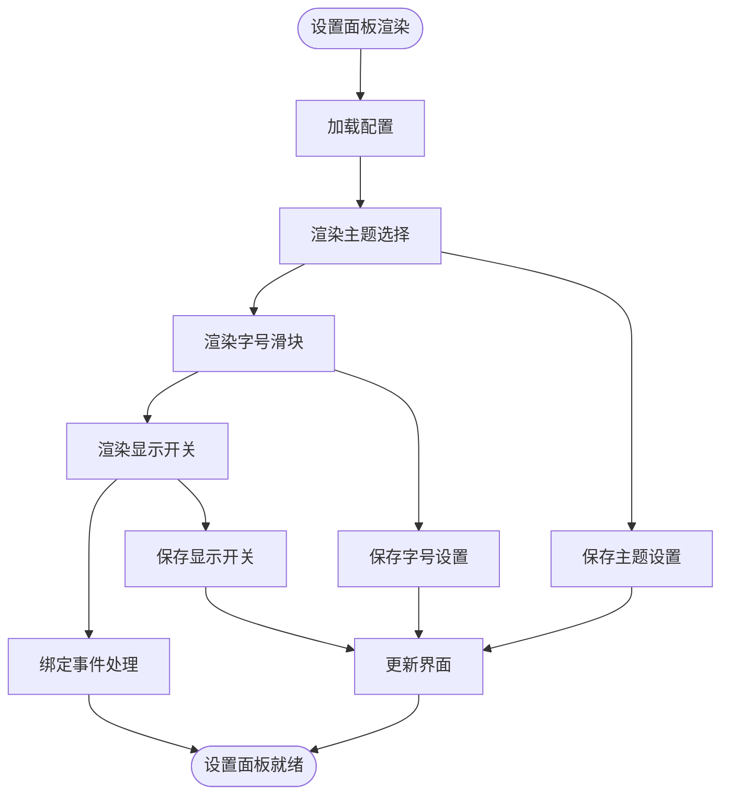
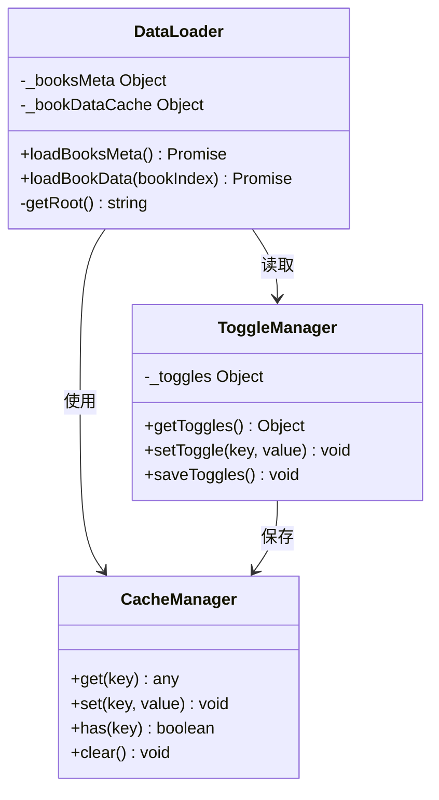
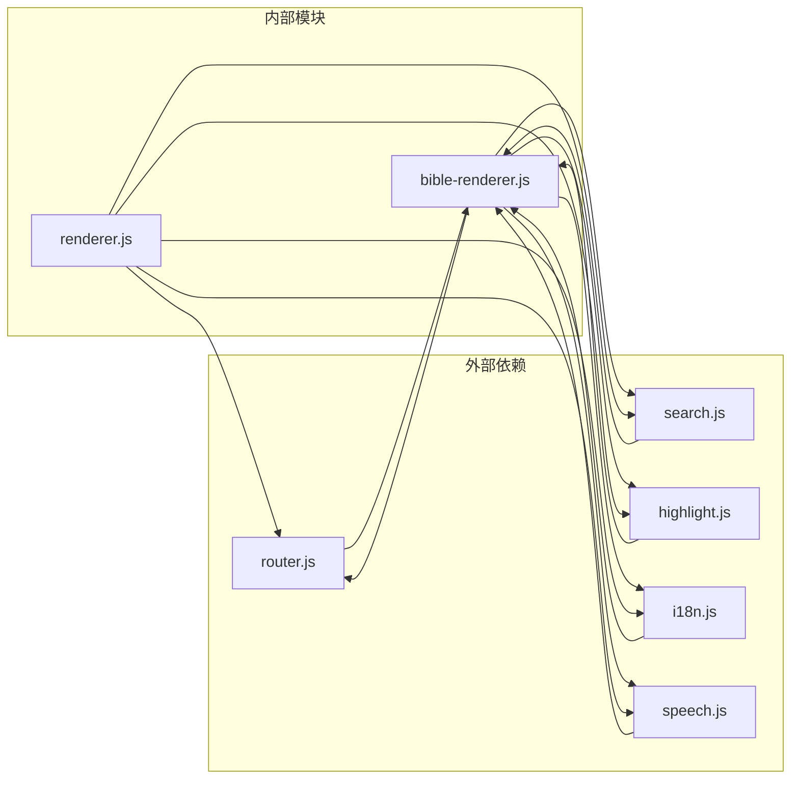
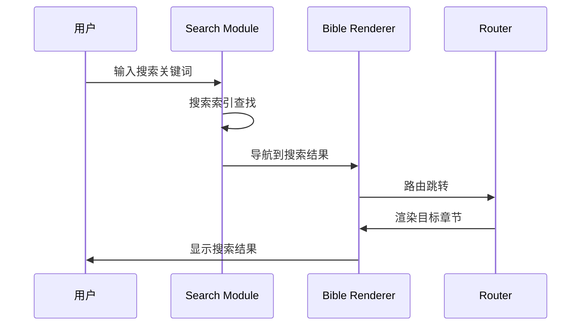

# 渲染器API

<cite>
**本文档引用的文件**
- [bible-renderer.js](file://src/static/js/bible-renderer.js)
- [router.js](file://src/static/js/router.js)
- [renderer.js](file://src/static/js/renderer.js)
- [search.js](file://src/static/js/search.js)
- [i18n.js](file://src/static/js/i18n.js)
- [highlight.js](file://src/static/js/highlight.js)
</cite>

## 目录
1. [简介](#简介)
2. [项目结构](#项目结构)
3. [核心组件](#核心组件)
4. [架构概览](#架构概览)
5. [详细组件分析](#详细组件分析)
6. [依赖关系分析](#依赖关系分析)
7. [性能考虑](#性能考虑)
8. [故障排除指南](#故障排除指南)
9. [结论](#结论)

## 简介

bible-renderer.js 是一个专为圣经阅读器设计的前端渲染器，采用模块化设计，提供了完整的圣经文本渲染、导航和交互功能。该渲染器基于现代Web技术构建，支持响应式设计和离线使用，为用户提供流畅的圣经阅读体验。

该渲染器的核心特性包括：
- 书卷导航和章节浏览
- 经文文本渲染和注解显示
- 设置面板和个性化配置
- 搜索功能集成
- 划线标记和笔记功能
- 国际化支持

## 项目结构

项目采用模块化架构，主要文件组织如下：

**图表来源**
- [bible-renderer.js:1-880](file://src/static/js/bible-renderer.js#L1-L880)
- [router.js:1-287](file://src/static/js/router.js#L1-L287)

**章节来源**
- [bible-renderer.js:1-880](file://src/static/js/bible-renderer.js#L1-L880)
- [router.js:1-287](file://src/static/js/router.js#L1-L287)

## 核心组件

### 渲染器API暴露

bible-renderer.js 通过 window.CXBible 暴露以下核心API：

| 方法 | 参数 | 返回值 | 描述 |
|------|------|--------|------|
| `init()` | 无 | void | 初始化渲染器，加载配置和预加载数据 |
| `renderBookList()` | 无 | void | 渲染书卷导航界面 |
| `renderBibleView(bookIndex, chapter)` | bookIndex: number, chapter: number | void | 渲染指定书卷和章节的经文视图 |
| `renderSettings()` | 无 | void | 渲染设置面板 |
| `renderCharts()` | 无 | void | 渲染图表页面（预留接口） |
| `renderReadingPlan(planId)` | planId: string | void | 渲染读经计划 |
| `showVerseDetail()` | 无 | void | 显示经文详情弹窗 |
| `getToggles()` | 无 | Object | 获取显示开关配置 |
| `setToggle(key, val)` | key: string, val: boolean | void | 设置显示开关 |

### 数据加载组件

| 函数 | 参数 | 返回值 | 描述 |
|------|------|--------|------|
| `loadBooksMeta()` | 无 | Promise | 加载书卷元数据 |
| `loadBookData(bookIndex)` | bookIndex: number | Promise | 加载指定书卷的数据 |

### 事件绑定组件

| 函数 | 参数 | 返回值 | 描述 |
|------|------|--------|------|
| `_bindBookNavEvents()` | 无 | void | 绑定书卷导航事件 |
| `_bindChapterClick()` | 无 | void | 绑定章节点击事件 |
| `_bindVerseEvents()` | 无 | void | 绑定经文事件 |

### 文本处理组件

| 函数 | 参数 | 返回值 | 描述 |
|------|------|--------|------|
| `renderVerseText(content, bookAcronym, chapter, section, flag)` | content: string, bookAcronym: string, chapter: number, section: number, flag: number | string | 渲染经文文本，处理注解和串珠标记 |
| `_renderVerses(chapterData, bookAcronym, chapter)` | chapterData: Object, bookAcronym: string, chapter: number | string | 渲染章节中的所有经文 |
| `_renderFootnoteText(text)` | text: string | string | 渲染注解文本 |
| `_renderBeadText(text)` | text: string | string | 渲染串珠文本 |

**章节来源**
- [bible-renderer.js:859-871](file://src/static/js/bible-renderer.js#L859-L871)
- [bible-renderer.js:75-106](file://src/static/js/bible-renderer.js#L75-L106)
- [bible-renderer.js:498-526](file://src/static/js/bible-renderer.js#L498-L526)

## 架构概览

bible-renderer.js 采用了清晰的分层架构设计：

**图表来源**
- [bible-renderer.js:143-179](file://src/static/js/bible-renderer.js#L143-L179)
- [bible-renderer.js:324-399](file://src/static/js/bible-renderer.js#L324-L399)
- [bible-renderer.js:663-728](file://src/static/js/bible-renderer.js#L663-L728)

## 详细组件分析

### 书卷列表渲染器

书卷列表渲染器负责展示圣经书卷的导航界面，支持旧约和新约的分组显示。

**图表来源**
- [bible-renderer.js:143-179](file://src/static/js/bible-renderer.js#L143-L179)
- [bible-renderer.js:181-213](file://src/static/js/bible-renderer.js#L181-L213)
- [bible-renderer.js:260-305](file://src/static/js/bible-renderer.js#L260-L305)

#### 书卷列表渲染流程

1. **初始化容器**：查找并验证应用容器元素
2. **加载元数据**：异步加载书卷元数据
3. **渲染界面**：生成包含搜索栏、标签页和书卷列表的HTML
4. **绑定事件**：注册各种用户交互事件
5. **显示界面**：将渲染的HTML注入到DOM中

**章节来源**
- [bible-renderer.js:143-179](file://src/static/js/bible-renderer.js#L143-L179)

### 经文阅读渲染器

经文阅读渲染器提供完整的圣经阅读体验，包括经文显示、注解和串珠功能。

**图表来源**
- [bible-renderer.js:324-399](file://src/static/js/bible-renderer.js#L324-L399)
- [bible-renderer.js:421-474](file://src/static/js/bible-renderer.js#L421-L474)
- [bible-renderer.js:498-526](file://src/static/js/bible-renderer.js#L498-L526)

#### 经文渲染算法

经文渲染过程遵循以下步骤：

1. **数据准备**：同时加载书卷元数据和目标章节数据
2. **章节查找**：在加载的数据中定位目标章节
3. **内容渲染**：根据显示开关渲染元数据、主题摘要和纲目
4. **经文处理**：逐节渲染经文，处理节号分隔和标记
5. **注解显示**：根据开关条件渲染内联注解和串珠
6. **事件绑定**：注册注解和串珠的点击事件

**章节来源**
- [bible-renderer.js:324-399](file://src/static/js/bible-renderer.js#L324-L399)

### 设置面板渲染器

设置面板提供了用户个性化的配置选项。

**图表来源**
- [bible-renderer.js:663-728](file://src/static/js/bible-renderer.js#L663-L728)
- [bible-renderer.js:730-772](file://src/static/js/bible-renderer.js#L730-L772)

#### 设置项说明

| 设置项 | 类型 | 默认值 | 描述 |
|--------|------|--------|------|
| `showTheme` | boolean | true | 显示书卷主题 |
| `showIntro` | boolean | true | 显示书卷简介 |
| `showOutline` | boolean | true | 显示经文纲目 |
| `showFootnotes` | boolean | true | 显示经文注解 |
| `showBeads` | boolean | true | 显示经文串珠 |
| `showVerseDivider` | boolean | true | 显示经节分割线 |

**章节来源**
- [bible-renderer.js:663-728](file://src/static/js/bible-renderer.js#L663-L728)

### 数据加载系统

bible-renderer.js 实现了高效的数据加载和缓存机制：

**图表来源**
- [bible-renderer.js:75-106](file://src/static/js/bible-renderer.js#L75-L106)
- [bible-renderer.js:33-43](file://src/static/js/bible-renderer.js#L33-L43)
- [bible-renderer.js:836-856](file://src/static/js/bible-renderer.js#L836-L856)

#### 缓存策略

1. **元数据缓存**：书卷元数据只加载一次并缓存
2. **书卷数据缓存**：按书卷索引缓存书卷数据
3. **历史记录缓存**：本地存储浏览历史
4. **设置缓存**：保存用户的显示偏好

**章节来源**
- [bible-renderer.js:45-59](file://src/static/js/bible-renderer.js#L45-L59)

## 依赖关系分析

bible-renderer.js 与其他模块的依赖关系如下：

**图表来源**
- [bible-renderer.js:1-880](file://src/static/js/bible-renderer.js#L1-L880)
- [router.js:1-287](file://src/static/js/router.js#L1-L287)

### 路由集成

bible-renderer.js 与路由系统的集成通过 window.CXRouter 实现：

| 路由路径 | 对应方法 | 参数 | 描述 |
|----------|----------|------|------|
| `#/` | `renderBookList()` | 无 | 主页书卷导航 |
| `#/bible/{book}/{chapter}` | `renderBibleView()` | bookIndex, chapter | 经文阅读 |
| `#/settings` | `renderSettings()` | 无 | 设置面板 |
| `#/charts` | `renderCharts()` | 无 | 图表页面 |
| `#/plan/{id}` | `renderReadingPlan()` | planId | 读经计划 |

**章节来源**
- [router.js:37-62](file://src/static/js/router.js#L37-L62)

### 搜索集成

bible-renderer.js 与搜索系统的集成提供了全文搜索功能：

**图表来源**
- [search.js:487-512](file://src/static/js/search.js#L487-L512)

**章节来源**
- [search.js:1-800](file://src/static/js/search.js#L1-L800)

## 性能考虑

### 渲染优化策略

1. **异步数据加载**：使用 Promise 实现并行数据加载
2. **DOM 操作最小化**：批量更新 DOM 节点
3. **事件委托**：使用事件冒泡减少事件监听器数量
4. **缓存机制**：智能缓存已加载的数据

### 内存管理

1. **垃圾回收友好**：及时清理事件监听器
2. **DOM 节点复用**：避免不必要的节点创建
3. **状态管理**：集中管理应用状态

### 网络优化

1. **预加载策略**：提前加载必要的资源
2. **错误处理**：优雅处理网络请求失败
3. **回退机制**：提供数据加载失败的回退方案

## 故障排除指南

### 常见问题及解决方案

#### 数据加载失败

**症状**：页面显示"加载失败，请重试"

**原因**：
- 网络连接问题
- 数据文件缺失
- 路径配置错误

**解决方法**：
1. 检查网络连接状态
2. 验证数据文件是否存在
3. 确认 `CX_ROOT` 配置正确

#### 经文显示异常

**症状**：经文内容显示不完整或格式错误

**原因**：
- 数据格式不符合预期
- 编码问题
- 样式冲突

**解决方法**：
1. 检查数据文件格式
2. 验证字符编码
3. 检查CSS样式冲突

#### 事件绑定失效

**症状**：用户交互无响应

**原因**：
- DOM 元素未就绪
- 事件监听器重复绑定
- 作用域问题

**解决方法**：
1. 确保在 DOMContentLoaded 事件后绑定
2. 使用事件委托替代直接绑定
3. 检查作用域链

**章节来源**
- [bible-renderer.js:392-398](file://src/static/js/bible-renderer.js#L392-L398)

### 调试技巧

1. **控制台日志**：利用 `console.log` 输出调试信息
2. **断点调试**：在关键代码处设置断点
3. **网络监控**：检查数据加载状态
4. **DOM 检查**：验证渲染结果

## 结论

bible-renderer.js 提供了一个功能完整、性能优良的圣经渲染解决方案。其模块化设计使得各个功能组件职责明确，易于维护和扩展。通过合理的缓存策略和异步加载机制，确保了良好的用户体验。

该渲染器的主要优势包括：
- **模块化架构**：清晰的功能分离和职责划分
- **高性能渲染**：优化的DOM操作和缓存机制
- **丰富的交互**：完善的事件处理和用户反馈
- **可扩展性**：预留的扩展接口和插件机制

未来可以考虑的改进方向：
- 添加更多的显示主题和自定义选项
- 优化移动端的触摸交互体验
- 增强离线功能和数据同步
- 扩展搜索功能和高级筛选