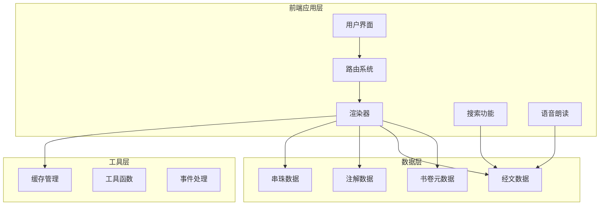
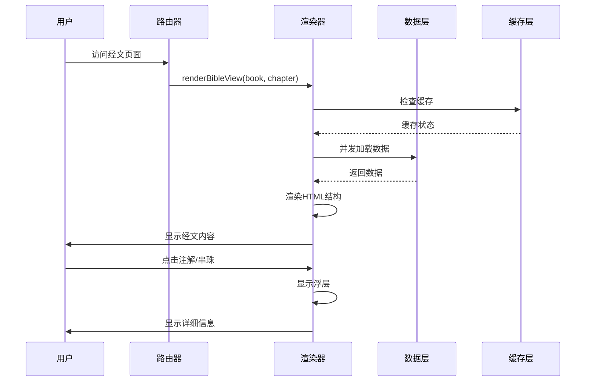
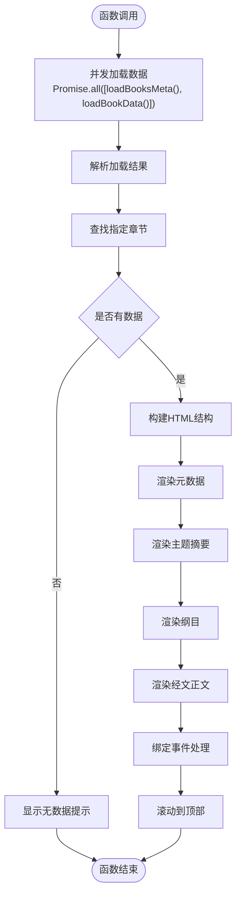
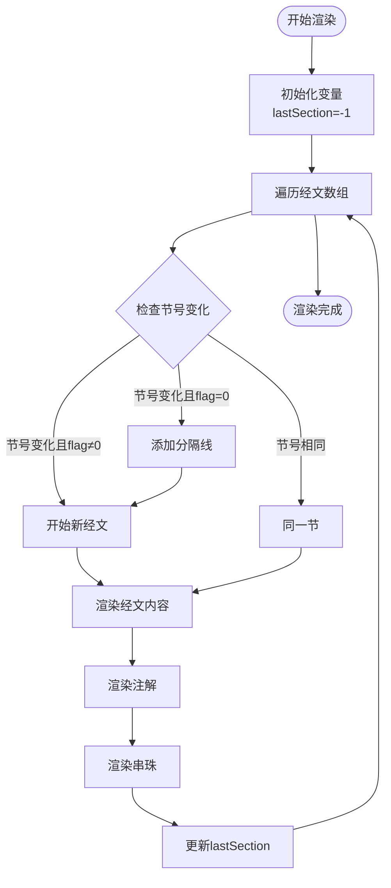
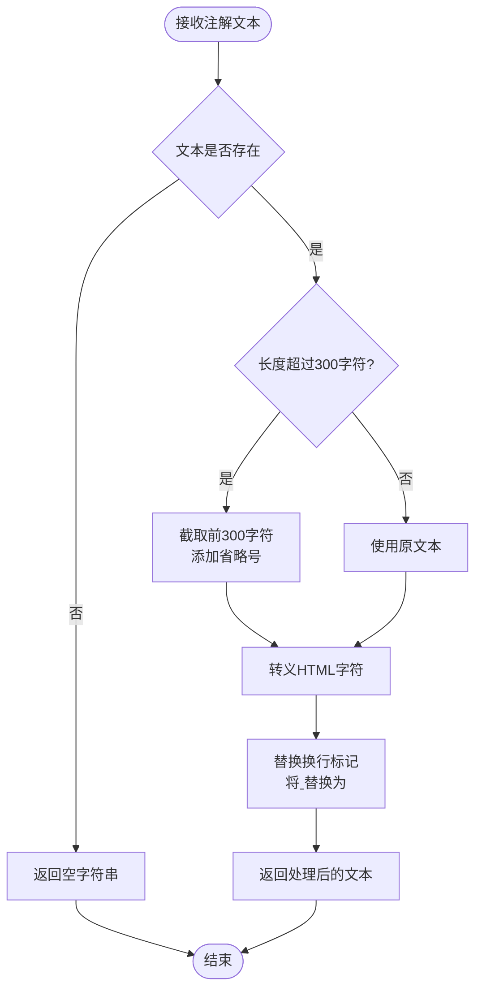
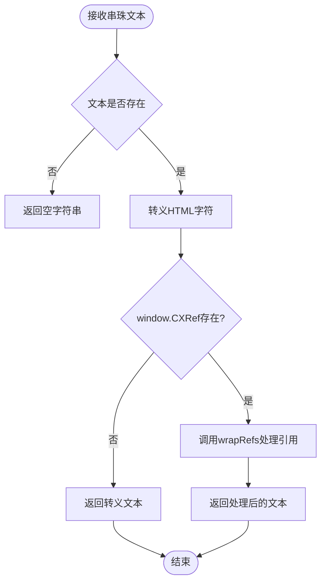
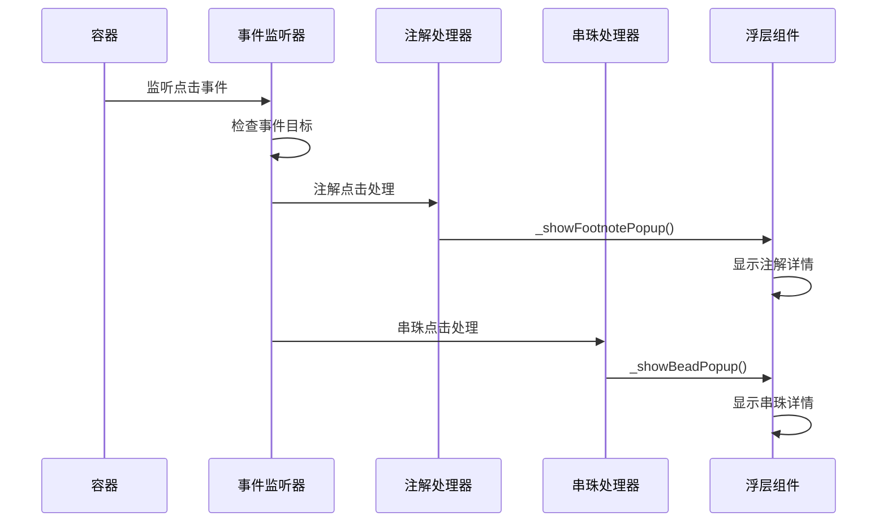
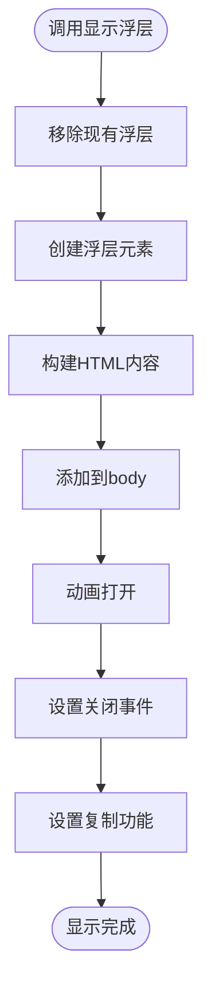
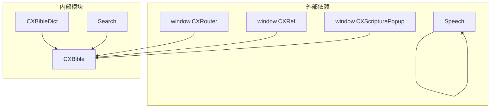
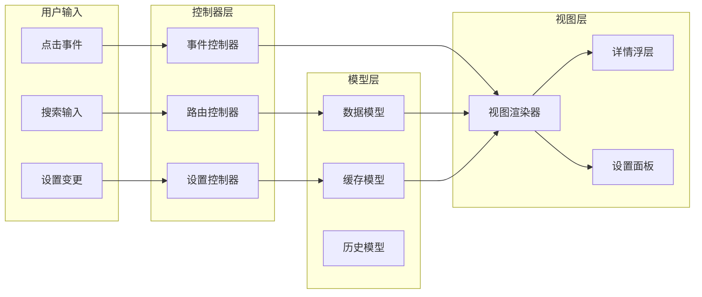

# 经文阅读API

<cite>
**本文档引用的文件**
- [bible-renderer.js](file://src/static/js/bible-renderer.js)
- [renderer.js](file://src/static/js/renderer.js)
- [bible-dict.js](file://src/static/js/bible-dict.js)
- [router.js](file://src/static/js/router.js)
- [search.js](file://src/static/js/search.js)
- [speech.js](file://src/static/js/speech.js)
- [2k.json](file://resource/2k.json)
- [01.json](file://output/data/bible/01.json)
- [main_manifest.json](file://src/templates/main_manifest.json)
- [package.json](file://package.json)
</cite>

## 目录
1. [简介](#简介)
2. [项目结构](#项目结构)
3. [核心组件](#核心组件)
4. [架构概览](#架构概览)
5. [详细组件分析](#详细组件分析)
6. [依赖分析](#依赖分析)
7. [性能考虑](#性能考虑)
8. [故障排除指南](#故障排除指南)
9. [结论](#结论)
10. [附录](#附录)

## 简介
本项目是一个基于PWA技术的圣经阅读器，提供了完整的经文渲染、注解显示、串珠解析和交互功能。系统采用模块化设计，通过Promise.all并发数据加载、智能缓存机制和事件驱动的交互模式，实现了高性能的经文阅读体验。

## 项目结构
项目采用前后端分离的架构设计，主要包含以下核心模块：



**图表来源**
- [bible-renderer.js:1-880](file://src/static/js/bible-renderer.js#L1-L880)
- [renderer.js:1-1471](file://src/static/js/renderer.js#L1-L1471)

**章节来源**
- [bible-renderer.js:1-880](file://src/static/js/bible-renderer.js#L1-L880)
- [renderer.js:1-1471](file://src/static/js/renderer.js#L1-L1471)

## 核心组件
本系统的核心组件包括：

### 1. 经文渲染器 (CXBible)
负责整个圣经阅读功能的实现，包含：
- renderBibleView(): 主要渲染函数
- _renderVerses(): 经文渲染算法
- _renderFootnoteText(): 注解文本处理
- _renderBeadText(): 串珠文本处理
- _bindVerseEvents(): 事件绑定机制

### 2. 数据管理系统
- Promise.all并发数据加载
- 智能缓存机制
- 数据回退策略

### 3. 交互控制系统
- 浮层显示机制
- 注解点击处理
- 串珠点击处理

**章节来源**
- [bible-renderer.js:324-399](file://src/static/js/bible-renderer.js#L324-L399)
- [bible-renderer.js:421-474](file://src/static/js/bible-renderer.js#L421-L474)

## 架构概览
系统采用模块化架构，各组件职责清晰：



**图表来源**
- [router.js:44-50](file://src/static/js/router.js#L44-L50)
- [bible-renderer.js:335-399](file://src/static/js/bible-renderer.js#L335-L399)

## 详细组件分析

### renderBibleView() 函数详解

#### 核心渲染流程
renderBibleView()函数是经文阅读的主要入口，采用Promise.all进行并发数据加载：



**图表来源**
- [bible-renderer.js:324-399](file://src/static/js/bible-renderer.js#L324-L399)

#### 参数类型与返回值
- **参数**: 
  - bookIndex: number - 书卷索引
  - chapter: number - 章节编号
- **返回值**: void - 无返回值，直接更新DOM

#### 错误处理机制
函数包含完整的错误处理：
- Promise.catch捕获加载失败
- 显示友好的错误提示
- 恢复到书卷导航

**章节来源**
- [bible-renderer.js:324-399](file://src/static/js/bible-renderer.js#L324-L399)

### _renderVerses() 函数深度解析

#### 经文渲染算法
_renderVerses()函数实现了复杂的经文渲染逻辑：



**图表来源**
- [bible-renderer.js:421-474](file://src/static/js/bible-renderer.js#L421-L474)

#### 节号分隔机制
- **标准节号**: 当节号变化且flag=0时，添加<hr class="verse-divider">
- **半节标记**: 支持上半节(flag=1)和下半节(flag=2)的特殊处理
- **连续节号**: 同一节内的多个段落

#### 注解显示逻辑
- 条件渲染：受showFootnotes开关控制
- 内联显示：每个注解作为独立块级元素
- 序号标识：显示注解序列号

#### 串珠处理机制
- 条件渲染：受showBeads开关控制
- 字母序列：使用字母(a,b,c...)标识串珠
- 引用解析：调用_renderBeadText()处理引用

**章节来源**
- [bible-renderer.js:421-474](file://src/static/js/bible-renderer.js#L421-L474)

### _renderFootnoteText() 函数分析

#### 文本处理算法
该函数专门处理注解文本的截取和格式化：



**图表来源**
- [bible-renderer.js:477-483](file://src/static/js/bible-renderer.js#L477-L483)

#### 处理特性
- **长度限制**: 自动截取长文本，保持用户体验流畅
- **HTML安全**: 完全转义HTML字符，防止XSS攻击
- **格式保持**: 保留文本的换行结构

**章节来源**
- [bible-renderer.js:477-483](file://src/static/js/bible-renderer.js#L477-L483)

### _renderBeadText() 函数分析

#### 串珠文本处理
该函数负责处理串珠文本中的经文引用：



**图表来源**
- [bible-renderer.js:486-495](file://src/static/js/bible-renderer.js#L486-L495)

#### 高级引用处理
- **智能解析**: 利用CXRef.wrapRefs()进行精确的经文引用解析
- **动态包装**: 将中文经文引用转换为可点击的链接元素
- **回退机制**: 当引用解析器不可用时，返回安全的转义文本

**章节来源**
- [bible-renderer.js:486-495](file://src/static/js/bible-renderer.js#L486-L495)

### _bindVerseEvents() 事件绑定机制

#### 事件处理架构
该函数实现了注解和串珠的点击处理机制：



**图表来源**
- [bible-renderer.js:498-526](file://src/static/js/bible-renderer.js#L498-L526)

#### 事件委托模式
- **容器监听**: 在app容器上统一监听所有点击事件
- **目标检查**: 通过classList.contains()精确识别目标元素
- **数据提取**: 从data-*属性中提取必要的数据信息

#### 处理流程
1. **注解处理**: `_showFootnotePopup()` - 查找并显示对应注解
2. **串珠处理**: `_showBeadPopup()` - 查找并显示对应串珠
3. **浮层显示**: `_showDetailOverlay()` - 统一的浮层显示机制

**章节来源**
- [bible-renderer.js:498-526](file://src/static/js/bible-renderer.js#L498-L526)

### _showDetailOverlay() 通用浮层函数

#### 浮层实现原理
该函数提供了统一的详情显示机制：



**图表来源**
- [bible-renderer.js:604-658](file://src/static/js/bible-renderer.js#L604-L658)

#### 功能特性
- **唯一性保证**: 自动移除现有浮层，避免重复显示
- **动画效果**: 使用requestAnimationFrame实现流畅的动画
- **交互控制**: 支持点击背景关闭和复制功能
- **响应式设计**: 适配不同屏幕尺寸

#### 复制功能实现
- **现代API**: 优先使用navigator.clipboard.writeText()
- **回退机制**: 当Clipboard API不可用时，使用textarea回退方案
- **用户反馈**: 显示"已复制"的状态提示

**章节来源**
- [bible-renderer.js:604-658](file://src/static/js/bible-renderer.js#L604-L658)

## 依赖分析

### 核心依赖关系
系统采用松耦合的设计模式，各模块间依赖关系清晰：



**图表来源**
- [bible-renderer.js:509-523](file://src/static/js/bible-renderer.js#L509-L523)
- [bible-dict.js:17-62](file://src/static/js/bible-dict.js#L17-L62)

### 数据流分析
系统的数据流向呈现典型的MVC模式：



**图表来源**
- [router.js:27-82](file://src/static/js/router.js#L27-L82)
- [bible-renderer.js:335-399](file://src/static/js/bible-renderer.js#L335-L399)

**章节来源**
- [router.js:27-82](file://src/static/js/router.js#L27-L82)
- [bible-renderer.js:335-399](file://src/static/js/bible-renderer.js#L335-L399)

## 性能考虑

### 并发数据加载优化
系统采用Promise.all实现并发数据加载，显著提升加载性能：

- **并发策略**: 同时加载书卷元数据和经文数据
- **缓存利用**: 智能缓存已加载的数据
- **错误隔离**: 单个数据源失败不影响整体加载

### 渲染性能优化
- **事件委托**: 减少事件监听器数量
- **条件渲染**: 受开关控制的可选内容
- **懒加载**: 浮层内容按需加载

### 内存管理
- **缓存限制**: 历史记录限制在50条以内
- **DOM清理**: 浮层关闭时自动清理DOM节点
- **事件清理**: 浮层移除时自动移除事件监听器

## 故障排除指南

### 常见问题及解决方案

#### 数据加载失败
**症状**: 页面显示"加载失败，请重试"
**原因**: 网络请求超时或数据文件缺失
**解决**: 
1. 检查网络连接
2. 验证数据文件完整性
3. 清除浏览器缓存

#### 注解显示异常
**症状**: 注解无法点击或显示空白
**原因**: 注解数据格式不正确
**解决**:
1. 检查注解数据结构
2. 验证注解序列号唯一性
3. 确认数据文件编码

#### 浮层显示问题
**症状**: 点击注解/串珠无反应
**原因**: 事件绑定失败或DOM结构变化
**解决**:
1. 检查事件委托绑定
2. 验证DOM元素存在性
3. 确认CSS样式冲突

**章节来源**
- [bible-renderer.js:392-398](file://src/static/js/bible-renderer.js#L392-L398)
- [bible-renderer.js:529-564](file://src/static/js/bible-renderer.js#L529-L564)

## 结论
本经文阅读API系统通过精心设计的模块化架构和高效的并发处理机制，为用户提供了一个功能完整、性能优异的圣经阅读体验。系统的关键优势包括：

1. **高性能并发加载**: Promise.all实现数据的并行获取
2. **智能缓存机制**: 减少重复数据加载，提升响应速度
3. **灵活的渲染系统**: 支持注解、串珠等多种内容类型的渲染
4. **优雅的错误处理**: 完善的异常处理和用户反馈机制
5. **可扩展的架构**: 模块化设计便于功能扩展和维护

该系统为类似的内容阅读应用提供了优秀的参考实现，特别是在并发数据处理、事件驱动交互和性能优化方面具有重要的借鉴价值。

## 附录

### API函数参考

#### renderBibleView(bookIndex, chapter)
- **功能**: 渲染指定书卷和章节的经文
- **参数**: bookIndex(number), chapter(number)
- **返回值**: void
- **使用示例**: `CXBible.renderBibleView(1, 1)`

#### _renderVerses(chapterData, bookAcronym, chapter)
- **功能**: 渲染经文正文区域
- **参数**: chapterData(object), bookAcronym(string), chapter(number)
- **返回值**: string(HTML)
- **使用示例**: `_renderVerses(chapterData, '创', 1)`

#### _renderFootnoteText(text)
- **功能**: 处理注解文本显示
- **参数**: text(string)
- **返回值**: string(HTML)
- **使用示例**: `_renderFootnoteText(noteText)`

#### _renderBeadText(text)
- **功能**: 处理串珠文本显示
- **参数**: text(string)
- **返回值**: string(HTML)
- **使用示例**: `_renderBeadText(beadText)`

#### _bindVerseEvents()
- **功能**: 绑定经文点击事件
- **参数**: 无
- **返回值**: void
- **使用示例**: `_bindVerseEvents()`

#### _showDetailOverlay(htmlContent, source, rawText)
- **功能**: 显示详情浮层
- **参数**: htmlContent(string), source(string), rawText(string)
- **返回值**: void
- **使用示例**: `_showDetailOverlay(html, source, raw)`

### 数据结构定义

#### 经文数据结构
```json
{
  "book_index": 1,
  "book_name": "创世记",
  "book_acronym": "创",
  "chapters": [
    {
      "chapter": 1,
      "verses": [
        {
          "section": 1,
          "flag": 0,
          "content": "{1}[a]起初{2}神{3}[b]创造{4}诸天与地，",
          "footnotes": [
            {
              "seq": 1,
              "location": 1,
              "note": "注解内容..."
            }
          ],
          "beads": [
            {
              "seq": "a",
              "location": 1,
              "bead": "经文引用"
            }
          ]
        }
      ]
    }
  ]
}
```

### 扩展开发指南

#### 自定义渲染扩展
1. **继承渲染器**: 继承CXBible类，重写特定渲染方法
2. **插件机制**: 通过事件钩子实现功能扩展
3. **配置系统**: 添加新的显示开关和配置选项

#### 性能优化建议
1. **虚拟滚动**: 对长章节实现虚拟滚动
2. **图片懒加载**: 对经文图片实现懒加载
3. **字体优化**: 使用Web Font优化加载性能
4. **缓存策略**: 实现更精细的缓存控制

#### 安全考虑
1. **XSS防护**: 所有用户输入都经过HTML转义
2. **CSP策略**: 实施严格的Content Security Policy
3. **数据验证**: 对所有外部数据进行格式验证