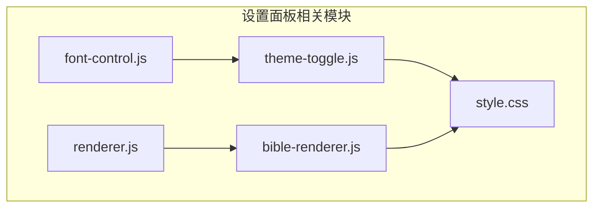
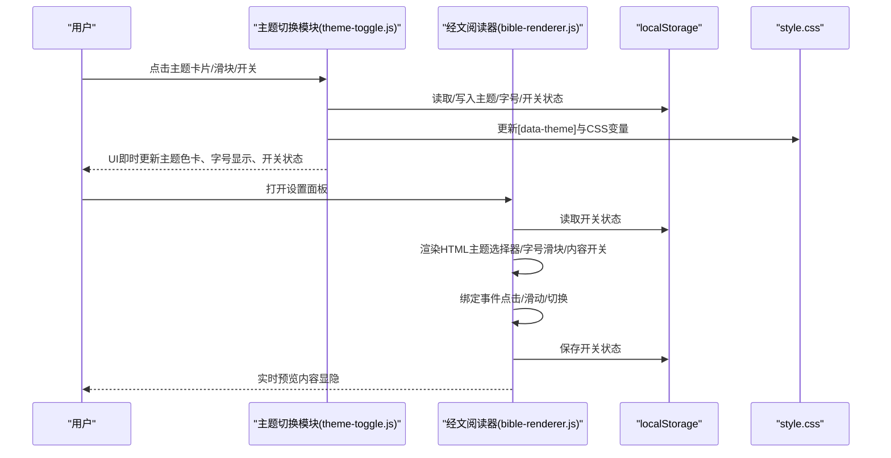
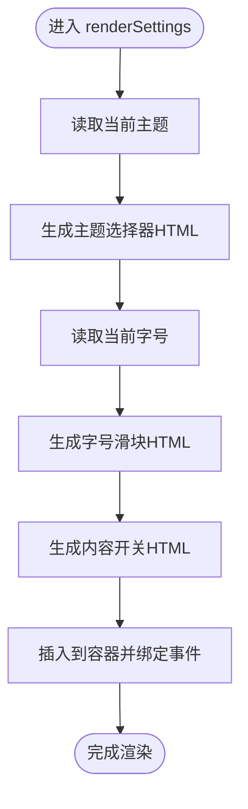
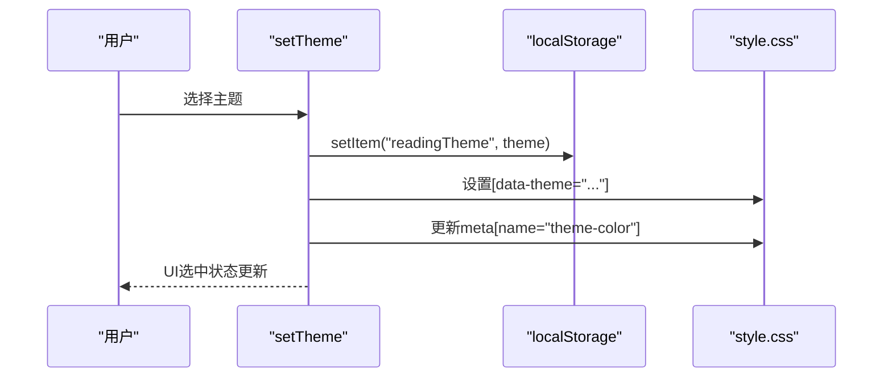
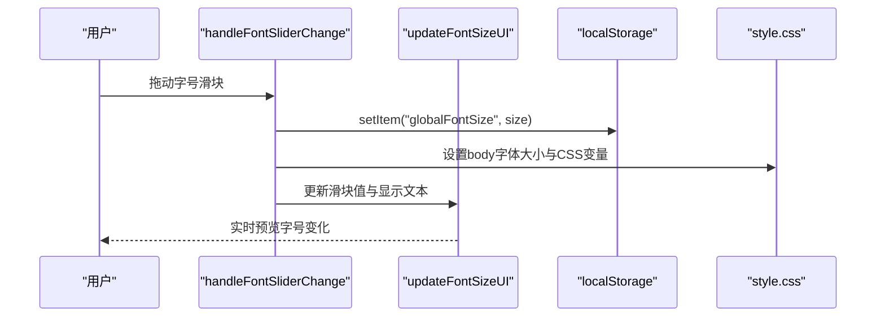
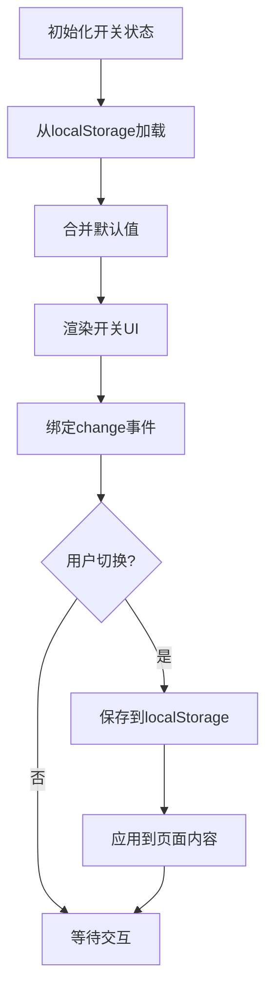
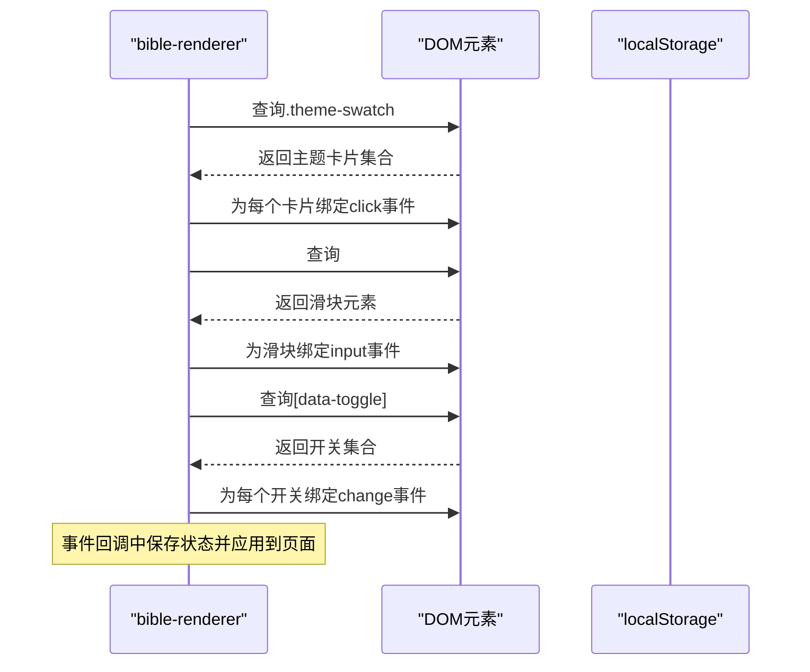
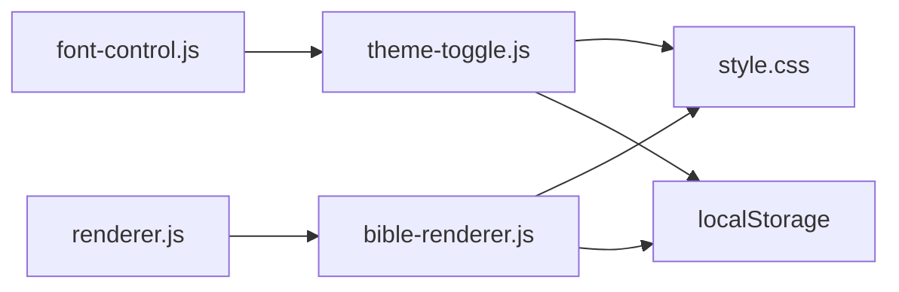

# 设置面板API

<cite>
**本文档引用的文件**
- [theme-toggle.js](file://src/static/js/theme-toggle.js)
- [font-control.js](file://src/static/js/font-control.js)
- [renderer.js](file://src/static/js/renderer.js)
- [bible-renderer.js](file://src/static/js/bible-renderer.js)
- [style.css](file://src/static/css/style.css)
</cite>

## 目录
1. [简介](#简介)
2. [项目结构](#项目结构)
3. [核心组件](#核心组件)
4. [架构总览](#架构总览)
5. [详细组件分析](#详细组件分析)
6. [依赖关系分析](#依赖关系分析)
7. [性能考虑](#性能考虑)
8. [故障排查指南](#故障排查指南)
9. [结论](#结论)
10. [附录](#附录)

## 简介
本文件为“设置面板API”的详细参考文档，聚焦于以下目标：
- renderSettings() 函数的设置界面渲染逻辑：主题选择器、字号滑块、内容开关的HTML生成
- 主题切换函数的主题应用机制与本地存储同步
- 字号调节函数的实时预览效果与样式更新逻辑
- 内容开关函数的状态管理与持久化存储
- 事件绑定函数 _bindSettingsEvents() 的交互处理流程
- 每个API函数的参数类型、返回值、使用示例与错误处理方法
- 用户体验优化建议与自定义设置项的扩展方法

## 项目结构
本项目采用前端模块化组织，设置面板相关能力分布在多个JS模块与CSS样式中：
- 主题与字体控制：theme-toggle.js
- 字体控制按钮桥接：font-control.js
- 页面渲染与路由：renderer.js
- 经文阅读器设置：bible-renderer.js
- 主题与UI样式：style.css

**图表来源**
- [theme-toggle.js:1-1353](file://src/static/js/theme-toggle.js#L1-L1353)
- [font-control.js:1-34](file://src/static/js/font-control.js#L1-L34)
- [bible-renderer.js:660-880](file://src/static/js/bible-renderer.js#L660-L880)
- [renderer.js:1-800](file://src/static/js/renderer.js#L1-L800)
- [style.css:1-1111](file://src/static/css/style.css#L1-L1111)

**章节来源**
- [theme-toggle.js:1-1353](file://src/static/js/theme-toggle.js#L1-L1353)
- [font-control.js:1-34](file://src/static/js/font-control.js#L1-L34)
- [bible-renderer.js:660-880](file://src/static/js/bible-renderer.js#L660-L880)
- [renderer.js:1-800](file://src/static/js/renderer.js#L1-L800)
- [style.css:1-1111](file://src/static/css/style.css#L1-L1111)

## 核心组件
- 主题切换与字体控制模块（theme-toggle.js）
  - 提供主题选择、字号滑块、朗读速度、内容与数据操作区、版本信息等
  - 暴露公开API：setTheme、setFontSize、getToggleState、setToggleState、getAllToggleStates、getCurrentTheme、getAvailableThemes
- 字体控制按钮桥接（font-control.js）
  - 将底部控制栏的字体增减/重置按钮映射到主题模块的全局函数
- 经文阅读器设置（bible-renderer.js）
  - 渲染设置面板（主题、字号、内容开关）
  - 事件绑定与状态持久化
- 页面渲染与路由（renderer.js）
  - SPA渲染器，负责页面切换与视图渲染
- 主题与UI样式（style.css）
  - 定义主题变量、设置面板UI样式、滑块与开关样式

**章节来源**
- [theme-toggle.js:1295-1353](file://src/static/js/theme-toggle.js#L1295-L1353)
- [font-control.js:1-34](file://src/static/js/font-control.js#L1-34)
- [bible-renderer.js:660-880](file://src/static/js/bible-renderer.js#L660-L880)
- [renderer.js:1-800](file://src/static/js/renderer.js#L1-L800)
- [style.css:1-1111](file://src/static/css/style.css#L1-L1111)

## 架构总览
设置面板API围绕“主题/字号/内容开关”三大维度构建，采用“模块化JS + CSS变量”的设计，实现跨页面的一致性与可扩展性。

**图表来源**
- [theme-toggle.js:1183-1353](file://src/static/js/theme-toggle.js#L1183-L1353)
- [bible-renderer.js:660-880](file://src/static/js/bible-renderer.js#L660-L880)

## 详细组件分析

### renderSettings() 函数与HTML生成
- 作用：渲染设置面板，包含主题选择器、字号滑块、内容开关等区域
- 主题选择器：遍历可用主题数组，根据当前主题状态生成带激活样式的主题卡片
- 字号滑块：从本地存储读取当前字号，生成范围滑块与标签
- 内容开关：渲染六个开关项（书卷主题、书卷简介、经文纲目、经文注解、经文串珠、经节分割线），并绑定事件

**图表来源**
- [bible-renderer.js:663-728](file://src/static/js/bible-renderer.js#L663-L728)

**章节来源**
- [bible-renderer.js:663-728](file://src/static/js/bible-renderer.js#L663-L728)

### 主题切换函数与本地存储同步
- setTheme(themeName)
  - 参数：themeName（字符串，必须为有效主题值）
  - 返回：无
  - 逻辑：更新根元素的data-theme属性，写入localStorage，更新UI选中状态，同步meta主题色
- 主题应用机制
  - 通过[data-theme]选择器应用主题变量
  - meta[name="theme-color"]与StatusBar插件联动，适配深浅色系统
- 本地存储同步
  - localStorage键：readingTheme（theme-toggle.js）与bibleTheme（bible-renderer.js）
  - 兼容旧版主题键并迁移

**图表来源**
- [theme-toggle.js:1208-1232](file://src/static/js/theme-toggle.js#L1208-L1232)
- [bible-renderer.js:730-750](file://src/static/js/bible-renderer.js#L730-L750)

**章节来源**
- [theme-toggle.js:1208-1232](file://src/static/js/theme-toggle.js#L1208-L1232)
- [bible-renderer.js:730-750](file://src/static/js/bible-renderer.js#L730-L750)

### 字号调节函数与实时预览
- 字号级别：5级（14, 16, 18, 20, 22）
- handleFontSliderChange(value)
  - 参数：value（字符串/数值，表示索引）
  - 返回：无
  - 逻辑：更新当前索引、应用字号到body与CSS变量，并更新UI显示
- 实时预览与样式更新
  - applyFontSize(size)：设置body字体大小与CSS变量
  - updateFontSizeUI()：同步滑块值与显示文本
- 底部控制栏字体按钮桥接
  - font-control.js将“字体减小/增大/重置”映射到全局CXFontControl

**图表来源**
- [theme-toggle.js:1249-1278](file://src/static/js/theme-toggle.js#L1249-L1278)
- [font-control.js:8-25](file://src/static/js/font-control.js#L8-L25)

**章节来源**
- [theme-toggle.js:1249-1278](file://src/static/js/theme-toggle.js#L1249-L1278)
- [font-control.js:8-25](file://src/static/js/font-control.js#L8-L25)

### 内容开关函数与状态管理
- 开关项集合：showTheme、showIntro、showOutline、showFootnotes、showBeads、showVerseDivider
- 状态管理
  - 初始加载：从localStorage读取并合并默认值
  - 保存策略：每次变更写入localStorage
- UI同步
  - 通过data-toggle属性与复选框联动
  - _bindSettingsEvents()绑定change事件，保存状态并即时生效
- 与bible-renderer的集成
  - 通过window.CX暴露的get/set API与bible-renderer共享状态

**图表来源**
- [theme-toggle.js:1280-1286](file://src/static/js/theme-toggle.js#L1280-L1286)
- [bible-renderer.js:764-772](file://src/static/js/bible-renderer.js#L764-L772)

**章节来源**
- [theme-toggle.js:1280-1286](file://src/static/js/theme-toggle.js#L1280-L1286)
- [bible-renderer.js:764-772](file://src/static/js/bible-renderer.js#L764-L772)

### 事件绑定函数 _bindSettingsEvents() 的交互处理
- 主题切换事件
  - 为每个主题色卡绑定点击事件，更新data-theme、meta主题色与激活状态
- 字号滑块事件
  - 为滑块绑定input事件，实时更新字号并保存
- 内容开关事件
  - 为每个开关绑定change事件，保存状态并即时生效

**图表来源**
- [bible-renderer.js:730-772](file://src/static/js/bible-renderer.js#L730-L772)

**章节来源**
- [bible-renderer.js:730-772](file://src/static/js/bible-renderer.js#L730-L772)

### API函数参考

- setTheme(themeName)
  - 参数：themeName（字符串，有效主题值）
  - 返回：无
  - 作用：应用主题并同步UI与本地存储
  - 示例：调用 window.CX.setTheme('warm-yellow')
  - 错误处理：无效主题名会被忽略

- setFontSize(level)
  - 参数：level（整数，0-4对应5级字号）
  - 返回：无
  - 作用：设置字号级别并更新UI
  - 示例：调用 window.CX.setFontSize(2)

- getToggleState(key)
  - 参数：key（字符串，开关键）
  - 返回：布尔值
  - 作用：获取指定开关状态

- setToggleState(key, value)
  - 参数：key（字符串）、value（布尔）
  - 返回：无
  - 作用：设置并持久化开关状态，同步到bible-renderer内部

- getAllToggleStates()
  - 参数：无
  - 返回：对象，包含所有开关键值对
  - 作用：获取当前所有开关状态

- getCurrentTheme()
  - 参数：无
  - 返回：字符串，当前主题名
  - 作用：获取当前主题

- getAvailableThemes()
  - 参数：无
  - 返回：数组，可用主题列表
  - 作用：获取可用主题集合

- handleFontSliderChange(value)
  - 参数：value（字符串/数值，表示索引）
  - 返回：无
  - 作用：响应滑块输入，更新字号并保存

- decreaseFontSize()/increaseFontSize()/resetFontSize()
  - 参数：无
  - 返回：无
  - 作用：通过全局对象CXFontControl进行字体增减与重置

- toggleThemePanel()
  - 参数：无
  - 返回：无
  - 作用：显示/隐藏设置面板，锁定/解锁页面滚动

- handleSpeechRateChange(value)
  - 参数：value（数值，百分比）
  - 返回：无
  - 作用：更新朗读速度并同步到语音模块

**章节来源**
- [theme-toggle.js:1295-1353](file://src/static/js/theme-toggle.js#L1295-L1353)
- [font-control.js:8-25](file://src/static/js/font-control.js#L8-L25)
- [bible-renderer.js:730-772](file://src/static/js/bible-renderer.js#L730-L772)

## 依赖关系分析
- 主题与字体控制依赖CSS变量与meta主题色
- 字体控制按钮桥接依赖全局对象CXFontControl
- 经文阅读器设置依赖localStorage与bible-renderer内部状态
- 页面渲染器负责路由与视图切换，承载设置面板的SPA渲染

**图表来源**
- [theme-toggle.js:1-1353](file://src/static/js/theme-toggle.js#L1-L1353)
- [font-control.js:1-34](file://src/static/js/font-control.js#L1-L34)
- [bible-renderer.js:660-880](file://src/static/js/bible-renderer.js#L660-L880)
- [renderer.js:1-800](file://src/static/js/renderer.js#L1-L800)
- [style.css:1-1111](file://src/static/css/style.css#L1-L1111)

**章节来源**
- [theme-toggle.js:1-1353](file://src/static/js/theme-toggle.js#L1-L1353)
- [font-control.js:1-34](file://src/static/js/font-control.js#L1-L34)
- [bible-renderer.js:660-880](file://src/static/js/bible-renderer.js#L660-L880)
- [renderer.js:1-800](file://src/static/js/renderer.js#L1-L800)
- [style.css:1-1111](file://src/static/css/style.css#L1-L1111)

## 性能考虑
- 滑块事件防抖：handleFontSliderChange在每次input触发时立即应用，适合实时预览
- 事件委托：主题与开关事件通过查询一次性绑定，减少重复查询
- CSS变量更新：通过设置CSS变量与body字体大小，避免大量DOM样式重排
- 本地存储：集中读写，避免频繁IO

[本节为通用指导，无需特定文件引用]

## 故障排查指南
- 主题切换无效
  - 检查主题名是否在有效列表中
  - 确认[data-theme]选择器与CSS变量正确
  - 查看localStorage中readingTheme键是否存在
- 字号滑块无反应
  - 确认滑块元素存在且事件已绑定
  - 检查handleFontSliderChange是否被调用
  - 确认body与CSS变量更新
- 内容开关不生效
  - 检查[data-toggle]属性与事件绑定
  - 确认localStorage中bible_toggles键存在
  - 确认bible-renderer内部状态同步

**章节来源**
- [theme-toggle.js:1208-1278](file://src/static/js/theme-toggle.js#L1208-L1278)
- [bible-renderer.js:730-772](file://src/static/js/bible-renderer.js#L730-L772)

## 结论
设置面板API通过模块化设计实现了主题、字号与内容开关的统一管理与持久化。其核心优势在于：
- 以CSS变量驱动主题切换，保证跨页面一致性
- 事件绑定与本地存储分离，便于扩展与维护
- 提供清晰的公开API，便于与其他模块集成

[本节为总结，无需特定文件引用]

## 附录

### 用户体验优化建议
- 滑块与开关增加过渡动画，提升交互反馈
- 主题色卡增加视觉对比度，便于夜间模式识别
- 字号滑块提供快捷按钮（+/-/重置），降低滑动误差
- 内容开关支持批量操作（全选/反选），提升效率

### 自定义设置项的扩展方法
- 在bible-renderer.js中新增设置项区域与HTML生成逻辑
- 在theme-toggle.js中扩展公开API，提供状态读写与同步
- 在localStorage中新增键值，确保初始化与持久化
- 在CSS中新增变量或类名，满足视觉需求

[本节为概念性内容，无需特定文件引用]