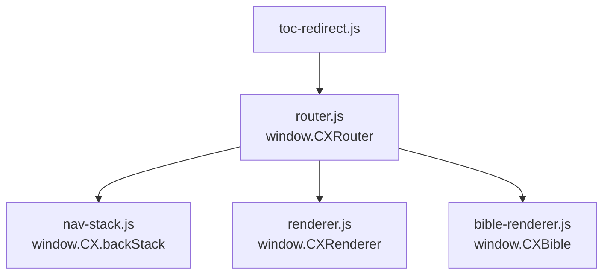
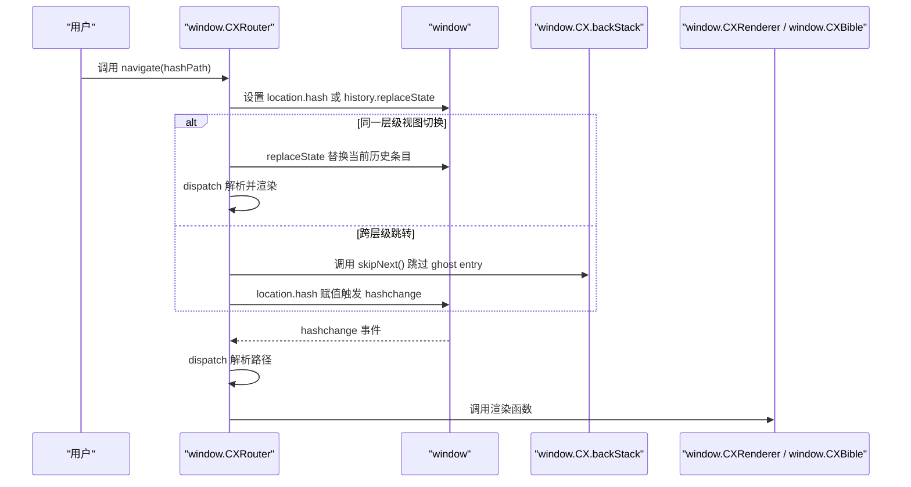
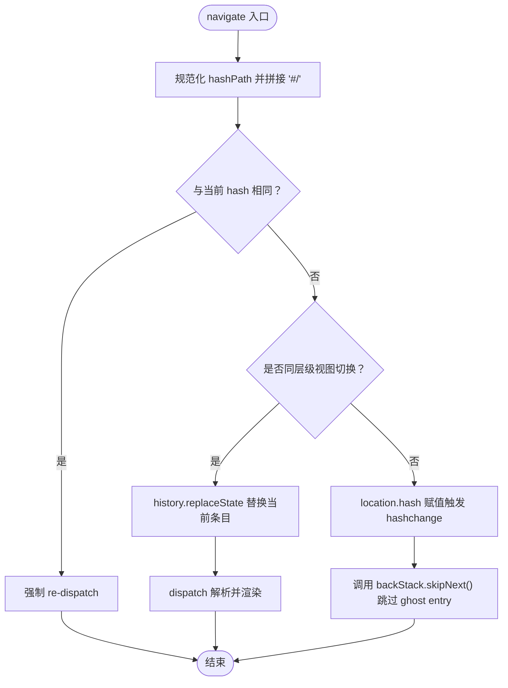
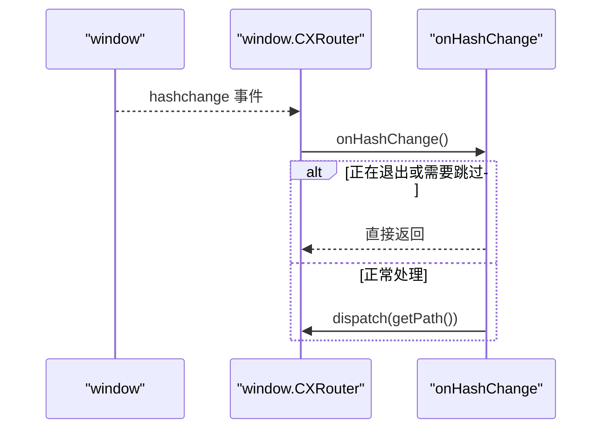
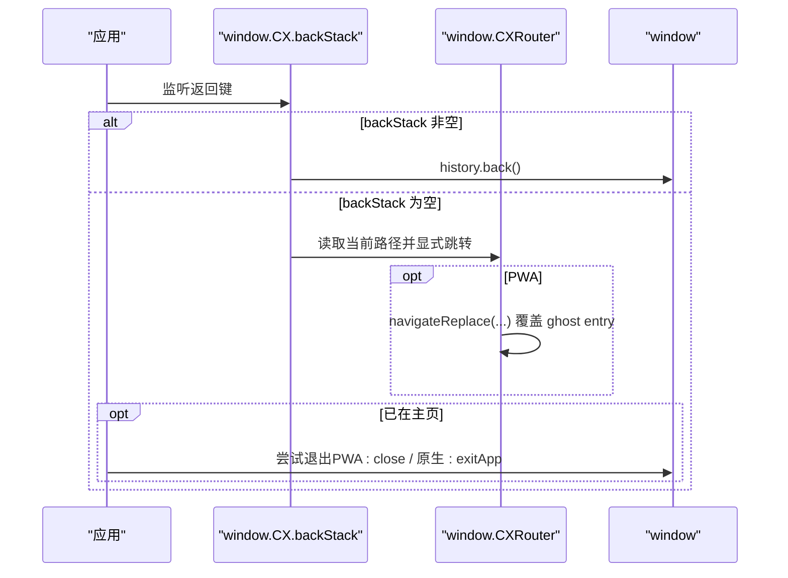
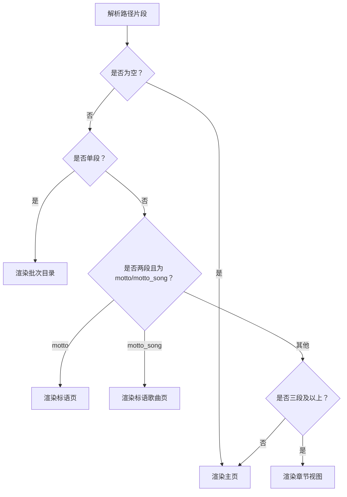
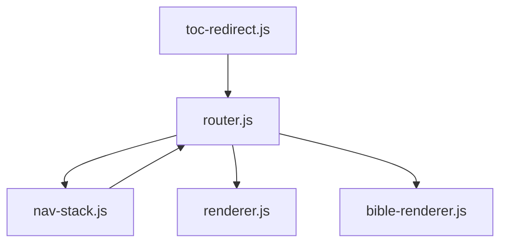

# 路由API

<cite>
**本文档引用的文件**
- [router.js](file://src/static/js/router.js)
- [nav-stack.js](file://src/static/js/nav-stack.js)
- [renderer.js](file://src/static/js/renderer.js)
- [bible-renderer.js](file://src/static/js/bible-renderer.js)
- [toc-redirect.js](file://src/static/js/toc-redirect.js)
</cite>

## 目录
1. [简介](#简介)
2. [项目结构](#项目结构)
3. [核心组件](#核心组件)
4. [架构总览](#架构总览)
5. [详细组件分析](#详细组件分析)
6. [依赖关系分析](#依赖关系分析)
7. [性能考量](#性能考量)
8. [故障排查指南](#故障排查指南)
9. [结论](#结论)
10. [附录](#附录)

## 简介
本文件为 router.js 路由API的完整参考文档，聚焦以下主题：
- 路由导航函数 navigate() 的使用方法：包括URL参数处理、路由匹配规则、历史记录管理
- 路由监听器的注册与移除机制：hashchange事件处理、路由变化回调函数
- 历史记录管理API：前进后退、历史栈操作、状态保存与恢复
- 路由参数解析方法：路径参数提取、查询字符串处理、路由守卫机制
- 路由扩展与自定义：动态路由添加、路由权限控制、嵌套路由支持
- 路由性能优化与错误处理最佳实践

## 项目结构
本项目的前端路由采用基于 hash 的SPA路由，核心文件如下：
- router.js：定义 window.CXRouter，负责路由启动、导航、历史栈与hash变化处理
- nav-stack.js：定义 window.CX.backStack 与返回键处理逻辑，适配PWA与原生App
- renderer.js：定义 window.CXRenderer，负责训练内容的渲染
- bible-renderer.js：定义 window.CXBible，负责圣经阅读器的渲染
- toc-redirect.js：根据星期几对目录项进行跳转目标调整

图表来源
- [router.js:1-287](file://src/static/js/router.js#L1-L287)
- [nav-stack.js:1-455](file://src/static/js/nav-stack.js#L1-L455)
- [renderer.js:1-200](file://src/static/js/renderer.js#L1-L200)
- [bible-renderer.js:1-200](file://src/static/js/bible-renderer.js#L1-L200)
- [toc-redirect.js:1-21](file://src/static/js/toc-redirect.js#L1-L21)

章节来源
- [router.js:1-287](file://src/static/js/router.js#L1-L287)
- [nav-stack.js:1-455](file://src/static/js/nav-stack.js#L1-L455)
- [renderer.js:1-200](file://src/static/js/renderer.js#L1-L200)
- [bible-renderer.js:1-200](file://src/static/js/bible-renderer.js#L1-L200)
- [toc-redirect.js:1-21](file://src/static/js/toc-redirect.js#L1-L21)

## 核心组件
- window.CXRouter：提供路由启动、导航、历史管理与当前路径查询
- window.CX.backStack：提供返回键栈管理，配合 nav-stack.js 实现跨平台返回行为
- window.CXRenderer：负责训练内容渲染（主页、批次目录、章节视图、标语页等）
- window.CXBible：负责圣经阅读器渲染（书卷导航、章节阅读、图表、读经计划、设置等）

章节来源
- [router.js:95-149](file://src/static/js/router.js#L95-L149)
- [nav-stack.js:151-157](file://src/static/js/nav-stack.js#L151-L157)
- [renderer.js:14-13](file://src/static/js/renderer.js#L14-L13)
- [bible-renderer.js:1-200](file://src/static/js/bible-renderer.js#L1-L200)

## 架构总览
路由系统围绕 hashchange 事件驱动，通过 window.CXRouter.dispatch() 解析路径并调用相应的渲染器。window.CX.backStack 作为返回键栈，在PWA与原生App环境下分别处理返回逻辑。

图表来源
- [router.js:104-142](file://src/static/js/router.js#L104-L142)
- [router.js:223-274](file://src/static/js/router.js#L223-L274)
- [router.js:84-93](file://src/static/js/router.js#L84-L93)
- [router.js:202-212](file://src/static/js/router.js#L202-L212)

## 详细组件分析

### 路由API：window.CXRouter
- start()
  - 功能：注册 hashchange 监听器，首次派发当前路径
  - 行为：若已启动则直接返回
  - 影响：初始化路由状态，触发初次渲染
- navigate(hashPath)
  - 功能：导航到指定 hash 路径
  - 参数：hashPath（字符串，如 "bible/1/1" 或 "2025-04/1/cx"）
  - 逻辑要点：
    - 同书卷章节切换：使用 replaceState 替换当前历史条目，避免历史栈膨胀
    - 跨层级跳转：设置 location.hash，触发 hashchange，并通过 backStack.skipNext() 跳过可能的 ghost entry
    - 同路径再次导航：强制 re-dispatch，确保页面刷新
- navigateReplace(hashPath)
  - 功能：使用 replaceState 导航，不新增历史条目
  - 适用场景：PWA返回键显式层级跳转，天然覆盖 ghost entry
- back()
  - 功能：调用 history.back() 返回上一页
- skipNextDispatch()
  - 功能：抑制下一次 hashchange 的 dispatch（用于跳过 ghost replaceState 条目）
- currentPath()
  - 功能：返回当前解析后的路径字符串

图表来源
- [router.js:104-142](file://src/static/js/router.js#L104-L142)
- [router.js:223-274](file://src/static/js/router.js#L223-L274)

章节来源
- [router.js:95-149](file://src/static/js/router.js#L95-L149)
- [router.js:104-142](file://src/static/js/router.js#L104-L142)
- [router.js:223-274](file://src/static/js/router.js#L223-L274)

### 路由监听器：hashchange 事件处理
- 注册：start() 中通过 addEventListener('hashchange', onHashChange) 注册监听
- 触发：location.hash 变化时触发
- 处理流程：
  - 检查退出标志与 ghost entry 标志，必要时跳过
  - 调用 dispatch() 解析路径并渲染
- 退出标志：window.__cxExiting 用于阻止PWA退出流程中的路由重渲染

图表来源
- [router.js:84-93](file://src/static/js/router.js#L84-L93)
- [router.js:202-212](file://src/static/js/router.js#L202-L212)

章节来源
- [router.js:84-93](file://src/static/js/router.js#L84-L93)
- [router.js:202-212](file://src/static/js/router.js#L202-L212)

### 历史记录管理：window.CX.backStack 与返回键
- backStack 的作用：在PWA与原生App环境下统一返回键行为，维护“返回回调”栈
- 适配策略：
  - 原生App（Capacitor）：backButton 在 hash 变化前触发，读取当前路径，显式层级跳转
  - PWA：popstate 在 hash 变化后触发，读取 __cxCurrentPath（router 在 dispatch 时写入），fallback 机制兜底
- 返回键处理流程：
  - 若 backStack 非空：调用 history.back() 消耗回调
  - 否则根据当前路径层级进行显式跳转：
    - 章节视图 → 批次目录
    - 批次目录 → 主页
    - 已在主页 → 尝试退出（PWA：window.close；原生：exitApp）

图表来源
- [nav-stack.js:30-55](file://src/static/js/nav-stack.js#L30-L55)
- [nav-stack.js:77-134](file://src/static/js/nav-stack.js#L77-L134)
- [router.js:124-127](file://src/static/js/router.js#L124-L127)
- [router.js:250-253](file://src/static/js/router.js#L250-L253)

章节来源
- [nav-stack.js:151-157](file://src/static/js/nav-stack.js#L151-L157)
- [nav-stack.js:30-55](file://src/static/js/nav-stack.js#L30-L55)
- [nav-stack.js:77-134](file://src/static/js/nav-stack.js#L77-L134)
- [router.js:124-127](file://src/static/js/router.js#L124-L127)
- [router.js:250-253](file://src/static/js/router.js#L250-L253)

### 路由参数解析与匹配规则
- 路径解析：
  - 通过 split('/') 过滤空项，得到路径片段数组
  - 记录当前路径于 window.__cxCurrentPath，供返回键 fallback 使用
- 匹配规则（训练内容）：
  - 空路径：渲染主页
  - 单段：渲染批次目录
  - "motto"：渲染标语页
  - "motto_song"：渲染标语歌曲页
  - 三段及以上：渲染章节视图（批路径、章节号、视图类型）
- 匹配规则（圣经阅读器）：
  - "bible/{book}/{chapter}"：渲染圣经阅读
  - "charts"：渲染图表页
  - "plan/{id}"：渲染读经计划
  - "settings"：渲染设置面板
  - 兼容旧路由：训练路径的兼容处理
- 查询字符串处理：
  - 代码中未直接解析查询字符串；如需使用，可在业务层自行解析 window.location.search

图表来源
- [router.js:179-200](file://src/static/js/router.js#L179-L200)
- [router.js:27-82](file://src/static/js/router.js#L27-L82)

章节来源
- [router.js:179-200](file://src/static/js/router.js#L179-L200)
- [router.js:27-82](file://src/static/js/router.js#L27-L82)

### 路由守卫机制
- 退出标志：window.__cxExiting 用于阻止PWA退出流程中的路由重渲染
- ghost entry 跳过：navigate() 与 navigateReplace() 中通过 skipNextDispatch() 与 backStack.skipNext() 跳过浏览器实现差异导致的虚假历史条目
- 返回键守卫：nav-stack.js 在返回键触发时检查 backStack 与退出标志，确保正确的层级跳转

章节来源
- [router.js:104-142](file://src/static/js/router.js#L104-L142)
- [router.js:223-274](file://src/static/js/router.js#L223-L274)
- [nav-stack.js:16-28](file://src/static/js/nav-stack.js#L16-L28)
- [nav-stack.js:44-54](file://src/static/js/nav-stack.js#L44-L54)

### 路由扩展与自定义
- 动态路由添加：
  - 在 dispatch() 中扩展新的路径前缀分支，映射到相应的渲染器函数
  - 保持与现有匹配规则一致的优先级与分支结构
- 路由权限控制：
  - 在 navigate() 或 dispatch() 中加入权限校验逻辑，未授权时阻止跳转或重定向至登录页
- 嵌套路由支持：
  - 通过多段路径（如 "batch/chapter/view"）实现嵌套视图切换
  - 使用 navigateReplace() 在同章节视图间切换，避免历史栈膨胀

章节来源
- [router.js:179-200](file://src/static/js/router.js#L179-L200)
- [router.js:27-82](file://src/static/js/router.js#L27-L82)
- [router.js:223-274](file://src/static/js/router.js#L223-L274)

### 路由与渲染器集成
- 训练内容渲染器（window.CXRenderer）：
  - 提供 renderHome()、renderBatchIndex()、renderChapterView()、renderMotto()、renderMottoSong()
  - 与 router.js 的路径匹配规则一一对应
- 圣经阅读器（window.CXBible）：
  - 提供 renderBookList()、renderBibleView()、renderCharts()、renderReadingPlan()、renderSettings()
  - 与 router.js 的 "bible/*"、"charts"、"plan/*"、"settings" 路由匹配

章节来源
- [renderer.js:8-12](file://src/static/js/renderer.js#L8-L12)
- [bible-renderer.js:143-179](file://src/static/js/bible-renderer.js#L143-L179)
- [router.js:44-62](file://src/static/js/router.js#L44-L62)

### 目录跳转定制（toc-redirect.js）
- 根据当前星期几动态调整目录项的跳转目标：
  - 周日：跳转到纲目页
  - 周一至周六：跳转到晨读页对应天数锚点
- 与路由系统的协作：通过修改 a 标签 href 实现页面级跳转，不依赖 hash 路由

章节来源
- [toc-redirect.js:1-21](file://src/static/js/toc-redirect.js#L1-L21)

## 依赖关系分析
- 耦合关系：
  - router.js 依赖 window.CXRenderer 与 window.CXBible 进行页面渲染
  - router.js 依赖 window.CX.backStack 进行返回键处理
  - nav-stack.js 依赖 router.js 的 __cxCurrentPath 与 navigate()/navigateReplace() 进行显式层级跳转
- 外部依赖：
  - history API：用于前进后退与 replaceState
  - hashchange 事件：路由变化的核心触发源
  - Capacitor App 插件：原生App环境下的返回键事件

图表来源
- [router.js:95-149](file://src/static/js/router.js#L95-L149)
- [nav-stack.js:151-157](file://src/static/js/nav-stack.js#L151-L157)
- [renderer.js:14-13](file://src/static/js/renderer.js#L14-L13)
- [bible-renderer.js:1-200](file://src/static/js/bible-renderer.js#L1-L200)
- [toc-redirect.js:1-21](file://src/static/js/toc-redirect.js#L1-L21)

章节来源
- [router.js:95-149](file://src/static/js/router.js#L95-L149)
- [nav-stack.js:151-157](file://src/static/js/nav-stack.js#L151-L157)
- [renderer.js:14-13](file://src/static/js/renderer.js#L14-L13)
- [bible-renderer.js:1-200](file://src/static/js/bible-renderer.js#L1-L200)
- [toc-redirect.js:1-21](file://src/static/js/toc-redirect.js#L1-L21)

## 性能考量
- 历史栈优化：
  - 同书卷章节切换使用 replaceState，避免历史栈膨胀
  - navigateReplace() 用于PWA返回键显式层级跳转，天然覆盖 ghost entry
- 事件处理：
  - hashchange 事件在路由切换中频繁触发，应避免在 dispatch() 中执行重型操作
  - 通过 window.__cxExiting 与 skipNextDispatch() 减少不必要的重渲染
- 渲染性能：
  - 将渲染器函数拆分为细粒度模块，按需调用
  - 使用 window.__cxCurrentPath 缓存当前路径，减少重复解析

## 故障排查指南
- 症状：返回键无效或多次返回才能退出
  - 检查 nav-stack.js 的 backStack 是否正确注册与消费
  - 确认 navigate()/navigateReplace() 是否正确调用 skipNextDispatch()/skipNext()
- 症状：同路径重复导航不生效
  - navigate() 对相同 hash 会强制 re-dispatch，确认是否预期行为
- 症状：PWA启动后短时间内返回键异常
  - nav-stack.js 通过时间窗过滤虚假 popstate，确认是否处于 grace period 内
- 症状：章节视图切换历史栈过长
  - 确认使用 navigateReplace() 在同章节视图间切换

章节来源
- [nav-stack.js:4-7](file://src/static/js/nav-stack.js#L4-L7)
- [router.js:104-142](file://src/static/js/router.js#L104-L142)
- [router.js:223-274](file://src/static/js/router.js#L223-L274)

## 结论
本路由系统通过 window.CXRouter 与 window.CX.backStack 的协同，实现了跨平台的一致导航体验。其核心特性包括：
- 基于 hash 的轻量级SPA路由
- 自动区分同层级视图切换与跨层级跳转，优化历史栈
- 统一的返回键处理，适配PWA与原生App
- 与渲染器清晰分离，便于扩展与维护

## 附录
- API一览
  - window.CXRouter.start()
  - window.CXRouter.navigate(hashPath)
  - window.CXRouter.navigateReplace(hashPath)
  - window.CXRouter.back()
  - window.CXRouter.skipNextDispatch()
  - window.CXRouter.currentPath()
  - window.CX.backStack.push(callback)
  - window.CX.backStack.pop()
  - window.CX.backStack.size()
  - window.CX.backStack.setFallback(callback)
  - window.CX.backStack.discard()

章节来源
- [router.js:95-149](file://src/static/js/router.js#L95-L149)
- [nav-stack.js:151-157](file://src/static/js/nav-stack.js#L151-L157)