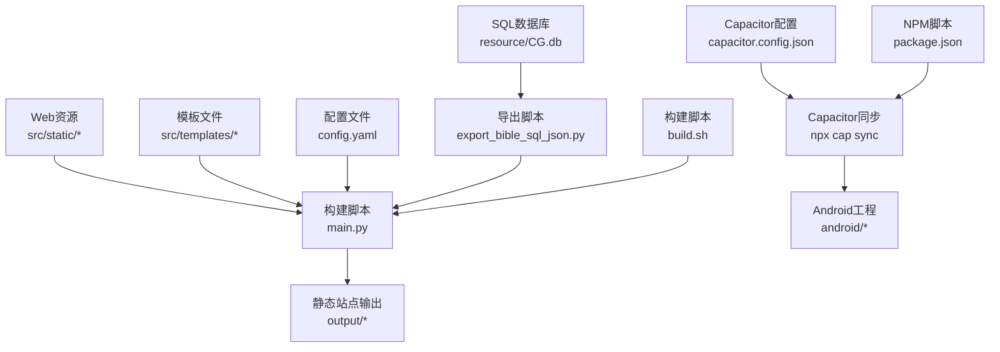
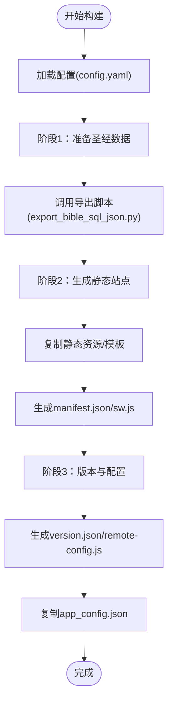
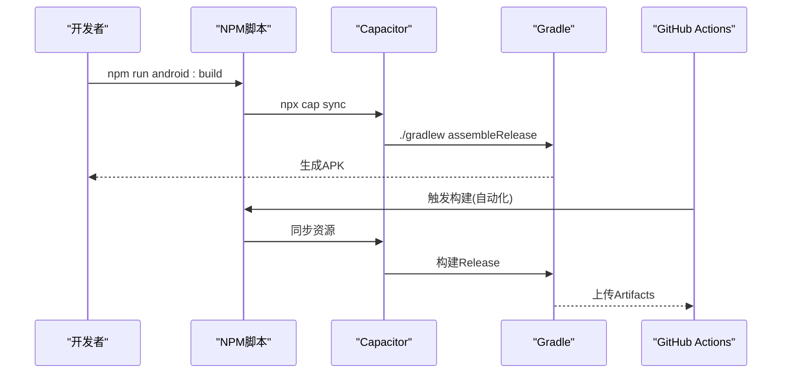
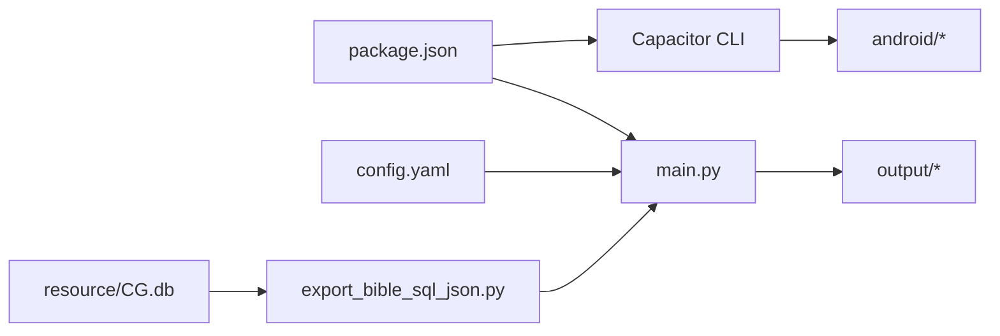

# Android应用集成

<cite>
**本文档引用的文件**
- [capacitor.config.json](file://capacitor.config.json)
- [package.json](file://package.json)
- [android/README.md](file://android/README.md)
- [build.sh](file://build.sh)
- [config.yaml](file://config.yaml)
- [main.py](file://main.py)
- [export_bible_sql_json.py](file://export_bible_sql_json.py)
- [app_config.json](file://app_config.json)
- [.github/workflows/android-release.yml](file://.github/workflows/android-release.yml)
- [src/templates/main_manifest.json](file://src/templates/main_manifest.json)
- [src/templates/main_sw.js](file://src/templates/main_sw.js)
</cite>

## 目录
1. [简介](#简介)
2. [项目结构](#项目结构)
3. [核心组件](#核心组件)
4. [架构总览](#架构总览)
5. [详细组件分析](#详细组件分析)
6. [依赖关系分析](#依赖关系分析)
7. [性能考量](#性能考量)
8. [故障排查指南](#故障排查指南)
9. [结论](#结论)
10. [附录](#附录)

## 简介
本文件面向“圣经阅读器”Android应用的集成与发布，围绕Capacitor框架在Android平台的配置与使用、从Web应用到APK包的构建流程、原生能力集成（权限、设备API、推送）、Android特定配置与优化、调试与测试方法、发布流程与版本管理，以及与iOS平台的差异与兼容性进行系统化说明。文档同时提供可视化图示帮助理解整体架构与关键流程。

## 项目结构
该项目采用“前端PWA + Capacitor桥接 + Gradle构建”的混合架构：
- Web前端资源与模板位于 src/static 与 src/templates
- 构建产物输出至 output/ 目录，供Capacitor同步到原生工程
- Capacitor配置集中在 capacitor.config.json
- Android工程由Capacitor管理，通过脚本触发Gradle构建
- 发布流程通过GitHub Actions自动化执行



**图表来源**
- [main.py:1-361](file://main.py#L1-L361)
- [config.yaml:1-12](file://config.yaml#L1-L12)
- [export_bible_sql_json.py:1-835](file://export_bible_sql_json.py#L1-L835)
- [capacitor.config.json:1-10](file://capacitor.config.json#L1-L10)
- [package.json:1-24](file://package.json#L1-L24)
- [build.sh:1-16](file://build.sh#L1-L16)

**章节来源**
- [capacitor.config.json:1-10](file://capacitor.config.json#L1-L10)
- [package.json:1-24](file://package.json#L1-L24)
- [android/README.md:1-13](file://android/README.md#L1-L13)
- [config.yaml:1-12](file://config.yaml#L1-L12)
- [main.py:1-361](file://main.py#L1-L361)
- [build.sh:1-16](file://build.sh#L1-L16)

## 核心组件
- Capacitor配置与Android参数
  - 应用标识与名称、Web目录指向 output
  - Android特定参数：允许混合内容、禁用WebView调试
- NPM脚本与构建链路
  - build：调用Python主构建脚本生成静态站点
  - cap:sync：同步Web资源到原生工程
  - android:build / android:dev：构建APK或打开Android工程
- 构建脚本与数据导出
  - main.py：分阶段生成静态站点、清单与版本配置
  - export_bible_sql_json.py：从SQLite导出圣经数据JSON
- 配置与模板
  - config.yaml：输出目录、资源目录、数据库路径、读经计划与远程服务器
  - 模板：manifest.json、service worker

**章节来源**
- [capacitor.config.json:1-10](file://capacitor.config.json#L1-L10)
- [package.json:5-11](file://package.json#L5-L11)
- [main.py:36-76](file://main.py#L36-L76)
- [export_bible_sql_json.py:743-800](file://export_bible_sql_json.py#L743-L800)
- [config.yaml:1-12](file://config.yaml#L1-L12)
- [src/templates/main_manifest.json](file://src/templates/main_manifest.json)
- [src/templates/main_sw.js](file://src/templates/main_sw.js)

## 架构总览
下图展示从Web资源到APK的端到端流程，包括数据准备、静态站点生成、Capacitor同步与Gradle构建。

```mermaid
sequenceDiagram
participant Dev as "开发者"
participant NPM as "NPM脚本(package.json)"
participant Py as "构建脚本(main.py)"
participant Exp as "数据导出(export_bible_sql_json.py)"
participant Cap as "Capacitor同步"
participant And as "Android工程"
participant Gradle as "Gradle构建"
Dev->>NPM : 运行 android : build 或 android : dev
NPM->>Py : 调用 build 脚本
Py->>Exp : 导出圣经数据(JSON)
Exp-->>Py : 输出 data/* JSON
Py->>Py : 复制静态资源/生成清单/版本配置
Py-->>NPM : 产出 output/*
NPM->>Cap : npx cap sync
Cap->>And : 同步Web资源到 android/app/src/main/assets/www
NPM->>Gradle : ./gradlew assembleRelease/assembleDebug
Gradle-->>Dev : 生成 APK
```

**图表来源**
- [package.json:9-10](file://package.json#L9-L10)
- [main.py:36-76](file://main.py#L36-L76)
- [export_bible_sql_json.py:743-800](file://export_bible_sql_json.py#L743-L800)
- [capacitor.config.json:4](file://capacitor.config.json#L4)

## 详细组件分析

### Capacitor配置与Android参数
- 关键参数说明
  - appId：应用包名
  - appName：应用显示名称
  - webDir：Web资源目录（output）
  - android.allowMixedContent：允许HTTP与HTTPS混合内容
  - android.webContentsDebuggingEnabled：禁用WebView调试（生产环境安全建议）
- 集成要点
  - Capacitor会将webDir中的静态资源打包到Android assets目录
  - 生产环境建议关闭webContentsDebuggingEnabled
  - allowMixedContent应谨慎使用，仅在必要时开启

**章节来源**
- [capacitor.config.json:1-10](file://capacitor.config.json#L1-L10)

### 构建脚本与数据导出
- 构建阶段
  - 阶段1：准备圣经数据（调用导出脚本）
  - 阶段2：生成静态站点（复制资源、生成清单与SW）
  - 阶段3：版本与配置（生成version.json、remote-config.js、复制app_config.json）
- 数据导出
  - 从SQLite数据库导出bible-text.json、bible-notes.json、bible-xrefs.json、bible-books.json、reading-plans.json
  - 支持串珠归一化与按书卷分片输出
- 资源处理
  - 排除训练相关JS文件，减小APK体积
  - 生成manifest.json与service worker，支持PWA特性



**图表来源**
- [main.py:36-76](file://main.py#L36-L76)
- [export_bible_sql_json.py:743-800](file://export_bible_sql_json.py#L743-L800)
- [config.yaml:1-12](file://config.yaml#L1-L12)

**章节来源**
- [main.py:36-76](file://main.py#L36-L76)
- [export_bible_sql_json.py:743-800](file://export_bible_sql_json.py#L743-L800)
- [config.yaml:1-12](file://config.yaml#L1-L12)

### Android构建与发布流程
- 本地开发与调试
  - 使用android:dev脚本：构建Web资源 → 同步Capacitor → 打开Android工程
- 正式构建
  - 使用android:build脚本：构建Web资源 → 同步Capacitor → Gradle构建Release包
- GitHub Actions自动化
  - .github/workflows/android-release.yml负责CI/CD流水线，实现自动构建与发布



**图表来源**
- [package.json:9-10](file://package.json#L9-L10)
- [android/README.md:9-12](file://android/README.md#L9-L12)
- [.github/workflows/android-release.yml](file://.github/workflows/android-release.yml)

**章节来源**
- [package.json:5-11](file://package.json#L5-L11)
- [android/README.md:1-13](file://android/README.md#L1-L13)
- [.github/workflows/android-release.yml](file://.github/workflows/android-release.yml)

### 原生功能集成与权限管理
- 权限管理
  - 在Android工程中配置所需权限（如网络、存储等），确保应用正常访问资源与推送服务
- 设备API访问
  - 通过Capacitor插件访问设备能力（如状态栏、应用元数据等）
  - 项目已引入相关插件依赖，可在需要时扩展
- 推送通知
  - 可结合远程推送服务，在客户端注册推送ID并上报至服务端
  - 服务端侧涉及包名、IMEI、ADID等字段，便于渠道与用户追踪

**章节来源**
- [package.json:12-22](file://package.json#L12-L22)
- [app_config.json:1-6](file://app_config.json#L1-L6)

### Android特定配置与优化策略
- WebView与网络
  - allowMixedContent：仅在确需时启用，避免安全风险
  - webContentsDebuggingEnabled：生产环境保持关闭
- 资源体积优化
  - 排除训练相关JS文件，减小APK体积
  - 对导出的JSON进行去空白压缩，降低包体
- 清单与离线缓存
  - 生成manifest.json与service worker，提升PWA体验与离线可用性

**章节来源**
- [capacitor.config.json:5-8](file://capacitor.config.json#L5-L8)
- [main.py:26-33](file://main.py#L26-L33)
- [main.py:107-116](file://main.py#L107-L116)

### 调试与测试
- WebView调试
  - 开发阶段可临时开启webContentsDebuggingEnabled进行调试
  - 生产环境务必关闭
- 本地调试
  - 使用android:dev脚本快速打开Android工程进行真机调试
- 构建验证
  - 通过build.sh在CI环境中验证Python依赖安装与构建流程

**章节来源**
- [capacitor.config.json:7](file://capacitor.config.json#L7)
- [package.json:10](file://package.json#L10)
- [build.sh:1-16](file://build.sh#L1-L16)

### 发布流程与版本管理
- 版本信息
  - 通过app_config.json与构建脚本生成version.json，包含版本号与构建时间
- 自动化发布
  - GitHub Actions工作流负责自动化构建与制品发布
- 清单与配置
  - 生成manifest.json与remote-config.js，支持动态服务器配置

**章节来源**
- [app_config.json:1-6](file://app_config.json#L1-L6)
- [main.py:288-321](file://main.py#L288-L321)
- [.github/workflows/android-release.yml](file://.github/workflows/android-release.yml)

### 与iOS平台的差异与兼容性
- 平台差异
  - Android侧关注包名、IMEI、推送ID等字段；iOS侧通常使用IDFA等标识
  - 服务端协议中区分平台字段，便于统一管理
- 兼容性建议
  - 在客户端与服务端协议中为不同平台预留字段，避免硬编码
  - 通过配置与模板动态生成平台相关资源

**章节来源**
- [app_config.json:1-6](file://app_config.json#L1-L6)

## 依赖关系分析
- 构建链路依赖
  - package.json脚本依赖main.py与Capacitor CLI
  - main.py依赖config.yaml与export_bible_sql_json.py
- Capacitor依赖
  - Android平台依赖与CLI版本需匹配，确保同步与构建稳定



**图表来源**
- [package.json:5-11](file://package.json#L5-L11)
- [main.py:36-76](file://main.py#L36-L76)
- [config.yaml:1-12](file://config.yaml#L1-L12)
- [export_bible_sql_json.py:743-800](file://export_bible_sql_json.py#L743-L800)

**章节来源**
- [package.json:1-24](file://package.json#L1-L24)
- [main.py:36-76](file://main.py#L36-L76)
- [config.yaml:1-12](file://config.yaml#L1-L12)
- [export_bible_sql_json.py:743-800](file://export_bible_sql_json.py#L743-L800)

## 性能考量
- 资源体积控制
  - 排除不必要的JS文件，压缩导出JSON
- 网络与安全
  - 生产环境避免混合内容，减少安全风险与性能损耗
- 构建效率
  - 使用模板与配置集中管理，减少重复生成逻辑

[本节为通用指导，无需列出具体文件来源]

## 故障排查指南
- 构建失败
  - 检查Python依赖是否正确安装（build.sh）
  - 确认config.yaml中的路径与文件是否存在
- Capacitor同步问题
  - 确认capacitor.config.json的webDir与实际输出目录一致
  - 使用npx cap sync重新同步
- Android构建异常
  - 检查Gradle环境与Android SDK配置
  - 查看GitHub Actions日志定位问题

**章节来源**
- [build.sh:1-16](file://build.sh#L1-L16)
- [config.yaml:1-12](file://config.yaml#L1-L12)
- [capacitor.config.json:4](file://capacitor.config.json#L4)

## 结论
本项目通过Capacitor实现了Web应用到Android的无缝集成，配合Python构建脚本与自动化工作流，形成从数据导出、静态站点生成到APK发布的完整链路。遵循本文档的配置与优化建议，可有效提升安全性、稳定性与发布效率。同时，针对iOS平台的差异已在服务端协议层面体现，便于跨平台一致性管理。

## 附录
- 关键文件索引
  - Capacitor配置：capacitor.config.json
  - 构建脚本：main.py、export_bible_sql_json.py、config.yaml
  - 项目脚本：package.json、android/README.md、build.sh
  - 发布工作流：.github/workflows/android-release.yml
  - 应用配置：app_config.json
  - PWA模板：src/templates/main_manifest.json、src/templates/main_sw.js

[本节为概览性索引，无需列出具体文件来源]