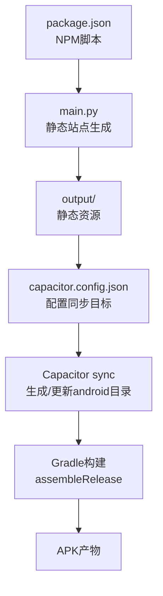
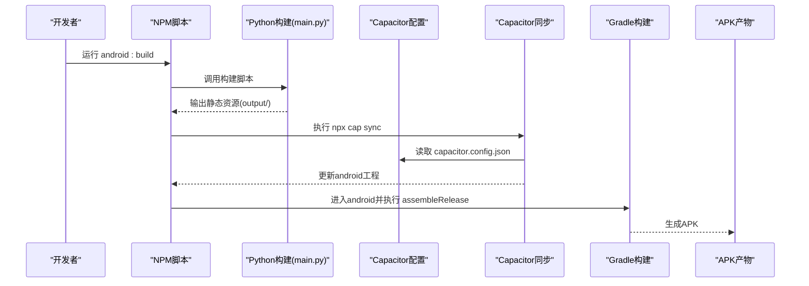
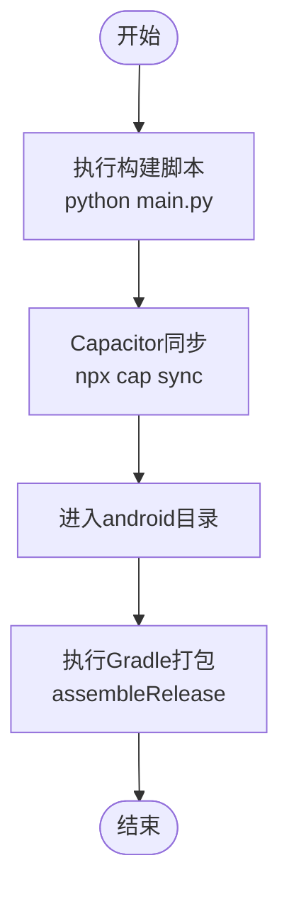
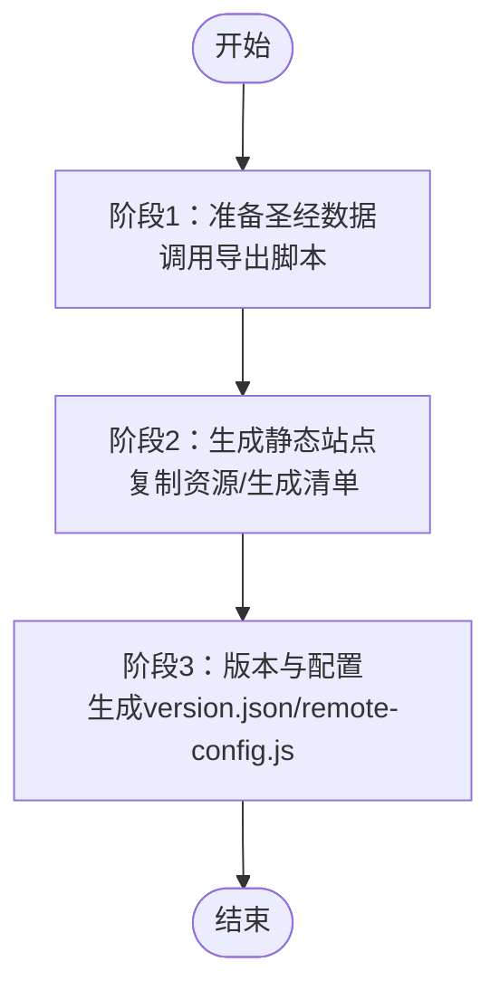
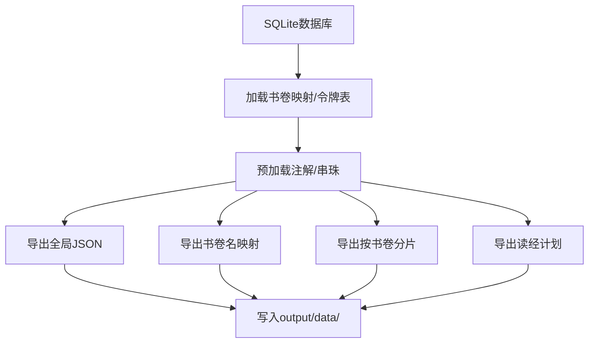
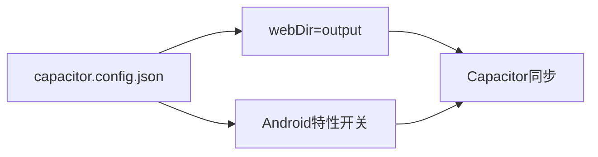
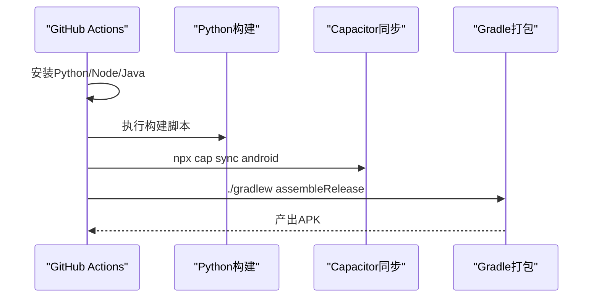
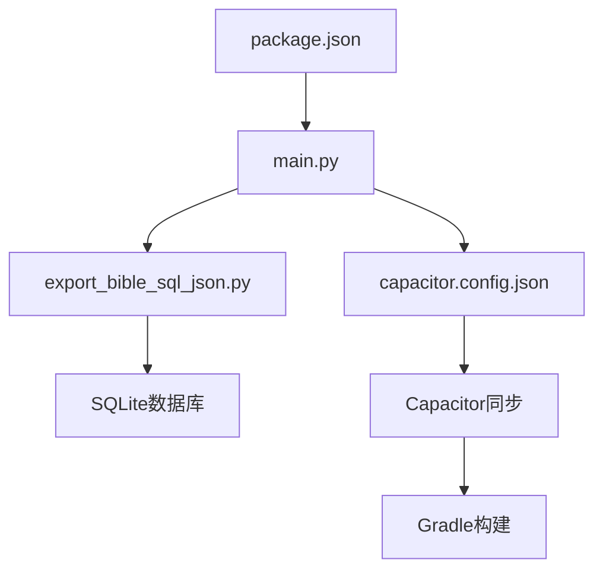

# Android构建流程

<cite>
**本文档引用的文件**
- [package.json](file://package.json)
- [capacitor.config.json](file://capacitor.config.json)
- [build.sh](file://build.sh)
- [.github/workflows/android-release.yml](file://.github/workflows/android-release.yml)
- [main.py](file://main.py)
- [export_bible_sql_json.py](file://export_bible_sql_json.py)
- [config.yaml](file://config.yaml)
- [requirements.txt](file://requirements.txt)
- [app_config.json](file://app_config.json)
- [android/README.md](file://android/README.md)
</cite>

## 目录
1. [简介](#简介)
2. [项目结构](#项目结构)
3. [核心组件](#核心组件)
4. [架构总览](#架构总览)
5. [详细组件分析](#详细组件分析)
6. [依赖关系分析](#依赖关系分析)
7. [性能考虑](#性能考虑)
8. [故障排除指南](#故障排除指南)
9. [结论](#结论)
10. [附录](#附录)

## 简介
本文件面向Android构建流程，系统性阐述从Web应用到APK包的完整构建过程，涵盖NPM脚本执行、Capacitor命令调用、Gradle构建等步骤；解释android:build脚本的工作原理与各阶段职责；总结构建优化策略（代码压缩、资源优化、签名配置等）；说明如何自定义构建参数与环境变量；提供CI/CD集成与自动化构建配置方案。

## 项目结构
该项目采用“前端PWA + Capacitor桥接 + Gradle打包”的混合架构：
- Web端构建由Python脚本负责，生成静态资源到output/目录
- Capacitor将静态资源同步至原生Android工程，并配置应用元信息
- Gradle负责编译、打包与签名，最终产出APK

图表来源
- [package.json:1-24](file://package.json#L1-L24)
- [main.py:36-76](file://main.py#L36-L76)
- [capacitor.config.json:1-10](file://capacitor.config.json#L1-L10)

章节来源
- [package.json:1-24](file://package.json#L1-L24)
- [capacitor.config.json:1-10](file://capacitor.config.json#L1-L10)
- [android/README.md:1-13](file://android/README.md#L1-L13)

## 核心组件
- NPM脚本层：统一入口脚本，串联Python构建、Capacitor同步与Gradle打包
- Python构建层：分阶段生成静态站点与配置文件，输出至Capacitor的webDir
- Capacitor配置层：定义应用ID、应用名、静态资源目录与Android特性开关
- CI/CD层：GitHub Actions流水线，自动安装依赖、构建Web资源、同步Capacitor并打包APK

章节来源
- [package.json:5-11](file://package.json#L5-L11)
- [main.py:36-76](file://main.py#L36-L76)
- [capacitor.config.json:1-10](file://capacitor.config.json#L1-L10)
- [.github/workflows/android-release.yml:1-54](file://.github/workflows/android-release.yml#L1-L54)

## 架构总览
下图展示从Web应用到APK的关键交互路径：

图表来源
- [package.json:9](file://package.json#L9)
- [main.py:36-76](file://main.py#L36-L76)
- [capacitor.config.json:4](file://capacitor.config.json#L4)
- [.github/workflows/android-release.yml:40-47](file://.github/workflows/android-release.yml#L40-L47)

## 详细组件分析

### NPM脚本与android:build工作流
- android:build脚本顺序执行：构建Web资源 → 同步Capacitor → 进入android目录并执行Gradle打包
- 该脚本确保Capacitor在Gradle构建前完成静态资源注入与原生工程更新

图表来源
- [package.json:9](file://package.json#L9)
- [main.py:36-76](file://main.py#L36-L76)

章节来源
- [package.json:9](file://package.json#L9)

### Python构建流程（main.py）
- 阶段1：准备圣经数据，调用导出脚本生成全局JSON与按书卷分片
- 阶段2：复制静态资源、生成manifest与SW、复制模板文件
- 阶段3：生成版本信息与远程配置、复制应用配置

图表来源
- [main.py:36-76](file://main.py#L36-L76)
- [main.py:87-117](file://main.py#L87-L117)
- [main.py:121-161](file://main.py#L121-L161)
- [main.py:288-321](file://main.py#L288-L321)

章节来源
- [main.py:36-76](file://main.py#L36-L76)
- [main.py:87-117](file://main.py#L87-L117)
- [main.py:121-161](file://main.py#L121-L161)
- [main.py:288-321](file://main.py#L288-L321)

### 导出脚本（export_bible_sql_json.py）
- 从SQLite数据库导出多种JSON格式数据，包含经文、注解、串珠、书卷映射与读经计划
- 支持规范化串珠引用、按书卷分片输出，便于前端按需加载

图表来源
- [export_bible_sql_json.py:743-800](file://export_bible_sql_json.py#L743-L800)

章节来源
- [export_bible_sql_json.py:1-800](file://export_bible_sql_json.py#L1-L800)

### Capacitor配置与同步
- 配置项决定Capacitor同步的目标目录与Android特性开关
- Capacitor会根据配置将output/中的静态资源注入到android工程

图表来源
- [capacitor.config.json:1-10](file://capacitor.config.json#L1-L10)

章节来源
- [capacitor.config.json:1-10](file://capacitor.config.json#L1-L10)

### CI/CD自动化构建
- 在GitHub Actions中，流水线按顺序安装Python与Node依赖、执行构建、同步Capacitor并打包APK
- 成功后可将APK上传至发布页面（按标签触发）

图表来源
- [.github/workflows/android-release.yml:1-54](file://.github/workflows/android-release.yml#L1-L54)

章节来源
- [.github/workflows/android-release.yml:1-54](file://.github/workflows/android-release.yml#L1-L54)

## 依赖关系分析
- 构建链路依赖：package.json → main.py → export_bible_sql_json.py → SQLite数据库 → Capacitor配置 → Gradle
- 运行时依赖：Python运行时、Node.js与npm、JDK 17、Android SDK工具链

图表来源
- [package.json:1-24](file://package.json#L1-L24)
- [main.py:1-361](file://main.py#L1-L361)
- [export_bible_sql_json.py:1-800](file://export_bible_sql_json.py#L1-L800)
- [capacitor.config.json:1-10](file://capacitor.config.json#L1-L10)

章节来源
- [package.json:1-24](file://package.json#L1-L24)
- [requirements.txt:1-2](file://requirements.txt#L1-L2)

## 性能考虑
- 资源体积优化
  - 压缩全局JSON：去除多余空白字符，显著降低体积
  - 排除训练相关JS文件，减少APK体积
- 构建时间优化
  - 仅在必要时重新导出数据，避免重复解析数据库
  - 并行化资源复制与模板生成
- 运行时性能
  - 使用按书卷分片的JSON，支持前端懒加载
  - 通过remote-config.js动态配置远程地址，减少硬编码

章节来源
- [main.py:107-116](file://main.py#L107-L116)
- [main.py:186-204](file://main.py#L186-L204)
- [export_bible_sql_json.py:743-800](file://export_bible_sql_json.py#L743-L800)
- [main.py:323-356](file://main.py#L323-L356)

## 故障排除指南
- 构建失败（数据库缺失）
  - 症状：构建阶段1报错提示数据库不存在
  - 处理：确认bible_db路径正确，确保SQLite数据库存在于指定位置
- 资源未同步到Android
  - 症状：APK内缺少最新静态资源
  - 处理：执行Capacitor同步命令，检查capacitor.config.json的webDir配置
- Gradle签名问题
  - 症状：无法生成发布版APK或签名不匹配
  - 处理：配置Gradle签名参数或使用密钥库文件；在CI中安全存储密钥
- CI构建失败
  - 症状：Actions中安装依赖或构建阶段报错
  - 处理：检查Python/Node/JDK版本与依赖安装步骤；确保权限与缓存配置正确

章节来源
- [main.py:93-96](file://main.py#L93-L96)
- [capacitor.config.json:4](file://capacitor.config.json#L4)
- [.github/workflows/android-release.yml:25-29](file://.github/workflows/android-release.yml#L25-L29)

## 结论
本项目通过清晰的分层与自动化脚本，实现了从Web应用到APK的高效构建流程。Python构建脚本负责数据导出与静态站点生成，Capacitor负责跨平台适配，Gradle负责打包与签名。配合CI/CD实现自动化发布，整体流程可扩展、可维护且易于优化。

## 附录

### 自定义构建参数与环境变量
- 应用基础配置
  - 应用ID与版本：通过应用配置文件管理
  - Web目录：通过Capacitor配置文件指定
- 构建参数
  - 输出目录：可在构建脚本中调整
  - 远程服务器配置：通过配置文件注入到remote-config.js
- 环境变量
  - 在CI环境中设置Python/Node/JDK版本与密钥库路径
  - 在本地开发中可通过NPM脚本传参控制构建行为

章节来源
- [app_config.json:1-6](file://app_config.json#L1-L6)
- [config.yaml:1-12](file://config.yaml#L1-L12)
- [capacitor.config.json:1-10](file://capacitor.config.json#L1-L10)
- [.github/workflows/android-release.yml:15-29](file://.github/workflows/android-release.yml#L15-L29)

### CI/CD集成要点
- 触发方式：支持推送标签与手动触发
- 步骤拆分：安装依赖 → 构建Web资源 → 同步Capacitor → Gradle打包 → 上传产物
- 安全性：密钥与凭据应使用仓库机密或外部服务管理

章节来源
- [.github/workflows/android-release.yml:1-54](file://.github/workflows/android-release.yml#L1-L54)