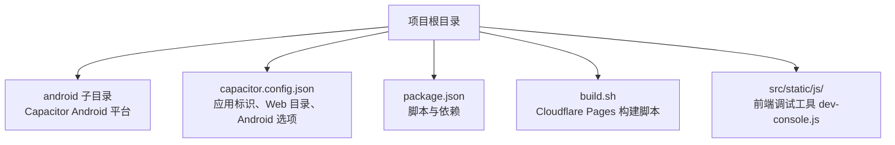
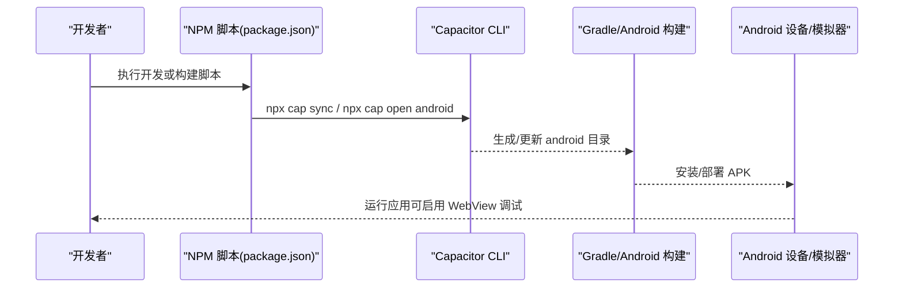
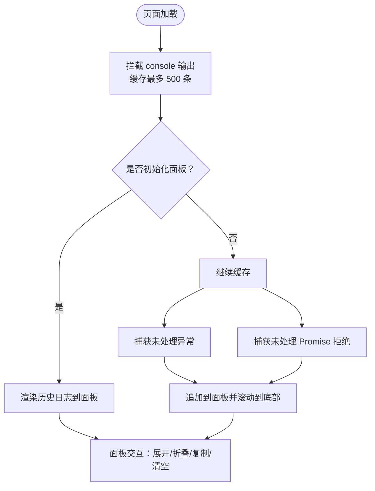
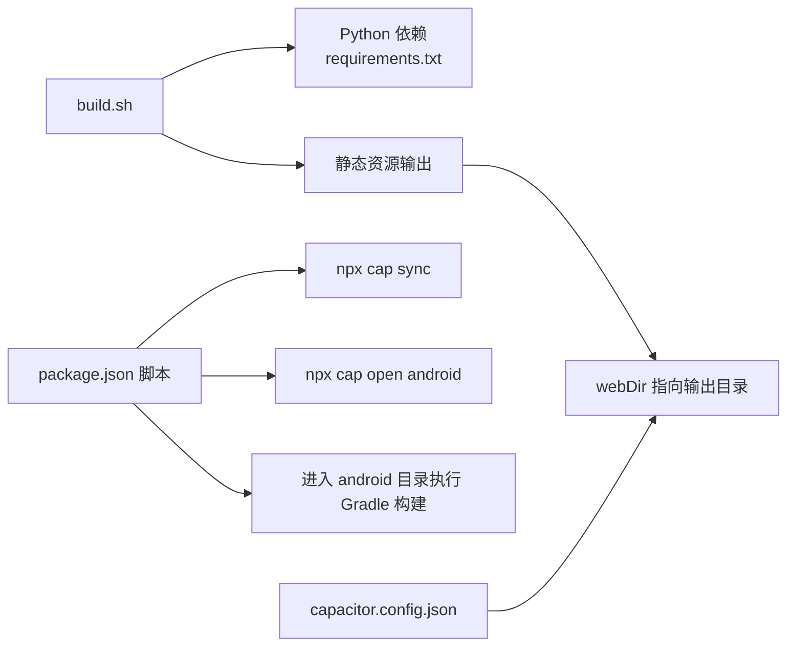

# Android调试与测试

<cite>
**本文引用的文件**
- [android/README.md](file://android/README.md)
- [capacitor.config.json](file://capacitor.config.json)
- [package.json](file://package.json)
- [build.sh](file://build.sh)
- [src/static/js/dev-console.js](file://src/static/js/dev-console.js)
</cite>

## 目录
1. [简介](#简介)
2. [项目结构](#项目结构)
3. [核心组件](#核心组件)
4. [架构总览](#架构总览)
5. [详细组件分析](#详细组件分析)
6. [依赖关系分析](#依赖关系分析)
7. [性能考虑](#性能考虑)
8. [故障排查指南](#故障排查指南)
9. [结论](#结论)
10. [附录](#附录)

## 简介
本指南围绕基于 Capacitor 的 Android 应用，提供从开发环境搭建、模拟器与真机调试、日志与监控、功能与性能测试，到自动化与持续集成的完整实践路径。文档结合仓库中的配置文件与前端调试工具，帮助读者快速建立可靠的调试与测试体系。

## 项目结构
该仓库采用 Capacitor 将 Web 应用打包为 Android APK。根目录包含构建脚本、Capacitor 配置以及前端源码。Android 子目录用于管理 Capacitor Android 平台，提供首次添加平台与构建 APK 的说明。

图表来源
- [android/README.md:1-13](file://android/README.md#L1-L13)
- [capacitor.config.json:1-10](file://capacitor.config.json#L1-L10)
- [package.json:1-24](file://package.json#L1-L24)
- [build.sh:1-16](file://build.sh#L1-L16)
- [src/static/js/dev-console.js:1-181](file://src/static/js/dev-console.js#L1-L181)

章节来源
- [android/README.md:1-13](file://android/README.md#L1-L13)
- [capacitor.config.json:1-10](file://capacitor.config.json#L1-L10)
- [package.json:1-24](file://package.json#L1-L24)
- [build.sh:1-16](file://build.sh#L1-L16)
- [src/static/js/dev-console.js:1-181](file://src/static/js/dev-console.js#L1-L181)

## 核心组件
- Capacitor 配置与构建
  - 应用标识、Web 目录、Android 选项（如允许混合内容、WebView 调试）
  - 提供添加 Android 平台与构建 APK 的命令
- 构建脚本
  - Cloudflare Pages 构建流程：安装依赖、生成静态资源
- 前端调试控制台
  - 全局拦截 console 输出，提供可视化面板，支持复制与清空
- 包管理与脚本
  - 统一脚本：同步 Capacitor、打开 Android、构建 APK、开发联调

章节来源
- [capacitor.config.json:1-10](file://capacitor.config.json#L1-L10)
- [android/README.md:3-12](file://android/README.md#L3-L12)
- [build.sh:1-16](file://build.sh#L1-L16)
- [src/static/js/dev-console.js:95-179](file://src/static/js/dev-console.js#L95-L179)
- [package.json:5-11](file://package.json#L5-L11)

## 架构总览
下图展示了从本地开发到 Android 打包的关键流程，以及 WebView 调试与前端日志的关系。

图表来源
- [package.json:5-11](file://package.json#L5-L11)
- [android/README.md:3-12](file://android/README.md#L3-L12)

## 详细组件分析

### Capacitor 配置与 Android 选项
- 应用标识与名称：用于包名与应用显示名
- Web 目录：指向输出目录，构建产物存放位置
- Android 选项：
  - 允许混合内容：允许非 HTTPS 资源
  - WebView 调试：默认关闭，建议在调试阶段开启

章节来源
- [capacitor.config.json:1-10](file://capacitor.config.json#L1-L10)

### 构建与发布流程
- 开发联调：构建前端 → 同步 Capacitor → 打开 Android
- 发布构建：构建前端 → 同步 Capacitor → 进入 android 目录执行 Gradle 构建 Release 包
- Cloudflare Pages 构建：安装依赖 → 生成静态资源

章节来源
- [package.json:5-11](file://package.json#L5-L11)
- [build.sh:1-16](file://build.sh#L1-L16)

### 前端调试控制台（Dev Console）
- 行为概述
  - 初始化时拦截 console 的多种级别输出，缓存最多 500 条
  - 可创建可视化面板，展开/折叠、复制日志、清空缓存
  - 捕获未处理异常与 Promise 拒绝，统一记录
- 使用场景
  - 在 Android WebView 中配合 Chrome DevTools 远程调试时，先在页面内打开控制台，便于快速定位问题
  - 结合 Logcat 查看原生日志，形成前后端联动的诊断闭环

图表来源
- [src/static/js/dev-console.js:11-82](file://src/static/js/dev-console.js#L11-L82)
- [src/static/js/dev-console.js:95-179](file://src/static/js/dev-console.js#L95-L179)

章节来源
- [src/static/js/dev-console.js:1-181](file://src/static/js/dev-console.js#L1-L181)

### Android Studio 配置与使用
- 添加 Android 平台
  - 使用 Capacitor CLI 添加 Android 平台
- 打开 Android Studio
  - 通过脚本打开 Android Studio 并导入工程
- 构建 APK
  - 使用 Gradle 构建 Release 包
- 模拟器与真机
  - 在 AVD Manager 创建虚拟设备
  - 开启开发者选项与 USB 调试，连接真机进行联调
- WebView 调试
  - 在 Android 选项中启用 WebView 调试（若需要）
  - 通过 Chrome DevTools 访问 chrome://inspect

章节来源
- [android/README.md:3-12](file://android/README.md#L3-L12)
- [capacitor.config.json:5-8](file://capacitor.config.json#L5-L8)

### 日志查看与监控
- Chrome DevTools 远程调试
  - 在设备上打开页面，Chrome 访问 chrome://inspect
  - 选择目标页面，使用 Elements/Console/Sources/Network 面板
- Android Monitor/Logcat
  - 在 Android Studio 的 Logcat 中筛选应用进程
  - 结合前端控制台输出，定位 JS 异常与网络问题
- 前端日志面板
  - 页面内打开开发者控制台，复制日志用于问题复现与上报

章节来源
- [src/static/js/dev-console.js:95-179](file://src/static/js/dev-console.js#L95-L179)

### 功能测试与性能测试
- 功能测试
  - 使用 Espresso 或 UI Automator 编写 UI 测试
  - 配合 JUnit Runner 执行测试套件
- 性能测试
  - 使用 Android Studio Profiler 监控 CPU、内存、网络
  - 结合 WebView 性能面板观察前端渲染与脚本执行
- 测试数据与稳定性
  - 使用固定测试数据与预置账号，确保测试可重复
  - 对关键路径进行回归测试

[本节为通用实践指导，不直接分析具体文件]

### 单元测试、集成测试与用户验收测试
- 单元测试
  - 前端逻辑可在浏览器或 Jest 环境中进行
  - Android 原生模块使用 JUnit 进行单元测试
- 集成测试
  - 覆盖 WebView 与原生模块交互的关键流程
  - 使用 Espresso 执行端到端 UI 测试
- 用户验收测试（UAT）
  - 在真实设备或模拟器上进行可用性与兼容性验证
  - 结合日志与崩溃报告进行问题追踪

[本节为通用实践指导，不直接分析具体文件]

### 测试自动化与持续集成
- 构建与测试流水线
  - 使用 GitHub Actions 或其他 CI 工具
  - 步骤建议：检出代码 → 安装依赖 → 构建前端 → 同步 Capacitor → 构建 APK → 运行测试 → 上传 Artifacts
- 参数化与矩阵构建
  - 使用不同 Android 版本与 ABI 进行矩阵测试
- 报告与归档
  - 生成测试报告与 APK 包，上传至制品库

[本节为通用实践指导，不直接分析具体文件]

## 依赖关系分析
- 前端构建依赖
  - Python 与依赖清单用于生成静态资源
- Capacitor 生态
  - CLI 与 Android 平台版本需保持兼容
- 脚本耦合
  - package.json 中的脚本串联了构建、同步与打开 Android 的流程

图表来源
- [build.sh:1-16](file://build.sh#L1-L16)
- [package.json:5-11](file://package.json#L5-L11)
- [capacitor.config.json:4](file://capacitor.config.json#L4)

章节来源
- [build.sh:1-16](file://build.sh#L1-L16)
- [package.json:5-11](file://package.json#L5-L11)
- [capacitor.config.json:4](file://capacitor.config.json#L4)

## 性能考虑
- WebView 调试开关
  - 默认关闭，避免生产环境性能损耗
- 混合内容策略
  - 在开发阶段允许混合内容，生产环境应使用 HTTPS
- 前端日志缓冲
  - 控制台日志最大缓存数量，避免内存占用过高
- 构建优化
  - 使用最小化与分包策略，减少 APK 体积与启动时间

章节来源
- [capacitor.config.json:5-8](file://capacitor.config.json#L5-L8)
- [src/static/js/dev-console.js:18-30](file://src/static/js/dev-console.js#L18-L30)

## 故障排查指南
- 无法连接 WebView 调试
  - 确认已启用 WebView 调试（若需要）
  - 在设备上访问 chrome://inspect，确认页面可见
- Logcat 无日志
  - 确认应用进程 ID 正确，过滤器匹配
  - 检查应用是否正常运行
- 构建失败
  - 检查 Python 依赖是否安装成功
  - 确认 Capacitor 同步成功且 Android Studio 可打开工程
- 前端日志缺失
  - 确认页面内已初始化开发者控制台
  - 检查是否存在未捕获异常导致页面提前退出

章节来源
- [capacitor.config.json:5-8](file://capacitor.config.json#L5-L8)
- [src/static/js/dev-console.js:95-179](file://src/static/js/dev-console.js#L95-L179)
- [build.sh:7-13](file://build.sh#L7-L13)
- [package.json:5-11](file://package.json#L5-L11)

## 结论
通过合理配置 Capacitor、利用前端调试控制台与 Android Studio 工具链，结合完善的日志与监控机制，可以在 Android 平台上高效地完成调试与测试。建议在开发阶段开启 WebView 调试与前端日志面板，在生产前关闭调试并优化资源与网络策略，同时建立自动化测试与持续集成流程，保障质量与效率。

## 附录
- 快速检查清单
  - 是否正确配置 webDir 与应用标识
  - 是否在开发阶段启用 WebView 调试
  - 是否在页面内初始化开发者控制台
  - 是否通过脚本完成同步与打开 Android
  - 是否在 CI 中执行构建与测试

[本节为通用实践指导，不直接分析具体文件]