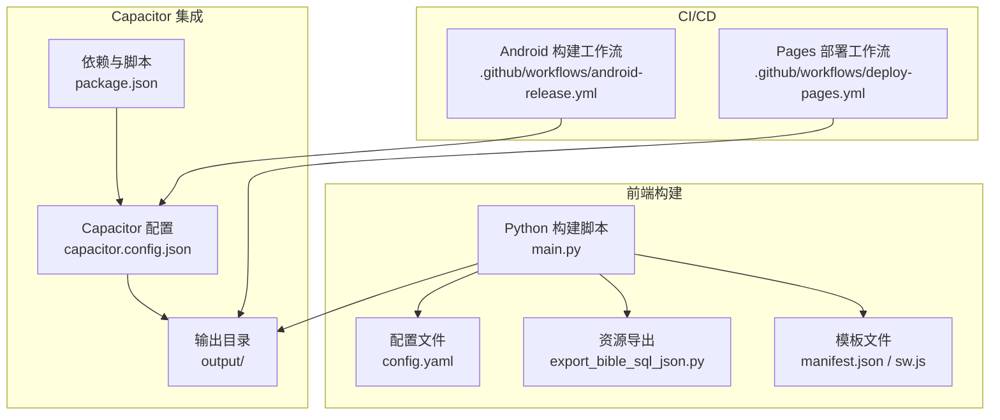
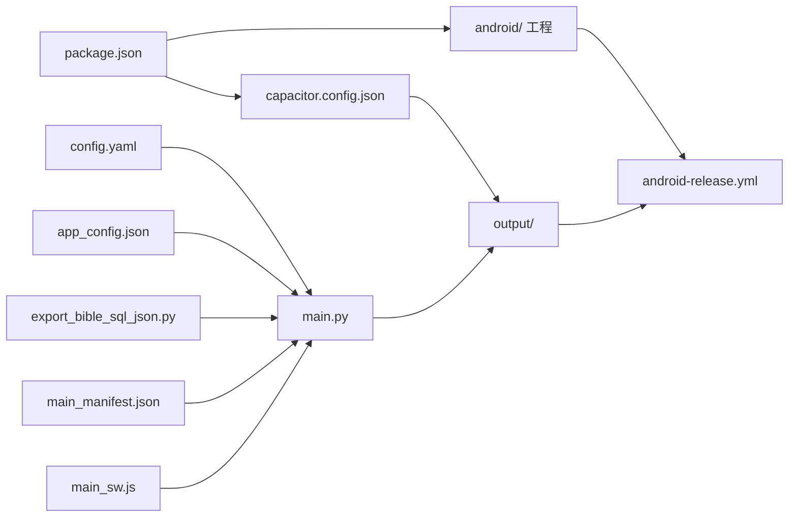

# Capacitor配置管理

<cite>
**本文档引用的文件**
- [capacitor.config.json](file://capacitor.config.json)
- [package.json](file://package.json)
- [build.sh](file://build.sh)
- [main.py](file://main.py)
- [config.yaml](file://config.yaml)
- [app_config.json](file://app_config.json)
- [export_bible_sql_json.py](file://export_bible_sql_json.py)
- [src/templates/main_manifest.json](file://src/templates/main_manifest.json)
- [src/templates/main_sw.js](file://src/templates/main_sw.js)
- [.github/workflows/android-release.yml](file://.github/workflows/android-release.yml)
- [.github/workflows/deploy-pages.yml](file://.github/workflows/deploy-pages.yml)
- [android/README.md](file://android/README.md)
</cite>

## 目录
1. [简介](#简介)
2. [项目结构](#项目结构)
3. [核心组件](#核心组件)
4. [架构总览](#架构总览)
5. [详细组件分析](#详细组件分析)
6. [依赖关系分析](#依赖关系分析)
7. [性能考量](#性能考量)
8. [故障排查指南](#故障排查指南)
9. [结论](#结论)
10. [附录](#附录)

## 简介
本文件系统性梳理本项目的 Capacitor 配置管理，覆盖以下方面：
- 解释 capacitor.config.json 中的关键参数（应用ID、应用名称、Web目录、Android高级配置等）
- 说明 WebView 配置、权限与插件配置的现状与扩展建议
- 基于 package.json 管理 Capacitor 相关依赖与脚本命令
- 解析构建脚本中 Capacitor 集成的实现步骤
- 提供不同环境下的配置策略与安全注意事项
- 总结最佳实践与常见问题解决方案

## 项目结构
本项目采用“Python 构建 + Capacitor 打包”的混合架构：
- Python 负责生成静态资源（PWA 输出目录 output/）
- Capacitor 将静态资源同步到原生平台（Android）
- GitHub Actions 在 CI 中执行构建与发布流程



图表来源
- [main.py:1-361](file://main.py#L1-L361)
- [capacitor.config.json:1-10](file://capacitor.config.json#L1-L10)
- [package.json:1-24](file://package.json#L1-L24)
- [.github/workflows/android-release.yml:1-54](file://.github/workflows/android-release.yml#L1-L54)
- [.github/workflows/deploy-pages.yml:1-32](file://.github/workflows/deploy-pages.yml#L1-L32)

章节来源
- [capacitor.config.json:1-10](file://capacitor.config.json#L1-L10)
- [package.json:1-24](file://package.json#L1-L24)
- [main.py:1-361](file://main.py#L1-L361)
- [config.yaml:1-12](file://config.yaml#L1-L12)
- [export_bible_sql_json.py:1-835](file://export_bible_sql_json.py#L1-L835)
- [src/templates/main_manifest.json:1-26](file://src/templates/main_manifest.json#L1-L26)
- [src/templates/main_sw.js:1-270](file://src/templates/main_sw.js#L1-L270)
- [.github/workflows/android-release.yml:1-54](file://.github/workflows/android-release.yml#L1-L54)
- [.github/workflows/deploy-pages.yml:1-32](file://.github/workflows/deploy-pages.yml#L1-L32)

## 核心组件
本节聚焦 Capacitor 配置文件与相关脚本，解释各参数的作用与影响。

- 应用标识与名称
  - appId：用于 Android 包名前缀，决定原生层应用唯一标识
  - appName：应用显示名称，用于 PWA 清单与原生界面
- Web 目录
  - webDir：指向静态资源输出目录，Capacitor 会将该目录同步到原生工程
- Android 平台配置
  - allowMixedContent：允许混合内容（HTTP/HTTPS 混合），在开发调试期有用，但需谨慎开启
  - webContentsDebuggingEnabled：启用 WebView 调试能力，便于开发调试

章节来源
- [capacitor.config.json:1-10](file://capacitor.config.json#L1-L10)

## 架构总览
Capacitor 在本项目中的职责是将 Python 生成的静态资源（output/）打包为原生 APK，并在 CI 中自动构建与发布。

```mermaid
sequenceDiagram
participant Dev as "开发者"
participant Py as "Python 构建脚本<br/>main.py"
participant Out as "输出目录<br/>output/"
participant Cap as "Capacitor CLI<br/>package.json 脚本"
participant And as "Android 工程<br/>android/"
participant Act as "CI 工作流<br/>android-release.yml"
Dev->>Py : 运行构建生成静态资源
Py->>Out : 写入 index.html / manifest.json / sw.js / 数据文件
Dev->>Cap : 执行 npx cap sync
Cap->>And : 同步 output/ 到 android/app/src/main/assets/
Dev->>Cap : 执行 npx cap open android
Act->>Cap : 自动执行 npx cap sync android
Act->>And : 调用 Gradle 构建 APK
And-->>Act : 产出 unsigned APK
```

图表来源
- [main.py:1-361](file://main.py#L1-L361)
- [package.json:5-11](file://package.json#L5-L11)
- [.github/workflows/android-release.yml:40-47](file://.github/workflows/android-release.yml#L40-L47)

章节来源
- [package.json:5-11](file://package.json#L5-L11)
- [.github/workflows/android-release.yml:40-47](file://.github/workflows/android-release.yml#L40-L47)

## 详细组件分析

### Capacitor 配置文件（capacitor.config.json）
- 参数说明
  - appId：应用唯一标识，影响 Android 包名与原生命名空间
  - appName：应用显示名称，同时影响 PWA 清单与原生标题栏
  - webDir：静态资源输出目录，Capacitor 同步该目录到原生 assets
  - android.allowMixedContent：允许混合内容，开发期调试有用，生产环境建议关闭
  - android.webContentsDebuggingEnabled：启用 WebView 调试，开发期建议开启，生产环境建议关闭
- 集成要点
  - Capacitor 通过 npx cap sync 将 output/ 同步到 android/app/src/main/assets/
  - Android 工程由 Capacitor 管理，首次添加可使用 npx cap add android

章节来源
- [capacitor.config.json:1-10](file://capacitor.config.json#L1-L10)
- [android/README.md:1-13](file://android/README.md#L1-L13)

### 依赖与脚本（package.json）
- 依赖
  - @capacitor/core：Capacitor 核心
  - @capacitor/*：官方插件（App、Filesystem、Status Bar 等）
  - @capacitor/android、@capacitor/cli：Android 平台与 CLI
- 脚本
  - build：调用 Python 主脚本生成静态资源
  - cap:sync：执行 npx cap sync
  - cap:open：打开 Android 工程
  - android:build：构建 APK 的完整流水线
  - android:dev：开发模式一键构建与打开

章节来源
- [package.json:12-22](file://package.json#L12-L22)
- [package.json:5-11](file://package.json#L5-L11)

### 构建脚本（main.py）
- 三个阶段
  - 阶段 1：导出圣经数据（调用 export_bible_sql_json.py）
  - 阶段 2：生成静态站点（复制资源、生成 manifest.json 与 sw.js）
  - 阶段 3：版本与配置（生成 version.json、remote-config.js、复制 app_config.json）
- 关键行为
  - 读取 config.yaml 控制输出目录、静态目录、数据库位置等
  - 从 app_config.json 读取版本号并写入 version.json
  - 生成 remote-config.js（远程服务器地址以 base64 存储）

章节来源
- [main.py:36-76](file://main.py#L36-L76)
- [main.py:288-321](file://main.py#L288-L321)
- [config.yaml:1-12](file://config.yaml#L1-L12)
- [app_config.json:1-6](file://app_config.json#L1-L6)

### 模板与清单（PWA）
- manifest.json 模板
  - 生成时将名称替换为“圣经”，并写入短名称、描述、图标等
- service worker（sw.js）
  - 预缓存核心资源（首页、清单、版本、书卷元数据）
  - 圣经分片数据采用 cache-first 策略，提升离线可用性
  - 版本文件采用 network-first 策略，保证更新可见性

章节来源
- [main.py:248-277](file://main.py#L248-L277)
- [src/templates/main_manifest.json:1-26](file://src/templates/main_manifest.json#L1-L26)
- [src/templates/main_sw.js:1-270](file://src/templates/main_sw.js#L1-L270)

### CI/CD 集成
- Android 发布工作流
  - 安装 Python/Node 依赖
  - 运行 Python 构建生成 output/
  - 执行 npx cap sync android
  - 使用 Gradle 构建 APK 并上传发布
- Pages 部署工作流
  - 与 Android 流程类似，最终部署到 Cloudflare Pages

章节来源
- [.github/workflows/android-release.yml:1-54](file://.github/workflows/android-release.yml#L1-L54)
- [.github/workflows/deploy-pages.yml:1-32](file://.github/workflows/deploy-pages.yml#L1-L32)

### 数据导出与资源生成（export_bible_sql_json.py）
- 功能概述
  - 从 SQLite 数据库导出圣经文本、注解、串珠、书卷名映射、按书卷分片等
  - 支持读经计划整合与文件大小统计
- 与构建的关系
  - 作为阶段 1 的子流程被 main.py 调用，输出至 output/data/

章节来源
- [export_bible_sql_json.py:1-835](file://export_bible_sql_json.py#L1-L835)
- [main.py:87-117](file://main.py#L87-L117)

### Android 工程管理
- 由 Capacitor 管理，首次添加使用 npx cap add android
- 提供一键构建 APK 的脚本命令

章节来源
- [android/README.md:1-13](file://android/README.md#L1-L13)
- [package.json:9-10](file://package.json#L9-L10)

## 依赖关系分析
Capacitor 配置与构建脚本之间的耦合关系如下：



图表来源
- [capacitor.config.json:1-10](file://capacitor.config.json#L1-L10)
- [package.json:1-24](file://package.json#L1-L24)
- [main.py:1-361](file://main.py#L1-L361)
- [config.yaml:1-12](file://config.yaml#L1-L12)
- [app_config.json:1-6](file://app_config.json#L1-L6)
- [export_bible_sql_json.py:1-835](file://export_bible_sql_json.py#L1-L835)
- [src/templates/main_manifest.json:1-26](file://src/templates/main_manifest.json#L1-L26)
- [src/templates/main_sw.js:1-270](file://src/templates/main_sw.js#L1-L270)
- [.github/workflows/android-release.yml:1-54](file://.github/workflows/android-release.yml#L1-L54)

章节来源
- [package.json:1-24](file://package.json#L1-L24)
- [main.py:1-361](file://main.py#L1-L361)

## 性能考量
- WebView 与缓存策略
  - 采用 cache-first 策略缓存圣经分片数据，显著降低重复加载开销
  - 版本文件采用 network-first，确保更新及时生效
- 构建优化
  - 压缩全局 JSON（去除多余空白），减小包体
  - 预缓存核心资源，缩短首屏加载时间
- 资源管理
  - 将大型数据拆分为 66 卷分片，按需加载，避免一次性加载造成内存压力

章节来源
- [src/templates/main_sw.js:108-125](file://src/templates/main_sw.js#L108-L125)
- [main.py:107-116](file://main.py#L107-L116)

## 故障排查指南
- Capacitor 同步失败
  - 确认已先执行 Python 构建生成 output/ 目录
  - 确认 capacitor.config.json 的 webDir 指向正确的输出目录
  - 参考脚本命令：npm run cap:sync
- Android 构建失败
  - 检查 Java/Gradle 环境是否正确安装
  - 确认已执行 npx cap sync android
  - 参考脚本命令：npm run android:build
- WebView 调试不可用
  - 检查 android.webContentsDebuggingEnabled 是否开启
  - 确认设备/模拟器支持 WebView 调试
- 混合内容被阻止
  - 若页面包含 HTTP 资源，可在开发期临时开启 allowMixedContent
  - 生产环境建议统一使用 HTTPS
- 版本更新不生效
  - 确认 version.json 已生成且 sw.js 采用 network-first 策略
  - 清除浏览器缓存或强制刷新页面

章节来源
- [package.json:5-11](file://package.json#L5-L11)
- [capacitor.config.json:5-8](file://capacitor.config.json#L5-L8)
- [src/templates/main_sw.js:94-105](file://src/templates/main_sw.js#L94-L105)

## 结论
本项目通过清晰的构建流程与 Capacitor 集成，实现了“Python 生成静态资源 + Capacitor 打包原生应用”的高效方案。建议在保持现有流程的基础上，进一步完善：
- 明确区分开发/生产环境的 WebView 与调试配置
- 在 CI 中增加产物校验与签名配置
- 对远程配置进行更细粒度的环境隔离

## 附录

### 不同环境下的配置策略
- 开发环境
  - 开启 webContentsDebuggingEnabled 与 allowMixedContent
  - 使用本地或内网服务地址
- 生产环境
  - 关闭 webContentsDebuggingEnabled 与 allowMixedContent
  - 使用 HTTPS 与稳定 CDN
  - 严格控制 remote-config.js 的来源与更新机制

### 安全考虑
- WebView 安全
  - 禁止混合内容，避免敏感信息泄露
  - 限制第三方脚本来源，仅加载可信资源
- 配置安全
  - 远程配置采用 base64 编码，运行时解码，避免明文存储
  - 在 CI 中对密钥与令牌进行加密保护

### 最佳实践
- 将 Capacitor 配置与构建脚本解耦，明确各阶段职责
- 使用 CI 自动化执行 Capacitor 同步与构建，减少手工操作
- 对静态资源进行版本化管理，配合 service worker 缓存策略
- 在 Android 工程中启用混淆与代码压缩，提升安全性与性能