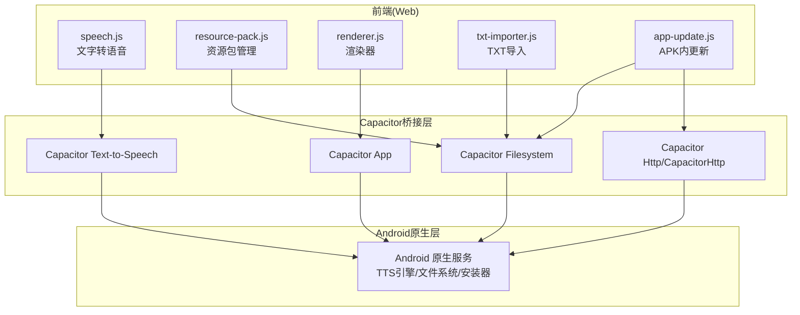
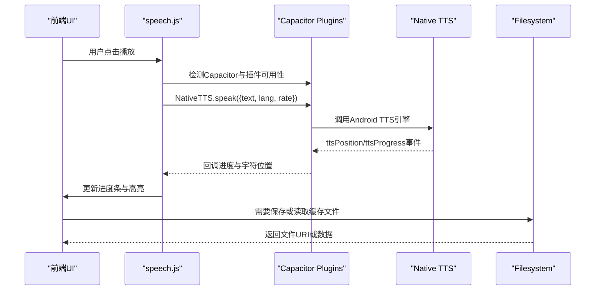
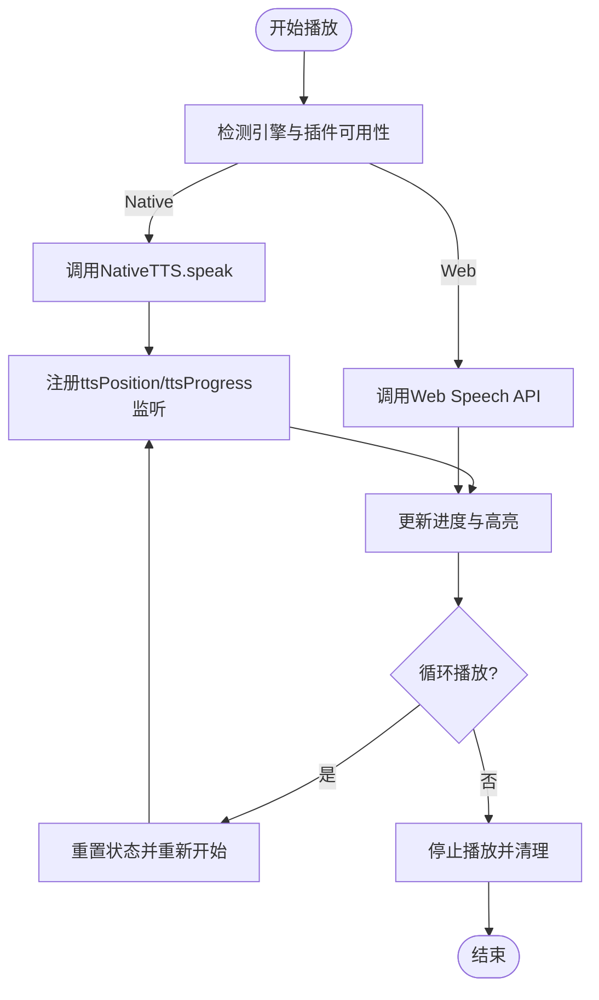
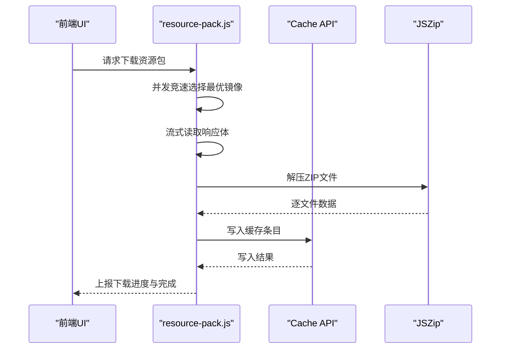
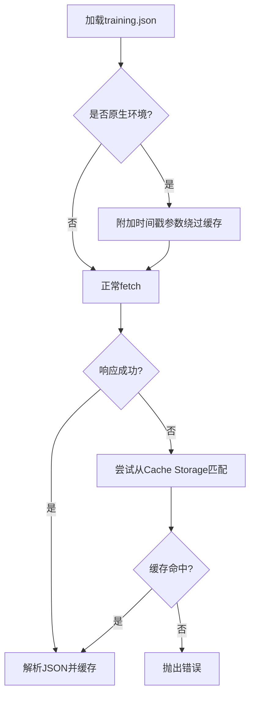
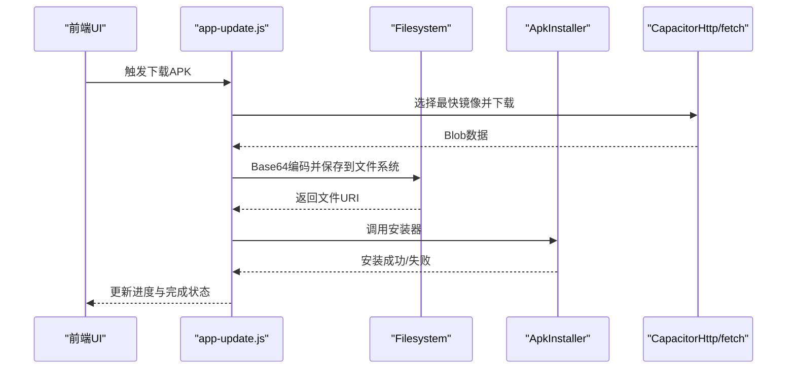
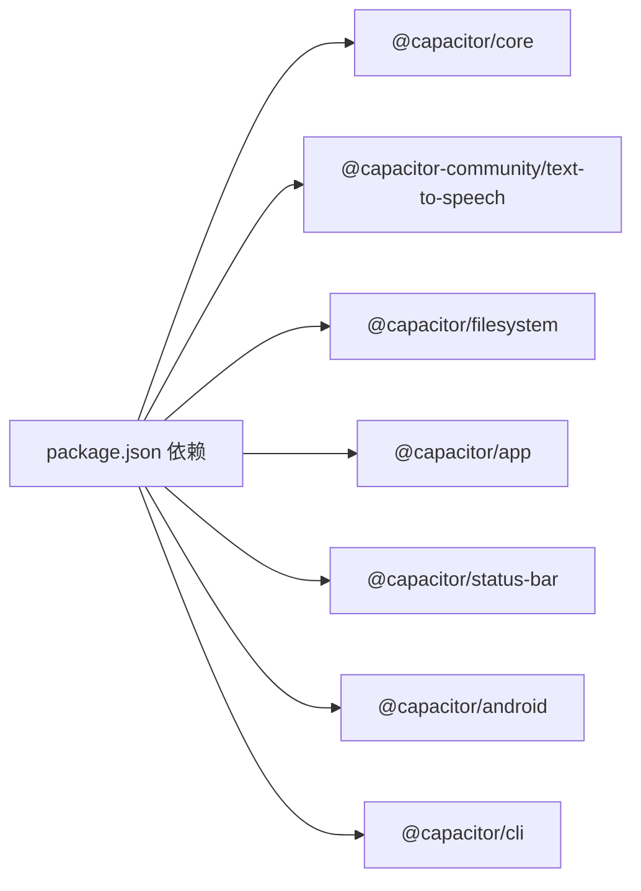

# 原生功能集成

<cite>
**本文档引用的文件**
- [android/README.md](file://android/README.md)
- [capacitor.config.json](file://capacitor.config.json)
- [package.json](file://package.json)
- [speech.js](file://src/static/js/speech.js)
- [resource-pack.js](file://src/static/js/resource-pack.js)
- [renderer.js](file://src/static/js/renderer.js)
- [txt-importer.js](file://src/static/js/txt-importer.js)
- [app-update.js](file://src/static/js/app-update.js)
</cite>

## 目录
1. [简介](#简介)
2. [项目结构](#项目结构)
3. [核心组件](#核心组件)
4. [架构概览](#架构概览)
5. [详细组件分析](#详细组件分析)
6. [依赖分析](#依赖分析)
7. [性能考虑](#性能考虑)
8. [故障排查指南](#故障排查指南)
9. [结论](#结论)

## 简介
本技术文档聚焦于Android平台的原生功能集成，围绕Capacitor框架在PWA基础上构建APK的应用形态，系统阐述以下方面：
- 权限管理：存储、网络、通知等在Android平台的适配与限制
- 设备API访问：通过Capacitor插件桥接JavaScript与Android原生能力
- 系统服务调用：如文件系统、应用信息、安装器等
- JavaScript与原生通信机制：Capacitor插件体系、事件监听与数据传递
- 已实现功能模块：文字转语音（TTS）、资源包管理、离线缓存、APK内更新、TXT本地导入等在Android平台的特殊处理
- 自定义原生插件开发指南与最佳实践
- 安全考虑与隐私保护

## 项目结构
该项目采用PWA + Capacitor的混合架构，前端以Web技术为主，通过Capacitor桥接到Android原生能力。关键目录与文件如下：
- android：由Capacitor管理的Android工程目录
- src/static/js：前端JavaScript模块，负责UI渲染、TTS、资源包管理、APK更新、TXT导入等功能
- capacitor.config.json：Capacitor配置，定义应用ID、WebView行为等
- package.json：项目依赖，包含@capacitor/*及社区插件

**图表来源**
- [speech.js](file://src/static/js/speech.js)
- [resource-pack.js](file://src/static/js/resource-pack.js)
- [renderer.js](file://src/static/js/renderer.js)
- [txt-importer.js](file://src/static/js/txt-importer.js)
- [app-update.js](file://src/static/js/app-update.js)
- [capacitor.config.json](file://capacitor.config.json)
- [package.json](file://package.json)

**章节来源**
- [android/README.md](file://android/README.md)
- [capacitor.config.json](file://capacitor.config.json)
- [package.json](file://package.json)

## 核心组件
- 文字转语音（TTS）：通过Capacitor Text-to-Speech插件实现，支持Android前台服务与后台安全播放，提供句子级高亮与进度监听
- 资源包管理：基于Cache API与JSZip，实现历史资源包下载、校验、缓存与删除，支持多源并发竞速与断点续存
- 渲染器：SPA渲染器，负责从training.json渲染各视图，兼容Capacitor原生环境下的缓存绕过与离线兜底
- APK内更新：基于Capacitor Filesystem与ApkInstaller插件，实现APK下载、保存、安装与进度反馈
- TXT本地导入：基于LocalForage，解析TXT文件并生成训练数据，支持离线缓存与恢复

**章节来源**
- [speech.js](file://src/static/js/speech.js)
- [resource-pack.js](file://src/static/js/resource-pack.js)
- [renderer.js](file://src/static/js/renderer.js)
- [app-update.js](file://src/static/js/app-update.js)
- [txt-importer.js](file://src/static/js/txt-importer.js)

## 架构概览
Capacitor在Android平台提供统一的插件接口，前端JavaScript通过window.Capacitor.Plugins访问原生能力。核心交互链路如下：
- 插件发现与调用：前端检测Capacitor环境，通过Capacitor.Plugins访问具体插件
- 事件监听：插件通过addListener注册事件，前端订阅回调进行UI更新
- 数据传递：JSON参数与Blob/ArrayBuffer等二进制数据双向传递
- 生命周期：App插件提供版本信息、状态查询；Filesystem提供文件读写与URI获取

**图表来源**
- [speech.js](file://src/static/js/speech.js)
- [app-update.js](file://src/static/js/app-update.js)

## 详细组件分析

### 文字转语音（TTS）模块
- 引擎选择：优先使用Capacitor Text-to-Speech插件（NativeTTS），在浏览器环境下回退到Web Speech API
- 事件监听：通过addListener订阅ttsPosition与ttsProgress事件，实现高精度进度与句子级高亮
- 参数传递：支持文本、语言、语速、标题、艺术家、起始秒与总秒数、循环播放等
- 原生特性：Android前台服务保障后台播放，循环播放由原生控制，避免JavaScript层面的循环逻辑

**图表来源**
- [speech.js](file://src/static/js/speech.js)

**章节来源**
- [speech.js](file://src/static/js/speech.js)

### 资源包管理模块
- 清单获取：支持多镜像并发竞速，首个响应到达即中止其余请求
- 缓存策略：使用Cache API与JSZip解压，逐文件写入缓存，支持命名缓存与主缓存区分
- 删除与恢复：按训练路径删除缓存，支持初始安装训练的恢复
- 进度反馈：下载阶段与解压阶段分别上报进度，确保用户体验

**图表来源**
- [resource-pack.js](file://src/static/js/resource-pack.js)

**章节来源**
- [resource-pack.js](file://src/static/js/resource-pack.js)

### 渲染器模块（Android原生环境特殊处理）
- 原生环境检测：通过Capacitor.isNativePlatform判断是否为原生环境
- 缓存绕过：原生环境下为training.json添加时间戳参数，绕过WebView缓存，确保取到APK内最新文件
- 离线兜底：当fetch失败时，尝试从Cache Storage匹配缓存响应，保证历史训练仍可离线打开

**图表来源**
- [renderer.js](file://src/static/js/renderer.js)

**章节来源**
- [renderer.js](file://src/static/js/renderer.js)

### APK内更新模块
- 下载策略：优先使用fetch + ReadableStream实现流式下载与实时进度，无fetch时降级使用CapacitorHttp
- 文件保存：通过Capacitor Filesystem将APK保存到外部存储Download目录、缓存目录或数据目录
- 安装流程：优先使用ApkInstaller插件自动安装，失败时提示用户手动安装
- 版本比较：支持当前版本与最新版本的比较，提供“静默检查”与UI交互两种模式

**图表来源**
- [app-update.js](file://src/static/js/app-update.js)

**章节来源**
- [app-update.js](file://src/static/js/app-update.js)

### TXT本地导入模块
- 解析流程：解析TXT文件，提取标题、标语、大纲、听抄内容、职事摘录、晨兴等结构化数据
- 存储策略：使用LocalForage存储导入记录与训练数据，路径采用local-前缀
- 合并与去重：针对半年度训练等格式，合并“听抄篇”与“晨兴周”的重复章节

**章节来源**
- [txt-importer.js](file://src/static/js/txt-importer.js)

## 依赖分析
- Capacitor核心：@capacitor/core提供基础桥接能力
- 社区插件：
  - @capacitor-community/text-to-speech：文字转语音
  - @capacitor/filesystem：文件系统读写
  - @capacitor/app：应用信息与生命周期
  - @capacitor/status-bar：状态栏控制
- Android工程：@capacitor/android与@capacitor/cli用于同步与打开Android工程
- 构建脚本：通过npm scripts封装Capacitor命令与APK构建流程

**图表来源**
- [package.json](file://package.json)

**章节来源**
- [package.json](file://package.json)

## 性能考虑
- 下载与解压：资源包下载采用流式读取与并发竞速，减少等待时间；解压阶段按文件粒度写入，避免内存峰值
- TTS高亮：原生事件推送频率较高（每50ms），前端通过节流与增量更新降低UI压力
- 缓存策略：Cache API与命名缓存结合，提升重复访问性能；渲染器在原生环境下强制刷新，平衡一致性与性能
- APK更新：下载阶段实时进度与速率计算，安装阶段尽量使用原生安装器，减少用户操作成本

## 故障排查指南
- TTS插件未就绪：前端检测到插件不可用时会延迟重试，确认Capacitor同步与插件安装
- Cache API不可用：在受限环境中降级为本地存储或提示用户启用相关权限
- APK下载失败：检查网络与镜像可用性，确认Filesystem权限与存储空间；必要时使用浏览器下载
- 渲染器离线问题：确保历史训练已在缓存中，或检查training.json路径与命名规范
- 权限问题：Android平台需确保存储与安装权限，必要时引导用户在系统设置中授权

## 结论
本项目通过Capacitor实现了PWA到APK的无缝扩展，在Android平台上充分利用原生能力（TTS、文件系统、安装器等），同时保持前端逻辑的统一与可维护性。资源包管理、离线缓存、APK内更新与TXT导入等模块在原生环境下具备良好的性能与稳定性。建议在后续开发中持续关注插件生态演进与Android版本差异，完善权限与隐私策略，提升用户体验与安全性。