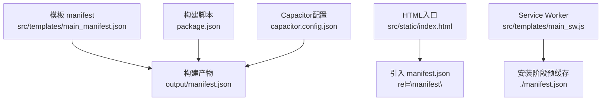
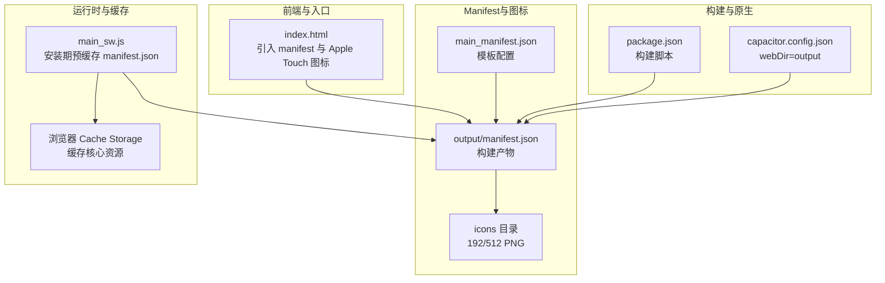
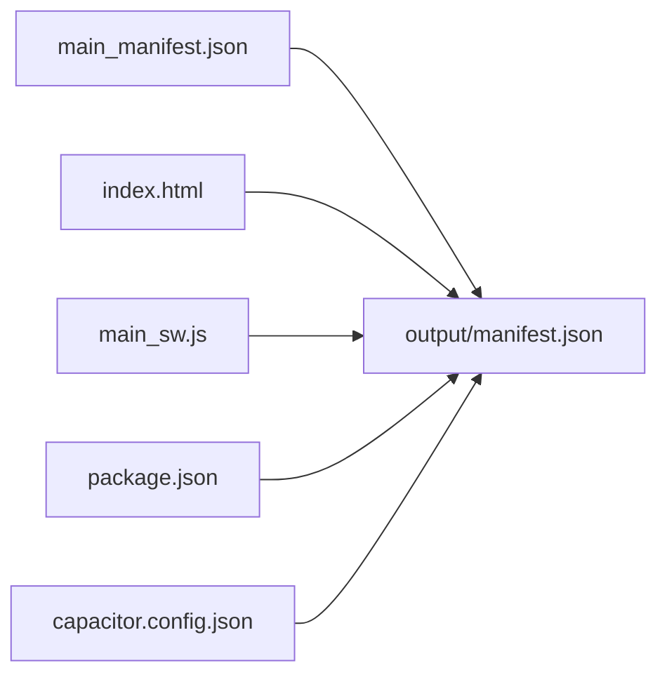

# PWA Manifest配置

<cite>
**本文引用的文件**
- [main_manifest.json](file://src/templates/main_manifest.json)
- [manifest.json](file://output/manifest.json)
- [index.html](file://src/static/index.html)
- [main_sw.js](file://src/templates/main_sw.js)
- [package.json](file://package.json)
- [capacitor.config.json](file://capacitor.config.json)
- [app_config.json](file://app_config.json)
</cite>

## 目录
1. [简介](#简介)
2. [项目结构](#项目结构)
3. [核心组件](#核心组件)
4. [架构总览](#架构总览)
5. [详细组件分析](#详细组件分析)
6. [依赖关系分析](#依赖关系分析)
7. [性能考量](#性能考量)
8. [故障排查指南](#故障排查指南)
9. [结论](#结论)
10. [附录](#附录)

## 简介
本文件面向PWA Manifest配置，基于仓库中的实际实现，系统梳理manifest.json的关键字段、图标配置规范、显示模式与色彩设计、以及与Service Worker、构建流程的集成关系。文档同时给出最佳实践与兼容性建议，帮助读者在多平台（浏览器、iOS、Android、原生嵌入）上获得一致且可靠的PWA体验。

## 项目结构
本项目采用模板驱动的构建方式：开发时使用模板文件生成最终产物。与Manifest相关的核心位置如下：
- 模板：src/templates/main_manifest.json
- 构建输出：output/manifest.json
- HTML入口：src/static/index.html 引入manifest.json并声明Apple Touch图标
- Service Worker：src/templates/main_sw.js 在安装阶段预缓存manifest.json
- 构建与打包：package.json脚本负责调用Python构建器生成output目录
- 原生集成：capacitor.config.json定义Web目录为output，便于Capacitor同步

图表来源
- [main_manifest.json:1-26](file://src/templates/main_manifest.json#L1-L26)
- [manifest.json:1-28](file://output/manifest.json#L1-L28)
- [index.html:17](file://src/static/index.html#L17)
- [main_sw.js:14-19](file://src/templates/main_sw.js#L14-L19)
- [package.json:5-11](file://package.json#L5-L11)
- [capacitor.config.json:4](file://capacitor.config.json#L4)

章节来源
- [main_manifest.json:1-26](file://src/templates/main_manifest.json#L1-L26)
- [manifest.json:1-28](file://output/manifest.json#L1-L28)
- [index.html:17](file://src/static/index.html#L17)
- [main_sw.js:14-19](file://src/templates/main_sw.js#L14-L19)
- [package.json:5-11](file://package.json#L5-L11)
- [capacitor.config.json:4](file://capacitor.config.json#L4)

## 核心组件
本节聚焦manifest.json中的关键字段及其作用，结合项目实际配置进行说明。

- name
  - 作用：应用的完整名称，用于安装后桌面图标、任务切换器、分享菜单等场景展示。
  - 项目取值：中文“圣经”，体现产品定位。
  - 章节来源
    - [main_manifest.json:2](file://src/templates/main_manifest.json#L2)
    - [manifest.json:2](file://output/manifest.json#L2)

- short_name
  - 作用：短名称，当空间不足时替代name显示，通常用于Dock/启动器图标下方标签。
  - 项目取值：中文“圣经”，简洁统一。
  - 章节来源
    - [main_manifest.json:3](file://src/templates/main_manifest.json#L3)
    - [manifest.json:3](file://output/manifest.json#L3)

- description
  - 作用：对应用功能的简短描述，有助于搜索引擎与系统UI理解应用用途。
  - 项目取值：包含多语言、注解与串珠的阅读器描述。
  - 章节来源
    - [main_manifest.json:4](file://src/templates/main_manifest.json#L4)
    - [manifest.json:4](file://output/manifest.json#L4)

- start_url
  - 作用：应用启动时加载的URL路径，决定PWA在独立窗口中的初始页面。
  - 项目取值：“./”，指向Web目录根路径，与scope配合保证单页路由稳定。
  - 章节来源
    - [main_manifest.json:5](file://src/templates/main_manifest.json#L5)
    - [manifest.json:5](file://output/manifest.json#L5)

- scope
  - 作用：限制应用可导航的范围，超出此范围的URL将交由浏览器处理。
  - 项目取值：“./”，与start_url共同确保PWA在单页应用内运行。
  - 章节来源
    - [main_manifest.json:6](file://src/templates/main_manifest.json#L6)
    - [manifest.json:6](file://output/manifest.json#L6)

- display
  - 作用：控制应用的显示模式，如standalone、fullscreen、minimal-ui、browser。
  - 项目取值：“standalone”，提供类原生的沉浸式体验。
  - 章节来源
    - [main_manifest.json:7](file://src/templates/main_manifest.json#L7)
    - [manifest.json:7](file://output/manifest.json#L7)

- background_color
  - 作用：启动画面与图标背景的颜色，提升过渡时的视觉一致性。
  - 项目取值：“#FFFFFF”，与主题色搭配，营造干净的启动体验。
  - 章节来源
    - [main_manifest.json:8](file://src/templates/main_manifest.json#L8)
    - [manifest.json:8](file://output/manifest.json#L8)

- theme_color
  - 作用：浏览器地址栏、任务栏等系统UI的主题色，应与品牌或界面主色调一致。
  - 项目取值：“#F5F0E6”，与CSS主题映射，确保系统UI与界面风格统一。
  - 章节来源
    - [main_manifest.json:9](file://src/templates/main_manifest.json#L9)
    - [manifest.json:9](file://output/manifest.json#L9)

- categories
  - 作用：应用分类列表，便于商店或系统进行归类与推荐。
  - 项目取值：["books","education"]，贴合圣经阅读器的功能定位。
  - 章节来源
    - [main_manifest.json:10-13](file://src/templates/main_manifest.json#L10-L13)
    - [manifest.json:10-13](file://output/manifest.json#L10-L13)

- icons
  - 作用：提供不同尺寸的应用图标，用于启动器、任务切换器、安装确认等场景。
  - 项目取值：192x192与512x512 PNG，purpose为“any maskable”，支持平台裁剪与圆角。
  - 章节来源
    - [main_manifest.json:11-24](file://src/templates/main_manifest.json#L11-L24)
    - [manifest.json:14-27](file://output/manifest.json#L14-L27)

章节来源
- [main_manifest.json:1-26](file://src/templates/main_manifest.json#L1-L26)
- [manifest.json:1-28](file://output/manifest.json#L1-L28)

## 架构总览
下图展示了Manifest与HTML入口、Service Worker及构建流程之间的关系，以及与Capacitor集成的路径。

图表来源
- [index.html:17](file://src/static/index.html#L17)
- [main_manifest.json:1-26](file://src/templates/main_manifest.json#L1-L26)
- [manifest.json:1-28](file://output/manifest.json#L1-L28)
- [main_sw.js:14-19](file://src/templates/main_sw.js#L14-L19)
- [package.json:5-11](file://package.json#L5-L11)
- [capacitor.config.json:4](file://capacitor.config.json#L4)

## 详细组件分析

### 字段语义与行为
- name与short_name
  - 选择原则：name用于正式展示，short_name用于紧凑空间；两者应保持语义一致。
  - 项目实践：均使用“圣经”，确保跨平台一致。
  - 章节来源
    - [main_manifest.json:2-3](file://src/templates/main_manifest.json#L2-L3)
    - [manifest.json:2-3](file://output/manifest.json#L2-L3)

- description
  - 建议包含关键词（如多语言、注解、串珠），提升搜索与商店可见度。
  - 章节来源
    - [main_manifest.json:4](file://src/templates/main_manifest.json#L4)
    - [manifest.json:4](file://output/manifest.json#L4)

- start_url与scope
  - 设计要点：start_url指向应用根，scope限定导航边界，二者配合保障单页路由稳定。
  - 项目实践：均设为“./”，确保PWA在独立窗口中始终从根路径进入。
  - 章节来源
    - [main_manifest.json:5-6](file://src/templates/main_manifest.json#L5-L6)
    - [manifest.json:5-6](file://output/manifest.json#L5-L6)

- display
  - 选择standalone可获得接近原生的沉浸式体验；若需要浏览器UI参与（如分享、收藏），可考虑browser。
  - 章节来源
    - [main_manifest.json:7](file://src/templates/main_manifest.json#L7)
    - [manifest.json:7](file://output/manifest.json#L7)

- background_color与theme_color
  - 设计建议：background_color用于启动过渡，theme_color用于系统UI着色；两者应与界面主色调协调。
  - 项目实践：白色背景与暖灰主题色，兼顾清晰与舒适。
  - 章节来源
    - [main_manifest.json:8-9](file://src/templates/main_manifest.json#L8-L9)
    - [manifest.json:8-9](file://output/manifest.json#L8-L9)

- categories
  - 建议选择与应用功能强相关的类别，便于商店与系统推荐。
  - 章节来源
    - [main_manifest.json:10-13](file://src/templates/main_manifest.json#L10-L13)
    - [manifest.json:10-13](file://output/manifest.json#L10-L13)

- icons
  - 尺寸要求：至少提供192x192与512x512，满足不同密度与场景需求。
  - purpose：使用“any maskable”以支持平台裁剪（如圆角、蒙版），提升桌面美观度。
  - 项目实践：PNG格式，192x192与512x512，purpose均为“any maskable”。
  - 章节来源
    - [main_manifest.json:11-24](file://src/templates/main_manifest.json#L11-L24)
    - [manifest.json:14-27](file://output/manifest.json#L14-L27)

### 图标配置规范与适配策略
- 多尺寸覆盖
  - 建议提供192x192与512x512，兼顾桌面与高密度屏；如条件允许，增加384x384与1024x1024。
  - 章节来源
    - [main_manifest.json:11-24](file://src/templates/main_manifest.json#L11-L24)
    - [manifest.json:14-27](file://output/manifest.json#L14-L27)

- purpose属性
  - any：通用图标，可用于启动器与任务切换器。
  - maskable：允许平台进行裁剪（如圆角、蒙版），提升视觉一致性。
  - 章节来源
    - [main_manifest.json:16](file://src/templates/main_manifest.json#L16)
    - [main_manifest.json:22](file://src/templates/main_manifest.json#L22)
    - [manifest.json:19](file://output/manifest.json#L19)
    - [manifest.json:25](file://output/manifest.json#L25)

- 蒙版适配策略
  - 设计时预留安全区（safe area），确保关键元素不被系统UI遮挡。
  - 项目中HTML已设置viewport-fit=cover与安全区变量，配合maskable图标效果更佳。
  - 章节来源
    - [index.html:5](file://src/static/index.html#L5)

### 显示模式与用户体验
- standalone模式
  - 优点：去除浏览器UI，提供更接近原生的阅读体验。
  - 注意：需确保start_url与scope正确，避免外部链接跳出。
  - 章节来源
    - [main_manifest.json:7](file://src/templates/main_manifest.json#L7)
    - [manifest.json:7](file://output/manifest.json#L7)

- browser模式
  - 适用：需要浏览器UI参与（如分享、收藏）的场景。
  - 章节来源
    - [main_manifest.json:7](file://src/templates/main_manifest.json#L7)
    - [manifest.json:7](file://output/manifest.json#L7)

### 与Service Worker的协作
- 安装期预缓存
  - SW在install阶段预缓存manifest.json，确保首次启动时能快速读取配置。
  - 章节来源
    - [main_sw.js:14-19](file://src/templates/main_sw.js#L14-L19)

- 运行期缓存策略
  - SW根据请求类型采用不同策略：版本文件network-first，圣经数据cache-first，其他资源cache-first+fallback。
  - 章节来源
    - [main_sw.js:70-125](file://src/templates/main_sw.js#L70-L125)

### 与HTML入口的集成
- HTML中通过<link rel="manifest">引入manifest.json，确保浏览器识别PWA元数据。
- 同时声明Apple Touch图标，增强iOS体验。
- 章节来源
  - [index.html:17](file://src/static/index.html#L17)
  - [index.html:18-21](file://src/static/index.html#L18-L21)

### 与Capacitor的集成
- Capacitor配置将webDir指向output，使原生应用可直接加载构建产物。
- 章节来源
  - [capacitor.config.json:4](file://capacitor.config.json#L4)

## 依赖关系分析
- 模板到产物
  - main_manifest.json是唯一真实源，构建过程生成output/manifest.json。
- HTML与Manifest
  - index.html通过<link rel="manifest">引用output/manifest.json。
- SW与Manifest
  - main_sw.js在install阶段预缓存manifest.json，保证离线可用。
- 构建与原生
  - package.json脚本触发构建，capacitor.config.json指定Web目录为output。

图表来源
- [main_manifest.json:1-26](file://src/templates/main_manifest.json#L1-L26)
- [manifest.json:1-28](file://output/manifest.json#L1-L28)
- [index.html:17](file://src/static/index.html#L17)
- [main_sw.js:14-19](file://src/templates/main_sw.js#L14-L19)
- [package.json:5-11](file://package.json#L5-L11)
- [capacitor.config.json:4](file://capacitor.config.json#L4)

章节来源
- [main_manifest.json:1-26](file://src/templates/main_manifest.json#L1-L26)
- [manifest.json:1-28](file://output/manifest.json#L1-L28)
- [index.html:17](file://src/static/index.html#L17)
- [main_sw.js:14-19](file://src/templates/main_sw.js#L14-L19)
- [package.json:5-11](file://package.json#L5-L11)
- [capacitor.config.json:4](file://capacitor.config.json#L4)

## 性能考量
- 图标尺寸与体积
  - 192x192与512x512足以覆盖主流场景；建议压缩PNG以减小体积。
- 预缓存策略
  - SW在install阶段预缓存manifest.json，减少首次启动解析时间。
- 导航范围控制
  - scope与start_url配合，避免不必要的导航开销。
- 离线体验
  - 通过SW缓存核心资源，结合HTML中的离线提示，提升稳定性。

## 故障排查指南
- 安装后图标不显示或显示异常
  - 检查icons数组中的src、sizes、type与purpose是否匹配；确认PNG存在且尺寸正确。
  - 章节来源
    - [main_manifest.json:11-24](file://src/templates/main_manifest.json#L11-L24)
    - [manifest.json:14-27](file://output/manifest.json#L14-L27)

- 启动画面颜色不匹配
  - 调整background_color与theme_color，确保与界面主色调一致。
  - 章节来源
    - [main_manifest.json:8-9](file://src/templates/main_manifest.json#L8-L9)
    - [manifest.json:8-9](file://output/manifest.json#L8-L9)

- 独立窗口无法进入单页应用
  - 检查start_url与scope是否均为“./”，避免外部链接跳出。
  - 章节来源
    - [main_manifest.json:5-6](file://src/templates/main_manifest.json#L5-L6)
    - [manifest.json:5-6](file://output/manifest.json#L5-L6)

- iOS设备无法安装或显示不完整
  - 确认HTML中已声明Apple Touch图标；检查purpose是否为“maskable”以支持圆角。
  - 章节来源
    - [index.html:18-21](file://src/static/index.html#L18-L21)
    - [main_manifest.json:16](file://src/templates/main_manifest.json#L16)
    - [main_manifest.json:22](file://src/templates/main_manifest.json#L22)

- 离线时无法加载
  - 确认SW已注册并成功预缓存manifest.json；检查核心URL列表与缓存状态。
  - 章节来源
    - [main_sw.js:14-19](file://src/templates/main_sw.js#L14-L19)
    - [index.html:206-219](file://src/static/index.html#L206-L219)

## 结论
本项目的Manifest配置遵循现代PWA最佳实践：明确的name/short_name、合理的start_url与scope、standalone显示模式、恰当的色彩与图标配置，并通过Service Worker与构建流程形成闭环。建议在后续迭代中持续优化图标体积、完善多尺寸覆盖，并关注各平台的差异表现，以获得更稳定的跨平台体验。

## 附录
- 最佳实践清单
  - 提供192x192与512x512图标，type为PNG，purpose为“any maskable”
  - start_url与scope均为“./”，确保单页路由稳定
  - display选择standalone，提升沉浸式体验
  - background_color与theme_color与界面风格一致
  - categories选择与功能强相关的类别
  - 在install阶段预缓存manifest.json，提升首开性能
  - 在HTML中声明Apple Touch图标，增强iOS体验
  - 构建脚本与Capacitor配置保持一致，确保原生与Web一致

- 兼容性建议
  - Android：支持standalone与maskable图标，注意深色模式下的对比度
  - iOS：除maskable外，补充Apple Touch图标，确保Safari安装体验
  - 浏览器：关注不同浏览器对purpose与scope的支持差异
  - 原生嵌入：Capacitor环境下避免注册SW，使用本地缓存策略