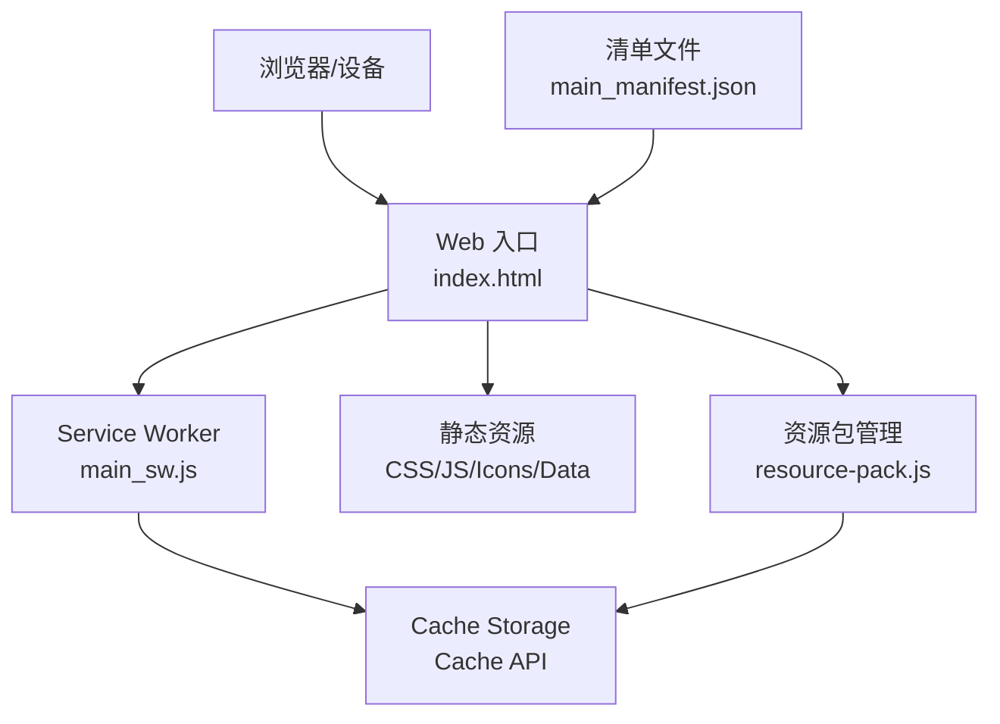
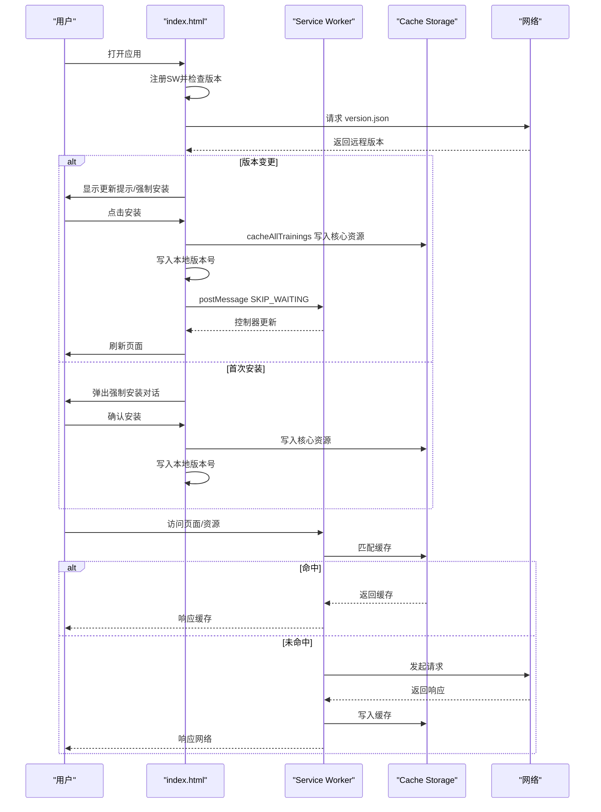
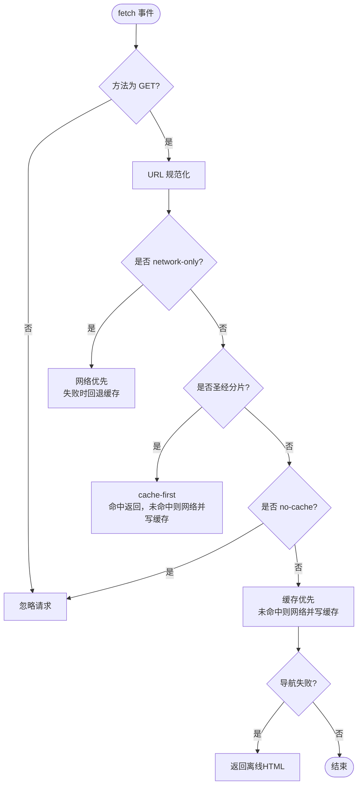
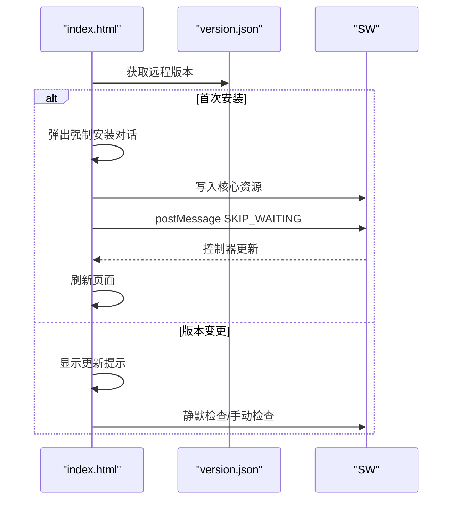
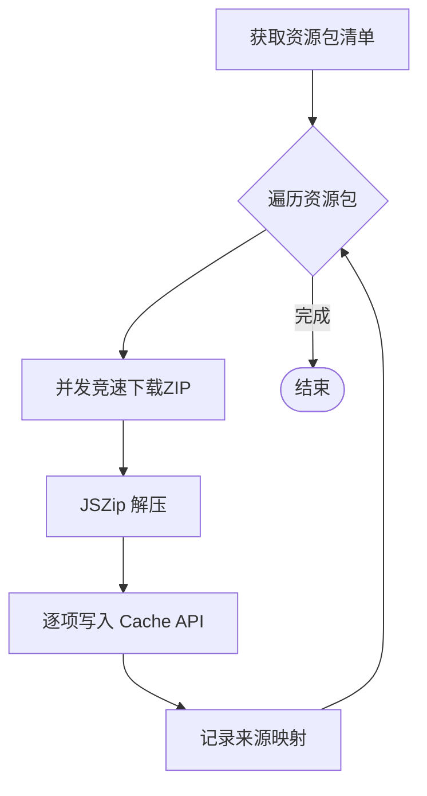
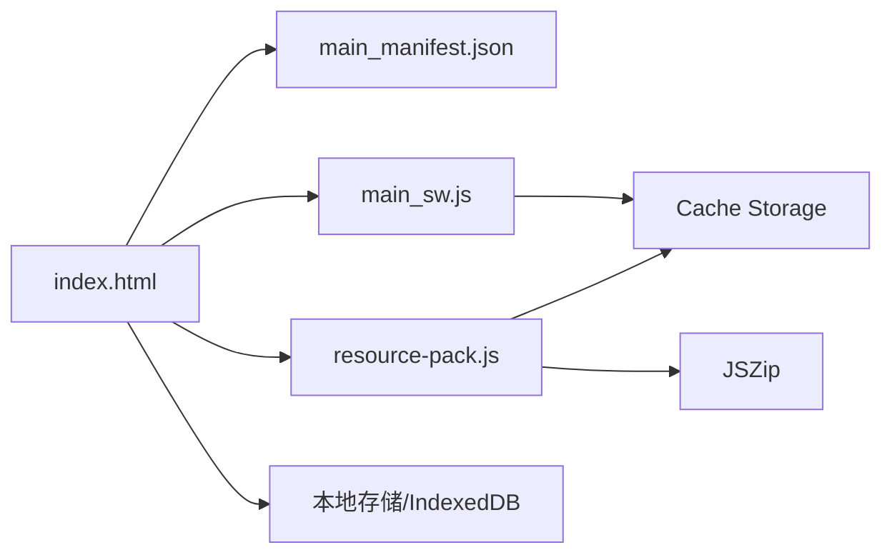

# PWA与离线支持

<cite>
**本文引用的文件**
- [main_manifest.json](file://src/templates/main_manifest.json)
- [main_sw.js](file://src/templates/main_sw.js)
- [index.html](file://src/static/index.html)
- [resource-pack.js](file://src/static/js/resource-pack.js)
- [package.json](file://package.json)
- [capacitor.config.json](file://capacitor.config.json)
- [build.sh](file://build.sh)
- [app_config.json](file://app_config.json)
- [changelog.json](file://changelog.json)
- [book-names-i18n.json](file://src/static/data/book-names-i18n.json)
</cite>

## 目录
1. [简介](#简介)
2. [项目结构](#项目结构)
3. [核心组件](#核心组件)
4. [架构总览](#架构总览)
5. [组件详解](#组件详解)
6. [依赖关系分析](#依赖关系分析)
7. [性能考量](#性能考量)
8. [故障排查指南](#故障排查指南)
9. [结论](#结论)
10. [附录](#附录)

## 简介
本文件面向“圣经阅读器”的PWA与离线支持能力，系统性阐述以下主题：
- PWA清单（manifest.json）结构与参数含义
- Service Worker（SW）实现与缓存策略
- 离线缓存机制（静态资源、动态数据、缓存更新）
- 应用更新与版本管理
- 资源包管理与增量更新
- PWA部署最佳实践与性能优化建议

## 项目结构
该项目采用前端静态资源与模板分离的方式组织，PWA相关的关键文件集中在以下位置：
- 清单与SW模板：src/templates/main_manifest.json、src/templates/main_sw.js
- Web入口与运行时控制：src/static/index.html
- 资源包管理与缓存控制：src/static/js/resource-pack.js
- 构建与配置：package.json、capacitor.config.json、build.sh、app_config.json、changelog.json、book-names-i18n.json

图表来源
- [index.html:17-17](file://src/static/index.html#L17-L17)
- [main_sw.js:6-19](file://src/templates/main_sw.js#L6-L19)
- [main_manifest.json:1-26](file://src/templates/main_manifest.json#L1-L26)

章节来源
- [index.html:1-687](file://src/static/index.html#L1-L687)
- [main_manifest.json:1-26](file://src/templates/main_manifest.json#L1-L26)
- [main_sw.js:1-270](file://src/templates/main_sw.js#L1-L270)
- [resource-pack.js:1-993](file://src/static/js/resource-pack.js#L1-L993)

## 核心组件
- PWA清单（manifest.json）：定义应用名称、图标、启动URL、显示模式、主题色、分类等，确保安装体验与外观一致。
- Service Worker（main_sw.js）：负责安装期预缓存、激活期接管、请求拦截与缓存策略、消息通信（如强制更新、清理缓存、批量缓存圣经分片）。
- Web入口（index.html）：注册SW、执行启动缓存、版本检查、离线提示、清理与安装入口。
- 资源包管理（resource-pack.js）：下载与缓存历史训练资源包（ZIP解压写入Cache），提供删除、恢复、批量下载等交互。

章节来源
- [main_manifest.json:1-26](file://src/templates/main_manifest.json#L1-L26)
- [main_sw.js:1-270](file://src/templates/main_sw.js#L1-L270)
- [index.html:522-595](file://src/static/index.html#L522-L595)
- [resource-pack.js:217-341](file://src/static/js/resource-pack.js#L217-L341)

## 架构总览
整体工作流如下：
- 首次安装或更新时，通过index.html触发启动缓存，写入核心资源；随后SW接管网络请求。
- SW根据URL类型采用不同策略：版本文件network-only、圣经分片cache-first、其他资源cache-first+fallback。
- 用户可在“资源管理”中下载历史训练资源包，SW与页面共同维护缓存一致性。
- 更新时通过version.json对比版本，触发更新提示或强制安装流程。

图表来源
- [index.html:522-595](file://src/static/index.html#L522-L595)
- [main_sw.js:25-166](file://src/templates/main_sw.js#L25-L166)

章节来源
- [index.html:522-595](file://src/static/index.html#L522-L595)
- [main_sw.js:25-166](file://src/templates/main_sw.js#L25-L166)

## 组件详解

### PWA清单（manifest.json）结构与参数
- 应用标识与描述
  - name/short_name：应用全名与简称
  - description：应用描述
  - categories：应用类别（书籍/教育）
- 启动与显示
  - start_url：应用入口URL
  - scope：作用域限定
  - display：独立窗口显示（standalone）
- 主题与颜色
  - background_color：背景色
  - theme_color：主题色
- 图标
  - icons：包含多尺寸PNG图标及用途（maskable）

这些字段共同决定PWA在桌面/移动设备上的安装外观与行为。

章节来源
- [main_manifest.json:1-26](file://src/templates/main_manifest.json#L1-L26)

### Service Worker 实现与缓存策略
- 生命周期
  - install：打开主缓存空间，预缓存核心URL（首页、清单、版本、书卷元数据）
  - activate：立即接管客户端
- URL规范化
  - 解析并标准化URL，处理index.html结尾、目录末尾斜杠等
- 请求拦截与策略
  - network-only：version.json（用于版本检测）
  - cache-first：圣经分片数据（data/bible/*.json）、书卷元数据
  - 其他资源：缓存优先，超时后回退网络；命中后写入缓存
- 离线页面
  - 导航请求失败时返回简明离线HTML
- 消息通信
  - SKIP_WAITING：跳过等待新SW
  - CLEAR_ALL_CACHES/CLEAR_CACHE：清理全部或以“cx-”前缀命名的缓存
  - CACHE_INFO：查询缓存状态（主缓存是否存在、训练缓存数量）
  - CACHE_ALL_BIBLE：批量缓存66卷圣经分片
  - CACHE_STATUS：查询当前圣经分卷缓存情况

图表来源
- [main_sw.js:88-166](file://src/templates/main_sw.js#L88-L166)

章节来源
- [main_sw.js:1-270](file://src/templates/main_sw.js#L1-L270)

### 离线缓存机制
- 预缓存（install阶段）
  - 预缓存URL集合包含首页、清单、版本、书卷元数据等核心资源
- 动态缓存（fetch阶段）
  - 圣经分片数据采用cache-first，确保离线可用
  - 其他资源采用缓存优先+网络回退策略，并在超时后写入缓存
- 缓存清理
  - 支持清理全部缓存或仅“cx-”前缀缓存，保留用户数据
- 离线页面
  - 导航失败时返回简明离线提示

章节来源
- [main_sw.js:14-19](file://src/templates/main_sw.js#L14-L19)
- [main_sw.js:88-166](file://src/templates/main_sw.js#L88-L166)

### 应用更新与版本管理
- 版本来源
  - version.json：远程版本信息（包含apk_version）
  - app_config.json：应用基础配置（含版本号）
- 启动检查
  - 首次安装：弹出强制安装对话，写入本地版本号
  - 版本变更：显示更新提示，静默检查或弹窗提示
- 更新流程
  - 强制安装：写入核心资源后刷新
  - SW更新：新SW安装后发送SKIP_WAITING消息，触发控制器切换

图表来源
- [index.html:522-595](file://src/static/index.html#L522-L595)
- [main_sw.js:176-185](file://src/templates/main_sw.js#L176-L185)

章节来源
- [index.html:522-595](file://src/static/index.html#L522-L595)
- [app_config.json:1-6](file://app_config.json#L1-L6)
- [changelog.json:1-10](file://changelog.json#L1-L10)

### 资源包管理与增量更新
- 资源包清单
  - 通过resource-packs.json获取历史训练资源包列表
- 下载与缓存
  - 并发竞速拉取ZIP，使用JSZip解压，逐项写入Cache API
  - 写入时根据扩展名映射Content-Type，保证缓存命中
- 增量与命名缓存
  - 初始安装写入命名缓存（cx-YYYY-MM），历史合辑写入主缓存（cx-main）
  - 删除时区分来源，仅删除该包下载且未被后续覆写的训练
- 管理界面
  - “默认/历史/导入”三标签页，支持全选、批量下载、删除、恢复等

图表来源
- [resource-pack.js:217-341](file://src/static/js/resource-pack.js#L217-L341)

章节来源
- [resource-pack.js:1-993](file://src/static/js/resource-pack.js#L1-L993)

### 离线页面与用户体验
- 离线横幅：首次安装需要网络时提示
- 离线HTML：导航失败时返回简明提示并允许刷新重试
- 页面记忆：在App/PWA内恢复上次浏览位置，提升离线场景下的连续性

章节来源
- [index.html:91-147](file://src/static/index.html#L91-L147)
- [index.html:378-421](file://src/static/index.html#L378-L421)
- [main_sw.js:172-174](file://src/templates/main_sw.js#L172-L174)

## 依赖关系分析
- Web入口依赖
  - 通过<link rel="manifest">引入清单
  - 通过<script>加载国际化、路由、渲染器等核心模块
  - 在PWA/原生环境下分别加载更新脚本
- SW依赖
  - Cache Storage API：统一缓存接口
  - MessageChannel：与页面通信，查询/清理缓存
- 资源包管理依赖
  - JSZip：解压ZIP资源包
  - Cache Storage API：写入缓存
  - 本地存储：记录来源映射、初始训练元数据

图表来源
- [index.html:17-219](file://src/static/index.html#L17-L219)
- [main_sw.js:6-11](file://src/templates/main_sw.js#L6-L11)
- [resource-pack.js:217-341](file://src/static/js/resource-pack.js#L217-L341)

章节来源
- [index.html:1-687](file://src/static/index.html#L1-L687)
- [main_sw.js:1-270](file://src/templates/main_sw.js#L1-L270)
- [resource-pack.js:1-993](file://src/static/js/resource-pack.js#L1-L993)

## 性能考量
- 缓存策略
  - 圣经分片采用cache-first，显著降低重复访问延迟
  - 其他资源采用缓存优先+网络回退，兼顾离线可用性与新鲜度
- 超时与写入
  - fetch设置超时，避免长时间阻塞；成功后异步写入缓存，减少首屏等待
- 资源包下载
  - 使用竞速策略并行拉取，结合流式读取与分段进度反馈，优化大体积资源体验
- 构建与部署
  - build.sh自动化安装依赖并生成静态输出，便于CI/CD集成

章节来源
- [main_sw.js:131-156](file://src/templates/main_sw.js#L131-L156)
- [resource-pack.js:274-284](file://src/static/js/resource-pack.js#L274-L284)
- [build.sh:1-16](file://build.sh#L1-L16)

## 故障排查指南
- SW未注册或更新失败
  - 检查index.html中SW注册逻辑与跨域限制
  - 查看浏览器开发者工具的Application/Service Workers面板
- 缓存未命中或离线异常
  - 使用SW消息查询缓存状态（CACHE_INFO/CACHE_STATUS）
  - 清理缓存后重新安装（CLEAR_ALL_CACHES/CLEAR_CACHE）
- 版本不一致或更新无效
  - 对比version.json与本地版本号，确认远程版本下发
  - 触发SKIP_WAITING消息或手动刷新页面
- 资源包下载失败
  - 检查网络连通性与竞速超时设置
  - 确认ZIP完整性与解压过程中的错误日志

章节来源
- [index.html:556-595](file://src/static/index.html#L556-L595)
- [main_sw.js:176-270](file://src/templates/main_sw.js#L176-L270)
- [resource-pack.js:260-284](file://src/static/js/resource-pack.js#L260-L284)

## 结论
本项目通过规范化的PWA清单、稳健的Service Worker缓存策略、完善的版本与更新机制，以及灵活的资源包管理，实现了可靠的离线可用性与良好的用户体验。配合合理的性能优化与故障排查流程，可为用户提供稳定、快速、可离线使用的圣经阅读体验。

## 附录

### PWA部署最佳实践
- 清单与图标
  - 确保icons覆盖多种尺寸与purpose，满足平台要求
- SW与缓存
  - 明确区分network-only与cache-first资源
  - 使用规范化URL避免路径差异导致的缓存碎片
- 更新与回滚
  - 通过version.json进行版本比对，提供静默检查与用户提示
  - 保留用户数据与命名缓存，避免误删
- 构建与发布
  - 使用build.sh统一构建流程，确保静态资源生成与版本一致

章节来源
- [main_manifest.json:1-26](file://src/templates/main_manifest.json#L1-L26)
- [main_sw.js:46-64](file://src/templates/main_sw.js#L46-L64)
- [build.sh:1-16](file://build.sh#L1-L16)
- [index.html:522-595](file://src/static/index.html#L522-L595)