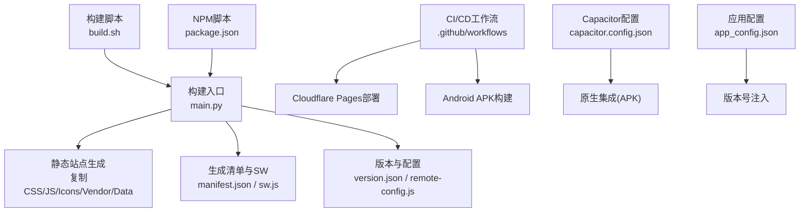
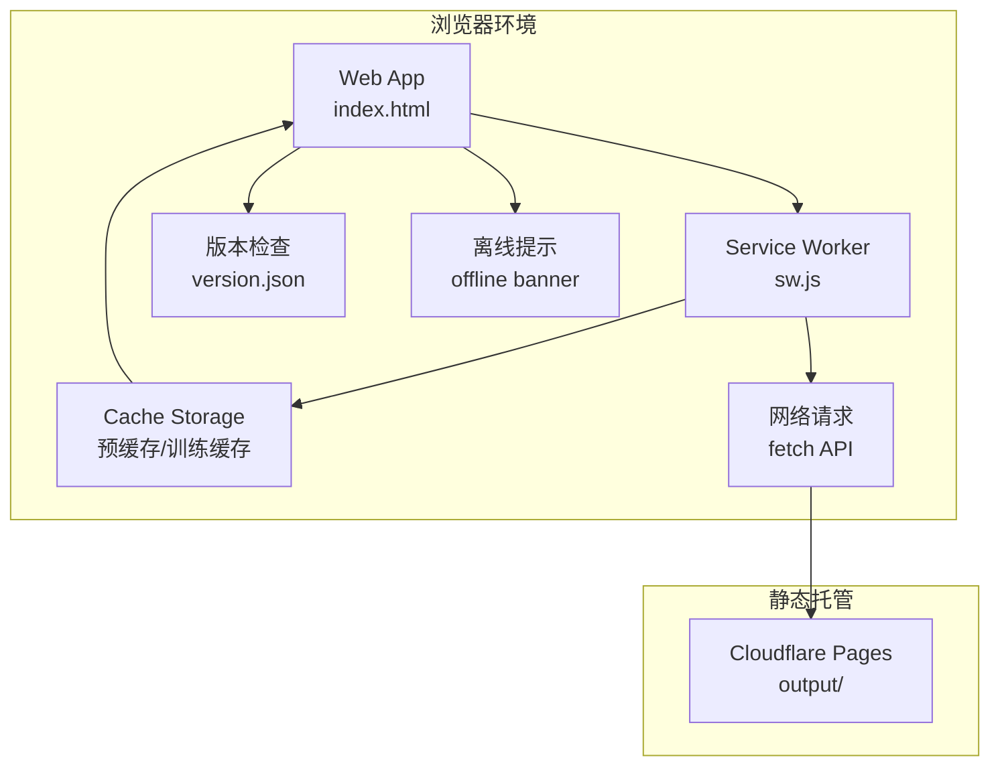
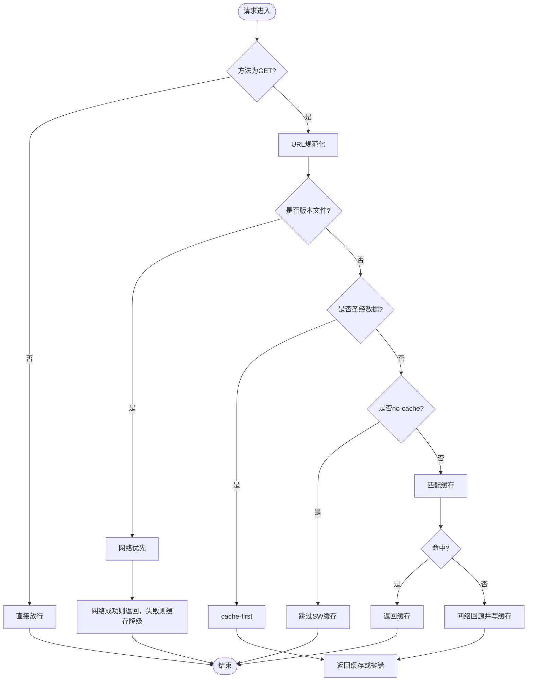
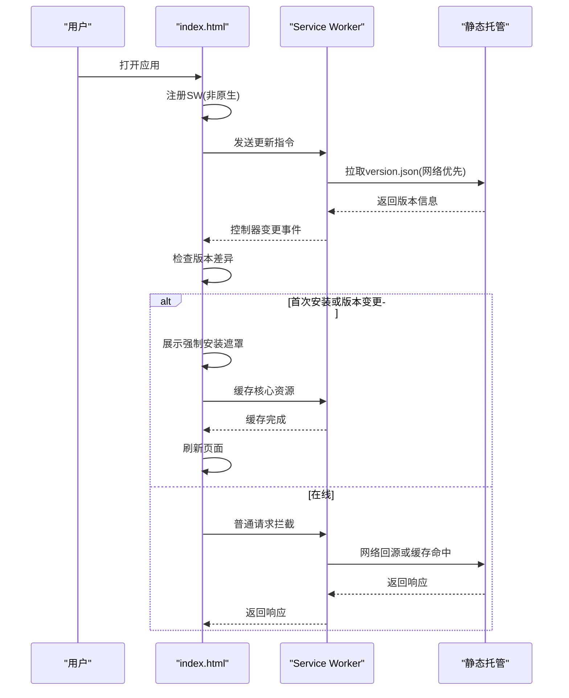
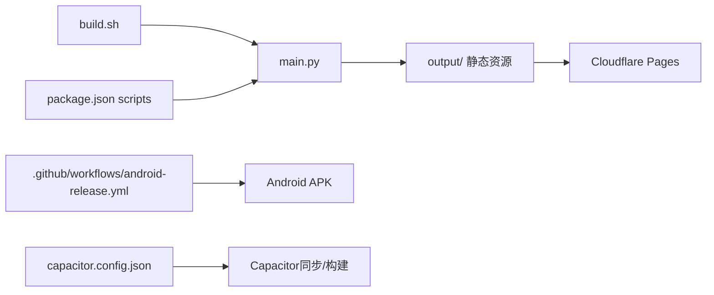

# PWA部署最佳实践

<cite>
**本文档引用的文件**
- [main.py](file://main.py)
- [build.sh](file://build.sh)
- [package.json](file://package.json)
- [capacitor.config.json](file://capacitor.config.json)
- [app_config.json](file://app_config.json)
- [.github/workflows/deploy-pages.yml](file://.github/workflows/deploy-pages.yml)
- [.github/workflows/android-release.yml](file://.github/workflows/android-release.yml)
- [src/templates/main_manifest.json](file://src/templates/main_manifest.json)
- [src/templates/main_sw.js](file://src/templates/main_sw.js)
- [src/static/index.html](file://src/static/index.html)
- [src/static/js/race-fastest.js](file://src/static/js/race-fastest.js)
- [src/static/js/resource-pack.js](file://src/static/js/resource-pack.js)
- [src/static/js/app-update.js](file://src/static/js/app-update.js)
</cite>

## 目录
1. [引言](#引言)
2. [项目结构](#项目结构)
3. [核心组件](#核心组件)
4. [架构概览](#架构概览)
5. [详细组件分析](#详细组件分析)
6. [依赖关系分析](#依赖关系分析)
7. [性能考虑](#性能考虑)
8. [故障排查指南](#故障排查指南)
9. [结论](#结论)
10. [附录](#附录)

## 引言
本指南面向需要在多平台上稳定部署PWA的工程团队，结合仓库中的实际实现，系统阐述PWA在Chrome、Firefox、Safari等浏览器的兼容性处理要点、HTTPS部署与SSL证书配置、应用商店发布流程与审核标准、性能优化策略（首屏加载、资源压缩、缓存预加载）、监控与错误追踪方案，以及用户体验优化与安装引导的最佳实践。

## 项目结构
该项目采用“Python构建 + 前端静态资源 + Service Worker + CI/CD自动化”的架构，核心产出为可直接部署到静态托管平台的output目录，同时支持Capacitor原生集成与APK构建。

图表来源
- [main.py:1-361](file://main.py#L1-L361)
- [build.sh:1-16](file://build.sh#L1-L16)
- [package.json:1-24](file://package.json#L1-L24)
- [.github/workflows/deploy-pages.yml:1-32](file://.github/workflows/deploy-pages.yml#L1-L32)
- [.github/workflows/android-release.yml:1-54](file://.github/workflows/android-release.yml#L1-L54)
- [capacitor.config.json:1-10](file://capacitor.config.json#L1-L10)
- [app_config.json:1-6](file://app_config.json#L1-L6)

章节来源
- [main.py:36-161](file://main.py#L36-L161)
- [build.sh:1-16](file://build.sh#L1-L16)
- [package.json:5-11](file://package.json#L5-L11)
- [.github/workflows/deploy-pages.yml:1-32](file://.github/workflows/deploy-pages.yml#L1-L32)
- [.github/workflows/android-release.yml:1-54](file://.github/workflows/android-release.yml#L1-L54)
- [capacitor.config.json:1-10](file://capacitor.config.json#L1-L10)
- [app_config.json:1-6](file://app_config.json#L1-L6)

## 核心组件
- 构建脚本：负责导出圣经数据、复制静态资源、生成manifest.json与sw.js、输出version.json与remote-config.js。
- Service Worker：定义缓存策略（预缓存、圣经数据cache-first、版本文件network-first、其他资源cache-first+fallback）。
- Manifest：声明应用名称、显示模式、主题色、图标等PWA元信息。
- 前端入口：注册Service Worker、处理离线提示、强制安装缓存、版本检查与更新提示。
- CI/CD：Cloudflare Pages自动化部署与Android APK流水线。
- Capacitor：原生能力集成与APK构建配置。

章节来源
- [main.py:248-276](file://main.py#L248-L276)
- [src/templates/main_sw.js:1-270](file://src/templates/main_sw.js#L1-L270)
- [src/templates/main_manifest.json:1-26](file://src/templates/main_manifest.json#L1-L26)
- [src/static/index.html:556-595](file://src/static/index.html#L556-L595)
- [.github/workflows/deploy-pages.yml:1-32](file://.github/workflows/deploy-pages.yml#L1-L32)
- [capacitor.config.json:1-10](file://capacitor.config.json#L1-L10)

## 架构概览
下图展示了PWA在浏览器中的运行时架构：前端通过Service Worker拦截请求，按策略进行缓存命中或网络回源；版本文件独立于常规缓存策略；核心资源在安装阶段预缓存；离线场景提供降级页面。

图表来源
- [src/templates/main_sw.js:25-40](file://src/templates/main_sw.js#L25-L40)
- [src/templates/main_sw.js:88-166](file://src/templates/main_sw.js#L88-L166)
- [src/static/index.html:522-543](file://src/static/index.html#L522-L543)
- [src/static/index.html:143-147](file://src/static/index.html#L143-L147)

## 详细组件分析

### Service Worker缓存策略与生命周期
- 预缓存：安装阶段将核心URL（首页、manifest、版本、部分数据）写入缓存。
- 版本文件：version.json始终走网络优先策略，确保版本检查可靠。
- 圣经数据：cache-first策略，适合静态文本数据，提升离线可用性。
- 其他资源：先缓存后网络回源，带超时控制与异常降级。
- 离线兜底：导航请求失败时返回简明离线HTML。

图表来源
- [src/templates/main_sw.js:46-64](file://src/templates/main_sw.js#L46-L64)
- [src/templates/main_sw.js:73-86](file://src/templates/main_sw.js#L73-L86)
- [src/templates/main_sw.js:95-106](file://src/templates/main_sw.js#L95-L106)
- [src/templates/main_sw.js:109-125](file://src/templates/main_sw.js#L109-L125)
- [src/templates/main_sw.js:129-156](file://src/templates/main_sw.js#L129-L156)
- [src/templates/main_sw.js:158-166](file://src/templates/main_sw.js#L158-L166)

章节来源
- [src/templates/main_sw.js:25-40](file://src/templates/main_sw.js#L25-L40)
- [src/templates/main_sw.js:88-166](file://src/templates/main_sw.js#L88-L166)

### Manifest与显示模式
- 显示模式：standalone，确保接近原生体验。
- 图标：提供192x192与512x512，满足不同场景需求。
- 主题色与背景色：与界面设计一致，提升启动体验。
- 范围限制：scope限定应用边界，避免跨域干扰。

章节来源
- [src/templates/main_manifest.json:1-26](file://src/templates/main_manifest.json#L1-L26)

### 前端安装与版本管理
- 注册Service Worker：在非原生环境下注册，原生环境跳过。
- 强制安装缓存：首次启动或版本变更时弹出遮罩，逐步缓存核心资源。
- 版本检查：启动时对比version.json，提示更新或离线提示。
- 离线横幅：网络不可用时提示用户并允许关闭。

图表来源
- [src/static/index.html:556-595](file://src/static/index.html#L556-L595)
- [src/static/index.html:522-543](file://src/static/index.html#L522-L543)
- [src/static/index.html:492-520](file://src/static/index.html#L492-L520)
- [src/templates/main_sw.js:95-106](file://src/templates/main_sw.js#L95-L106)

章节来源
- [src/static/index.html:556-595](file://src/static/index.html#L556-L595)
- [src/static/index.html:522-543](file://src/static/index.html#L522-L543)
- [src/static/index.html:492-520](file://src/static/index.html#L492-L520)

### 资源包管理与缓存清理
- 资源包下载：支持并发竞速选择最优镜像，ZIP解压后批量写入缓存。
- 缓存检查：基于Cache Storage键集合判断训练是否已缓存。
- 删除与恢复：支持整包删除、单训练删除、初始安装训练的恢复。
- 多命名缓存：区分初始安装缓存与历史资源包缓存，避免覆盖。

章节来源
- [src/static/js/resource-pack.js:217-327](file://src/static/js/resource-pack.js#L217-L327)
- [src/static/js/resource-pack.js:91-107](file://src/static/js/resource-pack.js#L91-L107)
- [src/static/js/resource-pack.js:146-193](file://src/static/js/resource-pack.js#L146-L193)
- [src/static/js/resource-pack.js:195-213](file://src/static/js/resource-pack.js#L195-L213)

### 并发竞速工具
- 功能：对多个URL并发请求，首个成功响应即获胜，其余请求被取消。
- 适用：资源包下载、清单获取等场景，提升稳定性与速度。
- 参数：超时、验证、转换、日志前缀等可配置。

章节来源
- [src/static/js/race-fastest.js:20-117](file://src/static/js/race-fastest.js#L20-L117)

### Capacitor原生集成与APK更新
- 配置：webDir指向output，允许混合内容，禁用WebView调试。
- APK下载：支持GitHub镜像测速选择、断点续传、进度反馈、自动安装。
- 更新对话框：展示版本比较、变更日志、一键下载与重新下载。
- 清理旧APK：安装后清理遗留APK文件。

章节来源
- [capacitor.config.json:1-10](file://capacitor.config.json#L1-L10)
- [src/static/js/app-update.js:246-399](file://src/static/js/app-update.js#L246-L399)
- [src/static/js/app-update.js:504-567](file://src/static/js/app-update.js#L504-L567)
- [src/static/js/app-update.js:181-207](file://src/static/js/app-update.js#L181-L207)

## 依赖关系分析
- 构建链路：build.sh -> main.py -> 输出output/ -> Cloudflare Pages。
- NPM脚本：封装构建、同步Capacitor、构建APK。
- CI/CD：Pages工作流与Android发布工作流分别处理静态部署与APK发布。
- 前端依赖：通过vendor目录引入第三方库，避免重复下载。

图表来源
- [build.sh:1-16](file://build.sh#L1-L16)
- [main.py:36-76](file://main.py#L36-L76)
- [.github/workflows/deploy-pages.yml:26-31](file://.github/workflows/deploy-pages.yml#L26-L31)
- [package.json:5-11](file://package.json#L5-L11)
- [.github/workflows/android-release.yml:40-47](file://.github/workflows/android-release.yml#L40-L47)
- [capacitor.config.json:4](file://capacitor.config.json#L4)

章节来源
- [build.sh:1-16](file://build.sh#L1-L16)
- [main.py:36-76](file://main.py#L36-L76)
- [package.json:5-11](file://package.json#L5-L11)
- [.github/workflows/deploy-pages.yml:26-31](file://.github/workflows/deploy-pages.yml#L26-L31)
- [.github/workflows/android-release.yml:40-47](file://.github/workflows/android-release.yml#L40-L47)
- [capacitor.config.json:4](file://capacitor.config.json#L4)

## 性能考虑
- 首屏加载优化
  - 预缓存核心URL：在安装阶段缓存首页、manifest、版本与关键数据，显著降低首次访问延迟。
  - 启动加载页：通过DOM占位与渐隐过渡，改善感知性能。
- 资源压缩
  - 构建阶段对JSON进行去缩进压缩，减小包体体积。
- 缓存预加载
  - 强制安装缓存：首次启动或版本变更时，弹出遮罩逐步缓存核心资源，保证离线可用。
  - 圣经数据cache-first：利用静态文本特性，优先命中缓存。
- 网络与超时
  - fetch请求带超时控制，避免长时间阻塞。
  - 并发竞速工具在多镜像场景下提升成功率与速度。
- 离线体验
  - 导航请求失败时返回简明离线HTML，避免白屏。
  - 提供离线横幅提示与关闭按钮，改善用户感知。

章节来源
- [src/templates/main_sw.js:14-19](file://src/templates/main_sw.js#L14-L19)
- [src/static/index.html:105-123](file://src/static/index.html#L105-L123)
- [main.py:107-115](file://main.py#L107-L115)
- [src/templates/main_sw.js:138-140](file://src/templates/main_sw.js#L138-L140)
- [src/static/js/race-fastest.js:20-117](file://src/static/js/race-fastest.js#L20-L117)
- [src/templates/main_sw.js:172-174](file://src/templates/main_sw.js#L172-L174)
- [src/static/index.html:143-147](file://src/static/index.html#L143-L147)

## 故障排查指南
- Service Worker未注册
  - 检查是否在原生环境中（Capacitor），原生环境会跳过注册。
  - 确认HTTPS与同源策略。
- 缓存未命中或版本不更新
  - 确认version.json网络优先策略生效。
  - 检查强制安装缓存流程是否完成。
- 离线提示频繁出现
  - 检查核心资源是否已缓存，必要时重新触发缓存。
  - 确认导航请求是否被拦截并返回离线页面。
- APK下载失败
  - 检查镜像测速结果与网络状况。
  - 确认文件保存目录权限与容量。
- CI/CD部署失败
  - 检查Pages工作流的API Token与账户ID配置。
  - 确认构建脚本依赖安装与Python版本。

章节来源
- [src/static/index.html:556-595](file://src/static/index.html#L556-L595)
- [src/templates/main_sw.js:95-106](file://src/templates/main_sw.js#L95-L106)
- [src/static/index.html:492-520](file://src/static/index.html#L492-L520)
- [src/static/index.html:143-147](file://src/static/index.html#L143-L147)
- [src/static/js/app-update.js:246-399](file://src/static/js/app-update.js#L246-L399)
- [.github/workflows/deploy-pages.yml:26-31](file://.github/workflows/deploy-pages.yml#L26-L31)

## 结论
本项目通过严谨的构建流程、合理的Service Worker缓存策略、完善的CI/CD自动化与原生集成，实现了跨平台的PWA部署与运行。遵循本文档的HTTPS部署、兼容性处理、性能优化与监控方案，可进一步提升应用的稳定性与用户体验。

## 附录

### HTTPS部署与SSL证书配置
- 必须使用HTTPS提供PWA服务，以启用Service Worker与安装能力。
- 证书应支持现代加密套件与TLS 1.2+，域名需与manifest中的start_url一致。
- 静态托管平台（如Cloudflare Pages）通常提供自动SSL与全球加速。

[本节为通用指导，无需特定文件引用]

### 浏览器兼容性处理
- Chrome/Firefox：支持完整的PWA特性（Service Worker、Manifest、安装）。
- Safari：支持安装与离线缓存，但对某些缓存行为与后台更新策略存在差异，需在manifest与SW中规避不兼容特性。
- 通用建议：始终提供有效的manifest.json与sw.js，确保HTTPS与同源。

[本节为通用指导，无需特定文件引用]

### 应用商店发布与审核标准
- Google Play Store：需提供可安装的APK或内部测试轨道，配合应用描述、截图与隐私政策。
- 审核关注点：功能完整性、稳定性、隐私合规、清晰的用户指引。
- 本项目可通过CI/CD生成APK并发布至GitHub Releases或应用商店。

章节来源
- [.github/workflows/android-release.yml:49-54](file://.github/workflows/android-release.yml#L49-L54)

### 用户体验优化与安装引导
- 强制安装缓存：首次启动或版本变更时弹出遮罩，逐步缓存核心资源，完成后自动刷新。
- 离线提示：网络不可用时显示横幅，提供关闭与重试机制。
- 页面记忆：记录用户最后访问位置，提升连续阅读体验。
- 主题与无障碍：提供深浅主题切换与高对比度选项，适配不同用户偏好。

章节来源
- [src/static/index.html:492-520](file://src/static/index.html#L492-L520)
- [src/static/index.html:143-147](file://src/static/index.html#L143-L147)
- [src/static/index.html:378-421](file://src/static/index.html#L378-L421)