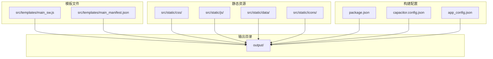
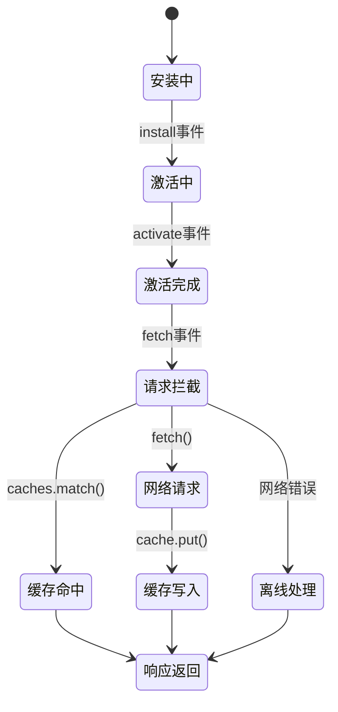
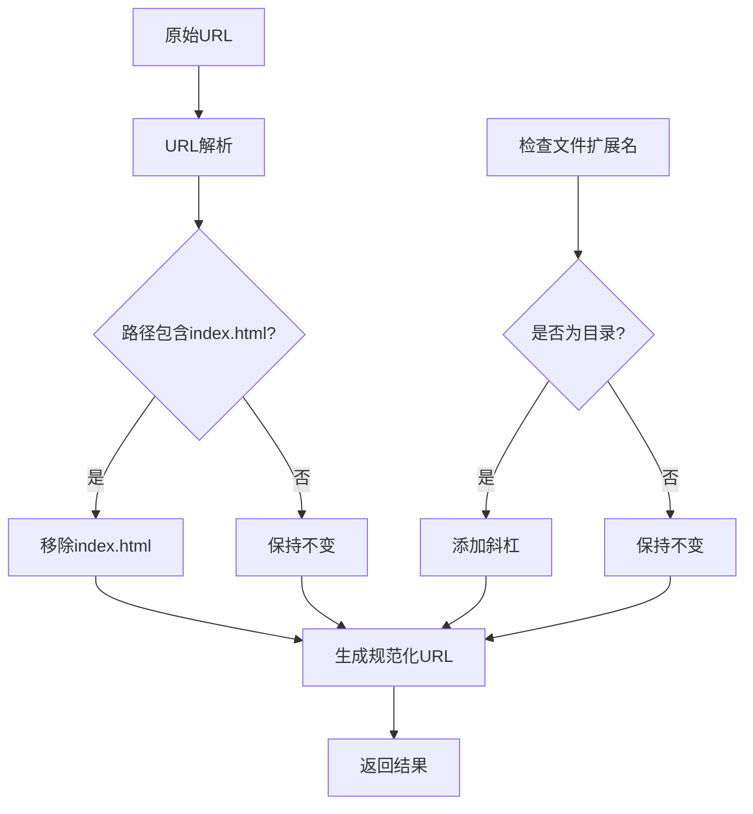
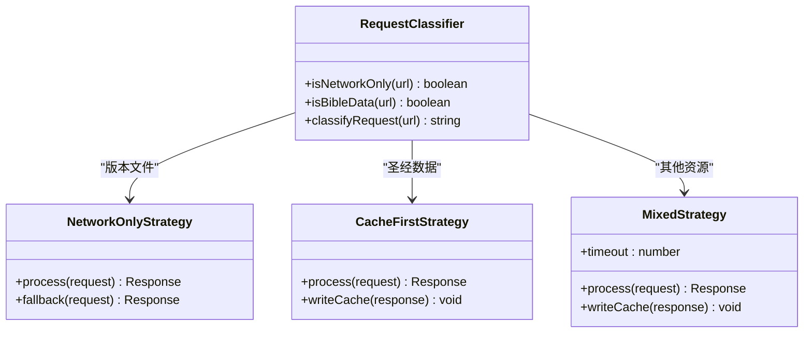
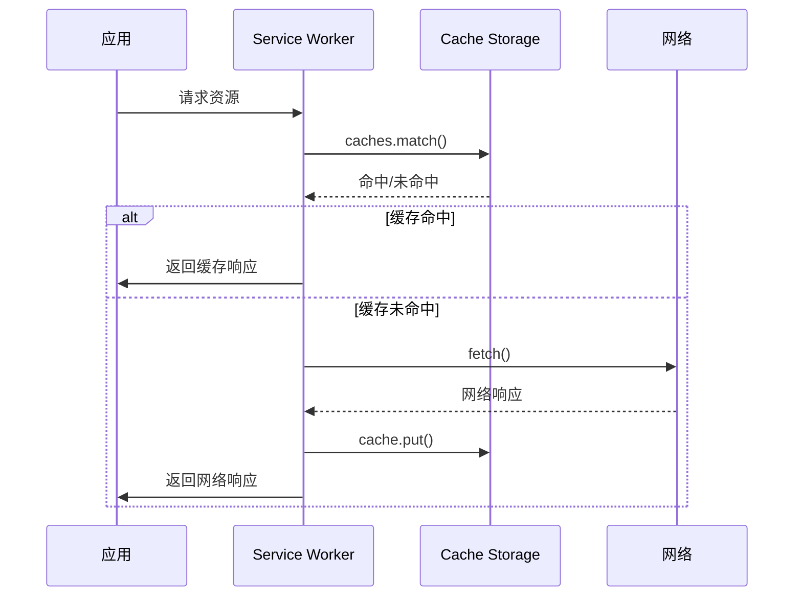
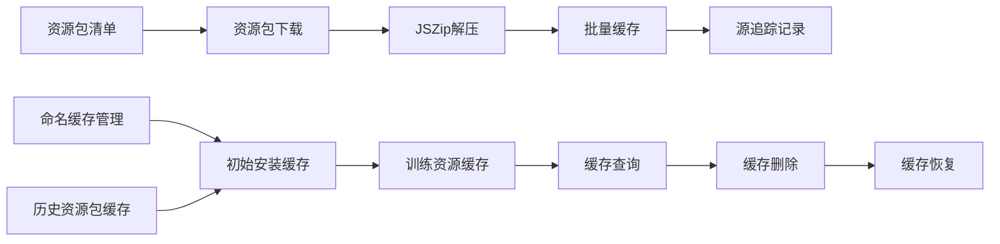
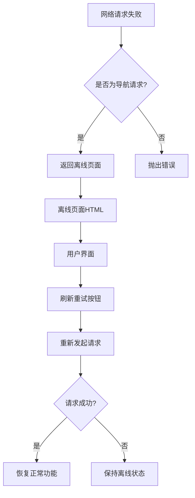
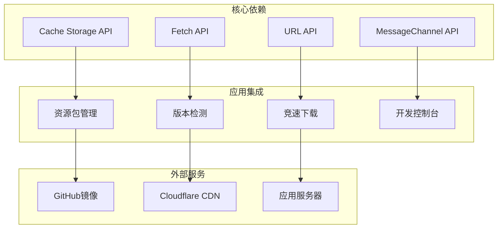
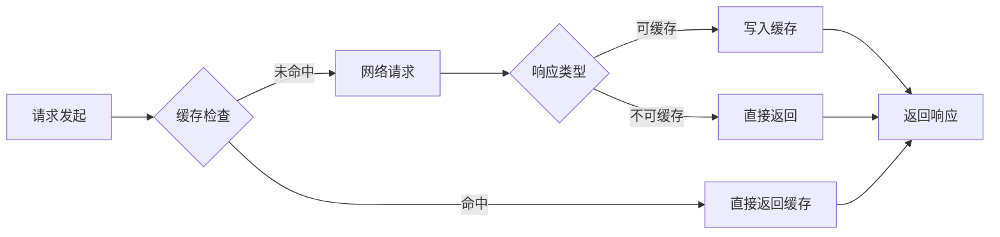
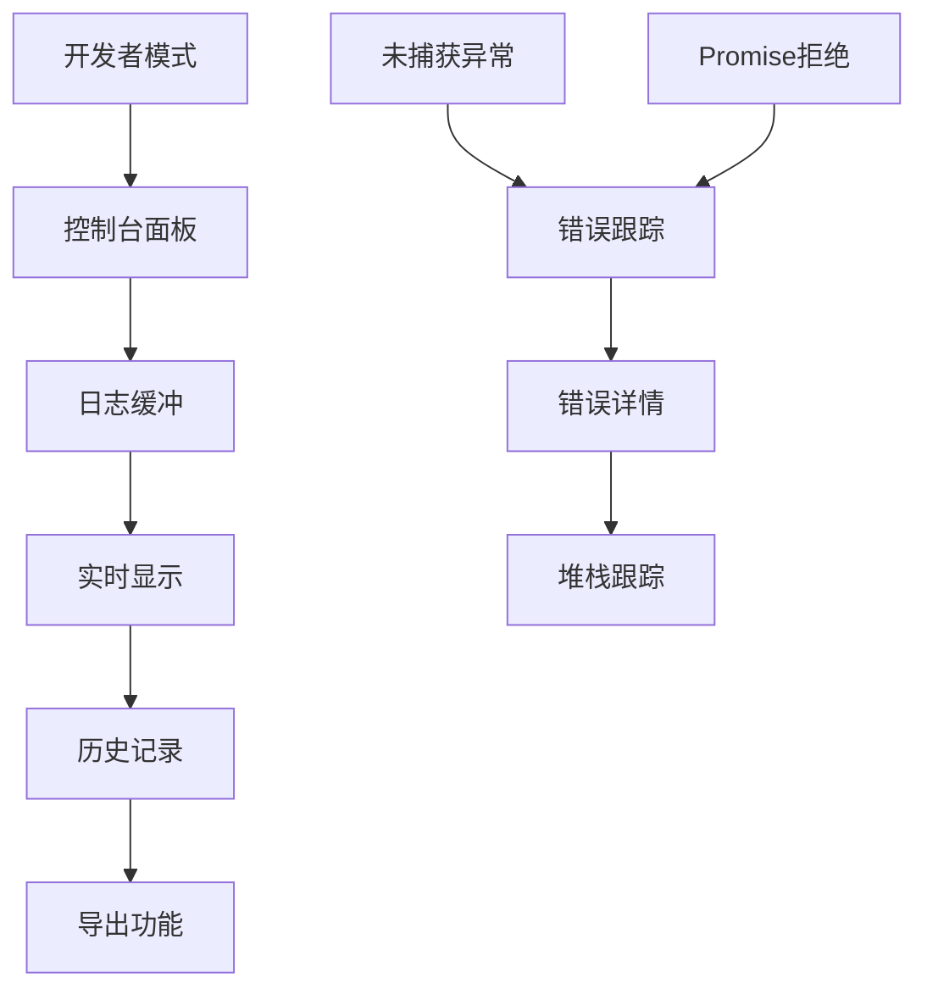

# Service Worker实现

<cite>
**本文档引用的文件**
- [main_sw.js](file://src/templates/main_sw.js)
- [resource-pack.js](file://src/static/js/resource-pack.js)
- [race-fastest.js](file://src/static/js/race-fastest.js)
- [app-update.js](file://src/static/js/app-update.js)
- [main_manifest.json](file://src/templates/main_manifest.json)
- [package.json](file://package.json)
- [capacitor.config.json](file://capacitor.config.json)
- [app_config.json](file://app_config.json)
- [changelog.json](file://changelog.json)
</cite>

## 目录
1. [简介](#简介)
2. [项目结构](#项目结构)
3. [核心组件](#核心组件)
4. [架构概览](#架构概览)
5. [详细组件分析](#详细组件分析)
6. [依赖关系分析](#依赖关系分析)
7. [性能考虑](#性能考虑)
8. [故障排除指南](#故障排除指南)
9. [结论](#结论)

## 简介

本文档详细分析了圣经阅读器应用的Service Worker实现。该应用是一个基于PWA技术的跨平台应用程序，支持Web浏览器和Android APK两种部署方式。Service Worker作为应用的核心缓存和网络拦截组件，实现了智能的缓存策略、离线支持和性能优化。

该实现采用了渐进式缓存策略，针对不同类型的内容采用不同的缓存策略：圣经数据采用cache-first策略以确保离线可用性，版本检测文件采用network-only策略以确保版本信息的实时性，其他静态资源采用cache-first + network fallback策略以平衡性能和新鲜度。

## 项目结构

项目采用模块化的前端架构，主要文件组织如下：



**图表来源**
- [main_sw.js:1-270](file://src/templates/main_sw.js#L1-L270)
- [main_manifest.json:1-26](file://src/templates/main_manifest.json#L1-L26)

**章节来源**
- [main_sw.js:1-270](file://src/templates/main_sw.js#L1-L270)
- [main_manifest.json:1-26](file://src/templates/main_manifest.json#L1-L26)

## 核心组件

### Service Worker生命周期管理

Service Worker实现了标准的生命周期管理，包括install、activate和fetch三个核心阶段：



**图表来源**
- [main_sw.js:25-40](file://src/templates/main_sw.js#L25-L40)
- [main_sw.js:88-166](file://src/templates/main_sw.js#L88-L166)

### 缓存策略分类

系统实现了三种主要的缓存策略：

1. **版本文件网络优先策略** (`NETWORK_ONLY`)
2. **圣经数据缓存优先策略** (`CACHE_FIRST`)
3. **通用资源混合策略** (`CACHE_FIRST + NETWORK_FALLBACK`)

**章节来源**
- [main_sw.js:71-86](file://src/templates/main_sw.js#L71-L86)
- [main_sw.js:88-166](file://src/templates/main_sw.js#L88-L166)

## 架构概览

整个Service Worker架构围绕着智能缓存和网络拦截展开：

```mermaid
graph TB
subgraph "客户端请求"
A[Web应用]
B[Android APK]
end
subgraph "Service Worker"
C[URL规范化]
D[请求分类]
E[缓存策略]
F[网络拦截]
G[离线处理]
end
subgraph "缓存存储"
H[Cache Storage]
I[命名缓存(cx-main)]
J[命名缓存(cx-YYYY-NN)]
end
subgraph "资源管理"
K[资源包管理]
L[版本检测]
M[离线页面]
end
A --> C
B --> C
C --> D
D --> E
E --> F
F --> G
G --> H
H --> I
H --> J
K --> H
L --> H
M --> H
```

**图表来源**
- [main_sw.js:46-64](file://src/templates/main_sw.js#L46-L64)
- [main_sw.js:88-166](file://src/templates/main_sw.js#L88-L166)
- [resource-pack.js:12-16](file://src/static/js/resource-pack.js#L12-L16)

## 详细组件分析

### URL规范化组件

URL规范化是Service Worker的重要特性，专门处理中文路径和目录结构：



**图表来源**
- [main_sw.js:46-64](file://src/templates/main_sw.js#L46-L64)

该组件解决了中文路径编码问题，确保不同编码方式的URL能够正确匹配缓存条目。

**章节来源**
- [main_sw.js:46-64](file://src/templates/main_sw.js#L46-L64)

### 请求分类与路由组件

Service Worker实现了智能的请求分类系统：



**图表来源**
- [main_sw.js:71-86](file://src/templates/main_sw.js#L71-L86)
- [main_sw.js:88-166](file://src/templates/main_sw.js#L88-L166)

**章节来源**
- [main_sw.js:71-86](file://src/templates/main_sw.js#L71-L86)
- [main_sw.js:88-166](file://src/templates/main_sw.js#L88-L166)

### 缓存管理组件

缓存管理系统提供了完整的缓存生命周期管理：



**图表来源**
- [main_sw.js:131-156](file://src/templates/main_sw.js#L131-L156)

**章节来源**
- [main_sw.js:131-156](file://src/templates/main_sw.js#L131-L156)

### 资源包管理集成

Service Worker与资源包管理系统的深度集成：



**图表来源**
- [resource-pack.js:217-327](file://src/static/js/resource-pack.js#L217-L327)
- [resource-pack.js:146-193](file://src/static/js/resource-pack.js#L146-L193)

**章节来源**
- [resource-pack.js:217-327](file://src/static/js/resource-pack.js#L217-L327)
- [resource-pack.js:146-193](file://src/static/js/resource-pack.js#L146-L193)

### 离线处理机制

离线页面处理提供了优雅的用户体验：



**图表来源**
- [main_sw.js:158-165](file://src/templates/main_sw.js#L158-L165)
- [main_sw.js:172-174](file://src/templates/main_sw.js#L172-L174)

**章节来源**
- [main_sw.js:158-165](file://src/templates/main_sw.js#L158-L165)
- [main_sw.js:172-174](file://src/templates/main_sw.js#L172-L174)

## 依赖关系分析

Service Worker实现依赖于多个核心组件和外部服务：



**图表来源**
- [main_sw.js:1-11](file://src/templates/main_sw.js#L1-L11)
- [resource-pack.js:51-87](file://src/static/js/resource-pack.js#L51-L87)

**章节来源**
- [main_sw.js:1-11](file://src/templates/main_sw.js#L1-L11)
- [resource-pack.js:51-87](file://src/static/js/resource-pack.js#L51-L87)

### 外部服务集成

系统集成了多个外部服务以提高可靠性和性能：

1. **GitHub镜像服务**：用于APK下载的竞速测速
2. **Cloudflare CDN**：用于资源包清单的快速获取
3. **应用服务器**：提供changelog等动态内容

**章节来源**
- [app-update.js:270-338](file://src/static/js/app-update.js#L270-L338)
- [resource-pack.js:51-87](file://src/static/js/resource-pack.js#L51-L87)

## 性能考虑

### 缓存策略优化

系统采用了多层次的缓存策略优化：

1. **预缓存机制**：在install阶段预缓存关键资源
2. **智能分类**：根据资源类型选择最优缓存策略
3. **超时控制**：网络请求设置合理的超时时间
4. **内存管理**：及时释放缓存引用，避免内存泄漏

### 网络性能优化



**图表来源**
- [main_sw.js:131-156](file://src/templates/main_sw.js#L131-L156)

### 内存和存储管理

Service Worker实现了高效的内存和存储管理：

1. **缓存大小限制**：通过命名缓存区分不同类型的资源
2. **垃圾回收**：及时清理不再使用的缓存条目
3. **存储配额管理**：合理分配不同缓存空间

**章节来源**
- [main_sw.js:181-238](file://src/templates/main_sw.js#L181-L238)
- [resource-pack.js:171-193](file://src/static/js/resource-pack.js#L171-L193)

## 故障排除指南

### 常见问题诊断

#### 缓存不生效问题

1. **检查缓存策略**：确认资源类型是否正确分类
2. **验证URL规范化**：确保中文路径正确处理
3. **检查缓存键**：确认缓存键的一致性

#### 离线功能异常

1. **验证离线页面**：检查离线HTML内容
2. **测试网络拦截**：确认fetch事件正确处理
3. **检查缓存完整性**：验证关键资源是否缓存

#### 资源包管理问题

1. **检查JSZip集成**：确认压缩包正确解压
2. **验证缓存写入**：确认资源正确写入缓存
3. **测试删除功能**：验证缓存删除逻辑

### 调试工具和方法

#### 开发者控制台

系统提供了完整的开发者调试工具：



**图表来源**
- [dev-console.js:95-179](file://src/static/js/dev-console.js#L95-L179)

**章节来源**
- [dev-console.js:95-179](file://src/static/js/dev-console.js#L95-L179)

#### 缓存状态监控

Service Worker提供了详细的缓存状态监控功能：

1. **缓存信息查询**：通过MessageChannel查询缓存状态
2. **训练缓存统计**：统计训练资源的缓存情况
3. **缓存清理验证**：确认缓存清理操作的效果

**章节来源**
- [main_sw.js:187-202](file://src/templates/main_sw.js#L187-L202)
- [main_sw.js:240-269](file://src/templates/main_sw.js#L240-L269)

### 性能监控

#### 请求性能分析

1. **响应时间监控**：跟踪不同缓存策略的响应时间
2. **缓存命中率统计**：分析缓存效率
3. **网络延迟测量**：监控网络性能指标

#### 存储使用分析

1. **缓存大小监控**：跟踪缓存占用空间
2. **存储配额使用**：监控存储空间使用情况
3. **清理效果评估**：验证缓存清理操作的效果

## 结论

该Service Worker实现展现了现代PWA应用的最佳实践，具有以下特点：

### 技术优势

1. **智能缓存策略**：根据不同资源类型采用最优缓存策略
2. **完善的离线支持**：提供优雅的离线体验
3. **高性能设计**：通过预缓存和智能分类提升性能
4. **可维护性**：模块化设计便于维护和扩展

### 架构特色

1. **渐进式增强**：支持多种部署方式（Web/PWA和Android APK）
2. **资源包管理**：提供灵活的资源包下载和管理功能
3. **开发友好**：内置完整的调试和监控工具
4. **可靠性保障**：多重备份和错误处理机制

### 改进建议

1. **缓存版本管理**：可以考虑引入更精细的缓存版本控制
2. **增量更新**：实现更高效的增量更新机制
3. **性能分析**：增加更详细的性能监控和分析功能
4. **安全增强**：加强缓存安全和数据完整性保护

该实现为类似的应用提供了优秀的参考模板，展示了如何在实际项目中有效利用Service Worker技术来提升用户体验和应用性能。