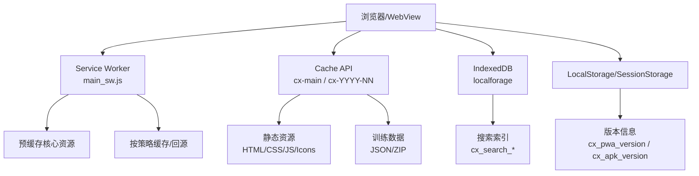
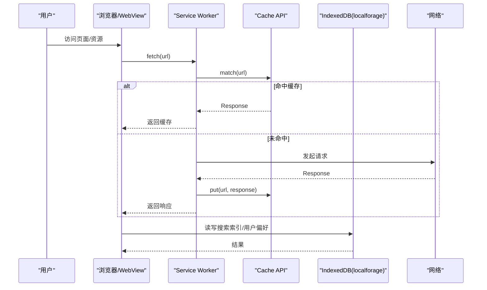
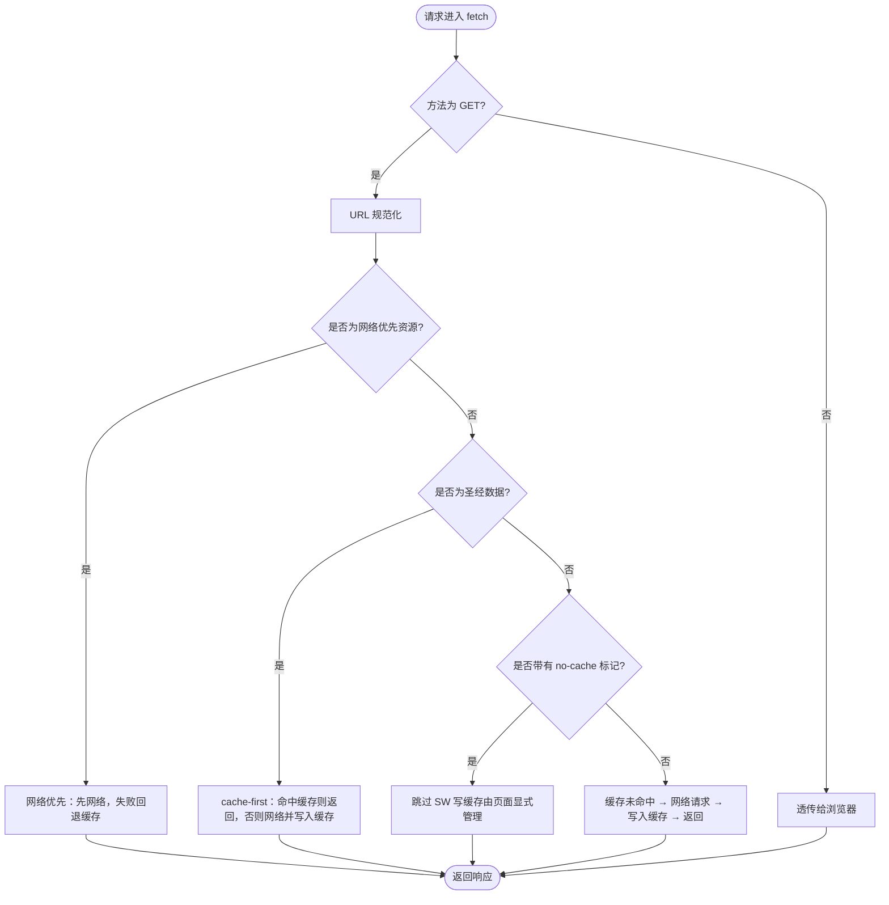
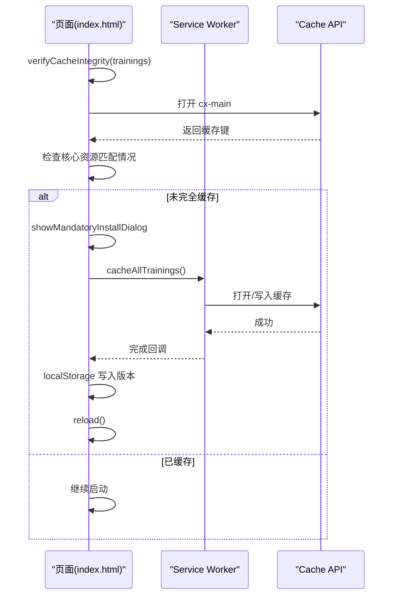
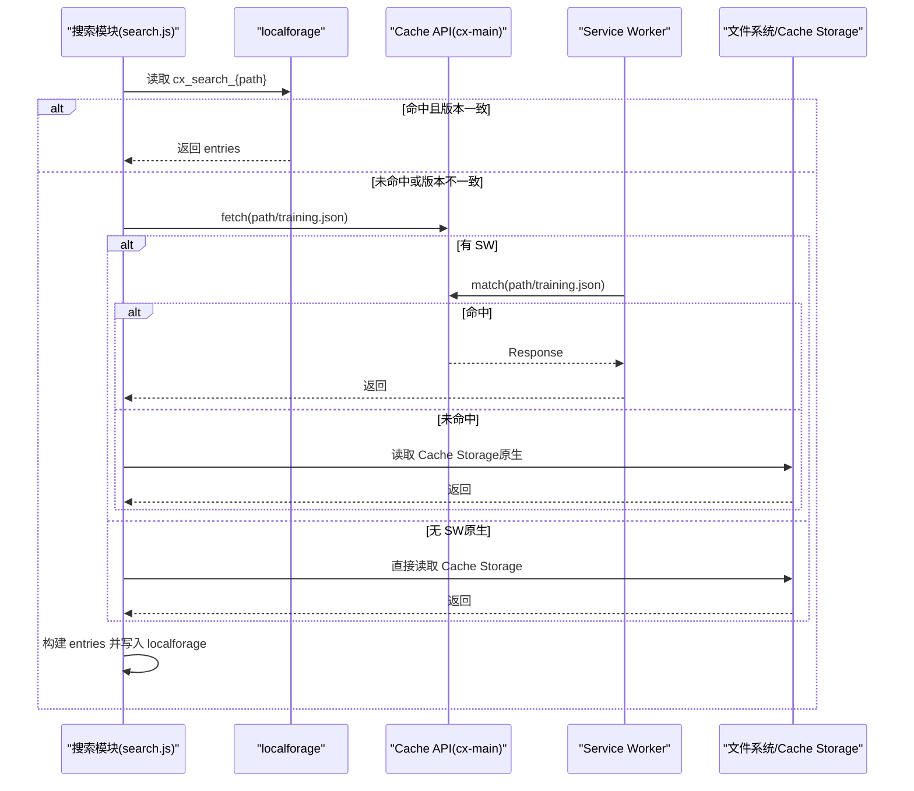
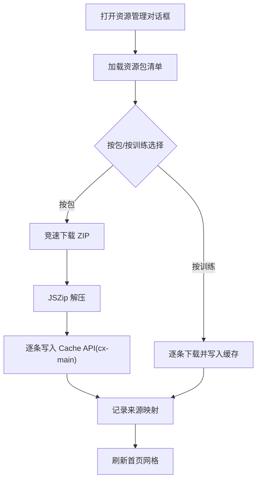
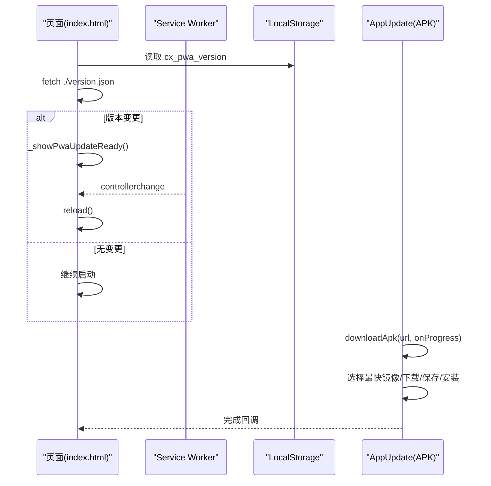
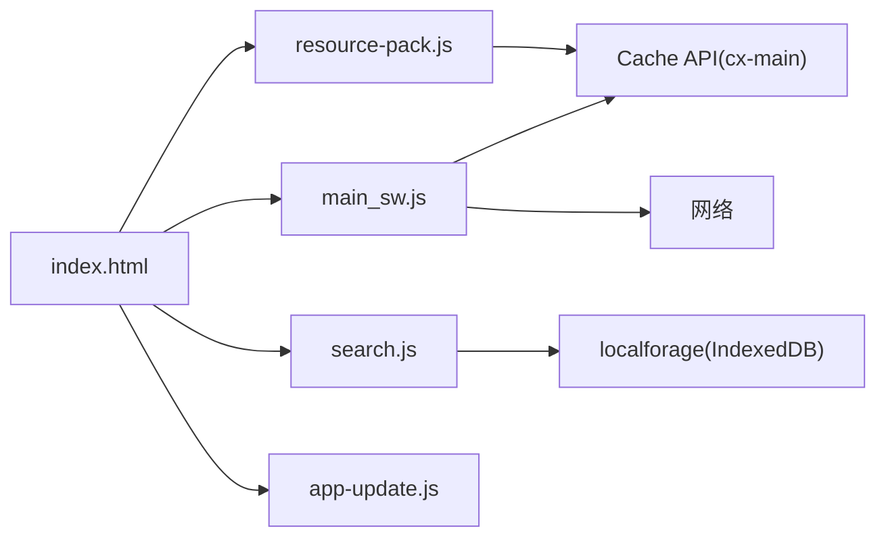

# 离线缓存策略

<cite>
**本文档引用的文件**
- [src/static/index.html](file://src/static/index.html)
- [src/templates/main_sw.js](file://src/templates/main_sw.js)
- [src/templates/main_manifest.json](file://src/templates/main_manifest.json)
- [src/static/js/resource-pack.js](file://src/static/js/resource-pack.js)
- [src/static/js/search.js](file://src/static/js/search.js)
- [src/static/js/app-update.js](file://src/static/js/app-update.js)
- [app_config.json](file://app_config.json)
- [capacitor.config.json](file://capacitor.config.json)
- [src/static/data/book-names-i18n.json](file://src/static/data/book-names-i18n.json)
</cite>

## 目录
1. [简介](#简介)
2. [项目结构](#项目结构)
3. [核心组件](#核心组件)
4. [架构总览](#架构总览)
5. [详细组件分析](#详细组件分析)
6. [依赖关系分析](#依赖关系分析)
7. [性能考虑](#性能考虑)
8. [故障排除指南](#故障排除指南)
9. [结论](#结论)

## 简介
本文件系统性阐述该圣经阅读应用的离线缓存策略，覆盖静态资源与动态数据的缓存管理、版本检查与更新机制、应用更新与热更新处理，以及性能优化与存储空间管理建议。文档基于实际代码实现进行分析，帮助开发者与运维人员理解并优化离线体验。

## 项目结构
该项目采用前端 PWA + Service Worker 的离线架构，配合 Capacitor 原生应用能力，形成“Web + 原生”的混合离线方案。核心文件分布如下：
- 静态入口与缓存控制：src/static/index.html
- Service Worker 缓存策略：src/templates/main_sw.js
- Web App Manifest：src/templates/main_manifest.json
- 资源包下载与管理：src/static/js/resource-pack.js
- 搜索索引与缓存：src/static/js/search.js
- APK 应用内更新：src/static/js/app-update.js
- 应用配置与版本：app_config.json、capacitor.config.json
- 本地化数据：src/static/data/book-names-i18n.json

图表来源
- [src/templates/main_sw.js:1-270](file://src/templates/main_sw.js#L1-L270)
- [src/static/index.html:1-687](file://src/static/index.html#L1-L687)
- [src/static/js/resource-pack.js:1-993](file://src/static/js/resource-pack.js#L1-L993)
- [src/static/js/search.js:1-1086](file://src/static/js/search.js#L1-L1086)

章节来源
- [src/static/index.html:1-687](file://src/static/index.html#L1-L687)
- [src/templates/main_sw.js:1-270](file://src/templates/main_sw.js#L1-L270)
- [src/templates/main_manifest.json:1-26](file://src/templates/main_manifest.json#L1-L26)

## 核心组件
- Service Worker 缓存策略：定义预缓存清单、请求拦截规则、缓存命中与写入、离线兜底与消息通信。
- Cache API 管理：统一的缓存命名空间（cx-main、cx-YYYY-NN），支持批量清理与状态查询。
- 资源包下载与管理：历史训练资源包的 ZIP 下载、解压与缓存写入，支持按包粒度删除与恢复。
- 搜索索引缓存：基于 localforage 的内存+持久化索引，结合训练版本号进行一致性校验。
- 应用更新与热更新：PWA 版本检查与更新提示、APK 应用内下载与安装，支持静默更新与强制更新。
- 配置与版本：app_config.json 与 capacitor.config.json 提供版本与构建信息。

章节来源
- [src/templates/main_sw.js:1-270](file://src/templates/main_sw.js#L1-L270)
- [src/static/js/resource-pack.js:1-993](file://src/static/js/resource-pack.js#L1-L993)
- [src/static/js/search.js:1-1086](file://src/static/js/search.js#L1-L1086)
- [src/static/js/app-update.js:1-1227](file://src/static/js/app-update.js#L1-L1227)
- [app_config.json:1-6](file://app_config.json#L1-L6)
- [capacitor.config.json:1-10](file://capacitor.config.json#L1-L10)

## 架构总览
整体架构分为三层：
- 表层（浏览器/WebView）：负责发起请求、渲染页面、调用缓存 API 与本地存储。
- 中层（Service Worker）：统一拦截网络请求，按策略决定缓存命中、写入或回源，处理离线兜底。
- 深层（缓存与存储）：Cache API（cx-main、cx-YYYY-NN）、IndexedDB（localforage）、LocalStorage/SessionStorage。

图表来源
- [src/templates/main_sw.js:88-166](file://src/templates/main_sw.js#L88-L166)
- [src/static/js/search.js:311-358](file://src/static/js/search.js#L311-L358)

## 详细组件分析

### Service Worker 缓存策略与生命周期
- 预缓存清单：install 阶段缓存首页、manifest、version.json、书籍元数据等核心资源。
- 请求拦截策略：
  - 版本文件（version.json）：网络优先，离线时回退缓存。
  - 圣经数据（data/bible/*.json）：cache-first，优先使用缓存，离线可用。
  - 其他静态资源：cache-first + network fallback，带超时与规范化 URL 处理。
- 离线兜底：导航请求失败时返回离线 HTML。
- 消息通信：支持 SKIP_WAITING、CLEAR_ALL_CACHES、CACHE_INFO、CLEAR_CACHE、CACHE_ALL_BIBLE、CACHE_STATUS 等指令。

图表来源
- [src/templates/main_sw.js:88-166](file://src/templates/main_sw.js#L88-L166)

章节来源
- [src/templates/main_sw.js:1-270](file://src/templates/main_sw.js#L1-L270)

### 静态资源缓存管理（HTML/CSS/JS/图标）
- 预缓存核心资源：首页、manifest、version.json、书籍元数据等。
- 核心资源 URL 列表：页面通过 window.__cxCoreUrls 维护，用于完整性校验与首次安装缓存。
- 缓存完整性校验：检查 cx-main 缓存是否存在及核心资源是否齐全，支持训练资源包缺失检测。
- 首次安装缓存：showMandatoryInstallDialog 弹窗引导用户完成核心资源缓存，完成后重载页面。

图表来源
- [src/static/index.html:454-520](file://src/static/index.html#L454-L520)
- [src/templates/main_sw.js:215-238](file://src/templates/main_sw.js#L215-L238)

章节来源
- [src/static/index.html:205-219](file://src/static/index.html#L205-L219)
- [src/static/index.html:454-520](file://src/static/index.html#L454-L520)
- [src/templates/main_sw.js:13-36](file://src/templates/main_sw.js#L13-L36)

### 动态数据缓存（经文数据、注解数据、搜索索引）
- 经文数据缓存：
  - 圣经分片数据（data/bible/*.json）：cache-first，离线可用。
  - 资源包训练数据：通过 ZIP 下载并逐条写入 Cache API（cx-main），支持按包粒度删除与恢复。
- 搜索索引缓存：
  - 从 training.json 构建搜索条目，写入 localforage（键前缀 cx_search_*），并记录训练版本号。
  - 搜索时优先使用内存缓存，其次 localforage，最后通过 fetch（由 SW 从缓存返回）。
  - 支持 Capacitor 原生环境下的 Cache Storage 兜底读取。

图表来源
- [src/static/js/search.js:311-358](file://src/static/js/search.js#L311-L358)
- [src/static/js/search.js:180-186](file://src/static/js/search.js#L180-L186)

章节来源
- [src/static/js/search.js:1-1086](file://src/static/js/search.js#L1-L1086)
- [src/static/js/resource-pack.js:217-327](file://src/static/js/resource-pack.js#L217-L327)

### 资源包下载与管理（历史训练）
- 资源包清单：从镜像服务器或本地获取 resource-packs.json，支持竞速选择最优源。
- 下载流程：并发竞速拉取 ZIP，流式读取与进度上报，JSZip 解压后逐条写入 Cache API（cx-main）。
- 管理界面：支持按包批量下载、按训练粒度删除、恢复已删除的初始安装训练。
- 来源追踪：记录训练来源包，避免误删后续覆写的数据。

图表来源
- [src/static/js/resource-pack.js:49-87](file://src/static/js/resource-pack.js#L49-L87)
- [src/static/js/resource-pack.js:217-327](file://src/static/js/resource-pack.js#L217-L327)
- [src/static/js/resource-pack.js:800-857](file://src/static/js/resource-pack.js#L800-L857)

章节来源
- [src/static/js/resource-pack.js:1-993](file://src/static/js/resource-pack.js#L1-L993)

### 应用更新机制与热更新处理
- PWA 更新：
  - 启动时检查 version.json，比较本地版本与远程版本，若变更则提示更新。
  - 通过 SW 的 SKIP_WAITING 与 controllerchange 实现静默更新与强制刷新。
- APK 更新：
  - 支持应用内下载与安装，自动测速选择最快镜像，支持进度与速率反馈。
  - 通过 Capacitor Filesystem 保存 APK，ApkInstaller 打开安装器。
  - 支持清理旧 APK 文件，避免磁盘占用。

图表来源
- [src/static/index.html:522-554](file://src/static/index.html#L522-L554)
- [src/static/index.html:556-595](file://src/static/index.html#L556-L595)
- [src/static/js/app-update.js:246-399](file://src/static/js/app-update.js#L246-L399)

章节来源
- [src/static/index.html:522-554](file://src/static/index.html#L522-L554)
- [src/static/index.html:556-595](file://src/static/index.html#L556-L595)
- [src/static/js/app-update.js:1-1227](file://src/static/js/app-update.js#L1-L1227)

## 依赖关系分析
- 页面与 SW 的耦合：
  - 页面通过 window.__cxCoreUrls 与 SW 预缓存清单保持一致，确保完整性校验有效。
  - 页面通过 caches API 与 SW 通信（如 CACHE_INFO/CLEAR_CACHE），实现缓存状态查询与清理。
- 资源包与缓存：
  - 资源包下载写入 cx-main；命名缓存 cx-YYYY-NN 用于区分初始安装与后续更新。
  - 删除操作基于来源映射，避免误删后续覆写的数据。
- 搜索索引与训练版本：
  - localforage 中的索引包含训练版本号，版本不一致时自动重建索引。
  - Capacitor 原生环境通过 Cache Storage 兜底读取 training.json。

图表来源
- [src/static/index.html:205-219](file://src/static/index.html#L205-L219)
- [src/templates/main_sw.js:1-270](file://src/templates/main_sw.js#L1-L270)
- [src/static/js/resource-pack.js:1-993](file://src/static/js/resource-pack.js#L1-L993)
- [src/static/js/search.js:1-1086](file://src/static/js/search.js#L1-L1086)
- [src/static/js/app-update.js:1-1227](file://src/static/js/app-update.js#L1-L1227)

章节来源
- [src/static/index.html:1-687](file://src/static/index.html#L1-L687)
- [src/templates/main_sw.js:1-270](file://src/templates/main_sw.js#L1-L270)

## 性能考虑
- 缓存策略优化
  - 圣经数据采用 cache-first，显著降低重复访问时的网络开销。
  - 版本文件网络优先，确保版本检查的准确性。
  - 预缓存核心资源，缩短首次启动时间。
- 下载与解压优化
  - 资源包下载采用流式读取与进度上报，避免大文件一次性加载导致卡顿。
  - JSZip 解压过程分步写入缓存，提升用户体验。
- 搜索性能
  - 搜索索引按训练分组，限制每组显示数量，避免大量 DOM 渲染。
  - 本地导入训练优先于网络请求，减少延迟。
- 存储空间管理
  - 支持按包/按训练粒度删除缓存，避免无用数据堆积。
  - 清理缓存时区分用户数据与应用缓存，保护用户笔记等信息。

## 故障排除指南
- 缓存未命中或加载缓慢
  - 检查 SW 是否成功激活与缓存是否写入成功。
  - 使用 CACHE_INFO 消息查询缓存状态，确认 cx-main 与训练缓存数量。
- 搜索无结果或结果异常
  - 确认 localforage 中的索引版本与训练版本一致，必要时重建索引。
  - 检查 Capacitor 原生环境下的 Cache Storage 是否存在 training.json。
- 资源包下载失败
  - 检查镜像服务器可达性与竞速测速结果，切换备用源。
  - 确认 JSZip 加载成功与缓存写入权限。
- 更新失败
  - PWA：检查 version.json 可达性与 SW 控制器更新流程。
  - APK：检查网络权限、存储权限与安装器可用性。

章节来源
- [src/templates/main_sw.js:181-214](file://src/templates/main_sw.js#L181-L214)
- [src/static/js/search.js:311-358](file://src/static/js/search.js#L311-L358)
- [src/static/js/resource-pack.js:217-327](file://src/static/js/resource-pack.js#L217-L327)
- [src/static/js/app-update.js:246-399](file://src/static/js/app-update.js#L246-L399)

## 结论
该应用通过 Service Worker 与 Cache API 实现了静态资源与动态数据的高效离线缓存，结合资源包管理与搜索索引持久化，提供了稳定的离线阅读体验。配合 PWA 与 APK 的双通道更新机制，既能保证在线用户的即时更新，也能在离线场景下维持数据一致性。建议持续关注缓存命中率、存储空间与更新效率，以进一步优化用户体验。