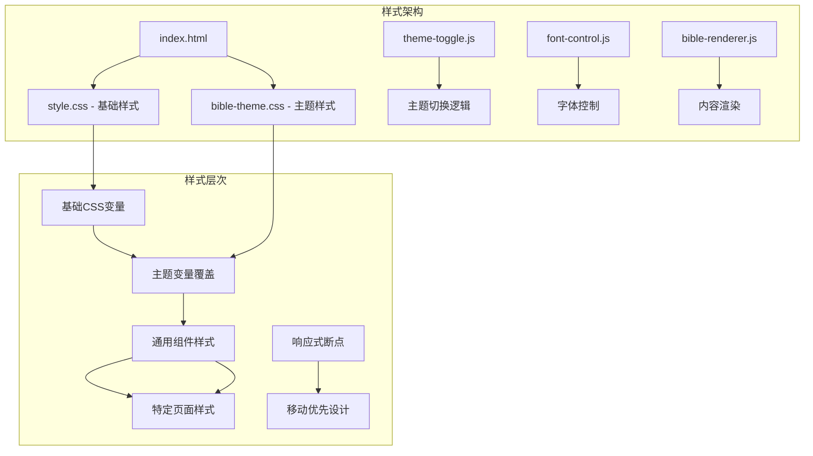
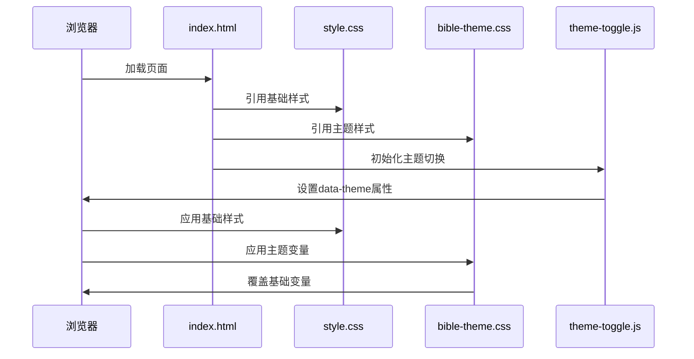
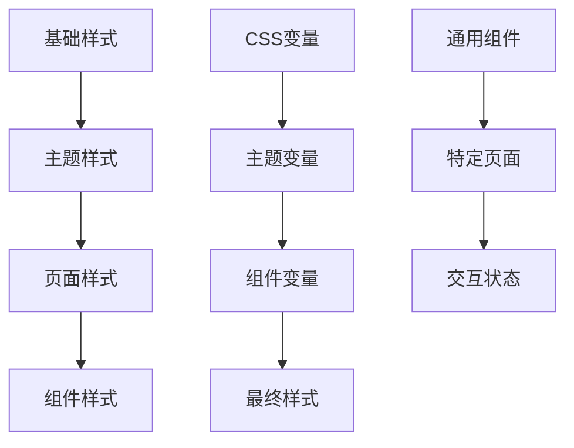
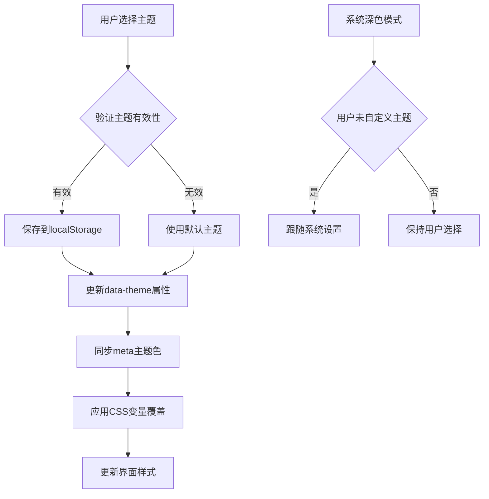
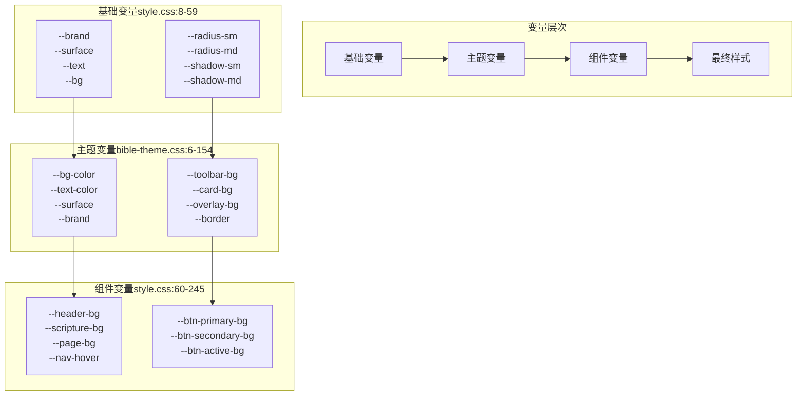
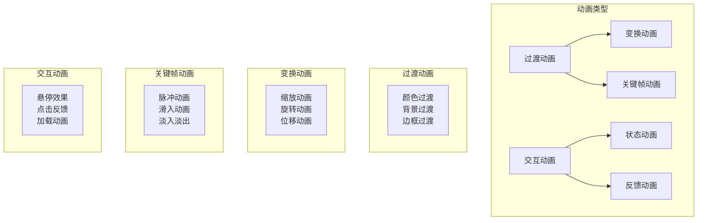
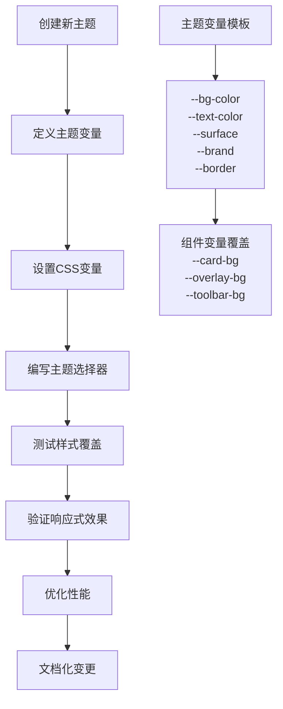
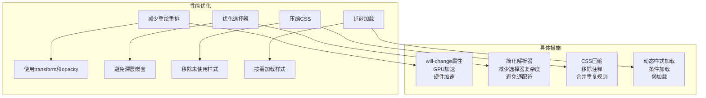
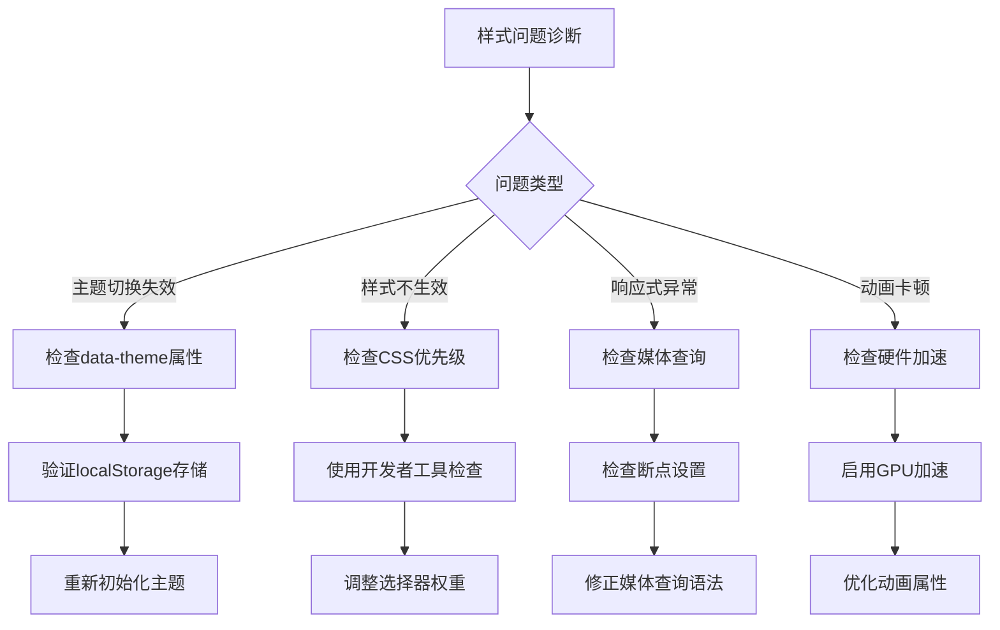

# CSS样式系统

<cite>
**本文档引用的文件**
- [style.css](file://src/static/css/style.css)
- [bible-theme.css](file://src/static/css/bible-theme.css)
- [index.html](file://src/static/index.html)
- [theme-toggle.js](file://src/static/js/theme-toggle.js)
- [font-control.js](file://src/static/js/font-control.js)
- [bible-renderer.js](file://src/static/js/bible-renderer.js)
</cite>

## 目录
1. [项目概述](#项目概述)
2. [样式架构设计](#样式架构设计)
3. [CSS模块化组织](#css模块化组织)
4. [主题系统实现](#主题系统实现)
5. [响应式设计原则](#响应式设计原则)
6. [CSS变量使用](#css变量使用)
7. [媒体查询应用](#媒体查询应用)
8. [动画效果实现](#动画效果实现)
9. [样式扩展指南](#样式扩展指南)
10. [性能优化建议](#性能优化建议)
11. [故障排除指南](#故障排除指南)
12. [总结](#总结)

## 项目概述

这是一个基于现代Web技术的圣经阅读应用，采用模块化的CSS样式系统设计。项目通过分离基础样式和主题样式，实现了灵活的主题切换和响应式布局。整个样式系统围绕CSS变量、媒体查询和动画效果构建，提供了丰富的用户体验。

## 样式架构设计

### 样式文件分离策略

项目采用了清晰的样式文件分离机制：



**图表来源**
- [style.css:1-1111](file://src/static/css/style.css#L1-L1111)
- [bible-theme.css:1-758](file://src/static/css/bible-theme.css#L1-L758)

### 样式加载流程



**图表来源**
- [index.html:25-26](file://src/static/index.html#L25-L26)
- [theme-toggle.js:444-447](file://src/static/js/theme-toggle.js#L444-L447)

**章节来源**
- [style.css:1-1111](file://src/static/css/style.css#L1-L1111)
- [bible-theme.css:1-758](file://src/static/css/bible-theme.css#L1-L758)
- [index.html:25-26](file://src/static/index.html#L25-L26)

## CSS模块化组织

### 文件结构分析

项目采用模块化CSS组织方式，将不同功能的样式分离到独立文件中：

| 文件名 | 功能描述 | 样式范围 |
|--------|----------|----------|
| style.css | 基础样式和通用组件 | 全局样式、通用组件、响应式 |
| bible-theme.css | 主题样式和特定页面 | 主题变量、页面特定样式 |
| 其他CSS文件 | 页面特定样式 | 章节、诗歌、详情等页面 |

### 样式命名规范

项目遵循统一的命名约定：

```css
/* 基础组件类名 */
.container { /* 容器样式 */ }
.header { /* 头部样式 */ }
.content { /* 内容区域样式 */ }

/* 主题相关类名 */
.theme-panel { /* 主题面板 */ }
.theme-option { /* 主题选项 */ }
.theme-preview { /* 主题预览 */ }

/* 动画相关类名 */
.slideUp { /* 上滑动画 */ }
.fadeIn { /* 淡入动画 */ }
.show { /* 显示状态 */ }
.hide { /* 隐藏状态 */ }
```

### 样式继承关系



**图表来源**
- [style.css:8-103](file://src/static/css/style.css#L8-L103)
- [bible-theme.css:6-154](file://src/static/css/bible-theme.css#L6-L154)

**章节来源**
- [style.css:8-1111](file://src/static/css/style.css#L8-L1111)
- [bible-theme.css:6-758](file://src/static/css/bible-theme.css#L6-L758)

## 主题系统实现

### 多主题支持架构

项目实现了五种不同的阅读主题：

| 主题名称 | 主题值 | 主题特点 | 适用场景 |
|----------|--------|----------|----------|
| 灰白 | gray-white | 浅色主题，经典阅读体验 | 日间阅读、长时间阅读 |
| 浅黄 | light-yellow | 柔和黄色背景，温暖舒适 | 夜间阅读、放松阅读 |
| 米黄 | warm-yellow | 暖色调米黄色，传统纸质感 | 经典阅读、纸质书籍感 |
| 深灰 | dark-gray | 深灰色背景，护眼设计 | 夜间阅读、低光环境 |
| 夜黑 | night | 完全黑色背景，深色模式 | 夜晚阅读、极暗环境 |

### 主题切换机制



**图表来源**
- [theme-toggle.js:291-358](file://src/static/js/theme-toggle.js#L291-L358)
- [index.html:10](file://src/static/index.html#L10)

### 主题变量覆盖机制

```css
/* 基础主题变量（style.css） */
:root {
    --brand: #667eea;
    --surface: #fafbff;
    --text: #1f2937;
    --bg: linear-gradient(135deg,#667EEA,#5B67D4);
}

/* 具体主题变量覆盖（bible-theme.css） */
[data-theme="gray-white"] {
    --bg-color: #FFFFFF;
    --text-color: #3D2B1F;
    --surface: #FFFFFF;
    --brand: #8B4513;
    /* 更多变量覆盖... */
}
```

**章节来源**
- [theme-toggle.js:291-510](file://src/static/js/theme-toggle.js#L291-L510)
- [bible-theme.css:6-154](file://src/static/css/bible-theme.css#L6-L154)

## 响应式设计原则

### 移动优先设计

项目采用移动优先的设计理念，通过媒体查询逐步增强：

```css
/* 基础样式（移动端） */
.container { padding: 12px; }
.header { margin: 0px -12px 0; }
.nav { gap: 8px; }

/* 平板设备（≥768px） */
@media (min-width: 768px) {
    .container { padding: 16px; }
    .header { margin: 0px -16px 0; padding: 20px 50px 20px; }
    .nav { gap: 10px; }
}

/* 桌面设备（≥1024px） */
@media (min-width: 1024px) {
    .container { max-width: 800px; margin: 0 auto; }
    .content { max-width: 860px; }
}
```

### 断点设计策略

| 断点 | 设备类型 | 屏幕宽度 | 设计重点 |
|------|----------|----------|----------|
| 480px | 小型移动设备 | ≤480px | 简化布局、大触摸目标 |
| 768px | 平板设备 | ≥768px | 增强功能、网格布局 |
| 1024px | 桌面设备 | ≥1024px | 复杂布局、多列设计 |
| 1200px | 大屏幕 | ≥1200px | 最大化内容展示 |

### 响应式组件设计

```css
/* 响应式导航栏 */
.page-navigation {
    flex-wrap: nowrap;
    align-items: center;
    justify-content: space-between;
    gap: 0;
    margin: 10px 0 10px;
    padding: 6px;
}

/* 移动端适配 */
@media (max-width: 768px) {
    .page-navigation { gap: 0; }
    .nav-link { min-width: 0; }
    .nav-link:first-child { border-radius: 0; }
    .nav-link:last-child { border-radius: 0; }
}
```

**章节来源**
- [style.css:326-518](file://src/static/css/style.css#L326-L518)
- [bible-theme.css:737-758](file://src/static/css/bible-theme.css#L737-L758)

## CSS变量使用

### 变量层次结构

项目采用分层的CSS变量体系：



**图表来源**
- [style.css:8-245](file://src/static/css/style.css#L8-L245)
- [bible-theme.css:6-154](file://src/static/css/bible-theme.css#L6-L154)

### 变量使用模式

```css
/* 变量引用示例 */
.header {
    background: var(--header-bg);
    color: var(--header-text);
}

.button {
    background: var(--btn-primary-bg);
    color: var(--btn-primary-text);
    border: 1px solid var(--btn-primary-border);
}

.card {
    background: var(--card-bg);
    border: 1px solid var(--card-border);
    box-shadow: var(--card-shadow);
}
```

### 主题变量覆盖规则

```css
/* 默认主题覆盖（:root） */
:root {
    --brand: #667eea;
    --surface: #fafbff;
    --text: #1f2937;
}

/* 具体主题覆盖（[data-theme="warm"]） */
[data-theme="warm"] {
    --brand: #8B6B3A;
    --surface: #FBF7EF;
    --text: #4A3525;
    /* 更多变量覆盖 */
}
```

**章节来源**
- [style.css:8-245](file://src/static/css/style.css#L8-L245)
- [bible-theme.css:6-154](file://src/static/css/bible-theme.css#L6-L154)

## 媒体查询应用

### 媒体查询策略

项目使用了多层次的媒体查询策略：

```css
/* 移动端基础样式 */
.container { padding: 12px; }
.header { margin: 0px -12px 0; }

/* 平板设备增强 */
@media (min-width: 768px) {
    .container { padding: 16px; }
    .header { margin: 0px -16px 0; padding: 20px 50px 20px; }
    .nav { gap: 10px; }
}

/* 大屏幕优化 */
@media (min-width: 1024px) {
    .container { max-width: 800px; margin: 0 auto; }
    .content { max-width: 860px; }
}

/* 平板横屏特殊处理 */
@media (min-width: 600px) and (orientation: landscape) {
    .scripture-popup { position: fixed; bottom: 0; }
}
```

### 响应式断点配置

| 断点名称 | 值 | 用途 | 设计考虑 |
|----------|-----|------|----------|
| mobile | 480px | 小型移动设备 | 简化布局、大触摸目标 |
| tablet | 768px | 平板设备 | 增强功能、网格布局 |
| desktop | 1024px | 桌面设备 | 复杂布局、多列设计 |
| largeDesktop | 1200px | 大屏幕 | 最大化内容展示 |
| smallScreen | 600px | 小屏幕平板 | 横屏优化、特殊处理 |

### 媒体查询最佳实践

```css
/* 使用min-width而非max-width */
@media (min-width: 768px) {
    .desktop-only { display: block; }
}

/* 避免过度使用媒体查询 */
@media (min-width: 768px) {
    .responsive-grid {
        display: grid;
        grid-template-columns: repeat(auto-fit, minmax(200px, 1fr));
        gap: 20px;
    }
}

/* 使用CSS自定义属性配合媒体查询 */
@media (min-width: 768px) {
    :root {
        --container-padding: 16px;
        --header-padding: 20px 50px 20px;
    }
}
```

**章节来源**
- [style.css:326-518](file://src/static/css/style.css#L326-L518)
- [bible-theme.css:737-758](file://src/static/css/bible-theme.css#L737-L758)

## 动画效果实现

### 动画类型分类

项目实现了多种类型的动画效果：



### 关键帧动画实现

```css
/* 搜索目标脉冲动画 */
@keyframes cx-target-pulse {
    0%, 100% { background-color: transparent; }
    50% { background-color: rgba(255,179,71,0.25); }
}

/* 启动加载页淡入动画 */
@keyframes cxToastIn {
    from { transform: translateY(-100%); }
    to { transform: translateY(0); }
}

/* 滑入动画 */
@keyframes slideUp {
    from { transform: translate(-50%, 100%); opacity: 0; }
    to { transform: translate(-50%, 0); opacity: 1; }
}

/* 预加载动画 */
@keyframes shimmer {
    0% { background-position: 200% 0; }
    100% { background-position: -200% 0; }
}
```

### 交互动画效果

```css
/* 按钮悬停效果 */
.theme-toggle-btn {
    transition: all 0.2s;
    transform: scale(1);
}

.theme-toggle-btn:hover {
    transform: scale(1.08);
    opacity: 1;
}

/* 滑块悬停效果 */
.font-size-slider::-webkit-slider-thumb {
    transition: all 0.2s;
    box-shadow: var(--control-thumb-shadow);
}

.font-size-slider::-webkit-slider-thumb:hover {
    transform: scale(1.15);
    box-shadow: var(--control-thumb-shadow-hover);
}

/* 弹窗动画 */
.theme-panel {
    transition: opacity 0.25s cubic-bezier(.4,0,.2,1),
               transform 0.25s cubic-bezier(.4,0,.2,1);
}

.theme-panel.show {
    opacity: 1;
    transform: translateY(0) scale(1);
}
```

### 性能优化的动画

```css
/* 使用transform和opacity进行硬件加速 */
.progress-bar-fill {
    transition: width 0.3s ease;
    will-change: width;
}

/* 避免使用可能触发布局的属性 */
.bottom-control-bar {
    transition: all 0.2s ease;
    will-change: transform;
}

/* 使用transform3d启用GPU加速 */
.theme-panel.show {
    transform: translateY(0) scale(1);
    transform: translateZ(0);
}
```

**章节来源**
- [style.css:350-408](file://src/static/css/style.css#L350-L408)
- [style.css:844](file://src/static/css/style.css#L844)
- [style.css:1093-1111](file://src/static/css/style.css#L1093-L1111)

## 样式扩展指南

### 新主题添加流程



### 主题变量命名规范

```css
/* 基础颜色变量 */
--brand: #667eea;           /* 品牌色 */
--surface: #fafbff;         /* 表面色 */
--text: #1f2937;            /* 文本色 */

/* 组件变量 */
--card-bg: var(--surface);  /* 卡片背景 */
--header-bg: var(--brand);  /* 头部背景 */
--page-bg: #f0f3f9;         /* 页面背景 */

/* 状态变量 */
--hover-state: rgba(102,126,234,0.1);
--active-state: rgba(102,126,234,0.2);
```

### 主题切换扩展

```javascript
// 添加新主题到主题数组
const VALID_THEMES = ['gray-white', 'light-yellow', 'warm-yellow', 'dark-gray', 'night', 'new-theme'];

// 更新主题映射
const themeMetaColors = {
    'gray-white': '#FFFFFF',
    'light-yellow': '#FFF8E7',
    'warm-yellow': '#F5F0E6',
    'dark-gray': '#3E3E3E',
    'night': '#1A1A1A',
    'new-theme': '#FF6B6B'  // 新主题颜色
};

// 在主题选择器中添加新主题
const newThemeSwatch = `
    <div class="theme-swatch-card" data-theme="new-theme"
         style="background: #FF6B6B; color: #FFFFFF;"
         onclick="setTheme('new-theme')">
        新主题
    </div>
`;
```

### 样式定制最佳实践

```css
/* 使用CSS自定义属性进行主题定制 */
:root {
    --custom-brand: #667eea;
    --custom-radius: 8px;
    --custom-shadow: 0 2px 8px rgba(0,0,0,0.1);
}

/* 在组件中使用自定义属性 */
.custom-component {
    background: var(--custom-brand);
    border-radius: var(--custom-radius);
    box-shadow: var(--custom-shadow);
}

/* 响应式定制 */
@media (max-width: 768px) {
    :root {
        --custom-brand: #5B67D4;
        --custom-radius: 6px;
    }
}
```

**章节来源**
- [theme-toggle.js:291-510](file://src/static/js/theme-toggle.js#L291-L510)
- [bible-theme.css:6-154](file://src/static/css/bible-theme.css#L6-L154)

## 性能优化建议

### CSS性能优化策略



### 选择器性能优化

```css
/* 避免使用深层嵌套选择器 */
/* 不推荐 */
.content .nav .nav-link:hover { color: #667eea; }

/* 推荐 */
.nav-link:hover { color: #667eea; }

/* 使用类选择器替代标签选择器 */
/* 不推荐 */
ul li a { color: #667eea; }

/* 推荐 */
.navigation-link { color: #667eea; }
```

### 动画性能优化

```css
/* 使用transform和opacity进行硬件加速 */
.theme-panel {
    will-change: transform, opacity;
    transform: translateZ(0);
}

/* 避免使用可能触发布局的属性 */
.progress-bar-fill {
    will-change: width;
    transition: width 0.3s ease;
}

/* 使用transform3d启用GPU加速 */
.animation-element {
    transform: translateZ(0);
    backface-visibility: hidden;
}
```

### 响应式性能优化

```css
/* 使用媒体查询优化移动端性能 */
@media (max-width: 768px) {
    /* 移动端简化动画 */
    .animated-element {
        animation-duration: 0.1s;
        transition-duration: 0.1s;
    }
    
    /* 移动端禁用复杂效果 */
    .complex-background {
        background: var(--surface);
    }
}

/* 使用prefers-reduced-motion优化无障碍 */
@media (prefers-reduced-motion: reduce) {
    * {
        animation-duration: 0.01ms !important;
        animation-iteration-count: 1 !important;
        transition-duration: 0.01ms !important;
    }
}
```

**章节来源**
- [style.css:337](file://src/static/css/style.css#L337)
- [style.css:1093-1111](file://src/static/css/style.css#L1093-L1111)

## 故障排除指南

### 常见样式问题及解决方案



### 主题切换故障排查

```javascript
// 检查主题切换是否正常工作
function debugThemeSwitch() {
    const theme = document.documentElement.getAttribute('data-theme');
    console.log('当前主题:', theme);
    
    // 检查CSS变量是否正确应用
    const computedStyle = getComputedStyle(document.documentElement);
    const brandColor = computedStyle.getPropertyValue('--brand');
    console.log('品牌色变量:', brandColor);
    
    // 验证主题变量覆盖
    const themeVars = document.querySelectorAll('[data-theme]');
    console.log('主题元素数量:', themeVars.length);
}

// 监听主题变化事件
window.addEventListener('themeChanged', function(event) {
    console.log('主题已切换到:', event.detail.theme);
});
```

### 响应式问题诊断

```css
/* 使用CSS Grid进行布局调试 */
.debug-layout {
    display: grid;
    grid-template-columns: repeat(auto-fit, minmax(200px, 1fr));
    gap: 20px;
    border: 2px solid red;
}

/* 检查媒体查询是否生效 */
@media (max-width: 768px) {
    .debug-layout {
        grid-template-columns: 1fr;
        border-color: blue;
    }
}
```

### 性能问题排查

```css
/* 检查动画性能 */
.performance-test {
    animation: testAnimation 1s infinite;
    will-change: transform;
}

@keyframes testAnimation {
    0% { transform: translateX(0); }
    50% { transform: translateX(100px); }
    100% { transform: translateX(0); }
}

/* 使用requestAnimationFrame优化动画 */
function animateElement() {
    requestAnimationFrame(() => {
        element.style.transform = 'translateX(100px)';
    });
}
```

**章节来源**
- [theme-toggle.js:444-510](file://src/static/js/theme-toggle.js#L444-L510)
- [style.css:337](file://src/static/css/style.css#L337)

## 总结

该项目的CSS样式系统展现了现代Web开发的最佳实践，通过模块化设计、主题系统、响应式布局和动画效果的有机结合，为用户提供了一致而优雅的阅读体验。

### 核心优势

1. **模块化架构**：清晰的样式文件分离，便于维护和扩展
2. **灵活的主题系统**：支持五种不同主题，满足多样化需求
3. **响应式设计**：移动优先的设计理念，适配各种设备
4. **性能优化**：合理的CSS变量使用和动画优化
5. **可扩展性**：良好的架构设计，便于添加新功能

### 技术亮点

- **CSS变量系统**：实现了完整的主题变量覆盖机制
- **媒体查询策略**：多层次的响应式设计
- **动画优化**：硬件加速和性能优化的动画实现
- **无障碍支持**：prefers-reduced-motion等无障碍特性

### 发展建议

1. **进一步模块化**：可以考虑将样式进一步拆分为更小的功能模块
2. **自动化测试**：建立CSS样式测试框架，确保样式质量
3. **文档完善**：补充详细的样式API文档和最佳实践指南
4. **性能监控**：建立CSS性能监控机制，持续优化用户体验

这个样式系统为类似的阅读应用提供了优秀的参考模板，其设计理念和实现方式值得其他项目借鉴和学习。