# HTML模板结构

<cite>
**本文档引用的文件**
- [index.html](file://src/static/index.html)
- [style.css](file://src/static/css/style.css)
- [bible-theme.css](file://src/static/css/bible-theme.css)
- [theme-toggle.js](file://src/static/js/theme-toggle.js)
- [router.js](file://src/static/js/router.js)
- [renderer.js](file://src/static/js/renderer.js)
- [main_manifest.json](file://src/templates/main_manifest.json)
- [main_sw.js](file://src/templates/main_sw.js)
- [app_config.json](file://app_config.json)
- [package.json](file://package.json)
- [config.yaml](file://config.yaml)
</cite>

## 目录
1. [简介](#简介)
2. [项目结构](#项目结构)
3. [核心组件](#核心组件)
4. [架构概览](#架构概览)
5. [详细组件分析](#详细组件分析)
6. [依赖关系分析](#依赖关系分析)
7. [性能考虑](#性能考虑)
8. [故障排除指南](#故障排除指南)
9. [结论](#结论)

## 简介

这是一个基于现代Web技术构建的多语言圣经阅读应用的HTML模板结构文档。该应用采用PWA（渐进式Web应用）架构，支持在线和离线使用，具有丰富的主题切换功能和响应式设计。

该项目的核心特点包括：
- 基于HTML5语义化标签的页面结构
- CSS自定义属性驱动的主题系统
- JavaScript模块化的功能架构
- Service Worker离线缓存支持
- 响应式布局适配多设备

## 项目结构

项目采用模块化组织方式，主要分为以下几个核心目录：

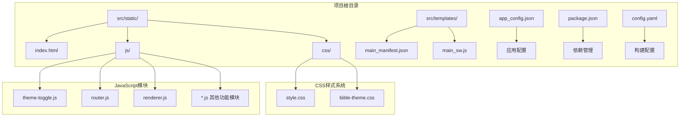

**图表来源**
- [index.html:1-687](file://src/static/index.html#L1-L687)
- [style.css:1-800](file://src/static/css/style.css#L1-L800)
- [bible-theme.css:1-758](file://src/static/css/bible-theme.css#L1-L758)

**章节来源**
- [index.html:1-687](file://src/static/index.html#L1-L687)
- [config.yaml:1-12](file://config.yaml#L1-L12)

## 核心组件

### 页面骨架结构

HTML模板采用了标准的页面骨架结构，包含完整的文档类型声明、字符集设置和视口配置：

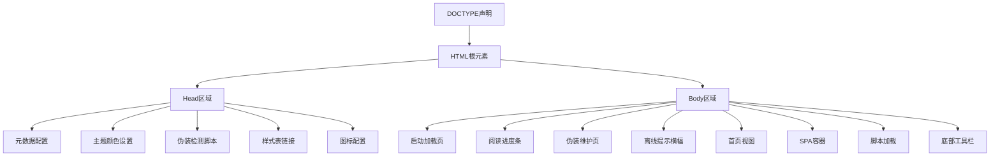

**图表来源**
- [index.html:1-103](file://src/static/index.html#L1-L103)
- [index.html:149-684](file://src/static/index.html#L149-L684)

### 主题切换系统

应用实现了五种主题模式，通过CSS自定义属性实现动态主题切换：

| 主题名称 | 颜色方案 | 适用场景 |
|---------|----------|----------|
| gray-white | 浅色背景，棕色文字 | 经典阅读体验 |
| light-yellow | 浅黄色背景，深色文字 | 温暖阅读氛围 |
| warm-yellow | 米黄色背景，深色文字 | 舒适阅读环境 |
| dark-gray | 深灰色背景，浅色文字 | 夜间阅读模式 |
| night | 黑色背景，浅色文字 | 极暗环境阅读 |

**章节来源**
- [index.html:10-11](file://src/static/index.html#L10-L11)
- [bible-theme.css:6-154](file://src/static/css/bible-theme.css#L6-L154)

## 架构概览

应用采用SPA（单页应用程序）架构，结合PWA技术实现离线缓存和原生应用体验：

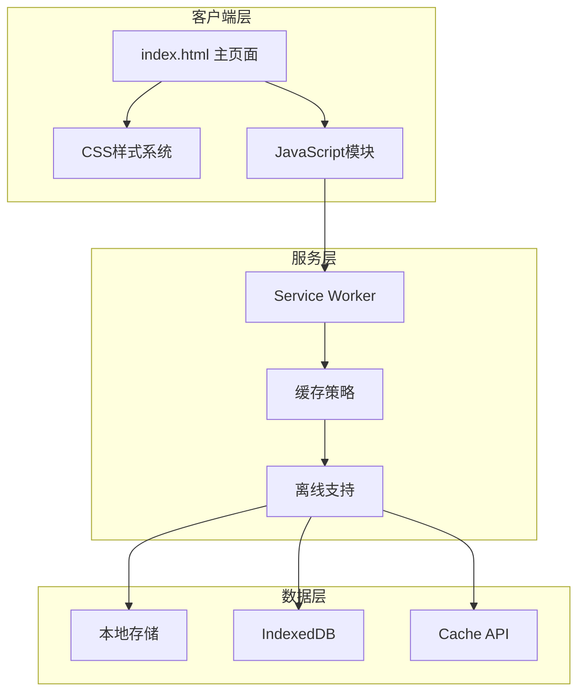

**图表来源**
- [index.html:200-664](file://src/static/index.html#L200-L664)
- [main_sw.js:1-270](file://src/templates/main_sw.js#L1-L270)

## 详细组件分析

### 主页面结构分析

主页面采用清晰的层次结构，包含多个功能区域：

#### 1. 元数据配置区域

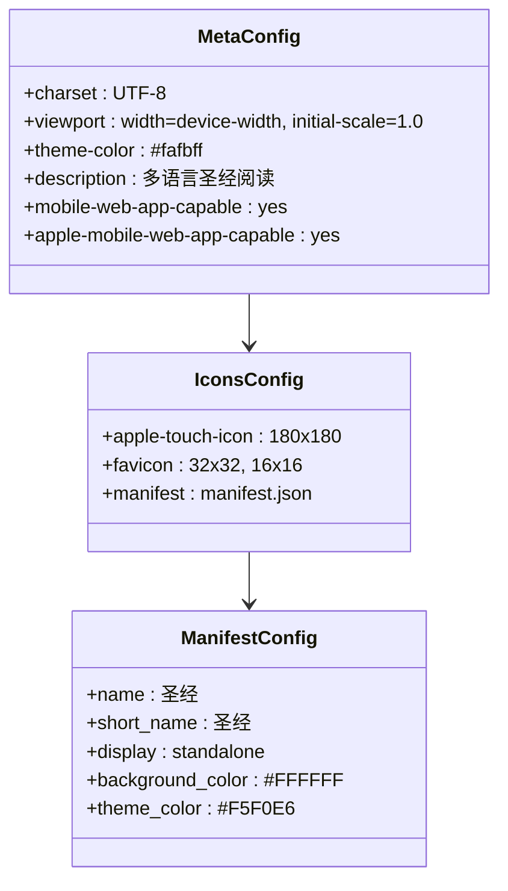

**图表来源**
- [index.html:4-24](file://src/static/index.html#L4-L24)
- [main_manifest.json:1-26](file://src/templates/main_manifest.json#L1-L26)

#### 2. 主题切换机制

主题切换通过以下步骤实现：

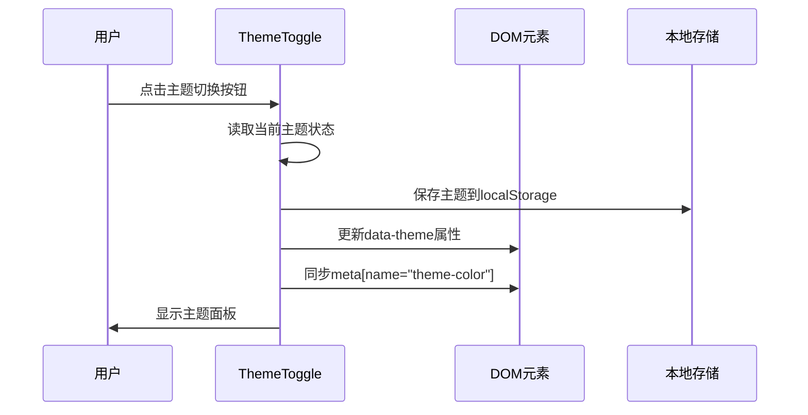

**图表来源**
- [theme-toggle.js:288-510](file://src/static/js/theme-toggle.js#L288-L510)

#### 3. SPA路由系统

应用使用hash-based路由实现单页应用导航：

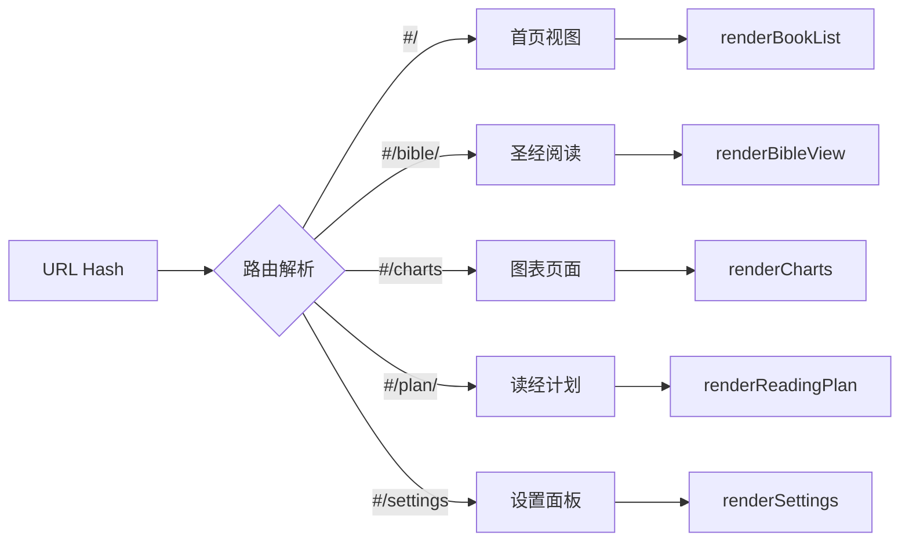

**图表来源**
- [router.js:16-153](file://src/static/js/router.js#L16-L153)

**章节来源**
- [index.html:149-684](file://src/static/index.html#L149-L684)
- [theme-toggle.js:288-510](file://src/static/js/theme-toggle.js#L288-L510)
- [router.js:16-153](file://src/static/js/router.js#L16-L153)

### 样式系统架构

应用采用两层样式架构：

#### 1. 全局样式系统

全局样式通过CSS自定义属性实现主题驱动的设计：

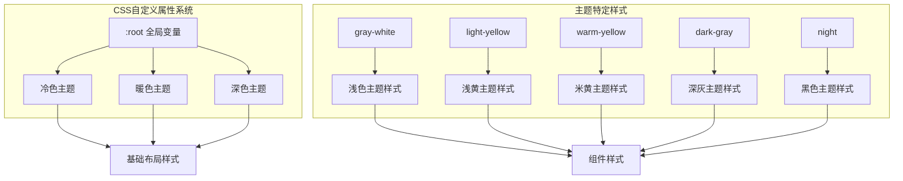

**图表来源**
- [style.css:8-245](file://src/static/css/style.css#L8-L245)
- [bible-theme.css:6-154](file://src/static/css/bible-theme.css#L6-L154)

#### 2. 响应式设计

应用实现了完整的响应式设计，支持从手机到桌面的各种设备：

**章节来源**
- [style.css:315-518](file://src/static/css/style.css#L315-L518)
- [bible-theme.css:737-758](file://src/static/css/bible-theme.css#L737-L758)

### 功能模块分析

#### 1. 主题切换模块

主题切换模块提供了完整的主题管理系统：

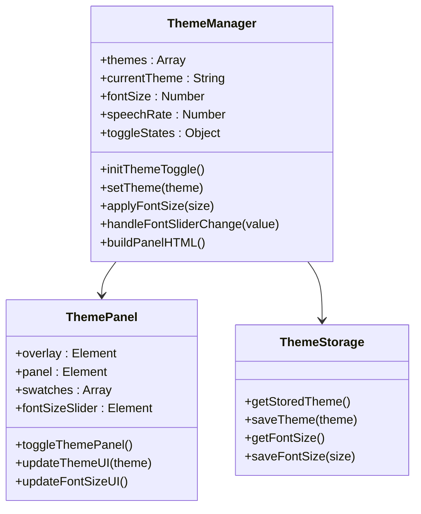

**图表来源**
- [theme-toggle.js:288-800](file://src/static/js/theme-toggle.js#L288-L800)

#### 2. 路由导航模块

路由模块实现了智能的页面导航和状态管理：

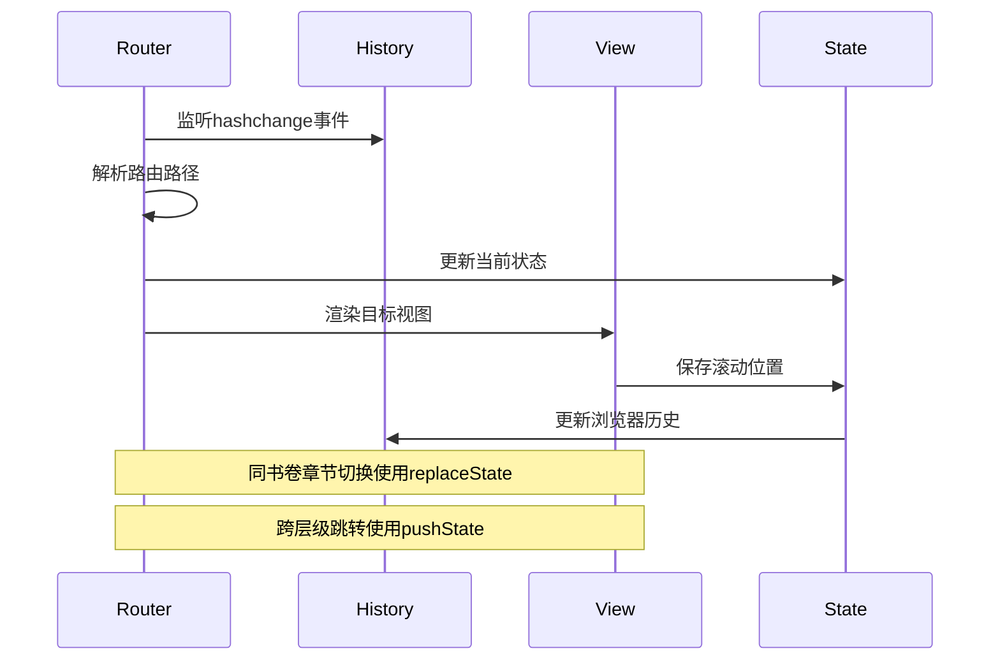

**图表来源**
- [router.js:84-152](file://src/static/js/router.js#L84-L152)

**章节来源**
- [theme-toggle.js:288-800](file://src/static/js/theme-toggle.js#L288-L800)
- [router.js:84-152](file://src/static/js/router.js#L84-L152)

## 依赖关系分析

### 外部依赖

项目的主要外部依赖包括：

```mermaid
graph TB
subgraph "核心依赖"
A[Capacitor Core] --> B[原生功能集成]
C[Capacitor App] --> D[应用生命周期管理]
E[Capacitor Filesystem] --> F[文件系统访问]
G[Capacitor Status Bar] --> H[状态栏控制]
end
subgraph "第三方库"
I[localforage] --> J[IndexedDB封装]
K[jszip] --> L[ZIP文件处理]
M[Capacitor Text-to-Speech] --> N[语音合成]
end
subgraph "开发依赖"
O[@capacitor/android] --> P[Android平台]
Q[@capacitor/cli] --> R[命令行工具]
end
```

**图表来源**
- [package.json:12-23](file://package.json#L12-L23)

### 内部模块依赖

应用内部模块之间的依赖关系：

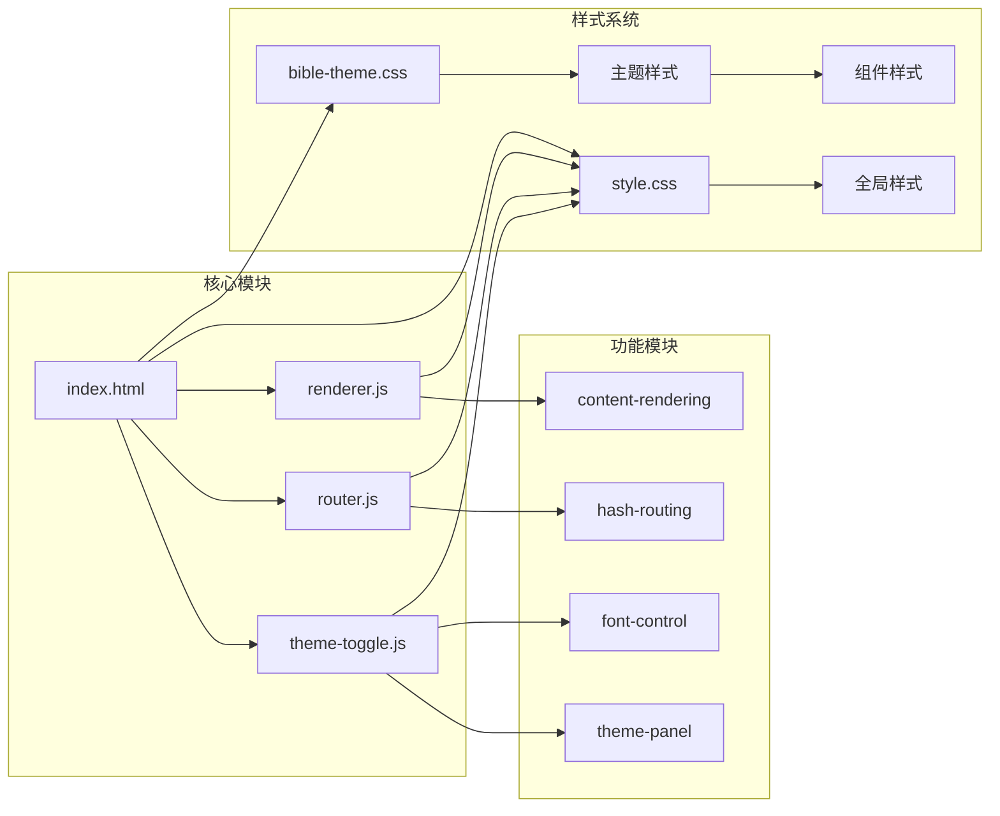

**图表来源**
- [index.html:166-198](file://src/static/index.html#L166-L198)
- [style.css:1-800](file://src/static/css/style.css#L1-L800)
- [bible-theme.css:1-758](file://src/static/css/bible-theme.css#L1-L758)

**章节来源**
- [package.json:12-23](file://package.json#L12-L23)
- [index.html:166-198](file://src/static/index.html#L166-L198)

## 性能考虑

### 缓存策略

应用采用了多层次的缓存策略来优化性能：

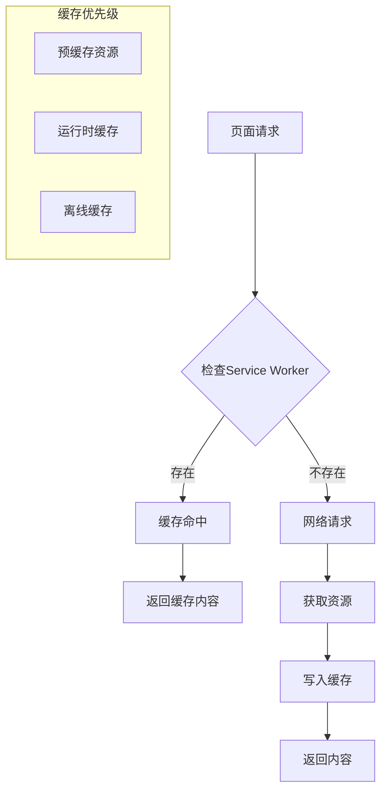

**图表来源**
- [main_sw.js:25-36](file://src/templates/main_sw.js#L25-L36)
- [main_sw.js:88-166](file://src/templates/main_sw.js#L88-L166)

### 性能优化措施

1. **懒加载策略**：非关键脚本延迟加载
2. **资源压缩**：CSS和JavaScript文件压缩
3. **缓存利用**：合理利用浏览器缓存
4. **按需渲染**：SPA按需渲染页面内容

## 故障排除指南

### 常见问题及解决方案

#### 1. 主题切换失效

**问题症状**：主题切换按钮无响应
**解决方法**：
- 检查localStorage访问权限
- 验证CSS自定义属性是否正确更新
- 确认data-theme属性是否正确设置

#### 2. 页面导航异常

**问题症状**：路由跳转无效或历史记录混乱
**解决方法**：
- 检查hashchange事件监听
- 验证路由解析逻辑
- 确认history API使用正确

#### 3. 离线功能异常

**问题症状**：Service Worker注册失败或缓存不生效
**解决方法**：
- 检查HTTPS环境要求
- 验证缓存策略配置
- 确认资源URL格式正确

**章节来源**
- [theme-toggle.js:178-282](file://src/static/js/theme-toggle.js#L178-L282)
- [router.js:84-152](file://src/static/js/router.js#L84-L152)
- [main_sw.js:25-36](file://src/templates/main_sw.js#L25-L36)

## 结论

该HTML模板结构展现了现代Web应用的最佳实践，通过合理的架构设计和模块化组织，实现了功能丰富、性能优异的多语言圣经阅读应用。主要优势包括：

1. **清晰的架构层次**：从页面骨架到功能模块的完整设计
2. **灵活的主题系统**：基于CSS自定义属性的动态主题切换
3. **优秀的用户体验**：SPA架构提供流畅的页面切换体验
4. **完善的离线支持**：Service Worker实现可靠的离线功能
5. **响应式设计**：适配各种设备和屏幕尺寸

该模板结构为类似的应用开发提供了良好的参考框架，其模块化的设计便于维护和扩展，同时保持了良好的性能表现。