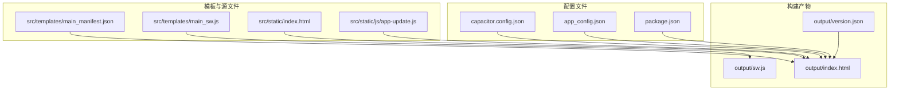
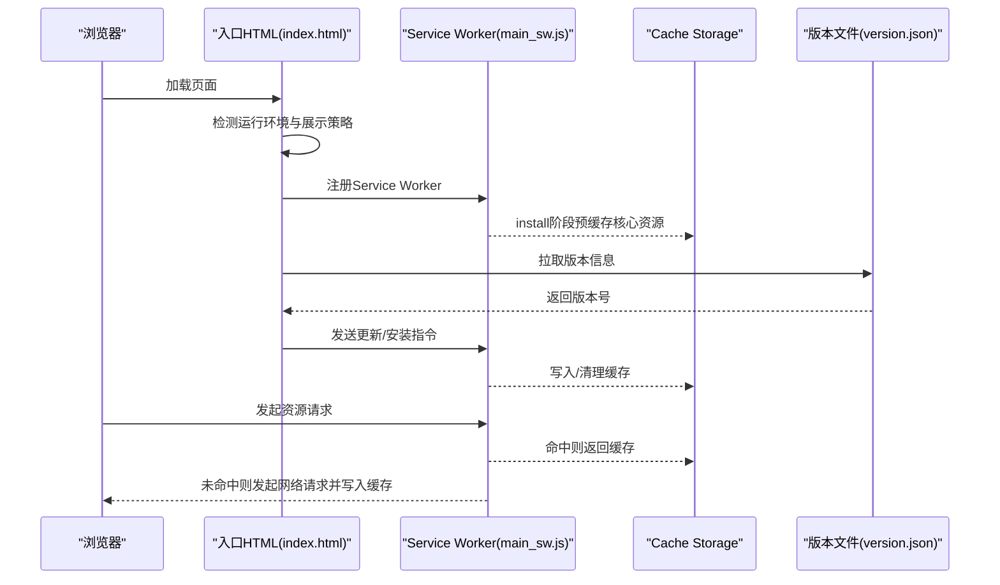
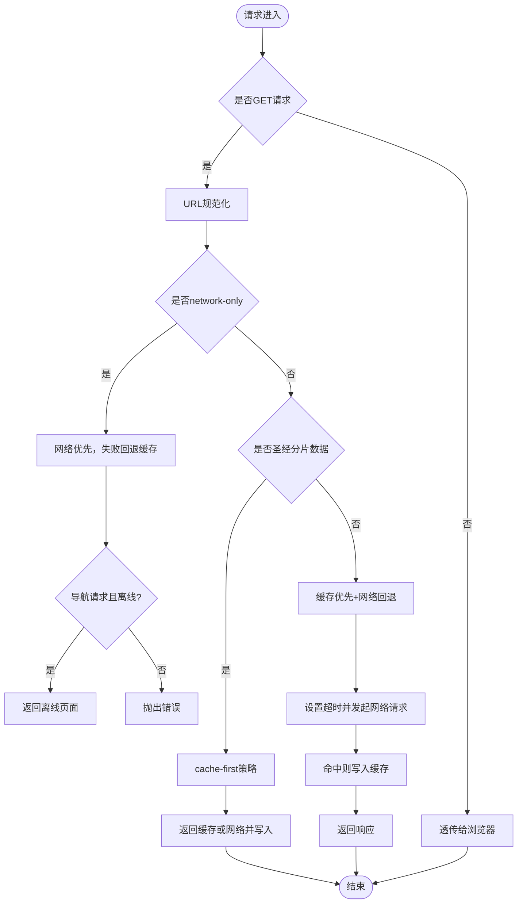
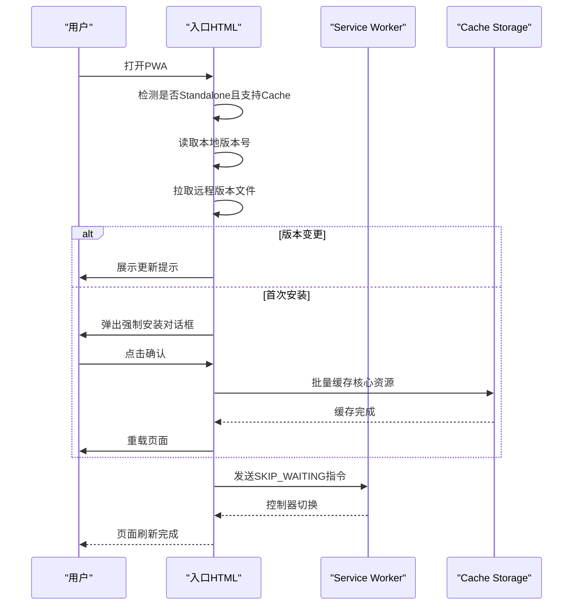
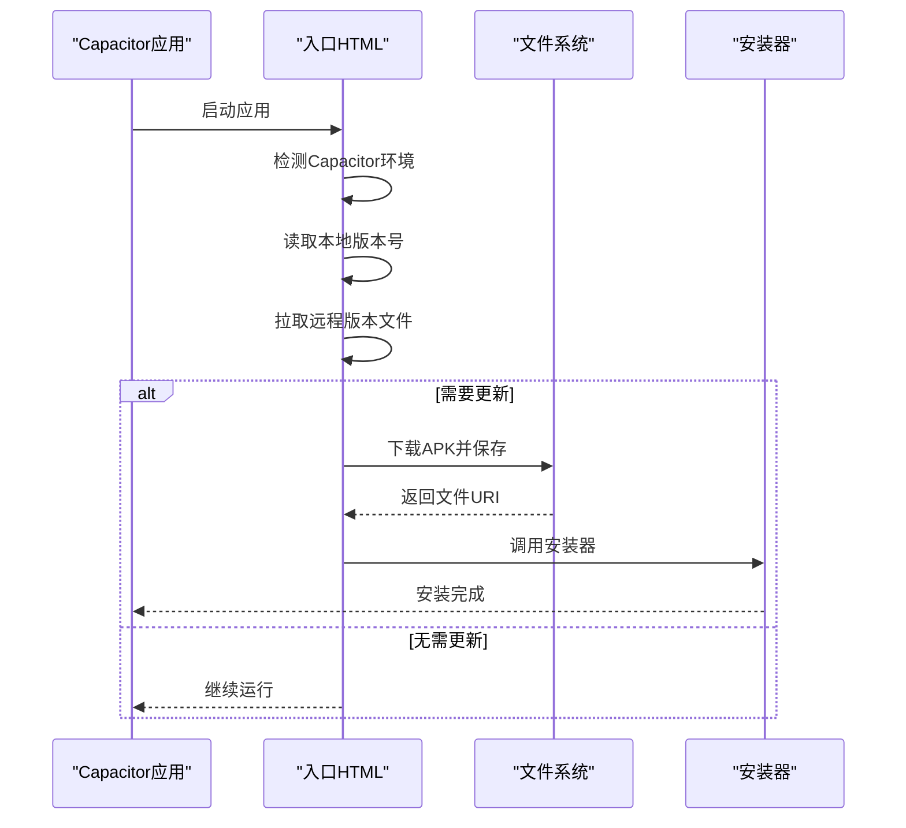
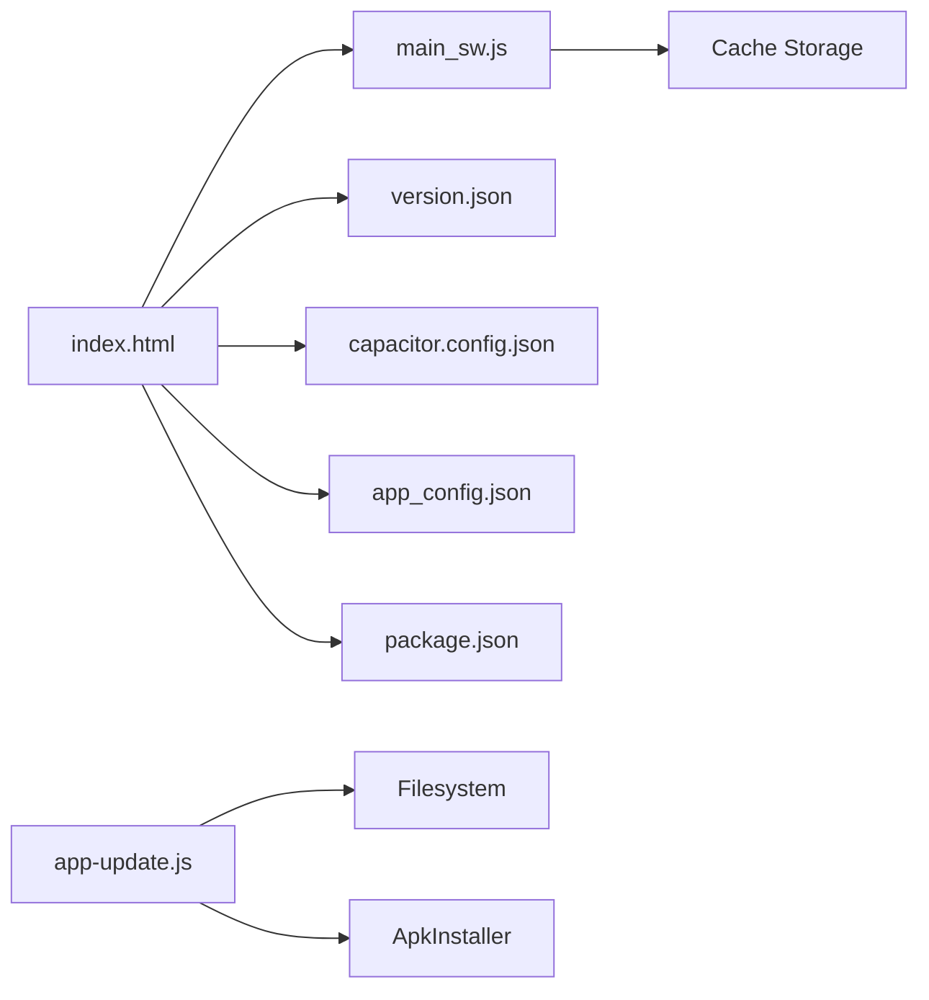

# PWA实现

<cite>
**本文档引用的文件**
- [main_manifest.json](file://src/templates/main_manifest.json)
- [main_sw.js](file://src/templates/main_sw.js)
- [index.html](file://src/static/index.html)
- [app-update.js](file://src/static/js/app-update.js)
- [version.json](file://output/version.json)
- [package.json](file://package.json)
- [capacitor.config.json](file://capacitor.config.json)
- [app_config.json](file://app_config.json)
</cite>

## 目录
1. [简介](#简介)
2. [项目结构](#项目结构)
3. [核心组件](#核心组件)
4. [架构总览](#架构总览)
5. [详细组件分析](#详细组件分析)
6. [依赖关系分析](#依赖关系分析)
7. [性能考虑](#性能考虑)
8. [故障排查指南](#故障排查指南)
9. [结论](#结论)
10. [附录](#附录)

## 简介
本项目是一个基于Web技术构建的渐进式Web应用（PWA），结合Capacitor原生桥接能力，提供跨平台的圣经阅读体验。PWA实现围绕三大核心要素展开：应用清单（Manifest）、Service Worker缓存与离线策略、以及安装与更新机制。本文档将系统阐述这些特性与实现细节，并给出性能优化与调试建议。

## 项目结构
项目采用模板与输出分离的组织方式：
- 模板与源文件位于 src 目录，包含 PWA清单模板、Service Worker模板、入口HTML与前端脚本。
- 构建产物输出到 output 目录，包含运行时的版本信息、图标与打包后的静态资源。
- Capacitor配置文件定义了应用ID、名称、WebView行为等关键参数。

**图表来源**
- [main_manifest.json](file://src/templates/main_manifest.json)
- [main_sw.js](file://src/templates/main_sw.js)
- [index.html](file://src/static/index.html)
- [app-update.js](file://src/static/js/app-update.js)
- [version.json](file://output/version.json)
- [capacitor.config.json](file://capacitor.config.json)
- [app_config.json](file://app_config.json)
- [package.json](file://package.json)

**章节来源**
- [main_manifest.json](file://src/templates/main_manifest.json)
- [main_sw.js](file://src/templates/main_sw.js)
- [index.html](file://src/static/index.html)
- [app-update.js](file://src/static/js/app-update.js)
- [version.json](file://output/version.json)
- [capacitor.config.json](file://capacitor.config.json)
- [app_config.json](file://app_config.json)
- [package.json](file://package.json)

## 核心组件
- 应用清单（Manifest）：定义应用名称、图标、启动URL、显示模式、主题色等元数据，确保PWA在桌面/移动设备上的安装体验一致。
- Service Worker：负责缓存策略、请求拦截、离线回退、消息通信（如强制更新、清理缓存、批量缓存）。
- 安装与更新：通过入口HTML中的注册逻辑与Service Worker交互，实现首次安装缓存、版本检测与更新提示。
- Capacitor集成：在原生环境中禁用Service Worker，改用预填充Cache API与版本控制，保证APK离线可用。

**章节来源**
- [main_manifest.json](file://src/templates/main_manifest.json)
- [main_sw.js](file://src/templates/main_sw.js)
- [index.html](file://src/static/index.html)
- [capacitor.config.json](file://capacitor.config.json)

## 架构总览
PWA运行时的关键交互链路如下：
- 入口HTML加载并检测运行环境（PWA Standalone、Capacitor、原生WebView）。
- 在非原生环境下注册Service Worker，监听安装、激活与fetch事件。
- 通过版本文件进行版本检测，必要时触发强制安装缓存流程。
- Service Worker内部根据URL规则选择缓存策略（network-only、cache-first、fallback）。

**图表来源**
- [index.html](file://src/static/index.html)
- [main_sw.js](file://src/templates/main_sw.js)
- [version.json](file://output/version.json)

## 详细组件分析

### Manifest配置与作用
- 名称与短名称：用于安装后显示的应用标题。
- 描述：简述应用功能。
- 启动URL与作用域：控制PWA的导航边界与启动入口。
- 显示模式：standalone提供类原生体验。
- 背景色与主题色：提升冷启动视觉一致性。
- 分类：便于应用商店归类。
- 图标：提供不同尺寸与用途的图标，支持maskable。

这些字段共同决定了PWA在桌面/移动设备上的安装外观与行为边界。

**章节来源**
- [main_manifest.json](file://src/templates/main_manifest.json)

### Service Worker缓存策略与更新机制
- 缓存命名：统一的缓存空间标识，便于清理与管理。
- 预缓存资源：在install阶段缓存核心URL集合，确保首次可用。
- 生命周期：
  - install：预缓存核心资源，失败不影响安装。
  - activate：接管客户端，确保新SW生效。
- URL规范化：处理中文路径与目录末尾斜杠，提高匹配成功率。
- 请求拦截策略：
  - network-only：特定文件（如版本文件）始终走网络，离线时回退到缓存。
  - cache-first：圣经分片数据优先缓存，适合离线场景。
  - 默认策略：缓存优先，超时后网络回退，命中则写入缓存。
- 错误处理：导航请求离线时返回自定义离线页面。
- 消息通信：支持强制更新、清理全部缓存、清理训练缓存、批量缓存圣经分卷、查询缓存状态等。

**图表来源**
- [main_sw.js](file://src/templates/main_sw.js)

**章节来源**
- [main_sw.js](file://src/templates/main_sw.js)

### 安装流程与版本检测
- 首次安装缓存：在PWA独立模式下，若未缓存核心资源，则弹出强制安装对话框，逐步缓存核心URL集合，完成后重载页面。
- 版本检测：通过拉取版本文件判断是否需要更新；若版本变更且已有缓存，则提示更新。
- 离线提示：首次安装需要网络，离线时显示横幅提示。
- 更新提示：通过toast横幅提示用户更新，避免打断式弹窗。

**图表来源**
- [index.html](file://src/static/index.html)
- [main_sw.js](file://src/templates/main_sw.js)
- [version.json](file://output/version.json)

**章节来源**
- [index.html](file://src/static/index.html)
- [main_sw.js](file://src/templates/main_sw.js)
- [version.json](file://output/version.json)

### Capacitor集成与原生更新
- 在Capacitor原生环境中禁用Service Worker，改为在后台静默填充Cache API，避免WebView限制。
- 通过版本文件与本地存储对比，决定是否执行预填充缓存。
- APK更新：提供下载、保存、安装流程，支持多镜像测速与进度反馈。

**图表来源**
- [index.html](file://src/static/index.html)
- [app-update.js](file://src/static/js/app-update.js)

**章节来源**
- [index.html](file://src/static/index.html)
- [app-update.js](file://src/static/js/app-update.js)

## 依赖关系分析
- 入口HTML依赖Service Worker与版本文件进行缓存与更新控制。
- Service Worker依赖Cache Storage与消息通道与页面交互。
- Capacitor配置影响WebView行为与调试选项。
- 构建脚本与包管理器定义了构建与同步流程。

**图表来源**
- [index.html](file://src/static/index.html)
- [main_sw.js](file://src/templates/main_sw.js)
- [version.json](file://output/version.json)
- [capacitor.config.json](file://capacitor.config.json)
- [app_config.json](file://app_config.json)
- [package.json](file://package.json)
- [app-update.js](file://src/static/js/app-update.js)

**章节来源**
- [index.html](file://src/static/index.html)
- [main_sw.js](file://src/templates/main_sw.js)
- [version.json](file://output/version.json)
- [capacitor.config.json](file://capacitor.config.json)
- [app_config.json](file://app_config.json)
- [package.json](file://package.json)
- [app-update.js](file://src/static/js/app-update.js)

## 性能考虑
- 缓存策略选择
  - 圣经分片数据：cache-first，优先离线可用，减少网络抖动影响。
  - 版本文件：network-only，确保版本判断准确。
  - 其他资源：缓存优先+网络回退，兼顾性能与新鲜度。
- 超时与并发
  - fetch请求设置超时，避免长时间阻塞。
  - 批量缓存使用Promise.allSettled，提升吞吐并容错。
- 离线体验
  - 导航请求离线时返回简洁的离线页面，降低用户困惑。
- 原生环境优化
  - Capacitor下禁用SW，改用预填充缓存，避免WebView限制带来的额外复杂度。

[本节为通用性能指导，不直接分析具体文件]

## 故障排查指南
- Service Worker未生效
  - 检查注册逻辑与控制器切换事件，确认非原生环境。
  - 查看控制台错误与SW生命周期事件。
- 缓存未命中或更新异常
  - 使用消息通道查询缓存状态，确认缓存键与URL规范化是否一致。
  - 检查网络only与cache-first规则是否覆盖目标URL。
- 版本检测失败
  - 确认版本文件可达且格式正确，检查no-store缓存头。
  - 在离线时检查本地版本号与远程版本号差异。
- 安装对话框不出现
  - 确认Standalone模式检测与Cache API支持。
  - 检查强制安装流程中的核心URL集合是否完整。

**章节来源**
- [index.html](file://src/static/index.html)
- [main_sw.js](file://src/templates/main_sw.js)

## 结论
本PWA通过清晰的Manifest配置、灵活的Service Worker缓存策略与完善的安装/更新机制，实现了良好的离线可用性与用户体验。结合Capacitor的原生集成，进一步提升了在移动端的稳定性与性能。建议在实际部署中持续关注缓存策略与版本控制的平衡，确保在功能迭代与离线体验之间取得最优效果。

[本节为总结性内容，不直接分析具体文件]

## 附录

### PWA配置项说明（main_manifest.json）
- name：应用全名
- short_name：应用简称
- description：应用描述
- start_url：启动路径
- scope：导航作用域
- display：显示模式（standalone）
- background_color：背景色
- theme_color：主题色
- categories：分类标签
- icons：图标数组（src、sizes、type、purpose）

**章节来源**
- [main_manifest.json](file://src/templates/main_manifest.json)

### Service Worker关键逻辑摘要（main_sw.js）
- 缓存命名与预缓存URL集合
- 生命周期事件：install、activate
- URL规范化与请求拦截策略
- 消息通信：强制更新、清理缓存、批量缓存、查询状态

**章节来源**
- [main_sw.js](file://src/templates/main_sw.js)

### 安装与更新流程要点（index.html）
- 环境检测：Standalone、Capacitor、原生WebView
- 首次安装缓存：核心URL集合批量缓存
- 版本检测：拉取版本文件，比较本地与远程版本
- 更新提示：toast横幅提示，避免打断式弹窗

**章节来源**
- [index.html](file://src/static/index.html)

### Capacitor配置要点（capacitor.config.json）
- appId：应用ID
- appName：应用名称
- webDir：构建输出目录
- android.allowMixedContent：允许混合内容
- android.webContentsDebuggingEnabled：WebView调试开关

**章节来源**
- [capacitor.config.json](file://capacitor.config.json)

### 包管理与构建脚本（package.json）
- scripts：构建、同步、打开Android、构建APK等命令
- 依赖：Capacitor核心与插件

**章节来源**
- [package.json](file://package.json)