# SPA架构设计

<cite>
**本文档引用的文件**
- [bible-renderer.js](file://src/static/js/bible-renderer.js)
- [router.js](file://src/static/js/router.js)
- [index.html](file://src/static/index.html)
- [renderer.js](file://src/static/js/renderer.js)
- [nav-stack.js](file://src/static/js/nav-stack.js)
- [search.js](file://src/static/js/search.js)
- [resource-pack.js](file://src/static/js/resource-pack.js)
- [main_sw.js](file://src/templates/main_sw.js)
- [main_manifest.json](file://src/templates/main_manifest.json)
- [package.json](file://package.json)
</cite>

## 目录
1. [引言](#引言)
2. [项目结构](#项目结构)
3. [核心组件](#核心组件)
4. [架构概览](#架构概览)
5. [详细组件分析](#详细组件分析)
6. [依赖关系分析](#依赖关系分析)
7. [性能考虑](#性能考虑)
8. [故障排除指南](#故障排除指南)
9. [结论](#结论)

## 引言

本项目是一个基于单页应用（SPA）架构的圣经阅读器，采用Hash路由实现页面切换，结合Service Worker提供离线缓存能力。该架构支持Web端、PWA和Android APK三种部署方式，为用户提供流畅的跨平台阅读体验。

SPA架构的核心优势在于：
- **快速的页面切换**：无需整页刷新，提升用户体验
- **统一的状态管理**：通过单一应用实例管理所有状态
- **灵活的路由控制**：基于Hash的客户端路由系统
- **强大的离线能力**：Service Worker提供智能缓存策略

## 项目结构

该项目采用模块化的前端架构，主要文件组织如下：

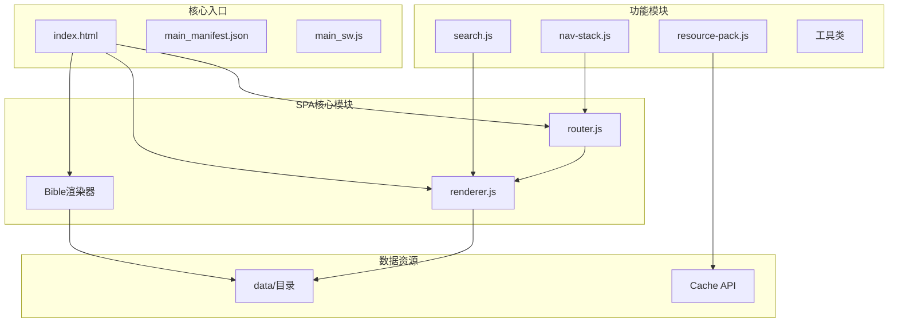

**图表来源**
- [index.html:166-189](file://src/static/index.html#L166-L189)
- [router.js:1-287](file://src/static/js/router.js#L1-L287)
- [renderer.js:1-800](file://src/static/js/renderer.js#L1-L800)

**章节来源**
- [index.html:1-687](file://src/static/index.html#L1-L687)
- [package.json:1-24](file://package.json#L1-L24)

## 核心组件

### 路由系统（Router）

路由系统采用Hash-based的客户端路由，支持多种路由模式：

| 路由类型 | 格式 | 描述 |
|---------|------|------|
| 主页 | `#/` | 书卷导航界面 |
| 圣经阅读 | `#/bible/{book}/{chapter}` | 圣经经文阅读 |
| 图表 | `#/charts` | 统计图表页面 |
| 读经计划 | `#/plan/{id}` | 读经计划管理 |
| 设置 | `#/settings` | 应用设置界面 |

### 渲染引擎（Renderer）

渲染引擎负责将JSON数据转换为HTML界面，支持多种视图类型：

- **纲目视图（cv）**：大纲结构展示
- **听抄视图（h）**：讲章内容展示  
- **详情视图（ts）**：详细内容展示
- **诗歌视图（sg）**：诗歌内容展示
- **职事视图（zs）**：职事信息摘录
- **晨读视图（cx）**：晨兴喂养内容

### 状态管理

应用采用集中式状态管理模式：

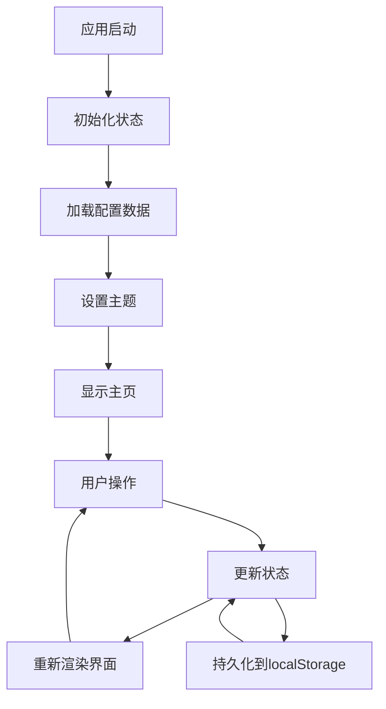

**图表来源**
- [bible-renderer.js:24-68](file://src/static/js/bible-renderer.js#L24-L68)
- [index.html:234-246](file://src/static/index.html#L234-L246)

**章节来源**
- [bible-renderer.js:1-880](file://src/static/js/bible-renderer.js#L1-L880)
- [router.js:1-287](file://src/static/js/router.js#L1-L287)

## 架构概览

### 整体架构设计

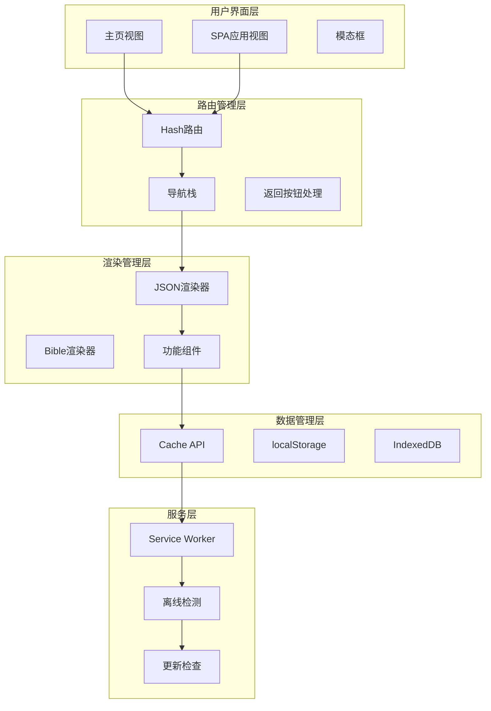

**图表来源**
- [index.html:634-664](file://src/static/index.html#L634-L664)
- [router.js:95-149](file://src/static/js/router.js#L95-L149)
- [renderer.js:14-176](file://src/static/js/renderer.js#L14-L176)

### 数据流架构

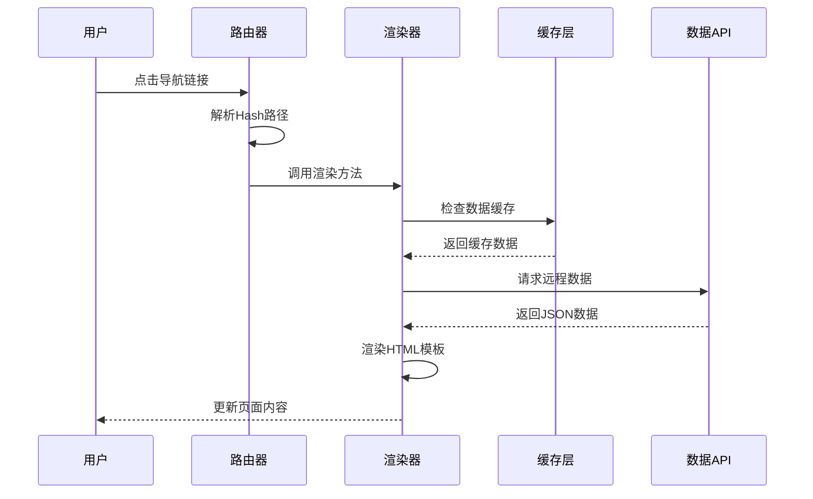

**图表来源**
- [router.js:27-82](file://src/static/js/router.js#L27-L82)
- [renderer.js:49-103](file://src/static/js/renderer.js#L49-L103)

## 详细组件分析

### 路由系统详解

#### Hash路由实现

路由系统采用简洁的Hash-based设计，支持以下特性：

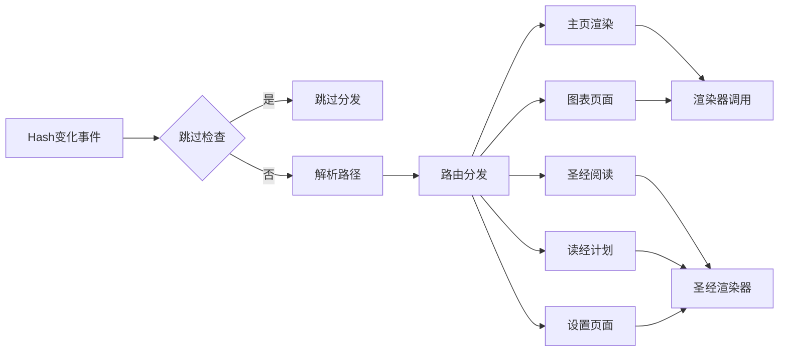

**图表来源**
- [router.js:84-102](file://src/static/js/router.js#L84-L102)
- [router.js:179-200](file://src/static/js/router.js#L179-L200)

#### 返回按钮处理机制

应用实现了复杂的返回按钮处理逻辑，区分不同平台的行为：

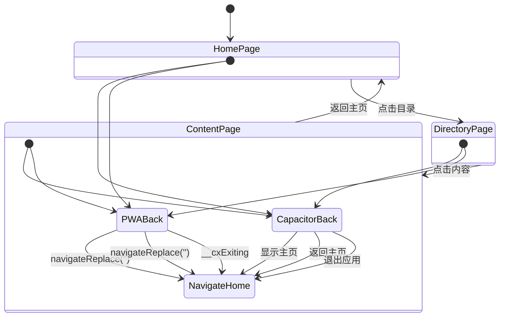

**图表来源**
- [nav-stack.js:76-135](file://src/static/js/nav-stack.js#L76-L135)

**章节来源**
- [router.js:1-287](file://src/static/js/router.js#L1-L287)
- [nav-stack.js:1-455](file://src/static/js/nav-stack.js#L1-L455)

### 渲染引擎深度分析

#### Bible渲染器架构

Bible渲染器是应用的核心渲染组件，负责圣经经文的展示：

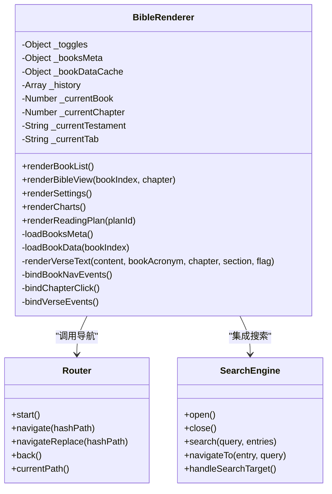

**图表来源**
- [bible-renderer.js:24-68](file://src/static/js/bible-renderer.js#L24-L68)
- [bible-renderer.js:143-399](file://src/static/js/bible-renderer.js#L143-L399)

#### 渲染流程控制

渲染引擎实现了完整的页面渲染生命周期：

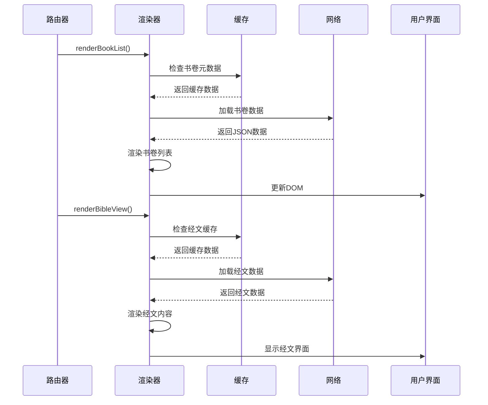

**图表来源**
- [bible-renderer.js:324-399](file://src/static/js/bible-renderer.js#L324-L399)
- [bible-renderer.js:75-106](file://src/static/js/bible-renderer.js#L75-L106)

**章节来源**
- [bible-renderer.js:1-880](file://src/static/js/bible-renderer.js#L1-L880)

### 搜索系统架构

#### 全文搜索引擎

搜索系统提供了强大的全文检索能力：

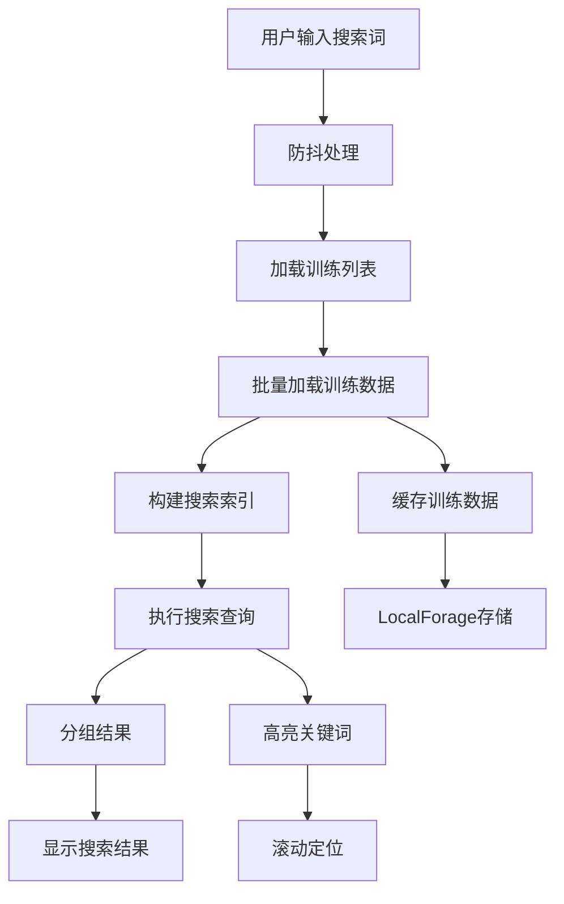

**图表来源**
- [search.js:286-307](file://src/static/js/search.js#L286-L307)
- [search.js:380-461](file://src/static/js/search.js#L380-L461)

#### 搜索索引构建

搜索系统采用懒加载策略，动态构建搜索索引：

| 数据类型 | 索引字段 | 存储位置 |
|---------|---------|----------|
| 听抄内容 | message_content | 内存缓存 |
| 纲目内容 | outline_sections | 内存缓存 |
| 晨读内容 | morning_revivals | 内存缓存 |
| 职事摘录 | ministry_excerpt | 内存缓存 |

**章节来源**
- [search.js:1-1086](file://src/static/js/search.js#L1-L1086)

### 资源包管理系统

#### 历史训练资源包

应用支持历史训练资源包的下载和管理：

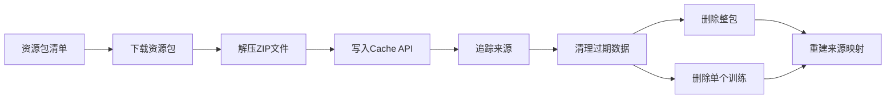

**图表来源**
- [resource-pack.js:217-327](file://src/static/js/resource-pack.js#L217-L327)
- [resource-pack.js:146-169](file://src/static/js/resource-pack.js#L146-L169)

**章节来源**
- [resource-pack.js:1-993](file://src/static/js/resource-pack.js#L1-L993)

## 依赖关系分析

### 模块依赖图

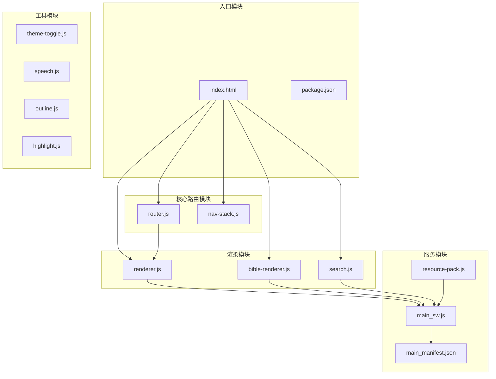

**图表来源**
- [index.html:166-189](file://src/static/index.html#L166-L189)
- [router.js:1-287](file://src/static/js/router.js#L1-L287)
- [renderer.js:1-800](file://src/static/js/renderer.js#L1-L800)

### 外部依赖关系

| 依赖项 | 版本 | 用途 | 说明 |
|-------|------|------|------|
| @capacitor/core | ^6.0.0 | 跨平台框架 | 提供原生功能桥接 |
| @capacitor/app | ^6.0.0 | 应用控制 | 管理应用生命周期 |
| @capacitor/filesystem | ^6.0.0 | 文件系统 | 本地文件操作 |
| @capacitor-community/text-to-speech | ^5.1.0 | 语音合成 | 文本朗读功能 |
| @capacitor/status-bar | ^6.0.3 | 状态栏控制 | 系统状态栏管理 |

**章节来源**
- [package.json:12-22](file://package.json#L12-L22)

## 性能考虑

### 缓存策略

应用采用了多层次的缓存策略：

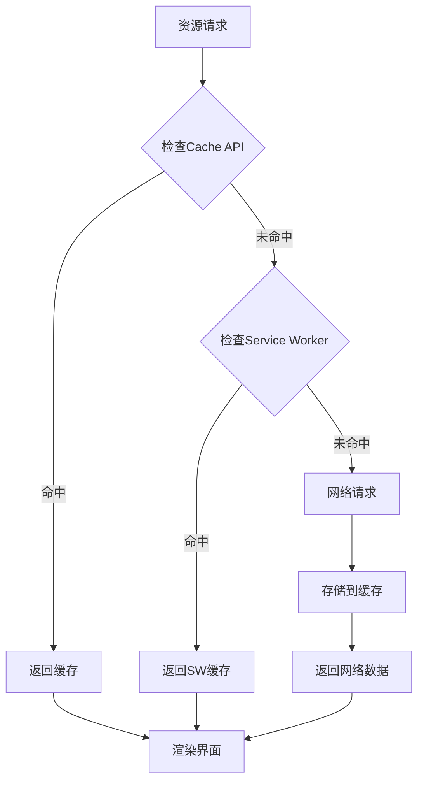

**图表来源**
- [main_sw.js:88-166](file://src/templates/main_sw.js#L88-L166)

### 性能优化措施

1. **懒加载策略**：非关键资源延迟加载
2. **数据分片**：圣经数据按书卷分片缓存
3. **防抖机制**：搜索输入防抖处理
4. **内存管理**：及时清理不需要的DOM元素
5. **增量更新**：只更新变化的部分DOM

### 内存使用优化

| 组件 | 内存占用 | 优化策略 |
|------|----------|----------|
| 书卷元数据 | ~50KB | 缓存到localStorage |
| 经文数据 | ~2-5MB/卷 | 分卷加载，按需缓存 |
| 搜索索引 | ~10-50MB | 懒加载，定期清理 |
| 图片资源 | ~50-200MB | CDN缓存，压缩传输 |

## 故障排除指南

### 常见问题及解决方案

#### 路由跳转问题

**问题症状**：点击链接后页面不更新或出现空白

**诊断步骤**：
1. 检查浏览器控制台是否有JavaScript错误
2. 验证Hash路由是否正确解析
3. 确认渲染器方法是否正确调用

**解决方案**：
```javascript
// 检查路由状态
console.log('当前路径:', window.CXRouter.currentPath());
console.log('路由状态:', window.__cxCurrentPath);

// 强制重新渲染
if (window.CXBible) {
    window.CXBible.renderBookList();
}
```

#### 缓存相关问题

**问题症状**：页面显示过期内容或加载缓慢

**诊断步骤**：
1. 检查Service Worker状态
2. 验证Cache API缓存情况
3. 确认网络连接状态

**解决方案**：
```javascript
// 清理所有缓存
if ('caches' in window) {
    caches.keys().then(keys => {
        keys.forEach(key => caches.delete(key));
    });
}

// 重新加载页面
location.reload();
```

#### 搜索功能异常

**问题症状**：搜索无结果或搜索词无效

**诊断步骤**：
1. 检查搜索索引是否构建完成
2. 验证训练数据是否缓存
3. 确认搜索词格式

**解决方案**：
```javascript
// 重建搜索索引
if (window.CXSearch) {
    window.CXSearch._rebuildSearchQueue().then(() => {
        console.log('搜索索引已重建');
    });
}
```

**章节来源**
- [index.html:369-421](file://src/static/index.html#L369-L421)
- [search.js:738-770](file://src/static/js/search.js#L738-L770)

## 结论

本SPA架构设计充分体现了现代Web应用的最佳实践：

### 架构优势

1. **模块化设计**：清晰的职责分离，便于维护和扩展
2. **性能优化**：多层次缓存策略，提供流畅的用户体验
3. **跨平台兼容**：统一的代码基础，支持Web、PWA和原生应用
4. **可扩展性**：插件化的功能模块，支持功能增强

### 技术亮点

- **智能路由系统**：基于Hash的客户端路由，支持复杂的导航场景
- **高效渲染引擎**：JSON驱动的渲染架构，支持多种视图类型
- **强大的搜索能力**：全文搜索引擎，支持跨训练内容检索
- **完善的缓存机制**：多层缓存策略，确保离线可用性

### 未来发展方向

1. **渐进式增强**：考虑迁移到更现代的前端框架
2. **性能监控**：集成性能监控工具，持续优化用户体验
3. **国际化扩展**：支持更多语言和地区设置
4. **功能扩展**：添加更多阅读辅助功能

该SPA架构为圣经阅读应用提供了坚实的技术基础，能够满足不同用户群体的需求，并为未来的功能扩展奠定了良好的技术基础。