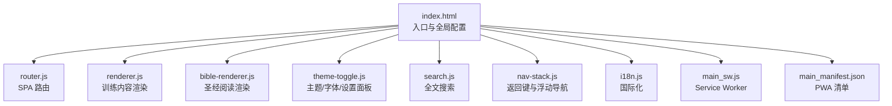
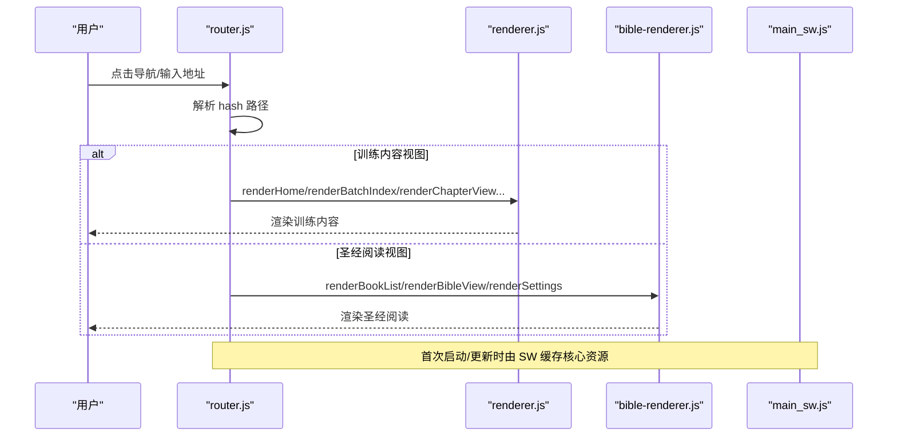
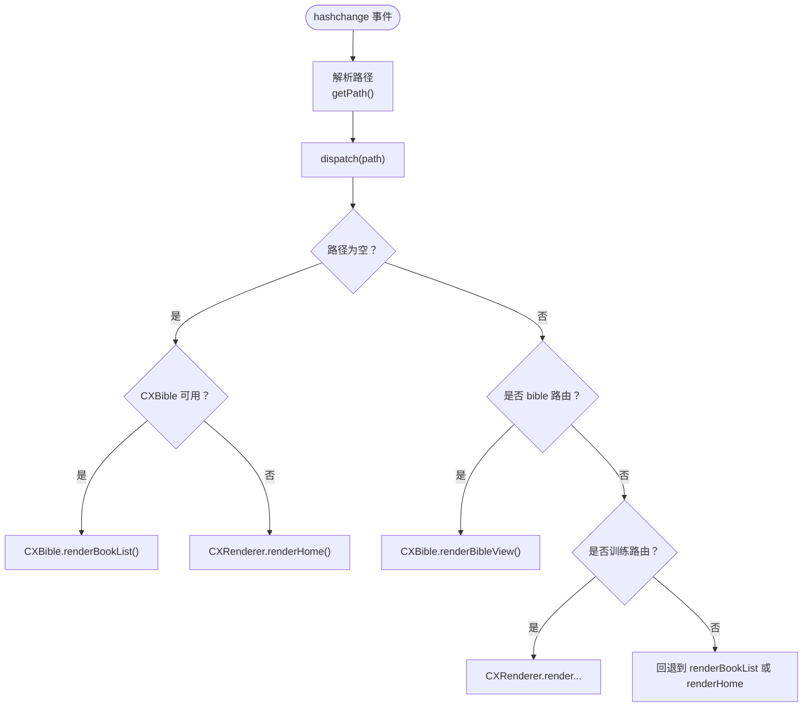
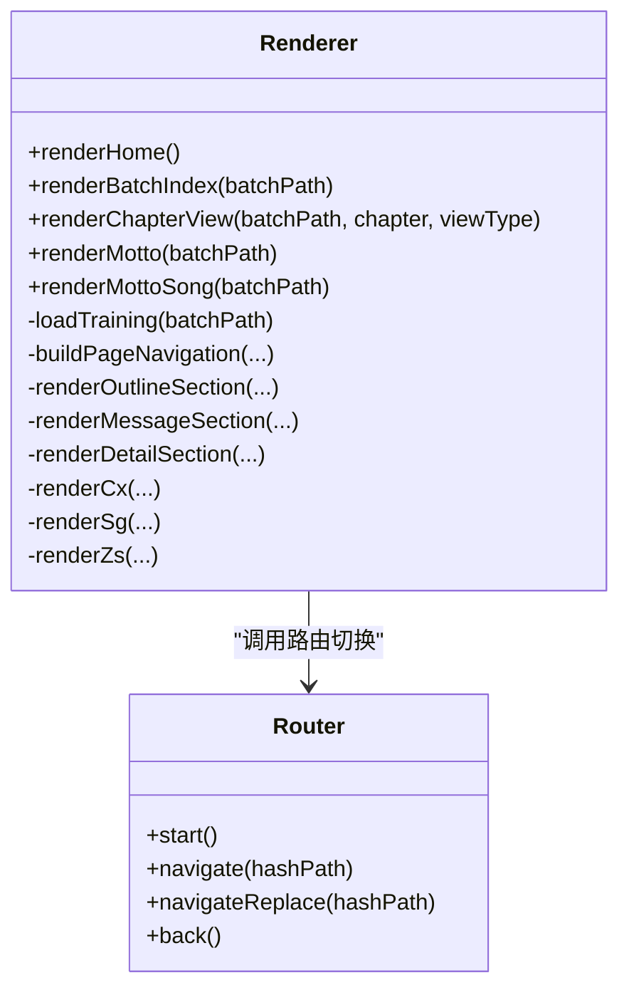
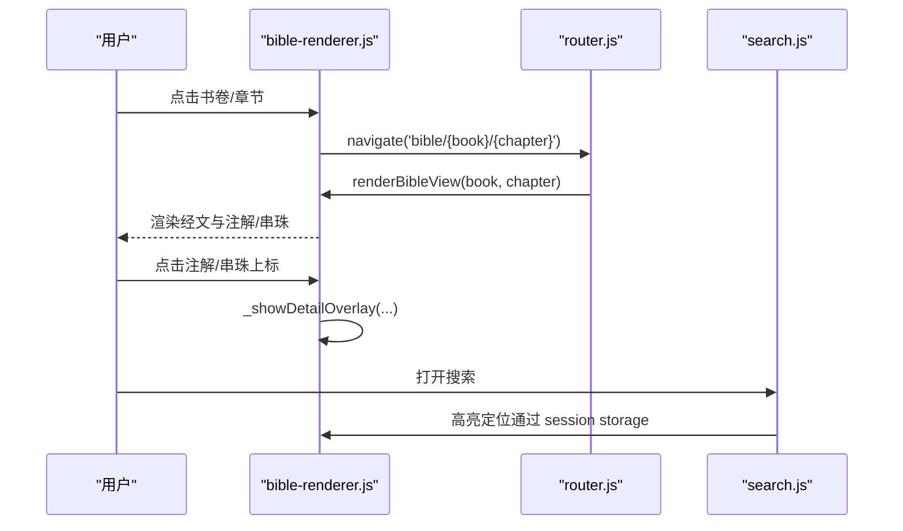
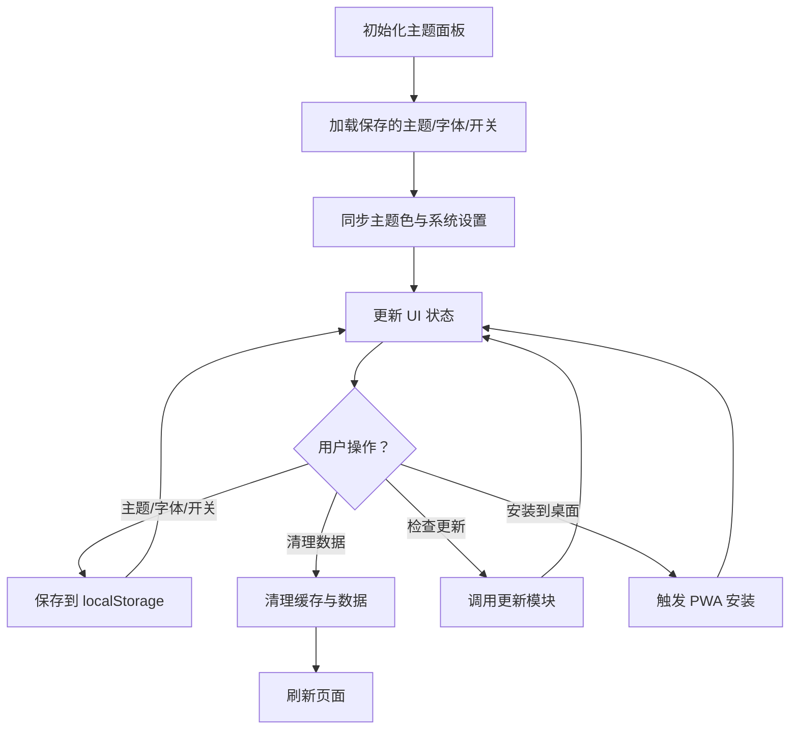
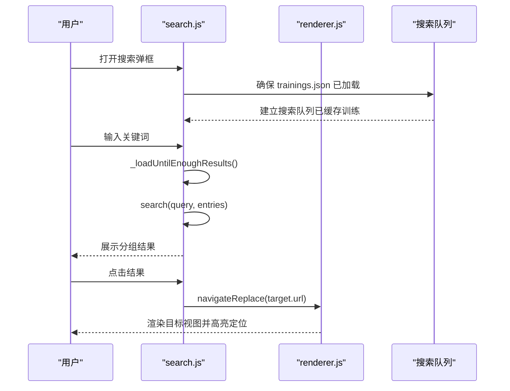
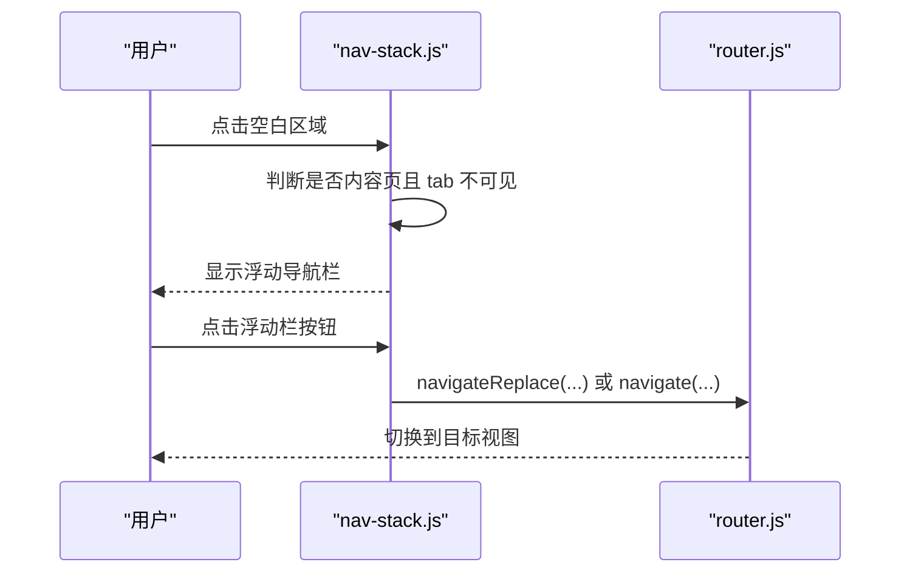
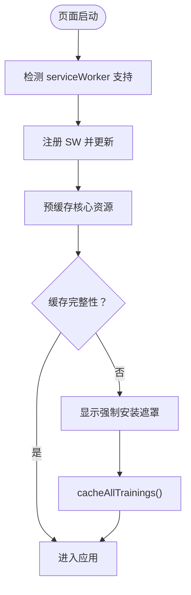
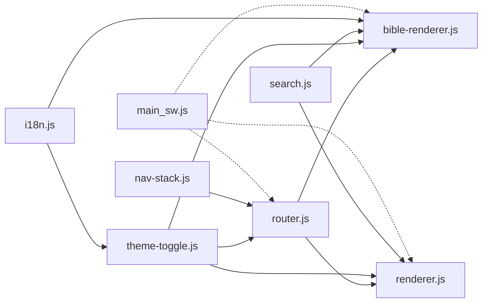

# 前端架构

<cite>
**本文档引用的文件**
- [index.html](file://src/static/index.html)
- [bible-renderer.js](file://src/static/js/bible-renderer.js)
- [router.js](file://src/static/js/router.js)
- [renderer.js](file://src/static/js/renderer.js)
- [theme-toggle.js](file://src/static/js/theme-toggle.js)
- [search.js](file://src/static/js/search.js)
- [nav-stack.js](file://src/static/js/nav-stack.js)
- [i18n.js](file://src/static/js/i18n.js)
- [main_sw.js](file://src/templates/main_sw.js)
- [main_manifest.json](file://src/templates/main_manifest.json)
</cite>

## 目录
1. [引言](#引言)
2. [项目结构](#项目结构)
3. [核心组件](#核心组件)
4. [架构总览](#架构总览)
5. [详细组件分析](#详细组件分析)
6. [依赖关系分析](#依赖关系分析)
7. [性能考虑](#性能考虑)
8. [故障排除指南](#故障排除指南)
9. [结论](#结论)
10. [附录](#附录)

## 引言
本文件面向圣经阅读器前端架构，系统阐述基于单页应用（SPA）的模块化设计与实现，涵盖渲染引擎、路由系统、PWA 缓存策略、国际化、主题与字体控制、搜索与导航栈等模块的职责与协作方式。文档同时提供可视化架构图、流程图与最佳实践建议，帮助开发者快速理解与维护系统。

## 项目结构
前端采用“HTML + 模块化 JavaScript + 静态资源”的组织方式：
- HTML 入口负责页面骨架、主题色初始化、PWA 注册、全局变量与启动流程
- 模块化 JS 以 IIFE 形式封装功能，通过 window 暴露 API 供其他模块调用
- PWA 相关资源位于 templates 目录，包含 Service Worker 与 Manifest

**图表来源**
- [index.html:1-687](file://src/static/index.html#L1-L687)
- [router.js:1-287](file://src/static/js/router.js#L1-L287)
- [renderer.js:1-800](file://src/static/js/renderer.js#L1-L800)
- [bible-renderer.js:1-880](file://src/static/js/bible-renderer.js#L1-L880)
- [theme-toggle.js:1-1353](file://src/static/js/theme-toggle.js#L1-L1353)
- [search.js:1-1086](file://src/static/js/search.js#L1-L1086)
- [nav-stack.js:1-455](file://src/static/js/nav-stack.js#L1-L455)
- [i18n.js:1-351](file://src/static/js/i18n.js#L1-L351)
- [main_sw.js:1-270](file://src/templates/main_sw.js#L1-L270)
- [main_manifest.json:1-26](file://src/templates/main_manifest.json#L1-L26)

**章节来源**
- [index.html:1-687](file://src/static/index.html#L1-L687)
- [main_sw.js:1-270](file://src/templates/main_sw.js#L1-L270)
- [main_manifest.json:1-26](file://src/templates/main_manifest.json#L1-L26)

## 核心组件
- SPA 路由系统：负责 hash 路由解析与视图切换，兼容两类渲染器（训练内容与圣经阅读）
- 渲染引擎：
  - renderer.js：训练内容（纲目、听抄、详情、诗歌、职事、晨读）的统一渲染
  - bible-renderer.js：圣经书卷导航、章节阅读、注解/串珠弹层
- 主题与字体：主题面板、字体大小、内容显示开关、深色模式适配
- 搜索：全文检索、索引懒加载、跨训练分组、高亮定位
- 导航栈：原生与 PWA 的返回键处理、浮动导航栏与朗读控制栏
- 国际化：多语言文案、语言切换、章节号格式化
- PWA：Service Worker 缓存策略、Manifest、离线提示与强制安装遮罩

**章节来源**
- [router.js:1-287](file://src/static/js/router.js#L1-L287)
- [renderer.js:1-800](file://src/static/js/renderer.js#L1-L800)
- [bible-renderer.js:1-880](file://src/static/js/bible-renderer.js#L1-L880)
- [theme-toggle.js:1-1353](file://src/static/js/theme-toggle.js#L1-L1353)
- [search.js:1-1086](file://src/static/js/search.js#L1-L1086)
- [nav-stack.js:1-455](file://src/static/js/nav-stack.js#L1-L455)
- [i18n.js:1-351](file://src/static/js/i18n.js#L1-L351)

## 架构总览
SPA 以 index.html 为根，通过 window.CXRouter 统一路由，根据路径选择调用 renderer.js 或 bible-renderer.js 的渲染方法。PWA 通过 Service Worker 实现离线缓存与版本管理，配合 Manifest 提升安装体验。

**图表来源**
- [router.js:1-287](file://src/static/js/router.js#L1-L287)
- [renderer.js:1-800](file://src/static/js/renderer.js#L1-L800)
- [bible-renderer.js:1-880](file://src/static/js/bible-renderer.js#L1-L880)
- [main_sw.js:1-270](file://src/templates/main_sw.js#L1-L270)

## 详细组件分析

### SPA 路由系统（router.js）
- 路由格式
  - 主页：#/ 或 #/
  - 圣经阅读：#/bible/{book}/{chapter}
  - 训练内容：#/batch/{path}、#/batch/{path}/{chapter}/{view}
  - 设置：#/settings
- 核心能力
  - start()/navigate()/navigateReplace()/back()
  - 同书卷章节切换使用 replaceState，避免历史膨胀
  - 同章节视图切换（cv↔h↔cx↔sg↔zs）使用 replaceState，返回键逐级跳转
  - 跳过 ghost history 条目，兼容 Android Chrome PWA 的 popstate 伪事件
- 与渲染器协作
  - 优先调用 window.CXBible（圣经渲染器），否则回退到 window.CXRenderer（训练渲染器）

**图表来源**
- [router.js:27-82](file://src/static/js/router.js#L27-L82)

**章节来源**
- [router.js:1-287](file://src/static/js/router.js#L1-L287)

### 渲染引擎（renderer.js）
- 统一渲染训练内容的 JSON→HTML 渲染器，兼容多视图：
  - cv（纲目）、h（听抄）、ts（详情）、sg（诗歌）、zs（职事）、cx（晨读）
- 关键特性
  - 从 training.json 懒加载并缓存，支持本地导入训练
  - 引用扫描与包裹（scripture-ref），支持跨章节引用
  - 晨读（cx）支持按日翻页，手势与键盘支持
  - 底部控制栏与浮动朗读栏同步，支持进度、速率与播放控制
- 与路由协作
  - 通过 window.CXRouter.navigate/navigateReplace 切换视图
  - 与搜索模块协同，支持高亮定位

**图表来源**
- [renderer.js:1-800](file://src/static/js/renderer.js#L1-L800)
- [router.js:1-287](file://src/static/js/router.js#L1-L287)

**章节来源**
- [renderer.js:1-800](file://src/static/js/renderer.js#L1-L800)

### 圣经阅读渲染器（bible-renderer.js）
- 书卷导航与章节列表
  - 三标签页：书卷/收藏/历史
  - 旧约/新约切换
  - 搜索栏集成
- 经文阅读视图
  - 主题摘要、纲目占位
  - 注解与串珠内联显示与弹层
  - 经节分割线、上下半节标记
- 设置面板
  - 阅读主题（5 种）、字号滑块、内容显示开关
  - 主题色同步与 meta theme-color 更新
- 与路由协作
  - 通过 router.js 导航到圣经阅读视图
  - 与搜索模块联动，支持引用高亮

**图表来源**
- [bible-renderer.js:143-399](file://src/static/js/bible-renderer.js#L143-L399)
- [router.js:44-50](file://src/static/js/router.js#L44-L50)
- [search.js:487-512](file://src/static/js/search.js#L487-L512)

**章节来源**
- [bible-renderer.js:1-880](file://src/static/js/bible-renderer.js#L1-L880)
- [search.js:1-1086](file://src/static/js/search.js#L1-L1086)

### 主题与字体控制（theme-toggle.js）
- 主题面板
  - 5 种阅读主题、字体大小、朗读速度
  - 内容显示开关（与 bible-renderer.js 共享 localStorage）
  - 深色主题自动适配系统深浅色
- 数据与错误日志
  - 笔记备份/恢复守卫
  - 错误日志收集与清理
  - 原生崩溃日志（APK 专用）
- 返回键与对话框
  - backStack 统一返回键调度
  - 对话框/弹层滚动锁定
- 设置面板操作区
  - 清理数据、检查更新、安装到桌面、使用说明、反馈问题、赞助

**图表来源**
- [theme-toggle.js:288-800](file://src/static/js/theme-toggle.js#L288-L800)

**章节来源**
- [theme-toggle.js:1-1353](file://src/static/js/theme-toggle.js#L1-L1353)

### 全文搜索（search.js）
- 索引构建
  - 从 training.json 提取纲目、听抄、晨读、职事等段落
  - 本地缓存（内存 + localforage），支持版本校验
- 搜索算法
  - 多关键词 AND 子串匹配，按训练分组显示
  - 本训练优先，本篇条目优先
- 高亮定位
  - SPA 与非 SPA 两套定位逻辑，支持 cx 视图按 day_index 精确定位
  - 使用 sessionStorage 传递目标位置，渲染完成后滚动并高亮

**图表来源**
- [search.js:180-800](file://src/static/js/search.js#L180-L800)
- [renderer.js:1-800](file://src/static/js/renderer.js#L1-L800)

**章节来源**
- [search.js:1-1086](file://src/static/js/search.js#L1-L1086)

### 导航栈与浮动导航（nav-stack.js）
- 返回键处理
  - Capacitor：backButton 事件，按层级显式跳转
  - PWA：popstate 事件，fallback 统一处理，忽略启动期虚假事件
- 浮动导航栏
  - 内容页滚动隐藏/显示，空白区域点击触发
  - 克隆 .page-navigation 与底部控制栏，支持交互同步
- 与路由协作
  - 通过 window.CXRouter.navigate/navigateReplace 控制层级跳转

**图表来源**
- [nav-stack.js:160-455](file://src/static/js/nav-stack.js#L160-L455)
- [router.js:104-142](file://src/static/js/router.js#L104-L142)

**章节来源**
- [nav-stack.js:1-455](file://src/static/js/nav-stack.js#L1-L455)

### 国际化（i18n.js）
- 多语言文案：简体中文、英语
- 语言切换：保存到 localStorage，触发渲染器刷新
- 章节号格式化：中文数字与英文 Chapter

**章节来源**
- [i18n.js:1-351](file://src/static/js/i18n.js#L1-L351)

### PWA 架构（Service Worker 与 Manifest）
- Service Worker（main_sw.js）
  - 安装阶段预缓存核心资源
  - 缓存策略：版本文件 network-first，圣经数据 cache-first，其他 cache-first + network fallback
  - 支持批量缓存 66 卷圣经、清理缓存、查询缓存状态
- Manifest（main_manifest.json）
  - standalone 显示模式、图标、主题色、分类
- 前端集成
  - 注册 SW、离线横幅、强制安装遮罩、缓存完整性校验与一键缓存
  - 与 nav-stack.js 协作，处理返回键与页面记忆

**图表来源**
- [main_sw.js:25-36](file://src/templates/main_sw.js#L25-L36)
- [index.html:557-595](file://src/static/index.html#L557-L595)

**章节来源**
- [main_sw.js:1-270](file://src/templates/main_sw.js#L1-L270)
- [main_manifest.json:1-26](file://src/templates/main_manifest.json#L1-L26)
- [index.html:522-595](file://src/static/index.html#L522-L595)

## 依赖关系分析
- 模块耦合
  - router.js 作为中枢，依赖 renderer.js 与 bible-renderer.js 的渲染 API
  - theme-toggle.js 与 search.js 通过 window 暴露的全局 API 交互
  - nav-stack.js 依赖 router.js 的层级跳转与 backStack
- 外部依赖
  - PWA：Service Worker、Cache Storage、IndexedDB（localforage）
  - 原生：Capacitor WebView（APK 环境）

**图表来源**
- [router.js:1-287](file://src/static/js/router.js#L1-L287)
- [renderer.js:1-800](file://src/static/js/renderer.js#L1-L800)
- [bible-renderer.js:1-880](file://src/static/js/bible-renderer.js#L1-L880)
- [theme-toggle.js:1-1353](file://src/static/js/theme-toggle.js#L1-L1353)
- [search.js:1-1086](file://src/static/js/search.js#L1-L1086)
- [nav-stack.js:1-455](file://src/static/js/nav-stack.js#L1-L455)
- [i18n.js:1-351](file://src/static/js/i18n.js#L1-L351)
- [main_sw.js:1-270](file://src/templates/main_sw.js#L1-L270)

**章节来源**
- [router.js:1-287](file://src/static/js/router.js#L1-L287)
- [renderer.js:1-800](file://src/static/js/renderer.js#L1-L800)
- [bible-renderer.js:1-880](file://src/static/js/bible-renderer.js#L1-L880)
- [theme-toggle.js:1-1353](file://src/static/js/theme-toggle.js#L1-L1353)
- [search.js:1-1086](file://src/static/js/search.js#L1-L1086)
- [nav-stack.js:1-455](file://src/static/js/nav-stack.js#L1-L455)
- [i18n.js:1-351](file://src/static/js/i18n.js#L1-L351)
- [main_sw.js:1-270](file://src/templates/main_sw.js#L1-L270)

## 性能考虑
- 渲染性能
  - renderer.js 与 bible-renderer.js 采用惰性渲染与缓存（training.json、书卷元数据）
  - 晨读（cx）使用 transform 横滑，减少 DOM 重建
- 网络与缓存
  - SW 采用 cache-first + network fallback，离线可用
  - 预缓存核心资源，首屏更快
- 交互体验
  - 浮动导航栏与朗读栏减少滚动与点击成本
  - 高亮定位延迟触发，避免阻塞首屏渲染

[本节为通用指导，无需特定文件引用]

## 故障排除指南
- PWA 缓存问题
  - 使用 verifyCacheIntegrity() 检查缓存完整性
  - 通过 showMandatoryInstallDialog() 强制安装/更新缓存
  - 清理缓存：cacheAllTrainings() 或清理所有缓存
- 返回键异常
  - 检查 nav-stack.js 的 fallback 与 skipNext 逻辑
  - 确认 router.js 的 navigateReplace 与 ghost entry 处理
- 搜索无结果
  - 确认搜索队列已重建（_rebuildSearchQueue）
  - 检查本地缓存（localforage）与 SW 缓存键是否存在
- 主题/字体不同步
  - 检查 theme-toggle.js 的 localStorage 与 meta theme-color 更新
  - 确认深色模式媒体查询与 StatusBar 插件调用

**章节来源**
- [index.html:454-521](file://src/static/index.html#L454-L521)
- [nav-stack.js:16-55](file://src/static/js/nav-stack.js#L16-L55)
- [search.js:189-244](file://src/static/js/search.js#L189-L244)
- [theme-toggle.js:360-410](file://src/static/js/theme-toggle.js#L360-L410)

## 结论
该前端架构以模块化与 SPA 为核心，通过清晰的路由与渲染器分离，实现了训练内容与圣经阅读的统一体验。配合 PWA 的缓存策略与 Manifest，显著提升了离线可用性与安装体验。主题、搜索、导航栈与国际化模块进一步增强了可用性与可维护性。建议持续关注缓存策略与首屏性能优化，以提升用户体验。

## 附录
- 组件间通信机制
  - 通过 window 暴露的全局 API（如 CXRouter、CXBible、CXRenderer、CXSearch、CX.backStack）进行松耦合调用
- 事件处理模式
  - hashchange、popstate、backButton 等事件统一由 router.js 与 nav-stack.js 处理
- 状态管理策略
  - localStorage 用于主题、字体、内容开关、语言等持久化状态
  - sessionStorage 用于搜索定位桥接与临时状态
- 最佳实践
  - 优先使用 replaceState 进行同层级视图切换，避免历史膨胀
  - 对长列表与复杂渲染采用惰性加载与缓存
  - 在 PWA 环境下充分利用 SW 缓存，提供离线体验

[本节为概念性总结，无需特定文件引用]