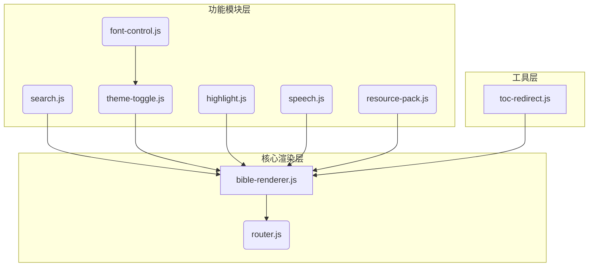
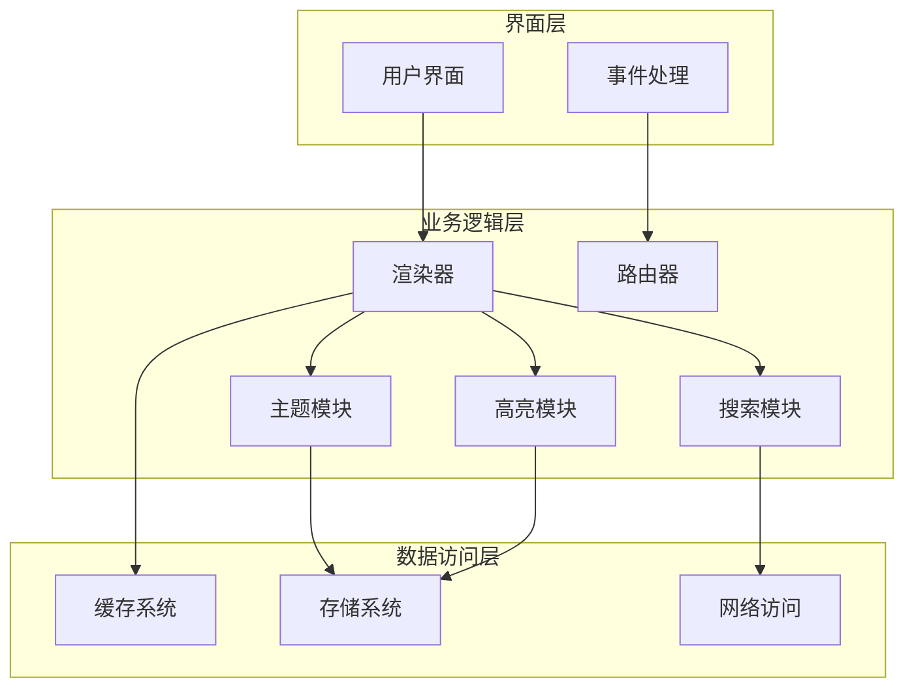
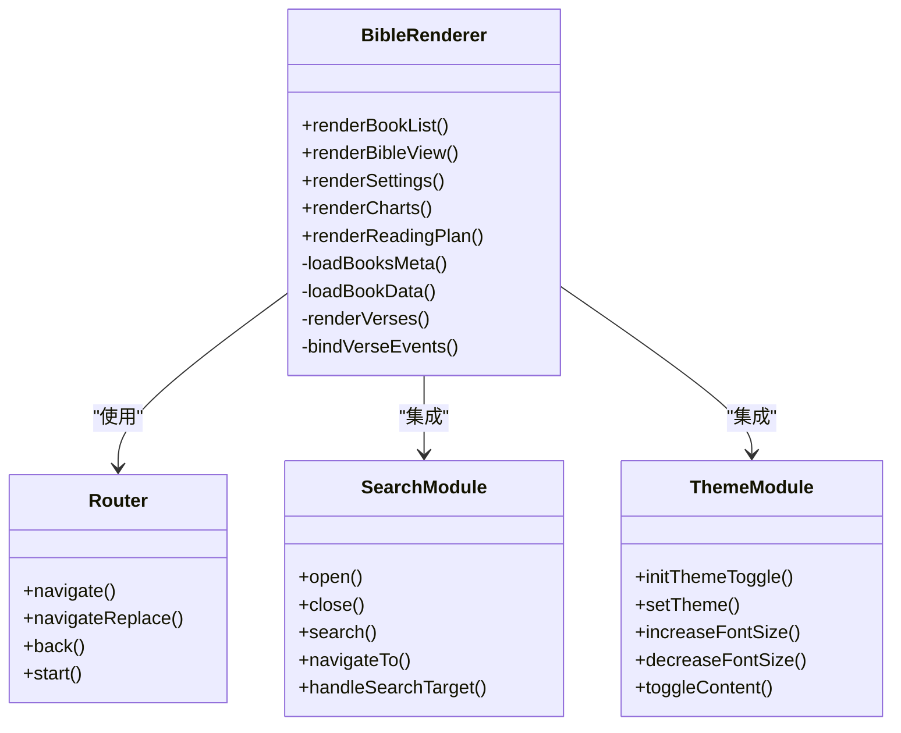
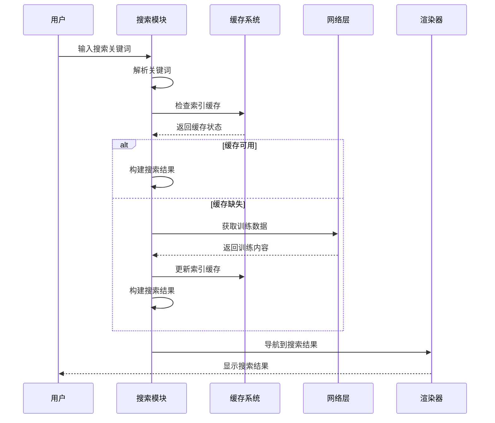
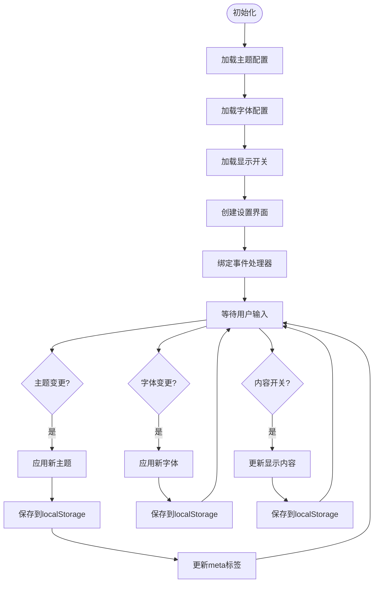
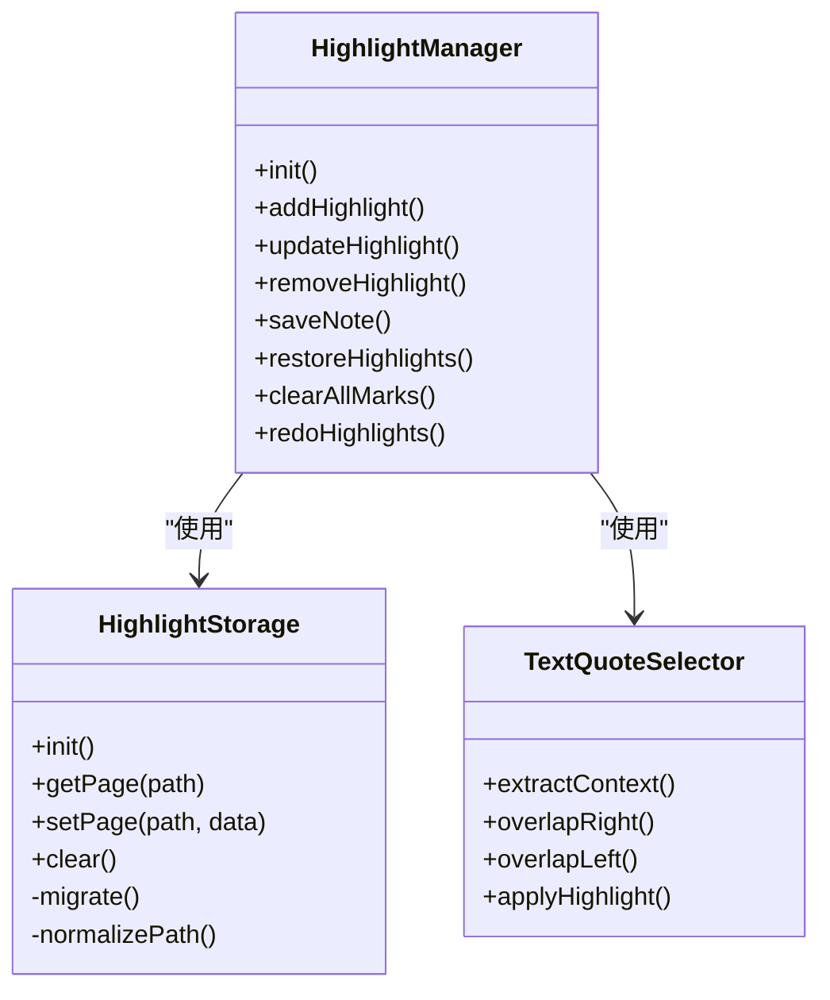
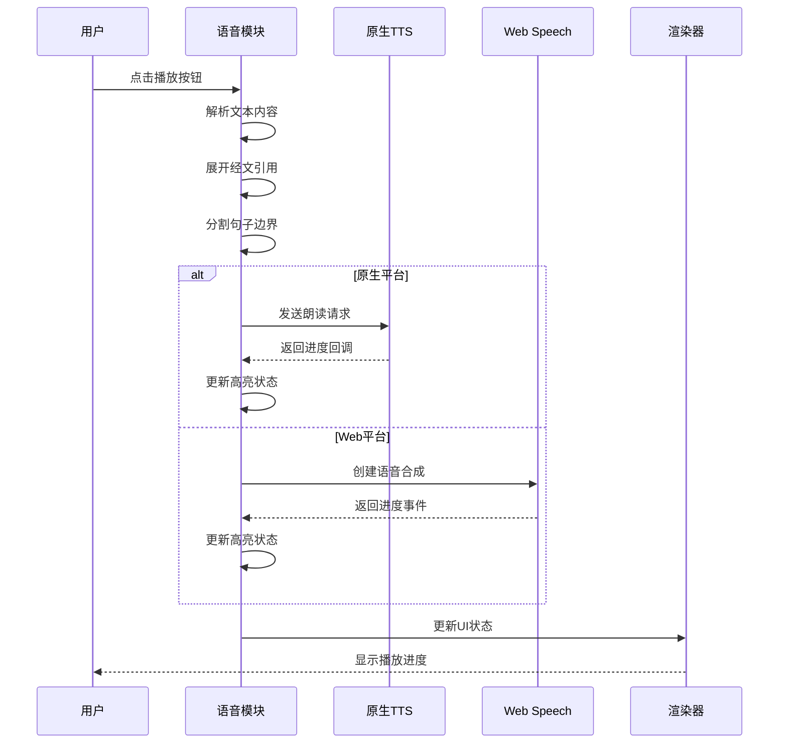
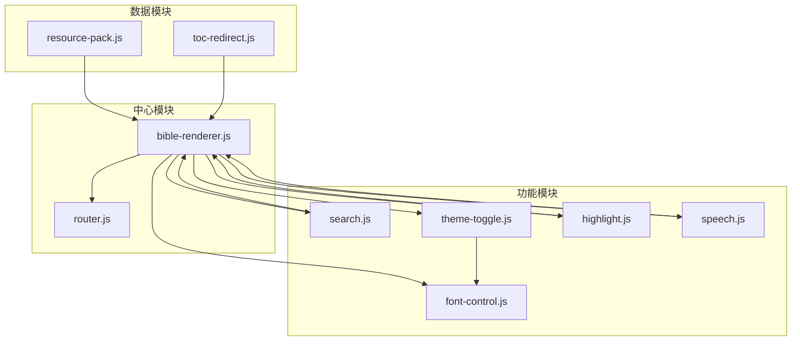

# 模块化系统

<cite>
**本文档引用的文件**
- [bible-renderer.js](file://src/static/js/bible-renderer.js)
- [search.js](file://src/static/js/search.js)
- [theme-toggle.js](file://src/static/js/theme-toggle.js)
- [font-control.js](file://src/static/js/font-control.js)
- [router.js](file://src/static/js/router.js)
- [highlight.js](file://src/static/js/highlight.js)
- [speech.js](file://src/static/js/speech.js)
- [resource-pack.js](file://src/static/js/resource-pack.js)
- [toc-redirect.js](file://src/static/js/toc-redirect.js)
</cite>

## 目录
1. [项目概述](#项目概述)
2. [项目结构](#项目结构)
3. [核心组件](#核心组件)
4. [架构概览](#架构概览)
5. [详细组件分析](#详细组件分析)
6. [依赖关系分析](#依赖关系分析)
7. [性能考虑](#性能考虑)
8. [故障排除指南](#故障排除指南)
9. [结论](#结论)

## 项目概述

这是一个采用模块化设计的JavaScript系统，专注于圣经阅读和特会信息合集的展示与交互。系统采用了清晰的模块分离策略，每个功能模块都有明确的职责边界和接口设计。

### 系统特点
- **模块化架构**：每个功能独立封装为模块，便于维护和扩展
- **事件驱动通信**：通过全局对象和事件机制实现模块间通信
- **配置驱动**：支持主题、字体、显示内容等个性化配置
- **缓存优化**：多层缓存策略提升性能和离线体验

## 项目结构

系统采用按功能分组的模块化组织方式：

**图表来源**
- [bible-renderer.js:1-880](file://src/static/js/bible-renderer.js#L1-L880)
- [router.js:1-287](file://src/static/js/router.js#L1-L287)

### 文件组织结构
- **核心渲染器**：负责主要界面渲染和内容展示
- **功能模块**：独立的功能特性，如搜索、主题切换等
- **工具模块**：辅助功能和实用工具
- **路由系统**：管理页面导航和状态

**章节来源**
- [bible-renderer.js:1-880](file://src/static/js/bible-renderer.js#L1-L880)
- [router.js:1-287](file://src/static/js/router.js#L1-L287)

## 核心组件

### 主渲染器 (bible-renderer.js)
主渲染器是整个系统的核心，负责：
- 圣经书卷和章节的导航展示
- 经文内容的渲染和格式化
- 用户界面的状态管理和事件处理
- 与搜索、主题等功能模块的集成

### 路由系统 (router.js)
提供SPA路由支持，管理页面导航：
- Hash路由解析和分发
- 页面状态管理和历史记录
- 与渲染器的协作机制

### 搜索模块 (search.js)
实现全文搜索功能：
- 训练内容的索引和缓存
- 搜索结果的分组和排序
- 结果高亮和定位

**章节来源**
- [bible-renderer.js:1-880](file://src/static/js/bible-renderer.js#L1-L880)
- [router.js:1-287](file://src/static/js/router.js#L1-L287)
- [search.js:1-1086](file://src/static/js/search.js#L1-L1086)

## 架构概览

系统采用分层架构设计，各层职责清晰：

**图表来源**
- [bible-renderer.js:1-880](file://src/static/js/bible-renderer.js#L1-L880)
- [theme-toggle.js:1-1353](file://src/static/js/theme-toggle.js#L1-L1353)
- [highlight.js:1-1335](file://src/static/js/highlight.js#L1-L1335)

### 模块间通信机制

系统通过以下几种方式实现模块间通信：

1. **全局对象访问**：各模块通过window对象暴露的全局API进行交互
2. **事件驱动**：使用DOM事件和自定义事件实现松耦合通信
3. **回调函数**：通过回调机制实现异步数据传递
4. **状态共享**：利用localStorage等持久化存储共享状态

**章节来源**
- [bible-renderer.js:1-880](file://src/static/js/bible-renderer.js#L1-L880)
- [theme-toggle.js:1-1353](file://src/static/js/theme-toggle.js#L1-L1353)

## 详细组件分析

### 主渲染器组件分析

**图表来源**
- [bible-renderer.js:1-880](file://src/static/js/bible-renderer.js#L1-L880)
- [router.js:1-287](file://src/static/js/router.js#L1-L287)
- [search.js:1-1086](file://src/static/js/search.js#L1-L1086)
- [theme-toggle.js:1-1353](file://src/static/js/theme-toggle.js#L1-L1353)

#### 主渲染器核心功能

**书卷导航渲染**
- 双栏布局设计，左侧书卷列表，右侧章节列表
- 支持旧约/新约标签页切换
- 历史记录和收藏功能预留

**经文渲染机制**
- 动态内容加载和缓存
- 注解和串珠的交互式显示
- 经文文本的格式化处理

**设置面板管理**
- 主题选择和切换
- 字体大小调节
- 显示内容的开关控制

**章节来源**
- [bible-renderer.js:140-800](file://src/static/js/bible-renderer.js#L140-L800)

### 搜索模块详细分析

**图表来源**
- [search.js:1-1086](file://src/static/js/search.js#L1-L1086)

#### 搜索模块特性

**智能索引管理**
- 训练内容的懒加载索引
- 多层缓存策略（内存、localforage、SW缓存）
- 资源包下载后的索引重建

**搜索算法优化**
- 多关键词AND匹配
- 结果分组和排序
- 上下文高亮显示

**章节来源**
- [search.js:178-462](file://src/static/js/search.js#L178-L462)

### 主题切换模块分析

**图表来源**
- [theme-toggle.js:285-800](file://src/static/js/theme-toggle.js#L285-L800)

#### 主题模块功能特性

**多主题支持**
- 5种预设阅读主题
- 自动跟随系统深浅色模式
- 状态栏颜色同步

**字体控制**
- 5级字体大小调节
- 全局字体应用
- 与底部控制栏集成

**内容显示控制**
- 可配置的显示内容开关
- 与渲染器状态同步
- 本地持久化存储

**章节来源**
- [theme-toggle.js:1-1353](file://src/static/js/theme-toggle.js#L1-L1353)

### 高亮模块详细分析

**图表来源**
- [highlight.js:1-1335](file://src/static/js/highlight.js#L1-L1335)

#### 高亮模块核心功能

**存储系统**
- IndexedDB + localStorage双重存储
- 自动数据迁移和自愈
- 跨页面数据同步

**文本选择和定位**
- 精确的文本节点定位
- TextQuoteSelector算法
- 偏移量自愈机制

**跨页面同步**
- 纲目↔晨读页面同步
- 配对页面数据合并
- 实时同步更新

**章节来源**
- [highlight.js:1-1335](file://src/static/js/highlight.js#L1-L1335)

### 语音朗读模块分析

**图表来源**
- [speech.js:1-1134](file://src/static/js/speech.js#L1-L1134)

#### 语音模块特性

**多引擎支持**
- 原生TTS服务（Android APK）
- Web Speech API回退
- 自动引擎检测和切换

**文本处理**
- 经文引用展开
- 文本过滤和标准化
- 句子级分割

**进度控制**
- 精确的播放进度
- 句子级高亮显示
- 循环播放支持

**章节来源**
- [speech.js:1-1134](file://src/static/js/speech.js#L1-L1134)

## 依赖关系分析

系统模块间的依赖关系呈现星型拓扑结构：

**图表来源**
- [bible-renderer.js:1-880](file://src/static/js/bible-renderer.js#L1-L880)
- [router.js:1-287](file://src/static/js/router.js#L1-L287)

### 依赖层次分析

**核心依赖链**
1. **渲染器层**：bible-renderer.js为核心
2. **路由层**：router.js提供导航支持
3. **功能层**：各功能模块围绕核心提供特性
4. **数据层**：缓存和存储系统支撑

**耦合度评估**
- **低耦合**：模块间通过接口交互
- **高内聚**：每个模块专注单一功能
- **可替换性**：模块可独立替换和升级

**章节来源**
- [bible-renderer.js:1-880](file://src/static/js/bible-renderer.js#L1-L880)
- [router.js:1-287](file://src/static/js/router.js#L1-L287)

## 性能考虑

### 缓存策略
系统采用多层缓存机制：
- **内存缓存**：最近使用的数据
- **IndexedDB缓存**：持久化存储
- **Service Worker缓存**：离线访问
- **localStorage缓存**：配置和状态

### 异步加载
- 模块按需加载，减少初始启动时间
- 大数据分批处理，避免阻塞主线程
- 异步索引构建，不影响用户体验

### 事件优化
- 事件委托减少事件处理器数量
- 防抖和节流优化高频事件
- 懒加载策略提升响应速度

## 故障排除指南

### 常见问题诊断

**模块加载失败**
- 检查全局对象是否正确初始化
- 验证模块依赖关系
- 查看控制台错误信息

**数据同步问题**
- 检查localStorage权限
- 验证IndexedDB可用性
- 确认缓存一致性

**性能问题**
- 监控内存使用情况
- 检查缓存命中率
- 优化大数据处理逻辑

### 调试建议

**开发调试**
- 使用浏览器开发者工具
- 监控网络请求和缓存行为
- 检查模块间通信状态

**生产监控**
- 收集错误日志
- 监控性能指标
- 收集用户反馈

**章节来源**
- [theme-toggle.js:59-126](file://src/static/js/theme-toggle.js#L59-L126)
- [highlight.js:1-800](file://src/static/js/highlight.js#L1-L800)

## 结论

该模块化JavaScript系统展现了良好的架构设计和工程实践：

### 设计优势
- **清晰的职责分离**：每个模块专注单一功能
- **灵活的扩展性**：模块可独立开发和部署
- **强大的互操作性**：通过标准接口实现模块通信
- **优秀的用户体验**：流畅的交互和响应性能

### 技术亮点
- **多引擎支持**：原生和Web技术的有机结合
- **智能缓存**：多层次缓存策略提升性能
- **数据同步**：跨页面数据的一致性保障
- **错误处理**：完善的异常处理和恢复机制

### 改进建议
- **模块化测试**：增加单元测试和集成测试
- **文档完善**：补充API文档和使用示例
- **性能监控**：建立完整的性能监控体系
- **安全加固**：加强数据验证和安全防护

该系统为类似内容展示和交互应用提供了优秀的参考架构，其模块化设计理念和实现方式值得借鉴和学习。