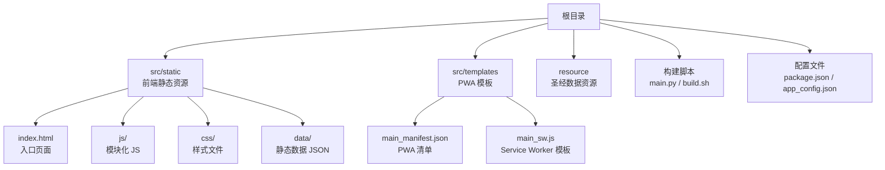
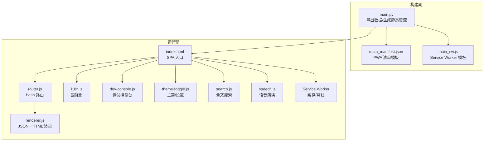
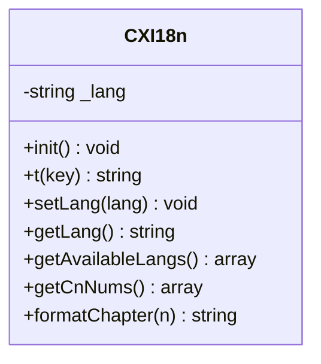
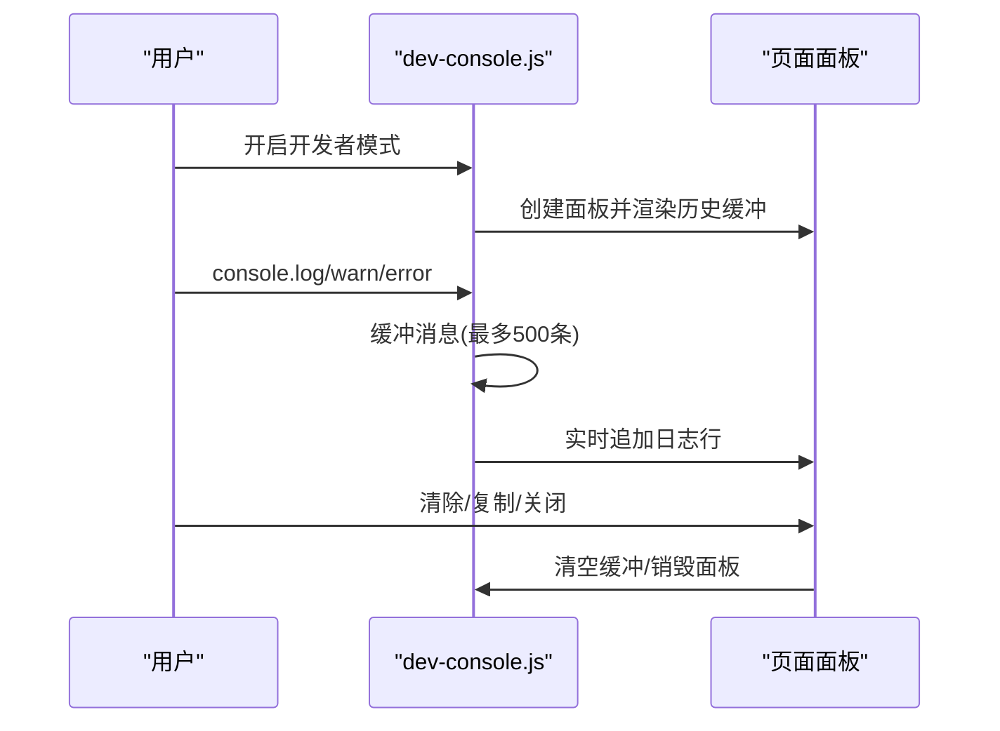
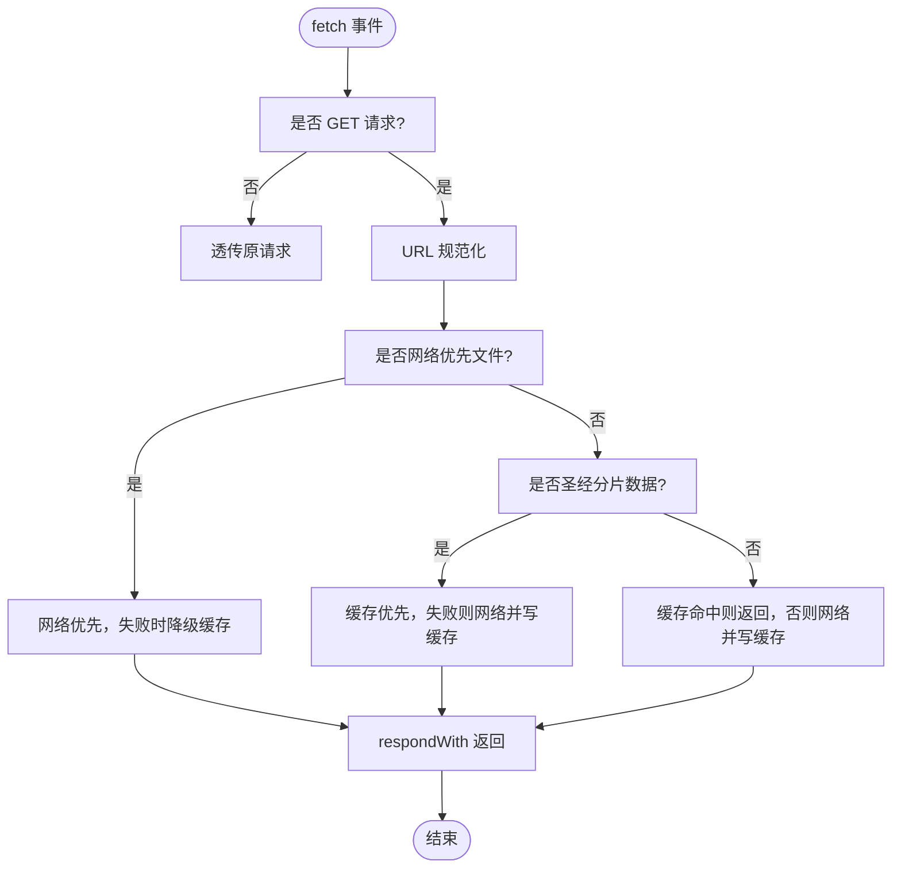
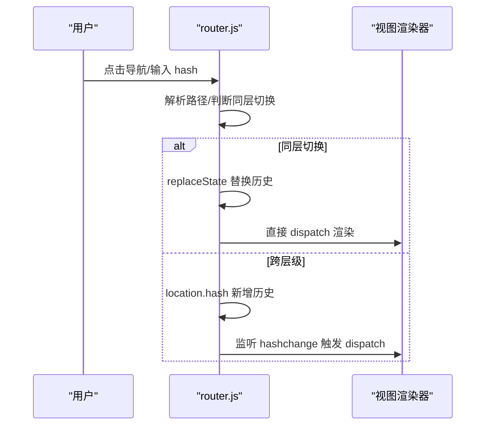
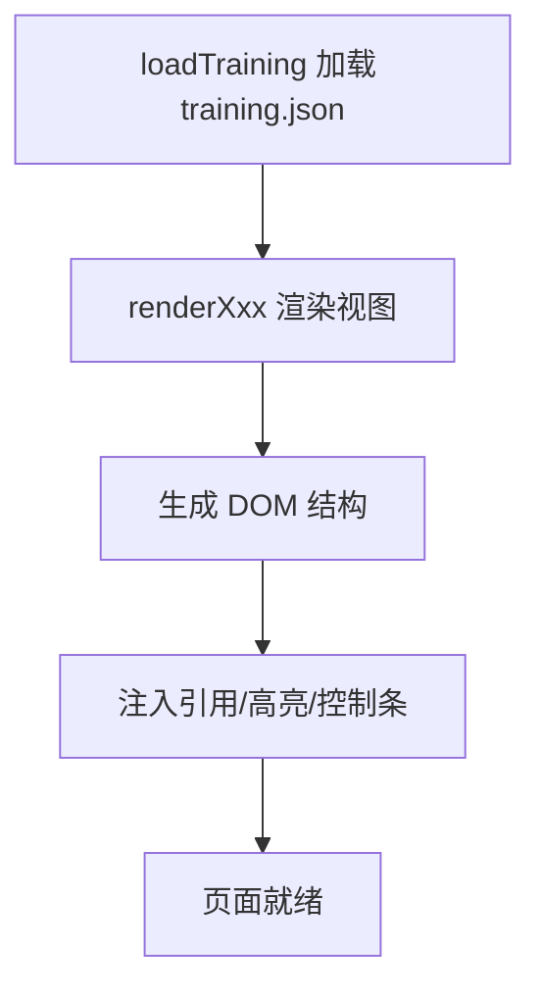
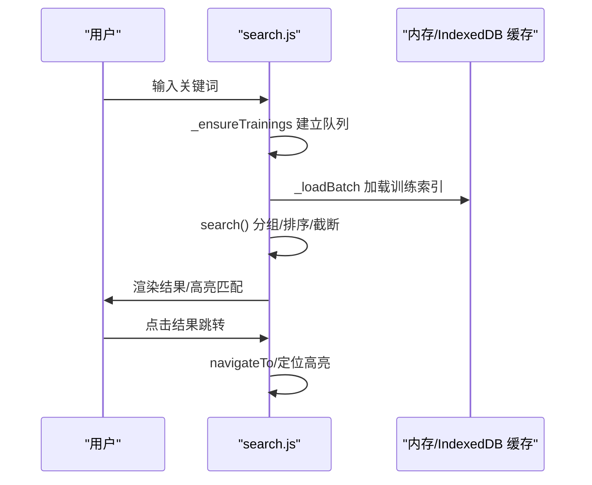
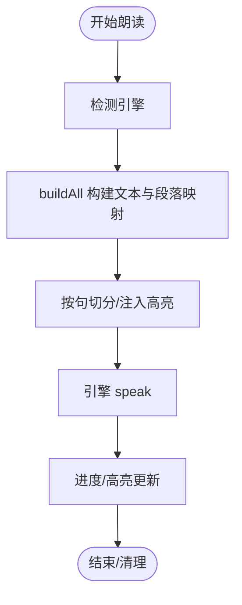
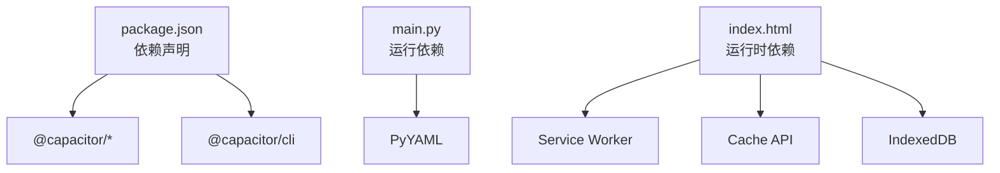

# 开发指南

<cite>
**本文档引用的文件**
- [package.json](file://package.json)
- [app_config.json](file://app_config.json)
- [main.py](file://main.py)
- [build.sh](file://build.sh)
- [requirements.txt](file://requirements.txt)
- [src/templates/main_manifest.json](file://src/templates/main_manifest.json)
- [src/templates/main_sw.js](file://src/templates/main_sw.js)
- [src/static/index.html](file://src/static/index.html)
- [src/static/js/i18n.js](file://src/static/js/i18n.js)
- [src/static/js/dev-console.js](file://src/static/js/dev-console.js)
- [src/static/js/router.js](file://src/static/js/router.js)
- [src/static/js/theme-toggle.js](file://src/static/js/theme-toggle.js)
- [src/static/js/search.js](file://src/static/js/search.js)
- [src/static/js/speech.js](file://src/static/js/speech.js)
- [src/static/js/renderer.js](file://src/static/js/renderer.js)
- [src/static/data/book-names-i18n.json](file://src/static/data/book-names-i18n.json)
</cite>

## 目录
1. [简介](#简介)
2. [项目结构](#项目结构)
3. [核心组件](#核心组件)
4. [架构概览](#架构概览)
5. [详细组件分析](#详细组件分析)
6. [依赖分析](#依赖分析)
7. [性能考虑](#性能考虑)
8. [故障排查指南](#故障排查指南)
9. [结论](#结论)
10. [附录](#附录)

## 简介
本开发指南面向参与“圣经阅读器”项目的开发者，涵盖开发环境搭建、IDE配置、调试工具、代码格式化规则、代码结构与命名约定、国际化（i18n）系统实现与扩展、调试方法与工具使用、性能监控与错误日志、以及代码贡献流程与分支管理策略。项目采用 PWA + APK 的混合架构，前端以 JavaScript 模块化组织，后端通过 Python 脚本生成静态站点与缓存清单。

## 项目结构
项目采用模块化与模板化的组织方式：
- 根目录包含构建脚本、配置文件与平台适配文件
- src/static 为前端静态资源与页面模板，包含 HTML、CSS、JS 模块与数据文件
- src/templates 为 PWA 清单与 Service Worker 模板
- resource 为圣经数据资源（JSON/数据库导出）

**图表来源**
- [src/static/index.html](file://src/static/index.html)
- [src/templates/main_manifest.json](file://src/templates/main_manifest.json)
- [src/templates/main_sw.js](file://src/templates/main_sw.js)
- [main.py](file://main.py)

**章节来源**
- [package.json](file://package.json)
- [app_config.json](file://app_config.json)
- [main.py](file://main.py)
- [build.sh](file://build.sh)
- [src/static/index.html](file://src/static/index.html)
- [src/templates/main_manifest.json](file://src/templates/main_manifest.json)
- [src/templates/main_sw.js](file://src/templates/main_sw.js)

## 核心组件
- 构建系统：Python 脚本负责从数据库导出圣经数据、复制静态资源、生成清单与 Service Worker，并输出到 output/ 目录
- 前端入口与路由：index.html 作为 SPA 入口，router.js 提供 hash 路由与导航
- 渲染器：renderer.js 将 JSON 数据渲染为章节视图（纲目、听抄、详情、诗歌、职事、晨读）
- 国际化：i18n.js 提供多语言文案与主题化章节格式化
- 调试控制台：dev-console.js 提供无条件缓冲的控制台输出与可视化面板
- 主题与设置：theme-toggle.js 管理主题、字体、内容显示开关与错误日志
- 搜索：search.js 提供全文搜索与结果高亮
- 语音朗读：speech.js 支持原生 TTS 与 Web Speech API
- 缓存与离线：Service Worker 模板实现核心资源缓存策略与离线兜底

**章节来源**
- [main.py](file://main.py)
- [src/static/js/router.js](file://src/static/js/router.js)
- [src/static/js/renderer.js](file://src/static/js/renderer.js)
- [src/static/js/i18n.js](file://src/static/js/i18n.js)
- [src/static/js/dev-console.js](file://src/static/js/dev-console.js)
- [src/static/js/theme-toggle.js](file://src/static/js/theme-toggle.js)
- [src/static/js/search.js](file://src/static/js/search.js)
- [src/static/js/speech.js](file://src/static/js/speech.js)
- [src/templates/main_sw.js](file://src/templates/main_sw.js)

## 架构概览
项目采用前后端分离的静态站点生成与运行时交互架构：
- 构建期：Python 脚本导出圣经数据、复制静态资源、生成清单与 Service Worker
- 运行期：浏览器加载 index.html，SPA 通过 router.js 管理视图切换，renderer.js 渲染章节内容，i18n.js 提供本地化支持，Service Worker 提供缓存与离线能力

**图表来源**
- [main.py](file://main.py)
- [src/templates/main_manifest.json](file://src/templates/main_manifest.json)
- [src/templates/main_sw.js](file://src/templates/main_sw.js)
- [src/static/index.html](file://src/static/index.html)
- [src/static/js/router.js](file://src/static/js/router.js)
- [src/static/js/renderer.js](file://src/static/js/renderer.js)
- [src/static/js/i18n.js](file://src/static/js/i18n.js)
- [src/static/js/dev-console.js](file://src/static/js/dev-console.js)
- [src/static/js/theme-toggle.js](file://src/static/js/theme-toggle.js)
- [src/static/js/search.js](file://src/static/js/search.js)
- [src/static/js/speech.js](file://src/static/js/speech.js)

## 详细组件分析

### 国际化（i18n）系统
- 设计模式：IIFE 模块，挂载到 window.CXI18n
- 语言切换：通过 localStorage 保存语言偏好，setLang 切换语言并触发刷新
- 章节格式化：提供中文数字与章节格式化工具
- 书籍名称：book-names-i18n.json 提供书卷中英文名称映射

**图表来源**
- [src/static/js/i18n.js](file://src/static/js/i18n.js)
- [src/static/data/book-names-i18n.json](file://src/static/data/book-names-i18n.json)

**章节来源**
- [src/static/js/i18n.js](file://src/static/js/i18n.js)
- [src/static/data/book-names-i18n.json](file://src/static/data/book-names-i18n.json)

### 调试控制台（dev-console.js）
- 无条件缓冲：脚本加载即拦截 console 输出，最多缓冲 500 条
- 可视化面板：开发者模式开启后创建面板，支持清除、复制与折叠
- 异常捕获：拦截未捕获异常与 Promise 拒绝，统一记录

**图表来源**
- [src/static/js/dev-console.js](file://src/static/js/dev-console.js)

**章节来源**
- [src/static/js/dev-console.js](file://src/static/js/dev-console.js)

### Service Worker 与缓存策略（main_sw.js）
- 缓存策略：核心资源 cache-first，版本文件 network-first，其他 cache-first + network fallback
- 离线兜底：导航失败时返回离线提示页
- 缓存管理：支持批量缓存 66 卷圣经数据、查询缓存状态、清理缓存

**图表来源**
- [src/templates/main_sw.js](file://src/templates/main_sw.js)

**章节来源**
- [src/templates/main_sw.js](file://src/templates/main_sw.js)

### SPA 路由与视图切换（router.js）
- Hash 路由：支持主页、圣经阅读、图表、读经计划、设置等路径
- 同层切换优化：同书卷章节切换使用 replaceState，避免历史膨胀
- 返回键处理：配合 backStack 与 ghost entry 跳过，确保返回行为一致

**图表来源**
- [src/static/js/router.js](file://src/static/js/router.js)

**章节来源**
- [src/static/js/router.js](file://src/static/js/router.js)

### 渲染器（renderer.js）
- JSON→HTML：根据 training.json 渲染章节视图，DOM/class/id 与旧模板兼容
- 视图类型：纲目(cv)、听抄(h)、详情(ts)、诗歌(sg)、职事(zs)、晨读(cx)
- 晨读翻页：支持天翻页与手势滑动，高度自适应

**图表来源**
- [src/static/js/renderer.js](file://src/static/js/renderer.js)

**章节来源**
- [src/static/js/renderer.js](file://src/static/js/renderer.js)

### 搜索系统（search.js）
- 索引懒加载：按需加载训练并构建搜索条目
- 全屏 Modal：提供搜索输入、结果分组与“查看更多”
- 高亮定位：支持 SPA 与传统页面两种定位方式

**图表来源**
- [src/static/js/search.js](file://src/static/js/search.js)

**章节来源**
- [src/static/js/search.js](file://src/static/js/search.js)

### 语音朗读（speech.js）
- 引擎选择：原生 TTS（Android APK）优先，Web Speech API 作为回退
- 句子级高亮：基于注入的 <mark> 实现逐句高亮
- 引用展开：将经文引用展开为可读文本，支持范围合并

**图表来源**
- [src/static/js/speech.js](file://src/static/js/speech.js)

**章节来源**
- [src/static/js/speech.js](file://src/static/js/speech.js)

### 主题与设置（theme-toggle.js）
- 主题切换：5 种阅读主题与字体大小调节
- 内容显示开关：书卷主题、简介、纲目、注解、串珠、分隔线
- 错误日志：收集并持久化错误日志，支持清理
- 对话框与返回键：backStack 统一处理弹窗返回

**章节来源**
- [src/static/js/theme-toggle.js](file://src/static/js/theme-toggle.js)

## 依赖分析
- 构建依赖：PyYAML（解析配置）、Python 标准库（文件操作、JSON、时间）
- 前端依赖：Capacitor 生态（App、FileSystem、StatusBar、TextToSpeech）、localforage（IndexedDB 封装）、jszip（压缩包处理）
- 运行时依赖：浏览器 Service Worker、Cache API、IndexedDB、speechSynthesis

**图表来源**
- [package.json](file://package.json)
- [main.py](file://main.py)
- [src/static/index.html](file://src/static/index.html)

**章节来源**
- [package.json](file://package.json)
- [requirements.txt](file://requirements.txt)
- [main.py](file://main.py)
- [src/static/index.html](file://src/static/index.html)

## 性能考虑
- 缓存策略：Service Worker 对核心资源采用 cache-first，显著提升离线与二次访问性能
- 懒加载：搜索索引与训练数据按需加载，降低首屏压力
- 渲染优化：renderer.js 生成稳定的 DOM 结构，避免不必要的重排
- 语音优化：原生 TTS 在 APK 上更高效，Web Speech API 提供回退
- 资源压缩：构建脚本对 JSON 去缩进，减少包体大小

[本节为通用指导，无需特定文件引用]

## 故障排查指南
- 开发者模式：通过管理面板开启/关闭开发者模式，使用 dev-console.js 查看日志
- 错误日志：theme-toggle.js 收集错误日志并持久化，可在设置中查看与清理
- Service Worker：检查缓存状态、清理缓存、确认离线页面是否正确返回
- 搜索问题：确认训练已缓存、索引是否生成、队列是否正确重建
- 语音问题：确认引擎可用、权限授予、倍速设置合理

**章节来源**
- [src/static/js/dev-console.js](file://src/static/js/dev-console.js)
- [src/static/js/theme-toggle.js](file://src/static/js/theme-toggle.js)
- [src/templates/main_sw.js](file://src/templates/main_sw.js)
- [src/static/js/search.js](file://src/static/js/search.js)
- [src/static/js/speech.js](file://src/static/js/speech.js)

## 结论
本项目通过清晰的模块划分与稳健的构建流程，实现了跨平台的圣经阅读体验。国际化、缓存与离线、全文搜索与语音朗读构成了核心功能。建议在开发过程中遵循本文档的命名约定与调试流程，持续优化缓存策略与渲染性能，确保用户体验与可维护性的平衡。

[本节为总结性内容，无需特定文件引用]

## 附录

### 开发环境搭建步骤
- 安装 Python 依赖：pip install -r requirements.txt
- 安装 Node 依赖：npm install
- 构建项目：npm run build（调用 Python 脚本）
- 启动 Capacitor：npm run cap:sync && npm run cap:open
- 构建 APK：npm run android:build

**章节来源**
- [requirements.txt](file://requirements.txt)
- [package.json](file://package.json)
- [build.sh](file://build.sh)
- [main.py](file://main.py)

### IDE 配置与调试工具
- VS Code 推荐扩展：ESLint、Prettier、EditorConfig、Auto Rename Tag、Bracket Pair Colorizer
- 调试配置：Chrome DevTools（移动端仿真、网络面板、缓存检查）、Capacitor Live Reload
- 日志与控制台：启用开发者模式，使用 dev-console.js 面板查看实时日志

[本节为通用指导，无需特定文件引用]

### 代码结构与命名约定
- 模块组织：src/static/js 下按功能拆分模块（i18n、router、renderer、search、speech、theme-toggle、dev-console）
- 文件命名：功能模块采用小驼峰命名，如 router.js、renderer.js、search.js
- 注释标准：模块头部包含用途与暴露接口说明，函数/关键逻辑提供简要注释
- CSS 类命名：采用 BEM 风格，如 .section-level1、.content-text、.outline-item

[本节为通用指导，无需特定文件引用]

### 国际化（i18n）扩展方法
- 添加语言：在 i18n.js 的 translations 中新增语言键值，遵循现有键结构
- 书籍名称：在 book-names-i18n.json 中添加对应书卷映射
- 切换语言：通过 CXI18n.setLang 切换语言并刷新界面
- 章节格式化：利用 formatChapter 与 getCnNums 实现中英对照章节显示

**章节来源**
- [src/static/js/i18n.js](file://src/static/js/i18n.js)
- [src/static/data/book-names-i18n.json](file://src/static/data/book-names-i18n.json)

### 调试方法与工具使用
- dev-console.js：无条件缓冲控制台输出，支持清除与复制
- 浏览器开发者工具：检查网络缓存、Service Worker 状态、DOM 结构与事件
- 移动设备调试：Chrome DevTools 移动端仿真、iOS Safari Web Inspector、Android WebView 调试
- 错误日志：theme-toggle.js 收集并持久化错误日志，便于问题定位

**章节来源**
- [src/static/js/dev-console.js](file://src/static/js/dev-console.js)
- [src/static/js/theme-toggle.js](file://src/static/js/theme-toggle.js)

### 代码贡献流程与分支管理
- 分支策略：采用 Git Flow，主分支（main）用于发布，develop 用于集成，功能分支从 develop 分支创建
- 提交规范：使用清晰的提交信息，描述变更目的与影响范围
- 代码审查：通过 Pull Request 进行代码审查，至少一名维护者批准
- 测试要求：新增功能需附带测试用例，修复缺陷需提供回归测试

[本节为通用指导，无需特定文件引用]

### 性能监控与错误日志
- 性能监控：使用浏览器性能面板与 Lighthouse 进行页面性能评估
- 缓存监控：通过 Service Worker 与 Cache API 检查缓存命中率与容量
- 错误日志：theme-toggle.js 持久化错误日志，定期清理过期日志

**章节来源**
- [src/static/js/theme-toggle.js](file://src/static/js/theme-toggle.js)
- [src/templates/main_sw.js](file://src/templates/main_sw.js)