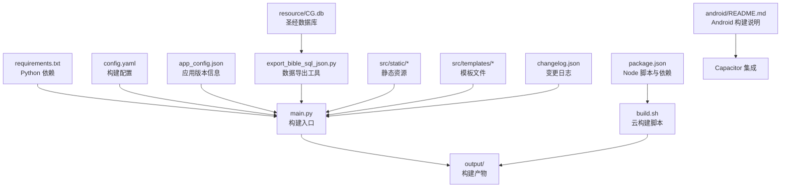
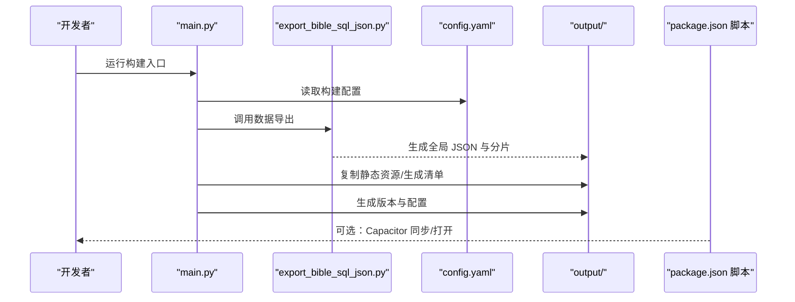
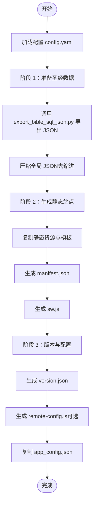
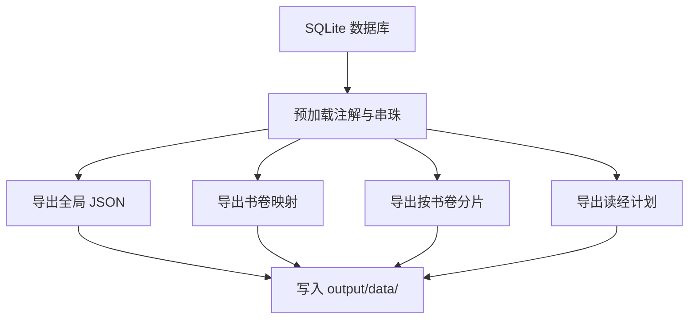
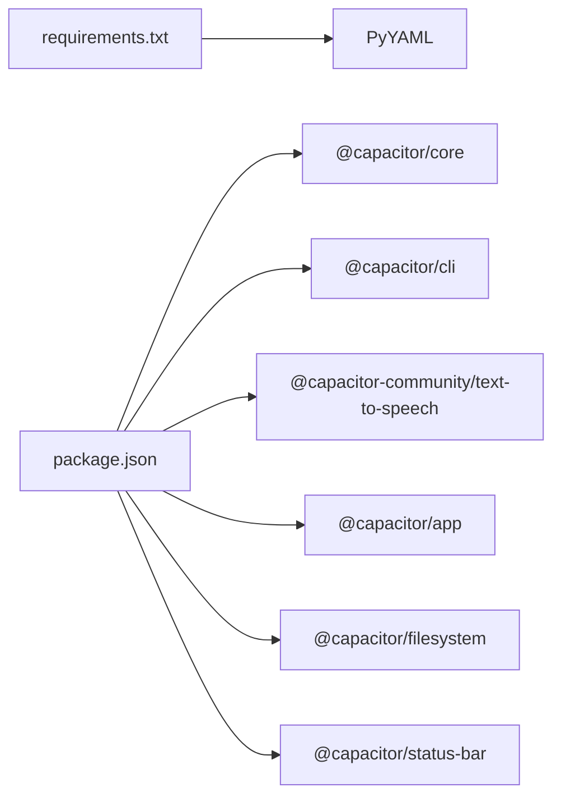

# 快速开始

<cite>
**本文档引用的文件**
- [requirements.txt](file://requirements.txt)
- [package.json](file://package.json)
- [build.sh](file://build.sh)
- [main.py](file://main.py)
- [export_bible_sql_json.py](file://export_bible_sql_json.py)
- [config.yaml](file://config.yaml)
- [app_config.json](file://app_config.json)
- [changelog.json](file://changelog.json)
- [android/README.md](file://android/README.md)
</cite>

## 目录
1. [简介](#简介)
2. [项目结构](#项目结构)
3. [核心组件](#核心组件)
4. [架构总览](#架构总览)
5. [详细组件分析](#详细组件分析)
6. [依赖关系分析](#依赖关系分析)
7. [性能考虑](#性能考虑)
8. [故障排除指南](#故障排除指南)
9. [结论](#结论)
10. [附录](#附录)

## 简介
本指南面向希望快速搭建并运行“圣经阅读器”项目的开发者与运维人员。项目采用 Python + Node.js 技术栈，通过构建脚本将 SQLite 数据库导出为静态资源，生成可部署的 PWA 应用，并支持构建 Android APK。文档涵盖环境要求、安装步骤、构建流程、使用示例与常见问题排查，帮助你在最短时间内完成本地开发与部署。

## 项目结构
项目采用前后端分离的静态站点架构：
- Python 负责数据导出与静态站点生成
- Node.js 负责前端构建脚本与 Capacitor 集成
- 资源文件位于 resource/，包含 SQLite 数据库与读经计划 JSON
- 源码位于 src/，包含静态资源与模板
- 输出产物位于 output/，用于部署

图表来源
- [requirements.txt:1-2](file://requirements.txt#L1-L2)
- [package.json:1-24](file://package.json#L1-L24)
- [build.sh:1-16](file://build.sh#L1-L16)
- [main.py:1-361](file://main.py#L1-L361)
- [export_bible_sql_json.py:1-835](file://export_bible_sql_json.py#L1-L835)
- [config.yaml:1-12](file://config.yaml#L1-L12)
- [app_config.json:1-6](file://app_config.json#L1-L6)
- [changelog.json:1-10](file://changelog.json#L1-L10)
- [android/README.md:1-13](file://android/README.md#L1-L13)

章节来源
- [requirements.txt:1-2](file://requirements.txt#L1-L2)
- [package.json:1-24](file://package.json#L1-L24)
- [build.sh:1-16](file://build.sh#L1-L16)
- [main.py:1-361](file://main.py#L1-L361)
- [config.yaml:1-12](file://config.yaml#L1-L12)
- [app_config.json:1-6](file://app_config.json#L1-L6)
- [changelog.json:1-10](file://changelog.json#L1-L10)
- [android/README.md:1-13](file://android/README.md#L1-L13)

## 核心组件
- 构建入口：main.py 提供三阶段构建流程，负责数据准备、静态站点生成与版本配置。
- 数据导出：export_bible_sql_json.py 从 SQLite 数据库导出多类 JSON 文件，包括经文、注解、串珠、书卷映射与按书卷分片。
- 构建配置：config.yaml 定义输出目录、静态资源目录、数据库路径与远程服务器配置。
- 应用配置：app_config.json 提供应用名称、ID 与版本号，用于生成版本信息。
- 云构建脚本：build.sh 在 CI/CD 环境中自动安装依赖并执行构建。
- Node 脚本：package.json 提供构建、同步与 Android 构建脚本，简化开发流程。

章节来源
- [main.py:36-76](file://main.py#L36-L76)
- [export_bible_sql_json.py:743-800](file://export_bible_sql_json.py#L743-L800)
- [config.yaml:1-12](file://config.yaml#L1-L12)
- [app_config.json:1-6](file://app_config.json#L1-L6)
- [build.sh:1-16](file://build.sh#L1-L16)
- [package.json:5-11](file://package.json#L5-L11)

## 架构总览
构建系统分为三层：
- 数据层：SQLite 数据库导出为 JSON 资源
- 资源层：复制静态资源、生成清单与 Service Worker
- 配置层：生成版本信息与远程配置

图表来源
- [main.py:36-76](file://main.py#L36-L76)
- [export_bible_sql_json.py:743-800](file://export_bible_sql_json.py#L743-L800)
- [config.yaml:1-12](file://config.yaml#L1-L12)
- [package.json:5-11](file://package.json#L5-L11)

## 详细组件分析

### 构建入口：main.py
- 三阶段构建流程
  - 阶段 1：准备圣经数据（调用数据导出工具）
  - 阶段 2：生成静态站点（复制资源、生成清单与 Service Worker）
  - 阶段 3：版本与配置（生成版本信息与远程配置）
- 关键功能
  - 加载 YAML 配置
  - 导出 JSON 并压缩体积
  - 复制 CSS、JS、icons、vendor、静态数据
  - 生成 manifest.json 与 sw.js
  - 生成 version.json 与 remote-config.js
  - 复制 app_config.json 与 changelog.json（如存在）

图表来源
- [main.py:36-76](file://main.py#L36-L76)
- [main.py:87-117](file://main.py#L87-L117)
- [main.py:121-161](file://main.py#L121-L161)
- [main.py:288-321](file://main.py#L288-L321)

章节来源
- [main.py:36-76](file://main.py#L36-L76)
- [main.py:87-117](file://main.py#L87-L117)
- [main.py:121-161](file://main.py#L121-L161)
- [main.py:288-321](file://main.py#L288-L321)

### 数据导出：export_bible_sql_json.py
- 功能概述
  - 从 SQLite 数据库导出经文、注解、串珠、书卷映射与按书卷分片
  - 支持读经计划合并导出
  - 提供中文数字解析与串珠标准化
- 输出文件
  - 全局 JSON：bible-text.json、bible-notes.json、bible-xrefs.json
  - 书卷映射：bible-books.json
  - 分片文件：bible/01.json ~ bible/66.json
  - 读经计划：reading-plans.json

图表来源
- [export_bible_sql_json.py:743-800](file://export_bible_sql_json.py#L743-L800)

章节来源
- [export_bible_sql_json.py:1-800](file://export_bible_sql_json.py#L1-L800)

### 构建配置：config.yaml
- 关键项
  - output_dir：输出目录，默认 output/
  - static_dir：静态资源目录，默认 src/static
  - bible_db：数据库路径，默认 resource/CG.db
  - reading_plans：读经计划文件列表
  - remote_servers：远程服务器配置（GitHub API 等）

章节来源
- [config.yaml:1-12](file://config.yaml#L1-L12)

### 应用配置：app_config.json
- 关键项
  - app_name：应用名称
  - app_id：应用 ID
  - version：应用版本号

章节来源
- [app_config.json:1-6](file://app_config.json#L1-L6)

### 云构建脚本：build.sh
- 步骤
  - 安装 Python 依赖（requirements.txt）
  - 执行构建（main.py）
- 适用场景
  - Cloudflare Pages 等 CI/CD 环境

章节来源
- [build.sh:1-16](file://build.sh#L1-L16)

### Node 脚本：package.json
- 关键脚本
  - build：调用 Python 构建入口
  - cap:sync：同步 Capacitor 资源
  - cap:open：在 Android Studio 中打开
  - android:build：构建 APK
  - android:dev：开发模式构建并打开
- 依赖
  - @capacitor/core、@capacitor/cli 等

章节来源
- [package.json:5-11](file://package.json#L5-L11)

## 依赖关系分析
- Python 依赖
  - PyYAML>=6.0：用于解析 YAML 配置
- Node 依赖
  - @capacitor-community/text-to-speech：文本转语音
  - @capacitor/app、@capacitor/core、@capacitor/filesystem、@capacitor/status-bar：Capacitor 核心能力
  - @capacitor/android、@capacitor/cli：Android 平台集成与 CLI

图表来源
- [requirements.txt:1-2](file://requirements.txt#L1-L2)
- [package.json:12-22](file://package.json#L12-L22)

章节来源
- [requirements.txt:1-2](file://requirements.txt#L1-L2)
- [package.json:12-22](file://package.json#L12-L22)

## 性能考虑
- 数据压缩：构建阶段对全局 JSON 进行去缩进压缩，减少包体体积
- 资源排除：构建时排除训练相关 JS 文件，降低输出体积
- 缓存策略：通过 Service Worker 与清单文件优化缓存与离线体验
- 并行导出：数据导出工具内部进行预加载与分片处理，提升导出效率

章节来源
- [main.py:107-116](file://main.py#L107-L116)
- [main.py:194-203](file://main.py#L194-L203)
- [export_bible_sql_json.py:743-800](file://export_bible_sql_json.py#L743-L800)

## 故障排除指南
- 缺少 Python 依赖
  - 症状：构建失败，提示模块缺失
  - 处理：确保已安装 requirements.txt 中的依赖
- 缺少 Node 依赖
  - 症状：npm 脚本无法执行
  - 处理：执行 npm install 安装 package.json 中的依赖
- 数据库文件不存在
  - 症状：构建时报错找不到数据库
  - 处理：确认 resource/CG.db 是否存在，或在 config.yaml 中调整路径
- 构建输出为空
  - 症状：output/ 目录无内容
  - 处理：检查 main.py 的输出目录配置与权限，确认构建脚本执行成功
- Android 构建失败
  - 症状：APK 构建报错
  - 处理：先执行 npx cap add android 初始化 Android 项目，再运行 npm run android:build

章节来源
- [requirements.txt:1-2](file://requirements.txt#L1-L2)
- [package.json:1-24](file://package.json#L1-L24)
- [config.yaml:4](file://config.yaml#L4)
- [main.py:93-96](file://main.py#L93-L96)
- [android/README.md:3-7](file://android/README.md#L3-L7)

## 结论
通过本指南，你可以快速完成环境准备、依赖安装与构建流程。项目采用清晰的三阶段构建模型，结合 Python 数据导出与 Node 脚本管理，既适合本地开发也便于云端部署。遇到问题时，可依据故障排除指南逐项定位并解决。

## 附录

### 环境要求
- Python 3.6+
- Node.js（用于前端构建与 Capacitor 集成）
- Git（用于版本控制与仓库克隆）

章节来源
- [requirements.txt:1-2](file://requirements.txt#L1-L2)
- [package.json:1-24](file://package.json#L1-L24)

### 安装步骤
- 克隆仓库
  - 使用 Git 克隆项目到本地
- 安装 Python 依赖
  - 在项目根目录执行 pip install -r requirements.txt
- 安装 Node.js 依赖
  - 在项目根目录执行 npm install

章节来源
- [build.sh:9](file://build.sh#L9)
- [package.json:1-24](file://package.json#L1-L24)

### 运行构建脚本
- 本地构建
  - 执行 python main.py 或 npm run build（通过 package.json 脚本）
- 云构建
  - 执行 build.sh，自动安装依赖并生成静态资源

章节来源
- [main.py:36-76](file://main.py#L36-L76)
- [package.json:6](file://package.json#L6)
- [build.sh:13](file://build.sh#L13)

### 基本使用示例
- 启动本地开发服务器
  - 使用任意静态服务器（如 Python 的 http.server 或 Node 的 serve）启动 output/ 目录
- 访问构建后的应用
  - 浏览器打开 http://localhost:端口/index.html
- 构建 Android APK
  - 首次初始化：npx cap add android
  - 构建命令：npm run android:build

章节来源
- [android/README.md:3-12](file://android/README.md#L3-L12)

### 初始配置建议
- 确认数据库路径：在 config.yaml 中设置 bible_db 指向正确的 SQLite 文件
- 自定义输出目录：根据需要修改 output_dir
- 添加远程服务器配置：在 config.yaml 的 remote_servers 中添加 GitHub API 等地址
- 复制 app_config.json：确保 app_config.json 包含正确的版本号与应用信息

章节来源
- [config.yaml:1-12](file://config.yaml#L1-L12)
- [app_config.json:1-6](file://app_config.json#L1-L6)