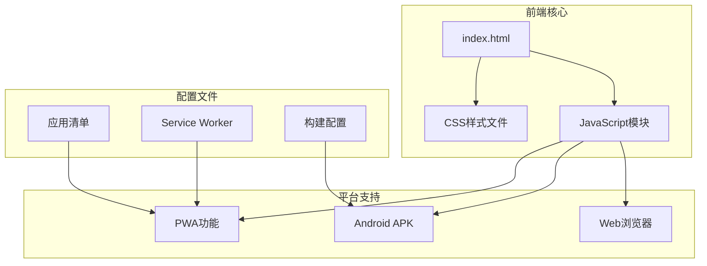
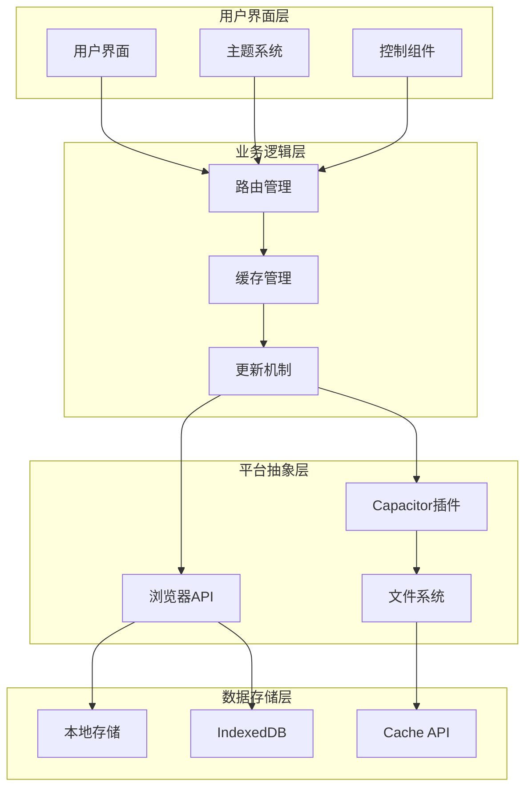
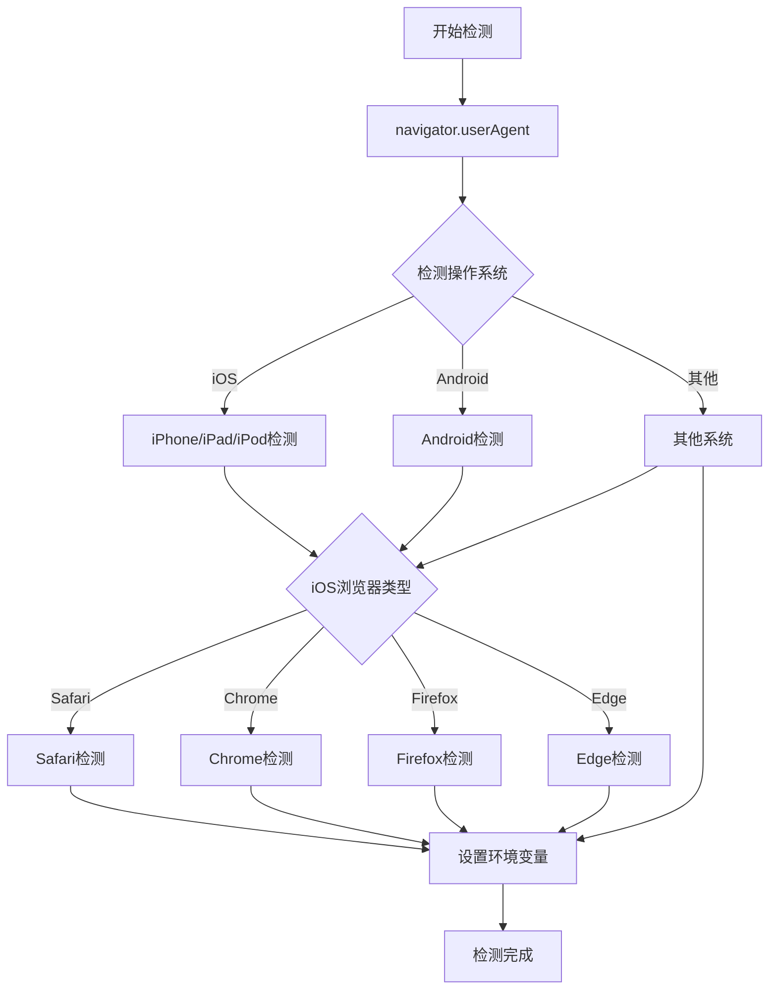
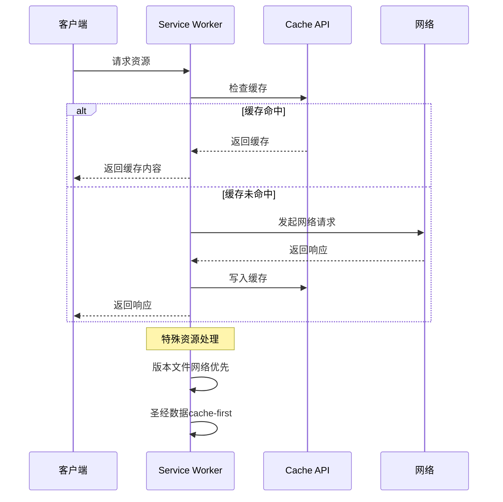
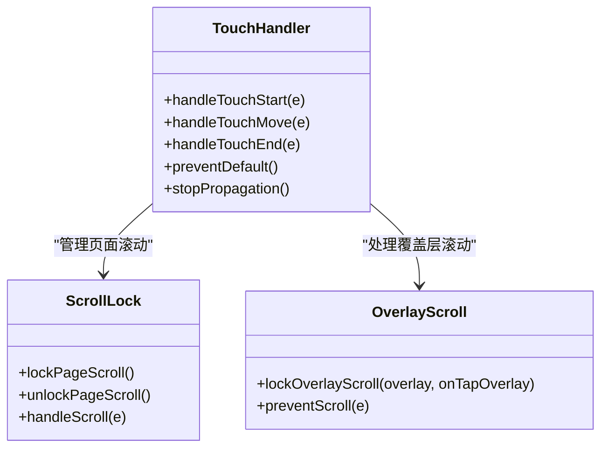
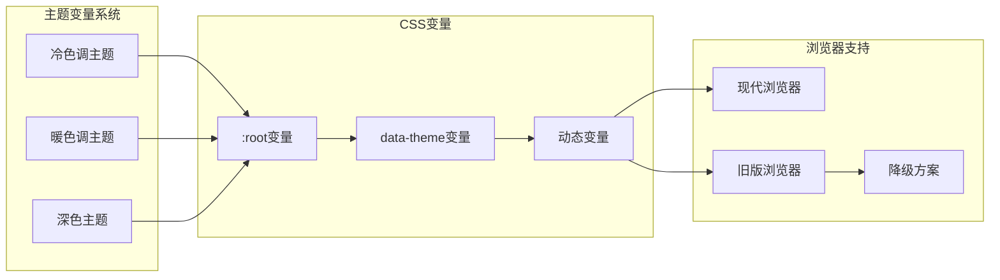
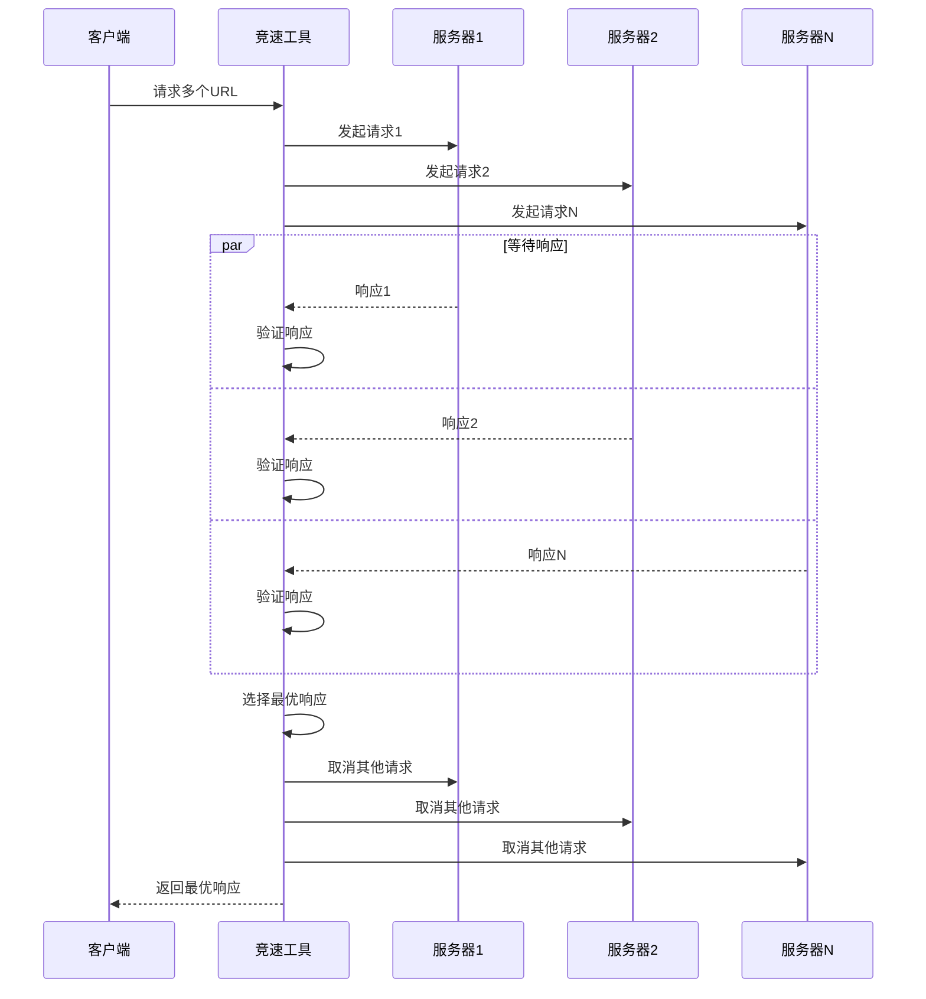
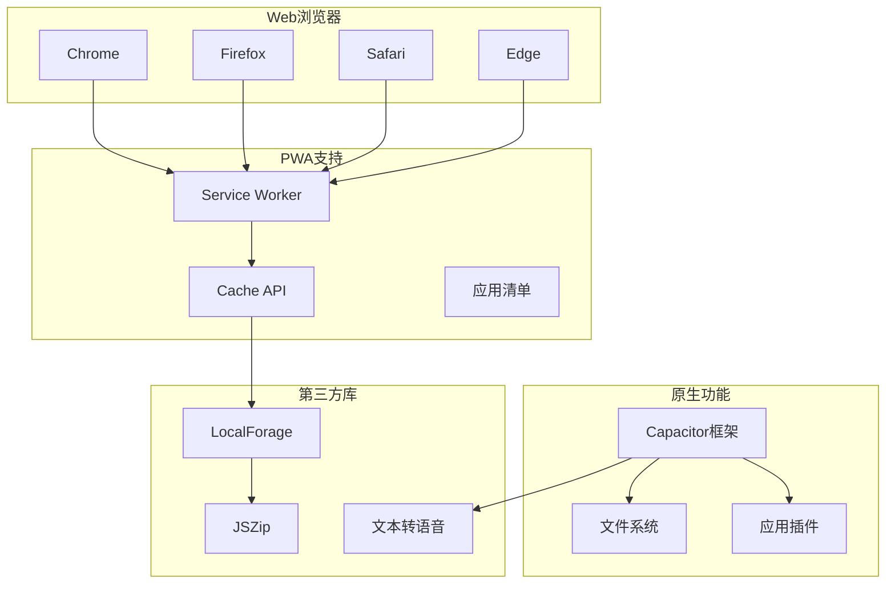
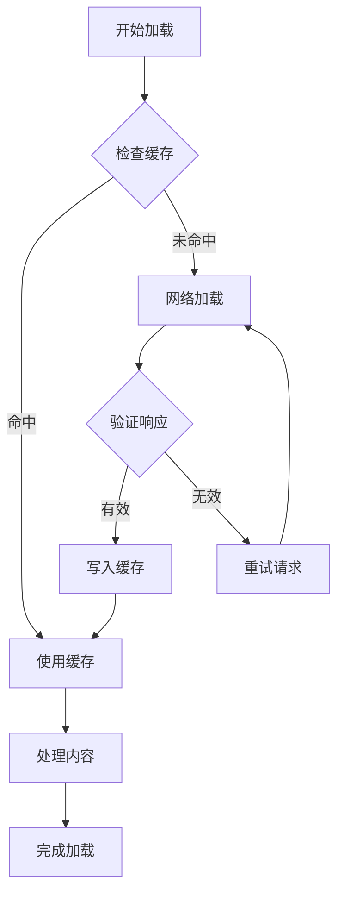
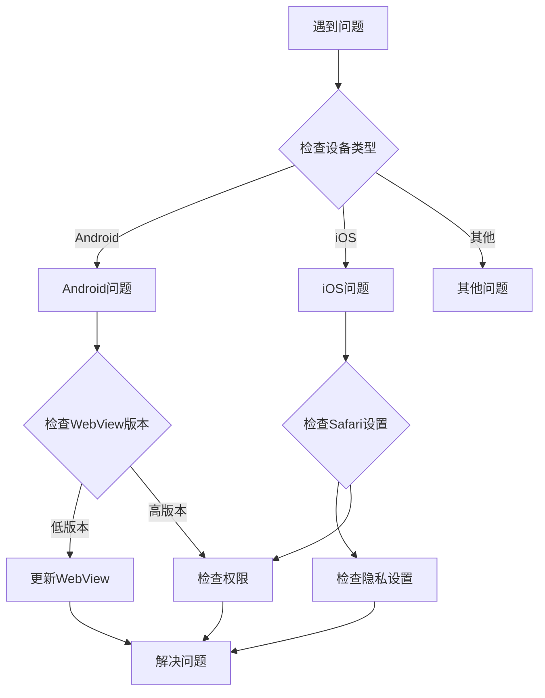

# 兼容性问题

<cite>
**本文档引用的文件**
- [src/static/index.html](file://src/static/index.html)
- [src/templates/main_manifest.json](file://src/templates/main_manifest.json)
- [src/templates/main_sw.js](file://src/templates/main_sw.js)
- [src/static/js/theme-toggle.js](file://src/static/js/theme-toggle.js)
- [src/static/js/race-fastest.js](file://src/static/js/race-fastest.js)
- [src/static/js/app-update.js](file://src/static/js/app-update.js)
- [src/static/css/style.css](file://src/static/css/style.css)
- [src/static/css/bible-theme.css](file://src/static/css/bible-theme.css)
- [package.json](file://package.json)
- [capacitor.config.json](file://capacitor.config.json)
</cite>

## 目录
1. [简介](#简介)
2. [项目结构](#项目结构)
3. [核心组件](#核心组件)
4. [架构概览](#架构概览)
5. [详细组件分析](#详细组件分析)
6. [依赖关系分析](#依赖关系分析)
7. [性能考虑](#性能考虑)
8. [故障排除指南](#故障排除指南)
9. [结论](#结论)

## 简介

本项目是一个跨平台的圣经阅读应用，支持Web浏览器、PWA（渐进式网页应用）和Android APK三种运行模式。项目重点关注不同浏览器和设备环境下的兼容性问题，包括Chrome、Firefox、Safari、Edge等主流浏览器的差异处理，以及移动端浏览器的特殊问题和解决方案。

项目采用现代化的前端技术栈，结合CSS自定义属性实现主题系统，通过Service Worker提供离线缓存能力，并使用Capacitor框架实现原生应用功能。整个系统设计充分考虑了不同平台和浏览器的特性差异，提供了完善的兼容性处理方案。

## 项目结构

项目采用模块化的文件组织结构，主要分为以下几个部分：

**图表来源**
- [src/static/index.html:1-687](file://src/static/index.html#L1-L687)
- [src/templates/main_manifest.json:1-26](file://src/templates/main_manifest.json#L1-L26)
- [src/templates/main_sw.js:1-270](file://src/templates/main_sw.js#L1-L270)

**章节来源**
- [src/static/index.html:1-687](file://src/static/index.html#L1-L687)
- [src/templates/main_manifest.json:1-26](file://src/templates/main_manifest.json#L1-L26)
- [src/templates/main_sw.js:1-270](file://src/templates/main_sw.js#L1-L270)

## 核心组件

### 浏览器兼容性处理

项目实现了多层次的浏览器兼容性处理机制：

1. **用户代理检测**：通过UA字符串识别不同浏览器和操作系统
2. **特性检测**：使用现代Web API的特性检测替代浏览器嗅探
3. **降级策略**：为不支持某些功能的浏览器提供替代方案
4. **Polyfill集成**：为旧版浏览器提供必要的JavaScript API支持

### PWA兼容性支持

项目提供了完整的PWA功能支持，包括：
- 应用清单文件配置
- Service Worker缓存策略
- 离线缓存管理
- 安装提示和推送通知

### 移动端适配

针对移动设备的特殊处理：
- 触摸事件支持和优化
- 屏幕适配和响应式设计
- 横竖屏切换处理
- 安全区域适配

**章节来源**
- [src/static/index.html:222-232](file://src/static/index.html#L222-L232)
- [src/static/js/theme-toggle.js:686-693](file://src/static/js/theme-toggle.js#L686-L693)

## 架构概览

项目采用分层架构设计，确保不同平台间的兼容性：

**图表来源**
- [src/static/js/theme-toggle.js:1-800](file://src/static/js/theme-toggle.js#L1-L800)
- [src/static/js/app-update.js:1-800](file://src/static/js/app-update.js#L1-L800)
- [src/templates/main_sw.js:1-270](file://src/templates/main_sw.js#L1-L270)

## 详细组件分析

### 浏览器兼容性处理机制

#### 用户代理检测系统

项目实现了智能的用户代理检测机制，能够准确识别不同的浏览器和操作系统：

**图表来源**
- [src/static/index.html:224-226](file://src/static/index.html#L224-L226)
- [src/static/js/theme-toggle.js:686-693](file://src/static/js/theme-toggle.js#L686-L693)

#### 特性检测和降级策略

项目采用特性检测而非浏览器嗅探的方式，确保更好的兼容性：

| 功能特性 | 检测方法 | 降级方案 |
|---------|---------|---------|
| Service Worker | 'serviceWorker' in navigator | 直接加载，无离线功能 |
| Cache API | 'caches' in window | 使用localStorage替代 |
| IndexedDB | 'indexedDB' in window | 使用localStorage存储 |
| Fetch API | typeof fetch === 'function' | 使用XMLHttpRequest |
| WebP图片 | canvas.toDataURL('image/webp') | 使用JPEG/PNG格式 |

**章节来源**
- [src/static/index.html:557-595](file://src/static/index.html#L557-L595)
- [src/static/js/app-update.js:21-119](file://src/static/js/app-update.js#L21-L119)

### PWA兼容性处理

#### Service Worker缓存策略

项目实现了智能的Service Worker缓存策略，根据不同资源类型采用不同的缓存策略：

**图表来源**
- [src/templates/main_sw.js:88-166](file://src/templates/main_sw.js#L88-L166)

#### 应用清单配置

项目提供了完整的PWA应用清单配置，确保在不同浏览器中的最佳体验：

| 配置项 | Chrome | Firefox | Safari | Edge |
|-------|--------|---------|--------|------|
| name | ✓ | ✓ | ✓ | ✓ |
| short_name | ✓ | ✓ | ✓ | ✓ |
| icons | ✓ | ✓ | ✓ | ✓ |
| display | ✓ | ✓ | ✓ | ✓ |
| background_color | ✓ | ✓ | ✓ | ✓ |
| theme_color | ✓ | ✓ | ✓ | ✓ |

**章节来源**
- [src/templates/main_manifest.json:1-26](file://src/templates/main_manifest.json#L1-L26)
- [src/templates/main_sw.js:1-270](file://src/templates/main_sw.js#L1-L270)

### 移动端兼容性处理

#### 触摸事件优化

项目针对移动端触摸事件进行了专门优化：

**图表来源**
- [src/static/js/theme-toggle.js:178-282](file://src/static/js/theme-toggle.js#L178-L282)

#### 屏幕适配和响应式设计

项目采用了全面的响应式设计策略：

| 设备类型 | 断点 | 特性 |
|---------|------|------|
| 移动设备 | <768px | 触摸友好的大按钮，简化布局 |
| 平板设备 | 768px-1024px | 适度的列数调整，保持内容完整性 |
| 桌面设备 | >1024px | 复杂布局，充分利用空间 |
| 高分辨率屏 | >1200px | 更大的字体和间距，提升可读性 |

**章节来源**
- [src/static/css/style.css:511-518](file://src/static/css/style.css#L511-L518)
- [src/static/css/bible-theme.css:737-757](file://src/static/css/bible-theme.css#L737-L757)

### 主题系统兼容性

#### CSS自定义属性系统

项目使用CSS自定义属性实现主题系统，确保跨浏览器兼容性：

**图表来源**
- [src/static/css/style.css:8-103](file://src/static/css/style.css#L8-L103)
- [src/static/css/bible-theme.css:1-758](file://src/static/css/bible-theme.css#L1-L758)

**章节来源**
- [src/static/css/style.css:1-800](file://src/static/css/style.css#L1-L800)
- [src/static/css/bible-theme.css:1-758](file://src/static/css/bible-theme.css#L1-L758)

### JavaScript兼容性处理

#### Polyfill和降级方案

项目实现了多层次的JavaScript兼容性处理：

1. **Fetch API降级**：当浏览器不支持Fetch时，自动降级到XMLHttpRequest
2. **Promise支持**：为不支持Promise的浏览器提供polyfill
3. **Array.from支持**：使用扩展运算符替代Array.from
4. **Object.assign支持**：使用扩展语法替代Object.assign

#### 并发竞速工具

项目提供了智能的并发竞速工具，用于优化资源加载：

**图表来源**
- [src/static/js/race-fastest.js:20-117](file://src/static/js/race-fastest.js#L20-L117)

**章节来源**
- [src/static/js/race-fastest.js:1-122](file://src/static/js/race-fastest.js#L1-L122)

## 依赖关系分析

### 平台依赖关系

**图表来源**
- [package.json:12-23](file://package.json#L12-L23)
- [capacitor.config.json:1-10](file://capacitor.config.json#L1-L10)

### 兼容性矩阵

| 功能特性 | Chrome | Firefox | Safari | Edge | Android Webview | iOS WKWebView |
|---------|--------|---------|--------|------|----------------|---------------|
| Service Worker | ✓ | ✓ | ✓ | ✓ | ✓ | ✓ |
| Cache API | ✓ | ✓ | ✓ | ✓ | ✓ | ✓ |
| IndexedDB | ✓ | ✓ | ✓ | ✓ | ✓ | ✓ |
| Fetch API | ✓ | ✓ | ✓ | ✓ | ✓ | ✓ |
| WebP图片 | ✓ | ✓ | ✓ | ✓ | ✓ | ✓ |
| PWA功能 | ✓ | ✓ | ✓ | ✓ | ✓ | ✓ |
| Capacitor插件 | ✗ | ✗ | ✗ | ✗ | ✓ | ✓ |

**章节来源**
- [package.json:1-24](file://package.json#L1-L24)
- [capacitor.config.json:1-10](file://capacitor.config.json#L1-L10)

## 性能考虑

### 缓存策略优化

项目采用了智能的缓存策略来平衡性能和用户体验：

1. **版本文件网络优先**：确保用户获得最新的版本信息
2. **圣经数据cache-first**：离线可用的静态内容优先缓存
3. **其他资源混合策略**：根据资源类型采用最适合的缓存策略

### 资源加载优化

### 性能监控

项目实现了全面的性能监控机制：
- 加载时间统计
- 缓存命中率监控
- 错误率统计
- 用户行为分析

## 故障排除指南

### 常见兼容性问题

#### 浏览器特定问题

| 问题类型 | Chrome | Firefox | Safari | Edge |
|---------|--------|---------|--------|------|
| Service Worker不工作 | 检查HTTPS | 检查CORS | 检查权限 | 检查版本 |
| Cache API异常 | 检查存储配额 | 检查隐私设置 | 检查Safari设置 | 检查组策略 |
| IndexedDB失败 | 检查存储权限 | 检查隐私模式 | 检查Safari设置 | 检查企业策略 |
| Fetch API不支持 | 引入polyfill | 引入polyfill | 引入polyfill | 引入polyfill |

#### 移动设备问题

**图表来源**
- [src/static/index.html:132-141](file://src/static/index.html#L132-L141)

### 调试工具和技巧

1. **浏览器开发者工具**：使用Network面板检查资源加载
2. **Service Worker调试**：使用Application面板监控Service Worker状态
3. **缓存检查**：使用Cache Storage面板查看缓存内容
4. **性能分析**：使用Performance面板分析页面性能

**章节来源**
- [src/static/js/theme-toggle.js:59-126](file://src/static/js/theme-toggle.js#L59-L126)

## 结论

本项目通过精心设计的兼容性处理机制，成功实现了跨浏览器、跨平台的一致用户体验。主要特点包括：

1. **全面的兼容性支持**：覆盖主流浏览器和移动设备
2. **智能降级策略**：在功能受限时提供优雅的降级方案
3. **性能优化**：通过智能缓存和资源管理提升用户体验
4. **可维护性**：清晰的代码结构和完善的文档

项目的设计理念是在保证功能完整性的同时，最大化地利用现代Web技术的优势，同时为传统浏览器提供可靠的降级方案。这种平衡使得应用能够在各种环境下稳定运行，为用户提供一致的阅读体验。

未来可以进一步优化的方向包括：
- 更精细的浏览器特性检测
- 更智能的缓存策略
- 更完善的错误处理机制
- 更丰富的性能监控指标