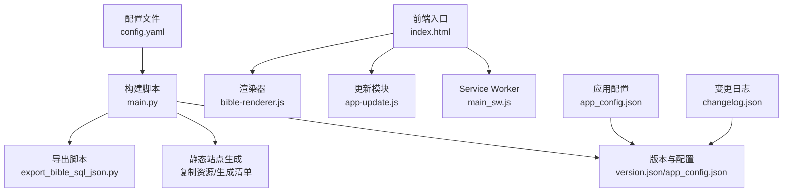
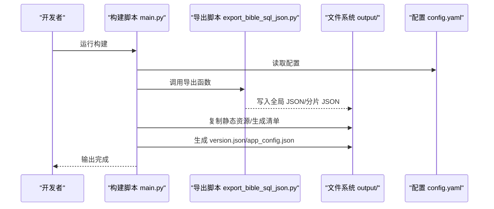
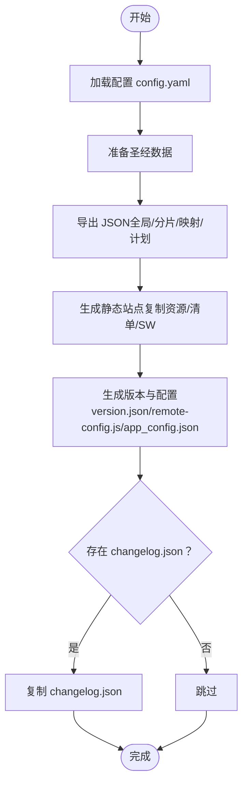
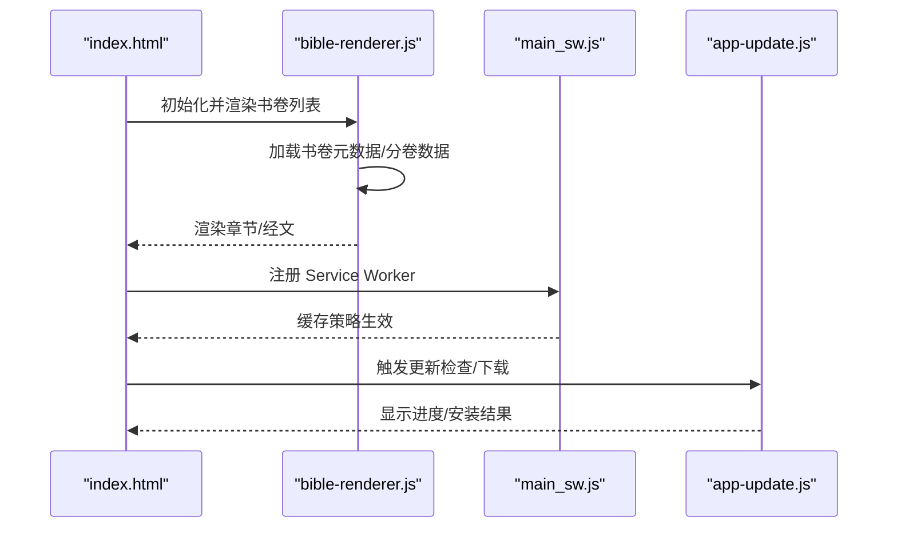
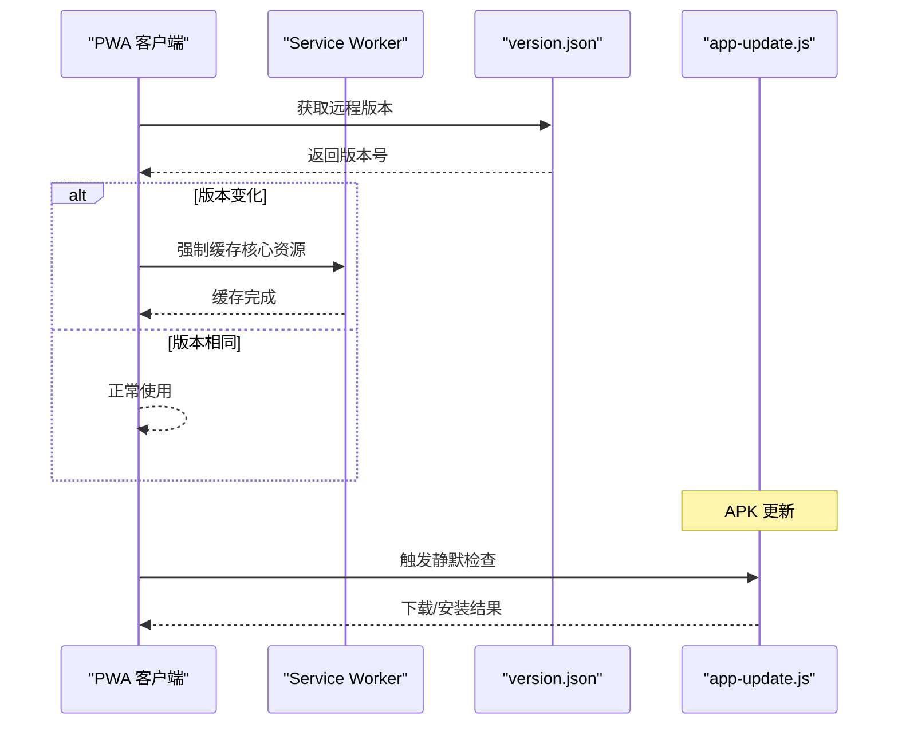
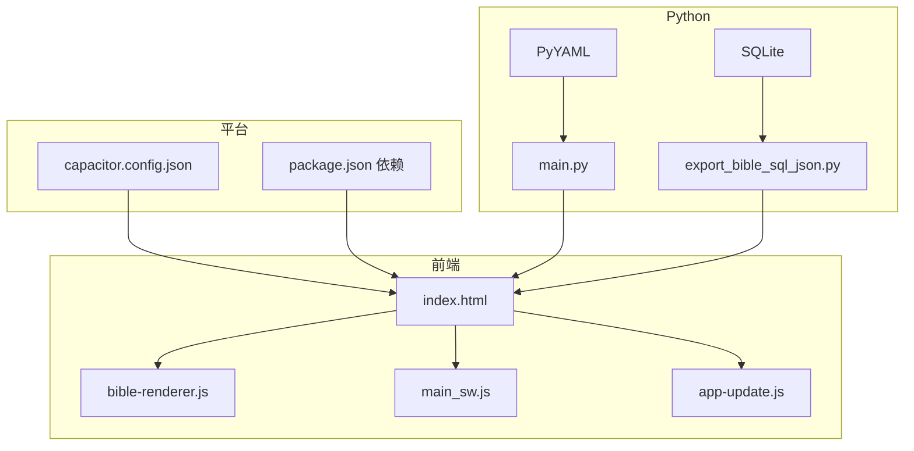

# 常见问题解答

<cite>
**本文档引用的文件**
- [main.py](file://main.py)
- [export_bible_sql_json.py](file://export_bible_sql_json.py)
- [config.yaml](file://config.yaml)
- [app_config.json](file://app_config.json)
- [changelog.json](file://changelog.json)
- [build.sh](file://build.sh)
- [capacitor.config.json](file://capacitor.config.json)
- [package.json](file://package.json)
- [requirements.txt](file://requirements.txt)
- [src/static/index.html](file://src/static/index.html)
- [src/static/js/bible-renderer.js](file://src/static/js/bible-renderer.js)
- [src/static/js/app-update.js](file://src/static/js/app-update.js)
- [src/templates/main_sw.js](file://src/templates/main_sw.js)
- [src/static/data/book-names-i18n.json](file://src/static/data/book-names-i18n.json)
- [resource/2k.json](file://resource/2k.json)
</cite>

## 目录
1. [简介](#简介)
2. [项目结构](#项目结构)
3. [核心组件](#核心组件)
4. [架构总览](#架构总览)
5. [详细组件分析](#详细组件分析)
6. [依赖关系分析](#依赖关系分析)
7. [性能考虑](#性能考虑)
8. [故障排查指南](#故障排查指南)
9. [结论](#结论)
10. [附录](#附录)

## 简介
本 FAQ 面向首次使用与持续维护“圣经阅读器”的用户与开发者，覆盖安装与使用、功能操作、数据导入导出、版本更新与迁移、配置变更、以及常见问题的诊断与解决。文档基于仓库中的构建脚本、前端渲染器、Service Worker、更新模块与配置文件进行梳理，帮助新用户快速上手，同时为维护者提供可追溯的参考。

## 项目结构
该项目采用“Python 构建 + 前端静态站点 + PWA/APK 输出”的架构：
- 构建层：通过 Python 脚本导出圣经数据、生成静态站点与版本配置。
- 前端层：PWA/SPA 结构，包含渲染器、搜索、高亮、书签、语音朗读等功能。
- 配置层：YAML/JSON 驱动的构建与运行配置，支持远程服务器与镜像地址。
- 平台层：Capacitor 集成 APK 构建与更新能力。

图表来源
- [main.py:1-361](file://main.py#L1-L361)
- [export_bible_sql_json.py:1-835](file://export_bible_sql_json.py#L1-L835)
- [src/static/index.html:1-687](file://src/static/index.html#L1-L687)
- [src/static/js/bible-renderer.js:1-880](file://src/static/js/bible-renderer.js#L1-L880)
- [src/static/js/app-update.js:1-1227](file://src/static/js/app-update.js#L1-L1227)
- [src/templates/main_sw.js:1-270](file://src/templates/main_sw.js#L1-L270)
- [config.yaml:1-12](file://config.yaml#L1-L12)
- [app_config.json:1-6](file://app_config.json#L1-L6)
- [changelog.json:1-10](file://changelog.json#L1-L10)

章节来源
- [main.py:36-161](file://main.py#L36-L161)
- [config.yaml:1-12](file://config.yaml#L1-L12)

## 核心组件
- 构建与导出
  - 导出脚本负责从 SQLite 数据库导出经文、注解、串珠、书卷映射与读经计划，并生成全局 JSON 与按书卷分片 JSON。
  - 构建脚本负责准备数据、复制静态资源、生成清单与版本配置。
- 前端渲染与交互
  - 渲染器负责书卷/章节导航、经文渲染、注解与串珠展示、历史与收藏管理。
  - Service Worker 提供缓存策略与离线体验。
  - 更新模块支持 APK 内部下载与安装。
- 配置与版本
  - YAML 配置驱动构建流程与远程服务器地址。
  - app_config.json 提供应用版本与标识。
  - changelog.json 与 version.json 记录版本信息与构建时间。

章节来源
- [export_bible_sql_json.py:743-800](file://export_bible_sql_json.py#L743-L800)
- [main.py:87-161](file://main.py#L87-L161)
- [src/static/js/bible-renderer.js:143-200](file://src/static/js/bible-renderer.js#L143-L200)
- [src/templates/main_sw.js:88-166](file://src/templates/main_sw.js#L88-L166)
- [src/static/js/app-update.js:157-200](file://src/static/js/app-update.js#L157-L200)
- [config.yaml:5-12](file://config.yaml#L5-L12)
- [app_config.json:1-6](file://app_config.json#L1-L6)
- [changelog.json:1-10](file://changelog.json#L1-L10)

## 架构总览
以下序列图展示了“构建—导出—生成—版本”四个阶段的控制流与数据流。

图表来源
- [main.py:36-161](file://main.py#L36-L161)
- [export_bible_sql_json.py:743-800](file://export_bible_sql_json.py#L743-L800)
- [config.yaml:1-12](file://config.yaml#L1-L12)

## 详细组件分析

### 组件A：构建与导出流程
- 阶段划分
  - 阶段1：准备圣经数据（调用导出脚本）
  - 阶段2：生成静态站点（复制资源、生成清单与 SW）
  - 阶段3：生成版本与配置（version.json、remote-config.js、app_config.json）
- 关键行为
  - 导出脚本根据 SQLite 表结构生成多类 JSON，包含经文、注解、串珠、书卷映射与读经计划。
  - 构建脚本对输出目录进行清理与生成，复制 changelog.json（若存在）。
  - 远程服务器配置通过 base64 编码注入到 remote-config.js，运行时解码使用。

图表来源
- [main.py:87-321](file://main.py#L87-L321)
- [export_bible_sql_json.py:743-800](file://export_bible_sql_json.py#L743-L800)
- [config.yaml:1-12](file://config.yaml#L1-L12)

章节来源
- [main.py:87-321](file://main.py#L87-L321)
- [export_bible_sql_json.py:743-800](file://export_bible_sql_json.py#L743-L800)

### 组件B：前端渲染与交互
- 渲染器职责
  - 加载书卷元数据与分卷数据，渲染书卷/章节导航。
  - 处理经文文本中的注解与串珠标记，支持点击展开。
  - 维护浏览历史、收藏与偏好设置。
- Service Worker 策略
  - 预缓存核心资源，圣经分片数据优先缓存，版本文件网络优先。
  - 支持消息查询缓存状态、批量缓存圣经分卷、清理缓存等。
- 更新模块（APK）
  - 支持应用内下载 APK、写入文件系统、触发安装。
  - 提供自动检查更新、清理遗留 APK 文件等能力。

图表来源
- [src/static/index.html:160-687](file://src/static/index.html#L160-L687)
- [src/static/js/bible-renderer.js:75-106](file://src/static/js/bible-renderer.js#L75-L106)
- [src/templates/main_sw.js:25-40](file://src/templates/main_sw.js#L25-L40)
- [src/static/js/app-update.js:157-200](file://src/static/js/app-update.js#L157-L200)

章节来源
- [src/static/js/bible-renderer.js:143-200](file://src/static/js/bible-renderer.js#L143-L200)
- [src/templates/main_sw.js:88-166](file://src/templates/main_sw.js#L88-L166)
- [src/static/js/app-update.js:157-200](file://src/static/js/app-update.js#L157-L200)

### 组件C：版本更新与迁移
- 版本信息
  - 构建时生成 version.json，包含版本号与构建时间。
  - app_config.json 提供应用版本与标识，用于 APK 与 PWA 的版本比对。
- 更新流程
  - PWA：通过 Service Worker 与本地存储对比版本，必要时强制缓存核心资源。
  - APK：通过更新模块检查远程版本，下载并安装新 APK。
- 迁移建议
  - 新增字段或结构变更时，建议在 changelog.json 中记录，并在构建脚本中同步生成 changelog.json 到输出目录。

图表来源
- [main.py:288-321](file://main.py#L288-L321)
- [src/static/index.html:522-595](file://src/static/index.html#L522-L595)
- [src/static/js/app-update.js:157-200](file://src/static/js/app-update.js#L157-L200)

章节来源
- [main.py:288-321](file://main.py#L288-L321)
- [src/static/index.html:522-595](file://src/static/index.html#L522-L595)
- [app_config.json:1-6](file://app_config.json#L1-L6)
- [changelog.json:1-10](file://changelog.json#L1-L10)

## 依赖关系分析
- Python 依赖
  - 构建脚本依赖 PyYAML 以解析配置文件。
  - 导出脚本依赖 SQLite 与 JSON，无需外部框架。
- 前端依赖
  - 通过 npm 脚本集成 Capacitor 生态（App、Filesystem、Status Bar 等）。
  - 前端脚本按需加载，核心资源通过 Service Worker 缓存。
- 平台依赖
  - Capacitor 配置指向输出目录，允许混合内容与调试选项。

图表来源
- [requirements.txt:1-2](file://requirements.txt#L1-L2)
- [main.py:78-83](file://main.py#L78-L83)
- [export_bible_sql_json.py:16-26](file://export_bible_sql_json.py#L16-L26)
- [package.json:12-22](file://package.json#L12-L22)
- [capacitor.config.json:1-10](file://capacitor.config.json#L1-L10)

章节来源
- [requirements.txt:1-2](file://requirements.txt#L1-L2)
- [package.json:12-22](file://package.json#L12-L22)
- [capacitor.config.json:1-10](file://capacitor.config.json#L1-L10)

## 性能考虑
- 数据加载
  - 分卷 JSON 按书卷拆分，减少首屏加载压力；回退逻辑在资源缺失时自动降级。
- 缓存策略
  - 圣经分片数据优先缓存，提升离线可用性；版本文件网络优先，保证更新及时性。
- 更新与安装
  - APK 下载支持流式进度与速率统计；安装前清理遗留文件，避免磁盘占用。
- 构建优化
  - 导出阶段对 JSON 去缩进，降低包体体积；构建阶段排除训练相关脚本，减少输出冗余。

章节来源
- [src/static/js/bible-renderer.js:85-106](file://src/static/js/bible-renderer.js#L85-L106)
- [src/templates/main_sw.js:108-125](file://src/templates/main_sw.js#L108-L125)
- [src/static/js/app-update.js:21-119](file://src/static/js/app-update.js#L21-L119)
- [main.py:107-116](file://main.py#L107-L116)

## 故障排查指南
- 构建失败
  - 症状：找不到配置文件或数据库。
  - 排查：确认 config.yaml 与 CG.db 路径正确；检查 requirements.txt 依赖是否安装。
  - 参考
    - [main.py:78-83](file://main.py#L78-L83)
    - [main.py:89-96](file://main.py#L89-L96)
    - [requirements.txt:1-2](file://requirements.txt#L1-L2)
- 导出异常
  - 症状：导出 JSON 缺失或为空。
  - 排查：确认 SQLite 表存在且有数据；检查导出脚本的预加载与写入逻辑。
  - 参考
    - [export_bible_sql_json.py:743-800](file://export_bible_sql_json.py#L743-L800)
- PWA 缓存问题
  - 症状：离线不可用或版本不更新。
  - 排查：检查 Service Worker 是否注册成功；验证核心资源是否被缓存；确认版本文件网络优先策略。
  - 参考
    - [src/templates/main_sw.js:25-40](file://src/templates/main_sw.js#L25-L40)
    - [src/static/index.html:556-595](file://src/static/index.html#L556-L595)
- APK 更新失败
  - 症状：无法下载或安装失败。
  - 排查：确认远程服务器可达；检查 Capacitor Filesystem 权限；清理遗留 APK 文件后重试。
  - 参考
    - [src/static/js/app-update.js:157-200](file://src/static/js/app-update.js#L157-L200)
    - [src/static/js/app-update.js:181-200](file://src/static/js/app-update.js#L181-L200)
- 功能操作问题
  - 症状：书卷导航/搜索/高亮无效。
  - 排查：确认 index.html 中脚本加载顺序；检查渲染器是否初始化；查看控制台是否有错误。
  - 参考
    - [src/static/index.html:166-198](file://src/static/index.html#L166-L198)
    - [src/static/js/bible-renderer.js:143-200](file://src/static/js/bible-renderer.js#L143-L200)

章节来源
- [main.py:78-96](file://main.py#L78-L96)
- [export_bible_sql_json.py:743-800](file://export_bible_sql_json.py#L743-L800)
- [src/templates/main_sw.js:25-40](file://src/templates/main_sw.js#L25-L40)
- [src/static/index.html:556-595](file://src/static/index.html#L556-L595)
- [src/static/js/app-update.js:157-200](file://src/static/js/app-update.js#L157-L200)
- [src/static/js/bible-renderer.js:143-200](file://src/static/js/bible-renderer.js#L143-L200)

## 结论
本 FAQ 基于仓库实际实现，覆盖了从构建、导出、前端渲染到更新与故障排查的关键路径。建议在版本更新时同步完善 changelog.json 与 app_config.json，并在构建脚本中保留必要的配置注入与资源复制步骤，以确保新老版本的平滑过渡与稳定运行。

## 附录
- 快速索引
  - 安装与构建：参考构建脚本与依赖安装说明
    - [build.sh:1-16](file://build.sh#L1-L16)
    - [requirements.txt:1-2](file://requirements.txt#L1-L2)
  - 配置与版本：参考 YAML 与 JSON 配置文件
    - [config.yaml:1-12](file://config.yaml#L1-L12)
    - [app_config.json:1-6](file://app_config.json#L1-L6)
  - 数据导入导出：参考导出脚本与资源文件
    - [export_bible_sql_json.py:743-800](file://export_bible_sql_json.py#L743-L800)
    - [resource/2k.json:1-200](file://resource/2k.json#L1-L200)
  - 前端功能：参考入口与核心脚本
    - [src/static/index.html:160-687](file://src/static/index.html#L160-L687)
    - [src/static/js/bible-renderer.js:143-200](file://src/static/js/bible-renderer.js#L143-L200)
  - 更新与缓存：参考 Service Worker 与更新模块
    - [src/templates/main_sw.js:88-166](file://src/templates/main_sw.js#L88-L166)
    - [src/static/js/app-update.js:157-200](file://src/static/js/app-update.js#L157-L200)
  - 平台集成：参考 Capacitor 配置
    - [capacitor.config.json:1-10](file://capacitor.config.json#L1-L10)
    - [package.json:12-22](file://package.json#L12-L22)