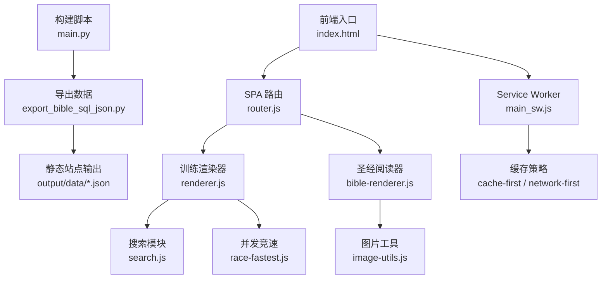
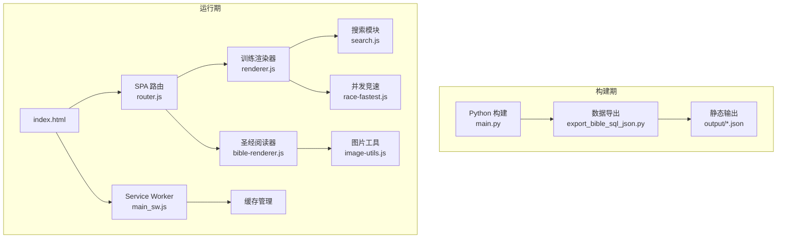
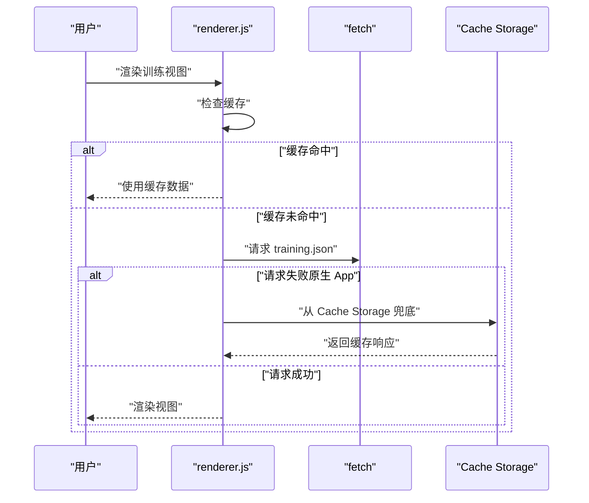
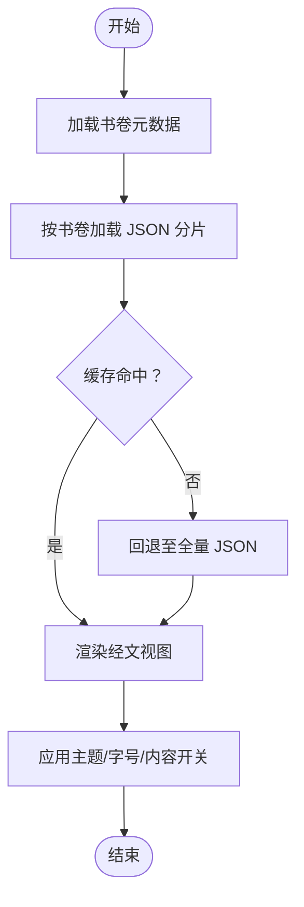
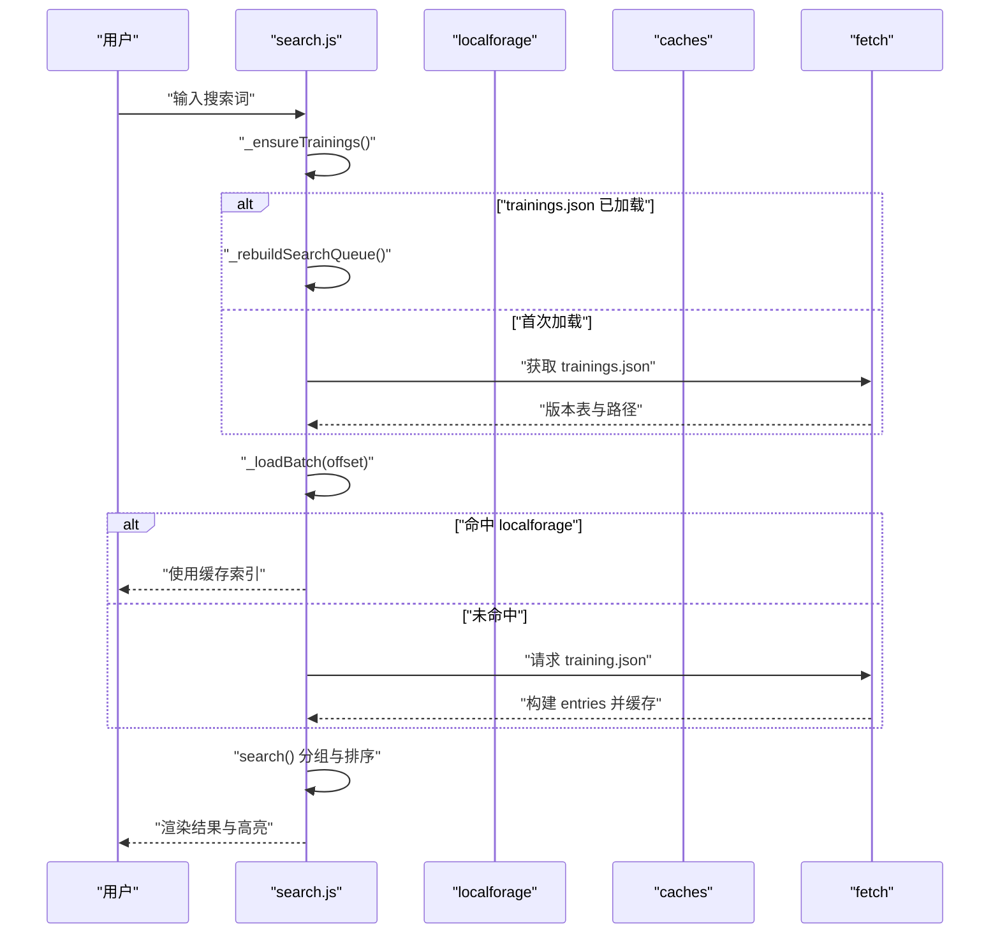
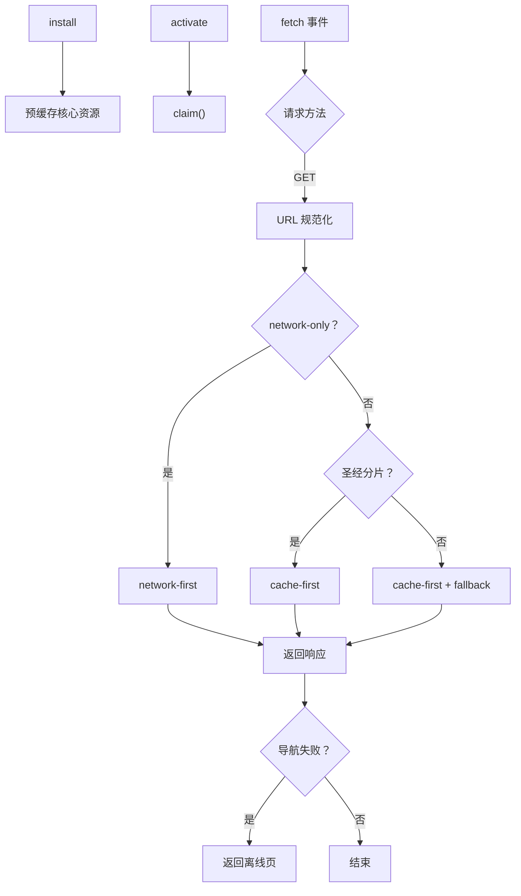
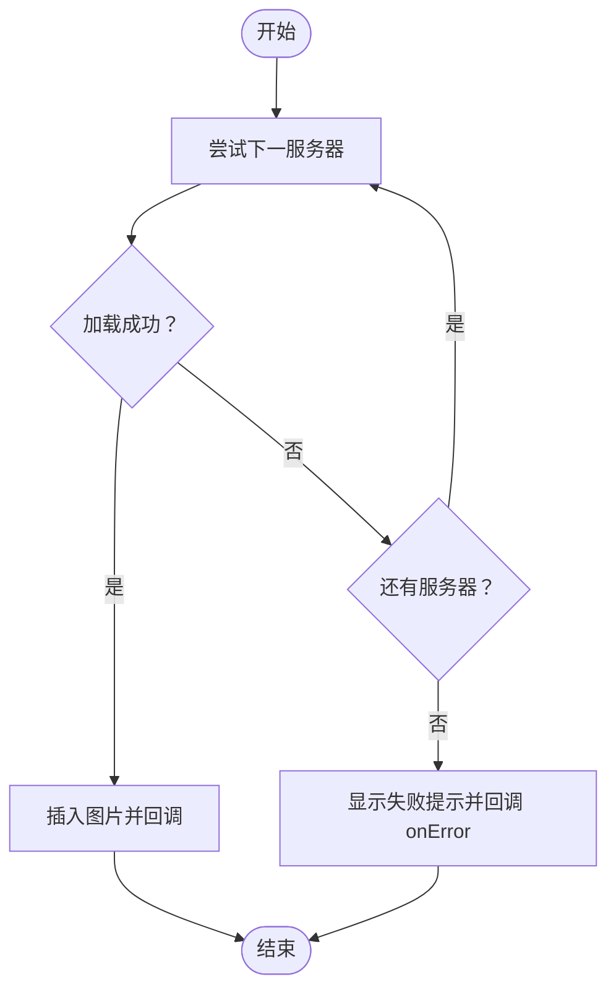
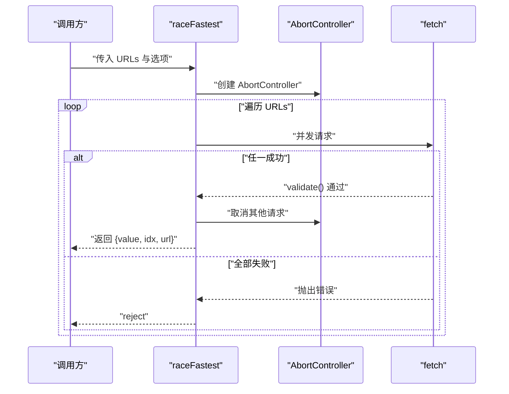
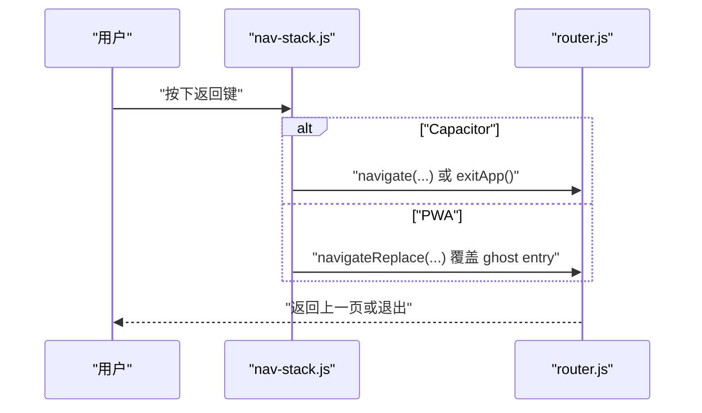
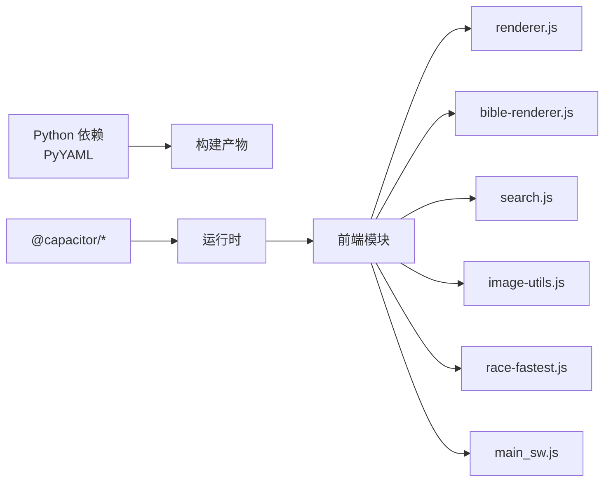

# 性能问题

<cite>
**本文档引用的文件**
- [main.py](file://main.py)
- [export_bible_sql_json.py](file://export_bible_sql_json.py)
- [renderer.js](file://src/static/js/renderer.js)
- [bible-renderer.js](file://src/static/js/bible-renderer.js)
- [search.js](file://src/static/js/search.js)
- [router.js](file://src/static/js/router.js)
- [nav-stack.js](file://src/static/js/nav-stack.js)
- [image-utils.js](file://src/static/js/image-utils.js)
- [race-fastest.js](file://src/static/js/race-fastest.js)
- [main_sw.js](file://src/templates/main_sw.js)
- [package.json](file://package.json)
- [requirements.txt](file://requirements.txt)
</cite>

## 目录
1. [简介](#简介)
2. [项目结构](#项目结构)
3. [核心组件](#核心组件)
4. [架构总览](#架构总览)
5. [详细组件分析](#详细组件分析)
6. [依赖分析](#依赖分析)
7. [性能考量](#性能考量)
8. [故障排查指南](#故障排查指南)
9. [结论](#结论)
10. [附录](#附录)

## 简介
本文件聚焦于该圣经阅读器项目的性能问题诊断与优化，涵盖应用启动、页面渲染、内存占用等常见问题，并结合现有代码实现，提出可落地的优化策略与监控建议。重点包括：
- 启动缓慢：构建脚本耗时、SW 预缓存、数据加载与路由初始化
- 页面渲染卡顿：大数据量渲染（经文、纲目、晨读）、DOM 操作与滚动
- 内存占用过高：缓存策略、搜索索引、划线笔记存储、图片加载
- 大数据量渲染优化：虚拟滚动、懒加载、数据分片
- 资源加载优化：Service Worker 缓存、并发竞速、图片降级
- 性能监控与移动端优化：PWA、返回栈、导航与手势

## 项目结构
该项目采用“Python 构建 + 前端静态资源 + PWA Service Worker”的混合架构：
- 构建阶段：Python 脚本导出经文数据并生成静态站点
- 运行阶段：前端 SPA 路由 + 多模块渲染器 + SW 缓存
- 资源组织：按书卷分片的 JSON 数据，配合 SW 缓存与降级策略

**图表来源**
- [main.py:36-117](file://main.py#L36-L117)
- [export_bible_sql_json.py:743-800](file://export_bible_sql_json.py#L743-L800)
- [router.js:16-153](file://src/static/js/router.js#L16-L153)
- [renderer.js:41-103](file://src/static/js/renderer.js#L41-L103)
- [bible-renderer.js:70-106](file://src/static/js/bible-renderer.js#L70-L106)
- [search.js:180-186](file://src/static/js/search.js#L180-L186)
- [image-utils.js:10-56](file://src/static/js/image-utils.js#L10-L56)
- [race-fastest.js:17-122](file://src/static/js/race-fastest.js#L17-L122)
- [main_sw.js:6-19](file://src/templates/main_sw.js#L6-L19)

**章节来源**
- [main.py:36-117](file://main.py#L36-L117)
- [export_bible_sql_json.py:551-596](file://export_bible_sql_json.py#L551-L596)
- [router.js:16-153](file://src/static/js/router.js#L16-L153)
- [main_sw.js:6-19](file://src/templates/main_sw.js#L6-L19)

## 核心组件
- 构建与数据导出：负责将 SQLite 数据导出为分片 JSON，并进行去缩进压缩，减少打包体积
- SPA 路由：统一 hash 路由，支持同书卷章节切换与跨层级跳转，避免历史条目膨胀
- 训练渲染器：从 training.json 渲染多视图（纲目、听抄、详情、诗歌、职事、晨读），具备缓存与降级策略
- 圣经阅读器：按书卷分片加载 JSON，支持主题、字号、内容开关等设置，具备缓存与回退机制
- 搜索模块：索引懒加载、分批加载、段落级定位，支持本地存储与 SW 缓存
- 图片工具：多服务器降级加载、查看器、手势缩放与分享
- 并发竞速：多源并发请求，首个成功即胜，支持超时与取消
- Service Worker：预缓存核心资源、圣经数据 cache-first、版本文件 network-first、导航失败离线页

**章节来源**
- [main.py:87-117](file://main.py#L87-L117)
- [export_bible_sql_json.py:551-596](file://export_bible_sql_json.py#L551-L596)
- [router.js:223-282](file://src/static/js/router.js#L223-L282)
- [renderer.js:41-103](file://src/static/js/renderer.js#L41-L103)
- [bible-renderer.js:75-106](file://src/static/js/bible-renderer.js#L75-L106)
- [search.js:180-186](file://src/static/js/search.js#L180-L186)
- [image-utils.js:10-56](file://src/static/js/image-utils.js#L10-L56)
- [race-fastest.js:17-122](file://src/static/js/race-fastest.js#L17-L122)
- [main_sw.js:6-19](file://src/templates/main_sw.js#L6-L19)

## 架构总览
整体架构围绕“构建期数据分片 + 运行期按需加载 + SW 缓存”展开，路由与渲染器分离，搜索与图片工具模块化，便于性能优化与监控。

**图表来源**
- [main.py:36-117](file://main.py#L36-L117)
- [export_bible_sql_json.py:743-800](file://export_bible_sql_json.py#L743-L800)
- [router.js:16-153](file://src/static/js/router.js#L16-L153)
- [renderer.js:41-103](file://src/static/js/renderer.js#L41-L103)
- [bible-renderer.js:75-106](file://src/static/js/bible-renderer.js#L75-L106)
- [search.js:180-186](file://src/static/js/search.js#L180-L186)
- [image-utils.js:10-56](file://src/static/js/image-utils.js#L10-L56)
- [race-fastest.js:17-122](file://src/static/js/race-fastest.js#L17-L122)
- [main_sw.js:6-19](file://src/templates/main_sw.js#L6-L19)

## 详细组件分析

### 训练渲染器（renderer.js）
- 数据加载与缓存：按 batchPath 缓存 training.json，Capacitor 原生 App 通过时间戳绕过 WebView 缓存，SW 失败时从 Cache Storage 兜底
- 视图渲染：支持 cv（纲目）、h（听抄）、ts（详情）、sg（诗歌）、zs（职事）、cx（晨读）视图，具备递归渲染与上下文传播
- 晨读翻页：使用 transform 与 requestAnimationFrame 控制容器高度，避免滚动裁剪与高度抖动
- 性能要点：缓存命中优先、异步提取搜索缓存、滚动位置记忆、容器高度动态更新

**图表来源**
- [renderer.js:41-103](file://src/static/js/renderer.js#L41-L103)
- [renderer.js:674-799](file://src/static/js/renderer.js#L674-L799)

**章节来源**
- [renderer.js:41-103](file://src/static/js/renderer.js#L41-L103)
- [renderer.js:361-466](file://src/static/js/renderer.js#L361-L466)
- [renderer.js:561-672](file://src/static/js/renderer.js#L561-L672)
- [renderer.js:674-799](file://src/static/js/renderer.js#L674-L799)

### 圣经阅读器（bible-renderer.js）
- 数据加载：按书卷分片加载 JSON，回退至全量 JSON，具备缓存与错误回退
- 渲染控制：主题、字号、内容开关（注解、串珠、纲目、脚注、分节线）持久化到 localStorage
- 经文渲染：处理 {N} 注解与 [a] 串珠标记，支持注解与串珠弹窗
- 性能要点：分片加载、缓存命中、开关控制减少 DOM 与样式复杂度

**图表来源**
- [bible-renderer.js:75-106](file://src/static/js/bible-renderer.js#L75-L106)
- [bible-renderer.js:324-399](file://src/static/js/bible-renderer.js#L324-L399)

**章节来源**
- [bible-renderer.js:75-106](file://src/static/js/bible-renderer.js#L75-L106)
- [bible-renderer.js:324-399](file://src/static/js/bible-renderer.js#L324-L399)
- [bible-renderer.js:420-474](file://src/static/js/bible-renderer.js#L420-L474)

### 搜索模块（search.js）
- 索引懒加载：按批次加载 training.json，构建段落级 entries，支持本地存储缓存
- 搜索算法：多关键词 AND 子串匹配，按训练分组与章节优先级排序
- 结果展示：每训练最多显示固定条数，支持“查看更多”
- 性能要点：分批加载、缓存重建队列、SW 缓存过滤、段落级定位与高亮

**图表来源**
- [search.js:188-244](file://src/static/js/search.js#L188-L244)
- [search.js:309-358](file://src/static/js/search.js#L309-L358)
- [search.js:360-461](file://src/static/js/search.js#L360-L461)

**章节来源**
- [search.js:188-244](file://src/static/js/search.js#L188-L244)
- [search.js:309-358](file://src/static/js/search.js#L309-L358)
- [search.js:360-461](file://src/static/js/search.js#L360-L461)

### Service Worker（main_sw.js）
- 预缓存：首页、manifest、version、书卷元数据
- 缓存策略：圣经分片 cache-first，版本文件 network-first，其他 cache-first + network fallback
- 导航失败：返回离线页
- 工具消息：清理缓存、批量缓存圣经分片、查询缓存状态

**图表来源**
- [main_sw.js:25-40](file://src/templates/main_sw.js#L25-L40)
- [main_sw.js:88-166](file://src/templates/main_sw.js#L88-L166)
- [main_sw.js:176-270](file://src/templates/main_sw.js#L176-L270)

**章节来源**
- [main_sw.js:25-40](file://src/templates/main_sw.js#L25-L40)
- [main_sw.js:88-166](file://src/templates/main_sw.js#L88-L166)
- [main_sw.js:176-270](file://src/templates/main_sw.js#L176-L270)

### 图片工具（image-utils.js）
- 多服务器降级加载：失败自动尝试下一个服务器，支持缓存戳与回调
- 图片查看器：单图/多图模式，手势缩放、双击还原、分享与保存
- 性能要点：按需加载、错误回退、手势优化

**图表来源**
- [image-utils.js:14-56](file://src/static/js/image-utils.js#L14-L56)

**章节来源**
- [image-utils.js:14-56](file://src/static/js/image-utils.js#L14-L56)
- [image-utils.js:297-398](file://src/static/js/image-utils.js#L297-L398)

### 并发竞速（race-fastest.js）
- 多源并发请求，首个成功即胜，支持超时与取消
- 适用场景：多服务器图片加载、资源下载

**图表来源**
- [race-fastest.js:20-117](file://src/static/js/race-fastest.js#L20-L117)

**章节来源**
- [race-fastest.js:20-117](file://src/static/js/race-fastest.js#L20-L117)

### SPA 路由与返回栈（router.js + nav-stack.js）
- 路由：hash 路由，支持同章节视图切换 replaceState，跨层级跳转新增历史
- 返回栈：统一处理 Capacitor 与 PWA 的返回键，过滤启动后虚假 popstate，显式层级跳转

**图表来源**
- [nav-stack.js:77-134](file://src/static/js/nav-stack.js#L77-L134)
- [router.js:233-274](file://src/static/js/router.js#L233-L274)

**章节来源**
- [router.js:223-282](file://src/static/js/router.js#L223-L282)
- [nav-stack.js:77-134](file://src/static/js/nav-stack.js#L77-L134)

## 依赖分析
- 构建依赖：PyYAML（用于 config.yaml）
- 运行时依赖：Capacitor 生态（App、FileSystem、StatusBar 等），用于原生能力与 PWA 集成
- 前端模块：模块间低耦合，通过 window 全局暴露接口（如 CX、CXBible、CXRouter）

**图表来源**
- [requirements.txt:1-2](file://requirements.txt#L1-L2)
- [package.json:12-23](file://package.json#L12-L23)

**章节来源**
- [requirements.txt:1-2](file://requirements.txt#L1-L2)
- [package.json:12-23](file://package.json#L12-L23)

## 性能考量
- 启动性能
  - 构建阶段：Python 脚本打印耗时，建议在 CI 中记录构建时间趋势
  - SW 预缓存：预缓存核心资源，减少首屏等待
  - 路由与渲染器：路由初始化时滚动到顶部，避免历史条目过多导致回退卡顿
- 渲染性能
  - 大数据量：按书卷分片加载，避免一次性加载全量 JSON
  - DOM 操作：使用 requestAnimationFrame 控制滚动与高度更新，减少重排
  - 视图切换：同章节视图切换使用 replaceState，避免历史条目膨胀
- 内存占用
  - 搜索索引：分批加载与缓存，避免同时持有大量 entries
  - 划线笔记：IndexedDB/LocalStorage 存储，按页隔离，支持迁移与清理
  - 图片加载：多服务器降级与缓存戳，避免重复下载
- 资源加载
  - SW 缓存策略：圣经分片 cache-first，版本文件 network-first，导航失败离线页
  - 并发竞速：多源并发请求，提升弱网环境下的加载稳定性

[本节为通用指导，无需特定文件引用]

## 故障排查指南
- 应用启动缓慢
  - 检查构建日志耗时，关注数据导出与静态复制阶段
  - 确认 SW 预缓存是否成功，核对核心资源是否命中
- 页面渲染卡顿
  - 查看路由日志，确认是否频繁触发 hashchange
  - 检查渲染器缓存与降级逻辑，确认 training.json 是否命中缓存
- 内存占用过高
  - 搜索模块：确认分批加载与缓存是否生效，避免同时加载过多训练
  - 划线笔记：定期清理 IndexedDB/LocalStorage，避免数据膨胀
- 资源加载失败
  - 检查 SW 缓存状态与离线页返回
  - 使用并发竞速工具测试多服务器可用性

**章节来源**
- [main.py:46-75](file://main.py#L46-L75)
- [main_sw.js:176-270](file://src/templates/main_sw.js#L176-L270)
- [search.js:283-280](file://src/static/js/search.js#L283-L280)
- [router.js:84-93](file://src/static/js/router.js#L84-L93)

## 结论
通过数据分片、SW 缓存、路由与渲染器优化、搜索懒加载与图片降级等手段，可在不牺牲用户体验的前提下显著改善启动与渲染性能。建议在 CI 中持续监控构建耗时与 SW 缓存命中率，并针对移动端返回键与手势交互进行专项优化。

[本节为总结，无需特定文件引用]

## 附录
- 性能监控建议
  - 构建阶段：记录构建耗时与输出文件大小
  - 运行阶段：记录路由切换耗时、渲染器缓存命中率、搜索索引加载耗时、图片加载成功率
- 移动端优化
  - 返回键：统一 nav-stack 处理，过滤启动后虚假事件
  - 手势：图片查看器与晨读翻页使用被动事件与 transform，避免主线程阻塞
  - PWA：合理设置 SW 缓存策略，提供离线页与更新提示

[本节为通用指导，无需特定文件引用]