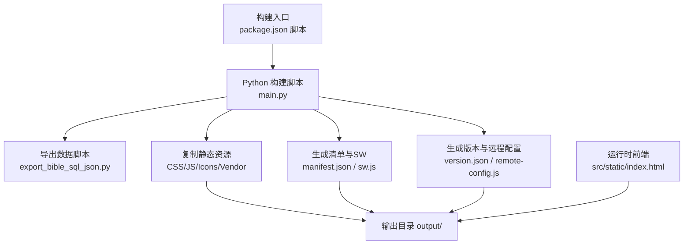
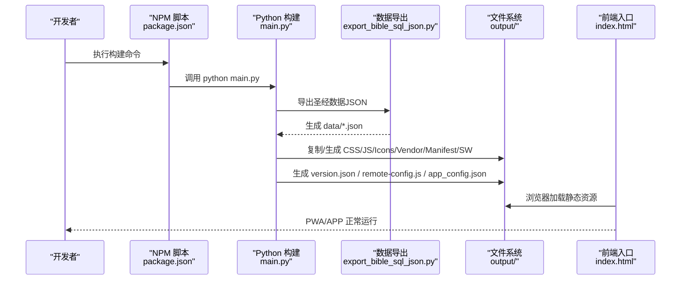
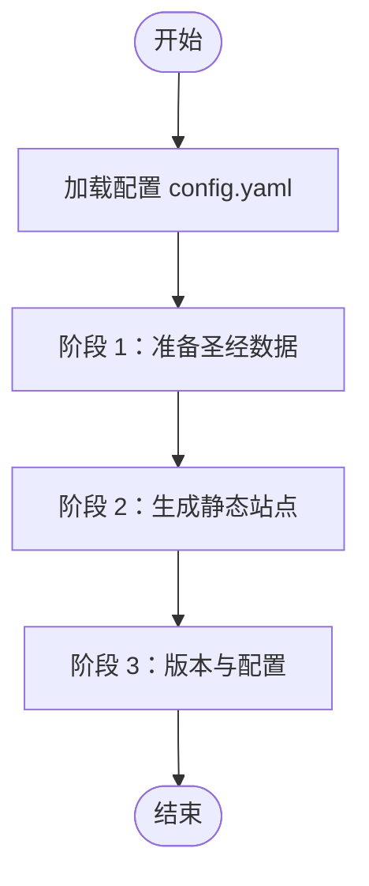
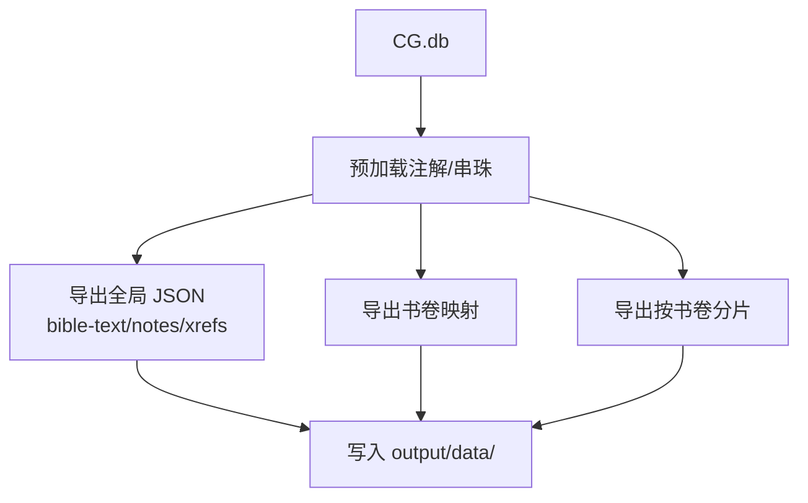
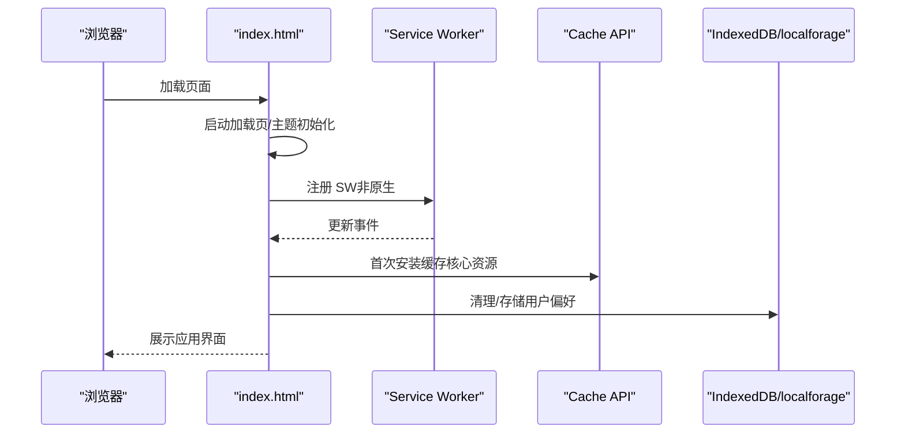
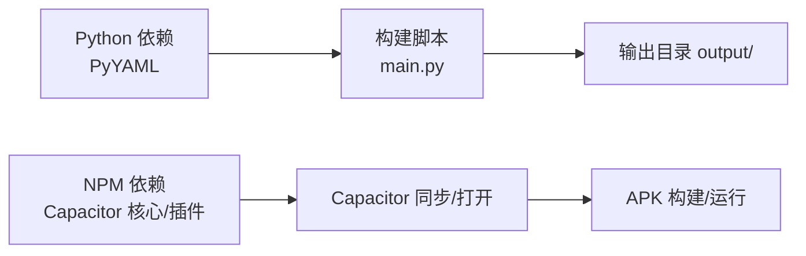

# 故障排除与常见问题

<cite>
**本文引用的文件**
- [package.json](file://package.json)
- [requirements.txt](file://requirements.txt)
- [capacitor.config.json](file://capacitor.config.json)
- [app_config.json](file://app_config.json)
- [config.yaml](file://config.yaml)
- [main.py](file://main.py)
- [build.sh](file://build.sh)
- [export_bible_sql_json.py](file://export_bible_sql_json.py)
- [src/static/index.html](file://src/static/index.html)
</cite>

## 目录
1. [简介](#简介)
2. [项目结构](#项目结构)
3. [核心组件](#核心组件)
4. [架构总览](#架构总览)
5. [详细组件分析](#详细组件分析)
6. [依赖分析](#依赖分析)
7. [性能考虑](#性能考虑)
8. [故障排除指南](#故障排除指南)
9. [结论](#结论)
10. [附录](#附录)

## 简介
本文件面向圣经阅读器项目的开发者与运维人员，系统性地梳理构建、运行与发布过程中的常见问题与解决方案，覆盖构建失败、依赖冲突、配置错误、运行时诊断、性能排查、版本升级与迁移、用户反馈问题以及调试工具使用等。内容基于仓库现有脚本与配置文件进行归纳总结，并提供可操作的定位步骤与修复建议。

## 项目结构
项目采用“Python 构建脚本 + 前端静态资源 + 配置文件”的组织方式：
- 构建与发布：通过 Python 脚本执行三阶段构建，生成 PWA/APK 静态站点产物
- 前端资源：HTML/CSS/JS/Icons/模板与 Service Worker
- 配置：YAML 配置、Capacitor 配置、应用版本配置
- 依赖：Node/NPM 脚本与 Python 依赖

图表来源
- [package.json:1-24](file://package.json#L1-L24)
- [main.py:36-76](file://main.py#L36-L76)
- [main.py:121-161](file://main.py#L121-L161)
- [main.py:288-321](file://main.py#L288-L321)
- [src/static/index.html:166-200](file://src/static/index.html#L166-L200)

章节来源
- [package.json:1-24](file://package.json#L1-L24)
- [main.py:36-76](file://main.py#L36-L76)
- [config.yaml:1-12](file://config.yaml#L1-L12)

## 核心组件
- 构建脚本（main.py）
  - 三阶段构建：准备圣经数据、生成静态站点、生成版本与远程配置
  - 输出目录、资源复制、清单与 SW 生成、版本信息注入
- 导出脚本（export_bible_sql_json.py）
  - 从 SQLite 数据库导出多类 JSON 数据，包含经文、注解、串珠、书卷映射与分卷文件
- 配置文件
  - config.yaml：输出目录、静态资源目录、数据库路径、读经计划与远程服务器
  - capacitor.config.json：Capacitor 应用 ID、应用名、Web 目录、Android 选项
  - app_config.json：应用名、ID、版本
  - requirements.txt：Python 依赖（PyYAML）
  - package.json：NPM 脚本（构建、同步 Capacitor、打包 APK）

章节来源
- [main.py:78-83](file://main.py#L78-L83)
- [main.py:87-117](file://main.py#L87-L117)
- [main.py:121-161](file://main.py#L121-L161)
- [main.py:288-321](file://main.py#L288-L321)
- [export_bible_sql_json.py:743-792](file://export_bible_sql_json.py#L743-L792)
- [config.yaml:1-12](file://config.yaml#L1-L12)
- [capacitor.config.json:1-10](file://capacitor.config.json#L1-L10)
- [app_config.json:1-6](file://app_config.json#L1-L6)
- [requirements.txt:1-2](file://requirements.txt#L1-L2)
- [package.json:1-24](file://package.json#L1-L24)

## 架构总览
从构建到运行的关键流程如下：

图表来源
- [package.json:5-10](file://package.json#L5-L10)
- [main.py:36-76](file://main.py#L36-L76)
- [main.py:87-117](file://main.py#L87-L117)
- [main.py:121-161](file://main.py#L121-L161)
- [main.py:288-321](file://main.py#L288-L321)
- [src/static/index.html:166-200](file://src/static/index.html#L166-L200)

## 详细组件分析

### 构建脚本（main.py）分析
- 阶段划分清晰，便于分步定位问题
- 对输出目录、静态资源复制、清单与 SW 生成、版本与远程配置生成均有明确逻辑
- 对缺失文件（如数据库、模板）有显式错误提示与退出机制

图表来源
- [main.py:36-76](file://main.py#L36-L76)
- [main.py:87-117](file://main.py#L87-L117)
- [main.py:121-161](file://main.py#L121-L161)
- [main.py:288-321](file://main.py#L288-L321)

章节来源
- [main.py:36-76](file://main.py#L36-L76)
- [main.py:87-117](file://main.py#L87-L117)
- [main.py:121-161](file://main.py#L121-L161)
- [main.py:288-321](file://main.py#L288-L321)

### 数据导出脚本（export_bible_sql_json.py）分析
- 从 SQLite 导出多类 JSON，包含经文、注解、串珠、书卷映射与分卷文件
- 支持串珠归一化、书卷别称映射、注解位置标记等复杂逻辑
- 包含文件大小统计，便于评估体积与优化

图表来源
- [export_bible_sql_json.py:743-792](file://export_bible_sql_json.py#L743-L792)
- [export_bible_sql_json.py:459-529](file://export_bible_sql_json.py#L459-L529)
- [export_bible_sql_json.py:533-549](file://export_bible_sql_json.py#L533-L549)
- [export_bible_sql_json.py:553-596](file://export_bible_sql_json.py#L553-L596)

章节来源
- [export_bible_sql_json.py:743-792](file://export_bible_sql_json.py#L743-L792)
- [export_bible_sql_json.py:459-529](file://export_bible_sql_json.py#L459-L529)
- [export_bible_sql_json.py:533-549](file://export_bible_sql_json.py#L533-L549)
- [export_bible_sql_json.py:553-596](file://export_bible_sql_json.py#L553-L596)

### 前端入口（index.html）分析
- 统一的启动加载页、主题色设置、伪装检测、PWA 安装与缓存策略
- Service Worker 注册与更新、离线横幅、强制安装缓存流程
- 页面记忆与恢复、开发者模式开关、清理缓存与 IndexedDB

图表来源
- [src/static/index.html:110-123](file://src/static/index.html#L110-L123)
- [src/static/index.html:557-595](file://src/static/index.html#L557-L595)
- [src/static/index.html:476-521](file://src/static/index.html#L476-L521)
- [src/static/index.html:602-623](file://src/static/index.html#L602-L623)

章节来源
- [src/static/index.html:110-123](file://src/static/index.html#L110-L123)
- [src/static/index.html:557-595](file://src/static/index.html#L557-L595)
- [src/static/index.html:476-521](file://src/static/index.html#L476-L521)
- [src/static/index.html:602-623](file://src/static/index.html#L602-L623)

## 依赖分析
- Python 依赖：PyYAML（用于安全解析 YAML 配置）
- NPM 依赖：Capacitor 核心与插件（App、Filesystem、StatusBar）、Android 平台与 CLI
- 构建链路：NPM 脚本驱动 Python 构建，再由 Capacitor 同步到 Android 工程

图表来源
- [requirements.txt:1-2](file://requirements.txt#L1-L2)
- [package.json:12-22](file://package.json#L12-L22)
- [package.json:7-10](file://package.json#L7-L10)
- [capacitor.config.json:1-10](file://capacitor.config.json#L1-L10)

章节来源
- [requirements.txt:1-2](file://requirements.txt#L1-L2)
- [package.json:12-22](file://package.json#L12-L22)
- [package.json:7-10](file://package.json#L7-L10)
- [capacitor.config.json:1-10](file://capacitor.config.json#L1-L10)

## 性能考虑
- 构建体积优化
  - 在构建阶段对全局 JSON 进行去缩进压缩，减少打包体积
  - 排除训练相关 JS 文件，避免冗余资源进入 PWA/APK
- 运行时性能
  - PWA 缓存核心资源，首次安装时静默填充 Cache API，降低首开延迟
  - 分卷 JSON 按书卷拆分，有利于按需加载与内存占用控制
- 建议
  - 控制静态资源体积，合理拆分与懒加载
  - 使用浏览器性能面板监控渲染与主线程占用
  - 对大文件采用 CDN 或分包策略

章节来源
- [main.py:107-116](file://main.py#L107-L116)
- [main.py:186-204](file://main.py#L186-L204)
- [export_bible_sql_json.py:553-596](file://export_bible_sql_json.py#L553-L596)
- [src/static/index.html:476-521](file://src/static/index.html#L476-L521)

## 故障排除指南

### 一、构建失败
- 症状
  - 构建脚本报错退出、输出目录为空、缺少关键文件
- 常见原因与解决
  - 缺少数据库文件
    - 现象：阶段 1 报错，提示数据库不存在
    - 处理：确认 config.yaml 中 bible_db 路径正确，数据库文件存在
    - 参考：[main.py:93-96](file://main.py#L93-L96)，[config.yaml:4](file://config.yaml#L4)
  - 缺失模板或资源
    - 现象：阶段 2 生成清单/服务工作线程时报模板不存在
    - 处理：确认 src/templates 下模板文件存在，或修正模板路径
    - 参考：[main.py:251-253](file://main.py#L251-L253)，[main.py:272-274](file://main.py#L272-L274)
  - Python 依赖未安装
    - 现象：运行 python main.py 报模块导入错误
    - 处理：执行 pip install -r requirements.txt
    - 参考：[requirements.txt:1-2](file://requirements.txt#L1-L2)，[build.sh:9](file://build.sh#L9)
  - NPM 脚本执行失败
    - 现象：npm run build 或 android:* 失败
    - 处理：检查 Node/npm 版本与网络；确保 Python 环境可用
    - 参考：[package.json:5-10](file://package.json#L5-L10)

章节来源
- [main.py:93-96](file://main.py#L93-L96)
- [main.py:251-253](file://main.py#L251-L253)
- [main.py:272-274](file://main.py#L272-L274)
- [requirements.txt:1-2](file://requirements.txt#L1-L2)
- [build.sh:9](file://build.sh#L9)
- [package.json:5-10](file://package.json#L5-L10)

### 二、依赖冲突与环境问题
- 症状
  - 构建时提示版本冲突、模块找不到
- 建议
  - 使用虚拟环境隔离 Python 依赖
  - 清理 NPM 缓存后重试安装
  - 确认 Capacitor CLI 与平台版本一致
- 参考
  - [package.json:19-22](file://package.json#L19-L22)
  - [capacitor.config.json:1-10](file://capacitor.config.json#L1-L10)

章节来源
- [package.json:19-22](file://package.json#L19-L22)
- [capacitor.config.json:1-10](file://capacitor.config.json#L1-L10)

### 三、配置错误
- 症状
  - 输出目录不正确、资源路径 404、版本信息异常
- 常见原因与解决
  - 输出目录与 Capacitor 配置不一致
    - 现象：Capacitor webDir 与构建输出不匹配
    - 处理：统一为 output 目录，或调整 capacitor.config.json.webDir
    - 参考：[config.yaml:1](file://config.yaml#L1)，[capacitor.config.json:4](file://capacitor.config.json#L4)
  - 版本与远程配置生成异常
    - 现象：version.json 为空或 remote-config.js 未生成
    - 处理：检查 app_config.json 是否存在，remote_servers 是否配置
    - 参考：[main.py:292-298](file://main.py#L292-L298)，[main.py:313-316](file://main.py#L313-L316)，[app_config.json:1-6](file://app_config.json#L1-L6)，[config.yaml:10-12](file://config.yaml#L10-L12)

章节来源
- [config.yaml:1](file://config.yaml#L1)
- [capacitor.config.json:4](file://capacitor.config.json#L4)
- [main.py:292-298](file://main.py#L292-L298)
- [main.py:313-316](file://main.py#L313-L316)
- [app_config.json:1-6](file://app_config.json#L1-L6)
- [config.yaml:10-12](file://config.yaml#L10-L12)

### 四、运行时错误诊断
- 浏览器控制台检查
  - 打开开发者工具，查看 Console 与 Network
  - 关注跨域、资源加载失败、脚本执行错误
- 日志分析
  - 前端：index.html 中包含大量日志输出（页面记忆、缓存状态、更新流程）
  - 构建：main.py 输出阶段与耗时信息
- 错误追踪
  - PWA/Service Worker：关注 SW 更新与缓存命中情况
  - APK：通过 Capacitor 日志与设备日志查看原生层异常
- 参考
  - [src/static/index.html:380-421](file://src/static/index.html#L380-L421)
  - [src/static/index.html:557-595](file://src/static/index.html#L557-L595)
  - [main.py:46-75](file://main.py#L46-L75)

章节来源
- [src/static/index.html:380-421](file://src/static/index.html#L380-L421)
- [src/static/index.html:557-595](file://src/static/index.html#L557-L595)
- [main.py:46-75](file://main.py#L46-L75)

### 五、性能问题排查与优化
- 加载速度慢
  - 检查资源体积与缓存命中率
  - 使用分卷 JSON 与按需加载策略
  - 参考：[export_bible_sql_json.py:553-596](file://export_bible_sql_json.py#L553-L596)，[src/static/index.html:476-521](file://src/static/index.html#L476-L521)
- 内存占用高
  - 关注分卷数据加载与注解/串珠对象数量
  - 清理缓存与 IndexedDB，避免重复加载
  - 参考：[src/static/index.html:602-623](file://src/static/index.html#L602-L623)
- 渲染性能差
  - 使用浏览器性能面板定位长任务
  - 优化 DOM 结构与事件绑定
  - 参考：[src/static/index.html:666-675](file://src/static/index.html#L666-L675)

章节来源
- [export_bible_sql_json.py:553-596](file://export_bible_sql_json.py#L553-L596)
- [src/static/index.html:476-521](file://src/static/index.html#L476-L521)
- [src/static/index.html:602-623](file://src/static/index.html#L602-L623)
- [src/static/index.html:666-675](file://src/static/index.html#L666-L675)

### 六、版本升级与兼容性
- 升级 Capacitor 版本
  - 同步更新 @capacitor/* 与 @capacitor/cli
  - 重新执行 npx cap sync，检查 Android 权限与配置
  - 参考：[package.json:12-22](file://package.json#L12-L22)，[capacitor.config.json:1-10](file://capacitor.config.json#L1-L10)
- 升级 Python 依赖
  - 更新 requirements.txt 并验证 YAML 解析
  - 参考：[requirements.txt:1-2](file://requirements.txt#L1-L2)
- 迁移建议
  - 逐步替换模板与资源路径，确保输出目录一致
  - 保留 remote-config.js 生成逻辑，避免硬编码 URL

章节来源
- [package.json:12-22](file://package.json#L12-L22)
- [capacitor.config.json:1-10](file://capacitor.config.json#L1-L10)
- [requirements.txt:1-2](file://requirements.txt#L1-L2)

### 七、用户反馈常见问题
- 首次启动无缓存或缓存失败
  - 现象：PWA 需要网络连接才能安装缓存
  - 处理：引导用户保持网络畅通，重试安装；检查离线横幅提示
  - 参考：[src/static/index.html:540-543](file://src/static/index.html#L540-L543)，[src/static/index.html:522-543](file://src/static/index.html#L522-L543)
- 更新提示不生效
  - 现象：版本变更但未触发更新
  - 处理：检查 SW 更新与缓存完整性；必要时强制刷新
  - 参考：[src/static/index.html:547-554](file://src/static/index.html#L547-L554)，[src/static/index.html:577-595](file://src/static/index.html#L577-L595)
- 数据清理无效
  - 现象：清理缓存/IndexedDB 后仍残留
  - 处理：确认清理流程已执行，必要时手动删除缓存键
  - 参考：[src/static/index.html:602-623](file://src/static/index.html#L602-L623)

章节来源
- [src/static/index.html:540-543](file://src/static/index.html#L540-L543)
- [src/static/index.html:522-543](file://src/static/index.html#L522-L543)
- [src/static/index.html:547-554](file://src/static/index.html#L547-L554)
- [src/static/index.html:577-595](file://src/static/index.html#L577-L595)
- [src/static/index.html:602-623](file://src/static/index.html#L602-L623)

### 八、调试工具使用与技巧
- 浏览器开发者工具
  - Console：查看日志与错误堆栈
  - Network：检查资源加载与缓存策略
  - Performance/Rendering：定位长任务与合成瓶颈
- 前端调试开关
  - 开启开发者模式可在页面底部显示调试日志
  - 参考：[src/static/index.html:360-367](file://src/static/index.html#L360-L367)
- 构建日志
  - 关注 main.py 输出的阶段与耗时，快速定位卡顿环节
  - 参考：[main.py:46-75](file://main.py#L46-L75)

章节来源
- [src/static/index.html:360-367](file://src/static/index.html#L360-L367)
- [main.py:46-75](file://main.py#L46-L75)

## 结论
本项目通过清晰的三阶段构建与完善的前端缓存策略，实现了 PWA 与 APK 的一体化交付。针对常见问题，建议从配置一致性、资源体积控制与运行时缓存策略入手，结合浏览器与构建日志进行定位与修复。版本升级应同步更新依赖与配置，确保兼容性与稳定性。

## 附录
- 快速检查清单
  - 数据库文件是否存在：[config.yaml:4](file://config.yaml#L4)
  - 输出目录与 Capacitor 配置一致：[config.yaml:1](file://config.yaml#L1)，[capacitor.config.json:4](file://capacitor.config.json#L4)
  - Python 依赖已安装：[requirements.txt:1-2](file://requirements.txt#L1-L2)
  - NPM 脚本可用：[package.json:5-10](file://package.json#L5-L10)
  - 前端缓存与更新流程正常：[src/static/index.html:522-595](file://src/static/index.html#L522-L595)