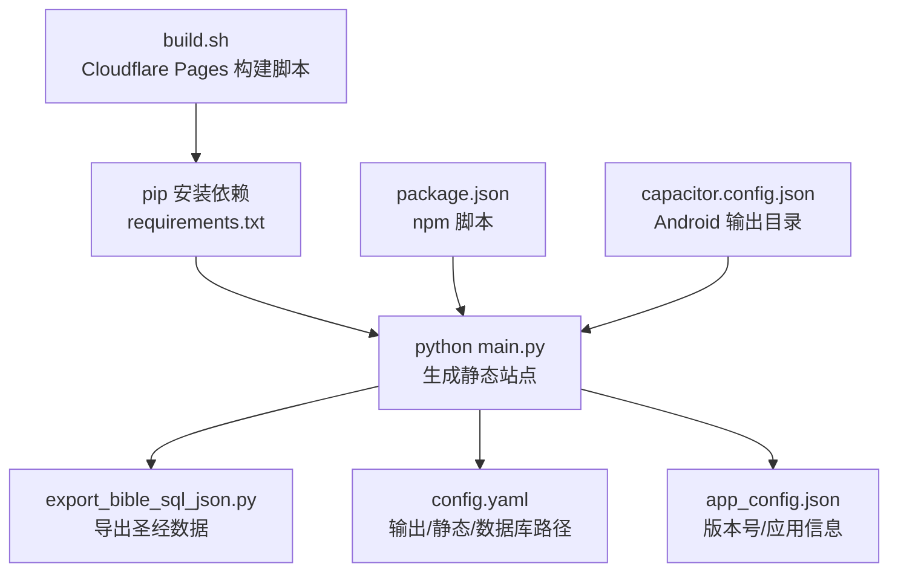
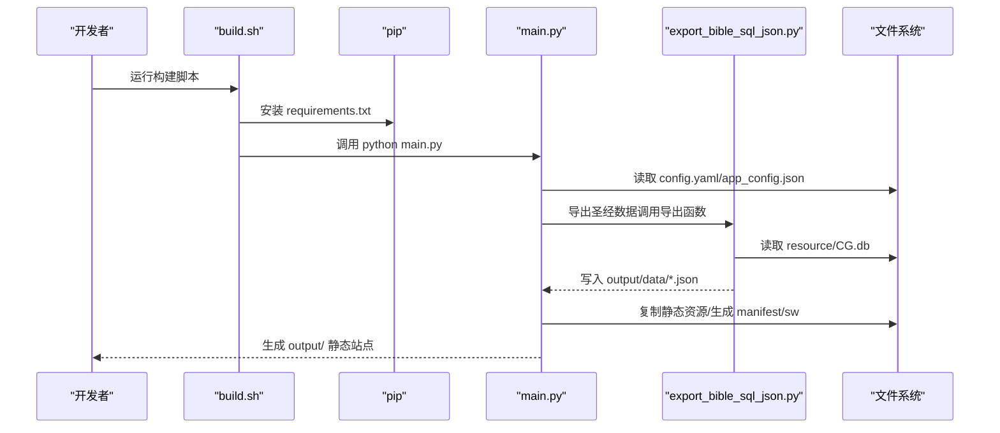
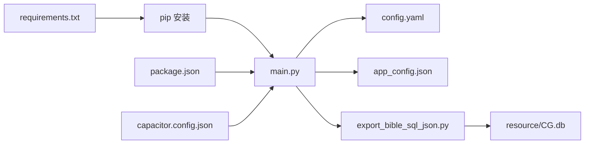
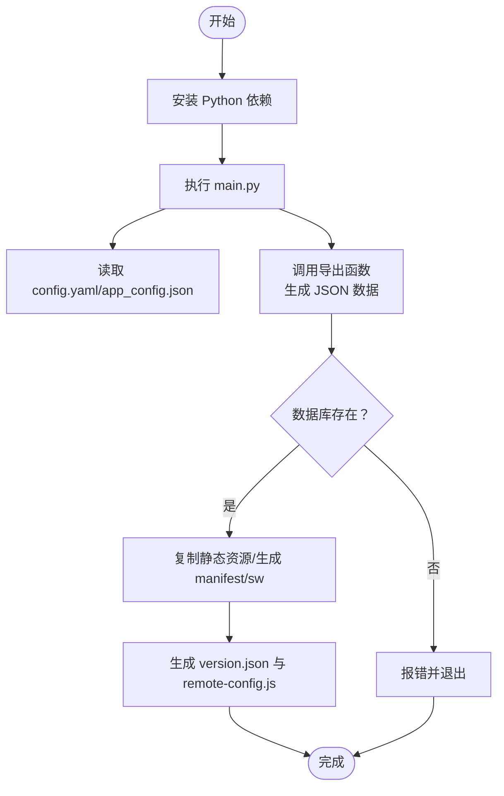

# 构建问题

<cite>
**本文档引用的文件**
- [build.sh](file://build.sh)
- [requirements.txt](file://requirements.txt)
- [package.json](file://package.json)
- [main.py](file://main.py)
- [export_bible_sql_json.py](file://export_bible_sql_json.py)
- [config.yaml](file://config.yaml)
- [app_config.json](file://app_config.json)
- [capacitor.config.json](file://capacitor.config.json)
</cite>

## 目录
1. [简介](#简介)
2. [项目结构](#项目结构)
3. [核心组件](#核心组件)
4. [架构总览](#架构总览)
5. [详细组件分析](#详细组件分析)
6. [依赖关系分析](#依赖关系分析)
7. [性能考虑](#性能考虑)
8. [故障排除指南](#故障排除指南)
9. [结论](#结论)
10. [附录](#附录)

## 简介
本指南聚焦于本项目的构建问题排查，覆盖以下方面：
- Python 依赖安装失败与版本兼容性
- Node.js 环境配置问题与 npm 脚本执行
- 构建脚本执行错误（权限、路径、环境变量）
- 不同操作系统下的环境搭建与常见问题
- CI/CD 流程中的构建失败诊断方法

目标是帮助开发者快速定位并解决构建过程中的常见问题。

## 项目结构
该项目采用“前端静态资源 + Python 构建脚本 + Capacitor 打包”的组合方式：
- Python 负责从 SQLite 数据库导出 JSON 数据并生成静态站点产物
- npm 脚本负责调用 Python 构建，并在需要时同步 Capacitor 并构建 Android APK
- 配置文件控制输出目录、静态资源目录、数据库位置以及远程服务器信息

图表来源
- [build.sh:1-16](file://build.sh#L1-L16)
- [requirements.txt:1-2](file://requirements.txt#L1-L2)
- [main.py:36-76](file://main.py#L36-L76)
- [export_bible_sql_json.py:743-800](file://export_bible_sql_json.py#L743-L800)
- [config.yaml:1-12](file://config.yaml#L1-L12)
- [app_config.json:1-6](file://app_config.json#L1-L6)
- [package.json:5-11](file://package.json#L5-L11)
- [capacitor.config.json:1-10](file://capacitor.config.json#L1-L10)

章节来源
- [build.sh:1-16](file://build.sh#L1-L16)
- [package.json:1-24](file://package.json#L1-L24)

## 核心组件
- 构建脚本（build.sh）
  - 安装 Python 依赖
  - 执行 Python 主构建脚本
- Python 主构建脚本（main.py）
  - 加载配置
  - 准备圣经数据（调用导出脚本）
  - 生成静态站点（复制资源、生成 manifest/sw）
  - 生成版本与远程配置
- 导出脚本（export_bible_sql_json.py）
  - 从 SQLite 数据库导出 JSON 数据
  - 支持按书卷分片与全局聚合
- 配置文件
  - config.yaml：输出目录、静态目录、数据库路径、远程服务器
  - app_config.json：版本号、应用 ID/名称
  - capacitor.config.json：Capacitor WebDir 指向 output/
- 包管理与脚本（package.json）
  - 提供 build、cap:sync、cap:open、android:build、android:dev 等脚本

章节来源
- [build.sh:7-13](file://build.sh#L7-L13)
- [main.py:36-76](file://main.py#L36-L76)
- [export_bible_sql_json.py:743-800](file://export_bible_sql_json.py#L743-L800)
- [config.yaml:1-12](file://config.yaml#L1-L12)
- [app_config.json:1-6](file://app_config.json#L1-L6)
- [capacitor.config.json:1-10](file://capacitor.config.json#L1-L10)
- [package.json:5-11](file://package.json#L5-L11)

## 架构总览
下面的序列图展示了从命令行到最终产物的关键流程：

图表来源
- [build.sh:7-13](file://build.sh#L7-L13)
- [main.py:87-116](file://main.py#L87-L116)
- [export_bible_sql_json.py:743-800](file://export_bible_sql_json.py#L743-L800)
- [config.yaml:1-12](file://config.yaml#L1-L12)
- [app_config.json:1-6](file://app_config.json#L1-L6)

## 详细组件分析

### 构建脚本（build.sh）
- 功能要点
  - 设置严格模式，遇到错误立即退出
  - 安装 Python 依赖（基于 requirements.txt）
  - 执行主构建脚本生成静态站点
- 常见问题
  - 权限不足导致 pip 安装失败
  - 未安装 Python 或 pip 版本过旧
  - requirements.txt 中依赖版本冲突或不可用源

章节来源
- [build.sh:1-16](file://build.sh#L1-L16)
- [requirements.txt:1-2](file://requirements.txt#L1-L2)

### Python 主构建脚本（main.py）
- 功能要点
  - 三个阶段：准备数据、生成静态站点、版本与配置
  - 读取 config.yaml 控制路径
  - 调用导出脚本生成 JSON 数据
  - 复制静态资源、生成 manifest/sw、写入 version.json/app_config.json
- 关键路径与依赖
  - 输出目录由 config.yaml.output_dir 决定
  - 数据库路径由 config.yaml.bible_db 决定
  - app_config.json.version 用于 version.json

章节来源
- [main.py:36-76](file://main.py#L36-L76)
- [main.py:87-116](file://main.py#L87-L116)
- [main.py:121-161](file://main.py#L121-L161)
- [main.py:288-321](file://main.py#L288-L321)
- [config.yaml:1-12](file://config.yaml#L1-L12)
- [app_config.json:1-6](file://app_config.json#L1-L6)

### 导出脚本（export_bible_sql_json.py）
- 功能要点
  - 从 SQLite 数据库导出多类 JSON 文件
  - 支持全局 JSON、书卷名映射、按书卷分片、读经计划
  - 可选的串珠规范化
- 关键路径
  - 默认数据库路径：resource/CG.db
  - 默认输出目录：output/data

章节来源
- [export_bible_sql_json.py:1-14](file://export_bible_sql_json.py#L1-L14)
- [export_bible_sql_json.py:29-31](file://export_bible_sql_json.py#L29-L31)
- [export_bible_sql_json.py:743-800](file://export_bible_sql_json.py#L743-L800)

### 配置文件
- config.yaml
  - output_dir：输出目录（默认 output）
  - static_dir：静态资源目录（默认 src/static）
  - bible_db：数据库路径（默认 resource/CG.db）
  - remote_servers：远程服务器配置（用于生成 remote-config.js）
- app_config.json
  - version：用于生成 version.json
- capacitor.config.json
  - webDir：指向 output/，用于 Capacitor 打包

章节来源
- [config.yaml:1-12](file://config.yaml#L1-L12)
- [app_config.json:1-6](file://app_config.json#L1-L6)
- [capacitor.config.json:1-10](file://capacitor.config.json#L1-L10)

### npm 脚本与 Android 构建
- package.json 提供的脚本
  - build：调用 python main.py
  - cap:sync：同步 Capacitor
  - cap:open：打开 Android 平台
  - android:build：构建 APK（需 Gradle 环境）
  - android:dev：开发调试流程
- 注意事项
  - 需要 Node.js 与 npm 正常安装
  - Android 构建需配置 ANDROID_HOME/SDK 等环境变量

章节来源
- [package.json:5-11](file://package.json#L5-L11)

## 依赖关系分析
- Python 侧
  - build.sh 依赖 requirements.txt
  - main.py 依赖 config.yaml、app_config.json、export_bible_sql_json.py
  - export_bible_sql_json.py 依赖 resource/CG.db
- Node.js 侧
  - package.json 依赖 Node.js 生态与 Capacitor CLI
  - android:build 依赖 Android SDK/NDK/Gradle

图表来源
- [requirements.txt:1-2](file://requirements.txt#L1-L2)
- [build.sh:7-13](file://build.sh#L7-L13)
- [main.py:54-76](file://main.py#L54-L76)
- [export_bible_sql_json.py:29-31](file://export_bible_sql_json.py#L29-L31)
- [config.yaml:1-12](file://config.yaml#L1-L12)
- [app_config.json:1-6](file://app_config.json#L1-L6)
- [capacitor.config.json:1-10](file://capacitor.config.json#L1-L10)
- [package.json:5-11](file://package.json#L5-L11)

## 性能考虑
- 数据导出阶段涉及大量 JSON 写入与正则处理，建议：
  - 使用 SSD 存储以提升 I/O
  - 在 CI 环境中缓存 pip/npm 缓存目录
  - 控制导出日志级别，避免过多标准输出影响性能
- 静态站点生成阶段：
  - 合理组织静态资源，避免重复复制
  - 使用 .nojekyll 等策略优化托管平台的构建行为

## 故障排除指南

### 一、Python 依赖安装失败
- 症状
  - pip 安装时报错（网络超时、权限不足、版本冲突）
- 排查步骤
  - 确认 Python 与 pip 版本是否满足要求
  - 检查 requirements.txt 是否包含有效依赖
  - 更换 pip 源（如使用国内镜像）或离线安装
  - 在虚拟环境中安装，避免系统级权限问题
- 相关文件
  - [build.sh](file://build.sh#L9)
  - [requirements.txt:1-2](file://requirements.txt#L1-L2)

章节来源
- [build.sh](file://build.sh#L9)
- [requirements.txt:1-2](file://requirements.txt#L1-L2)

### 二、requirements.txt 依赖顺序与版本兼容性
- 依赖顺序
  - 本项目仅有一条依赖声明，通常 pip 会自动解析依赖关系
- 版本兼容性
  - 若出现版本冲突，尝试固定版本或升级 pip/setuptools
  - 如需特定版本，建议在 requirements.txt 中显式指定
- 建议
  - 在 CI 中使用锁定文件或容器化环境保证一致性

章节来源
- [requirements.txt:1-2](file://requirements.txt#L1-L2)

### 三、构建脚本执行错误
- 权限问题
  - 确保 build.sh 可执行（chmod +x）
  - 在 Windows 上使用 Git Bash 或 WSL 执行
- 路径配置错误
  - 确认当前工作目录正确
  - 检查 config.yaml 中的相对路径是否与实际目录一致
- 环境变量缺失
  - 在 CI 环境中设置必要的环境变量（如 NODE_OPTIONS 等）
- 相关文件
  - [build.sh:1-16](file://build.sh#L1-L16)
  - [config.yaml:1-12](file://config.yaml#L1-L12)

章节来源
- [build.sh:1-16](file://build.sh#L1-L16)
- [config.yaml:1-12](file://config.yaml#L1-L12)

### 四、数据库与数据导出问题
- 症状
  - 运行时报“数据库不存在”或导出失败
- 排查步骤
  - 确认 resource/CG.db 存在且可读
  - 检查 config.yaml.bible_db 路径是否正确
  - 确保导出脚本可访问数据库文件
- 相关文件
  - [main.py:89-95](file://main.py#L89-L95)
  - [export_bible_sql_json.py](file://export_bible_sql_json.py#L30)
  - [config.yaml](file://config.yaml#L4)

章节来源
- [main.py:89-95](file://main.py#L89-L95)
- [export_bible_sql_json.py](file://export_bible_sql_json.py#L30)
- [config.yaml](file://config.yaml#L4)

### 五、静态站点生成问题
- 症状
  - 缺少 index.html、CSS/JS 复制失败、manifest/sw 未生成
- 排查步骤
  - 确认 src/static 与 src/templates 目录存在
  - 检查 main.py 的复制逻辑与输出目录
  - 确认 app_config.json 存在并包含版本信息
- 相关文件
  - [main.py:121-161](file://main.py#L121-L161)
  - [main.py:288-321](file://main.py#L288-L321)
  - [config.yaml:1-4](file://config.yaml#L1-L4)
  - [app_config.json:1-6](file://app_config.json#L1-L6)

章节来源
- [main.py:121-161](file://main.py#L121-L161)
- [main.py:288-321](file://main.py#L288-L321)
- [config.yaml:1-4](file://config.yaml#L1-L4)
- [app_config.json:1-6](file://app_config.json#L1-L6)

### 六、版本与远程配置生成问题
- 症状
  - version.json 未生成或内容不正确
  - remote-config.js 未生成或为空
- 排查步骤
  - 确认 app_config.json.version 存在
  - 检查 config.yaml.remote_servers 是否配置
  - 确认生成函数被调用
- 相关文件
  - [main.py:288-321](file://main.py#L288-L321)
  - [config.yaml:10-12](file://config.yaml#L10-L12)
  - [app_config.json:1-6](file://app_config.json#L1-L6)

章节来源
- [main.py:288-321](file://main.py#L288-L321)
- [config.yaml:10-12](file://config.yaml#L10-L12)
- [app_config.json:1-6](file://app_config.json#L1-L6)

### 七、Node.js 与 npm 脚本问题
- 症状
  - npm run build 报错、Capacitor 同步失败、Android 构建失败
- 排查步骤
  - 确认 Node.js 与 npm 版本满足 package.json 依赖
  - 检查 npx 可用性与网络访问
  - Android 构建需配置 ANDROID_HOME、Java、Gradle
- 相关文件
  - [package.json:5-11](file://package.json#L5-L11)

章节来源
- [package.json:5-11](file://package.json#L5-L11)

### 八、不同操作系统下的环境搭建
- Windows
  - 使用 Git Bash 或 WSL 执行 build.sh
  - 安装 Python 与 pip，确保 PATH 正确
  - 安装 Node.js 与 npm，必要时使用 nvm 管理版本
  - Android 构建需安装 Android Studio/SDK/NDK 并配置环境变量
- macOS/Linux
  - 确保 bash 可用，赋予 build.sh 执行权限
  - 使用虚拟环境隔离 Python 依赖
  - Android 构建需安装对应工具链并配置 ANDROID_HOME

章节来源
- [build.sh:1-16](file://build.sh#L1-L16)
- [package.json:5-11](file://package.json#L5-L11)

### 九、CI/CD 流程中的构建失败诊断
- 常见问题
  - 缓存未命中导致依赖下载缓慢
  - 网络不稳定导致 pip/npm 失败
  - 环境变量未注入（如 CI 专用变量）
- 诊断方法
  - 开启详细日志（如 set -x）
  - 分阶段执行（先安装依赖，再执行构建）
  - 使用缓存目录（pip/npm/capacitor 缓存）
  - 在 CI 中固定 Node.js/Python 版本
- 相关文件
  - [build.sh](file://build.sh#L3)
  - [package.json:5-11](file://package.json#L5-L11)

章节来源
- [build.sh](file://build.sh#L3)
- [package.json:5-11](file://package.json#L5-L11)

## 结论
本项目的构建流程清晰：通过 build.sh 安装依赖并调用 main.py，main.py 再委托 export_bible_sql_json.py 生成数据与静态站点。排查构建问题时，应优先检查依赖安装、路径配置、数据库可用性与 Node.js 环境。在 CI/CD 中，建议固定版本、启用缓存并分阶段执行，以提高稳定性与可维护性。

## 附录

### A. 关键流程的算法与数据流（简化）

图表来源
- [build.sh:7-13](file://build.sh#L7-L13)
- [main.py:87-116](file://main.py#L87-L116)
- [export_bible_sql_json.py:743-800](file://export_bible_sql_json.py#L743-L800)
- [config.yaml:1-12](file://config.yaml#L1-L12)
- [app_config.json:1-6](file://app_config.json#L1-L6)