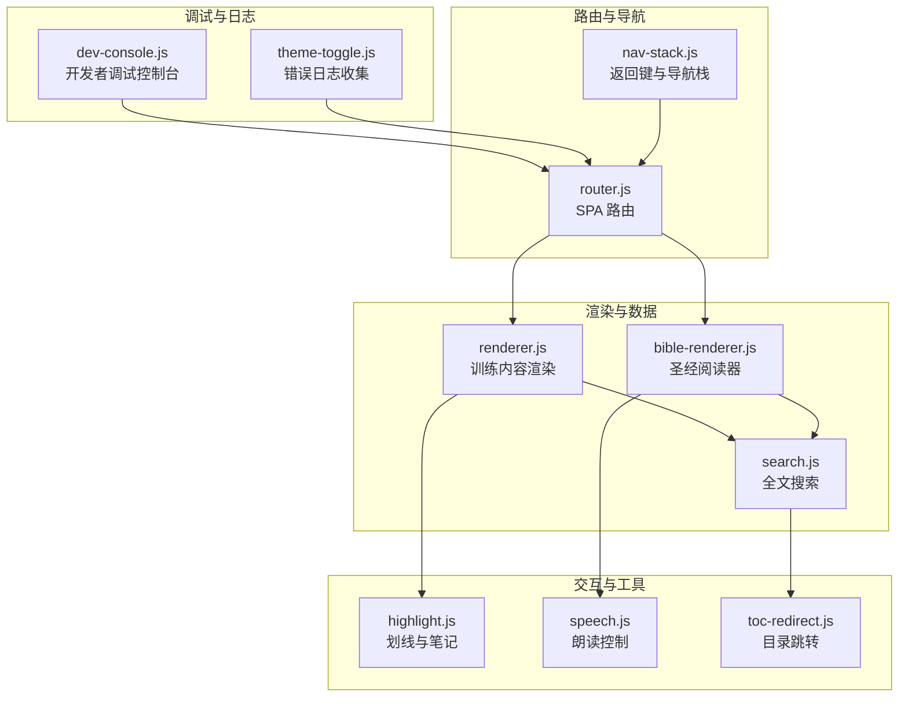
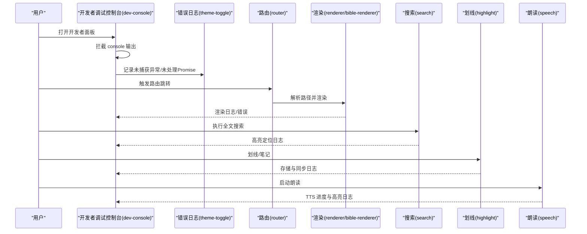
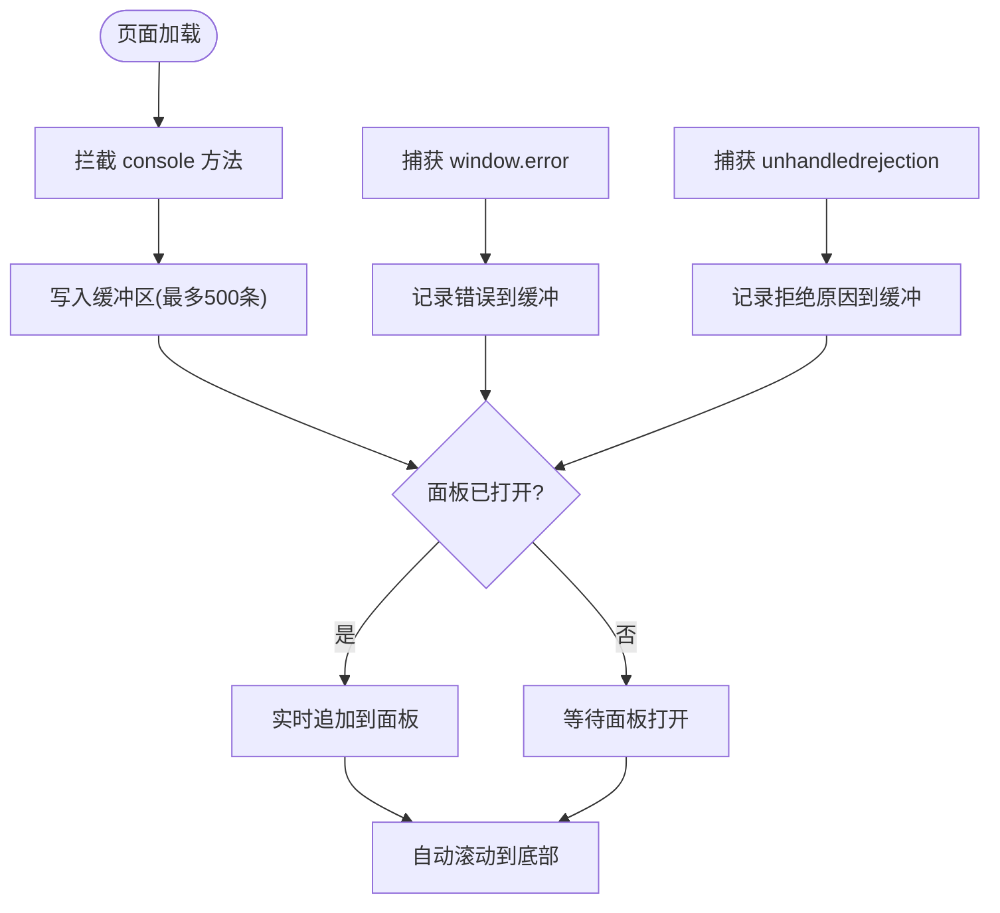
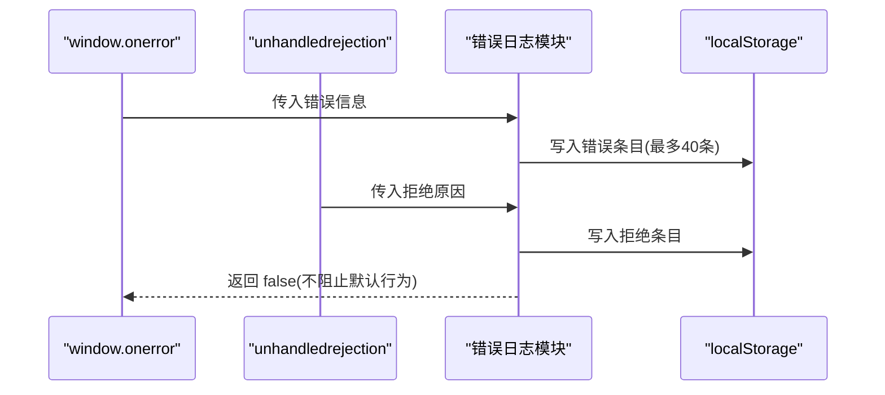
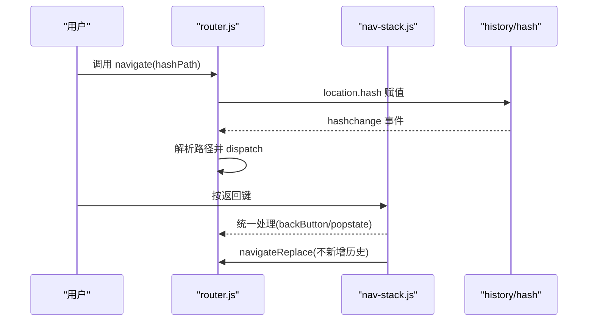
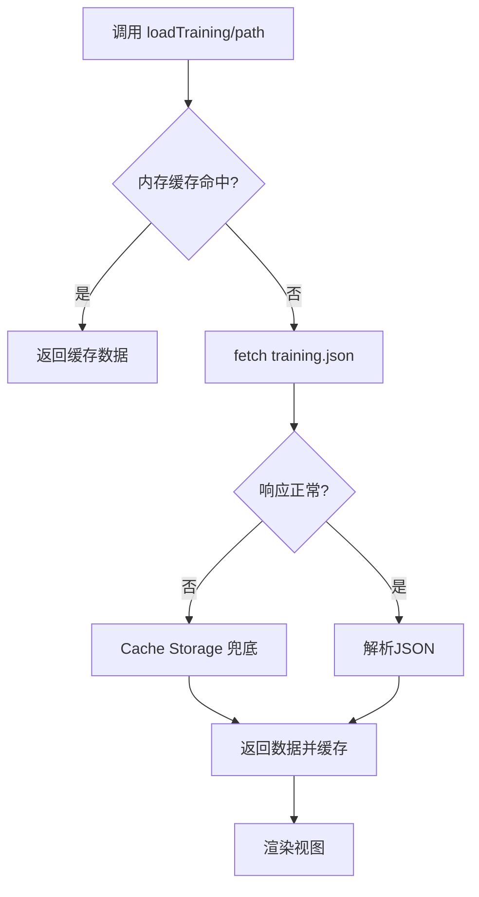
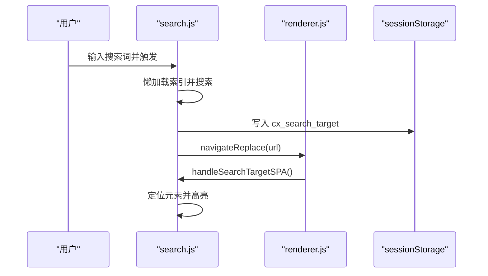
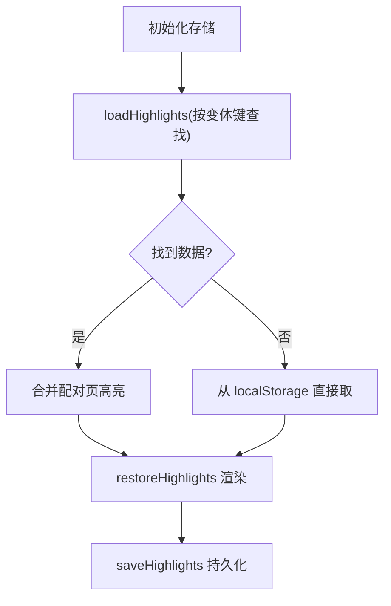
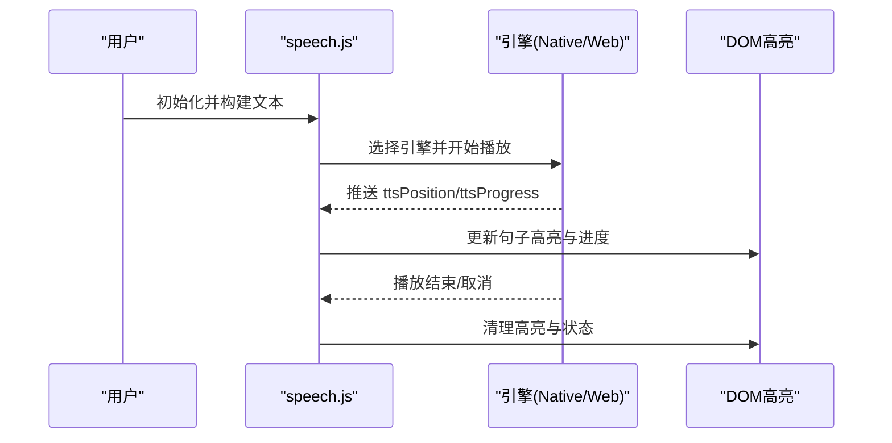
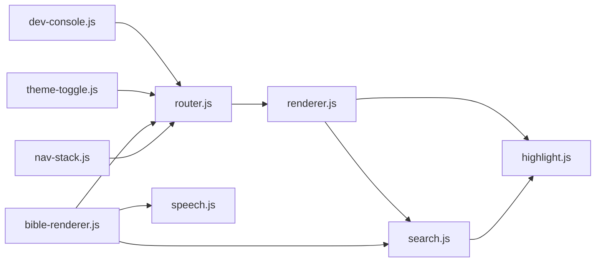

# 运行时错误

<cite>
**本文档引用的文件**
- [dev-console.js](file://src/static/js/dev-console.js)
- [router.js](file://src/static/js/router.js)
- [renderer.js](file://src/static/js/renderer.js)
- [bible-renderer.js](file://src/static/js/bible-renderer.js)
- [search.js](file://src/static/js/search.js)
- [theme-toggle.js](file://src/static/js/theme-toggle.js)
- [nav-stack.js](file://src/static/js/nav-stack.js)
- [highlight.js](file://src/static/js/highlight.js)
- [speech.js](file://src/static/js/speech.js)
- [toc-redirect.js](file://src/static/js/toc-redirect.js)
</cite>

## 目录
1. [简介](#简介)
2. [项目结构](#项目结构)
3. [核心组件](#核心组件)
4. [架构概览](#架构概览)
5. [详细组件分析](#详细组件分析)
6. [依赖分析](#依赖分析)
7. [性能考虑](#性能考虑)
8. [故障排查指南](#故障排查指南)
9. [结论](#结论)

## 简介
本文件面向运行时错误的诊断与解决，聚焦浏览器控制台错误的识别与分析，涵盖 JavaScript 语法错误、DOM 操作错误、异步处理错误等场景。文档提供开发者调试控制台的使用方法（日志查看、错误追踪、性能监控），并给出常见运行时错误的解决方案，包括路由跳转失败、数据加载异常、组件初始化错误等问题。同时，针对 Promise 拒绝处理与未捕获异常提供调试技巧。

## 项目结构
该项目采用前端单页应用（SPA）架构，核心逻辑集中在 src/static/js 目录下的多个模块中：
- 调试与日志：dev-console.js、theme-toggle.js（错误日志收集）
- 路由与导航：router.js、nav-stack.js
- 渲染与数据：renderer.js、bible-renderer.js、search.js
- 交互与工具：highlight.js、speech.js、toc-redirect.js

**图表来源**
- [dev-console.js:1-181](file://src/static/js/dev-console.js#L1-L181)
- [theme-toggle.js:59-126](file://src/static/js/theme-toggle.js#L59-L126)
- [router.js:1-287](file://src/static/js/router.js#L1-L287)
- [nav-stack.js:1-455](file://src/static/js/nav-stack.js#L1-L455)
- [renderer.js:1-800](file://src/static/js/renderer.js#L1-L800)
- [bible-renderer.js:1-880](file://src/static/js/bible-renderer.js#L1-L880)
- [search.js:1-800](file://src/static/js/search.js#L1-L800)
- [highlight.js:1-800](file://src/static/js/highlight.js#L1-L800)
- [speech.js:1-800](file://src/static/js/speech.js#L1-L800)
- [toc-redirect.js:1-21](file://src/static/js/toc-redirect.js#L1-L21)

**章节来源**
- [dev-console.js:1-181](file://src/static/js/dev-console.js#L1-L181)
- [router.js:1-287](file://src/static/js/router.js#L1-L287)
- [renderer.js:1-800](file://src/static/js/renderer.js#L1-L800)
- [bible-renderer.js:1-880](file://src/static/js/bible-renderer.js#L1-L880)
- [search.js:1-800](file://src/static/js/search.js#L1-L800)
- [theme-toggle.js:59-126](file://src/static/js/theme-toggle.js#L59-L126)
- [nav-stack.js:1-455](file://src/static/js/nav-stack.js#L1-L455)
- [highlight.js:1-800](file://src/static/js/highlight.js#L1-L800)
- [speech.js:1-800](file://src/static/js/speech.js#L1-L800)
- [toc-redirect.js:1-21](file://src/static/js/toc-redirect.js#L1-L21)

## 核心组件
- 开发者调试控制台（dev-console.js）：拦截 console 输出、记录未捕获异常与未处理 Promise 拒绝，提供可视化面板与复制导出能力。
- 错误日志收集（theme-toggle.js）：统一收集 window.onerror 与 unhandledrejection，持久化到 localStorage，支持版本清理与查询。
- SPA 路由（router.js）：Hash 路由解析与导航，支持同书卷章节切换与跨层级跳转，内置 ghost history 条目处理。
- 导航栈与返回键（nav-stack.js）：统一处理 Capacitor APK 与 PWA 的返回键行为，避免虚假 popstate，支持“已在主页退出”流程。
- 内容渲染器（renderer.js、bible-renderer.js）：从 JSON 加载训练数据，渲染章节视图，处理缓存与离线兜底。
- 全文搜索（search.js）：懒加载索引、段落级定位、SPA 与 SSR 的高亮定位。
- 划线与笔记（highlight.js）：IndexedDB/LocalStorage 存储，跨视图同步，TextQuoteSelector 自愈。
- 朗读控制（speech.js）：NativeTTS 与 Web Speech API 双引擎，句子级高亮与进度追踪。
- 目录跳转（toc-redirect.js）：根据星期几动态跳转到纲目或晨读页。

**章节来源**
- [dev-console.js:1-181](file://src/static/js/dev-console.js#L1-L181)
- [theme-toggle.js:59-126](file://src/static/js/theme-toggle.js#L59-L126)
- [router.js:1-287](file://src/static/js/router.js#L1-L287)
- [nav-stack.js:1-455](file://src/static/js/nav-stack.js#L1-L455)
- [renderer.js:1-800](file://src/static/js/renderer.js#L1-L800)
- [bible-renderer.js:1-880](file://src/static/js/bible-renderer.js#L1-L880)
- [search.js:1-800](file://src/static/js/search.js#L1-L800)
- [highlight.js:1-800](file://src/static/js/highlight.js#L1-L800)
- [speech.js:1-800](file://src/static/js/speech.js#L1-L800)
- [toc-redirect.js:1-21](file://src/static/js/toc-redirect.js#L1-L21)

## 架构概览
运行时错误的诊断贯穿以下链路：
- 日志采集：dev-console.js 拦截 console 与异常事件，theme-toggle.js 收集全局错误。
- 路由与导航：router.js 与 nav-stack.js 协作，确保导航一致性与返回键行为正确。
- 渲染与数据：renderer.js/bible-renderer.js 负责数据加载与 DOM 渲染，异常通过日志与控制台暴露。
- 搜索与高亮：search.js 与 highlight.js 在 SPA 环境下进行高亮定位与跨页同步。
- 朗读与工具：speech.js 提供 TTS 与进度追踪，toc-redirect.js 简化目录跳转。

**图表来源**
- [dev-console.js:47-82](file://src/static/js/dev-console.js#L47-L82)
- [theme-toggle.js:100-126](file://src/static/js/theme-toggle.js#L100-L126)
- [router.js:27-101](file://src/static/js/router.js#L27-L101)
- [renderer.js:49-103](file://src/static/js/renderer.js#L49-L103)
- [search.js:380-461](file://src/static/js/search.js#L380-L461)
- [highlight.js:355-422](file://src/static/js/highlight.js#L355-L422)
- [speech.js:147-362](file://src/static/js/speech.js#L147-L362)

## 详细组件分析

### 组件A：开发者调试控制台（dev-console.js）
- 功能要点
  - 拦截 console.log/warn/error/info/debug，记录时间戳、级别与文本。
  - 捕获 window.error 与 window.unhandledrejection，统一输出到面板。
  - 提供面板初始化/销毁、历史缓冲、自动滚动、复制导出。
- 适用场景
  - 识别语法错误、运行时异常、Promise 拒绝。
  - 跟踪路由跳转过程中的异常与警告。
- 调试建议
  - 在“开发者模式”下启用面板，观察 [uncaught] 与 [unhandledrejection] 前缀。
  - 使用“复制”导出日志，便于问题上报与复现。

**图表来源**
- [dev-console.js:21-82](file://src/static/js/dev-console.js#L21-L82)

**章节来源**
- [dev-console.js:1-181](file://src/static/js/dev-console.js#L1-L181)

### 组件B：错误日志收集（theme-toggle.js）
- 功能要点
  - 拦截 window.onerror 与 unhandledrejection，写入 localStorage。
  - 版本清理：当应用版本变化时清空旧日志。
  - 提供查询与清理接口，便于问题定位与数据维护。
- 适用场景
  - 识别跨页面、跨会话的未捕获异常。
  - 与 dev-console.js 协同，形成完整的错误画像。
- 调试建议
  - 使用 window.CX.errorLog.get() 查看最近错误。
  - 在版本升级后检查日志是否被清理。

**图表来源**
- [theme-toggle.js:100-126](file://src/static/js/theme-toggle.js#L100-L126)

**章节来源**
- [theme-toggle.js:59-126](file://src/static/js/theme-toggle.js#L59-L126)

### 组件C：SPA 路由与导航（router.js、nav-stack.js）
- 功能要点
  - Hash 路由解析与 dispatch，支持同书卷章节切换与跨层级跳转。
  - navigateReplace 用于不新增历史条目的层级跳转，避免 ghost 条目干扰。
  - nav-stack.js 统一处理 Capacitor 与 PWA 的返回键，避免 iOS/Android PWA 启动时的虚假 popstate。
- 适用场景
  - 路由跳转失败、返回键行为异常、跨页面导航卡顿。
- 调试建议
  - 观察控制台日志中的 [Router] 输出，确认 dispatch 路径与参数。
  - 使用 navigateReplace 替代 navigate，避免历史栈膨胀。

**图表来源**
- [router.js:104-142](file://src/static/js/router.js#L104-L142)
- [nav-stack.js:30-55](file://src/static/js/nav-stack.js#L30-L55)

**章节来源**
- [router.js:1-287](file://src/static/js/router.js#L1-L287)
- [nav-stack.js:1-455](file://src/static/js/nav-stack.js#L1-L455)

### 组件D：内容渲染与数据加载（renderer.js、bible-renderer.js）
- 功能要点
  - 从 training.json 加载数据，支持本地导入与离线缓存。
  - renderChapterView 等视图渲染，处理缓存与异步加载。
  - bible-renderer.js 提供圣经阅读视图，包含数据加载与错误提示。
- 适用场景
  - 数据加载异常、视图渲染失败、缓存命中问题。
- 调试建议
  - 检查 fetch 返回状态码与 JSON 解析错误。
  - 关注 Capacitor 环境下的缓存策略与时间戳参数。

**图表来源**
- [renderer.js:49-103](file://src/static/js/renderer.js#L49-L103)
- [bible-renderer.js:75-106](file://src/static/js/bible-renderer.js#L75-L106)

**章节来源**
- [renderer.js:1-800](file://src/static/js/renderer.js#L1-L800)
- [bible-renderer.js:1-880](file://src/static/js/bible-renderer.js#L1-L880)

### 组件E：全文搜索与高亮定位（search.js）
- 功能要点
  - 懒加载搜索索引，按训练与章节分组展示结果。
  - SPA 与 SSR 的高亮定位，支持 cx 视图的 day-page 限定。
  - 使用 sessionStorage 桥接搜索目标，完成跳转后高亮关键词。
- 适用场景
  - 搜索无结果、高亮定位不准确、跨页面跳转后高亮缺失。
- 调试建议
  - 检查 sessionStorage 中的 cx_search_target 是否正确。
  - 确认 handleSearchTargetSPA 与 handleSearchTarget 的路径匹配。

**图表来源**
- [search.js:487-512](file://src/static/js/search.js#L487-L512)
- [search.js:636-734](file://src/static/js/search.js#L636-L734)

**章节来源**
- [search.js:1-800](file://src/static/js/search.js#L1-L800)

### 组件F：划线与笔记（highlight.js）
- 功能要点
  - IndexedDB/LocalStorage 存储，支持跨视图同步与 TextQuoteSelector 自愈。
  - 按章节隔离存储，规范化路径以适配 APK/PWA。
- 适用场景
  - 划线丢失、跨视图不同步、偏移失效。
- 调试建议
  - 检查 getPageKey 生成的键是否与旧静态页一致。
  - 使用 redoHighlights 在异步内容渲染后重算偏移。

**图表来源**
- [highlight.js:355-422](file://src/static/js/highlight.js#L355-L422)
- [highlight.js:619-638](file://src/static/js/highlight.js#L619-L638)

**章节来源**
- [highlight.js:1-800](file://src/static/js/highlight.js#L1-L800)

### 组件G：朗读控制（speech.js）
- 功能要点
  - NativeTTS 与 Web Speech API 双引擎，句子级高亮与进度追踪。
  - withExpanded 展开经文引用，buildAll 构建 fullText 与 segmentMap。
- 适用场景
  - 朗读失败、进度不更新、句子高亮异常。
- 调试建议
  - 检查引擎检测结果与初始化尝试次数。
  - 关注 ttsPosition 与 ttsProgress 的字符级进度更新。

**图表来源**
- [speech.js:147-362](file://src/static/js/speech.js#L147-L362)
- [speech.js:678-774](file://src/static/js/speech.js#L678-L774)

**章节来源**
- [speech.js:1-800](file://src/static/js/speech.js#L1-L800)

### 组件H：目录跳转（toc-redirect.js）
- 功能要点
  - 根据星期几决定跳转目标：周日跳纲目，周一至周六跳晨读对应天。
- 适用场景
  - 目录项跳转不符合预期。
- 调试建议
  - 检查 DOMContentLoaded 时机与 dayAnchors 映射。

**章节来源**
- [toc-redirect.js:1-21](file://src/static/js/toc-redirect.js#L1-L21)

## 依赖分析
- 组件耦合
  - dev-console.js 与 theme-toggle.js 共同构成错误采集层，互不依赖。
  - router.js 与 nav-stack.js 协作处理导航与返回键，router 依赖 nav-stack 的 skipNext 机制。
  - renderer.js 与 bible-renderer.js 共同负责内容渲染，bible-renderer 依赖 router 的导航。
  - search.js 依赖 renderer.js 的视图渲染与 highlight.js 的高亮定位。
  - highlight.js 与 speech.js 独立工作，分别处理存储与 TTS。
- 外部依赖
  - localStorage/localforage：持久化存储。
  - caches/fetch：离线缓存与数据加载。
  - Capacitor Plugins：NativeTTS 与 App 事件。

**图表来源**
- [dev-console.js:1-181](file://src/static/js/dev-console.js#L1-L181)
- [theme-toggle.js:59-126](file://src/static/js/theme-toggle.js#L59-L126)
- [router.js:1-287](file://src/static/js/router.js#L1-L287)
- [renderer.js:1-800](file://src/static/js/renderer.js#L1-L800)
- [bible-renderer.js:1-880](file://src/static/js/bible-renderer.js#L1-L880)
- [search.js:1-800](file://src/static/js/search.js#L1-L800)
- [highlight.js:1-800](file://src/static/js/highlight.js#L1-L800)
- [speech.js:1-800](file://src/static/js/speech.js#L1-L800)
- [nav-stack.js:1-455](file://src/static/js/nav-stack.js#L1-L455)

**章节来源**
- [router.js:1-287](file://src/static/js/router.js#L1-L287)
- [renderer.js:1-800](file://src/static/js/renderer.js#L1-L800)
- [bible-renderer.js:1-880](file://src/static/js/bible-renderer.js#L1-L880)
- [search.js:1-800](file://src/static/js/search.js#L1-L800)
- [highlight.js:1-800](file://src/static/js/highlight.js#L1-L800)
- [speech.js:1-800](file://src/static/js/speech.js#L1-L800)
- [nav-stack.js:1-455](file://src/static/js/nav-stack.js#L1-L455)

## 性能考虑
- 日志缓冲与面板渲染
  - dev-console.js 限制缓冲与 DOM 子节点数量，避免内存与渲染压力。
  - 建议在生产环境适当降低缓冲上限，避免长时间调试导致性能下降。
- 路由与导航
  - navigateReplace 减少历史栈增长，避免 popstate 事件风暴。
  - nav-stack.js 的 grace period 过滤启动时的虚假 popstate，减少不必要的处理。
- 渲染与数据加载
  - renderer.js 的内存缓存与离线兜底提升首屏性能，注意缓存键的一致性。
  - search.js 的懒加载与分批加载，避免一次性加载过多索引。
- 存储与同步
  - highlight.js 的 IndexedDB/LocalStorage 降级策略与路径规范化，减少跨平台差异带来的性能损耗。

## 故障排查指南

### 1. 路由跳转失败
- 症状
  - 点击导航无反应，URL 未变化或反复闪烁。
- 排查步骤
  - 检查控制台 [Router] 日志，确认 dispatch 路径与参数。
  - 确认 navigateReplace 是否被正确调用以避免历史栈膨胀。
  - 在 nav-stack.js 中确认返回键处理逻辑，避免虚假 popstate 干扰。
- 相关文件
  - [router.js:104-142](file://src/static/js/router.js#L104-L142)
  - [nav-stack.js:30-55](file://src/static/js/nav-stack.js#L30-L55)

**章节来源**
- [router.js:1-287](file://src/static/js/router.js#L1-L287)
- [nav-stack.js:1-455](file://src/static/js/nav-stack.js#L1-L455)

### 2. 数据加载异常
- 症状
  - training.json 加载失败，页面空白或报错。
- 排查步骤
  - 检查 fetch 返回状态码与 JSON 解析错误。
  - 在 Capacitor 环境下确认时间戳参数与 Cache Storage 兜底逻辑。
  - 关注 renderer.js 的缓存命中与版本校验。
- 相关文件
  - [renderer.js:49-103](file://src/static/js/renderer.js#L49-L103)

**章节来源**
- [renderer.js:1-800](file://src/static/js/renderer.js#L1-L800)

### 3. 组件初始化错误
- 症状
  - 划线/笔记、朗读、搜索等模块初始化失败。
- 排查步骤
  - 检查 dev-console.js 中的拦截输出，确认模块加载顺序与依赖。
  - 对于 highlight.js，确认 localforage 可用性与路径规范化。
  - 对于 speech.js，确认引擎检测与初始化尝试次数。
- 相关文件
  - [highlight.js:16-33](file://src/static/js/highlight.js#L16-L33)
  - [speech.js:147-362](file://src/static/js/speech.js#L147-L362)

**章节来源**
- [highlight.js:1-800](file://src/static/js/highlight.js#L1-L800)
- [speech.js:1-800](file://src/static/js/speech.js#L1-L800)

### 4. Promise 拒绝与未捕获异常
- 症状
  - 控制台出现 [unhandledrejection] 或未捕获异常。
- 排查步骤
  - 使用 dev-console.js 的可视化面板查看错误堆栈。
  - 通过 theme-toggle.js 的错误日志模块查询最近错误条目。
  - 在业务代码中添加 .catch 或 try/catch，避免异常冒泡。
- 相关文件
  - [dev-console.js:65-82](file://src/static/js/dev-console.js#L65-L82)
  - [theme-toggle.js:113-119](file://src/static/js/theme-toggle.js#L113-L119)

**章节来源**
- [dev-console.js:1-181](file://src/static/js/dev-console.js#L1-L181)
- [theme-toggle.js:59-126](file://src/static/js/theme-toggle.js#L59-L126)

### 5. 搜索与高亮定位问题
- 症状
  - 搜索无结果或高亮定位不准确。
- 排查步骤
  - 检查 sessionStorage 中的 cx_search_target 是否正确。
  - 确认 handleSearchTargetSPA 与 handleSearchTarget 的路径匹配。
  - 在 cx 视图下验证 day_index 限定是否生效。
- 相关文件
  - [search.js:487-512](file://src/static/js/search.js#L487-L512)
  - [search.js:636-734](file://src/static/js/search.js#L636-L734)

**章节来源**
- [search.js:1-800](file://src/static/js/search.js#L1-L800)

### 6. 划线与笔记不同步
- 症状
  - 纲目与晨读视图间划线不同步。
- 排查步骤
  - 检查 getPairedPageKey 与 _mergePairedHighlights 的实现。
  - 确认 TextQuoteSelector 的 prefix/suffix 评分与自愈逻辑。
  - 验证 _syncToPairedPage 与 _syncChangeToPairedPage 的双向同步。
- 相关文件
  - [highlight.js:202-248](file://src/static/js/highlight.js#L202-L248)
  - [highlight.js:259-328](file://src/static/js/highlight.js#L259-L328)

**章节来源**
- [highlight.js:1-800](file://src/static/js/highlight.js#L1-L800)

### 7. 朗读进度与高亮异常
- 症状
  - 朗读进度不更新或句子高亮不同步。
- 排查步骤
  - 检查 ttsPosition 与 ttsProgress 的字符级进度更新。
  - 确认 withExpanded 与 buildAll 的文本处理一致性。
  - 验证 NativeTTS 与 Web Speech API 的引擎切换。
- 相关文件
  - [speech.js:678-774](file://src/static/js/speech.js#L678-L774)
  - [speech.js:487-534](file://src/static/js/speech.js#L487-L534)

**章节来源**
- [speech.js:1-800](file://src/static/js/speech.js#L1-L800)

## 结论
通过 dev-console.js 与 theme-toggle.js 的双重日志采集、router.js 与 nav-stack.js 的导航保障、renderer.js 与 bible-renderer.js 的数据渲染、以及 search.js、highlight.js、speech.js 的专项功能模块，本项目形成了完善的运行时错误诊断与解决体系。建议在日常开发中：
- 始终启用开发者调试控制台，关注 [uncaught] 与 [unhandledrejection]。
- 使用 navigateReplace 与 skipNext 机制优化导航体验。
- 在关键异步流程中添加 .catch 与 try/catch，避免异常冒泡。
- 利用 localStorage 与缓存策略提升性能与稳定性。
- 对跨模块协作（如搜索高亮、划线同步）进行充分测试与回归。