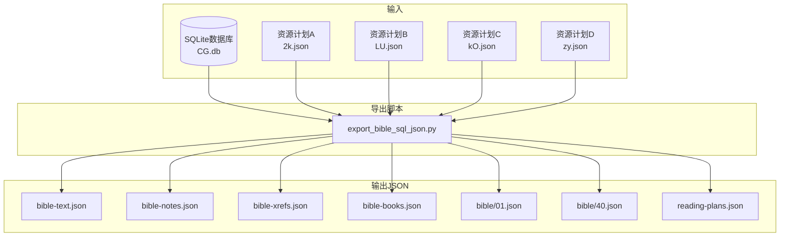
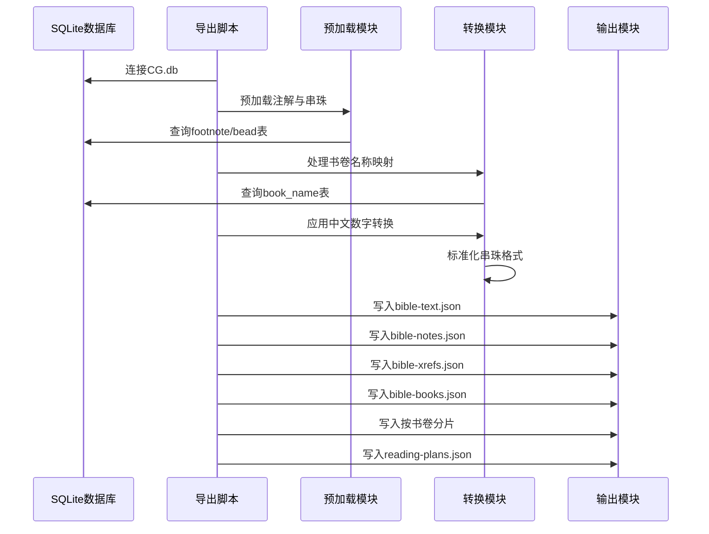
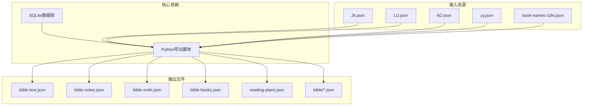

# JSON数据格式

<cite>
**本文档引用的文件**
- [export_bible_sql_json.py](file://export_bible_sql_json.py)
- [2k.json](file://resource/2k.json)
- [LU.json](file://resource/LU.json)
- [kO.json](file://resource/kO.json)
- [zy.json](file://resource/zy.json)
- [book-names-i18n.json](file://src/static/data/book-names-i18n.json)
- [bible-text.json](file://output/data/bible-text.json)
- [bible-notes.json](file://output/data/bible-notes.json)
- [bible-xrefs.json](file://output/data/bible-xrefs.json)
- [bible-books.json](file://output/data/bible-books.json)
- [reading-plans.json](file://output/data/reading-plans.json)
- [01.json](file://output/data/bible/01.json)
- [40.json](file://output/data/bible/40.json)
- [config.yaml](file://config.yaml)
- [app_config.json](file://app_config.json)
</cite>

## 目录
1. [简介](#简介)
2. [项目结构](#项目结构)
3. [核心组件](#核心组件)
4. [架构概览](#架构概览)
5. [详细组件分析](#详细组件分析)
6. [依赖关系分析](#依赖关系分析)
7. [性能考虑](#性能考虑)
8. [故障排除指南](#故障排除指南)
9. [结论](#结论)
10. [附录](#附录)

## 简介
本文件系统性阐述该项目的JSON数据格式规范，涵盖从SQLite数据库导出的JSON数据结构、字段定义、数据转换规则、规范化处理与中文数字转换逻辑，以及书卷元数据、读经计划、用户偏好等辅助JSON文件的格式规范。文档同时提供JSON数据的验证规则与错误处理机制，帮助开发者与使用者准确理解和使用这些数据。

## 项目结构
该项目通过Python脚本将SQLite数据库中的圣经数据导出为多种JSON格式，主要包括：
- 全局JSON：bible-text.json、bible-notes.json、bible-xrefs.json
- 书卷元数据：bible-books.json
- 按书卷分片：output/data/bible/01.json ~ output/data/bible/66.json
- 读经计划：reading-plans.json
- 辅助配置：config.yaml、app_config.json、book-names-i18n.json

**图表来源**
- [export_bible_sql_json.py:743-800](file://export_bible_sql_json.py#L743-L800)
- [2k.json:1-50](file://resource/2k.json#L1-L50)
- [LU.json:1-50](file://resource/LU.json#L1-L50)
- [kO.json:1-50](file://resource/kO.json#L1-L50)
- [zy.json:1-50](file://resource/zy.json#L1-L50)

**章节来源**
- [export_bible_sql_json.py:1-14](file://export_bible_sql_json.py#L1-L14)
- [config.yaml:1-12](file://config.yaml#L1-L12)

## 核心组件

### 数据导出流程概述
- 从SQLite数据库读取book_name、content、footnote、bead等表数据
- 预加载注解与串珠数据，构建标记映射
- 应用中文数字转换与串珠标准化规则
- 输出多种JSON格式：全局JSON、书卷元数据、按书卷分片、读经计划

**章节来源**
- [export_bible_sql_json.py:374-530](file://export_bible_sql_json.py#L374-L530)
- [export_bible_sql_json.py:743-800](file://export_bible_sql_json.py#L743-L800)

### 数据转换规则
- 书卷简称与全名映射：优先中文简称/全名，否则使用数字索引
- 旗标(flag)处理：1=上、2=下、3=中，用于区分同一节的多个版本
- 注解与串珠位置：通过location字段精确标注插入位置
- 串珠标准化：统一为"书1:1,书1:2"格式，支持中文数字与阿拉伯数字混合

**章节来源**
- [export_bible_sql_json.py:100-168](file://export_bible_sql_json.py#L100-L168)
- [export_bible_sql_json.py:193-333](file://export_bible_sql_json.py#L193-L333)
- [export_bible_sql_json.py:440-454](file://export_bible_sql_json.py#L440-L454)

## 架构概览

**图表来源**
- [export_bible_sql_json.py:743-800](file://export_bible_sql_json.py#L743-L800)
- [export_bible_sql_json.py:374-530](file://export_bible_sql_json.py#L374-L530)

## 详细组件分析

### 全局JSON格式规范

#### bible-text.json
- 结构：键值对，键为"书卷简称章:节旗标"，值为带标记的经文
- 旗标规则：0=标准版，1=上，2=下，3=中
- 标记语法：{注解序列号}、[串珠字母]
- 示例键："创1:1"、"创1:2上"

**章节来源**
- [export_bible_sql_json.py:459-530](file://export_bible_sql_json.py#L459-L530)
- [bible-text.json:1-50](file://output/data/bible-text.json#L1-L50)

#### bible-notes.json
- 结构：键为"书卷简称章:节"，值为注解数组
- 注解对象：seq(序列号)、location(位置)、note(内容)
- 排序规则：按seq从小到大排序

**章节来源**
- [export_bible_sql_json.py:501-519](file://export_bible_sql_json.py#L501-L519)
- [bible-notes.json:1-50](file://output/data/bible-notes.json#L1-L50)

#### bible-xrefs.json
- 结构：键为"书卷简称章:节"，值为串珠映射
- 串珠对象：seq(序列号)、location(位置)、bead(标准化后的串珠内容)
- 串珠标准化：统一为"书1:1,书1:2"格式

**章节来源**
- [export_bible_sql_json.py:511-519](file://export_bible_sql_json.py#L511-L519)
- [export_bible_sql_json.py:193-333](file://export_bible_sql_json.py#L193-L333)
- [bible-xrefs.json:1-50](file://output/data/bible-xrefs.json#L1-L50)

### 书卷元数据格式

#### bible-books.json
- 结构：数组，每个元素为书卷对象
- 字段定义：
  - index: 1-66的数字索引
  - acronym: 书卷简称(优先中文简称)
  - name: 书卷全名(优先中文全名)

**章节来源**
- [export_bible_sql_json.py:533-548](file://export_bible_sql_json.py#L533-L548)
- [bible-books.json:1-200](file://output/data/bible-books.json#L1-L200)

### 按书卷分片格式

#### 单卷JSON结构
- book_index: 书卷索引(1-66)
- book_name: 书卷全名
- book_acronym: 书卷简称
- chapters: 章列表
  - chapter: 章号
  - verses: 节列表
    - section: 节号
    - flag: 旗标(0/1/2/3)
    - content: 带标记的经文
    - footnotes: 注解数组(可选)
    - beads: 串珠数组(可选)

**章节来源**
- [export_bible_sql_json.py:598-673](file://export_bible_sql_json.py#L598-L673)
- [01.json:1-200](file://output/data/bible/01.json#L1-L200)
- [40.json:1-200](file://output/data/bible/40.json#L1-L200)

### 读经计划格式

#### reading-plans.json
- 结构：包含plans数组的对象
- plans数组元素：
  - id: 计划标识(2k/LU/kO/zy)
  - name: 计划名称
  - lang: 语言代码(zh-CN)
  - entries: 计划条目数组
- 条目字段：
  - book: 开始书卷索引
  - book_to: 结束书卷索引
  - chapter: 开始章
  - chapter_to: 结束章
  - d: 第几天
  - section: 开始节
  - section_to: 结束节

**章节来源**
- [export_bible_sql_json.py:704-723](file://export_bible_sql_json.py#L704-L723)
- [reading-plans.json:1-200](file://output/data/reading-plans.json#L1-L200)
- [2k.json:1-50](file://resource/2k.json#L1-L50)
- [LU.json:1-50](file://resource/LU.json#L1-L50)
- [kO.json:1-50](file://resource/kO.json#L1-L50)
- [zy.json:1-50](file://resource/zy.json#L1-L50)

### 辅助配置文件

#### book-names-i18n.json
- 结构：多语言字典，包含zh-CN和en两种语言
- 每个语言包含66个书卷的短名和全名
- 用途：国际化显示书卷名称

**章节来源**
- [book-names-i18n.json:1-139](file://src/static/data/book-names-i18n.json#L1-L139)

#### config.yaml
- 结构：配置文件
- 字段：
  - output_dir: 输出目录
  - resource_base_dir: 资源基础目录
  - static_dir: 静态文件目录
  - bible_db: 圣经数据库路径
  - reading_plans: 读经计划文件列表
  - remote_servers: 远程服务器配置

**章节来源**
- [config.yaml:1-12](file://config.yaml#L1-L12)

#### app_config.json
- 结构：应用配置
- 字段：
  - app_name: 应用名称
  - app_id: 应用ID
  - version: 版本号

**章节来源**
- [app_config.json:1-6](file://app_config.json#L1-L6)

## 依赖关系分析

**图表来源**
- [export_bible_sql_json.py:33-39](file://export_bible_sql_json.py#L33-L39)
- [export_bible_sql_json.py:704-723](file://export_bible_sql_json.py#L704-L723)

**章节来源**
- [export_bible_sql_json.py:33-39](file://export_bible_sql_json.py#L33-L39)
- [export_bible_sql_json.py:704-723](file://export_bible_sql_json.py#L704-L723)

## 性能考虑
- 预加载策略：一次性查询footnote和bead表，避免重复数据库访问
- 分组处理：按书卷索引分组content表数据，提高处理效率
- 内存优化：使用生成器和分批处理，减少内存占用
- 缓存机制：书卷名称映射结果缓存，避免重复计算

## 故障排除指南

### 常见问题与解决方案

#### 数据导出失败
- 检查SQLite数据库路径是否正确
- 确认CG.db文件存在且可读
- 验证数据库连接权限

#### 串珠格式异常
- 检查中文数字转换函数是否正确处理
- 验证串珠标准化规则是否匹配
- 确认书卷简称映射是否完整

#### JSON格式错误
- 使用JSON验证工具检查输出文件格式
- 检查特殊字符转义是否正确
- 验证编码格式为UTF-8

**章节来源**
- [export_bible_sql_json.py:743-800](file://export_bible_sql_json.py#L743-L800)

## 结论
本JSON数据格式规范为圣经数据的结构化表示提供了完整的技术方案，涵盖了从SQLite到JSON的完整转换流程、数据规范化处理、中文数字转换逻辑以及多种辅助文件的格式定义。通过标准化的数据结构和严格的验证规则，确保了数据的一致性和可用性，为后续的应用开发和数据消费奠定了坚实基础。

## 附录

### 数据验证规则

#### 基本验证
- JSON格式合法性验证
- 必需字段完整性检查
- 数据类型一致性验证
- 编码格式UTF-8检查

#### 业务规则验证
- 书卷索引范围验证(1-66)
- 章节范围验证(1-176)
- 节号范围验证(1-176)
- 旗标值域验证(0/1/2/3)
- 串珠格式标准化验证

### 错误处理机制
- 异常捕获与记录
- 数据清洗与修复
- 回滚机制与状态恢复
- 日志记录与监控