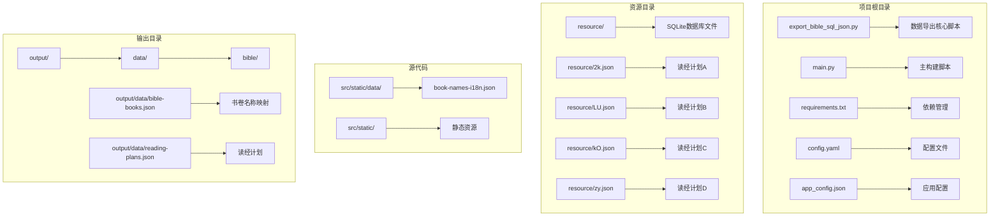
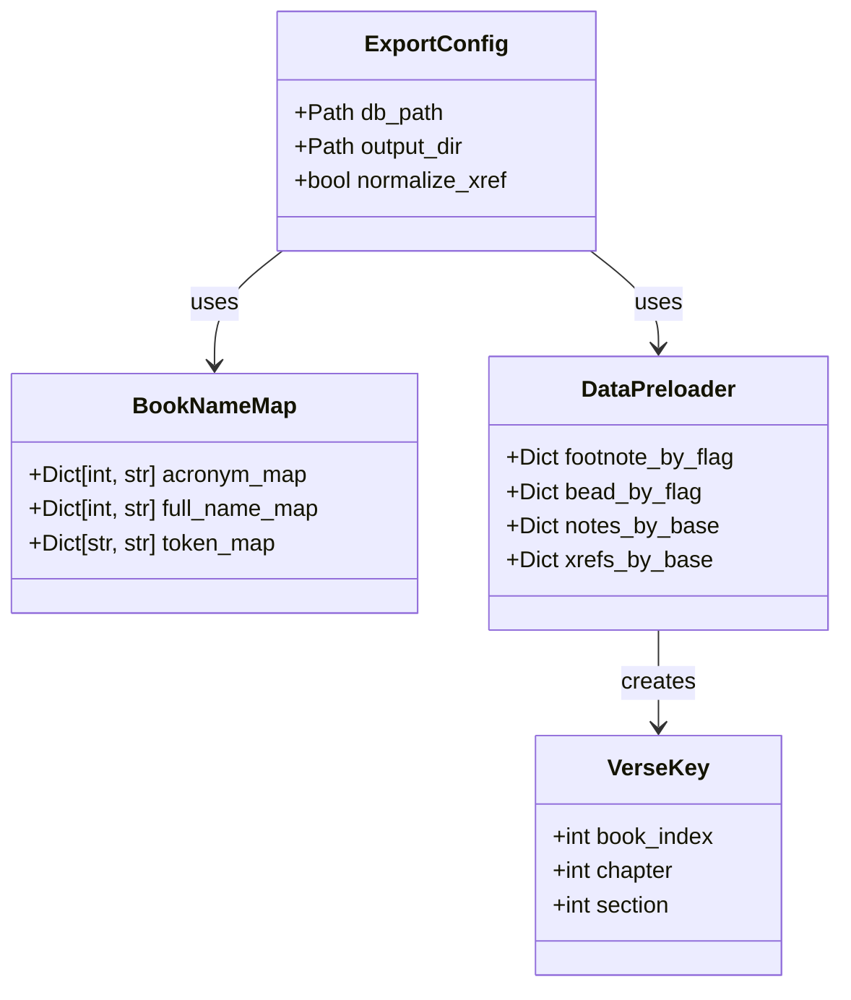
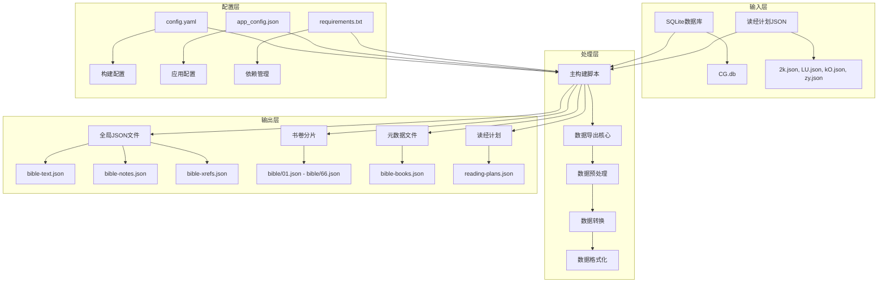
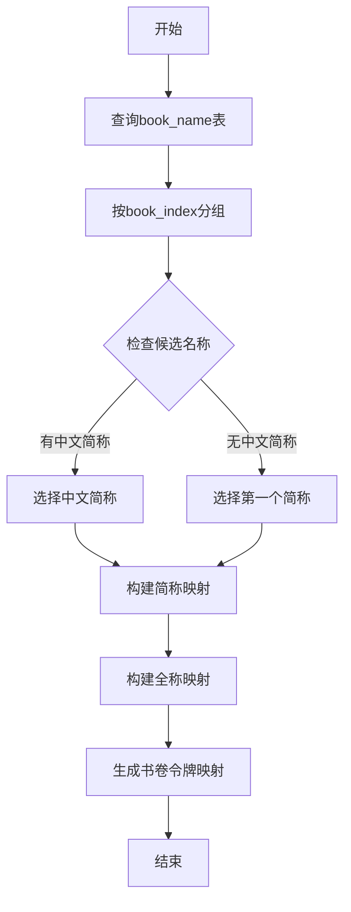
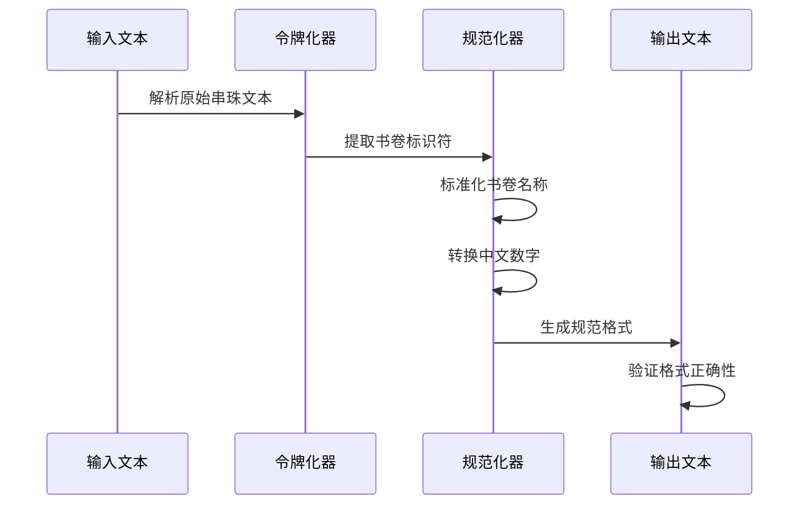
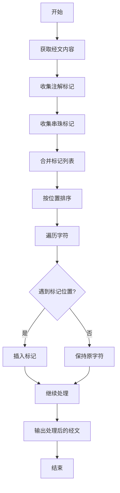
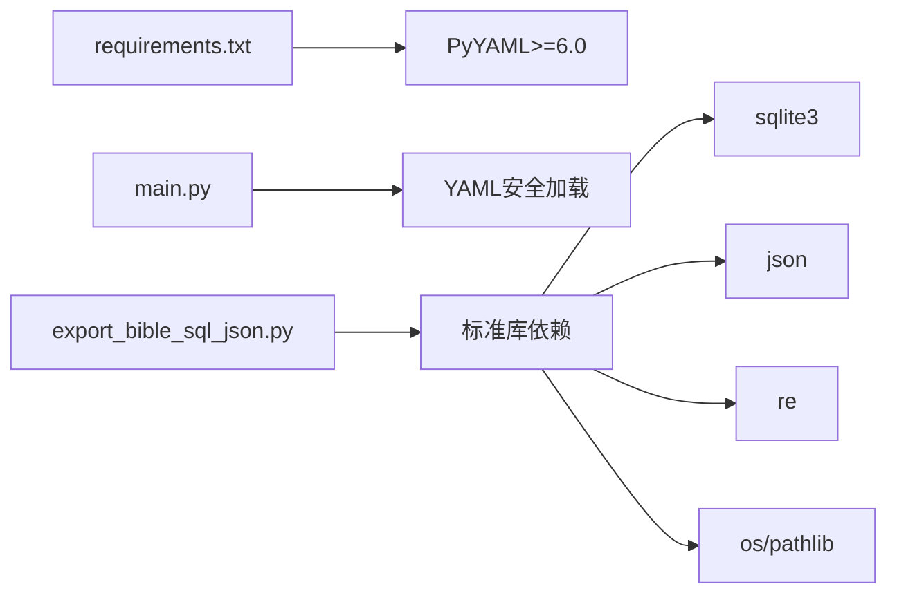
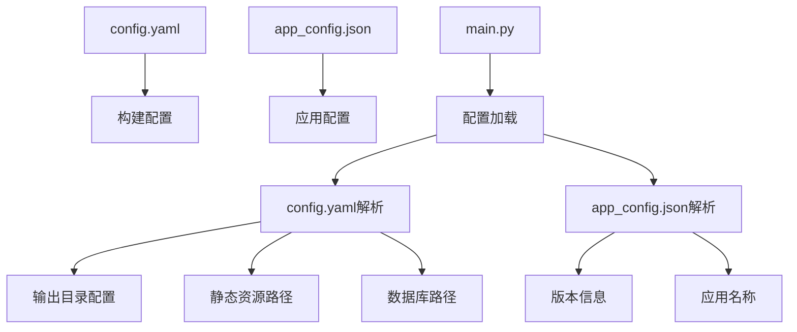

# 数据导出流程

<cite>
**本文档引用的文件**
- [export_bible_sql_json.py](file://export_bible_sql_json.py)
- [main.py](file://main.py)
- [requirements.txt](file://requirements.txt)
- [config.yaml](file://config.yaml)
- [app_config.json](file://app_config.json)
- [resource/2k.json](file://resource/2k.json)
- [resource/LU.json](file://resource/LU.json)
- [resource/kO.json](file://resource/kO.json)
- [resource/zy.json](file://resource/zy.json)
- [src/static/data/book-names-i18n.json](file://src/static/data/book-names-i18n.json)
- [output/data/bible/01.json](file://output/data/bible/01.json)
- [output/data/bible-books.json](file://output/data/bible-books.json)
</cite>

## 目录
1. [简介](#简介)
2. [项目结构](#项目结构)
3. [核心组件](#核心组件)
4. [架构概览](#架构概览)
5. [详细组件分析](#详细组件分析)
6. [依赖关系分析](#依赖关系分析)
7. [性能考虑](#性能考虑)
8. [故障排除指南](#故障排除指南)
9. [结论](#结论)

## 简介

本文档详细描述了从SQLite数据库到JSON格式的完整数据导出流程。该系统负责将圣经数据从CG.db SQLite数据库转换为多种JSON格式，包括全局JSON文件、按书卷分片的JSON文件、书卷名称映射文件以及读经计划文件。整个流程涵盖了数据提取、预处理、格式化和优化等各个阶段，并提供了详细的Python脚本执行逻辑说明。

## 项目结构

该项目采用模块化的文件组织方式，主要包含以下关键目录和文件：



**图表来源**
- [export_bible_sql_json.py:1-835](file://export_bible_sql_json.py#L1-L835)
- [main.py:1-361](file://main.py#L1-L361)
- [config.yaml:1-12](file://config.yaml#L1-L12)

**章节来源**
- [export_bible_sql_json.py:1-835](file://export_bible_sql_json.py#L1-L835)
- [main.py:1-361](file://main.py#L1-L361)
- [config.yaml:1-12](file://config.yaml#L1-L12)

## 核心组件

### 数据导出核心模块

数据导出的核心功能集中在`export_bible_sql_json.py`文件中，该模块提供了完整的数据转换流程：

#### 主要功能模块

1. **数据库连接管理**：建立SQLite数据库连接，确保数据访问的稳定性和安全性
2. **数据提取**：从多个表中提取圣经文本、注解、串珠和书卷信息
3. **数据预处理**：处理中文数字转换、串珠规范化、书卷名称映射
4. **格式化输出**：生成多种JSON格式的输出文件
5. **文件管理**：处理文件写入、目录创建和文件大小统计

#### 关键数据结构



**图表来源**
- [export_bible_sql_json.py:44-50](file://export_bible_sql_json.py#L44-L50)
- [export_bible_sql_json.py:743-744](file://export_bible_sql_json.py#L743-L744)

**章节来源**
- [export_bible_sql_json.py:44-50](file://export_bible_sql_json.py#L44-L50)
- [export_bible_sql_json.py:743-800](file://export_bible_sql_json.py#L743-L800)

## 架构概览

整个数据导出系统采用分层架构设计，确保了模块间的清晰分离和高内聚低耦合：



**图表来源**
- [main.py:36-106](file://main.py#L36-L106)
- [export_bible_sql_json.py:743-800](file://export_bible_sql_json.py#L743-L800)

## 详细组件分析

### 数据库连接和初始化

系统通过SQLite数据库连接获取所有必要的圣经数据。数据库连接建立后，系统会执行以下初始化步骤：

1. **数据库验证**：检查CG.db文件是否存在
2. **连接建立**：使用sqlite3.connect建立数据库连接
3. **事务管理**：确保数据操作的原子性

### 数据提取和预处理

#### 书卷名称映射

系统首先提取书卷的简称和全称信息，优先选择中文名称：



**图表来源**
- [export_bible_sql_json.py:100-133](file://export_bible_sql_json.py#L100-L133)
- [export_bible_sql_json.py:136-168](file://export_bible_sql_json.py#L136-L168)
- [export_bible_sql_json.py:171-190](file://export_bible_sql_json.py#L171-L190)

#### 中文数字转换

系统实现了复杂的中文数字转换功能，支持以下格式：
- 阿拉伯数字：1, 2, 3...
- 中文数字：一, 二, 三...
- 复合数字：十, 十一, 二十, 一百...

转换算法支持：
- 个位数转换
- 十位数转换  
- 百位数转换
- 复杂组合转换

**章节来源**
- [export_bible_sql_json.py:53-98](file://export_bible_sql_json.py#L53-L98)

### 串珠交叉引用规范化

串珠交叉引用是系统的重要特性，提供了经文之间的关联链接：

#### 规范化流程



**图表来源**
- [export_bible_sql_json.py:193-333](file://export_bible_sql_json.py#L193-L333)

#### 支持的格式

系统支持多种串珠格式的规范化：
- 书卷:章节,书卷:章节
- 书卷:章节-书卷:章节
- 书卷:章节-章节
- 书卷:章节,书卷:章节-章节

**章节来源**
- [export_bible_sql_json.py:193-333](file://export_bible_sql_json.py#L193-L333)

### 数据标记插入

系统实现了智能的标记插入机制，将注解和串珠标记插入到经文中合适的位置：

#### 标记插入流程



**图表来源**
- [export_bible_sql_json.py:336-371](file://export_bible_sql_json.py#L336-L371)

#### 标记类型

系统支持两种类型的标记：
- **注解标记**：使用花括号{}包围的序列号
- **串珠标记**：使用方括号[]包围的字母序列

**章节来源**
- [export_bible_sql_json.py:336-371](file://export_bible_sql_json.py#L336-L371)

### 全局JSON文件导出

系统生成三个主要的全局JSON文件：

#### bible-text.json

包含所有经文内容，每个条目格式为：
```json
{
  "创1:1": "经文内容{1}[a]标记内容",
  "创1:2": "经文内容{2}",
  ...
}
```

#### bible-notes.json

包含所有注解信息，格式为：
```json
{
  "创1:1": [
    "注解1",
    "注解2",
    ...
  ],
  "创1:2": [
    "注解3",
    ...
  ]
}
```

#### bible-xrefs.json

包含所有串珠交叉引用，格式为：
```json
{
  "创1:1": {
    "a": "书1:1,书1:2",
    "b": "书2:1-书2:5"
  },
  ...
}
```

**章节来源**
- [export_bible_sql_json.py:459-529](file://export_bible_sql_json.py#L459-L529)

### 书卷分片导出

系统按书卷生成独立的JSON文件，每个文件包含该书卷的所有章节和经文：

#### 文件结构

每个书卷文件包含：
- `book_index`: 书卷索引
- `book_name`: 书卷全名
- `book_acronym`: 书卷简称
- `chapters`: 章节数组

每个章节包含：
- `chapter`: 章节编号
- `verses`: 经文数组

每个经文包含：
- `section`: 经文编号
- `flag`: 特殊标志（上、中、下）
- `content`: 经文内容
- `footnotes`: 注解数组（可选）
- `beads`: 串珠数组（可选）

**章节来源**
- [export_bible_sql_json.py:553-596](file://export_bible_sql_json.py#L553-L596)
- [export_bible_sql_json.py:598-673](file://export_bible_sql_json.py#L598-L673)

### 读经计划导出

系统支持四个不同的读经计划，每个计划都有特定的配置：

#### 计划配置

| 计划ID | 名称 | 文件名 | 语言 |
|--------|------|--------|------|
| 2k | 读经计划A | 2k.json | zh-CN |
| LU | 读经计划B | LU.json | zh-CN |
| kO | 读经计划C | kO.json | zh-CN |
| zy | 读经计划D | zy.json | zh-CN |

#### 输出格式

读经计划输出文件包含：
```json
{
  "plans": [
    {
      "id": "2k",
      "name": "读经计划A",
      "lang": "zh-CN",
      "entries": [...]
    },
    ...
  ]
}
```

**章节来源**
- [export_bible_sql_json.py:33-39](file://export_bible_sql_json.py#L33-L39)
- [export_bible_sql_json.py:704-724](file://export_bible_sql_json.py#L704-L724)

## 依赖关系分析

### Python依赖管理

项目使用PyYAML作为主要依赖：



**图表来源**
- [requirements.txt:1-2](file://requirements.txt#L1-L2)
- [main.py:21](file://main.py#L21)

### 配置文件依赖

系统使用多个配置文件协同工作：



**图表来源**
- [config.yaml:1-12](file://config.yaml#L1-L12)
- [app_config.json:1-6](file://app_config.json#L1-L6)
- [main.py:78-82](file://main.py#L78-L82)

**章节来源**
- [requirements.txt:1-2](file://requirements.txt#L1-L2)
- [config.yaml:1-12](file://config.yaml#L1-L12)
- [app_config.json:1-6](file://app_config.json#L1-L6)

## 性能考虑

### 数据库查询优化

系统采用了多种优化策略来提高数据提取效率：

1. **批量查询**：使用ORDER BY子句确保数据按正确顺序返回
2. **预加载机制**：一次性加载所有需要的数据，避免重复查询
3. **内存管理**：合理使用字典和列表进行数据缓存

### 文件I/O优化

1. **流式写入**：使用write_text方法直接写入文件
2. **目录预创建**：在写入前确保目标目录存在
3. **压缩输出**：对全局JSON文件进行压缩以减少存储空间

### 内存使用优化

1. **分块处理**：按书卷分片处理，避免一次性加载所有数据
2. **延迟计算**：只在需要时才进行复杂的字符串处理
3. **垃圾回收**：及时释放不再使用的数据结构

## 故障排除指南

### 常见问题及解决方案

#### 数据库连接失败

**问题症状**：
- 报告数据库不存在错误
- 连接超时或失败

**解决方法**：
1. 检查CG.db文件路径是否正确
2. 验证文件权限设置
3. 确认SQLite数据库文件完整性

#### 数据转换错误

**问题症状**：
- 中文数字转换失败
- 串珠规范化异常

**解决方法**：
1. 检查输入数据格式
2. 验证正则表达式匹配
3. 确认字符编码设置

#### 文件写入错误

**问题症状**：
- JSON文件写入失败
- 目录权限不足

**解决方法**：
1. 检查输出目录权限
2. 验证磁盘空间充足
3. 确认文件名合法性

**章节来源**
- [export_bible_sql_json.py:749-751](file://export_bible_sql_json.py#L749-L751)
- [main.py:93-96](file://main.py#L93-L96)

## 结论

该数据导出系统提供了一个完整、高效且可扩展的解决方案，用于将SQLite数据库中的圣经数据转换为多种JSON格式。系统的主要优势包括：

1. **模块化设计**：清晰的功能分离使得系统易于维护和扩展
2. **数据完整性**：完整的数据提取和验证机制确保输出质量
3. **灵活性**：支持多种输出格式和配置选项
4. **性能优化**：采用多种优化策略提高处理效率
5. **错误处理**：完善的错误检测和处理机制

该系统为后续的静态站点生成和应用部署奠定了坚实的基础，为用户提供高质量的圣经阅读体验。