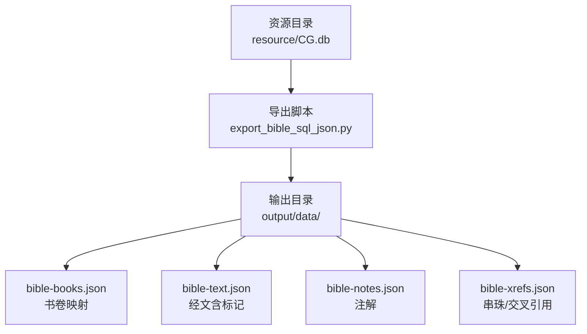
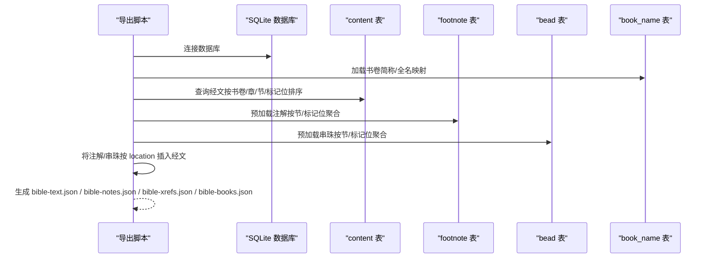
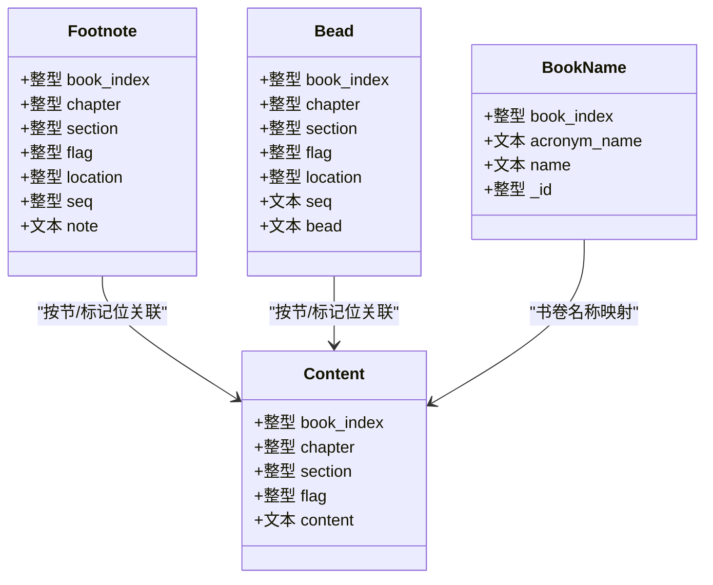
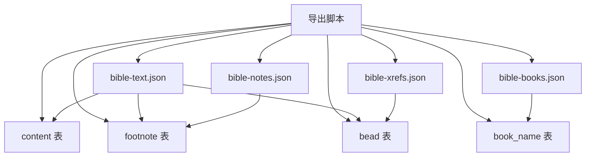

# 数据库结构

<cite>
**本文档引用的文件**
- [export_bible_sql_json.py](file://export_bible_sql_json.py)
- [resource/CG.db](file://resource/CG.db)
- [output/data/bible-books.json](file://output/data/bible-books.json)
- [output/data/bible-text.json](file://output/data/bible-text.json)
</cite>

## 目录
1. [简介](#简介)
2. [项目结构](#项目结构)
3. [核心组件](#核心组件)
4. [架构概览](#架构概览)
5. [详细组件分析](#详细组件分析)
6. [依赖分析](#依赖分析)
7. [性能考虑](#性能考虑)
8. [故障排除指南](#故障排除指南)
9. [结论](#结论)
10. [附录](#附录)

## 简介
本文件系统性梳理该项目中使用的 SQLite 数据库结构，重点覆盖经文、注解、串珠等核心数据表的字段定义、数据类型、约束与索引设计，解释表之间的关系与外键约束，给出常见查询模式与性能优化策略，并提供扩展与自定义字段的指导。

## 项目结构
- 数据库文件位于 resource/CG.db
- Python 导出脚本 export_bible_sql_json.py 负责从 SQLite 提取数据并生成 JSON 输出
- 输出目录 output/data 下包含导出的 JSON 文件，用于验证数据库结构与查询结果

**图表来源**
- [export_bible_sql_json.py](file://export_bible_sql_json.py)
- [resource/CG.db](file://resource/CG.db)
- [output/data/bible-books.json](file://output/data/bible-books.json)
- [output/data/bible-text.json](file://output/data/bible-text.json)

**章节来源**
- [export_bible_sql_json.py](file://export_bible_sql_json.py)
- [resource/CG.db](file://resource/CG.db)
- [output/data/bible-books.json](file://output/data/bible-books.json)
- [output/data/bible-text.json](file://output/data/bible-text.json)

## 核心组件
根据导出脚本与输出文件，可确认以下核心数据表与字段：

- content 表
  - 字段：book_index（书卷索引）、chapter（章）、section（节）、flag（标记位，如上/中/下）、content（经文字面值）
  - 作用：存储经文内容，支持同一节的多标记位（flag）

- footnote 表
  - 字段：book_index、chapter、section、flag、location（注解在经文中的位置）、seq（注解序号）、note（注解文本）
  - 作用：存储与经文绑定的注解，支持按节与标记位聚合

- bead 表
  - 字段：book_index、chapter、section、flag、location（串珠在经文中的位置）、seq（串珠标识符）、bead（串珠文本）
  - 作用：存储与经文绑定的串珠/交叉引用，支持规范化后的统一格式

- book_name 表
  - 字段：book_index（1..66）、acronym_name（书卷简称）、name（书卷全名）、_id（内部标识）
  - 作用：维护书卷名称映射，优先中文简称/全名

上述表通过 book_index、chapter、section、flag 等字段建立跨表关联，形成“书卷-章-节-标记位”的复合定位体系。

**章节来源**
- [export_bible_sql_json.py](file://export_bible_sql_json.py)

## 架构概览
数据库查询与导出流程如下：导出脚本连接 SQLite，按节维度读取 content，同时预加载 footnote 与 bead，将注解与串珠按位置插入经文，最终生成 bible-text.json、bible-notes.json、bible-xrefs.json 与 bible-books.json。

**图表来源**
- [export_bible_sql_json.py](file://export_bible_sql_json.py)

**章节来源**
- [export_bible_sql_json.py](file://export_bible_sql_json.py)

## 详细组件分析

### 经文表（content）
- 字段与类型
  - book_index：整型（书卷索引，范围 1..66）
  - chapter：整型（章）
  - section：整型（节）
  - flag：整型（标记位，如 0/1/2/3 对应上/中/下等）
  - content：文本（经文内容）
- 约束与索引
  - 复合主键：(book_index, chapter, section, flag)
  - 排序：ORDER BY book_index, chapter, section, flag
- 访问路径
  - 典型查询：按书卷/章/节/标记位定位经文
  - 性能建议：确保相关查询使用上述排序顺序，避免全表扫描

**章节来源**
- [export_bible_sql_json.py](file://export_bible_sql_json.py)

### 注解表（footnote）
- 字段与类型
  - book_index、chapter、section、flag：与 content 对应
  - location：整型（注解在经文中的字符位置）
  - seq：整型（注解序号）
  - note：文本（注解内容）
- 关系与约束
  - 与 content 通过 (book_index, chapter, section, flag) 关联
  - 按节与标记位聚合，支持多注解
- 查询模式
  - 预加载：SELECT ... ORDER BY book_index, chapter, section, flag, seq, location
  - 定位：按节与 flag 合并（flag=0 作为默认回退）

**章节来源**
- [export_bible_sql_json.py](file://export_bible_sql_json.py)

### 串珠/交叉引用表（bead）
- 字段与类型
  - book_index、chapter、section、flag：与 content 对应
  - location：整型（串珠在经文中的字符位置）
  - seq：文本（串珠标识符，如 "a"、"b" 等）
  - bead：文本（串珠/交叉引用内容，经规范化处理）
- 关系与约束
  - 与 content 通过 (book_index, chapter, section, flag) 关联
  - 支持多串珠，按位置与序号插入经文
- 查询模式
  - 预加载：SELECT ... ORDER BY book_index, chapter, section, flag, seq, location
  - 规范化：将原始串珠文本归一化为统一格式（如“书1:1,书1:2”）

**章节来源**
- [export_bible_sql_json.py](file://export_bible_sql_json.py)

### 书卷名称映射（book_name）
- 字段与类型
  - book_index：整型（1..66）
  - acronym_name：文本（书卷简称，优先中文）
  - name：文本（书卷全名，优先中文）
  - _id：整型（内部标识）
- 用途
  - 生成 bible-books.json，提供书卷简称与全名映射
  - 用于经文键名生成（如“创1:1”）

**章节来源**
- [export_bible_sql_json.py](file://export_bible_sql_json.py)
- [output/data/bible-books.json](file://output/data/bible-books.json)

### 类关系图（基于实际表结构）

**图表来源**
- [export_bible_sql_json.py](file://export_bible_sql_json.py)

## 依赖分析
- 导出脚本依赖 SQLite 数据库中的 content、footnote、bead、book_name 四张表
- 输出文件 bible-text.json 依赖 content、footnote、bead 的聚合与插入
- 输出文件 bible-notes.json 与 bible-xrefs.json 依赖 footnote 与 bead 的分组
- 输出文件 bible-books.json 依赖 book_name 的映射

**图表来源**
- [export_bible_sql_json.py](file://export_bible_sql_json.py)

**章节来源**
- [export_bible_sql_json.py](file://export_bible_sql_json.py)

## 性能考虑
- 查询排序与索引
  - content：按 (book_index, chapter, section, flag) 排序，避免全表扫描
  - footnote/bead：按 (book_index, chapter, section, flag, seq, location) 排序，便于快速定位与聚合
- 聚合策略
  - 预加载：一次性读取 footnote 与 bead，按节/标记位进行内存聚合，减少多次往返
  - 合并规则：flag=0 作为默认回退，提升兼容性
- 文本处理
  - 串珠规范化：在内存中完成，避免重复 IO
  - 标记插入：按 location 有序插入，保证经文完整性

**章节来源**
- [export_bible_sql_json.py](file://export_bible_sql_json.py)

## 故障排除指南
- 无法连接数据库
  - 确认 resource/CG.db 存在且可读
  - 检查导出脚本参数 --sqlite-db 指向正确路径
- 导出文件为空或数量异常
  - 检查 content 是否存在数据
  - 确认 footnote/bead 是否按节/标记位正确填充
- 书卷名称缺失
  - 检查 book_name 表是否存在对应记录（1..66）
  - 确认中文简称/全名字段是否为空

**章节来源**
- [export_bible_sql_json.py](file://export_bible_sql_json.py)
- [resource/CG.db](file://resource/CG.db)

## 结论
本数据库以“书卷-章-节-标记位”为核心定位，通过 content、footnote、bead 三表协同，实现经文、注解与串珠的结构化存储与高效导出。合理的排序与预加载策略确保了大规模数据的稳定处理。后续扩展可通过新增字段与索引进一步优化查询路径。

## 附录

### 字段定义与数据类型速览
- content
  - book_index：整型
  - chapter：整型
  - section：整型
  - flag：整型
  - content：文本
- footnote
  - book_index：整型
  - chapter：整型
  - section：整型
  - flag：整型
  - location：整型
  - seq：整型
  - note：文本
- bead
  - book_index：整型
  - chapter：整型
  - section：整型
  - flag：整型
  - location：整型
  - seq：文本
  - bead：文本
- book_name
  - book_index：整型
  - acronym_name：文本
  - name：文本
  - _id：整型

**章节来源**
- [export_bible_sql_json.py](file://export_bible_sql_json.py)

### 扩展与自定义字段指南
- 新增注解/串珠字段
  - 在 footnote 或 bead 表增加字段（如分类、来源），保持与 (book_index, chapter, section, flag) 的一致性
  - 更新导出脚本的查询与聚合逻辑，确保新字段参与序列化
- 新增索引
  - 对高频过滤字段（如 seq、location）建立索引，加速定位
  - 注意维护成本与写入性能的平衡
- 数据迁移
  - 使用事务批量更新，确保一致性
  - 逐步替换旧键名（如“创1:1”）与新键名（如“book_index/chapter/section/flag”）的映射

**章节来源**
- [export_bible_sql_json.py](file://export_bible_sql_json.py)