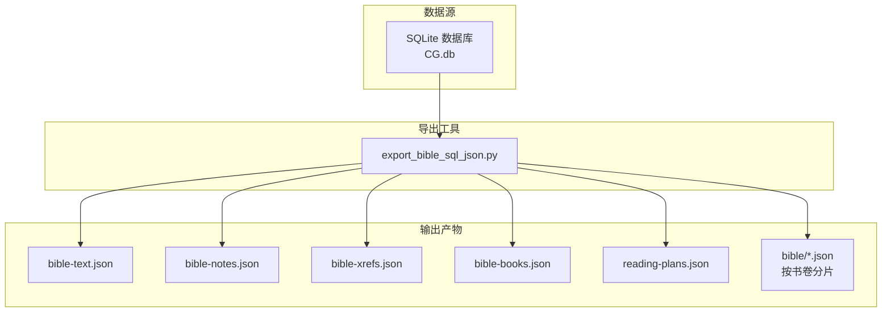
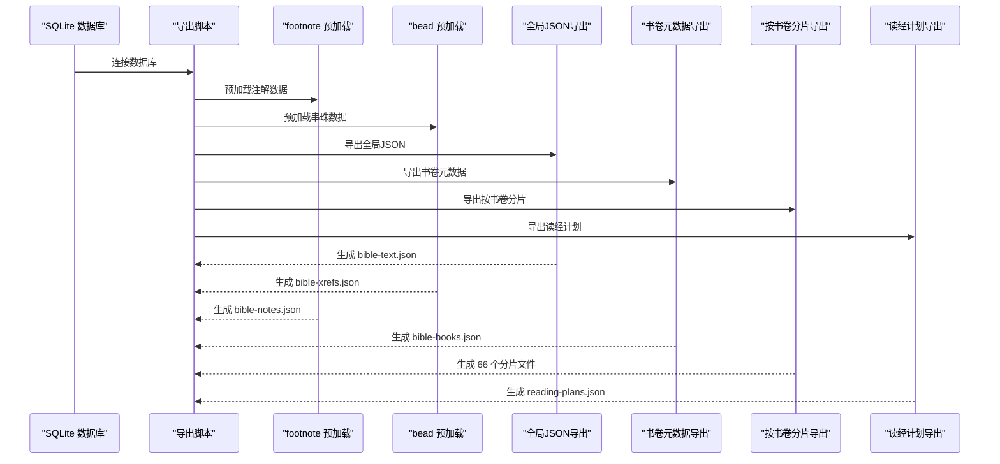
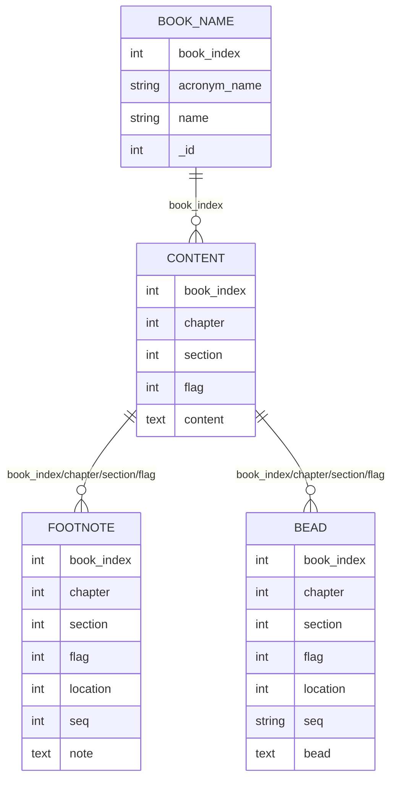
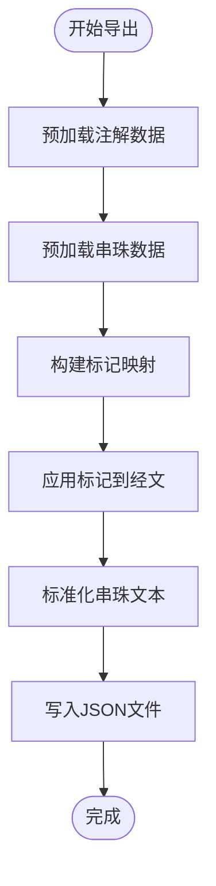
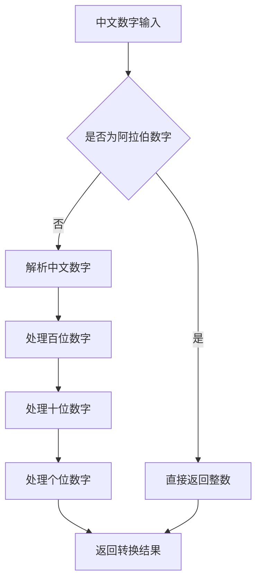
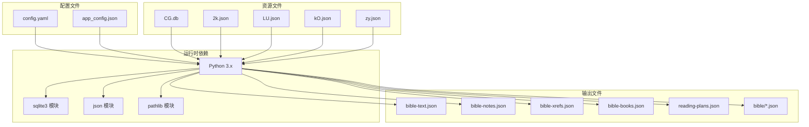

# 数据模型

<cite>
**本文档引用的文件**
- [export_bible_sql_json.py](file://export_bible_sql_json.py)
- [2k.json](file://resource/2k.json)
- [LU.json](file://resource/LU.json)
- [kO.json](file://resource/kO.json)
- [zy.json](file://resource/zy.json)
- [book-names-i18n.json](file://src/static/data/book-names-i18n.json)
- [config.yaml](file://config.yaml)
- [app_config.json](file://app_config.json)
- [bible-text.json](file://output/data/bible-text.json)
- [bible-books.json](file://output/data/bible-books.json)
- [reading-plans.json](file://output/data/reading-plans.json)
</cite>

## 目录
1. [简介](#简介)
2. [项目结构](#项目结构)
3. [核心组件](#核心组件)
4. [架构概览](#架构概览)
5. [详细组件分析](#详细组件分析)
6. [依赖分析](#依赖分析)
7. [性能考虑](#性能考虑)
8. [故障排除指南](#故障排除指南)
9. [结论](#结论)
10. [附录](#附录)

## 简介
本文件系统性阐述圣经阅读器的数据模型，涵盖SQLite数据库结构、JSON数据格式规范、数据导出与转换流程、书卷元数据、读经计划数据以及用户偏好等辅助数据结构。文档旨在为开发者和维护者提供清晰、可操作的技术参考，同时确保非技术读者也能理解核心概念。

## 项目结构
该项目采用"数据源 → 导出脚本 → 多格式输出"的分层架构：
- 数据源：SQLite数据库（CG.db）
- 导出工具：Python脚本（export_bible_sql_json.py）
- 输出产物：多种JSON格式文件（bible-text.json、bible-notes.json、bible-xrefs.json、bible-books.json、reading-plans.json、按书卷分片的bible/*.json）

**图表来源**
- [export_bible_sql_json.py:743-800](file://export_bible_sql_json.py#L743-L800)
- [config.yaml:1-12](file://config.yaml#L1-L12)

**章节来源**
- [export_bible_sql_json.py:1-835](file://export_bible_sql_json.py#L1-L835)
- [config.yaml:1-12](file://config.yaml#L1-L12)

## 核心组件
本节概述数据模型的核心要素及其职责：

### SQLite数据库结构
- content表：存储经文内容，包含book_index、chapter、section、flag、content字段
- footnote表：存储注解信息，包含book_index、chapter、section、flag、location、seq、note字段
- bead表：存储串珠/交叉引用，包含book_index、chapter、section、flag、location、seq、bead字段
- book_name表：存储书卷名称映射，包含book_index、acronym_name、name、_id字段

### JSON数据格式规范
- 全局JSON文件：bible-text.json、bible-notes.json、bible-xrefs.json
- 书卷元数据：bible-books.json
- 读经计划：reading-plans.json
- 按书卷分片：bible/01.json ~ bible/66.json

### 导出与转换流程
- 数据预加载：预取footnote和bead数据，建立标记映射和内容映射
- 数据规范化：应用标记插入、中文数字转换、串珠文本标准化
- 文件生成：生成全局JSON、书卷元数据、按书卷分片、读经计划

**章节来源**
- [export_bible_sql_json.py:374-800](file://export_bible_sql_json.py#L374-L800)

## 架构概览
下图展示从SQLite到JSON的完整转换路径：

**图表来源**
- [export_bible_sql_json.py:743-800](file://export_bible_sql_json.py#L743-L800)

## 详细组件分析

### SQLite数据库结构分析
SQLite数据库采用关系型设计，通过book_index、chapter、section、flag组合唯一标识经文位置。核心表结构如下：

**图表来源**
- [export_bible_sql_json.py:376-454](file://export_bible_sql_json.py#L376-L454)

**章节来源**
- [export_bible_sql_json.py:376-454](file://export_bible_sql_json.py#L376-L454)

### 数据导出与转换流程
导出脚本执行以下关键步骤：

#### 数据预加载机制

**图表来源**
- [export_bible_sql_json.py:376-525](file://export_bible_sql_json.py#L376-L525)

#### 中文数字转换与串珠标准化
脚本实现了复杂的中文数字解析和串珠文本标准化功能：

**图表来源**
- [export_bible_sql_json.py:53-98](file://export_bible_sql_json.py#L53-L98)

**章节来源**
- [export_bible_sql_json.py:53-98](file://export_bible_sql_json.py#L53-L98)

### JSON数据格式规范

#### 全局JSON文件结构
- bible-text.json：键为"书卷简称章:节标志"格式，值为带标记的经文
- bible-notes.json：键为"书卷简称章:节"格式，值为注解列表
- bible-xrefs.json：键为"书卷简称章:节"格式，值为序列号到串珠文本的映射

#### 书卷元数据格式
bible-books.json包含每个书卷的索引、简称和全名信息，支持多语言显示。

#### 按书卷分片格式
每个书卷生成独立JSON文件，包含章节数组，每章包含经文段落及其注解和串珠信息。

#### 读经计划格式
reading-plans.json包含多个读经计划，每个计划包含条目数组，每条目描述具体的读经范围。

**章节来源**
- [export_bible_sql_json.py:459-724](file://export_bible_sql_json.py#L459-L724)

### 读经计划数据结构
读经计划文件采用统一的JSON格式，包含以下字段：
- book、book_to：起止书卷索引
- chapter、chapter_to：起止章节
- d：日期标识
- section、section_to：起止经节范围

**章节来源**
- [2k.json:1-800](file://resource/2k.json#L1-L800)
- [LU.json:1-800](file://resource/LU.json#L1-L800)
- [kO.json:1-800](file://resource/kO.json#L1-L800)
- [zy.json:1-800](file://resource/zy.json#L1-L800)

### 书卷元数据与国际化
项目提供多语言的书卷名称映射，支持简体中文和英文显示。

**章节来源**
- [book-names-i18n.json:1-139](file://src/static/data/book-names-i18n.json#L1-L139)

## 依赖分析
项目的关键依赖关系如下：

**图表来源**
- [export_bible_sql_json.py:16-31](file://export_bible_sql_json.py#L16-L31)
- [config.yaml:1-12](file://config.yaml#L1-L12)
- [app_config.json:1-6](file://app_config.json#L1-L6)

**章节来源**
- [export_bible_sql_json.py:16-31](file://export_bible_sql_json.py#L16-L31)
- [config.yaml:1-12](file://config.yaml#L1-L12)
- [app_config.json:1-6](file://app_config.json#L1-L6)

## 性能考虑
- 数据预加载：通过一次性查询和内存缓存减少数据库访问次数
- 批量处理：按书卷分片导出避免单文件过大
- 字符串处理优化：使用正则表达式进行高效的文本匹配和替换
- 内存管理：合理使用生成器和迭代器避免内存溢出

## 故障排除指南
常见问题及解决方案：

### 数据库连接问题
- 确认CG.db文件存在且可读
- 检查数据库文件完整性
- 验证SQLite版本兼容性

### 导出失败
- 检查输出目录权限
- 确认有足够的磁盘空间
- 验证Python环境依赖

### 数据格式错误
- 检查JSON文件编码（UTF-8）
- 验证数据完整性
- 确认字段类型正确

**章节来源**
- [export_bible_sql_json.py:743-800](file://export_bible_sql_json.py#L743-L800)

## 结论
本数据模型通过SQLite关系型数据库与Python导出脚本的结合，实现了从原始经文数据到多格式JSON输出的完整转换流程。该设计具有良好的扩展性，支持多语言、多读经计划和用户偏好的灵活配置。通过合理的数据规范化和标准化处理，确保了输出数据的一致性和可用性。

## 附录

### 数据模型扩展方法
1. 添加新的数据表：在SQLite中创建新表，更新导出脚本以处理新字段
2. 自定义配置选项：通过config.yaml添加新的配置参数
3. 新增输出格式：在导出脚本中实现新的JSON格式生成逻辑
4. 用户偏好集成：扩展数据模型以支持用户个性化设置

### 自定义配置选项
- 输出目录配置：通过config.yaml的output_dir参数自定义输出路径
- 资源目录配置：通过resource_base_dir参数自定义资源文件路径
- 读经计划配置：通过reading_plans数组添加新的计划文件
- 应用配置：通过app_config.json设置应用基本信息

**章节来源**
- [config.yaml:1-12](file://config.yaml#L1-L12)
- [app_config.json:1-6](file://app_config.json#L1-L6)