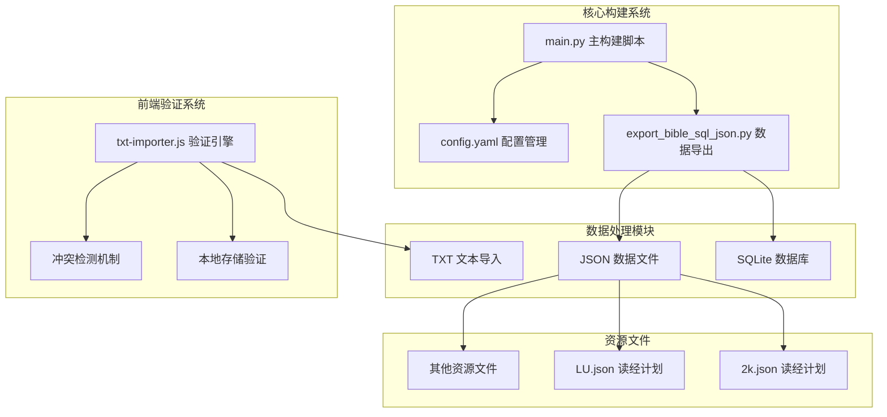
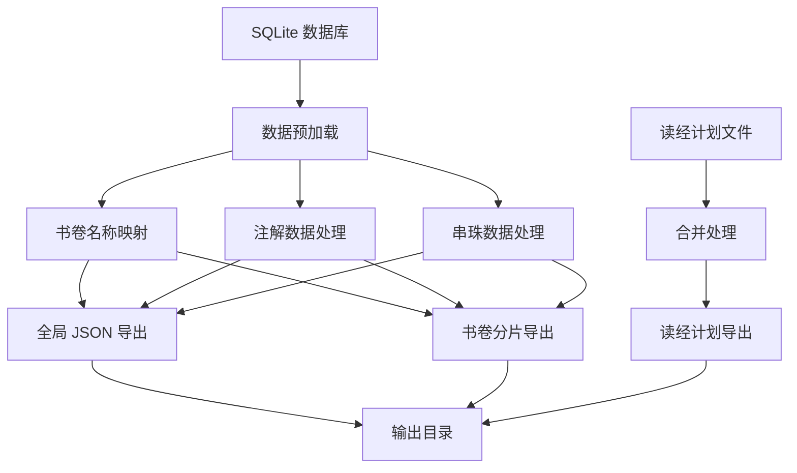
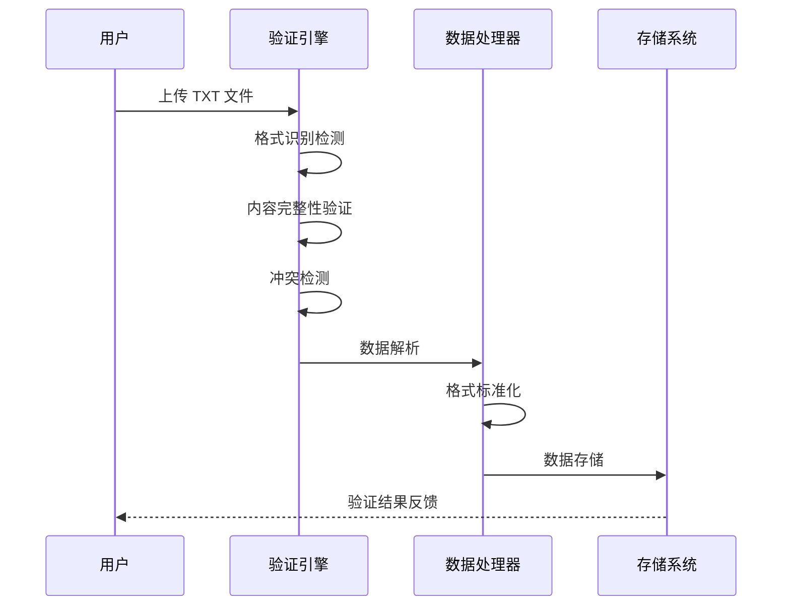
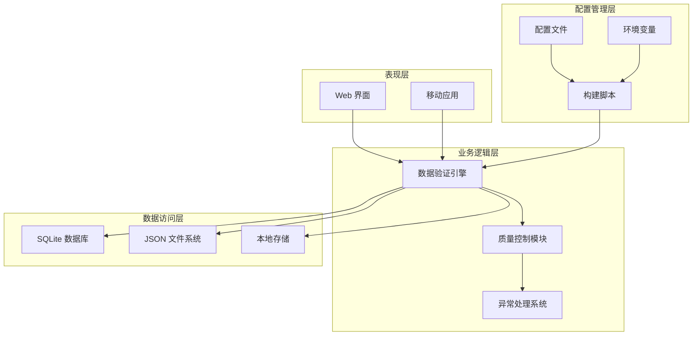
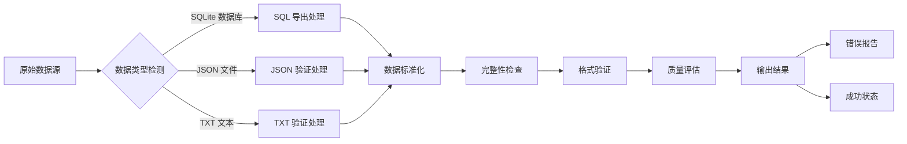
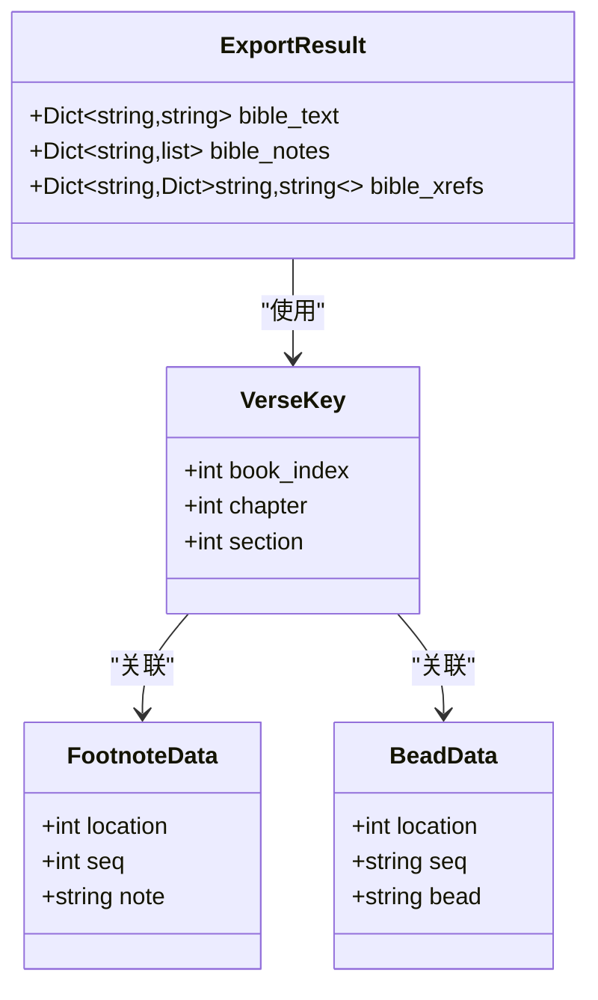
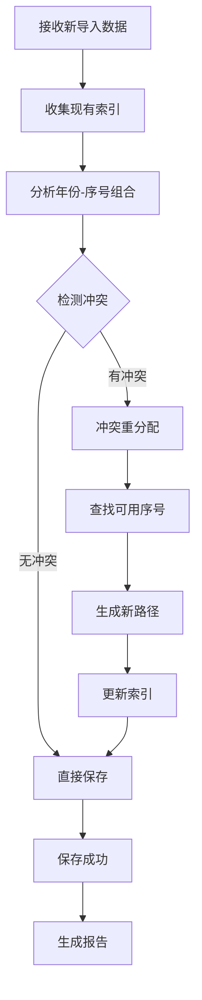
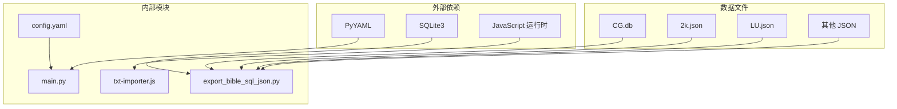

# 数据验证与质量控制

<cite>
**本文档引用的文件**
- [main.py](file://main.py)
- [export_bible_sql_json.py](file://export_bible_sql_json.py)
- [txt-importer.js](file://src/static/js/txt-importer.js)
- [config.yaml](file://config.yaml)
- [app_config.json](file://app_config.json)
- [2k.json](file://resource/2k.json)
- [LU.json](file://resource/LU.json)
- [requirements.txt](file://requirements.txt)
</cite>

## 目录
1. [简介](#简介)
2. [项目结构](#项目结构)
3. [核心组件](#核心组件)
4. [架构概览](#架构概览)
5. [详细组件分析](#详细组件分析)
6. [依赖关系分析](#依赖关系分析)
7. [性能考虑](#性能考虑)
8. [故障排除指南](#故障排除指南)
9. [结论](#结论)

## 简介

本项目是一个基于 Python 和 JavaScript 的圣经阅读器应用，采用 PWA 技术实现跨平台部署。项目的核心目标是提供高质量的圣经数据导入、验证和质量控制机制，确保数据的完整性、准确性和一致性。

项目实现了完整的数据验证和质量控制体系，包括：

- **数据导入验证**：对 SQLite 数据库、JSON 文件和 TXT 文本进行格式验证
- **数据完整性检查**：确保所有必需字段和关系都得到正确处理
- **格式标准化**：统一处理中文数字、书卷名称和引用格式
- **异常数据处理**：提供缺失值处理、重复数据检测和格式错误修正机制
- **质量评估监控**：建立数据覆盖率、准确性统计和性能基准指标

## 项目结构

项目采用模块化设计，主要包含以下核心模块：

**图表来源**
- [main.py:1-361](file://main.py#L1-L361)
- [export_bible_sql_json.py:1-835](file://export_bible_sql_json.py#L1-L835)
- [txt-importer.js:1-1849](file://src/static/js/txt-importer.js#L1-L1849)

**章节来源**
- [main.py:1-361](file://main.py#L1-L361)
- [config.yaml:1-12](file://config.yaml#L1-L12)

## 核心组件

### 数据导出系统

数据导出系统负责从 SQLite 数据库中提取圣经数据，并将其转换为多种 JSON 格式，以满足不同使用场景的需求。

#### 主要功能特性

1. **多格式导出**：支持全局 JSON、书卷分片和读经计划导出
2. **数据标准化**：统一处理中文数字、书卷名称和引用格式
3. **完整性保证**：确保所有必需数据都得到正确处理
4. **性能优化**：采用预加载和批量处理技术提高效率

#### 数据流处理

**图表来源**
- [export_bible_sql_json.py:459-800](file://export_bible_sql_json.py#L459-L800)

**章节来源**
- [export_bible_sql_json.py:743-800](file://export_bible_sql_json.py#L743-L800)

### 数据验证引擎

前端数据验证引擎负责对用户导入的 TXT 文件进行格式验证和质量控制。

#### 验证规则体系

1. **格式识别验证**：检测文件是否符合训练文本的标准格式
2. **内容完整性验证**：确保文件包含必要的训练标识信息
3. **冲突检测机制**：防止本地导入与现有数据产生冲突
4. **序列号管理**：自动处理重复的年份-序号组合

#### 验证流程

**图表来源**
- [txt-importer.js:1544-1575](file://src/static/js/txt-importer.js#L1544-L1575)
- [txt-importer.js:1653-1802](file://src/static/js/txt-importer.js#L1653-L1802)

**章节来源**
- [txt-importer.js:1544-1642](file://src/static/js/txt-importer.js#L1544-L1642)

## 架构概览

项目采用分层架构设计，确保数据验证和质量控制的有效实施。

**图表来源**
- [main.py:36-117](file://main.py#L36-L117)
- [export_bible_sql_json.py:743-792](file://export_bible_sql_json.py#L743-L792)

### 数据导入流程

**图表来源**
- [main.py:87-117](file://main.py#L87-L117)
- [export_bible_sql_json.py:743-792](file://export_bible_sql_json.py#L743-L792)

**章节来源**
- [main.py:87-117](file://main.py#L87-L117)

## 详细组件分析

### 数据导出组件

#### SQLite 数据处理

数据导出组件负责从 SQLite 数据库中提取和处理圣经相关数据。

##### 关键功能

1. **书卷名称映射**：处理中文和外文书卷名称的优先级选择
2. **注解数据处理**：提取和整理注解内容及其位置信息
3. **串珠数据标准化**：统一处理各种格式的串珠引用
4. **标记插入机制**：将注解和串珠标记正确插入到经文中

##### 数据结构设计

**图表来源**
- [export_bible_sql_json.py:44-49](file://export_bible_sql_json.py#L44-L49)
- [export_bible_sql_json.py:376-437](file://export_bible_sql_json.py#L376-L437)

**章节来源**
- [export_bible_sql_json.py:440-455](file://export_bible_sql_json.py#L440-L455)

#### JSON 数据处理

JSON 数据处理组件负责处理读经计划和其他静态数据文件。

##### 处理流程

1. **文件加载验证**：确保 JSON 文件格式正确且可解析
2. **数据结构标准化**：统一不同来源的 JSON 数据格式
3. **完整性检查**：验证必需字段的存在性和有效性
4. **合并导出**：将多个数据源合并为最终输出

**章节来源**
- [export_bible_sql_json.py:704-724](file://export_bible_sql_json.py#L704-L724)

### 数据验证组件

#### TXT 文件验证系统

TXT 文件验证系统提供了全面的文件格式检测和质量控制功能。

##### 验证规则

1. **最小内容验证**：确保文件至少包含一定数量的有效行
2. **格式特征检测**：识别训练文本特有的格式特征标记
3. **内容完整性评估**：检查必需的训练标识信息是否存在
4. **历史格式兼容**：支持旧版合辑文件格式的特殊处理

##### 冲突检测机制

**图表来源**
- [txt-importer.js:1584-1642](file://src/static/js/txt-importer.js#L1584-L1642)

**章节来源**
- [txt-importer.js:1577-1642](file://src/static/js/txt-importer.js#L1577-L1642)

#### 内联经文提取

内联经文提取功能专门处理 2024 年以后格式的训练文本，自动识别和提取其中的经文引用。

##### 提取算法

1. **模式识别**：使用正则表达式识别经文引用模式
2. **上下文分析**：结合经文引用的上下文信息提高准确性
3. **格式标准化**：统一不同格式的经文引用为标准形式
4. **数据验证**：验证提取的经文引用是否有效

**章节来源**
- [txt-importer.js:33-51](file://src/static/js/txt-importer.js#L33-L51)

### 质量控制组件

#### 数据完整性检查

质量控制组件确保所有导出的数据都满足完整性要求。

##### 检查项目

1. **必需字段验证**：检查所有必需字段是否存在
2. **数据类型验证**：确保数据类型符合预期
3. **范围约束验证**：验证数值是否在合理范围内
4. **关系完整性验证**：确保实体间的关系正确

#### 性能监控

性能监控组件跟踪数据处理过程的关键性能指标。

##### 监控指标

1. **处理时间统计**：记录各个处理步骤的执行时间
2. **内存使用监控**：跟踪内存使用情况
3. **文件大小分析**：监控输出文件的大小变化
4. **错误率统计**：统计验证失败的比例

**章节来源**
- [export_bible_sql_json.py:794-800](file://export_bible_sql_json.py#L794-L800)

## 依赖关系分析

项目采用模块化的依赖管理策略，确保各组件之间的松耦合和高内聚。

**图表来源**
- [requirements.txt:1-2](file://requirements.txt#L1-L2)
- [main.py:78-82](file://main.py#L78-L82)

### 依赖管理策略

1. **明确的接口定义**：每个模块都有清晰的输入输出接口
2. **配置驱动**：通过配置文件管理外部依赖和参数
3. **错误隔离**：确保单个模块的错误不会影响整个系统
4. **版本控制**：对外部依赖进行版本管理

**章节来源**
- [config.yaml:1-12](file://config.yaml#L1-L12)

## 性能考虑

### 数据处理优化

项目在数据处理过程中采用了多项性能优化策略：

1. **批量处理**：对大量数据采用批量处理方式，减少 I/O 操作次数
2. **内存管理**：合理控制内存使用，避免内存泄漏
3. **缓存机制**：对频繁访问的数据建立缓存
4. **异步处理**：使用异步操作避免阻塞主线程

### 输出优化

输出文件经过优化处理以减小文件大小：

1. **JSON 压缩**：移除不必要的空白字符
2. **数据精简**：只保留必要的数据字段
3. **格式标准化**：统一数据格式减少冗余

## 故障排除指南

### 常见问题诊断

#### 数据导出失败

**症状**：数据导出过程中出现错误

**可能原因**：
1. SQLite 数据库文件损坏
2. 目标输出目录权限不足
3. 内存不足导致处理中断

**解决方案**：
1. 验证数据库文件完整性
2. 检查输出目录权限设置
3. 增加系统内存或优化数据处理

#### 数据验证失败

**症状**：TXT 文件导入时出现验证错误

**可能原因**：
1. 文件格式不符合标准
2. 缺少必要的标识信息
3. 文件编码格式不正确

**解决方案**：
1. 检查文件格式是否符合要求
2. 确认文件包含所有必需信息
3. 验证文件编码格式

#### 冲突检测问题

**症状**：本地导入与现有数据产生冲突

**可能原因**：
1. 相同的年份-序号组合
2. 标题信息不一致
3. 序列号分配冲突

**解决方案**：
1. 自动重新分配序列号
2. 手动调整标题信息
3. 清理冲突数据后重试

**章节来源**
- [txt-importer.js:1544-1575](file://src/static/js/txt-importer.js#L1544-L1575)

### 调试工具

项目提供了多种调试工具帮助开发者诊断问题：

1. **详细日志输出**：记录详细的处理过程和错误信息
2. **进度监控**：显示数据处理的实时进度
3. **性能统计**：提供性能指标的详细统计信息
4. **错误报告**：生成结构化的错误报告

## 结论

本项目建立了完善的圣经数据验证和质量控制体系，通过多层次的验证机制确保数据的完整性、准确性和一致性。

### 主要成就

1. **全面的数据验证**：从数据导入到导出的全流程验证
2. **智能的质量控制**：自动检测和处理异常数据
3. **灵活的配置管理**：支持多种配置选项和环境设置
4. **高效的性能优化**：在保证质量的前提下优化处理性能

### 未来改进方向

1. **增强的机器学习验证**：利用机器学习技术提高验证准确性
2. **实时监控系统**：建立实时的数据质量监控系统
3. **自动化修复机制**：开发自动修复常见数据问题的功能
4. **扩展的格式支持**：支持更多数据格式和来源

该项目为类似的数据处理应用提供了优秀的参考模型，展示了如何在实际项目中实现高质量的数据验证和质量控制。