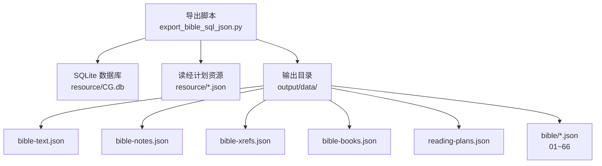
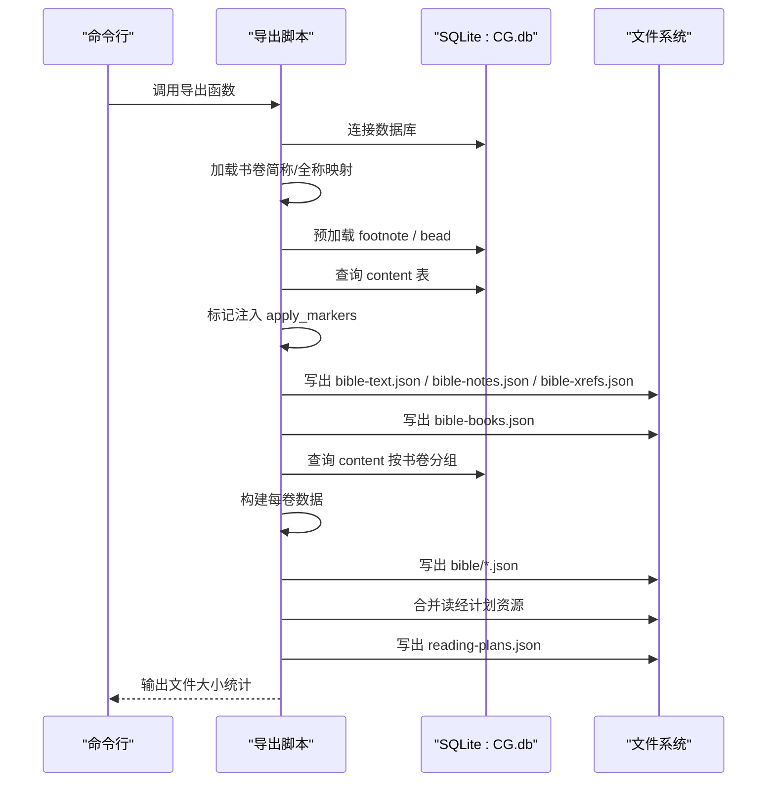
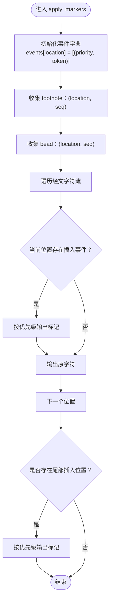
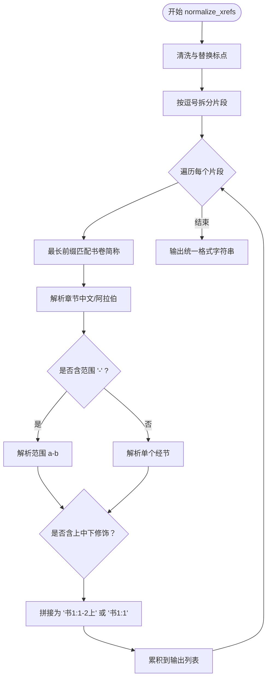
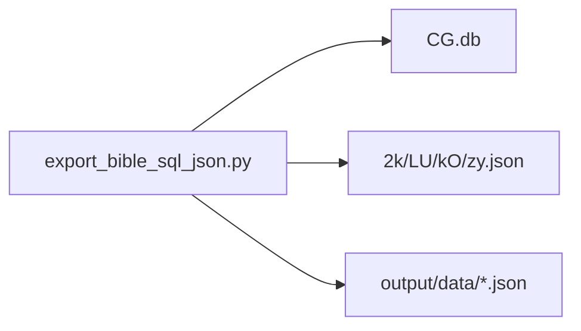

# 数据导出流程

<cite>
**本文档引用的文件**
- [export_bible_sql_json.py](file://export_bible_sql_json.py)
- [output/data/bible/01.json](file://output/data/bible/01.json)
- [resource/2k.json](file://resource/2k.json)
- [resource/LU.json](file://resource/LU.json)
- [resource/kO.json](file://resource/kO.json)
- [resource/zy.json](file://resource/zy.json)
- [resource/CG.db](file://resource/CG.db)
- [app_config.json](file://app_config.json)
</cite>

## 目录
1. [简介](#简介)
2. [项目结构](#项目结构)
3. [核心组件](#核心组件)
4. [架构总览](#架构总览)
5. [详细组件分析](#详细组件分析)
6. [依赖关系分析](#依赖关系分析)
7. [性能考虑](#性能考虑)
8. [故障排除指南](#故障排除指南)
9. [结论](#结论)
10. [附录](#附录)

## 简介
本文件面向 export_bible_sql_json.py 数据导出脚本，系统性阐述从 SQLite 数据库（CG.db）到 JSON 的完整转换流程，涵盖以下目标产物：
- 全局 JSON：bible-text.json（经文，含注解序号与串珠标记）、bible-notes.json（注解列表）、bible-xrefs.json（串珠/交叉引用）
- 书卷映射：bible-books.json（书卷简称与全称）
- 按书卷分片：output/data/bible/01.json ~ 66.json（每卷独立 JSON，包含经文、注解、串珠）
- 读经计划：reading-plans.json（多套中文读经计划整合）

同时，文档深入解析数据规范化处理、中文数字解析、串珠交叉引用标准化等关键算法，并给出调试方法与性能优化建议。

## 项目结构
仓库采用功能模块化组织，导出脚本位于根目录，资源与输出目录如下：
- 导出脚本：export_bible_sql_json.py
- 资源数据库：resource/CG.db（SQLite）
- 读经计划资源：resource/2k.json、resource/LU.json、resource/kO.json、resource/zy.json
- 输出目录：output/data（包含全局 JSON、书卷映射、按书卷分片、读经计划）

图表来源
- [export_bible_sql_json.py](file://export_bible_sql_json.py)
- [resource/CG.db](file://resource/CG.db)
- [resource/2k.json](file://resource/2k.json)
- [resource/LU.json](file://resource/LU.json)
- [resource/kO.json](file://resource/kO.json)
- [resource/zy.json](file://resource/zy.json)

章节来源
- [export_bible_sql_json.py](file://export_bible_sql_json.py)
- [resource/CG.db](file://resource/CG.db)
- [resource/2k.json](file://resource/2k.json)
- [resource/LU.json](file://resource/LU.json)
- [resource/kO.json](file://resource/kO.json)
- [resource/zy.json](file://resource/zy.json)

## 核心组件
- 数据库连接与查询：通过 sqlite3 连接 CG.db，按需查询 content、footnote、bead、book_name 等表
- 数据预加载：一次性加载 footnote 与 bead，按 (book_index, chapter, section, flag) 聚合，支持 flag 合并
- 标记注入：将注解序号 {seq} 与串珠标记 [letter] 按 location 插入经文字符流
- 串珠标准化：将多样化的中文串珠表达统一为“书1:1,书1:2”格式，支持中文数字与阿拉伯数字混排
- 数据写出：使用 _write_json 将字典序列化为 UTF-8 编码的 JSON 文件

章节来源
- [export_bible_sql_json.py](file://export_bible_sql_json.py)

## 架构总览
导出流程分为四个阶段：全局 JSON、书卷映射、按书卷分片、读经计划。整体控制流如下：

图表来源
- [export_bible_sql_json.py](file://export_bible_sql_json.py)

章节来源
- [export_bible_sql_json.py](file://export_bible_sql_json.py)

## 详细组件分析

### 数据结构与工具
- VerseKey：用于按书卷、章、节定位经文
- cn_num_to_int：将中文数字（零~十、百、〇○）与阿拉伯数字统一转为整数
- load_book_acronym_map / load_book_full_name_map：从 book_name 表提取书卷简称与全称，优先中文名称
- build_book_token_map：构建书卷别名映射，便于标准化串珠中的书卷标识
- normalize_xrefs：串珠标准化主函数，支持多种输入格式与中文数字，输出统一格式

章节来源
- [export_bible_sql_json.py](file://export_bible_sql_json.py)

### 标记注入算法（apply_markers）
将注解与串珠按 location 插入经文，保证插入顺序稳定：
- 事件收集：按 location 聚合注解 {seq} 与串珠 [letter]
- 字符流遍历：逐字符扫描，遇到插入点先按优先级输出标记，再输出原字符
- 尾部处理：超出经文长度的位置，按相同规则追加标记

图表来源
- [export_bible_sql_json.py](file://export_bible_sql_json.py)

章节来源
- [export_bible_sql_json.py](file://export_bible_sql_json.py)

### 串珠标准化算法（normalize_xrefs）
将多样化的串珠输入统一为“书1:1,书1:2”格式：
- 清洗与拆分：去除引导词、替换标点、按逗号拆分片段
- 令牌匹配：按最长前缀匹配书卷简称，确定当前书卷
- 解析章节与经节：支持“一二三”、“1”等中文数字与阿拉伯数字混排
- 范围与修饰：支持“1-2”范围与“上中下”修饰符
- 输出拼接：统一为“书卷:章:经节(-经节)?[上中下]?”

图表来源
- [export_bible_sql_json.py](file://export_bible_sql_json.py)

章节来源
- [export_bible_sql_json.py](file://export_bible_sql_json.py)

### 数据导出流程
- export_global_json：生成全局 JSON（bible-text.json、bible-notes.json、bible-xrefs.json）
- export_books_json：生成书卷映射（bible-books.json）
- export_shard_json：按书卷分片生成 01~66.json
- export_reading_plans：合并读经计划资源生成 reading-plans.json

章节来源
- [export_bible_sql_json.py](file://export_bible_sql_json.py)

### 示例输出结构
- 按书卷分片（如 01.json）包含 book_index、book_name、book_acronym 与 chapters 列表，每章包含 section、flag、content，以及可选的 footnotes 与 beads
- 全局 JSON（如 bible-text.json）键为“书卷简称+章:节+旗标”，值为带标记的经文

章节来源
- [output/data/bible/01.json](file://output/data/bible/01.json)

## 依赖关系分析
- 外部依赖：sqlite3（标准库）、json（标准库）、re（正则表达式）、argparse（命令行参数）、pathlib（路径处理）
- 内部依赖：各导出函数之间的调用关系清晰，数据自顶向下传递
- 资源依赖：CG.db 提供经文、注解、串珠、书卷名称；读经计划 JSON 文件提供阅读计划

图表来源
- [export_bible_sql_json.py](file://export_bible_sql_json.py)
- [resource/CG.db](file://resource/CG.db)
- [resource/2k.json](file://resource/2k.json)
- [resource/LU.json](file://resource/LU.json)
- [resource/kO.json](file://resource/kO.json)
- [resource/zy.json](file://resource/zy.json)

章节来源
- [export_bible_sql_json.py](file://export_bible_sql_json.py)

## 性能考虑
- 预加载策略：一次性查询 footnote、bead、content，避免多次往返数据库，降低 IO 开销
- 内存占用：按书卷分片输出，避免单文件过大；全局 JSON 仍需关注内存峰值
- 正则复杂度：normalize_xrefs 使用多处正则匹配，建议在输入规模较大时进行缓存或限制输入长度
- 写入优化：统一使用 UTF-8 写出，避免编码转换开销

## 故障排除指南
- 数据库不存在：检查 db_path 是否正确，默认指向 resource/CG.db
- 读经计划缺失：若资源文件不存在，脚本会打印警告并跳过该计划
- 串珠格式异常：若 normalize_xrefs 无法解析，会回退为原始文本；可通过调试输出查看具体片段
- 文件写入失败：确认输出目录权限与磁盘空间

章节来源
- [export_bible_sql_json.py](file://export_bible_sql_json.py)

## 结论
该导出脚本通过预加载、标记注入与串珠标准化三大核心机制，高效地将 SQLite 中的经文、注解与串珠转换为结构化的 JSON 数据。按书卷分片的设计提升了前端加载性能与可维护性；读经计划的整合增强了实用性。建议在大规模部署时关注内存与正则性能，并完善输入校验与错误日志。

## 附录
- 命令行用法：python export_bible_sql_json.py [--sqlite-db PATH] [--out-dir PATH]
- 默认数据库：resource/CG.db
- 默认输出目录：output/data

章节来源
- [export_bible_sql_json.py](file://export_bible_sql_json.py)
- [app_config.json](file://app_config.json)