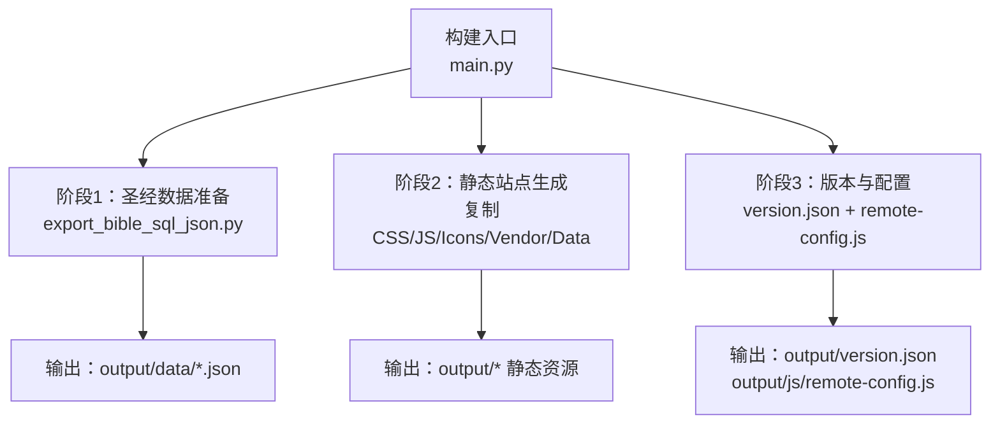
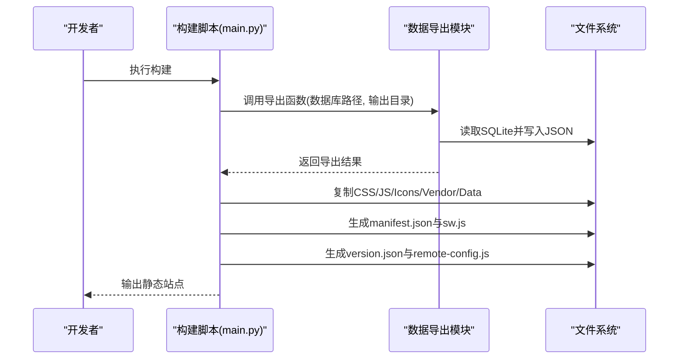
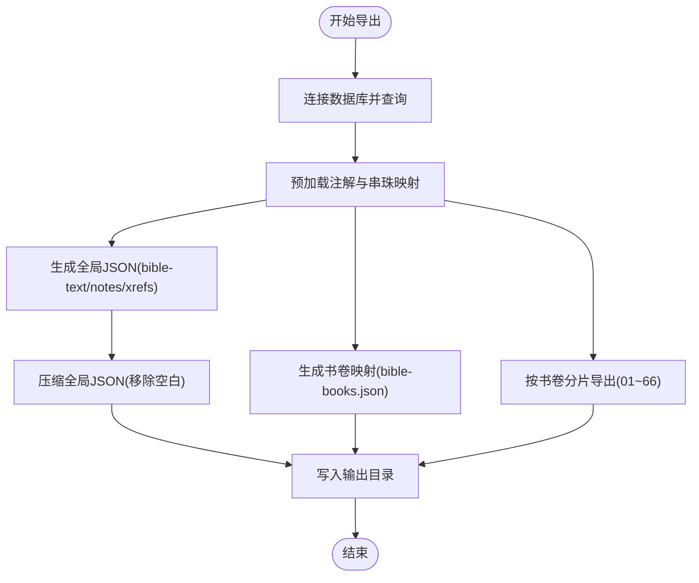
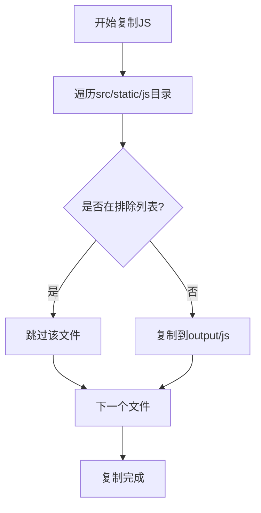
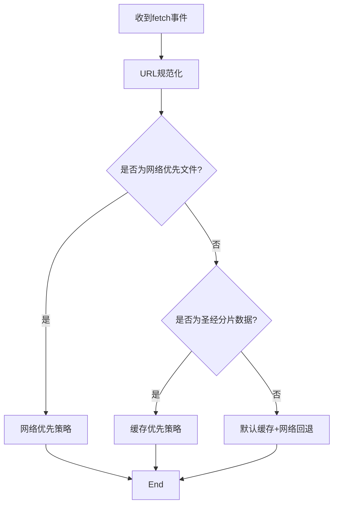
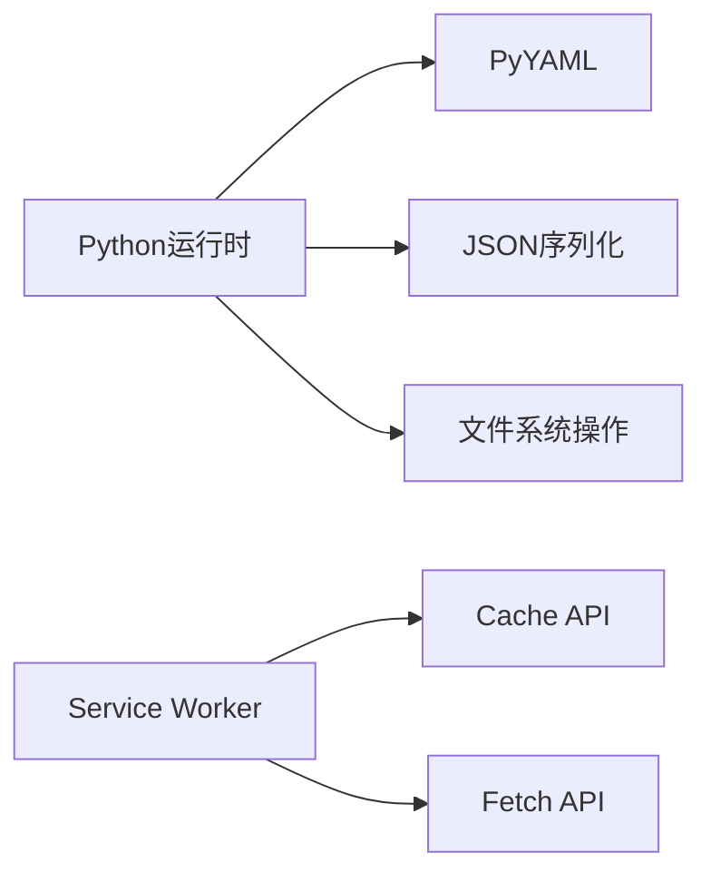

# 构建优化策略

<cite>
**本文档引用的文件**
- [build.sh](file://build.sh)
- [package.json](file://package.json)
- [main.py](file://main.py)
- [export_bible_sql_json.py](file://export_bible_sql_json.py)
- [config.yaml](file://config.yaml)
- [app_config.json](file://app_config.json)
- [capacitor.config.json](file://capacitor.config.json)
- [src/templates/main_manifest.json](file://src/templates/main_manifest.json)
- [src/templates/main_sw.js](file://src/templates/main_sw.js)
- [changelog.json](file://changelog.json)
</cite>

## 目录
1. [引言](#引言)
2. [项目结构](#项目结构)
3. [核心组件](#核心组件)
4. [架构概览](#架构概览)
5. [详细组件分析](#详细组件分析)
6. [依赖关系分析](#依赖关系分析)
7. [性能考虑](#性能考虑)
8. [故障排查指南](#故障排查指南)
9. [结论](#结论)
10. [附录](#附录)

## 引言
本文件面向构建系统优化，围绕构建脚本中的性能优化技术进行系统性梳理，重点覆盖以下方面：
- 文件复制优化：如何在静态资源复制阶段减少不必要的文件拷贝，降低I/O开销
- JSON数据压缩：在生成阶段对全局JSON进行无损压缩，减少包体体积
- 资源打包策略：基于Service Worker的缓存策略设计，提升离线可用性和加载速度
- 排除机制设计：EXCLUDED_JS_FILES等排除机制的实现原理与适用场景
- 构建时间优化：通过并行化、增量构建、缓存利用等手段缩短构建周期
- 内存使用优化：在Python数据处理阶段控制内存峰值，避免大规模数据操作导致的内存压力
- 磁盘空间管理：合理规划输出目录结构，清理临时文件，控制产物体积
- CI/CD环境优化：在Cloudflare Pages等平台上的构建配置与自动化部署最佳实践

## 项目结构
该项目采用“Python构建脚本 + 模板资源 + 静态资源”的三层结构：
- 构建入口：通过Python脚本执行三阶段构建，生成PWA静态站点
- 数据层：从SQLite数据库导出JSON数据，并按书卷拆分为66个分片文件
- 资源层：复制CSS、JS、图标、第三方库等静态资源，并生成manifest与service worker

**图表来源**
- [main.py:36-76](file://main.py#L36-L76)
- [export_bible_sql_json.py:743-800](file://export_bible_sql_json.py#L743-L800)

**章节来源**
- [main.py:36-161](file://main.py#L36-L161)
- [config.yaml:1-12](file://config.yaml#L1-L12)

## 核心组件
- 构建主脚本：负责三阶段构建流程、配置加载、阶段间协调
- 数据导出模块：从SQLite数据库导出JSON，支持全局聚合与按书卷分片
- 静态资源复制：按需复制CSS、JS、图标、vendor与静态数据
- Service Worker：定义缓存策略，区分网络优先与缓存优先的资源类型
- 配置与版本：生成version.json与remote-config.js，支持远程服务器配置

**章节来源**
- [main.py:78-361](file://main.py#L78-L361)
- [export_bible_sql_json.py:1-835](file://export_bible_sql_json.py#L1-L835)
- [src/templates/main_sw.js:1-270](file://src/templates/main_sw.js#L1-L270)

## 架构概览
整体构建流程分为三个阶段：
1) 圣经数据准备：调用数据导出模块，生成全局JSON与按书卷分片的JSON
2) 静态站点生成：复制静态资源，生成manifest与service worker
3) 版本与配置：生成version.json与remote-config.js，复制应用配置

**图表来源**
- [main.py:87-161](file://main.py#L87-L161)
- [export_bible_sql_json.py:743-800](file://export_bible_sql_json.py#L743-L800)

## 详细组件分析

### 数据导出与JSON压缩
- 数据导出流程：从SQLite数据库读取经文、注解、串珠与书卷映射，生成全局JSON与按书卷分片的JSON
- JSON压缩策略：在生成阶段对全局JSON进行无缩进压缩，移除空白字符，显著降低包体体积
- 性能影响：压缩过程仅针对少量全局JSON文件，CPU开销可忽略；但对下载与传输效率提升明显

**图表来源**
- [export_bible_sql_json.py:743-800](file://export_bible_sql_json.py#L743-L800)
- [main.py:107-116](file://main.py#L107-L116)

**章节来源**
- [export_bible_sql_json.py:459-530](file://export_bible_sql_json.py#L459-L530)
- [export_bible_sql_json.py:553-596](file://export_bible_sql_json.py#L553-L596)
- [main.py:107-116](file://main.py#L107-L116)

### 静态资源复制与排除机制
- 排除机制：通过EXCLUDED_JS_FILES集合在复制JS阶段过滤不需要的训练相关文件
- 复制策略：按目录粒度复制CSS、JS、icons、vendor与静态data，避免冗余文件进入产物
- 性能收益：减少I/O次数与产物体积，尤其在CI环境中显著缩短上传时间

**图表来源**
- [main.py:26-33](file://main.py#L26-L33)
- [main.py:186-204](file://main.py#L186-L204)

**章节来源**
- [main.py:26-33](file://main.py#L26-L33)
- [main.py:186-204](file://main.py#L186-L204)

### Service Worker缓存策略
- 缓存策略分类：
  - 版本文件：network-only，确保版本检测实时性
  - 圣经分片数据：cache-first，数据稳定且体积大，优先缓存提升离线可用性
  - 其他资源：默认cache-first + network fallback，结合超时控制与错误兜底
- 高级功能：支持批量缓存66卷数据、查询缓存状态、清理缓存等消息接口

**图表来源**
- [src/templates/main_sw.js:88-166](file://src/templates/main_sw.js#L88-L166)

**章节来源**
- [src/templates/main_sw.js:8-166](file://src/templates/main_sw.js#L8-L166)

### 版本与配置生成
- version.json：包含版本号、构建时间等元信息，便于前端检测更新
- remote-config.js：将远程服务器地址以base64存储，运行时解码，避免明文泄露
- app_config.json：复制应用基础配置至输出目录

**章节来源**
- [main.py:288-321](file://main.py#L288-L321)
- [main.py:323-356](file://main.py#L323-L356)
- [app_config.json:1-6](file://app_config.json#L1-L6)

## 依赖关系分析
- 构建脚本依赖：Python标准库与PyYAML，用于解析配置与生成JSON
- 数据导出依赖：SQLite数据库与正则表达式，用于数据清洗与标准化
- 运行时依赖：浏览器Service Worker与缓存API，用于离线缓存与加速访问

**图表来源**
- [requirements.txt:1-2](file://requirements.txt#L1-L2)
- [src/templates/main_sw.js:1-270](file://src/templates/main_sw.js#L1-L270)

**章节来源**
- [requirements.txt:1-2](file://requirements.txt#L1-L2)
- [main.py:1-361](file://main.py#L1-L361)

## 性能考虑
- 构建时间优化
  - 并行化：在数据导出阶段，将预加载与写入步骤分离，减少阻塞
  - 增量构建：在CI中缓存依赖与输出目录，仅在变更时重建
  - I/O优化：通过排除机制减少复制文件数量，降低磁盘写入
  - 压缩策略：对全局JSON进行无损压缩，减少后续打包与传输时间
- 内存使用优化
  - 流式处理：在数据导出中按节处理，避免一次性加载全部数据
  - 预加载映射：使用字典与defaultdict减少重复计算，控制内存峰值
  - 及时释放：在生成阶段完成后及时关闭数据库连接与文件句柄
- 磁盘空间管理
  - 输出目录隔离：将数据、静态资源与配置分别存放，便于清理
  - 产物压缩：在构建阶段完成压缩，避免额外的压缩工具链
  - 临时文件：在CI中使用容器缓存，避免本地磁盘占用

[本节为通用性能指导，无需特定文件引用]

## 故障排查指南
- 构建失败：检查数据库是否存在与路径正确性
  - 参考路径：[main.py:89-105](file://main.py#L89-L105)
- 依赖缺失：确认PyYAML安装与版本要求
  - 参考路径：[requirements.txt:1-2](file://requirements.txt#L1-L2)
- Service Worker缓存异常：检查缓存键与URL规范化逻辑
  - 参考路径：[src/templates/main_sw.js:46-64](file://src/templates/main_sw.js#L46-L64)
- 版本检测失效：确认version.json生成与remote-config.js编码
  - 参考路径：[main.py:299-321](file://main.py#L299-L321)

**章节来源**
- [main.py:89-105](file://main.py#L89-L105)
- [requirements.txt:1-2](file://requirements.txt#L1-L2)
- [src/templates/main_sw.js:46-64](file://src/templates/main_sw.js#L46-L64)
- [main.py:299-321](file://main.py#L299-L321)

## 结论
本构建系统通过明确的三阶段流程、有针对性的排除机制与JSON压缩策略，在保证功能完整性的同时实现了显著的性能优化。配合Service Worker的缓存策略，进一步提升了用户体验与离线可用性。在CI/CD环境下，建议结合缓存与并行化策略，持续优化构建时间与资源消耗。

[本节为总结性内容，无需特定文件引用]

## 附录

### CI/CD环境优化配置与自动化部署最佳实践
- Cloudflare Pages构建脚本
  - 使用提供的构建脚本作为入口，自动安装依赖并执行构建
  - 参考路径：[build.sh:1-16](file://build.sh#L1-L16)
- NPM脚本集成
  - 通过NPM脚本统一Android构建流程，串联构建、同步与打包
  - 参考路径：[package.json:5-11](file://package.json#L5-L11)
- Capacitor配置
  - 指定Web目录为output，启用混合内容与调试选项
  - 参考路径：[capacitor.config.json:1-10](file://capacitor.config.json#L1-L10)
- 配置与模板
  - 通过config.yaml集中管理输出目录、静态目录与数据库路径
  - 参考路径：[config.yaml:1-12](file://config.yaml#L1-L12)
  - 通过模板生成manifest与service worker，保持一致性
  - 参考路径：[src/templates/main_manifest.json:1-26](file://src/templates/main_manifest.json#L1-L26)
  - 参考路径：[src/templates/main_sw.js:1-270](file://src/templates/main_sw.js#L1-L270)

**章节来源**
- [build.sh:1-16](file://build.sh#L1-L16)
- [package.json:5-11](file://package.json#L5-L11)
- [capacitor.config.json:1-10](file://capacitor.config.json#L1-L10)
- [config.yaml:1-12](file://config.yaml#L1-L12)
- [src/templates/main_manifest.json:1-26](file://src/templates/main_manifest.json#L1-L26)
- [src/templates/main_sw.js:1-270](file://src/templates/main_sw.js#L1-L270)