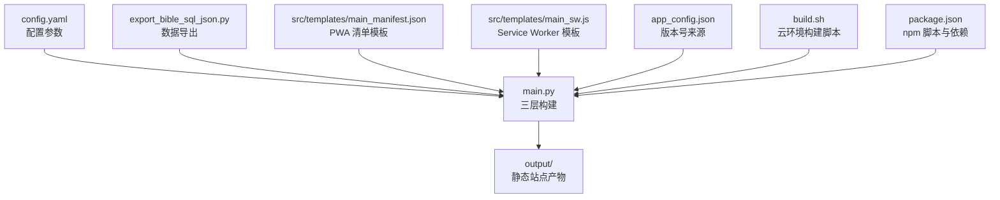
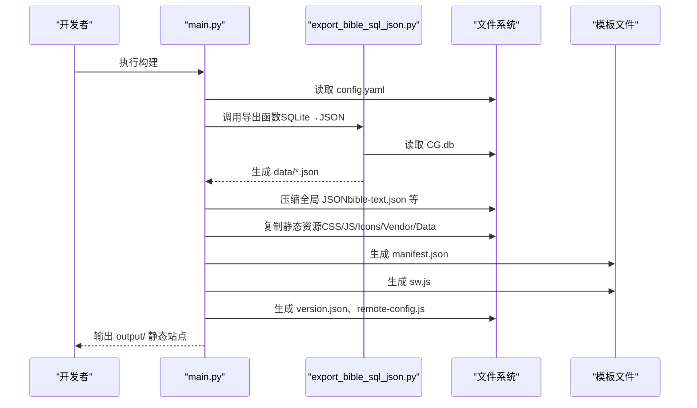
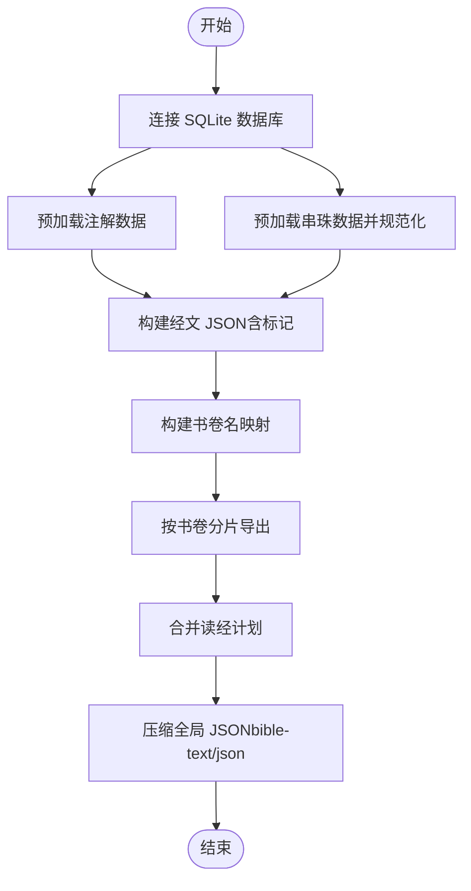
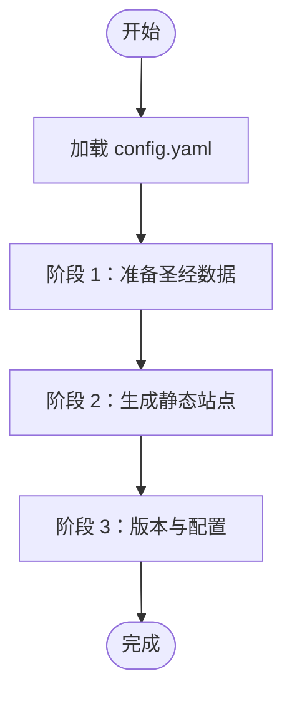
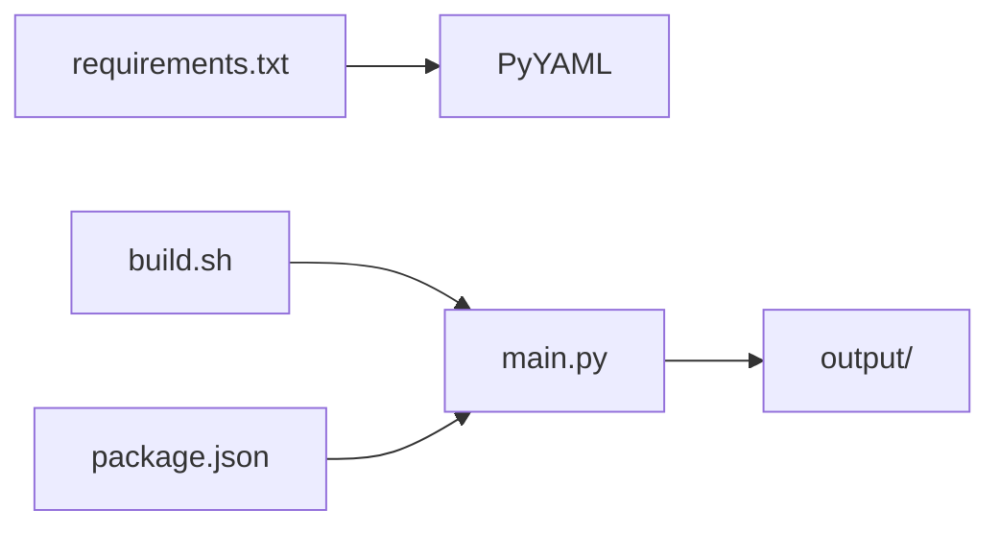

# 构建系统

<cite>
**本文档引用的文件**
- [config.yaml](file://config.yaml)
- [export_bible_sql_json.py](file://export_bible_sql_json.py)
- [main.py](file://main.py)
- [build.sh](file://build.sh)
- [requirements.txt](file://requirements.txt)
- [app_config.json](file://app_config.json)
- [package.json](file://package.json)
- [src/templates/main_manifest.json](file://src/templates/main_manifest.json)
- [src/templates/main_sw.js](file://src/templates/main_sw.js)
- [output/version.json](file://output/version.json)
- [output/manifest.json](file://output/manifest.json)
- [output/data/bible-books.json](file://output/data/bible-books.json)
</cite>

## 目录
1. [简介](#简介)
2. [项目结构](#项目结构)
3. [核心组件](#核心组件)
4. [架构总览](#架构总览)
5. [详细组件分析](#详细组件分析)
6. [依赖分析](#依赖分析)
7. [性能考虑](#性能考虑)
8. [故障排查指南](#故障排查指南)
9. [结论](#结论)
10. [附录](#附录)

## 简介
本项目是一个基于 Python 的圣经阅读器构建系统，采用三层构建流程：
- 阶段 1：圣经数据准备（从 SQLite 数据库导出 JSON）
- 阶段 2：静态站点生成（复制静态资源、生成 PWA 清单与 Service Worker）
- 阶段 3：版本与配置（生成版本信息与远程配置）

构建系统通过配置文件集中管理输出目录、静态资源路径、数据库位置等参数；并通过导出脚本实现从 SQLite 到 JSON 的数据转换、规范化处理与中文数字解析；最终生成可部署的静态站点与 PWA。

## 项目结构
项目采用“配置驱动 + 脚本编排”的结构，关键文件与职责如下：
- 配置层：config.yaml 定义输出目录、静态资源目录、数据库路径、读经计划与远程服务器配置
- 数据层：export_bible_sql_json.py 负责从 SQLite 导出 JSON 并进行数据规范化
- 构建层：main.py 实现三层构建流程，负责复制静态资源、生成清单与配置
- 运行层：build.sh 用于云环境一键安装依赖并执行构建；package.json 提供 npm 脚本集成 Capacitor 与 Android 构建
- 模板层：src/templates 提供 PWA 清单与 Service Worker 模板
- 输出层：output 目录包含最终产物（静态文件、清单、版本信息、数据文件）

图表来源
- [config.yaml:1-12](file://config.yaml#L1-L12)
- [main.py:36-76](file://main.py#L36-L76)
- [export_bible_sql_json.py:743-800](file://export_bible_sql_json.py#L743-L800)
- [src/templates/main_manifest.json:1-26](file://src/templates/main_manifest.json#L1-L26)
- [src/templates/main_sw.js:1-270](file://src/templates/main_sw.js#L1-L270)
- [app_config.json:1-6](file://app_config.json#L1-L6)
- [build.sh:1-16](file://build.sh#L1-L16)
- [package.json:1-24](file://package.json#L1-L24)

章节来源
- [config.yaml:1-12](file://config.yaml#L1-L12)
- [main.py:36-76](file://main.py#L36-L76)
- [export_bible_sql_json.py:743-800](file://export_bible_sql_json.py#L743-L800)
- [src/templates/main_manifest.json:1-26](file://src/templates/main_manifest.json#L1-L26)
- [src/templates/main_sw.js:1-270](file://src/templates/main_sw.js#L1-L270)
- [app_config.json:1-6](file://app_config.json#L1-L6)
- [build.sh:1-16](file://build.sh#L1-L16)
- [package.json:1-24](file://package.json#L1-L24)

## 核心组件
- 配置文件 config.yaml
  - 输出目录 output_dir：默认 "output"
  - 静态资源目录 static_dir：默认 "src/static"
  - 圣经数据库 bible_db：默认 "resource/CG.db"
  - 读经计划 reading_plans：默认包含 4 个 JSON 文件路径
  - 远程服务器 remote_servers：包含 GitHub API、镜像站等配置项
- 导出脚本 export_bible_sql_json.py
  - 从 SQLite 表 content、footnote、bead、book_name 导出 JSON
  - 支持中文数字解析与串珠规范化
  - 生成全局 JSON、书卷名映射、按书卷分片 JSON、读经计划整合
- 构建脚本 main.py
  - 阶段 1：准备圣经数据（调用导出脚本并压缩全局 JSON）
  - 阶段 2：生成静态站点（复制 HTML/CSS/JS/Icons/Vendor/Data，生成清单与 SW）
  - 阶段 3：版本与配置（生成 version.json、remote-config.js、复制 app_config.json）
- 模板文件
  - main_manifest.json：PWA 清单模板
  - main_sw.js：Service Worker 模板（缓存策略、离线支持、消息交互）
- 运行脚本
  - build.sh：安装依赖并执行 main.py
  - package.json：npm 脚本（构建、Capacitor 同步与 Android 构建）

章节来源
- [config.yaml:1-12](file://config.yaml#L1-L12)
- [export_bible_sql_json.py:1-835](file://export_bible_sql_json.py#L1-L835)
- [main.py:36-361](file://main.py#L36-L361)
- [src/templates/main_manifest.json:1-26](file://src/templates/main_manifest.json#L1-L26)
- [src/templates/main_sw.js:1-270](file://src/templates/main_sw.js#L1-L270)
- [build.sh:1-16](file://build.sh#L1-L16)
- [package.json:1-24](file://package.json#L1-L24)

## 架构总览
三层构建流程的总体控制流如下：

图表来源
- [main.py:36-76](file://main.py#L36-L76)
- [export_bible_sql_json.py:743-800](file://export_bible_sql_json.py#L743-L800)
- [src/templates/main_manifest.json:1-26](file://src/templates/main_manifest.json#L1-L26)
- [src/templates/main_sw.js:1-270](file://src/templates/main_sw.js#L1-L270)

## 详细组件分析

### 配置文件 config.yaml 参数说明
- output_dir：输出目录，默认 "output"
- static_dir：静态资源目录，默认 "src/static"
- bible_db：SQLite 数据库路径，默认 "resource/CG.db"
- reading_plans：读经计划 JSON 文件列表，默认包含 4 个文件
- remote_servers：远程服务器配置，包含：
  - github_api：GitHub 最新发布接口
  - 其他键值可扩展为镜像站、推送地址、IP 接口等

章节来源
- [config.yaml:1-12](file://config.yaml#L1-L12)

### 导出脚本 export_bible_sql_json.py 工作原理
- 数据源与目标
  - 输入：SQLite 数据库（content、footnote、bead、book_name）
  - 输出：多个 JSON 文件（bible-text.json、bible-notes.json、bible-xrefs.json、bible-books.json、bible/01~66.json、reading-plans.json）
- 关键流程
  - 预加载：读取注解与串珠，按 flag 合并，建立标记映射与内容映射
  - 文本标记：在经文合适位置插入注解序号与串珠标识
  - 串珠规范化：将中文数字与多种分隔符统一为标准格式
  - 中文数字处理：将“一二三四”等转换为阿拉伯数字
  - 分片导出：按书卷拆分为 66 个 JSON 文件
  - 读经计划：合并多个计划文件为一个 JSON
- 性能与体积优化
  - 导出完成后对全局 JSON 进行压缩（去除多余空白），降低打包体积

图表来源
- [export_bible_sql_json.py:743-800](file://export_bible_sql_json.py#L743-L800)
- [export_bible_sql_json.py:376-454](file://export_bible_sql_json.py#L376-L454)
- [export_bible_sql_json.py:193-333](file://export_bible_sql_json.py#L193-L333)
- [export_bible_sql_json.py:53-97](file://export_bible_sql_json.py#L53-L97)

章节来源
- [export_bible_sql_json.py:1-835](file://export_bible_sql_json.py#L1-L835)

### 构建脚本 main.py 三层流程
- 阶段 1：圣经数据准备
  - 读取配置中的数据库路径
  - 调用导出函数生成 data 目录下的 JSON
  - 对全局 JSON 进行压缩（去除缩进）
- 阶段 2：静态站点生成
  - 复制 index.html、CSS、JS（排除训练相关文件）、icons、vendor、静态 data
  - 生成 manifest.json（替换名称）
  - 生成 sw.js（直接复制模板）
  - 复制 _redirects 与 changelog.json（如存在）
  - 创建 .nojekyll
- 阶段 3：版本与配置
  - 读取 app_config.json 获取版本号
  - 生成 version.json（包含版本号与构建时间）
  - 如配置了 remote_servers，则生成 remote-config.js（URL 以 base64 存储）
  - 复制 app_config.json 到输出目录

图表来源
- [main.py:36-76](file://main.py#L36-L76)
- [main.py:87-117](file://main.py#L87-L117)
- [main.py:121-162](file://main.py#L121-L162)
- [main.py:288-357](file://main.py#L288-L357)

章节来源
- [main.py:36-361](file://main.py#L36-L361)

### Service Worker 与 PWA 清单
- Service Worker（main_sw.js）
  - 缓存策略：圣经分片数据 cache-first，版本文件 network-first，其他资源 cache-first + network fallback
  - URL 规范化：处理中文路径与目录补全
  - 离线支持：导航失败时返回提示页
  - 消息交互：支持清理缓存、批量缓存 66 卷数据、查询缓存状态
- PWA 清单（main_manifest.json）
  - 名称、短名称、描述、图标等字段
  - standalone 显示模式与主题色

章节来源
- [src/templates/main_sw.js:1-270](file://src/templates/main_sw.js#L1-L270)
- [src/templates/main_manifest.json:1-26](file://src/templates/main_manifest.json#L1-L26)
- [output/manifest.json:1-28](file://output/manifest.json#L1-L28)

### 版本与远程配置
- version.json：包含版本号与构建时间，用于前端版本检测与更新
- remote-config.js：将远程服务器配置以 base64 存储，运行时解码使用
- app_config.json：复制到输出目录，供前端读取应用基础信息

章节来源
- [main.py:288-357](file://main.py#L288-L357)
- [output/version.json:1-5](file://output/version.json#L1-L5)
- [app_config.json:1-6](file://app_config.json#L1-L6)

## 依赖分析
- Python 依赖
  - PyYAML：用于解析 YAML 配置文件
- 运行脚本
  - build.sh：安装依赖并执行构建
  - package.json：提供 npm 脚本，集成 Capacitor 与 Android 构建

图表来源
- [requirements.txt:1-2](file://requirements.txt#L1-L2)
- [build.sh:1-16](file://build.sh#L1-L16)
- [package.json:1-24](file://package.json#L1-L24)
- [main.py:36-76](file://main.py#L36-L76)

章节来源
- [requirements.txt:1-2](file://requirements.txt#L1-L2)
- [build.sh:1-16](file://build.sh#L1-L16)
- [package.json:1-24](file://package.json#L1-L24)
- [main.py:36-76](file://main.py#L36-L76)

## 性能考虑
- 数据导出阶段
  - 预加载注解与串珠，按 flag 合并，减少重复扫描
  - 串珠规范化与中文数字解析在内存中完成，避免多次 I/O
- 静态站点生成阶段
  - 压缩全局 JSON，显著降低体积
  - 复制静态资源时过滤不必要的训练相关 JS 文件
- Service Worker 缓存策略
  - 圣经分片数据 cache-first，提升离线可用性与加载速度
  - 版本文件 network-first，保证更新及时性
  - 导航失败时快速回退到离线提示页

## 故障排查指南
- 数据库不存在
  - 症状：阶段 1 报错退出
  - 处理：确认 config.yaml 中 bible_db 路径正确，数据库文件存在
- 导出文件缺失
  - 症状：输出目录缺少某些 JSON 文件
  - 处理：检查 SQLite 表是否存在对应数据；确认导出函数执行成功
- 静态资源未复制
  - 症状：output/ 缺少 CSS/JS/Icons/Vendor/Data
  - 处理：确认 static_dir 与模板路径正确；检查复制函数是否被调用
- 清单与 SW 未生成
  - 症状：output/ 缺少 manifest.json 或 sw.js
  - 处理：确认模板文件存在；检查生成函数是否执行
- 版本信息异常
  - 症状：version.json 内容不符合预期
  - 处理：检查 app_config.json 的版本号；确认生成逻辑执行
- 远程配置不可用
  - 症状：remote-config.js 为空或无法解码
  - 处理：检查 config.yaml 中 remote_servers 配置；确认生成函数执行

章节来源
- [main.py:87-117](file://main.py#L87-L117)
- [main.py:121-162](file://main.py#L121-L162)
- [main.py:288-357](file://main.py#L288-L357)

## 结论
本构建系统通过清晰的三层流程与集中配置，实现了从 SQLite 数据到静态 PWA 站点的自动化产出。导出脚本专注于数据规范化与格式转换，构建脚本负责资源复制与配置生成，配合 Service Worker 与 PWA 清单，提供了良好的离线体验与跨平台部署能力。建议在定制化场景中遵循“配置优先、脚本最小化”的原则，保持构建流程的可维护性与可移植性。

## 附录

### 自定义构建配置方法与最佳实践
- 修改输出目录与静态资源路径
  - 在 config.yaml 中调整 output_dir 与 static_dir，确保与实际项目结构一致
- 更换数据库与读经计划
  - 更新 bible_db 指向新的 SQLite 文件；在 reading_plans 中添加或删除计划文件路径
- 添加远程服务器配置
  - 在 remote_servers 中新增键值（如镜像站、推送地址、IP 接口），构建时会生成对应的 remote-config.js
- 控制 JS 文件复制范围
  - 在 main.py 中的 EXCLUDED_JS_FILES 可增删排除项，以适配不同平台（如仅 Web 或同时构建 APK）
- 优化构建性能
  - 保持 SQLite 数据库索引完整，减少导出阶段扫描成本
  - 合理设置 Service Worker 缓存策略，平衡离线可用性与更新及时性
- 集成 CI/CD
  - 使用 build.sh 在云环境自动安装依赖并执行构建
  - 通过 package.json 的 npm 脚本集成 Capacitor 与 Android 构建流程

章节来源
- [config.yaml:1-12](file://config.yaml#L1-L12)
- [main.py:27-33](file://main.py#L27-L33)
- [main.py:313-357](file://main.py#L313-L357)
- [build.sh:1-16](file://build.sh#L1-L16)
- [package.json:1-24](file://package.json#L1-L24)