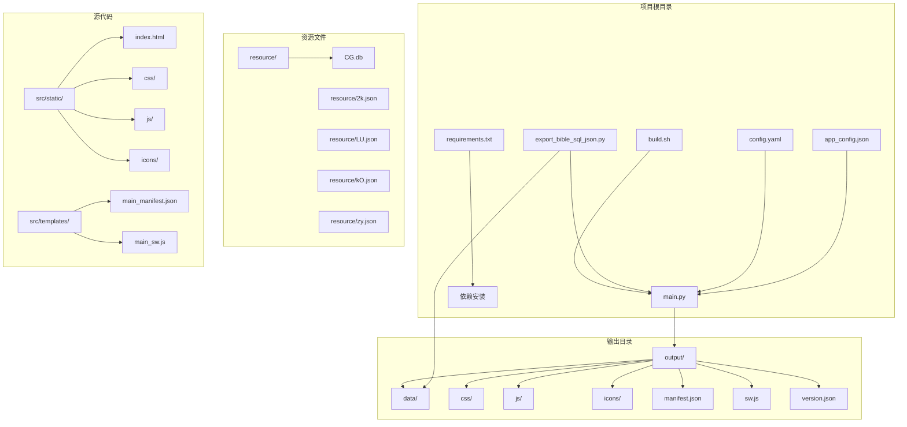
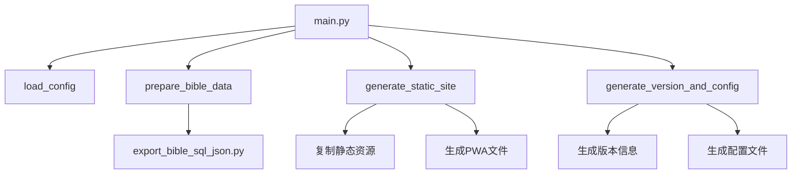
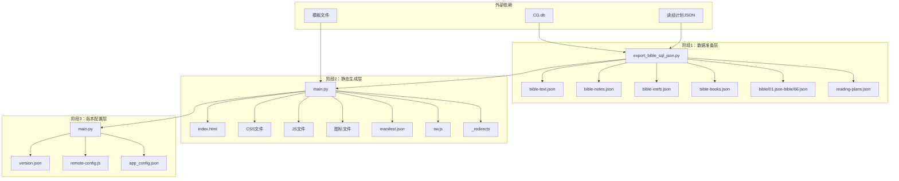
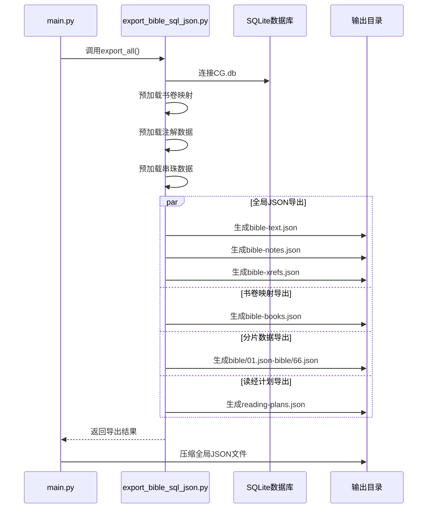
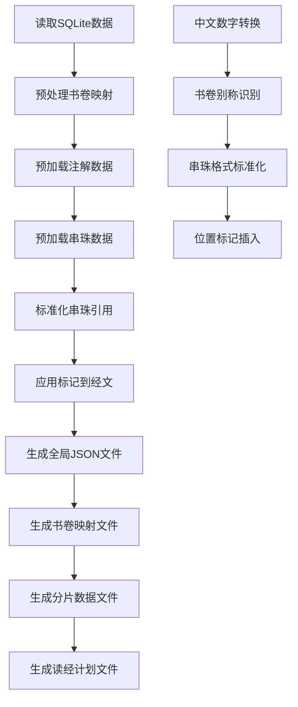
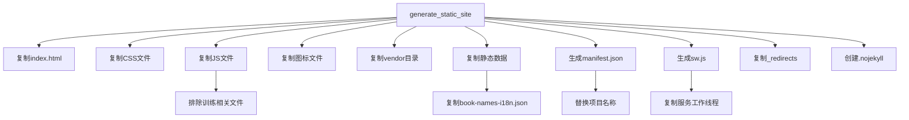
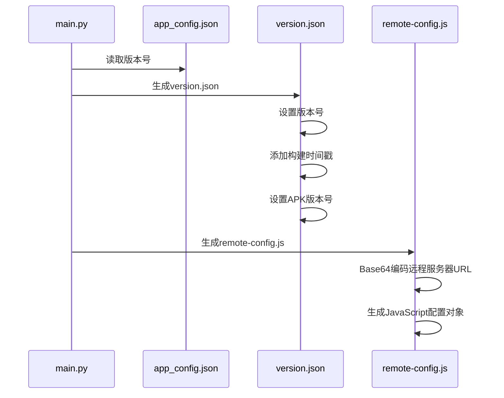
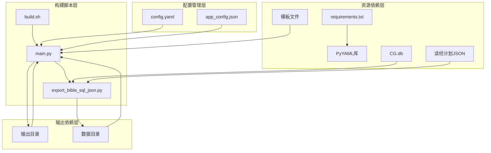

# 构建阶段详解

<cite>
**本文档引用的文件**
- [build.sh](file://build.sh)
- [export_bible_sql_json.py](file://export_bible_sql_json.py)
- [main.py](file://main.py)
- [config.yaml](file://config.yaml)
- [app_config.json](file://app_config.json)
- [requirements.txt](file://requirements.txt)
- [main_manifest.json](file://src/templates/main_manifest.json)
- [main_sw.js](file://src/templates/main_sw.js)
</cite>

## 目录
1. [简介](#简介)
2. [项目结构概览](#项目结构概览)
3. [核心组件分析](#核心组件分析)
4. [架构总览](#架构总览)
5. [详细阶段分析](#详细阶段分析)
6. [依赖关系分析](#依赖关系分析)
7. [性能考虑](#性能考虑)
8. [故障排除指南](#故障排除指南)
9. [结论](#结论)

## 简介

本项目是一个基于Python的圣经阅读器构建系统，采用三层构建架构，专门用于从SQLite数据库导出圣经数据，生成静态PWA站点，并创建版本配置信息。该系统通过模块化的三个阶段实现完整的构建流程，确保数据准备、静态站点生成和版本管理的分离与独立。

## 项目结构概览

项目采用清晰的分层结构，主要包含以下关键目录和文件：

**图表来源**
- [build.sh:1-16](file://build.sh#L1-L16)
- [main.py:24-361](file://main.py#L24-L361)

**章节来源**
- [build.sh:1-16](file://build.sh#L1-L16)
- [main.py:24-361](file://main.py#L24-L361)

## 核心组件分析

### 构建入口组件

构建系统的核心入口是`main.py`文件，它定义了完整的三层构建流程：

**图表来源**
- [main.py:36-76](file://main.py#L36-L76)
- [main.py:87-117](file://main.py#L87-L117)
- [main.py:121-161](file://main.py#L121-L161)
- [main.py:288-321](file://main.py#L288-L321)

### 数据导出组件

`export_bible_sql_json.py`负责从SQLite数据库导出完整的圣经数据集，包括经文、注解、串珠引用等多维度数据。

**章节来源**
- [export_bible_sql_json.py:1-835](file://export_bible_sql_json.py#L1-L835)

### 配置管理组件

配置系统通过`config.yaml`和`app_config.json`提供灵活的构建参数配置，支持自定义输出目录、数据库路径和远程服务器设置。

**章节来源**
- [config.yaml:1-12](file://config.yaml#L1-L12)
- [app_config.json:1-6](file://app_config.json#L1-L6)

## 架构总览

构建系统采用模块化三层架构，每层都有明确的职责边界和输入输出规范：

**图表来源**
- [main.py:87-117](file://main.py#L87-L117)
- [main.py:121-161](file://main.py#L121-L161)
- [main.py:288-321](file://main.py#L288-L321)

## 详细阶段分析

### 第一阶段：圣经数据准备

第一阶段的核心任务是从SQLite数据库导出完整的圣经数据集，这是整个构建流程的基础。

#### 数据导出流程

**图表来源**
- [main.py:87-117](file://main.py#L87-L117)
- [export_bible_sql_json.py:743-800](file://export_bible_sql_json.py#L743-L800)

#### 数据处理算法

数据导出过程包含复杂的文本处理和数据转换逻辑：

**图表来源**
- [export_bible_sql_json.py:53-98](file://export_bible_sql_json.py#L53-L98)
- [export_bible_sql_json.py:100-168](file://export_bible_sql_json.py#L100-L168)
- [export_bible_sql_json.py:193-333](file://export_bible_sql_json.py#L193-L333)
- [export_bible_sql_json.py:336-371](file://export_bible_sql_json.py#L336-L371)

#### 错误处理策略

第一阶段包含完善的错误处理机制：

- **数据库连接检查**：验证CG.db文件是否存在
- **数据完整性验证**：确保导出的JSON文件格式正确
- **编码处理**：统一使用UTF-8编码处理中文字符
- **文件权限检查**：确保输出目录可写

**章节来源**
- [main.py:87-117](file://main.py#L87-L117)
- [export_bible_sql_json.py:743-800](file://export_bible_sql_json.py#L743-L800)

### 第二阶段：静态站点生成

第二阶段负责将所有静态资源复制到输出目录，并生成PWA相关的配置文件。

#### 静态资源复制流程

**图表来源**
- [main.py:121-161](file://main.py#L121-L161)
- [main.py:163-284](file://main.py#L163-L284)

#### PWA配置生成

PWA配置通过模板文件生成，包含以下关键组件：

- **manifest.json**：Web应用清单，定义应用外观和行为
- **service worker**：缓存策略和离线支持
- **图标资源**：不同尺寸的应用图标
- **重定向规则**：静态托管平台的路由配置

**章节来源**
- [main.py:121-161](file://main.py#L121-L161)
- [main_manifest.json:1-26](file://src/templates/main_manifest.json#L1-L26)
- [main_sw.js:1-270](file://src/templates/main_sw.js#L1-L270)

### 第三阶段：版本与配置

第三阶段生成构建版本信息和运行时配置文件，为应用提供版本控制和远程配置能力。

#### 版本信息生成

**图表来源**
- [main.py:288-321](file://main.py#L288-L321)
- [main.py:323-356](file://main.py#L323-L356)

#### 配置文件结构

生成的配置文件具有以下特点：

- **version.json**：包含版本号、构建时间和APK版本信息
- **remote-config.js**：包含远程服务器配置，使用Base64编码存储
- **app_config.json**：应用基础配置信息

**章节来源**
- [main.py:288-321](file://main.py#L288-L321)
- [app_config.json:1-6](file://app_config.json#L1-L6)

## 依赖关系分析

构建系统具有清晰的依赖层次结构，各组件之间的耦合度较低，便于维护和扩展。

**图表来源**
- [build.sh:8-9](file://build.sh#L8-L9)
- [requirements.txt:1-2](file://requirements.txt#L1-L2)
- [main.py:53-55](file://main.py#L53-L55)

### 外部依赖管理

系统对外部依赖的管理遵循以下原则：

- **Python依赖**：通过requirements.txt统一管理
- **数据库依赖**：CG.db文件作为唯一数据源
- **模板依赖**：PWA配置通过模板文件生成
- **配置依赖**：多层配置文件提供灵活的参数定制

**章节来源**
- [requirements.txt:1-2](file://requirements.txt#L1-L2)
- [config.yaml:1-12](file://config.yaml#L1-L12)

## 性能考虑

构建系统在设计时充分考虑了性能优化，主要体现在以下几个方面：

### 数据处理优化

- **批量数据处理**：使用SQL查询一次性获取所需数据
- **内存高效处理**：分批处理大型JSON文件，避免内存溢出
- **数据压缩**：对全局JSON文件进行压缩，减少存储空间

### 构建流程优化

- **并行处理**：各阶段之间可以独立执行，支持并行构建
- **增量构建**：部分文件支持增量更新，提高构建效率
- **缓存策略**：PWA缓存策略优化离线访问体验

### 资源管理优化

- **文件过滤**：排除不必要的训练相关JavaScript文件
- **资源压缩**：自动压缩JSON文件，减少传输体积
- **图标优化**：提供多种尺寸的图标资源

## 故障排除指南

### 常见问题及解决方案

#### 数据导出失败

**问题症状**：
- 构建过程中出现数据库连接错误
- 导出的JSON文件为空或格式错误

**可能原因**：
- CG.db文件不存在或路径错误
- SQLite数据库损坏
- 权限不足导致无法写入输出目录

**解决步骤**：
1. 验证CG.db文件路径是否正确
2. 检查数据库文件完整性
3. 确认输出目录具有写入权限
4. 查看详细的错误日志信息

#### 静态资源复制失败

**问题症状**：
- 某些CSS或JS文件未复制到输出目录
- PWA配置文件生成失败

**可能原因**：
- 源文件路径配置错误
- 目标目录权限不足
- 文件被其他进程占用

**解决步骤**：
1. 检查config.yaml中的static_dir配置
2. 验证源文件是否存在且可读
3. 确认目标目录权限设置
4. 关闭可能占用文件的程序

#### 版本配置生成异常

**问题症状**：
- version.json文件生成失败
- remote-config.js内容不正确

**可能原因**：
- app_config.json格式错误
- 时间戳生成异常
- Base64编码失败

**解决步骤**：
1. 验证app_config.json格式和内容
2. 检查系统时间和时区设置
3. 确认Python环境的base64模块可用
4. 查看具体的错误堆栈信息

### 调试建议

1. **启用详细日志**：在构建脚本中添加调试输出
2. **分步测试**：逐个阶段单独测试，定位问题所在
3. **环境隔离**：在干净环境中重新构建，排除环境因素
4. **版本兼容性**：确认Python版本和依赖库版本兼容

**章节来源**
- [main.py:87-117](file://main.py#L87-L117)
- [main.py:121-161](file://main.py#L121-L161)
- [main.py:288-321](file://main.py#L288-L321)

## 结论

本圣经阅读器构建系统通过三层架构实现了从数据准备到静态站点生成再到版本配置的完整自动化流程。每个阶段都有明确的职责分工和质量保证机制，确保构建过程的可靠性和可维护性。

系统的主要优势包括：

- **模块化设计**：三层架构清晰分离关注点
- **数据完整性**：完整的数据导出和验证机制
- **PWA支持**：内置的渐进式Web应用功能
- **配置灵活**：多层配置文件提供高度定制能力
- **错误处理**：完善的异常处理和故障恢复机制

通过合理的依赖管理和性能优化，该构建系统能够高效地处理大规模的圣经数据，为用户提供优质的阅读体验。同时，清晰的错误处理和故障排除指南确保了系统的可维护性和稳定性。