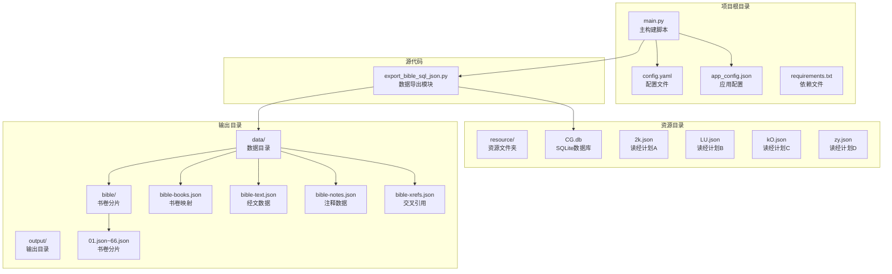
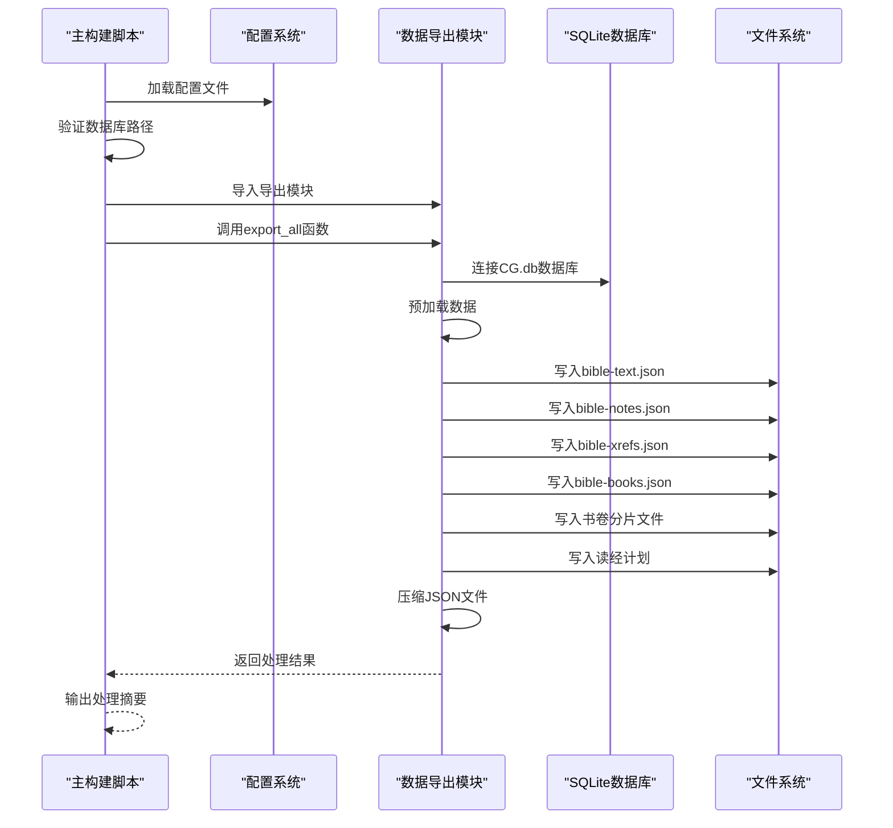
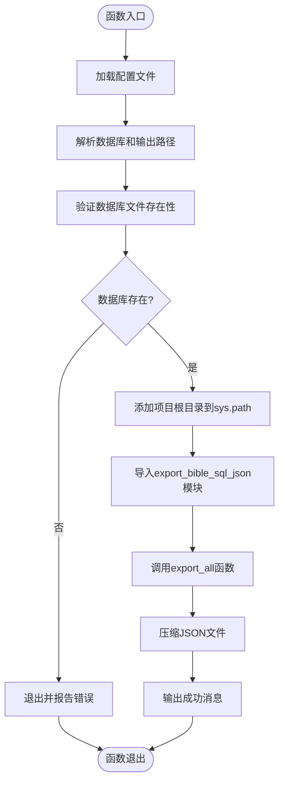
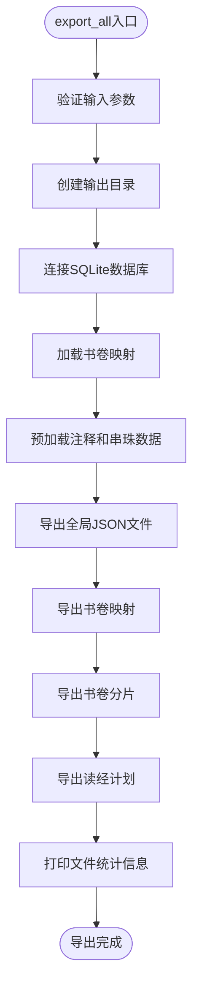
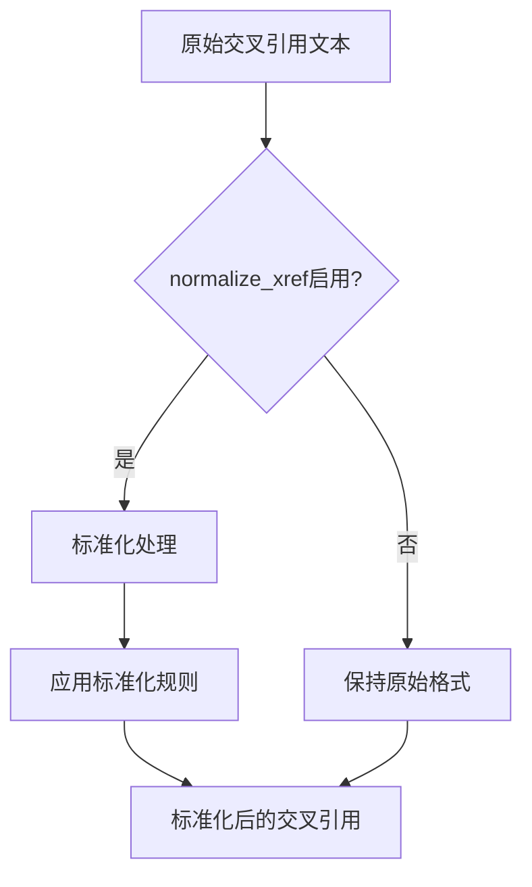
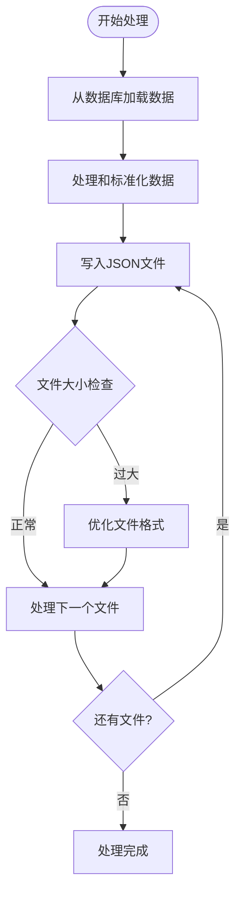
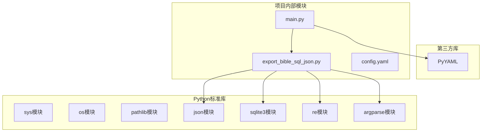
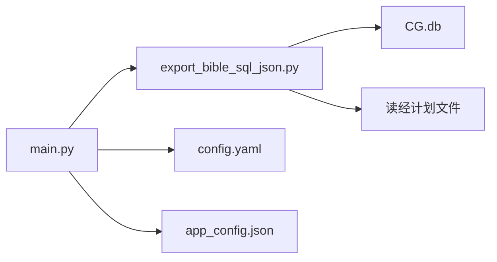

# 阶段一：圣经数据准备

<cite>
**本文档引用的文件**
- [main.py](file://main.py)
- [export_bible_sql_json.py](file://export_bible_sql_json.py)
- [config.yaml](file://config.yaml)
- [app_config.json](file://app_config.json)
- [requirements.txt](file://requirements.txt)
- [resource/2k.json](file://resource/2k.json)
- [output/data/bible-books.json](file://output/data/bible-books.json)
- [output/data/bible-text.json](file://output/data/bible-text.json)
- [output/data/bible/01.json](file://output/data/bible/01.json)
</cite>

## 目录
1. [引言](#引言)
2. [项目结构](#项目结构)
3. [核心组件](#核心组件)
4. [架构概览](#架构概览)
5. [详细组件分析](#详细组件分析)
6. [依赖关系分析](#依赖关系分析)
7. [性能考虑](#性能考虑)
8. [故障排除指南](#故障排除指南)
9. [结论](#结论)

## 引言

本文件详细阐述了圣经数据准备阶段的实现机制，重点分析 `prepare_bible_data` 函数如何调用 `export_bible_sql_json.py` 进行数据导出。该阶段是整个构建流程的第一个阶段，负责从 SQLite 数据库 CG.db 中提取圣经文本、注释和交叉引用数据，生成标准化的 JSON 文件格式，为后续的静态站点生成和版本配置奠定基础。

## 项目结构

该项目采用模块化设计，主要包含以下关键目录和文件：



**图表来源**
- [main.py:1-361](file://main.py#L1-L361)
- [export_bible_sql_json.py:1-835](file://export_bible_sql_json.py#L1-L835)

**章节来源**
- [main.py:1-361](file://main.py#L1-L361)
- [config.yaml:1-12](file://config.yaml#L1-L12)

## 核心组件

### 主构建脚本 (main.py)

主构建脚本定义了完整的构建流程，包含三个阶段：

1. **阶段1：圣经数据准备** - 调用数据导出模块
2. **阶段2：静态站点生成** - 复制静态资源和生成配置文件
3. **阶段3：版本与配置** - 生成版本信息和远程配置

### 数据导出模块 (export_bible_sql_json.py)

这是一个专门的数据处理模块，负责：
- 从 SQLite 数据库提取圣经数据
- 预处理和标准化数据格式
- 生成多种 JSON 输出文件
- 支持读经计划数据集成

**章节来源**
- [main.py:85-117](file://main.py#L85-L117)
- [export_bible_sql_json.py:741-800](file://export_bible_sql_json.py#L741-L800)

## 架构概览



**图表来源**
- [main.py:87-117](file://main.py#L87-L117)
- [export_bible_sql_json.py:743-800](file://export_bible_sql_json.py#L743-L800)

## 详细组件分析

### prepare_bible_data 函数分析

#### 函数调用流程



**图表来源**
- [main.py:87-117](file://main.py#L87-L117)

#### 关键步骤详解

1. **配置加载**：从 `config.yaml` 读取构建配置
2. **路径解析**：确定数据库路径和输出目录
3. **数据库验证**：确保 CG.db 文件存在
4. **路径配置**：将项目根目录添加到 Python 模块搜索路径
5. **模块导入**：动态导入数据导出模块
6. **数据导出**：调用 `export_all` 函数执行完整导出流程
7. **文件压缩**：对生成的 JSON 文件进行压缩优化

**章节来源**
- [main.py:87-117](file://main.py#L87-L117)

### export_all 函数分析

#### 完整导出流程



**图表来源**
- [export_bible_sql_json.py:743-800](file://export_bible_sql_json.py#L743-L800)

#### 数据导出过程

1. **全局 JSON 文件导出**：
   - `bible-text.json`：包含带标记的经文数据
   - `bible-notes.json`：包含注释数据
   - `bible-xrefs.json`：包含交叉引用数据

2. **书卷映射导出**：
   - `bible-books.json`：包含书卷索引、简称和全名映射

3. **书卷分片导出**：
   - `bible/01.json` 到 `bible/66.json`：按书卷分片的完整数据

4. **读经计划导出**：
   - 合并多个读经计划文件生成 `reading-plans.json`

**章节来源**
- [export_bible_sql_json.py:459-529](file://export_bible_sql_json.py#L459-L529)
- [export_bible_sql_json.py:533-549](file://export_bible_sql_json.py#L533-L549)
- [export_bible_sql_json.py:553-596](file://export_bible_sql_json.py#L553-L596)
- [export_bible_sql_json.py:704-724](file://export_bible_sql_json.py#L704-L724)

### 数据标准化处理

#### normalize_xref 参数作用

`normalize_xref` 参数控制交叉引用数据的标准化程度：



**图表来源**
- [export_bible_sql_json.py:193-334](file://export_bible_sql_json.py#L193-L334)

#### 标准化规则包括：

1. **书卷名称规范化**：统一使用书卷简称而非全名
2. **经文格式统一**：将各种分隔符转换为标准格式
3. **数字格式转换**：将中文数字转换为阿拉伯数字
4. **范围格式标准化**：统一经文范围表示方法

**章节来源**
- [export_bible_sql_json.py:193-334](file://export_bible_sql_json.py#L193-L334)

### 文件处理逻辑

#### JSON 文件生成流程



**图表来源**
- [export_bible_sql_json.py:728-739](file://export_bible_sql_json.py#L728-L739)

#### 压缩过程

在阶段1完成后，系统会对生成的 JSON 文件进行压缩：

1. **读取原始 JSON**：加载完整的 JSON 数据
2. **序列化优化**：使用紧凑格式重新写入
3. **编码保持**：确保中文字符正确编码
4. **文件更新**：替换原始文件内容

**章节来源**
- [main.py:107-116](file://main.py#L107-L116)
- [export_bible_sql_json.py:728-734](file://export_bible_sql_json.py#L728-L734)

## 依赖关系分析

### 外部依赖

项目依赖关系如下：



**图表来源**
- [requirements.txt:1-2](file://requirements.txt#L1-L2)
- [main.py:12-21](file://main.py#L12-L21)

### 内部模块依赖



**图表来源**
- [main.py:87-105](file://main.py#L87-L105)
- [export_bible_sql_json.py:33-39](file://export_bible_sql_json.py#L33-L39)

**章节来源**
- [requirements.txt:1-2](file://requirements.txt#L1-L2)
- [main.py:12-21](file://main.py#L12-L21)

## 性能考虑

### 数据处理优化

1. **批量数据加载**：使用 SQL 查询一次性获取所需数据
2. **内存管理**：避免同时加载所有数据到内存
3. **文件I/O优化**：使用缓冲写入减少磁盘操作
4. **压缩策略**：在导出阶段进行文件压缩

### 并发处理

当前实现采用顺序处理方式，对于大型数据库可以考虑：
- 分批处理大量数据
- 使用多进程并行导出不同书卷
- 实现进度监控和错误恢复机制

## 故障排除指南

### 常见问题及解决方案

#### 1. 数据库文件不存在

**问题症状**：
```
✗ 圣经数据库不存在：resource/CG.db
```

**解决方法**：
- 确认 CG.db 文件存在于 `resource/` 目录
- 检查 `config.yaml` 中的 `bible_db` 配置路径
- 验证文件权限设置

#### 2. 模块导入失败

**问题症状**：
```
ModuleNotFoundError: No module named 'export_bible_sql_json'
```

**解决方法**：
- 确保项目根目录在 `sys.path` 中
- 检查 Python 环境是否正确配置
- 验证文件命名和扩展名

#### 3. JSON 文件生成异常

**问题症状**：
- 导出过程中断
- 文件损坏或格式错误

**解决方法**：
- 检查磁盘空间和写入权限
- 验证数据库连接状态
- 查看具体的错误堆栈信息

#### 4. 内存不足

**问题症状**：
- 处理大型数据集时内存溢出
- 系统响应缓慢

**解决方法**：
- 分批处理大数据集
- 增加系统内存或虚拟内存
- 优化数据处理算法

**章节来源**
- [main.py:93-95](file://main.py#L93-L95)
- [export_bible_sql_json.py:749-750](file://export_bible_sql_json.py#L749-L750)

## 结论

圣经数据准备阶段通过 `prepare_bible_data` 函数与 `export_bible_sql_json.py` 模块的协作，实现了从 SQLite 数据库到标准化 JSON 文件的完整转换流程。该实现具有以下特点：

1. **模块化设计**：清晰的职责分离，便于维护和扩展
2. **数据标准化**：统一的交叉引用格式和数据结构
3. **文件优化**：自动压缩生成的 JSON 文件
4. **错误处理**：完善的错误检测和处理机制
5. **配置灵活**：支持通过配置文件定制构建行为

该阶段为后续的静态站点生成和版本配置提供了高质量的数据基础，确保了整个构建流程的稳定性和可靠性。