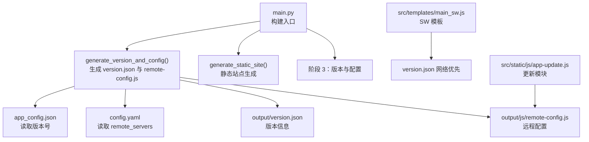
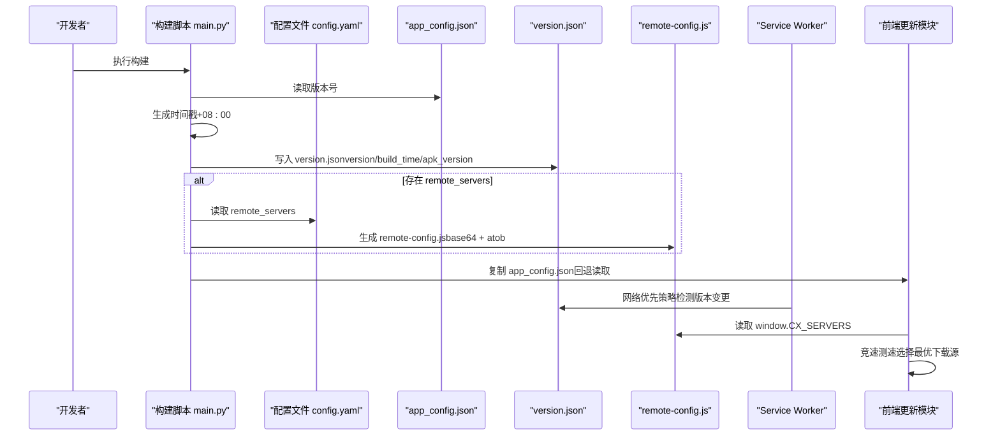
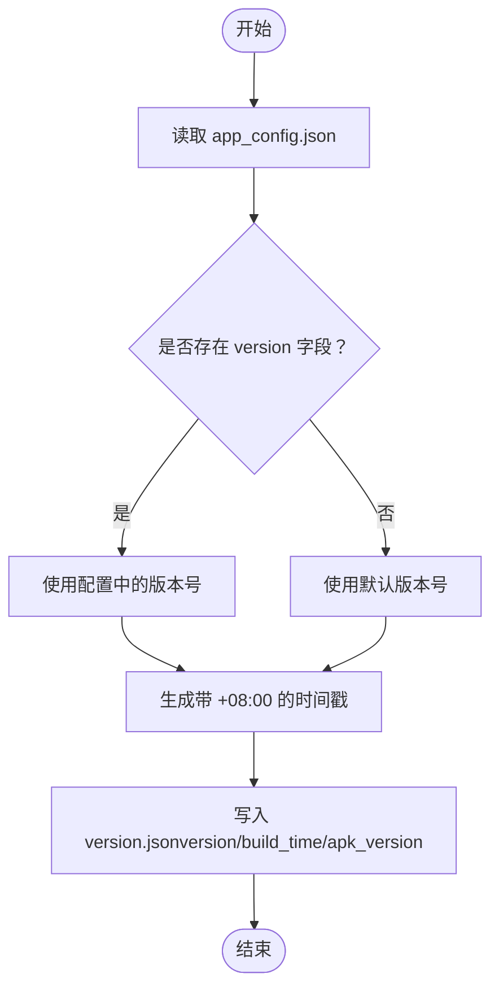
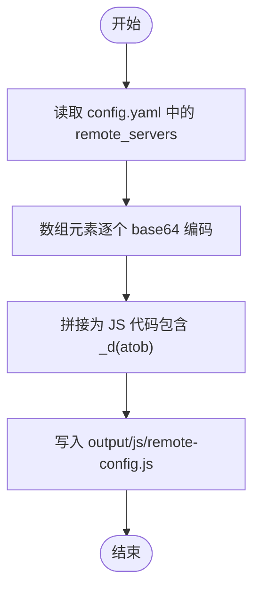
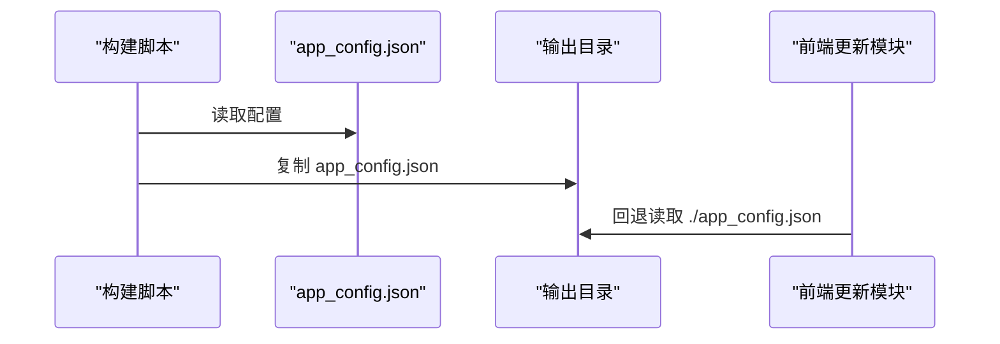
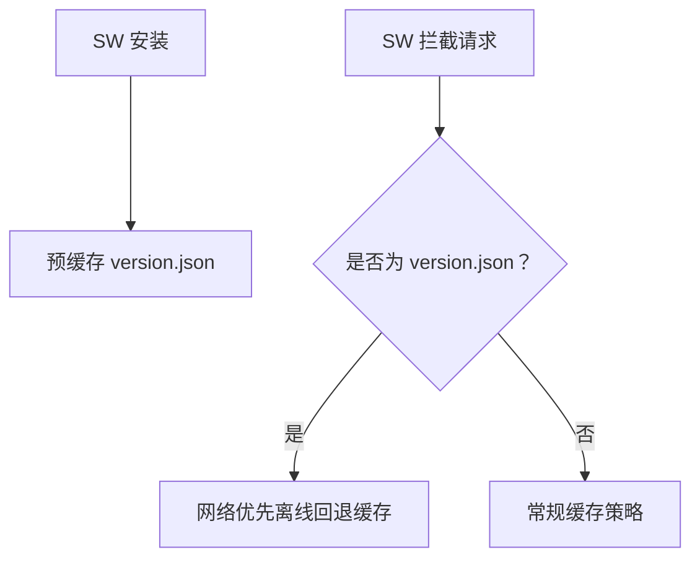
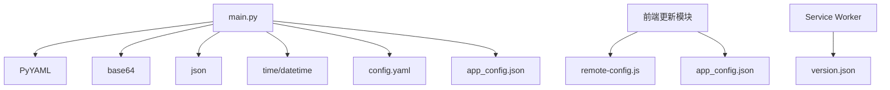

# 阶段三：版本与配置

<cite>
**本文档引用的文件**
- [main.py](file://main.py)
- [config.yaml](file://config.yaml)
- [app_config.json](file://app_config.json)
- [output/version.json](file://output/version.json)
- [output/js/remote-config.js](file://output/js/remote-config.js)
- [src/templates/main_sw.js](file://src/templates/main_sw.js)
- [src/static/js/app-update.js](file://src/static/js/app-update.js)
- [build.sh](file://build.sh)
- [package.json](file://package.json)
</cite>

## 目录
1. [引言](#引言)
2. [项目结构](#项目结构)
3. [核心组件](#核心组件)
4. [架构总览](#架构总览)
5. [详细组件分析](#详细组件分析)
6. [依赖分析](#依赖分析)
7. [性能考虑](#性能考虑)
8. [故障排查指南](#故障排查指南)
9. [结论](#结论)
10. [附录](#附录)

## 引言
本阶段聚焦“版本与配置”的自动化生成，涵盖以下目标：
- 生成 version.json：包含版本号、构建时间、APK 版本等字段，用于前端/客户端识别与更新校验。
- 生成 remote-config.js：将远程服务器地址以 base64 编码嵌入，运行时通过 atob 解码还原，实现灵活的多源配置与线路选择。
- 复制 app_config.json：作为应用基础配置文件，供前端在无 Capacitor 环境下回退读取。

本阶段与 Service Worker 的版本检测策略配合，确保版本变更能被及时发现并触发更新流程。

## 项目结构
与“版本与配置”阶段直接相关的文件与职责如下：
- main.py：构建脚本主入口，负责阶段划分与调用具体生成函数。
- config.yaml：构建配置，定义远程服务器配置项（如 GitHub Releases API）。
- app_config.json：应用基础配置，包含版本号等元数据。
- output/version.json：最终生成的版本信息文件。
- output/js/remote-config.js：最终生成的远程配置脚本。
- src/templates/main_sw.js：Service Worker 模板，声明 version.json 采用网络优先策略。
- src/static/js/app-update.js：前端更新模块，读取 remote-config.js 中的镜像源并进行竞速下载。
- build.sh/package.json：构建脚本与 NPM 脚本，驱动 main.py 执行。

**图表来源**
- [main.py:288-357](file://main.py#L288-L357)
- [config.yaml:10-12](file://config.yaml#L10-L12)
- [app_config.json:1-6](file://app_config.json#L1-L6)
- [output/version.json:1-5](file://output/version.json#L1-L5)
- [output/js/remote-config.js:1-1](file://output/js/remote-config.js#L1-L1)
- [src/templates/main_sw.js:70-106](file://src/templates/main_sw.js#L70-L106)
- [src/static/js/app-update.js:157-164](file://src/static/js/app-update.js#L157-L164)

**章节来源**
- [main.py:36-76](file://main.py#L36-L76)
- [config.yaml:1-12](file://config.yaml#L1-L12)
- [app_config.json:1-6](file://app_config.json#L1-L6)
- [output/version.json:1-5](file://output/version.json#L1-L5)
- [output/js/remote-config.js:1-1](file://output/js/remote-config.js#L1-L1)
- [src/templates/main_sw.js:70-106](file://src/templates/main_sw.js#L70-L106)
- [src/static/js/app-update.js:157-164](file://src/static/js/app-update.js#L157-L164)

## 核心组件
本阶段的核心逻辑集中在 main.py 的 generate_version_and_config 函数中，其职责与流程如下：
- 读取 app_config.json 获取版本号（若不存在则回退为默认版本）。
- 生成 version.json，包含 version、build_time、apk_version 字段。
- 若配置中存在 remote_servers，则生成 remote-config.js，其中：
  - URL 以 base64 编码存储；
  - 运行时通过 atob 解码还原；
  - 生成 window.CX_SERVERS 对象，包含 cloudflare、githubApi、githubMirrors、push、ipApis 等键。
- 复制 app_config.json 到输出目录，供前端在无 Capacitor 环境下回退读取。

上述流程确保了版本信息与远程配置的统一生成与分发。

**章节来源**
- [main.py:288-357](file://main.py#L288-L357)
- [config.yaml:10-12](file://config.yaml#L10-L12)
- [app_config.json:1-6](file://app_config.json#L1-L6)

## 架构总览
版本与配置阶段的整体工作流如下：

**图表来源**
- [main.py:288-357](file://main.py#L288-L357)
- [config.yaml:10-12](file://config.yaml#L10-L12)
- [output/version.json:1-5](file://output/version.json#L1-L5)
- [output/js/remote-config.js:1-1](file://output/js/remote-config.js#L1-L1)
- [src/templates/main_sw.js:70-106](file://src/templates/main_sw.js#L70-L106)
- [src/static/js/app-update.js:270-338](file://src/static/js/app-update.js#L270-L338)

## 详细组件分析

### version.json 生成机制
- 版本号来源：优先从 app_config.json 的 version 字段读取；若不存在则使用默认值。
- 时间戳生成：使用东八区时区偏移（+08:00）生成 ISO 8601 格式的构建时间。
- APK 版本：与应用版本保持一致，便于客户端识别。
- 输出位置：写入 output/version.json。

**图表来源**
- [main.py:291-310](file://main.py#L291-L310)
- [app_config.json:4](file://app_config.json#L4)
- [output/version.json:1-5](file://output/version.json#L1-L5)

**章节来源**
- [main.py:291-310](file://main.py#L291-L310)
- [output/version.json:1-5](file://output/version.json#L1-L5)

### remote-config.js 生成机制
- base64 编码：将每个 URL 通过 base64.b64encode 编码，避免明文暴露。
- atob 解码：运行时通过 window.atob 还原 URL。
- URL 数组处理：支持多源数组（如 githubMirrors、push、ipApis），空数组以空数组形式输出。
- 配置对象：最终生成 window.CX_SERVERS，包含 cloudflare、githubApi、githubMirrors、push、ipApis 等键。
- 输出位置：写入 output/js/remote-config.js。

**图表来源**
- [main.py:323-356](file://main.py#L323-L356)
- [config.yaml:10-12](file://config.yaml#L10-L12)
- [output/js/remote-config.js:1-1](file://output/js/remote-config.js#L1-L1)

**章节来源**
- [main.py:323-356](file://main.py#L323-L356)
- [output/js/remote-config.js:1-1](file://output/js/remote-config.js#L1-L1)

### app_config.json 的复制与回退读取
- 复制过程：若 app_config.json 存在，则复制到输出目录，供前端在无 Capacitor 环境下回退读取。
- 前端回退读取：当 Capacitor 环境不可用时，前端会尝试相对路径 fetch ./app_config.json 以获取当前版本号。

**图表来源**
- [main.py:317-321](file://main.py#L317-L321)
- [src/static/js/app-update.js:219-232](file://src/static/js/app-update.js#L219-L232)

**章节来源**
- [main.py:317-321](file://main.py#L317-L321)
- [src/static/js/app-update.js:219-232](file://src/static/js/app-update.js#L219-L232)

### Service Worker 与版本检测
- SW 预缓存：version.json 被列入 PRECACHE_URLS，确保首次安装时缓存。
- 网络优先策略：SW 将 version.json 设为 network-only，保证版本检测始终从网络获取最新，离线时再回退缓存。
- 与前端协作：前端通过 fetch 或 CapacitorHttp 下载 APK 时，可结合 remote-config.js 的镜像源进行竞速选择。

**图表来源**
- [src/templates/main_sw.js:14-19](file://src/templates/main_sw.js#L14-L19)
- [src/templates/main_sw.js:70-106](file://src/templates/main_sw.js#L70-L106)

**章节来源**
- [src/templates/main_sw.js:14-19](file://src/templates/main_sw.js#L14-L19)
- [src/templates/main_sw.js:70-106](file://src/templates/main_sw.js#L70-L106)

## 依赖分析
- main.py 依赖：
  - PyYAML：解析 config.yaml。
  - base64/json/time/datetime：生成 remote-config.js 与 version.json。
  - config.yaml：提供 remote_servers 配置。
  - app_config.json：提供版本号。
- 前端依赖：
  - remote-config.js：提供 window.CX_SERVERS。
  - app_config.json：在无 Capacitor 环境下的回退读取。
  - Service Worker：对 version.json 采用网络优先策略。

**图表来源**
- [main.py:12-21](file://main.py#L12-L21)
- [config.yaml:10-12](file://config.yaml#L10-L12)
- [app_config.json:1-6](file://app_config.json#L1-L6)
- [output/js/remote-config.js:1-1](file://output/js/remote-config.js#L1-L1)
- [src/templates/main_sw.js:70-106](file://src/templates/main_sw.js#L70-L106)

**章节来源**
- [main.py:12-21](file://main.py#L12-L21)
- [config.yaml:10-12](file://config.yaml#L10-L12)
- [app_config.json:1-6](file://app_config.json#L1-L6)
- [output/js/remote-config.js:1-1](file://output/js/remote-config.js#L1-L1)
- [src/templates/main_sw.js:70-106](file://src/templates/main_sw.js#L70-L106)

## 性能考虑
- remote-config.js 的 base64 编码与 atob 解码：
  - 优点：隐藏明文 URL，降低被爬虫或中间人直接解析的风险。
  - 注意：运行时解码有轻微 CPU 开销，但影响极小。
- URL 数组处理：
  - 空数组直接输出空数组，避免冗余判断。
- Service Worker 的网络优先策略：
  - 确保版本检测的实时性，避免因缓存导致的误判。
- 前端竞速下载：
  - 通过多源并发测速选择最优线路，提升下载成功率与速度。

[本节为通用指导，无需特定文件分析]

## 故障排查指南
- 生成的 version.json 缺失或为空：
  - 检查 app_config.json 是否存在且包含 version 字段。
  - 确认构建脚本已正确执行 generate_version_and_config。
- remote-config.js 无法加载或 window.CX_SERVERS 未定义：
  - 检查 config.yaml 中 remote_servers 是否配置。
  - 确认输出目录中存在 output/js/remote-config.js。
  - 在浏览器控制台确认 atob 可用且未被 CSP 禁用。
- 前端无法回退读取 app_config.json：
  - 确认 app_config.json 已复制到输出目录。
  - 检查前端相对路径 ./app_config.json 是否可访问。
- Service Worker 未正确检测版本变化：
  - 确认 SW 模板中 version.json 已列入 PRECACHE_URLS。
  - 检查 SW 的网络优先策略是否生效。

**章节来源**
- [main.py:291-321](file://main.py#L291-L321)
- [config.yaml:10-12](file://config.yaml#L10-L12)
- [output/js/remote-config.js:1-1](file://output/js/remote-config.js#L1-L1)
- [src/static/js/app-update.js:219-232](file://src/static/js/app-update.js#L219-L232)
- [src/templates/main_sw.js:70-106](file://src/templates/main_sw.js#L70-L106)

## 结论
本阶段通过自动化生成 version.json、remote-config.js 以及复制 app_config.json，实现了版本信息与远程配置的统一管理。配合 Service Worker 的网络优先策略与前端的竞速下载机制，能够稳定地检测版本变更并提供可靠的下载体验。建议在持续集成环境中固定 remote_servers 配置，确保多源可用性与稳定性。

[本节为总结性内容，无需特定文件分析]

## 附录

### 配置文件格式规范
- app_config.json
  - 字段示例：app_name、app_id、version
  - 用途：提供应用基础信息与版本号
  - 参考路径：[app_config.json:1-6](file://app_config.json#L1-L6)

- config.yaml
  - 字段示例：remote_servers（包含 github_api 等）
  - 用途：提供远程服务器配置
  - 参考路径：[config.yaml:10-12](file://config.yaml#L10-L12)

- version.json
  - 字段示例：version、build_time、apk_version
  - 用途：前端/客户端识别与更新校验
  - 参考路径：[output/version.json:1-5](file://output/version.json#L1-L5)

- remote-config.js
  - 结构示例：window.CX_SERVERS（包含 cloudflare、githubApi、githubMirrors、push、ipApis）
  - 用途：前端运行时解码获取多源 URL
  - 参考路径：[output/js/remote-config.js:1-1](file://output/js/remote-config.js#L1-L1)

**章节来源**
- [app_config.json:1-6](file://app_config.json#L1-L6)
- [config.yaml:10-12](file://config.yaml#L10-L12)
- [output/version.json:1-5](file://output/version.json#L1-L5)
- [output/js/remote-config.js:1-1](file://output/js/remote-config.js#L1-L1)

### 版本管理最佳实践
- 固定版本号来源：优先从 app_config.json 读取，避免硬编码。
- 严格时间戳格式：使用 ISO 8601 格式并明确时区偏移，便于日志与排障。
- 多源配置：remote_servers 提供多个备用源，提高可用性。
- 前后端一致性：确保 version.json 与 app_config.json 的版本号同步。
- CI/CD 集成：在流水线中固定 remote_servers，确保构建产物稳定可复现。

[本节为通用指导，无需特定文件分析]