# 阶段二：静态站点生成

<cite>
**本文档引用的文件**
- [main.py](file://main.py)
- [index.html](file://src/static/index.html)
- [main_manifest.json](file://src/templates/main_manifest.json)
- [main_sw.js](file://src/templates/main_sw.js)
- [config.yaml](file://config.yaml)
- [app_config.json](file://app_config.json)
</cite>

## 目录
1. [简介](#简介)
2. [项目结构](#项目结构)
3. [核心组件](#核心组件)
4. [架构概览](#架构概览)
5. [详细组件分析](#详细组件分析)
6. [依赖分析](#依赖分析)
7. [性能考虑](#性能考虑)
8. [故障排除指南](#故障排除指南)
9. [结论](#结论)

## 简介
本阶段负责将静态资源从源代码目录复制到输出目录，并生成PWA所需的配置文件。该阶段确保最终的静态站点包含完整的CSS样式、JavaScript脚本、图标资源以及服务工作线程配置。

## 项目结构
静态站点生成涉及以下关键目录和文件：

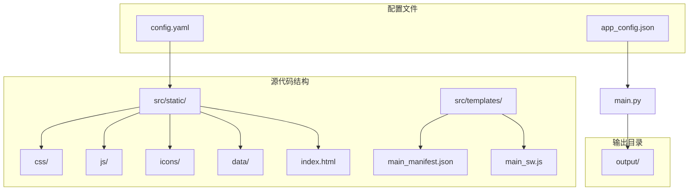

**图表来源**
- [config.yaml:1-12](file://config.yaml#L1-L12)
- [main.py:24-33](file://main.py#L24-L33)

**章节来源**
- [config.yaml:1-12](file://config.yaml#L1-L12)
- [main.py:24-33](file://main.py#L24-L33)

## 核心组件
静态站点生成的核心流程由以下主要函数组成：

### EXCLUDED_JS_FILES 集合
定义了需要排除的JavaScript文件集合，这些文件与训练功能相关，不适合静态站点使用：

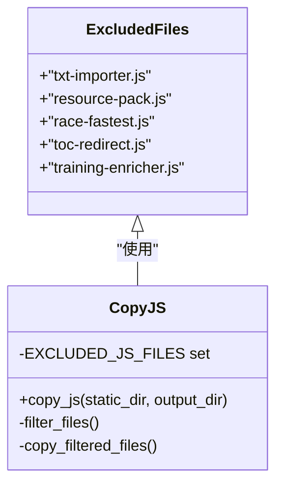

**图表来源**
- [main.py:26-33](file://main.py#L26-L33)
- [main.py:186-204](file://main.py#L186-L204)

### generate_static_site 主函数
协调所有静态资源的复制和生成任务：

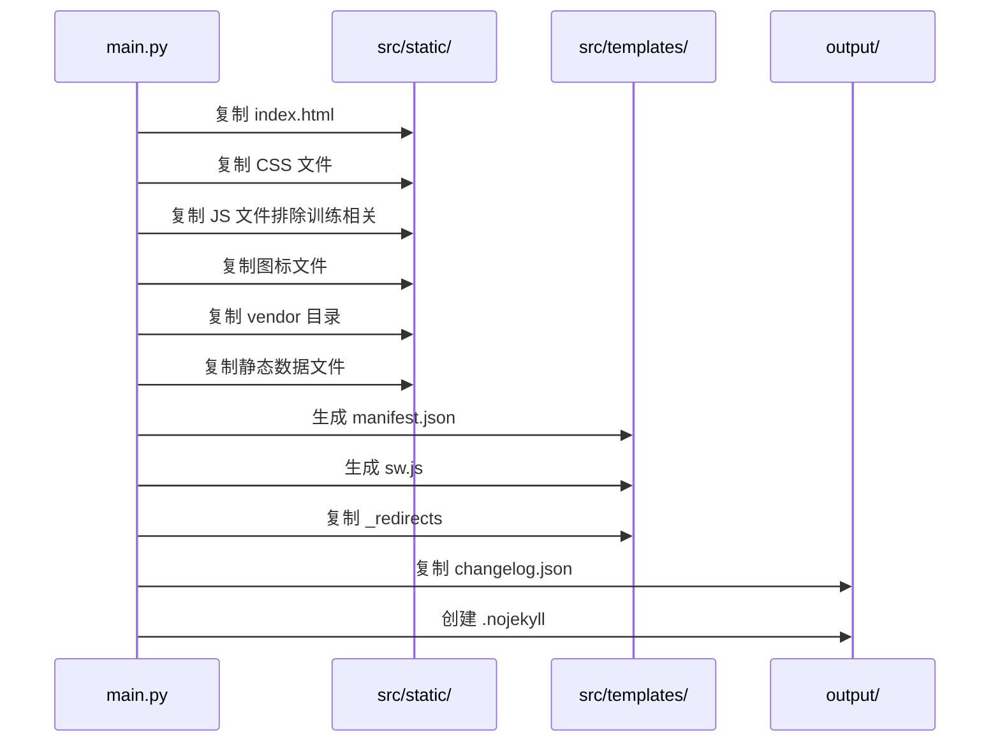

**图表来源**
- [main.py:121-161](file://main.py#L121-L161)

**章节来源**
- [main.py:26-33](file://main.py#L26-L33)
- [main.py:121-161](file://main.py#L121-L161)

## 架构概览
静态站点生成采用模块化设计，每个功能都有独立的处理函数：

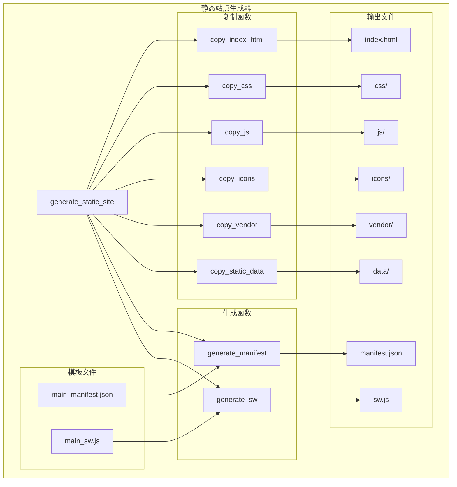

**图表来源**
- [main.py:121-161](file://main.py#L121-L161)
- [main.py:163-284](file://main.py#L163-L284)

## 详细组件分析

### index.html 复制流程
负责将主页面文件复制到输出目录：

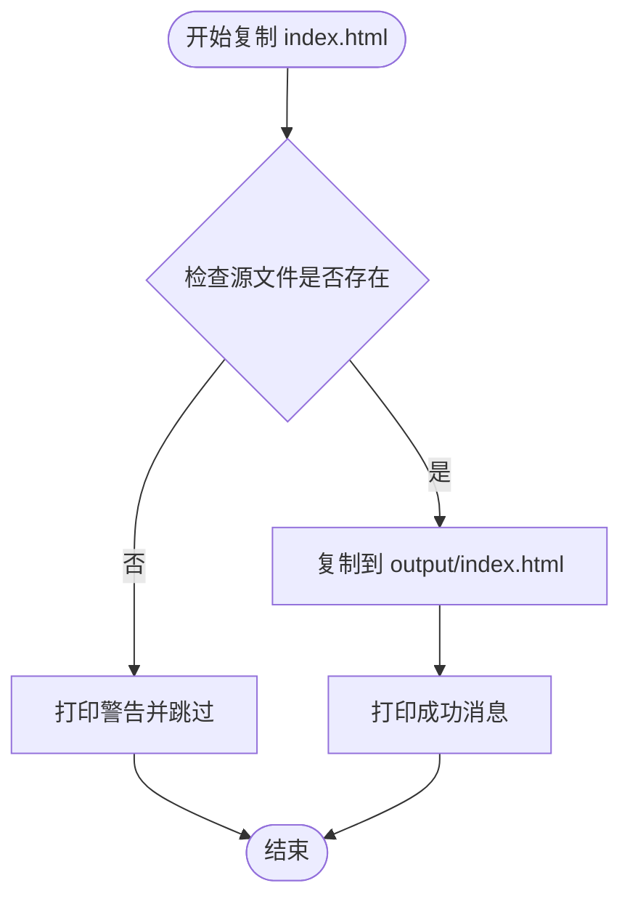

**图表来源**
- [main.py:163-170](file://main.py#L163-L170)

**章节来源**
- [main.py:163-170](file://main.py#L163-L170)

### CSS 文件处理
复制所有CSS样式文件到输出目录的css子目录：

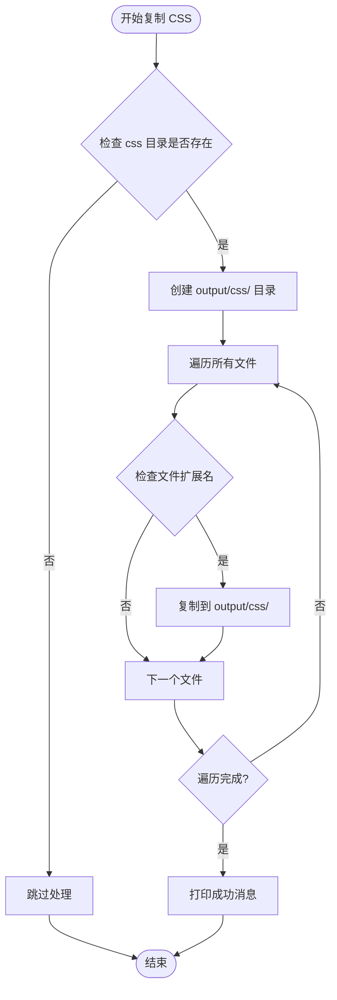

**图表来源**
- [main.py:173-184](file://main.py#L173-L184)

**章节来源**
- [main.py:173-184](file://main.py#L173-L184)

### JavaScript 文件过滤复制
这是最复杂的处理流程，包含训练相关文件的排除逻辑：

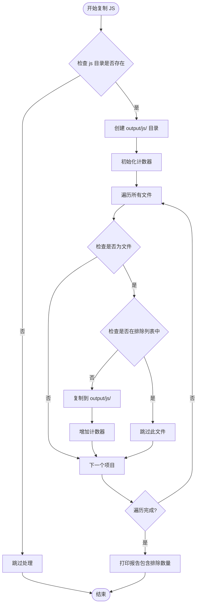

**图表来源**
- [main.py:186-204](file://main.py#L186-L204)
- [main.py:26-33](file://main.py#L26-L33)

**章节来源**
- [main.py:186-204](file://main.py#L186-L204)
- [main.py:26-33](file://main.py#L26-L33)

### 图标和 Vendor 目录复制
这两个函数的实现非常相似，都遵循相同的模式：

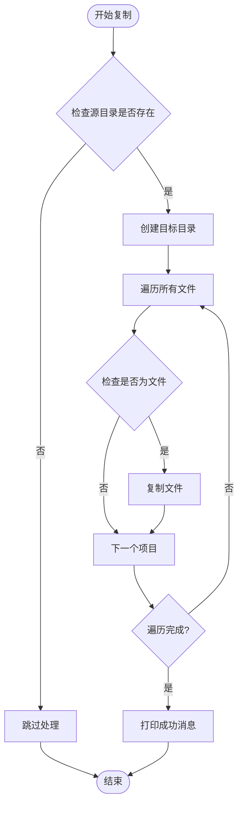

**图表来源**
- [main.py:206-217](file://main.py#L206-L217)
- [main.py:219-230](file://main.py#L219-L230)

**章节来源**
- [main.py:206-217](file://main.py#L206-L217)
- [main.py:219-230](file://main.py#L219-L230)

### 静态数据文件处理
复制JSON格式的静态数据文件：

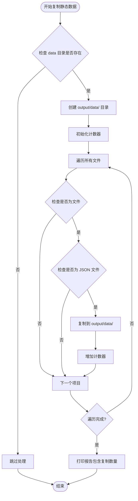

**图表来源**
- [main.py:232-246](file://main.py#L232-L246)

**章节来源**
- [main.py:232-246](file://main.py#L232-L246)

### manifest.json 生成过程
从模板文件生成PWA清单文件，包含名称替换机制：

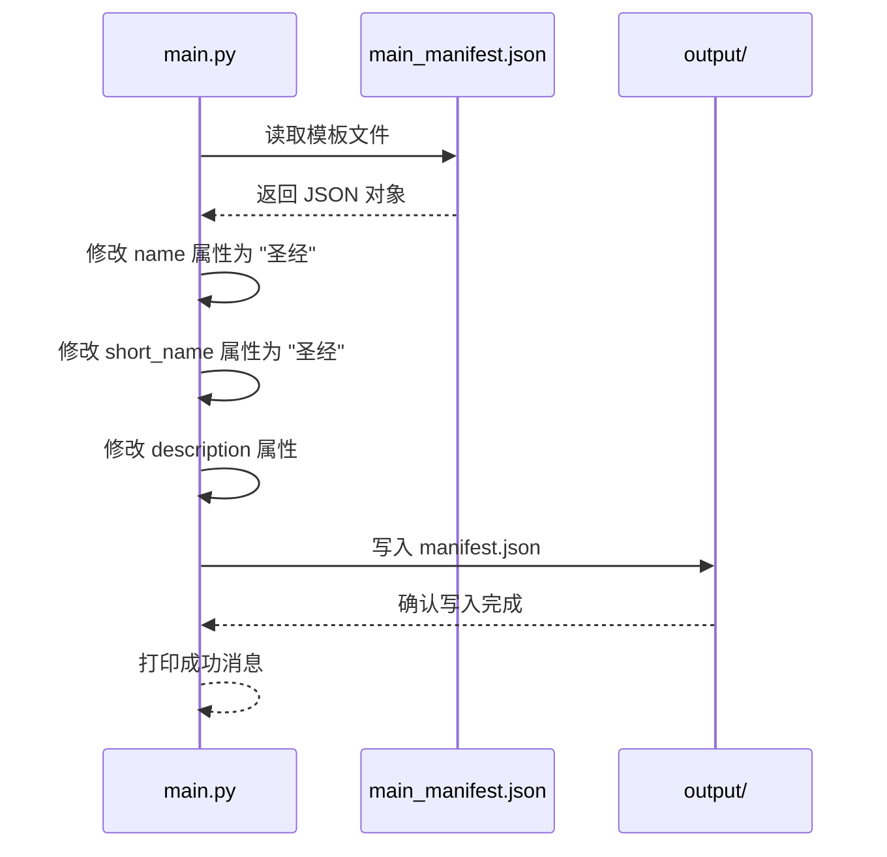

**图表来源**
- [main.py:248-267](file://main.py#L248-L267)
- [main_manifest.json:1-26](file://src/templates/main_manifest.json#L1-L26)

**章节来源**
- [main.py:248-267](file://main.py#L248-L267)
- [main_manifest.json:1-26](file://src/templates/main_manifest.json#L1-L26)

### sw.js 生成过程
从模板文件复制Service Worker文件：

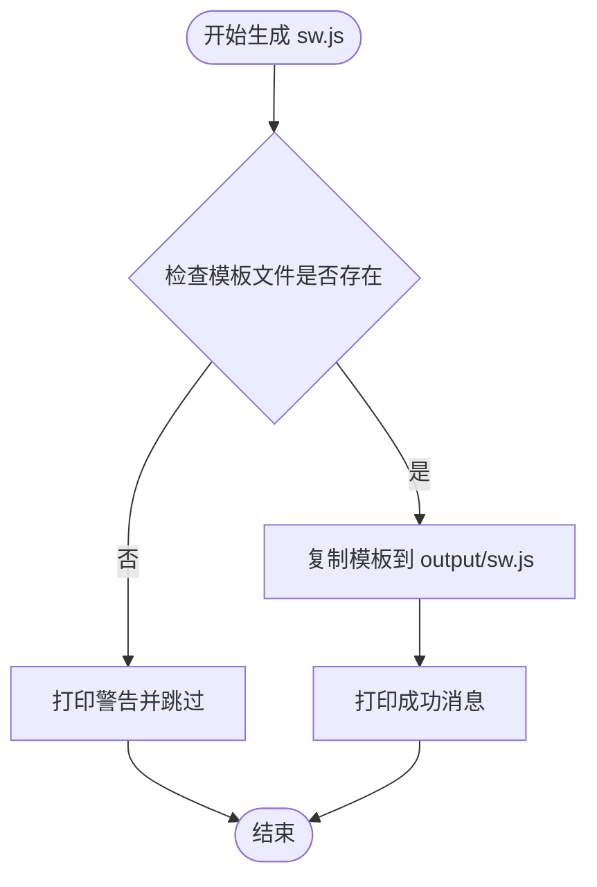

**图表来源**
- [main.py:269-277](file://main.py#L269-L277)
- [main_sw.js:1-270](file://src/templates/main_sw.js#L1-L270)

**章节来源**
- [main.py:269-277](file://main.py#L269-L277)
- [main_sw.js:1-270](file://src/templates/main_sw.js#L1-L270)

## 依赖分析
静态站点生成过程中的文件依赖关系：

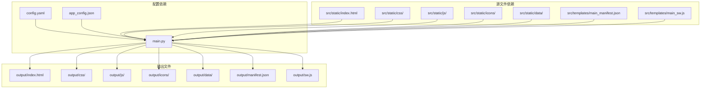

**图表来源**
- [main.py:121-161](file://main.py#L121-L161)
- [config.yaml:1-12](file://config.yaml#L1-L12)
- [app_config.json:1-6](file://app_config.json#L1-L6)

**章节来源**
- [main.py:121-161](file://main.py#L121-L161)
- [config.yaml:1-12](file://config.yaml#L1-L12)
- [app_config.json:1-6](file://app_config.json#L1-L6)

## 性能考虑
静态站点生成阶段的性能优化要点：

1. **文件过滤效率**：使用集合（set）进行文件名匹配，时间复杂度为O(1)
2. **批量复制**：使用shutil.copy2进行高效文件复制
3. **条件检查**：在复制前检查目录存在性，避免不必要的操作
4. **内存管理**：逐个处理文件，避免大量文件同时加载到内存

## 故障排除指南
常见问题及解决方案：

### 文件不存在错误
- **症状**：出现"未找到"警告
- **原因**：源目录或文件不存在
- **解决**：检查config.yaml中的路径配置是否正确

### 权限问题
- **症状**：复制操作失败
- **原因**：没有足够的文件系统权限
- **解决**：确保对输出目录有写入权限

### JSON解析错误
- **症状**：manifest.json生成失败
- **原因**：模板文件格式不正确
- **解决**：检查main_manifest.json文件格式

### JavaScript文件缺失
- **症状**：某些训练相关功能不可用
- **原因**：EXCLUDED_JS_FILES集合中的文件被正确排除
- **解决**：这是预期行为，不影响静态站点功能

**章节来源**
- [main.py:163-170](file://main.py#L163-L170)
- [main.py:248-267](file://main.py#L248-L267)

## 结论
静态站点生成阶段通过模块化的函数设计，实现了对各种静态资源的有效管理和处理。EXCLUDED_JS_FILES集合确保了训练相关的JavaScript文件不会被包含在静态站点中，而模板文件的使用保证了PWA配置的一致性和可维护性。整个流程具有良好的错误处理机制和清晰的日志输出，为后续的版本配置阶段提供了完整的静态资源基础。