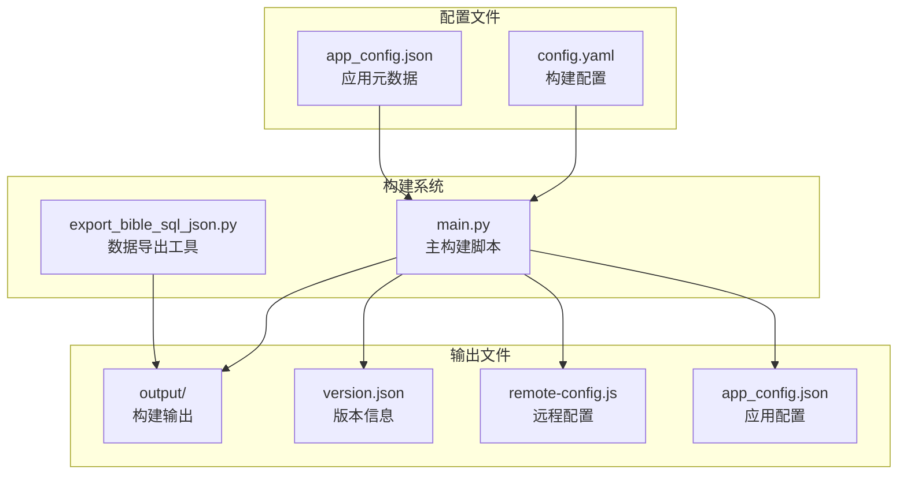
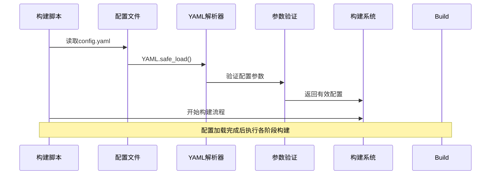
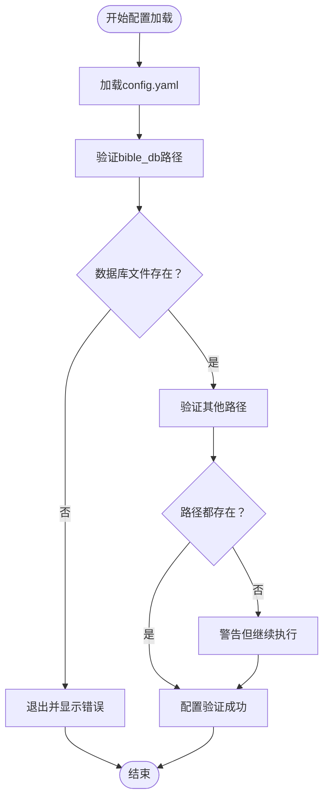
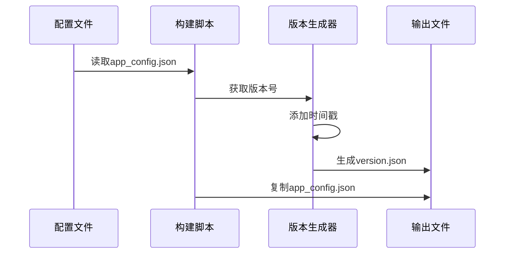

# 配置文件管理

<cite>
**本文档引用的文件**
- [config.yaml](file://config.yaml)
- [app_config.json](file://app_config.json)
- [main.py](file://main.py)
- [export_bible_sql_json.py](file://export_bible_sql_json.py)
- [package.json](file://package.json)
- [main_manifest.json](file://src/templates/main_manifest.json)
- [main_sw.js](file://src/templates/main_sw.js)
</cite>

## 目录
1. [简介](#简介)
2. [项目结构概览](#项目结构概览)
3. [核心配置文件](#核心配置文件)
4. [配置加载机制](#配置加载机制)
5. [参数验证与错误处理](#参数验证与错误处理)
6. [配置参数详解](#配置参数详解)
7. [版本控制与应用元数据](#版本控制与应用元数据)
8. [最佳实践与常见示例](#最佳实践与常见示例)
9. [故障排除指南](#故障排除指南)
10. [总结](#总结)

## 简介

本项目采用双配置文件架构，通过config.yaml进行构建配置管理和app_config.json进行版本控制与应用元数据管理。配置系统支持灵活的参数覆盖、错误处理和版本管理，为PWA和APK构建提供了完整的配置解决方案。

## 项目结构概览

项目采用清晰的配置分离架构，将构建配置与应用元数据分离管理：



**图表来源**
- [config.yaml:1-12](file://config.yaml#L1-L12)
- [app_config.json:1-6](file://app_config.json#L1-L6)
- [main.py:78-83](file://main.py#L78-L83)

## 核心配置文件

### config.yaml - 构建配置文件

config.yaml是项目的主要配置文件，采用YAML格式，定义了构建过程所需的所有路径和参数设置。

### app_config.json - 应用元数据文件

app_config.json专门用于管理应用的版本控制和元数据信息，为构建系统提供版本号和应用标识。

## 配置加载机制

### 配置加载流程



**图表来源**
- [main.py:78-83](file://main.py#L78-L83)
- [main.py:288-321](file://main.py#L288-L321)

### 配置加载实现

配置系统采用简单而有效的加载机制：

1. **文件定位**：脚本在项目根目录查找config.yaml文件
2. **安全解析**：使用yaml.safe_load()进行安全解析
3. **默认值处理**：对关键参数提供合理的默认值
4. **参数验证**：在使用前进行必要的验证检查

**章节来源**
- [main.py:78-83](file://main.py#L78-L83)
- [main.py:57-58](file://main.py#L57-L58)

## 参数验证与错误处理

### 配置验证策略

项目实现了多层次的配置验证机制：



**图表来源**
- [main.py:89-96](file://main.py#L89-L96)
- [main.py:123](file://main.py#L123)

### 错误处理机制

1. **致命错误**：数据库文件不存在时立即终止构建
2. **警告信息**：静态资源缺失时发出警告但继续执行
3. **默认值回退**：关键参数缺失时使用内置默认值

**章节来源**
- [main.py:89-96](file://main.py#L89-L96)
- [main.py:166-169](file://main.py#L166-L169)

## 配置参数详解

### output_dir - 输出目录配置

**作用**：指定构建输出的根目录位置

**默认值**：`"output"`

**使用场景**：
- 定义构建结果的存放位置
- 支持自定义输出目录结构
- 影响所有构建阶段的输出路径

**实现细节**：
- 在主构建入口处获取并解析
- 作为所有输出文件的基础路径

**章节来源**
- [config.yaml:1](file://config.yaml#L1)
- [main.py:57](file://main.py#L57)

### static_dir - 静态资源目录

**作用**：定义静态资源文件的根目录

**默认值**：`"src/static"`

**使用场景**：
- 指定HTML、CSS、JS等静态文件的来源
- 控制构建过程中资源的复制范围
- 支持自定义静态资源组织结构

**实现细节**：
- 用于静态站点生成阶段
- 影响CSS、JS、图标等资源的复制

**章节来源**
- [config.yaml:3](file://config.yaml#L3)
- [main.py:123](file://main.py#L123)

### bible_db - 圣经数据库配置

**作用**：指定SQLite数据库文件的位置

**默认值**：`"resource/CG.db"`

**使用场景**：
- 定义圣经数据源
- 支持自定义数据库文件位置
- 影响数据导出流程

**实现细节**：
- 在准备阶段进行存在性检查
- 作为数据导出工具的输入参数

**章节来源**
- [config.yaml:4](file://config.yaml#L4)
- [main.py:89](file://main.py#L89)

### reading_plans - 读经计划配置

**作用**：定义多个读经计划文件的路径列表

**默认值**：包含四个标准读经计划文件

**使用场景**：
- 管理多个读经计划数据源
- 支持自定义读经计划文件
- 影响最终的读经计划合并

**实现细节**：
- 采用数组格式定义多个文件
- 在数据导出阶段进行批量处理

**章节来源**
- [config.yaml:5-9](file://config.yaml#L5-L9)
- [export_bible_sql_json.py:33-39](file://export_bible_sql_json.py#L33-L39)

### remote_servers - 远程服务器配置

**作用**：定义远程服务器连接配置

**默认值**：包含GitHub API地址

**使用场景**：
- 配置版本检查和更新机制
- 支持多服务器镜像配置
- 提供动态服务器选择能力

**实现细节**：
- 支持多种服务器类型配置
- 生成JavaScript形式的远程配置
- 使用Base64编码增强安全性

**章节来源**
- [config.yaml:10-12](file://config.yaml#L10-L12)
- [main.py:313-316](file://main.py#L313-L316)

## 版本控制与应用元数据

### 版本信息生成



**图表来源**
- [main.py:288-321](file://main.py#L288-L321)
- [app_config.json:1-6](file://app_config.json#L1-L6)

### 版本控制机制

1. **版本来源**：优先使用app_config.json中的version字段
2. **时间戳记录**：自动添加构建时间信息
3. **格式标准化**：使用ISO 8601标准时间格式
4. **多用途支持**：同时支持Web和Android应用

**章节来源**
- [main.py:291-310](file://main.py#L291-L310)

### 应用元数据管理

app_config.json包含以下关键元数据：

- **app_name**：应用名称（"Bible"）
- **app_id**：应用标识符（"com.bible.reader"）
- **version**：应用版本号（"1.0.0"）

这些元数据直接影响构建输出和应用标识。

**章节来源**
- [app_config.json:2-4](file://app_config.json#L2-L4)

## 最佳实践与常见示例

### 自定义配置示例

#### 基础配置定制
```yaml
# 自定义输出目录
output_dir: "dist"

# 自定义静态资源目录
static_dir: "assets"

# 自定义数据库位置
bible_db: "data/bible.sqlite"

# 自定义读经计划
reading_plans:
  - "data/custom-plan1.json"
  - "data/custom-plan2.json"
```

#### 生产环境配置
```yaml
# 生产环境优化
output_dir: "build/prod"
static_dir: "src/assets"
bible_db: "prod-data/CG.db"

remote_servers:
  github_api: https://api.github.com/repos/your-org/your-app/releases/latest
  github_mirrors:
    - "https://mirror1.example.com"
    - "https://mirror2.example.com"
```

### 配置验证最佳实践

1. **路径验证**：确保所有配置的文件路径存在
2. **权限检查**：验证构建脚本具有必要的文件访问权限
3. **格式验证**：确保YAML配置语法正确
4. **依赖检查**：验证必需的外部依赖已安装

### 环境特定配置

建议为不同环境维护独立的配置文件：

- `config.dev.yaml`：开发环境配置
- `config.prod.yaml`：生产环境配置  
- `config.test.yaml`：测试环境配置

## 故障排除指南

### 常见配置问题

#### 配置文件加载失败
**症状**：构建脚本报错无法找到config.yaml
**解决方法**：
1. 确认config.yaml位于项目根目录
2. 检查文件权限是否正确
3. 验证YAML语法格式

#### 数据库文件不存在
**症状**：构建过程中提示数据库文件缺失
**解决方法**：
1. 确认bible_db路径指向正确的数据库文件
2. 检查数据库文件是否被意外删除
3. 验证数据库文件完整性

#### 静态资源复制失败
**症状**：部分静态文件未复制到输出目录
**解决方法**：
1. 检查static_dir路径是否存在
2. 验证静态资源文件权限
3. 确认EXCLUDED_JS_FILES列表中的文件名正确

### 调试技巧

1. **启用详细日志**：在构建脚本中添加调试输出
2. **逐步验证**：逐个检查配置参数的有效性
3. **环境隔离**：使用独立的测试环境验证配置
4. **备份配置**：修改前备份原始配置文件

**章节来源**
- [main.py:89-96](file://main.py#L89-L96)
- [main.py:166-169](file://main.py#L166-L169)

## 总结

本项目的配置文件管理系统提供了：

1. **清晰的配置分离**：构建配置与应用元数据独立管理
2. **灵活的参数覆盖**：支持默认值和自定义配置
3. **完善的错误处理**：多层次的验证和错误恢复机制
4. **版本控制集成**：完整的版本信息生成和管理
5. **易于扩展**：支持自定义配置和环境特定设置

通过合理的配置管理，项目能够支持从开发到生产的完整构建流程，为用户提供一致且可靠的构建体验。