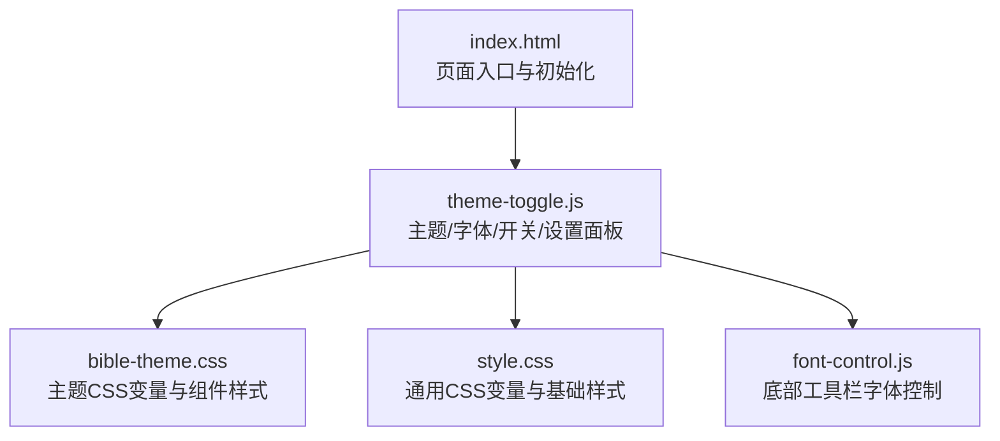
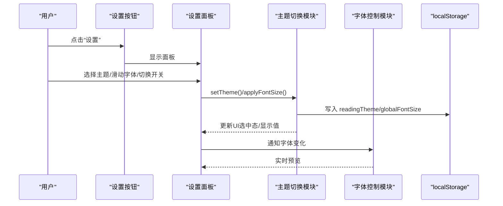
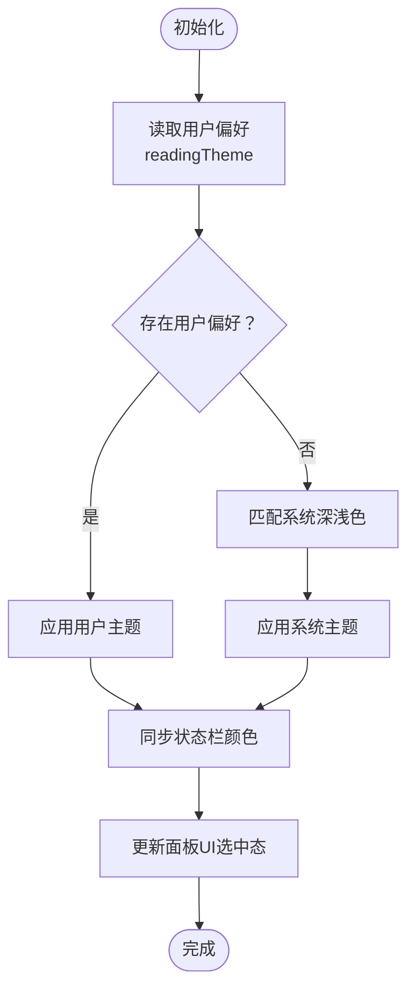
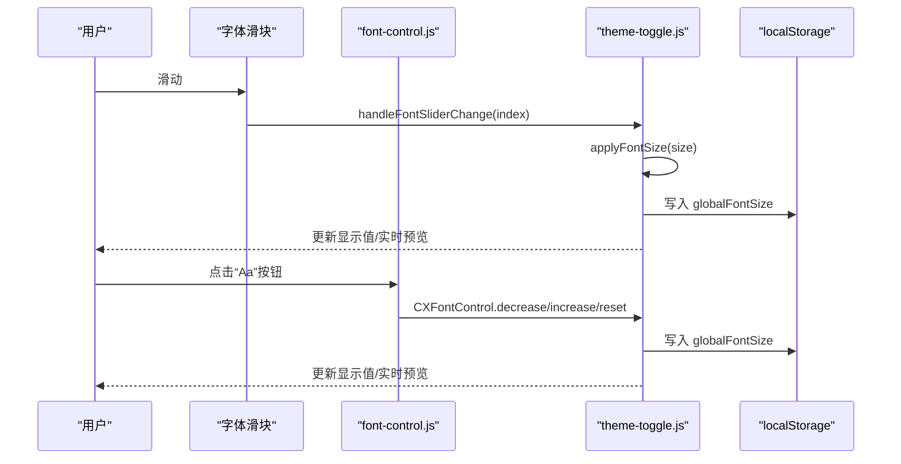
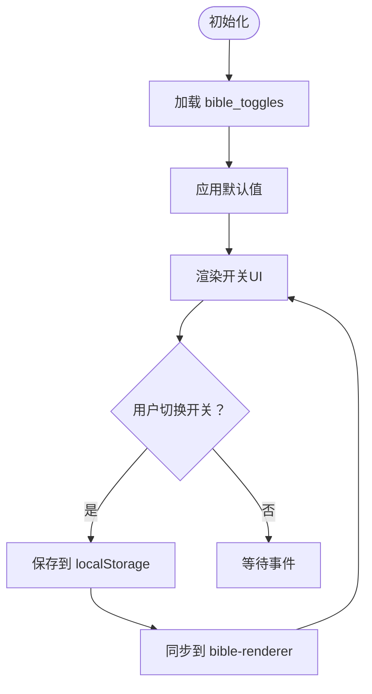
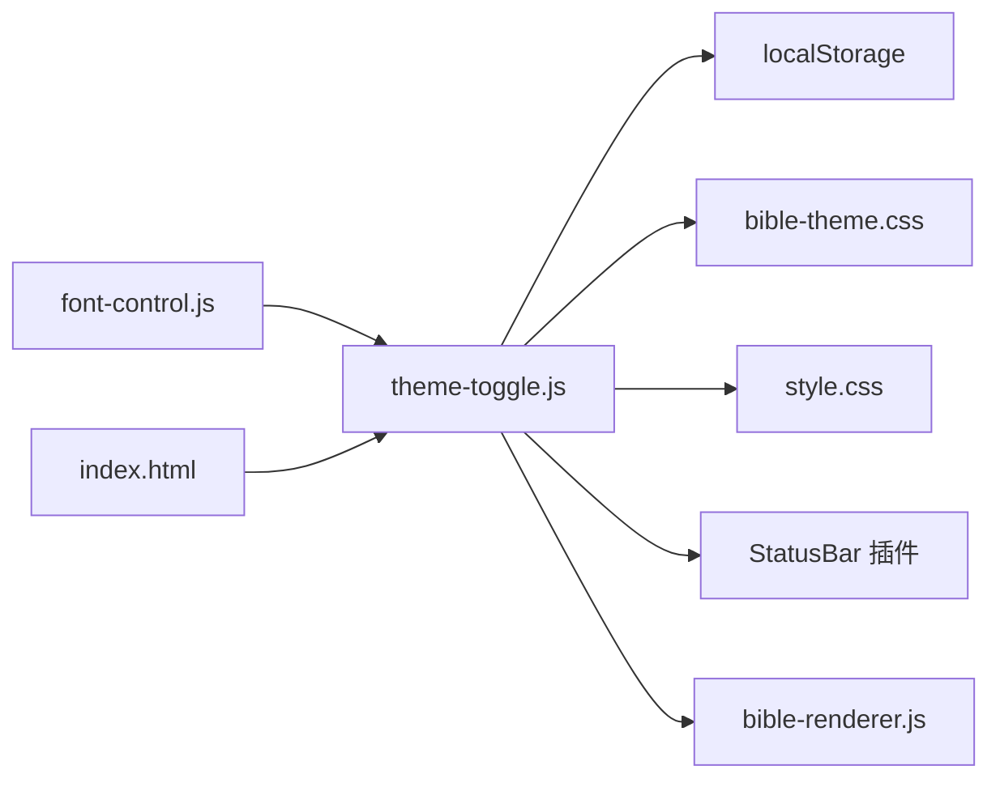

# 个性化设置

<cite>
**本文档引用的文件**
- [theme-toggle.js](file://src/static/js/theme-toggle.js)
- [font-control.js](file://src/static/js/font-control.js)
- [bible-theme.css](file://src/static/css/bible-theme.css)
- [style.css](file://src/static/css/style.css)
- [index.html](file://src/static/index.html)
</cite>

## 目录
1. [简介](#简介)
2. [项目结构](#项目结构)
3. [核心组件](#核心组件)
4. [架构总览](#架构总览)
5. [详细组件分析](#详细组件分析)
6. [依赖关系分析](#依赖关系分析)
7. [性能考虑](#性能考虑)
8. [故障排除指南](#故障排除指南)
9. [结论](#结论)
10. [附录](#附录)

## 简介
本文件面向“个性化设置”功能，系统性阐述主题切换系统、字体控制、内容显示开关与设置面板的实现原理与使用方法。重点包括：
- 主题切换系统：5 种阅读主题的设计理念、CSS 变量驱动的动态切换、用户偏好的本地持久化。
- 字体控制：字号调节的响应式设计、实时预览、跨设备一致性保障。
- 内容显示开关：showTheme、showFootnotes 等开关的状态管理与序列化存储。
- 设置面板交互：滑块、开关、按钮的事件处理与用户体验优化。
- 扩展指南：新增主题、自定义显示选项、集成用户偏好同步服务。

## 项目结构
个性化设置涉及以下关键文件：
- 主题与字体控制：src/static/js/theme-toggle.js
- 底部工具栏字体控制联动：src/static/js/font-control.js
- 主题样式与变量：src/static/css/bible-theme.css、src/static/css/style.css
- 页面入口与初始化：src/static/index.html

图表来源
- [index.html](file://src/static/index.html)
- [theme-toggle.js](file://src/static/js/theme-toggle.js)
- [bible-theme.css](file://src/static/css/bible-theme.css)
- [style.css](file://src/static/css/style.css)
- [font-control.js](file://src/static/js/font-control.js)

章节来源
- [index.html](file://src/static/index.html)
- [theme-toggle.js](file://src/static/js/theme-toggle.js)
- [bible-theme.css](file://src/static/css/bible-theme.css)
- [style.css](file://src/static/css/style.css)
- [font-control.js](file://src/static/js/font-control.js)

## 核心组件
- 主题切换模块：负责主题选择、系统深浅色跟随、状态栏颜色同步、面板 UI 更新与持久化。
- 字体控制模块：提供滑块与底部工具栏按钮两种入口，统一管理字号级别与实时应用。
- 内容显示开关：集中管理 showTheme、showIntro、showOutline、showFootnotes、showBeads、showVerseDivider 等开关状态。
- 设置面板：包含主题色卡、字体大小滑块、朗读速度滑块、内容与数据操作区、偏好设置行等。

章节来源
- [theme-toggle.js](file://src/static/js/theme-toggle.js)
- [bible-theme.css](file://src/static/css/bible-theme.css)
- [style.css](file://src/static/css/style.css)
- [font-control.js](file://src/static/js/font-control.js)

## 架构总览
个性化设置采用“CSS 变量 + 本地存储”的轻量架构：
- CSS 变量：通过 [data-theme] 属性切换，主题样式与组件样式完全解耦。
- 本地存储：readingTheme、globalFontSize、bible_toggles、speechRate 等键值持久化用户偏好。
- 事件驱动：滑块、开关、按钮事件触发状态更新与 UI 同步。

图表来源
- [theme-toggle.js](file://src/static/js/theme-toggle.js)
- [font-control.js](file://src/static/js/font-control.js)

## 详细组件分析

### 主题切换系统
- 主题集合与默认值：支持 gray-white、light-yellow、warm-yellow、dark-gray、night 五种主题，系统深浅色跟随时默认使用 warm-yellow 或 dark-gray。
- CSS 变量驱动：每个主题在 [data-theme="..."] 上定义一组 CSS 变量，组件样式通过 var(--xxx) 读取，实现主题级统一切换。
- 状态栏颜色同步：根据主题映射 meta[name="theme-color"] 与 StatusBar 插件，确保状态栏图标适配。
- 用户偏好持久化：readingTheme 与系统偏好冲突时优先使用用户选择；支持旧版主题键兼容迁移。
- 面板 UI 同步：选中主题的色卡边框高亮，bible-renderer 的主题色卡也同步状态。

图表来源
- [theme-toggle.js](file://src/static/js/theme-toggle.js)

章节来源
- [theme-toggle.js](file://src/static/js/theme-toggle.js)
- [bible-theme.css](file://src/static/css/bible-theme.css)

### 字体控制功能
- 字号级别：14、16、18、20、22 五级，索引 0~4 对应。
- 两种入口：
  - 设置面板滑块：实时预览，滑动即应用。
  - 底部工具栏按钮：通过 font-control.js 调用全局 CXFontControl，实现减小/增大/重置。
- 实现机制：将字号写入 globalFontSize，并同时设置 body 的 font-size 与 CSS 变量 --bible-font-size，确保组件样式一致。
- 响应式设计：在不同断点下，字号与行高、边距等配合基础样式实现一致阅读体验。

图表来源
- [theme-toggle.js](file://src/static/js/theme-toggle.js)
- [font-control.js](file://src/static/js/font-control.js)

章节来源
- [theme-toggle.js](file://src/static/js/theme-toggle.js)
- [font-control.js](file://src/static/js/font-control.js)
- [style.css](file://src/static/css/style.css)

### 内容显示开关
- 开关集合：showTheme、showIntro、showOutline、showFootnotes、showBeads、showVerseDivider。
- 状态管理：集中于 _toggleDefaults，提供 get/set/序列化 API，与 bible-renderer 的内部状态同步。
- 持久化：bible_toggles 键保存开关状态，支持加载与保存。
- 面板集成：设置面板中以开关形式呈现，选中态与本地存储双向同步。

图表来源
- [theme-toggle.js](file://src/static/js/theme-toggle.js)

章节来源
- [theme-toggle.js](file://src/static/js/theme-toggle.js)

### 设置面板交互设计
- 主题色卡：点击色卡即时切换主题，边框高亮标识当前主题。
- 字体滑块：两端标签“A”，中间显示当前像素值，拖动实时应用。
- 朗读速度：范围 50~200，步进 25，显示倍数，支持运行中切换。
- 内容与数据：提供“我的书签”、“清理数据”、“检查更新”、“使用说明”、“问题反馈”等快捷入口。
- 偏好设置：自动检查更新开关，基于本地存储状态。
- 交互细节：点击面板外部或按 ESC 关闭；面板打开时锁定页面滚动；返回键栈支持逐层关闭。

章节来源
- [theme-toggle.js](file://src/static/js/theme-toggle.js)
- [bible-theme.css](file://src/static/css/bible-theme.css)
- [style.css](file://src/static/css/style.css)

### 个性化设置扩展指南
- 添加新主题
  - 在 CSS 中新增 [data-theme="your-theme"] 区块，定义所需 CSS 变量。
  - 在 theme-toggle.js 的 VALID_THEMES 与 themeMetaColors 中注册新主题名称与状态栏颜色。
  - 如需深色主题适配状态栏图标，加入 darkThemes 映射。
- 自定义显示选项
  - 在 _toggleKeys 与 _toggleDefaults 中添加新开关键与默认值。
  - 在设置面板 HTML 中增加对应的开关控件，绑定 data-toggle 属性。
  - 通过 window.CX.setToggleState/getToggleState 管理状态并在需要时同步到渲染器。
- 集成用户偏好同步服务
  - 在现有 localStorage 写入点（如 readingTheme、globalFontSize、speechRate、bible_toggles）之外，增加云端同步逻辑。
  - 建议在用户登录后拉取云端配置，合并本地默认值后写入本地存储，随后触发 UI 同步。
  - 注意：保持与现有键名兼容，避免破坏本地持久化。

章节来源
- [theme-toggle.js](file://src/static/js/theme-toggle.js)
- [bible-theme.css](file://src/static/css/bible-theme.css)

## 依赖关系分析
- theme-toggle.js 依赖：
  - localStorage：持久化主题、字体、开关、朗读速度等。
  - CSS 变量：bible-theme.css 定义主题变量，style.css 提供通用变量。
  - Capacitor StatusBar 插件：状态栏颜色与样式同步。
  - window.CX、window.CXSpeech、window.CXBible 等外部模块：面板公开 API 供其他模块调用。
- font-control.js 依赖：
  - theme-toggle.js 暴露的全局字体控制对象 CXFontControl。
- index.html 依赖：
  - 在页面初始化阶段设置 [data-theme]，避免主题闪烁。
  - 注入全局环境检测与 SPA 切换逻辑。

图表来源
- [theme-toggle.js](file://src/static/js/theme-toggle.js)
- [font-control.js](file://src/static/js/font-control.js)
- [bible-theme.css](file://src/static/css/bible-theme.css)
- [style.css](file://src/static/css/style.css)
- [index.html](file://src/static/index.html)

章节来源
- [theme-toggle.js](file://src/static/js/theme-toggle.js)
- [font-control.js](file://src/static/js/font-control.js)
- [bible-theme.css](file://src/static/css/bible-theme.css)
- [style.css](file://src/static/css/style.css)
- [index.html](file://src/static/index.html)

## 性能考虑
- CSS 变量切换成本低：仅改变属性值，避免重排与重绘。
- 本地存储读写：在面板初始化与用户操作时进行，避免频繁写入。
- 滑块事件节流：滑动过程实时应用，无需额外防抖。
- 状态栏同步：仅在主题切换时触发，避免高频调用。
- 建议：对大量开关状态的批量更新，可在 UI 层合并渲染，减少 DOM 操作次数。

## 故障排除指南
- 主题未生效
  - 检查 [data-theme] 是否正确设置；确认主题名称在 VALID_THEMES 中。
  - 查看 localStorage 中 readingTheme 是否被覆盖。
- 字号不变化
  - 确认 handleFontSliderChange 与 CXFontControl 调用链是否正常。
  - 检查 body.style.fontSize 与 CSS 变量 --bible-font-size 是否同步更新。
- 开关状态不同步
  - 确认 _toggleKeys 与 _toggleDefaults 是否包含该开关。
  - 检查 localStorage 中 bible_toggles 的序列化与解析。
- 状态栏颜色异常
  - 检查 themeMetaColors 映射与 StatusBar 插件调用。
- 清理数据后仍残留
  - 确认清理流程是否保留了关键键（如 readingTheme、globalFontSize、cx_first_use）。

章节来源
- [theme-toggle.js](file://src/static/js/theme-toggle.js)

## 结论
个性化设置通过“CSS 变量 + 本地存储 + 事件驱动”的简洁架构，实现了主题、字体与显示选项的灵活定制与持久化。其模块化设计便于扩展新主题与显示选项，同时保持良好的跨设备一致性与用户体验。

## 附录
- 关键 API（window.CX）
  - setTheme(themeName)：切换主题
  - setFontSize(level)：设置字号级别
  - getToggleState(key)/setToggleState(key, value)：读写单个开关
  - getAllToggleStates()：读取所有开关状态
  - getCurrentTheme()/getAvailableThemes()：查询主题信息
- 常用键名
  - readingTheme：当前主题
  - globalFontSize：全局字号
  - speechRate：朗读速度百分比
  - bible_toggles：内容显示开关集合

章节来源
- [theme-toggle.js](file://src/static/js/theme-toggle.js)