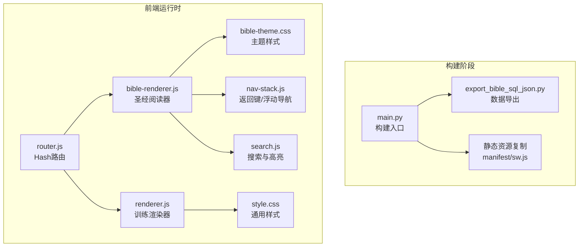
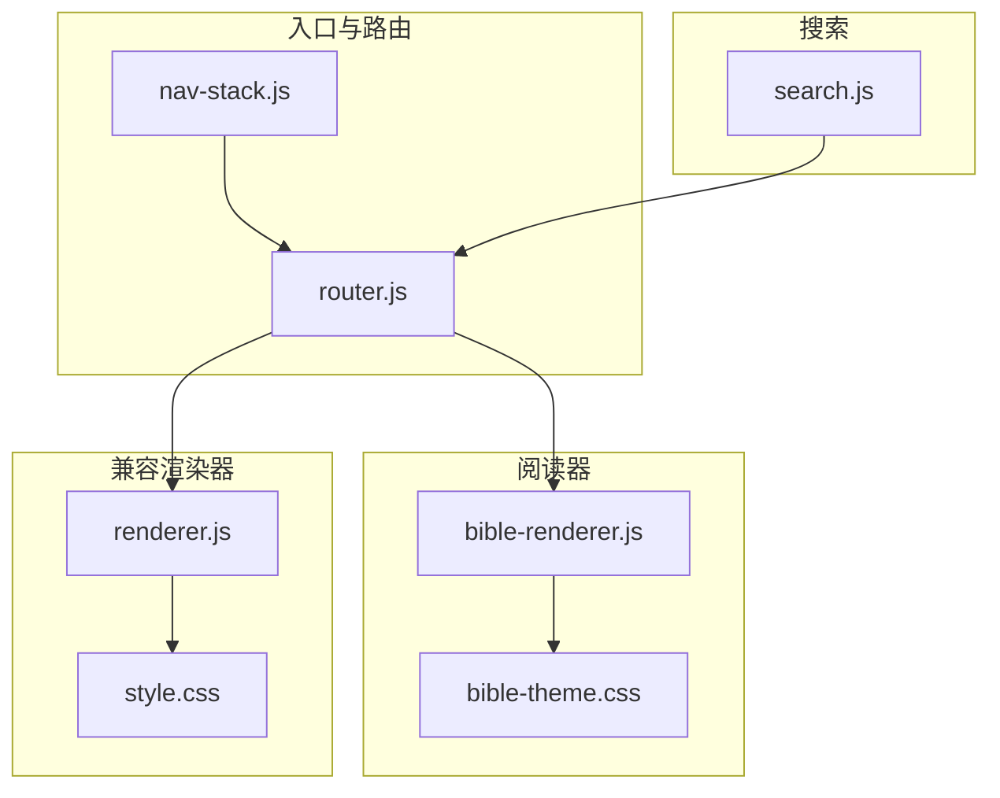
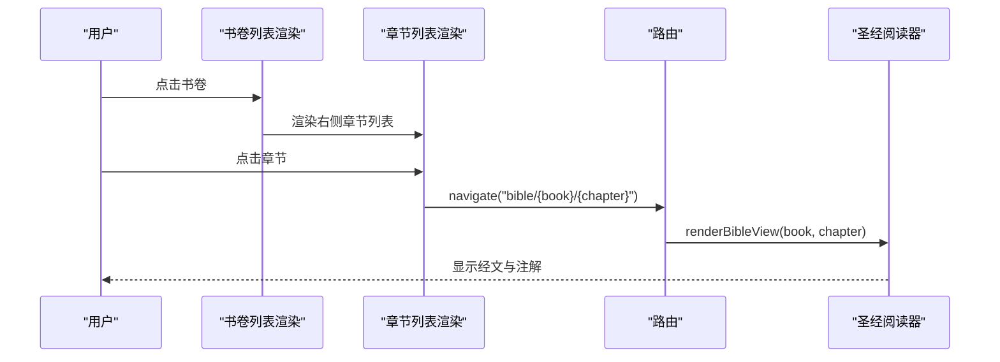
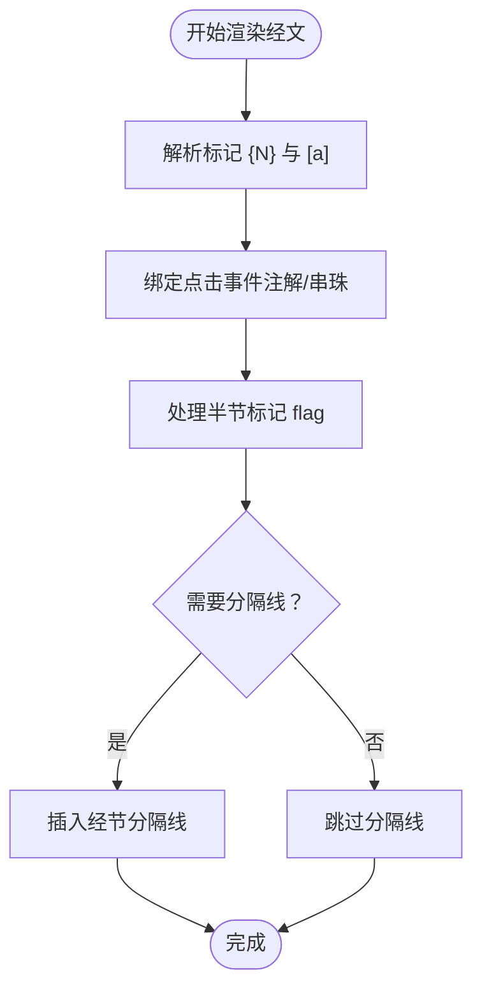
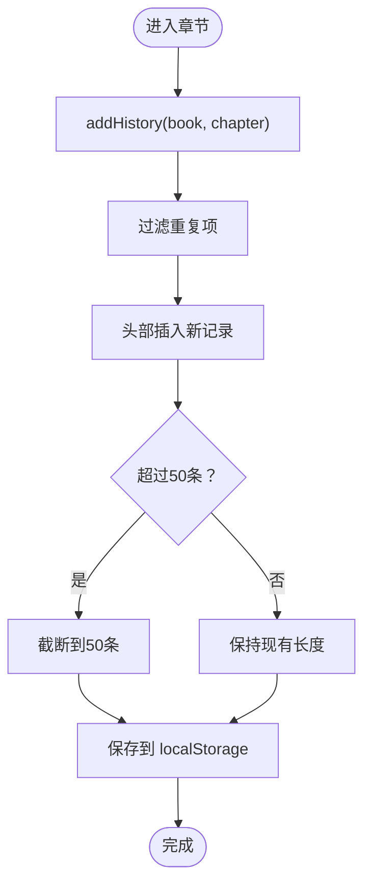
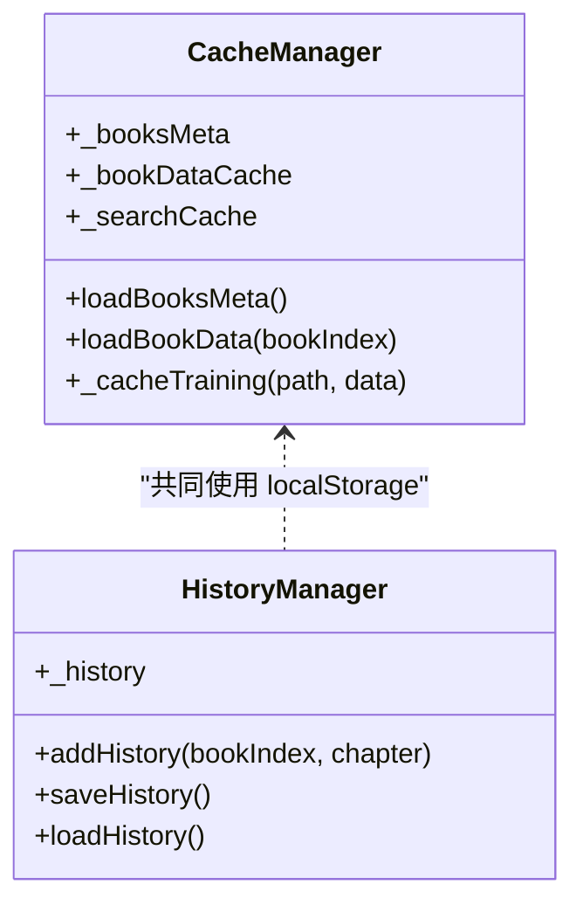
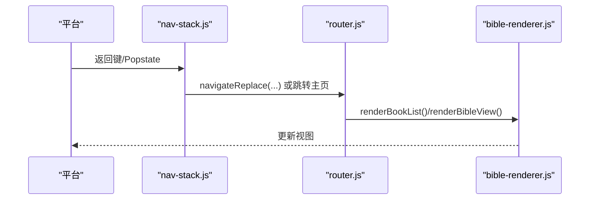
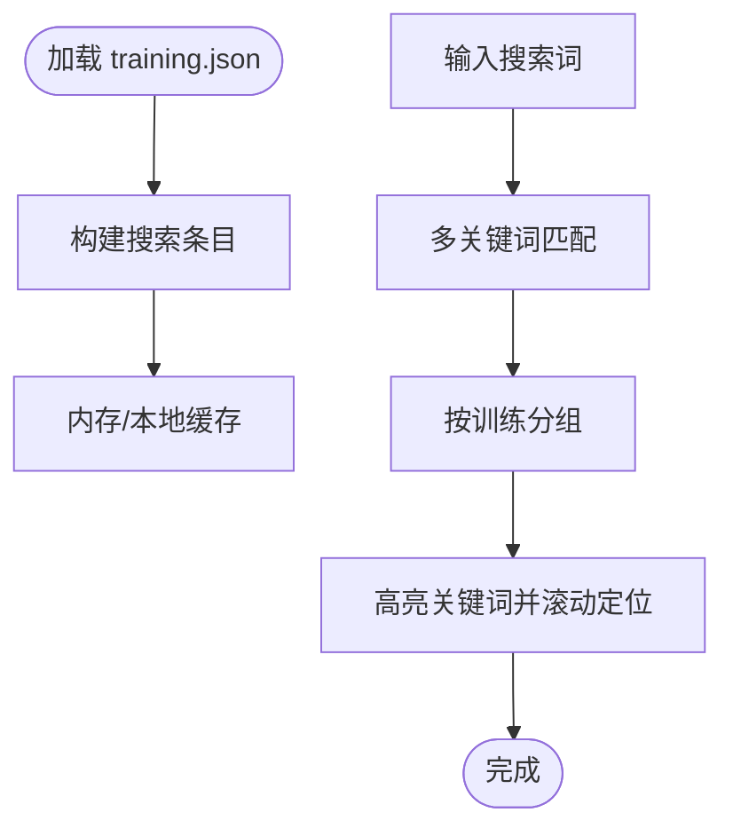
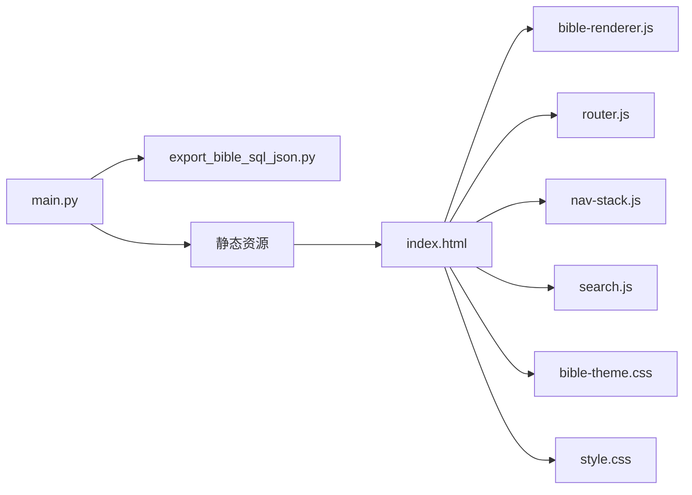

# 圣经阅读引擎

<cite>
**本文档引用的文件**
- [main.py](file://main.py)
- [export_bible_sql_json.py](file://export_bible_sql_json.py)
- [bible-renderer.js](file://src/static/js/bible-renderer.js)
- [renderer.js](file://src/static/js/renderer.js)
- [router.js](file://src/static/js/router.js)
- [nav-stack.js](file://src/static/js/nav-stack.js)
- [search.js](file://src/static/js/search.js)
- [bible-theme.css](file://src/static/css/bible-theme.css)
- [style.css](file://src/static/css/style.css)
- [app_config.json](file://app_config.json)
</cite>

## 目录
1. [简介](#简介)
2. [项目结构](#项目结构)
3. [核心组件](#核心组件)
4. [架构总览](#架构总览)
5. [详细组件分析](#详细组件分析)
6. [依赖关系分析](#依赖关系分析)
7. [性能考虑](#性能考虑)
8. [故障排查指南](#故障排查指南)
9. [结论](#结论)
10. [附录](#附录)

## 简介
本项目是一个基于静态资源的圣经阅读引擎，采用前端 SPA 架构，支持书卷导航、章节阅读、注解与串珠解析、历史记录管理、缓存系统以及响应式主题切换。构建流程通过 Python 脚本从 SQLite 数据库导出 JSON 数据，生成静态站点并打包为 PWA/APK。

## 项目结构
- 构建与数据导出
  - 构建脚本：负责复制静态资源、生成清单与 Service Worker、注入版本与远程配置
  - 数据导出：从 SQLite 导出经文、注解、串珠、书卷元数据与分卷 JSON
- 前端渲染
  - 圣经阅读器：书卷导航、章节渲染、注解/串珠弹层、设置面板
  - 训练内容渲染器：用于特会信息合集的章节渲染（兼容）
  - 路由与导航栈：Hash 路由、返回键处理、浮动导航栏
  - 搜索：全文检索、结果高亮、定位跳转
  - 样式：主题系统、双栏布局、响应式设计

**图表来源**
- [main.py](file://main.py)
- [export_bible_sql_json.py](file://export_bible_sql_json.py)
- [router.js](file://src/static/js/router.js)
- [bible-renderer.js](file://src/static/js/bible-renderer.js)
- [renderer.js](file://src/static/js/renderer.js)
- [bible-theme.css](file://src/static/css/bible-theme.css)
- [style.css](file://src/static/css/style.css)

**章节来源**
- [main.py](file://main.py)
- [export_bible_sql_json.py](file://export_bible_sql_json.py)

## 核心组件
- 书卷导航与双栏布局
  - 左侧书卷列表、右侧章节列表，支持旧约/新约分页与标签页切换
  - 点击书卷后动态渲染对应章节列表
- 经文渲染与标记解析
  - 解析 {N} 注解标记与 [a] 串珠标记，生成上标引用并绑定点击事件
  - 支持半节标记（上/下/中）的特殊显示逻辑
- 历史记录管理
  - 使用 localStorage 存储浏览历史，限制长度并去重
- 缓存系统
  - 书卷元数据缓存（bible-books.json）
  - 章节数据缓存（按书卷索引缓存 JSON）
  - 搜索缓存（内存 + LocalForage）
- 路由与导航
  - Hash 路由，支持同书卷章节切换与跨层级跳转
  - 返回键处理（Capacitor/PWA），浮动导航栏与底部控制栏
- 搜索与高亮
  - 全文检索、结果分组、高亮关键词、定位到段落

**章节来源**
- [bible-renderer.js](file://src/static/js/bible-renderer.js)
- [router.js](file://src/static/js/router.js)
- [nav-stack.js](file://src/static/js/nav-stack.js)
- [search.js](file://src/static/js/search.js)

## 架构总览
前端采用模块化设计，核心模块通过 window 对象暴露全局 API，模块间通过事件与回调协作。构建阶段将数据与静态资源打包，运行时通过路由驱动视图切换。

**图表来源**
- [router.js](file://src/static/js/router.js)
- [nav-stack.js](file://src/static/js/nav-stack.js)
- [bible-renderer.js](file://src/static/js/bible-renderer.js)
- [renderer.js](file://src/static/js/renderer.js)
- [bible-theme.css](file://src/static/css/bible-theme.css)
- [style.css](file://src/static/css/style.css)
- [search.js](file://src/static/js/search.js)

## 详细组件分析

### 书卷导航系统（双栏布局）
- 双栏结构
  - 左侧书卷列表：按旧约/新约分页，支持标签页切换
  - 右侧章节列表：根据所选书卷动态生成
- 事件绑定
  - 标签页切换、 Testament 切换、书卷点击、章节点击
  - 点击章节后通过路由跳转至阅读视图
- 历史记录
  - 每次进入章节时添加历史项，限制长度并去重保存

**图表来源**
- [bible-renderer.js](file://src/static/js/bible-renderer.js)
- [router.js](file://src/static/js/router.js)

**章节来源**
- [bible-renderer.js](file://src/static/js/bible-renderer.js)

### 经文渲染算法（{N} 注解与 [a] 串珠）
- 标记解析
  - {N} → 注解上标，携带经文键与注解序号
  - [a] → 串珠上标，携带经文键与串珠字母
- 事件绑定
  - 点击注解上标 → 打开注解弹层
  - 点击串珠上标 → 打开串珠弹层
- 半节显示
  - 根据 flag 字段（1/2/3）决定是否渲染分隔线与特殊类名

**图表来源**
- [bible-renderer.js](file://src/static/js/bible-renderer.js)

**章节来源**
- [bible-renderer.js](file://src/static/js/bible-renderer.js)

### 历史记录管理机制
- 结构
  - 数组存储：{ bookIndex, chapter, time }
  - 本地持久化：localStorage
- 策略
  - 去重：相同书卷与章节不重复添加
  - 截断：最多保留 50 条
  - 添加：每次进入章节时调用 addHistory

**图表来源**
- [bible-renderer.js](file://src/static/js/bible-renderer.js)

**章节来源**
- [bible-renderer.js](file://src/static/js/bible-renderer.js)

### 缓存系统设计
- 书卷元数据缓存
  - 首次加载后缓存 bible-books.json
- 章节数据缓存
  - 按书卷索引缓存（bookIndex → data）
  - 回退策略：当分卷 JSON 不存在时回退到全量 JSON
- 搜索缓存
  - 内存缓存：path → entries[]
  - LocalForage：持久化缓存，结合版本号校验

**图表来源**
- [bible-renderer.js](file://src/static/js/bible-renderer.js)
- [search.js](file://src/static/js/search.js)

**章节来源**
- [bible-renderer.js](file://src/static/js/bible-renderer.js)
- [search.js](file://src/static/js/search.js)

### 路由与导航栈
- Hash 路由
  - #/ → 主页（书卷导航）
  - #/bible/{book}/{chapter} → 圣经阅读
  - #/settings → 设置面板
- 返回键处理
  - Capacitor：backButton 事件
  - PWA：popstate 事件，忽略启动后短暂的虚假事件
- 浮动导航栏
  - 内容页滚动隐藏，空白处点击显示
  - 同步页面 tab 栏与底部控制栏

**图表来源**
- [nav-stack.js](file://src/static/js/nav-stack.js)
- [router.js](file://src/static/js/router.js)
- [bible-renderer.js](file://src/static/js/bible-renderer.js)

**章节来源**
- [router.js](file://src/static/js/router.js)
- [nav-stack.js](file://src/static/js/nav-stack.js)

### 搜索与高亮
- 索引构建
  - 从 training.json 提取段落，按视图类型（h/cv/cx/zs）扁平化
  - 支持本地导入训练路径与缓存路径过滤
- 搜索策略
  - 多关键词 AND 子串匹配，按训练分组显示
  - 本训练优先，本篇条目优先
- 高亮与定位
  - 目标页加载后高亮关键词，滚动到匹配段落
  - 支持晨读 day-page 的定位

**图表来源**
- [search.js](file://src/static/js/search.js)

**章节来源**
- [search.js](file://src/static/js/search.js)

## 依赖关系分析
- 构建期
  - main.py 依赖 export_bible_sql_json.py 输出数据文件
  - 构建产物包含静态资源、manifest.json、sw.js
- 运行期
  - router.js 依赖全局 CXRouter
  - bible-renderer.js 依赖 window.CXBible
  - search.js 依赖 LocalForage 与 Cache Storage
  - 样式依赖 CSS 变量与主题切换

**图表来源**
- [main.py](file://main.py)
- [export_bible_sql_json.py](file://export_bible_sql_json.py)
- [bible-renderer.js](file://src/static/js/bible-renderer.js)
- [router.js](file://src/static/js/router.js)
- [nav-stack.js](file://src/static/js/nav-stack.js)
- [search.js](file://src/static/js/search.js)
- [bible-theme.css](file://src/static/css/bible-theme.css)
- [style.css](file://src/static/css/style.css)

**章节来源**
- [main.py](file://main.py)
- [export_bible_sql_json.py](file://export_bible_sql_json.py)

## 性能考虑
- 数据加载
  - 书卷元数据与章节数据缓存，减少重复请求
  - 分卷 JSON 优先，全量 JSON 作为回退
- 渲染优化
  - 注解/串珠弹层按需打开，避免一次性渲染大量 DOM
  - 搜索结果分批加载，提升首屏性能
- 移动端体验
  - 浮动导航栏与底部控制栏减少滚动与点击距离
  - 响应式主题与字体大小可调，适配不同设备

## 故障排查指南
- 构建失败
  - 确认 SQLite 数据库路径正确，输出目录可写
  - 检查版本与远程配置生成是否成功
- 运行时错误
  - 检查网络请求是否被缓存策略阻断（Capacitor 无 SW）
  - 查看浏览器控制台是否有 CORS 或资源加载错误
- 历史记录异常
  - 清理 localStorage 中的 bible_history，确认格式正确
- 搜索无结果
  - 确认训练索引已缓存，检查 LocalForage 是否可用
  - 验证 training.json 结构与 search.js 的解析逻辑

**章节来源**
- [main.py](file://main.py)
- [bible-renderer.js](file://src/static/js/bible-renderer.js)
- [search.js](file://src/static/js/search.js)

## 结论
本圣经阅读引擎通过清晰的模块划分与缓存策略，实现了高效的书卷导航、灵活的经文渲染与丰富的交互体验。构建流程自动化，便于维护与扩展。未来可在以下方面持续优化：增加收藏功能、增强搜索精度、引入增量更新与离线能力。

## 附录

### 代码示例路径（如何扩展）
- 扩展显示选项
  - 在设置面板中添加新的开关项，更新 localStorage 并应用到渲染逻辑
  - 示例路径：[设置面板渲染](file://src/static/js/bible-renderer.js)
- 自定义渲染逻辑
  - 在 renderBibleView 中扩展元数据、主题摘要、纲目等区块
  - 示例路径：[经文渲染与区块](file://src/static/js/bible-renderer.js)
- 新增主题
  - 在主题样式中添加新的 CSS 变量与选择器
  - 示例路径：[主题样式](file://src/static/css/bible-theme.css)
- 新增导航视图
  - 在 router.js 中注册新的路由与渲染函数
  - 示例路径：[路由定义](file://src/static/js/router.js)