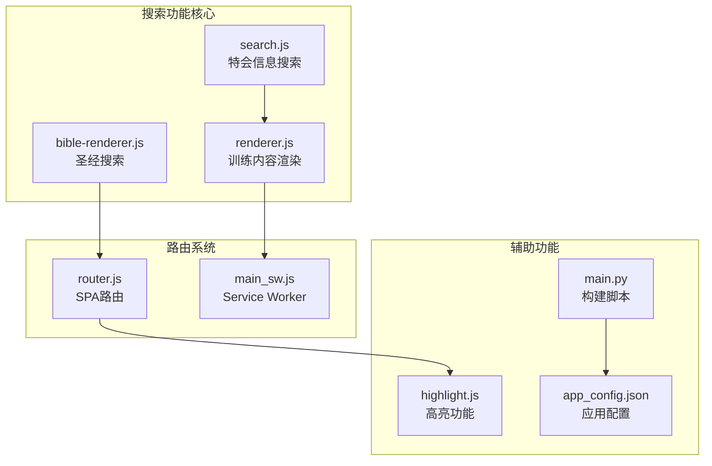
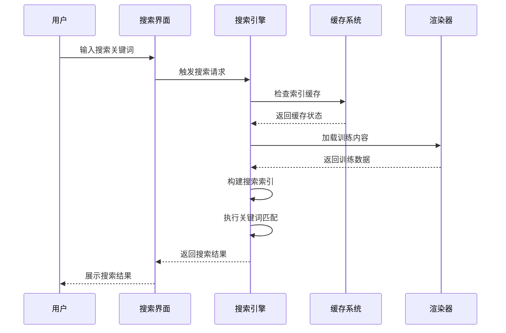
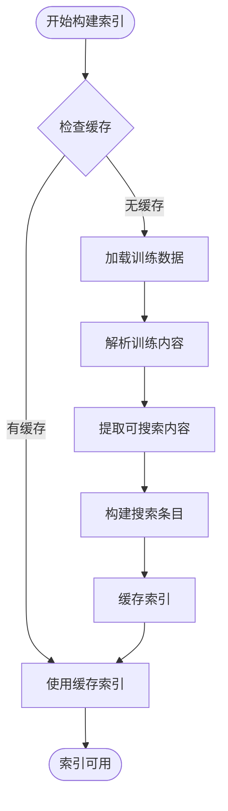
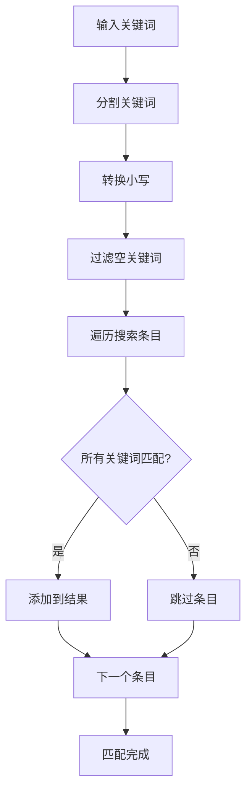
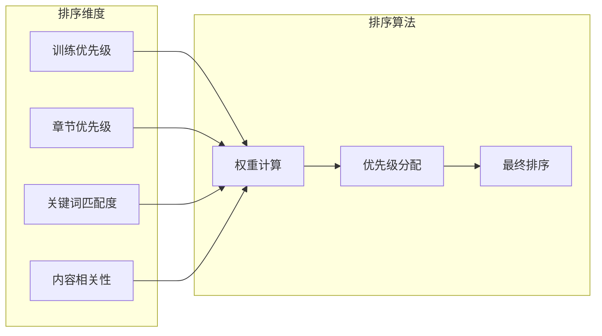
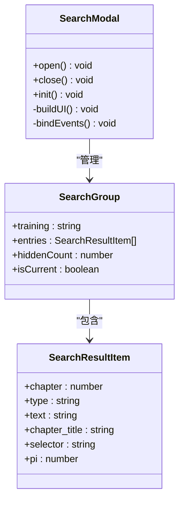
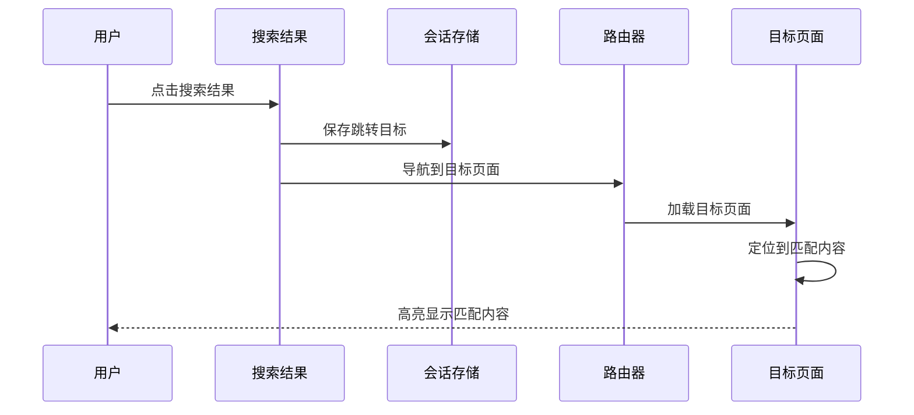
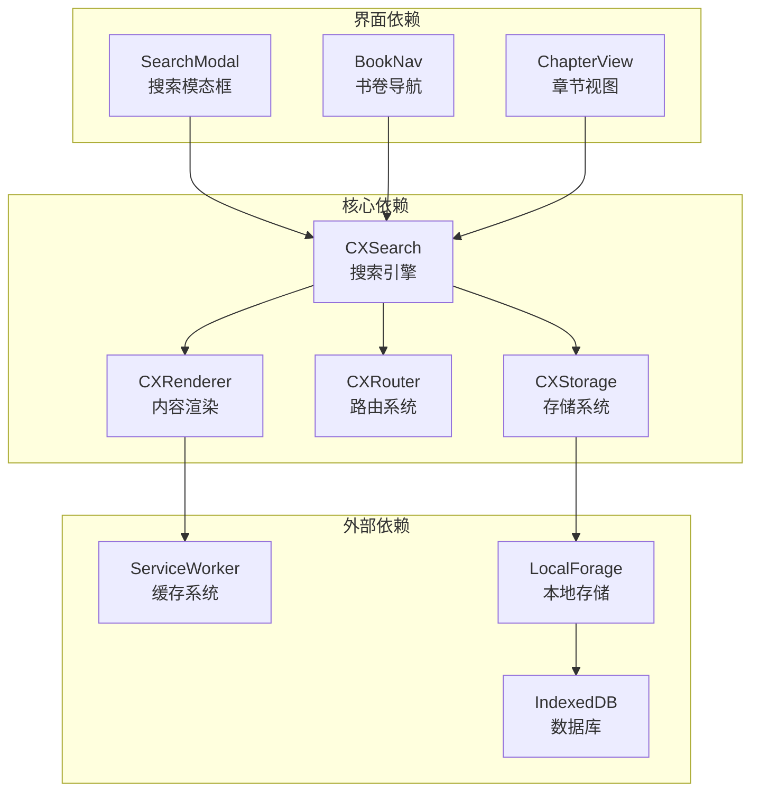
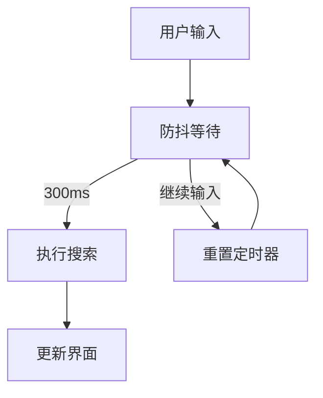

# 搜索功能

<cite>
**本文档引用的文件**
- [search.js](file://src/static/js/search.js)
- [bible-renderer.js](file://src/static/js/bible-renderer.js)
- [renderer.js](file://src/static/js/renderer.js)
- [router.js](file://src/static/js/router.js)
- [main_sw.js](file://src/templates/main_sw.js)
- [highlight.js](file://src/static/js/highlight.js)
- [main.py](file://main.py)
- [app_config.json](file://app_config.json)
- [book-names-i18n.json](file://src/static/data/book-names-i18n.json)
</cite>

## 目录
1. [简介](#简介)
2. [项目结构](#项目结构)
3. [核心组件](#核心组件)
4. [架构概览](#架构概览)
5. [详细组件分析](#详细组件分析)
6. [依赖关系分析](#依赖关系分析)
7. [性能考虑](#性能考虑)
8. [故障排除指南](#故障排除指南)
9. [结论](#结论)

## 简介

搜索功能是圣经阅读器中的核心特性之一，提供了全文搜索能力，支持在特会信息合集的各种内容中进行快速检索。该功能实现了智能的搜索索引构建、高效的关键词匹配算法、灵活的结果排序机制，以及完善的搜索界面设计。

搜索功能主要分为两大模块：
- **特会信息合集搜索**：基于 `search.js` 实现，支持训练内容的全文搜索
- **圣经经文搜索**：基于 `bible-renderer.js` 实现，支持圣经经文和注解的搜索

## 项目结构

搜索功能相关的文件组织如下：

**图表来源**
- [search.js:1-1086](file://src/static/js/search.js#L1-L1086)
- [bible-renderer.js:1-880](file://src/static/js/bible-renderer.js#L1-L880)
- [renderer.js:1-1471](file://src/static/js/renderer.js#L1-L1471)

**章节来源**
- [search.js:1-1086](file://src/static/js/search.js#L1-L1086)
- [bible-renderer.js:1-880](file://src/static/js/bible-renderer.js#L1-L880)
- [renderer.js:1-1471](file://src/static/js/renderer.js#L1-L1471)

## 核心组件

### 搜索引擎核心 (CXSearch)

`search.js` 中的 `CXSearch` 对象是整个搜索功能的核心，负责：

- **搜索索引管理**：动态构建和缓存搜索索引
- **关键词匹配**：实现多关键词 AND 匹配算法
- **结果排序**：根据搜索上下文进行智能排序
- **UI 界面**：提供模态框搜索界面

### 圣经搜索组件 (CXBible)

`bible-renderer.js` 中的 `CXBible` 对象提供圣经经文搜索功能：

- **搜索输入框**：集成在书卷导航界面
- **搜索结果展示**：支持经文、注解、串珠的搜索
- **快速跳转**：实现搜索结果的快速导航

### 训练内容渲染器 (CXRenderer)

`renderer.js` 中的 `CXRenderer` 负责训练内容的渲染和搜索索引的缓存：

- **内容提取**：从训练 JSON 中提取可搜索内容
- **索引缓存**：将搜索索引存储到本地缓存
- **视图渲染**：渲染各种训练视图

**章节来源**
- [search.js:20-1086](file://src/static/js/search.js#L20-L1086)
- [bible-renderer.js:140-320](file://src/static/js/bible-renderer.js#L140-L320)
- [renderer.js:41-103](file://src/static/js/renderer.js#L41-L103)

## 架构概览

搜索功能采用分层架构设计，实现了内容分离和功能解耦：

**图表来源**
- [search.js:773-808](file://src/static/js/search.js#L773-L808)
- [renderer.js:49-102](file://src/static/js/renderer.js#L49-L102)

### 搜索流程

1. **用户交互**：用户在搜索框中输入关键词
2. **防抖处理**：等待 300ms 稳定输入
3. **索引加载**：从缓存或网络加载搜索索引
4. **关键词匹配**：执行 AND 匹配算法
5. **结果排序**：根据上下文进行智能排序
6. **界面渲染**：展示搜索结果和高亮关键词

**章节来源**
- [search.js:1015-1030](file://src/static/js/search.js#L1015-L1030)
- [search.js:380-461](file://src/static/js/search.js#L380-L461)

## 详细组件分析

### 搜索索引构建策略

搜索索引的构建采用了"懒加载 + 缓存"的策略：

**图表来源**
- [search.js:48-186](file://src/static/js/search.js#L48-L186)
- [renderer.js:49-102](file://src/static/js/renderer.js#L49-L102)

#### 内容提取策略

系统从训练内容中提取以下类型的文本：

- **听抄内容** (`type: 'h'`)：信息讲稿的正文内容
- **纲目内容** (`type: 'cv'`)：训练的大纲和要点
- **晨读内容** (`type: 'cx'`)：晨兴喂养和信息选读
- **职事摘录** (`type: 'zs'`)：职事信息的摘录内容

每个内容类型都有特定的提取规则和优先级：

**章节来源**
- [search.js:48-176](file://src/static/js/search.js#L48-L176)
- [renderer.js:563-559](file://src/static/js/renderer.js#L563-L559)

### 关键词匹配算法

搜索采用多关键词 AND 匹配算法：

**图表来源**
- [search.js:380-400](file://src/static/js/search.js#L380-L400)

#### 匹配优先级控制

搜索结果按照以下优先级排序：

1. **当前训练优先**：用户当前所在训练的内容优先显示
2. **当前章节优先**：在同一训练内，当前章节的内容优先
3. **训练出现顺序**：按训练在队列中的出现顺序排列
4. **每组条目限制**：每个训练最多显示 5 条结果

**章节来源**
- [search.js:360-461](file://src/static/js/search.js#L360-L461)
- [search.js:410-458](file://src/static/js/search.js#L410-L458)

### 搜索结果排序机制

搜索结果采用多维度排序策略：

**图表来源**
- [search.js:410-458](file://src/static/js/search.js#L410-L458)

#### 结果分组策略

搜索结果按训练批次进行分组显示：

- **分组标识**：使用训练的季节标签作为分组键
- **分组顺序**：保持训练在队列中的原始顺序
- **分组限制**：每个训练批次最多显示 5 条匹配结果

**章节来源**
- [search.js:386-461](file://src/static/js/search.js#L386-L461)

### 搜索界面设计

搜索界面采用模态框设计，提供完整的用户体验：

**图表来源**
- [search.js:954-1086](file://src/static/js/search.js#L954-L1086)
- [search.js:810-825](file://src/static/js/search.js#L810-L825)

#### 界面组件

- **搜索输入框**：支持实时搜索和防抖处理
- **结果计数器**：显示搜索进度和结果数量
- **结果列表**：滚动显示搜索结果
- **加载按钮**：支持分页加载更多结果

**章节来源**
- [search.js:954-1053](file://src/static/js/search.js#L954-L1053)
- [bible-renderer.js:151-304](file://src/static/js/bible-renderer.js#L151-L304)

### 快速跳转功能

搜索结果支持快速跳转到原文位置：

**图表来源**
- [search.js:487-512](file://src/static/js/search.js#L487-L512)
- [search.js:516-632](file://src/static/js/search.js#L516-L632)

#### 跳转机制

1. **目标存储**：将跳转目标信息存储到 `sessionStorage`
2. **页面导航**：使用路由器导航到目标页面
3. **内容定位**：在目标页面中定位到匹配的内容段落
4. **高亮显示**：对匹配的关键词进行高亮标记

**章节来源**
- [search.js:487-632](file://src/static/js/search.js#L487-L632)

## 依赖关系分析

搜索功能涉及多个模块之间的复杂依赖关系：

**图表来源**
- [search.js:1082-1086](file://src/static/js/search.js#L1082-L1086)
- [renderer.js:154-168](file://src/static/js/renderer.js#L154-L168)
- [router.js:95-151](file://src/static/js/router.js#L95-L151)

### 模块间通信

搜索功能通过以下方式实现模块间通信：

- **事件驱动**：使用 DOM 事件和自定义事件
- **回调函数**：通过回调函数传递数据和状态
- **全局变量**：通过 `window` 对象共享全局状态
- **存储共享**：通过 `sessionStorage` 和 `localStorage` 共享数据

**章节来源**
- [search.js:1005-1053](file://src/static/js/search.js#L1005-L1053)
- [renderer.js:179-232](file://src/static/js/renderer.js#L179-L232)

## 性能考虑

搜索功能在设计时充分考虑了性能优化：

### 防抖处理

搜索输入采用 300ms 防抖策略，避免频繁的搜索请求：

**图表来源**
- [search.js:1015-1029](file://src/static/js/search.js#L1015-L1029)

### 结果缓存

采用多层次缓存策略：

- **内存缓存**：JavaScript 对象缓存
- **IndexedDB 缓存**：持久化存储
- **Service Worker 缓存**：网络层缓存

### 分批加载

搜索结果采用分批加载策略：

- **批次大小**：每次加载 5 个训练批次
- **增量加载**：用户点击"查看更多"时加载更多
- **智能停止**：当收集到足够结果时自动停止

**章节来源**
- [search.js:283-307](file://src/static/js/search.js#L283-L307)
- [search.js:890-938](file://src/static/js/search.js#L890-L938)

### 性能优化技术

- **懒加载**：只在需要时加载搜索索引
- **增量构建**：逐步构建和更新搜索索引
- **智能过滤**：预先过滤可搜索的训练内容
- **内存管理**：及时清理不再使用的索引数据

## 故障排除指南

### 常见问题及解决方案

#### 搜索结果为空

**可能原因**：
- 搜索索引尚未构建完成
- 训练内容未正确加载
- 搜索关键词过于具体

**解决方法**：
1. 确认训练内容已加载完成
2. 检查网络连接状态
3. 尝试使用更宽泛的搜索关键词

#### 搜索速度慢

**可能原因**：
- 搜索索引过大
- 网络延迟
- 设备性能不足

**解决方法**：
1. 清理浏览器缓存
2. 减少同时打开的标签页
3. 重启应用重新构建索引

#### 跳转功能异常

**可能原因**：
- 会话存储权限问题
- 页面导航错误
- 内容定位失败

**解决方法**：
1. 检查浏览器存储权限设置
2. 刷新页面重新加载
3. 手动导航到目标页面

**章节来源**
- [search.js:805-808](file://src/static/js/search.js#L805-L808)
- [search.js:516-632](file://src/static/js/search.js#L516-L632)

### 调试技巧

- **开发者工具**：使用浏览器开发者工具监控网络请求
- **控制台日志**：查看搜索过程中的调试信息
- **缓存检查**：确认搜索索引是否正确缓存
- **性能分析**：使用性能面板分析搜索性能

## 结论

搜索功能通过精心设计的架构和多项性能优化技术，为用户提供了高效、准确的全文搜索体验。系统采用分层设计，实现了内容分离和功能解耦，既支持特会信息合集的深度搜索，也支持圣经经文的精准定位。

主要特点包括：

- **智能索引构建**：采用懒加载和缓存策略，提升搜索效率
- **灵活匹配算法**：支持多关键词 AND 匹配和智能排序
- **完善的界面设计**：提供直观易用的搜索体验
- **强大的性能优化**：通过防抖、缓存、分批加载等技术提升性能
- **可靠的错误处理**：完善的错误处理和故障恢复机制

未来可以考虑的功能扩展包括：支持模糊搜索、添加搜索历史、实现搜索建议、支持高级搜索语法等。